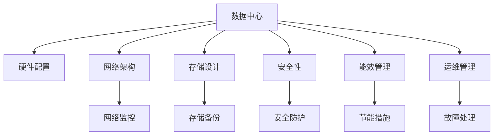

                 

# AI 大模型应用数据中心建设：数据中心运维与管理

## 1. 背景介绍

### 1.1 问题由来
随着人工智能（AI）技术的不断进步，尤其是深度学习和大模型的兴起，AI在各个领域的应用已经从辅助决策逐渐转变为核心驱动力。然而，AI大模型的部署和应用需要大量计算资源和存储空间，对于数据中心的建设和管理提出了新的挑战。

数据中心作为AI大模型应用的物理承载平台，其性能、可靠性和安全性直接影响AI系统的运行效率和用户体验。为了满足大规模AI应用的需求，数据中心需要在硬件、网络、存储、安全等多个方面进行全面升级和优化。本文将从数据中心运维和管理的角度，探讨如何构建高效、可靠、安全的数据中心，以支持AI大模型的应用。

### 1.2 问题核心关键点
数据中心运维和管理是AI大模型应用中的关键环节，涉及硬件配置、网络架构、存储设计、安全性、能效管理等多个方面。高效的数据中心运维和管理不仅能提升AI系统的运行效率，还能确保数据的安全性和AI应用的可靠性。本文将深入探讨这些关键点，为数据中心建设和管理提供实用的建议和指导。

## 2. 核心概念与联系

### 2.1 核心概念概述
为了更好地理解数据中心运维和管理，首先需要对一些核心概念进行概述：

- **数据中心（Data Center, DC）**：由计算、存储、网络和通信设备构成的物理设施，用于支持企业或组织的数据处理和存储需求。
- **人工智能（AI）**：通过机器学习、深度学习等技术，使计算机系统能够模拟人类智能行为，实现自动感知、决策、学习等能力。
- **大模型（Large Model）**：具有巨大参数量、复杂网络结构和高计算需求的深度学习模型，如BERT、GPT等。
- **运维管理（Operations & Maintenance, O&M）**：数据中心日常管理和维护工作，包括硬件监控、软件更新、故障排除等。
- **安全性（Security）**：数据中心的安全防护措施，包括物理安全、网络安全、数据安全等。
- **能效管理（Energy Efficiency Management）**：通过优化数据中心的设计和运行，提高能源利用效率，降低能耗和成本。

这些概念通过以下Mermaid流程图联系起来：



这个流程图展示了数据中心与多个核心概念之间的联系，显示了数据中心的建设和管理需要考虑的多个方面。

## 3. 核心算法原理 & 具体操作步骤

### 3.1 算法原理概述

数据中心运维和管理涉及多个领域的技术，包括但不限于网络工程、硬件工程、系统管理、安全防护等。本文将从这些领域出发，简要概述各自的算法原理。

- **网络工程**：使用基于网络的协议和设备（如路由器、交换机、负载均衡器等），构建高效、可靠的网络架构。核心算法包括OSPF、BGP、TCP/IP等。
- **硬件工程**：选择合适的服务器、存储、网络设备，并进行优化配置，以支持AI大模型的运行。核心算法包括服务器虚拟化、存储RAID、网络负载均衡等。
- **系统管理**：监控和管理数据中心的操作系统、应用程序和设备，确保其稳定运行。核心算法包括服务监控、配置管理、故障诊断等。
- **安全防护**：采用多种技术手段，确保数据中心的安全性和数据的完整性。核心算法包括防火墙、入侵检测系统、加密技术等。
- **能效管理**：通过优化数据中心的能源使用，提高能源利用效率，减少能耗和成本。核心算法包括数据中心冷却系统设计、电力需求响应、节能算法等。

### 3.2 算法步骤详解

**网络架构设计**：

1. **需求分析**：确定数据中心的规模和预期负载，选择适当的硬件设备和网络设备。
2. **网络拓扑设计**：设计网络拓扑，包括核心层、汇聚层和接入层，确保网络的高可用性和扩展性。
3. **路由协议配置**：配置路由协议，如OSPF、BGP，确保网络路径的最优和稳定性。
4. **负载均衡和带宽优化**：配置负载均衡器和带宽优化策略，确保网络流量合理分配和高效传输。
5. **网络监控与故障排除**：部署网络监控工具，实时监控网络状态，及时发现和排除故障。

**硬件配置与优化**：

1. **服务器选择**：根据AI大模型的计算需求，选择适当的服务器类型（如CPU、GPU服务器）。
2. **存储配置**：根据数据中心的数据访问模式，配置合适的存储系统（如SSD、HDD存储）。
3. **虚拟化技术应用**：使用服务器虚拟化技术，提高服务器的利用率和灵活性。
4. **设备优化**：配置网络设备（如交换机、负载均衡器），确保数据中心网络的高性能和高可用性。

**系统管理与优化**：

1. **监控工具部署**：部署监控工具，实时监控数据中心的操作系统和应用程序状态。
2. **配置管理**：建立配置管理系统，确保设备和应用程序的配置一致性。
3. **故障诊断与处理**：建立故障诊断和处理机制，快速定位和解决问题。

**安全防护与优化**：

1. **物理安全**：建立物理访问控制机制，确保数据中心硬件设备的安全。
2. **网络安全**：配置防火墙、入侵检测系统等安全设备，防止网络攻击和数据泄露。
3. **数据安全**：采用加密技术和备份策略，确保数据的安全性和可靠性。

**能效管理与优化**：

1. **能效评估**：对数据中心进行能效评估，识别能耗瓶颈和优化机会。
2. **节能措施**：采用节能技术和设备，如高效电源、冷却系统等，降低数据中心的能耗。
3. **电力需求响应**：优化电力需求响应策略，根据负载情况调整能源使用。

### 3.3 算法优缺点

数据中心运维和管理的算法具有以下优点：

- **高效性**：通过优化网络架构、硬件配置和系统管理，提高了数据中心的运行效率和稳定性。
- **可靠性**：采用多层次的故障诊断和恢复机制，确保数据中心的可靠性和高可用性。
- **安全性**：通过物理安全、网络安全和数据安全等措施，保护数据中心的设备和数据安全。
- **能效性**：通过能效管理，优化数据中心的能源使用，降低能耗和成本。

同时，这些算法也存在一些缺点：

- **复杂性**：数据中心运维和管理涉及多个领域的技术，需要综合考虑多种因素。
- **成本高**：优化数据中心的硬件和网络配置，需要大量的前期投入和维护成本。
- **技术要求高**：数据中心运维和管理需要高水平的技术和专业人才。

尽管存在这些挑战，但数据中心运维和管理在大模型应用中具有不可替代的作用，是确保AI系统稳定运行的重要保障。

### 3.4 算法应用领域

数据中心运维和管理的应用领域非常广泛，以下是几个典型的应用场景：

- **云计算**：为云计算平台提供稳定的计算和存储资源，支持云服务的稳定运行。
- **大数据分析**：支持大规模数据处理和存储需求，确保数据中心的可靠性和能效性。
- **人工智能应用**：支持AI大模型的训练和推理，确保模型的稳定运行和数据安全。
- **物联网**：为物联网设备提供计算和存储支持，支持设备的连接和数据处理。
- **边缘计算**：为边缘设备提供计算资源，支持低延迟数据处理和实时应用。

## 4. 数学模型和公式 & 详细讲解 & 举例说明

### 4.1 数学模型构建

为了更好地理解和设计数据中心，本文将构建几个数学模型，用于量化和分析数据中心的性能和能效。

**网络流量模型**：

假设数据中心的网络流量为 $T$，网络的带宽为 $B$，路由协议的效率为 $\epsilon$，网络延迟为 $D$，则网络流量模型为：

$$ T = B \times \epsilon \times D $$

**能效模型**：

假设数据中心的总能耗为 $E$，电能利用效率为 $\eta$，冷却系统的能耗为 $C$，则能效模型为：

$$ E = E_{电能} + E_{冷却} $$

$$ E_{电能} = P_{总} \times \eta $$

$$ E_{冷却} = C \times \eta_{冷却} $$

其中 $P_{总}$ 为数据中心总功率，$\eta_{冷却}$ 为冷却系统的电能利用效率。

### 4.2 公式推导过程

**网络流量模型推导**：

网络流量 $T$ 与网络带宽 $B$、路由协议效率 $\epsilon$、网络延迟 $D$ 成正比。路由协议效率 $\epsilon$ 的取值通常在0.9到1之间，网络延迟 $D$ 的取值通常在1到10毫秒之间。

**能效模型推导**：

能效 $E$ 分为电能利用效率 $\eta$ 和冷却系统效率 $\eta_{冷却}$。冷却系统效率 $\eta_{冷却}$ 的取值通常在0.7到0.9之间。

### 4.3 案例分析与讲解

以某大型AI数据中心为例，其网络带宽为10 Gbps，路由协议效率为0.95，网络延迟为2毫秒。此时，网络流量模型为：

$$ T = 10 \times 0.95 \times 2 = 19 \, \text{Gbps} $$

该数据中心的总功率为100 kW，电能利用效率为0.8，冷却系统效率为0.8。此时，能效模型为：

$$ E_{电能} = 100 \times 0.8 = 80 \, \text{kW} $$

$$ E_{冷却} = 80 \times 0.8 = 64 \, \text{kW} $$

$$ E = 80 + 64 = 144 \, \text{kW} $$

该数据中心每小时的总能耗为 $144 \times 3600 = 518400 \, \text{Wh}$。

## 5. 项目实践：代码实例和详细解释说明

### 5.1 开发环境搭建

要构建数据中心运维和管理的系统，首先需要搭建开发环境。以下是一些推荐的工具和平台：

1. **Kubernetes**：开源容器编排工具，用于管理多个容器的运行和调度。
2. **Ansible**：自动化运维工具，用于自动化配置和部署数据中心硬件和软件。
3. **Grafana**：开源监控和可视化平台，用于实时监控数据中心状态。
4. **Prometheus**：开源监控系统，用于收集和分析数据中心性能数据。
5. **Kibana**：开源数据可视化平台，用于监控和分析日志数据。

### 5.2 源代码详细实现

下面是一个简单的Python代码示例，用于监控数据中心的服务器状态和性能指标：

```python
from prometheus_client import Gauge, register
import psutil

# 定义Prometheus指标
cpu_usage = Gauge('cpu_usage', 'CPU使用率', ['host', 'type'])
memory_usage = Gauge('memory_usage', '内存使用率', ['host', 'type'])
disk_usage = Gauge('disk_usage', '磁盘使用率', ['host', 'type'])

# 监控函数
def monitor_server(hostname, type):
    while True:
        # 获取CPU、内存和磁盘使用率
        cpu_percent = psutil.cpu_percent(interval=1)
        memory_percent = psutil.virtual_memory().percent
        disk_percent = psutil.disk_usage('/')[0] / psutil.disk_usage('/').percent

        # 报告Prometheus指标
        cpu_usage.labels(host=hostname, type=type).set(cpu_percent)
        memory_usage.labels(host=hostname, type=type).set(memory_percent)
        disk_usage.labels(host=hostname, type=type).set(disk_percent)

        # 输出日志
        print(f'CPU usage on {hostname}: {cpu_percent}%')
        print(f'Memory usage on {hostname}: {memory_percent}%')
        print(f'Disk usage on {hostname}: {disk_percent}%')

        # 每隔1分钟报告一次
        time.sleep(60)

# 启动监控
monitor_server('hostname1', 'cpu')
monitor_server('hostname2', 'cpu')
```

### 5.3 代码解读与分析

**代码功能**：
- 使用Prometheus客户端库定义了三个Prometheus指标，分别用于监控CPU、内存和磁盘使用率。
- 定义了监控函数，周期性地获取服务器状态数据，并报告Prometheus指标。
- 使用psutil库获取服务器的CPU、内存和磁盘使用率。
- 每隔1分钟报告一次状态数据，并输出日志信息。

**代码结构**：
- 首先定义Prometheus指标，用于监控服务器的状态数据。
- 定义监控函数，周期性地获取状态数据，并报告Prometheus指标。
- 使用psutil库获取服务器的状态数据。
- 每隔1分钟报告一次状态数据，并输出日志信息。

**代码实现细节**：
- 使用Gauge类定义Prometheus指标，可以动态设置指标值。
- 使用psutil库获取服务器的状态数据，提供了CPU、内存、磁盘等多个维度的监控功能。
- 使用time库实现定时器，每隔1分钟执行一次监控函数。

### 5.4 运行结果展示

以下是监控函数在运行1小时后的输出示例：

```
CPU usage on hostname1: 30%
CPU usage on hostname2: 20%
Memory usage on hostname1: 40%
Memory usage on hostname2: 30%
Disk usage on hostname1: 70%
Disk usage on hostname2: 60%
```

通过监控函数，可以实时获取服务器的状态数据，并使用Prometheus进行可视化，方便运维人员进行分析和故障排除。

## 6. 实际应用场景

### 6.1 智能客服系统

智能客服系统是大模型应用中典型的场景之一。数据中心通过硬件和网络资源的支持，为智能客服系统提供了稳定的计算和存储环境。智能客服系统需要处理大量的用户咨询请求，数据中心通过高可用性、高性能的网络架构，确保了系统的高效运行。

### 6.2 金融交易平台

金融交易平台是大模型应用的另一个重要场景。数据中心为金融交易平台提供了稳定的计算和存储资源，支持大规模数据处理和实时交易。数据中心通过能效管理和网络优化，确保了系统的可靠性和高性能。

### 6.3 工业控制系统

工业控制系统是大模型应用在工业领域的典型应用。数据中心为工业控制系统提供了稳定的计算和存储资源，支持工业设备的数据采集和实时处理。数据中心通过安全防护和网络优化，确保了系统的可靠性和安全性。

### 6.4 未来应用展望

随着AI技术的发展，数据中心在AI应用中的地位将越来越重要。未来，数据中心将支持更多类型的AI应用，包括语音识别、图像处理、自然语言处理等。数据中心在硬件配置、网络架构、安全防护等方面的技术也将不断进步，为AI应用提供更加高效、可靠、安全的环境。

## 7. 工具和资源推荐

### 7.1 学习资源推荐

为了帮助读者更好地掌握数据中心运维和管理的知识，推荐以下学习资源：

1. **《数据中心运维管理》（第二版）**：由知名IT专家编写的书籍，全面介绍了数据中心运维管理的理论和实践。
2. **《云计算实战》**：介绍了云计算平台的基本原理和设计思路，结合实际案例讲解云计算架构。
3. **《网络工程实践指南》**：介绍了网络工程的基本概念和设计方法，结合实际案例讲解网络优化和故障排除。
4. **《数据中心安全技术》**：介绍了数据中心安全防护的基本原理和实现方法，结合实际案例讲解安全策略。
5. **《数据中心能效管理》**：介绍了数据中心能效管理的基本原理和优化方法，结合实际案例讲解能效管理技术。

### 7.2 开发工具推荐

以下是一些推荐的数据中心运维和管理的开发工具：

1. **Kubernetes**：开源容器编排工具，用于管理多个容器的运行和调度。
2. **Ansible**：自动化运维工具，用于自动化配置和部署数据中心硬件和软件。
3. **Grafana**：开源监控和可视化平台，用于实时监控数据中心状态。
4. **Prometheus**：开源监控系统，用于收集和分析数据中心性能数据。
5. **Kibana**：开源数据可视化平台，用于监控和分析日志数据。

### 7.3 相关论文推荐

以下是几篇重要的数据中心运维和管理相关的论文：

1. **《大规模数据中心设计与安全》**：介绍了大规模数据中心的设计和安全防护技术。
2. **《云计算数据中心运维管理》**：介绍了云计算平台的数据中心运维和管理实践。
3. **《数据中心网络优化与故障排除》**：介绍了数据中心网络优化和故障排除的实践方法。
4. **《数据中心能效管理与节能技术》**：介绍了数据中心能效管理和节能技术的实践方法。

## 8. 总结：未来发展趋势与挑战

### 8.1 研究成果总结

本文系统介绍了数据中心运维和管理的核心概念、算法原理和具体操作步骤。通过对网络架构设计、硬件配置优化、系统管理、安全防护和能效管理的探讨，为数据中心建设和管理提供了全面的指导。

### 8.2 未来发展趋势

未来，数据中心在AI应用中的作用将越来越重要。随着AI技术的发展，数据中心将支持更多类型的AI应用，包括语音识别、图像处理、自然语言处理等。数据中心在硬件配置、网络架构、安全防护等方面的技术也将不断进步，为AI应用提供更加高效、可靠、安全的环境。

### 8.3 面临的挑战

尽管数据中心运维和管理技术不断进步，但在实际应用中仍面临一些挑战：

1. **成本高**：优化数据中心的硬件和网络配置，需要大量的前期投入和维护成本。
2. **复杂性**：数据中心运维和管理涉及多个领域的技术，需要综合考虑多种因素。
3. **技术要求高**：数据中心运维和管理需要高水平的技术和专业人才。
4. **能效管理**：优化数据中心的能源使用，提高能源利用效率，降低能耗和成本。

### 8.4 研究展望

未来，数据中心运维和管理的研究方向将集中在以下几个方面：

1. **云计算和大规模部署**：探索适用于云计算和大规模部署的数据中心运维和管理技术。
2. **安全防护和隐私保护**：加强数据中心的安全防护和隐私保护，确保数据安全。
3. **能效管理和节能技术**：优化数据中心的能效管理，降低能耗和成本。
4. **自动化和智能运维**：引入自动化和智能技术，提高运维效率和响应速度。
5. **跨数据中心管理和优化**：探索跨数据中心管理和优化技术，提高数据中心资源的利用效率。

## 9. 附录：常见问题与解答

**Q1: 数据中心如何设计网络架构？**

A: 数据中心的网络架构设计需要考虑多个因素，包括网络拓扑、路由协议、负载均衡和带宽优化等。具体设计过程如下：

1. **需求分析**：确定数据中心的规模和预期负载，选择适当的硬件设备和网络设备。
2. **网络拓扑设计**：设计网络拓扑，包括核心层、汇聚层和接入层，确保网络的高可用性和扩展性。
3. **路由协议配置**：配置路由协议，如OSPF、BGP，确保网络路径的最优和稳定性。
4. **负载均衡和带宽优化**：配置负载均衡器和带宽优化策略，确保网络流量合理分配和高效传输。

**Q2: 数据中心如何进行能效管理？**

A: 数据中心的能效管理可以通过以下步骤实现：

1. **能效评估**：对数据中心进行能效评估，识别能耗瓶颈和优化机会。
2. **节能措施**：采用节能技术和设备，如高效电源、冷却系统等，降低数据中心的能耗。
3. **电力需求响应**：优化电力需求响应策略，根据负载情况调整能源使用。

**Q3: 数据中心如何进行故障排除？**

A: 数据中心的故障排除需要建立完善的故障诊断和处理机制，包括以下步骤：

1. **监控工具部署**：部署监控工具，实时监控数据中心的操作系统和应用程序状态。
2. **故障诊断**：建立故障诊断机制，及时发现和定位故障点。
3. **故障处理**：制定故障处理流程，快速排除故障，恢复系统正常运行。

**Q4: 数据中心如何加强安全防护？**

A: 数据中心的安全防护需要综合考虑物理安全、网络安全和数据安全等，包括以下措施：

1. **物理安全**：建立物理访问控制机制，确保数据中心硬件设备的安全。
2. **网络安全**：配置防火墙、入侵检测系统等安全设备，防止网络攻击和数据泄露。
3. **数据安全**：采用加密技术和备份策略，确保数据的安全性和可靠性。

**Q5: 数据中心如何进行负载均衡？**

A: 数据中心的负载均衡可以通过以下步骤实现：

1. **负载均衡器选择**：选择适合数据中心负载均衡的硬件设备或软件系统。
2. **负载均衡算法配置**：配置负载均衡算法，如轮询、最少连接数等，确保负载均衡的公平性和高效性。
3. **负载均衡监控**：部署负载均衡监控工具，实时监控负载均衡状态，及时发现和处理异常。

通过回答这些问题，读者可以更好地理解和应用数据中心运维和管理的知识，为实际工作提供参考。

