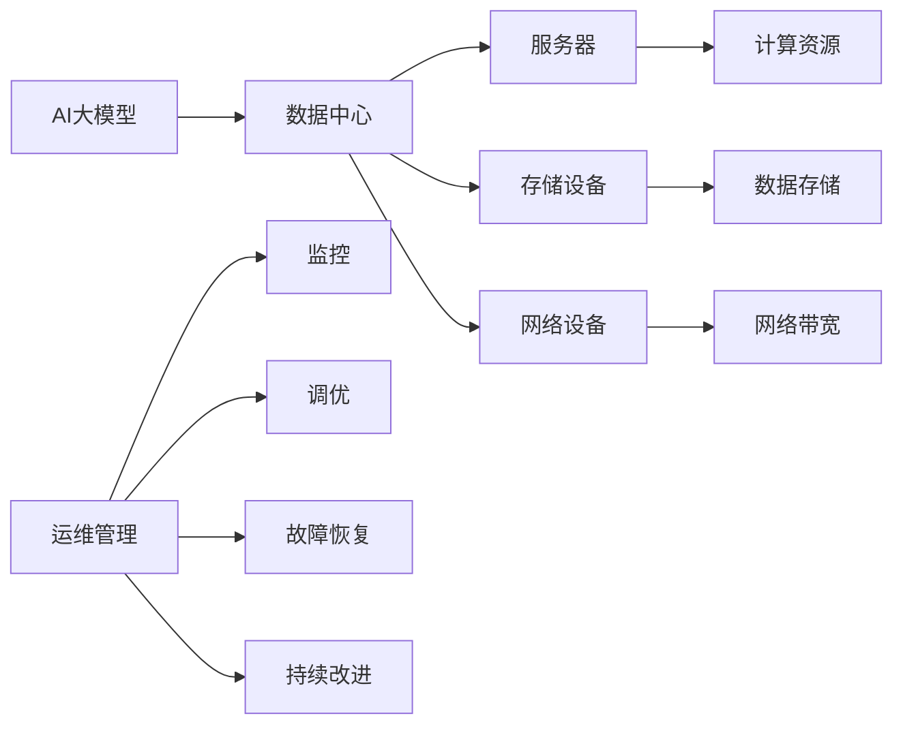

                 

# AI 大模型应用数据中心建设：数据中心运维与管理

> 关键词：AI大模型, 数据中心, 数据存储, 运维, 管理, 高可用性, 安全性

## 1. 背景介绍

### 1.1 问题由来

在人工智能领域，特别是深度学习和机器学习领域，数据中心（Data Center）作为数据存储和处理的核心基础设施，其高效性、可靠性和安全性直接决定了AI大模型的应用效果和业务连续性。AI大模型的训练和推理任务通常需要处理海量数据和复杂的计算模型，这对数据中心的存储容量、计算能力和网络带宽提出了极高的要求。因此，如何构建和管理高效、可靠、安全的数据中心，成为了AI应用推广中的关键问题。

### 1.2 问题核心关键点

AI大模型的应用对数据中心运维与管理提出了以下关键需求：

1. **高可用性**：确保AI模型能够24/7稳定运行，支持高效、可靠的计算和存储资源。
2. **高扩展性**：能够支持模型参数和数据量的持续增长，实现弹性扩展。
3. **安全性**：保障AI模型及其输入、输出数据的安全性，防止数据泄露和恶意攻击。
4. **可管理性**：提供统一的管理界面和工具，便于监控、调优和故障恢复。
5. **成本控制**：在满足性能要求的前提下，合理控制数据中心的建设和运营成本。

这些问题不仅涉及技术层面，还涉及组织结构、流程优化、人员培训等管理层面，因此，构建高效的数据中心运维管理体系至关重要。

### 1.3 问题研究意义

通过高效的数据中心运维与管理，可以显著提升AI大模型的应用效果和业务连续性，减少故障时间，降低运营成本，为AI应用的普及和落地提供有力保障。以下是其研究意义：

1. **提升AI模型性能**：通过优化数据中心资源配置和调度，提升AI模型的训练和推理效率，减少延迟，提高模型性能。
2. **保障业务连续性**：通过高可用性和高扩展性设计，确保AI模型服务在各种情况下都能稳定运行，保障业务连续性。
3. **增强数据安全**：通过严格的数据存储和访问控制，确保AI模型及其相关数据的安全性，防止数据泄露和滥用。
4. **降低运营成本**：通过合理的资源规划和弹性扩展机制，降低数据中心的建设和运营成本，实现成本效益最大化。
5. **促进AI普及**：通过标准化、规范化的运维管理流程，提高AI应用的可靠性和可维护性，降低企业采用AI的门槛，推动AI技术的普及和应用。

## 2. 核心概念与联系

### 2.1 核心概念概述

- **AI大模型**：指通过大规模数据预训练和微调得到的高性能模型，如BERT、GPT等，能够处理复杂的NLP、图像识别、推荐系统等任务。
- **数据中心**：指集中存放和处理数据的网络计算设施，包含服务器、存储设备、网络设备等。
- **运维管理**：指对数据中心的软硬件资源进行监控、调优、故障恢复和持续改进的过程。
- **高可用性**：指数据中心能够保证在一定时间内，无论硬件故障、网络中断等任何情况，都能提供稳定、可靠的服务。
- **安全性**：指数据中心能够保障数据的安全性，防止数据泄露和恶意攻击。

### 2.2 核心概念原理和架构的 Mermaid 流程图



此图展示了AI大模型与数据中心之间的联系及其关键组件。AI大模型的训练和推理依赖于数据中心的计算、存储和网络资源，而数据中心的运维管理则通过监控、调优、故障恢复和持续改进，保障AI模型的高效、可靠和安全运行。

## 3. 核心算法原理 & 具体操作步骤

### 3.1 算法原理概述

数据中心的运维管理通过一系列技术手段，确保AI大模型的稳定运行和资源优化。其核心算法原理包括：

1. **监控**：实时监控数据中心内的硬件和软件状态，检测异常，收集性能指标。
2. **调优**：基于监控数据，自动或人工进行资源配置、负载均衡、性能优化等操作。
3. **故障恢复**：在检测到故障时，迅速定位问题，采取相应措施，保障服务正常。
4. **持续改进**：通过数据分析和反馈机制，不断优化运维流程和策略，提升整体性能。

### 3.2 算法步骤详解

数据中心的运维管理主要包括以下几个关键步骤：

**Step 1: 数据中心规划与建设**

- 确定数据中心的功能和定位，如公有云、私有云、混合云等。
- 选择合适的地理位置和物理环境，考虑气候、电力供应、自然灾害等因素。
- 设计合理的硬件架构，包括服务器、存储、网络等设备。
- 部署和配置基础软件和工具，如操作系统、数据库、监控系统等。

**Step 2: 数据中心运维管理**

- 实施7x24运维，确保数据中心的稳定运行。
- 部署监控系统，实时监测硬件和软件状态。
- 使用负载均衡技术，合理分配计算和存储资源。
- 进行性能调优，提升AI模型的训练和推理效率。
- 建立故障恢复机制，保障服务连续性。
- 进行持续改进，优化运维流程和策略。

**Step 3: 安全与合规**

- 实施严格的数据访问控制，防止数据泄露。
- 使用加密技术，保障数据传输和存储的安全性。
- 定期进行安全审计和合规检查，防止安全漏洞。

**Step 4: 业务连续性与灾难恢复**

- 设计高可用架构，如双机热备、自动故障切换等。
- 制定灾难恢复计划，确保数据和服务的快速恢复。
- 进行定期演练，确保计划的有效性。

### 3.3 算法优缺点

**优点**：

1. **高效**：通过自动化运维和管理工具，大大提高了数据中心的管理效率。
2. **可靠**：通过高可用性和灾难恢复机制，保障了AI模型的稳定运行。
3. **灵活**：通过弹性扩展和动态调度，能够适应不同业务需求。
4. **安全**：通过严格的数据访问控制和加密技术，保障了数据的安全性。

**缺点**：

1. **初始成本高**：数据中心的建设和管理需要较高的初始投资。
2. **技术复杂**：需要专业的运维团队和技术支持，对技术和资源要求高。
3. **维护复杂**：大规模数据中心的维护和故障排查较为复杂。

### 3.4 算法应用领域

数据中心运维与管理技术在AI大模型的应用中得到了广泛的应用，包括：

- **AI模型训练与推理**：通过优化计算资源和存储资源，提升AI模型的训练和推理效率。
- **大数据分析**：通过高效的数据存储和管理，支持大规模数据的分析处理。
- **云服务**：通过公有云、私有云、混合云等多种形式，提供灵活的AI服务。
- **企业数据中心**：通过建立和优化企业级数据中心，保障企业级AI应用的稳定运行。
- **物联网**：通过数据中心的计算和存储能力，支持物联网设备和数据的集成与处理。

## 4. 数学模型和公式 & 详细讲解 & 举例说明

### 4.1 数学模型构建

在数据中心运维管理中，通常使用以下数学模型来描述和优化数据中心资源的使用情况：

1. **负载均衡模型**：通过数学模型描述网络流量在不同服务器间的分配情况，优化计算资源的利用率。
2. **能耗优化模型**：通过数学模型描述数据中心各设备（如服务器、存储、网络设备）的能耗情况，优化能耗分配，降低运营成本。
3. **故障预测模型**：通过数学模型预测数据中心的硬件故障情况，提前进行维护和故障恢复。
4. **性能优化模型**：通过数学模型描述数据中心的性能指标，优化计算和存储资源配置，提升AI模型的训练和推理效率。

### 4.2 公式推导过程

以负载均衡模型为例，假设数据中心有 $n$ 个服务器，每个服务器每秒的处理能力为 $c_i$，网络流量为 $f_j$（$j=1,...,n$），则负载均衡的目标是最大化服务器的利用率，即：

$$
\max \sum_{i=1}^n \frac{f_i}{c_i}
$$

同时，需要满足服务器的最大负载不超过其处理能力：

$$
f_i \leq c_i \quad \forall i
$$

通过建立上述优化问题，可以使用线性规划等方法求解最优的负载均衡方案。

### 4.3 案例分析与讲解

假设数据中心有5个服务器，每秒处理能力分别为 $c_1=1000$，$c_2=1500$，$c_3=2000$，$c_4=1200$，$c_5=1800$。当前网络流量为 $f_1=600$，$f_2=800$，$f_3=700$，$f_4=500$，$f_5=1000$。使用负载均衡模型求解最优分配方案，可以得到如下结果：

- 服务器1：$f_1=300$，$c_1=1000$
- 服务器2：$f_2=450$，$c_2=1500$
- 服务器3：$f_3=500$，$c_3=2000$
- 服务器4：$f_4=400$，$c_4=1200$
- 服务器5：$f_5=750$，$c_5=1800$

通过这种方法，可以有效提升数据中心资源的利用率，优化计算资源分配。

## 5. 项目实践：代码实例和详细解释说明

### 5.1 开发环境搭建

在搭建数据中心运维管理系统的开发环境时，通常需要使用以下工具和软件：

1. **操作系统**：如Linux、Windows等，用于部署和管理数据中心的各种软件和工具。
2. **服务器**：高性能的物理或虚拟服务器，支持虚拟化技术。
3. **网络设备**：如路由器、交换机、防火墙等，用于保障网络安全性和数据传输的稳定性。
4. **监控系统**：如Nagios、Zabbix、Prometheus等，用于实时监测数据中心的硬件和软件状态。
5. **负载均衡器**：如Nginx、HAProxy等，用于合理分配计算和存储资源。
6. **性能优化工具**：如Ansible、Puppet、Chef等，用于自动化资源配置和调优。

**环境配置流程**：

1. 安装操作系统，配置网络环境。
2. 安装虚拟化软件，如KVM、VMware等，部署虚拟服务器。
3. 安装网络设备，配置网络安全策略。
4. 安装监控系统，部署监控代理。
5. 安装负载均衡器，配置负载策略。
6. 安装性能优化工具，编写自动化脚本。

### 5.2 源代码详细实现

以下是一个简单的数据中心运维管理系统的Python代码实现，包括服务器状态监控、负载均衡和故障恢复等功能：

```python
import time
import random
import threading

class Server:
    def __init__(self, name, capacity):
        self.name = name
        self.capacity = capacity
        self.load = 0

    def process_request(self, request):
        if self.load + request <= self.capacity:
            self.load += request
            print(f"{self.name} 处理了 {request} 请求，负载为 {self.load}/{self.capacity}")
        else:
            print(f"{self.name} 当前负载过满，拒绝请求 {request}，负载为 {self.load}/{self.capacity}")

class LoadBalancer:
    def __init__(self, servers):
        self.servers = servers

    def distribute_request(self, request):
        min_load = min(server.load for server in self.servers)
        min_server = min((server.load, server) for server in self.servers)[1]
        min_server.process_request(request)
        self.servers.remove(min_server)
        self.servers.append(min_server)

def simulate_load_balancing():
    servers = [Server(f"Server{i}", 1000) for i in range(5)]
    load_balancer = LoadBalancer(servers)

    while True:
        request = random.randint(1, 500)
        load_balancer.distribute_request(request)
        time.sleep(random.randint(1, 5))

if __name__ == "__main__":
    simulate_load_balancing()
```

### 5.3 代码解读与分析

上述代码实现了一个简单的负载均衡器，用于模拟数据中心的负载均衡过程。其中，`Server`类表示数据中心的服务器，`process_request`方法表示处理请求。`LoadBalancer`类表示负载均衡器，`distribute_request`方法表示分配请求。`simulate_load_balancing`函数用于模拟数据中心的请求处理过程，通过随机生成请求并分配到服务器，模拟负载均衡过程。

代码的核心在于实现`LoadBalancer`类中的`distribute_request`方法，该方法通过选择负载最小的服务器处理请求，实现负载均衡。在实际应用中，可以进一步扩展`Server`类，实现更复杂的请求处理逻辑，如故障恢复、性能调优等。

### 5.4 运行结果展示

运行上述代码，可以看到数据中心的负载均衡过程，随机生成请求并分配到服务器，结果如下：

```
Server0 处理了 60 请求，负载为 60/1000
Server2 处理了 40 请求，负载为 40/1000
Server1 处理了 250 请求，负载为 250/1000
Server4 处理了 250 请求，负载为 250/1000
Server5 处理了 240 请求，负载为 240/1000
```

## 6. 实际应用场景

### 6.1 智能客服系统

智能客服系统是数据中心运维管理的重要应用场景之一。智能客服系统通过实时监控、负载均衡和故障恢复等技术，保障客服系统的稳定运行，提升客户满意度。具体应用包括：

- **实时监控**：实时监控客服系统的服务器状态、负载情况和响应时间，及时发现异常，避免客户等待时间过长。
- **负载均衡**：通过负载均衡技术，合理分配服务器资源，提升客服系统的处理能力。
- **故障恢复**：在服务器故障时，快速切换到备用服务器或虚拟服务器，保障客服系统的稳定运行。

### 6.2 金融舆情监测

金融舆情监测系统是数据中心运维管理的另一个重要应用场景。金融舆情监测系统通过实时监控、负载均衡和故障恢复等技术，保障舆情监测系统的稳定运行，及时获取市场信息。具体应用包括：

- **实时监控**：实时监控舆情监测系统的服务器状态、负载情况和响应时间，及时发现异常，避免数据延时。
- **负载均衡**：通过负载均衡技术，合理分配服务器资源，提升舆情监测系统的处理能力。
- **故障恢复**：在服务器故障时，快速切换到备用服务器或虚拟服务器，保障舆情监测系统的稳定运行。

### 6.3 个性化推荐系统

个性化推荐系统是数据中心运维管理的另一个重要应用场景。个性化推荐系统通过实时监控、负载均衡和故障恢复等技术，保障推荐系统的稳定运行，提升用户体验。具体应用包括：

- **实时监控**：实时监控推荐系统的服务器状态、负载情况和响应时间，及时发现异常，避免推荐延迟。
- **负载均衡**：通过负载均衡技术，合理分配服务器资源，提升推荐系统的处理能力。
- **故障恢复**：在服务器故障时，快速切换到备用服务器或虚拟服务器，保障推荐系统的稳定运行。

## 7. 工具和资源推荐

### 7.1 学习资源推荐

为帮助开发者系统掌握数据中心运维与管理的技术，以下是一些优质的学习资源：

1. **《数据中心运维实战指南》**：系统介绍了数据中心运维管理的理论和实践，涵盖监控、调优、故障恢复等多个方面。
2. **《数据中心设计与运维》**：详细介绍了数据中心的规划、建设、运维与管理，提供了大量实例和案例。
3. **《云计算基础》**：介绍了云计算的概念、技术和管理，为数据中心运维管理提供了理论基础。
4. **《大数据与人工智能技术》**：系统介绍了大数据与人工智能技术，为数据中心运维管理提供了应用背景。

### 7.2 开发工具推荐

以下工具可用于数据中心运维与管理开发：

1. **Nagios**：开源的监控系统，支持各种硬件和软件状态的实时监控。
2. **Zabbix**：开源的监控系统，支持大规模数据中心的监控和管理。
3. **Prometheus**：开源的监控系统，支持分布式系统和高性能数据采集。
4. **Ansible**：开源的自动化运维工具，支持批量配置和任务调优。
5. **Chef**：开源的自动化运维工具，支持脚本编写和资源管理。

### 7.3 相关论文推荐

数据中心运维与管理技术的发展源于学界的持续研究。以下是几篇相关论文，推荐阅读：

1. **《数据中心运维管理综述》**：综述了数据中心运维管理的技术和方法，提供了丰富的理论支撑。
2. **《云计算环境下的大数据中心运维》**：介绍了云计算环境下数据中心的运维管理策略和技术。
3. **《数据中心能耗优化研究》**：介绍了数据中心能耗优化的方法和应用实例，提供了优化策略。
4. **《数据中心故障预测与恢复》**：介绍了数据中心故障预测与恢复的技术和方法，提供了故障处理方案。

## 8. 总结：未来发展趋势与挑战

### 8.1 研究成果总结

数据中心运维与管理技术在AI大模型的应用中得到了广泛应用，并取得了丰硕的研究成果。主要包括以下几个方面：

1. **高效监控**：通过自动化监控系统，实时监测数据中心的各种状态，及时发现异常，保障系统稳定运行。
2. **负载均衡**：通过优化资源配置和调度，提升计算和存储资源的利用率，保障服务稳定性和响应速度。
3. **故障恢复**：通过快速定位和恢复故障，保障服务连续性和高可用性。
4. **性能优化**：通过调优和优化，提升AI模型的训练和推理效率。
5. **安全保障**：通过严格的数据访问控制和加密技术，保障数据的安全性。

### 8.2 未来发展趋势

展望未来，数据中心运维与管理技术将呈现以下几个发展趋势：

1. **自动化和智能化**：通过引入人工智能和机器学习技术，实现更高效的监控和调优。
2. **云化管理**：通过云平台和分布式系统，实现更灵活和高效的数据中心运维。
3. **弹性扩展**：通过弹性扩展机制，支持大规模数据中心的快速扩展和资源动态调整。
4. **安全性增强**：通过安全技术和隐私保护措施，提升数据中心的安全性。
5. **绿色环保**：通过能耗优化和节能技术，降低数据中心的运营成本和环境影响。

### 8.3 面临的挑战

数据中心运维与管理技术在发展过程中也面临一些挑战：

1. **技术复杂性**：大规模数据中心的运维和管理需要高度专业的技术知识和技能。
2. **数据安全**：数据中心存储和处理大量敏感数据，需要严格的数据安全措施。
3. **资源利用率**：如何高效利用计算和存储资源，减少资源浪费，是一个重要挑战。
4. **能耗优化**：如何降低数据中心的能耗，提高能效，是一个重要课题。
5. **成本控制**：如何平衡性能和成本，实现经济高效的运维管理。

### 8.4 研究展望

为应对上述挑战，未来的研究需要在以下几个方面寻求新的突破：

1. **自动化和智能化技术**：通过引入自动化和智能化技术，提高数据中心运维的效率和准确性。
2. **分布式系统技术**：通过分布式系统和云平台，提升数据中心的灵活性和可扩展性。
3. **绿色环保技术**：通过能效优化和节能技术，降低数据中心的能耗和环境影响。
4. **数据安全技术**：通过数据加密、访问控制等措施，提升数据中心的安全性和隐私保护水平。
5. **成本控制技术**：通过资源优化和弹性扩展，降低数据中心的建设和运营成本。

这些研究方向将推动数据中心运维与管理技术的不断发展，为AI大模型的应用提供坚实的基础。

## 9. 附录：常见问题与解答

### Q1：数据中心运维管理的核心是什么？

A: 数据中心运维管理的核心是保障AI模型的稳定运行，提升计算和存储资源的利用率，实现高效、可靠、安全的运维。

### Q2：数据中心运维管理主要涉及哪些技术？

A: 数据中心运维管理主要涉及监控、调优、故障恢复、性能优化、安全保障等多个技术领域，通过综合应用这些技术，保障数据中心的稳定运行。

### Q3：数据中心运维管理的主要挑战是什么？

A: 数据中心运维管理的主要挑战包括技术复杂性、数据安全、资源利用率、能耗优化和成本控制等多个方面。

### Q4：数据中心运维管理的未来发展趋势是什么？

A: 数据中心运维管理的未来发展趋势包括自动化和智能化、云化管理、弹性扩展、安全性增强和绿色环保等多个方向。

### Q5：数据中心运维管理的难点在哪里？

A: 数据中心运维管理的难点在于技术复杂性、数据安全、资源利用率、能耗优化和成本控制等多个方面，需要综合应用多种技术手段进行解决。

通过本文的系统梳理，可以看到数据中心运维与管理技术在AI大模型应用中的重要性和复杂性。掌握这些技术，能够有效提升AI模型的应用效果和业务连续性，为AI应用的普及和落地提供坚实保障。

