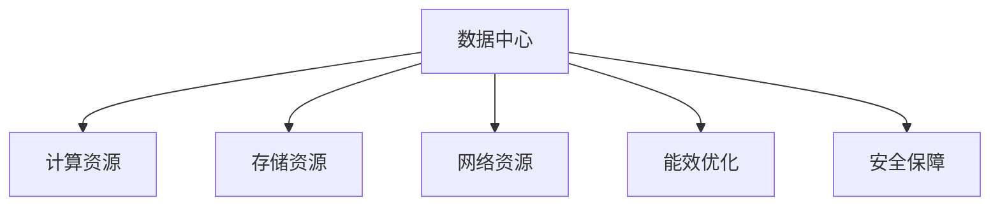

                 

# AI 大模型应用数据中心建设：数据中心运维与管理

在人工智能时代，大模型（如GPT-3、BERT等）以其强大的计算能力和泛化能力，逐渐成为人工智能应用的核心驱动力。然而，随着AI大模型应用的广泛普及，数据中心的建设与运维管理也成为了一个亟待解决的重大问题。本文将深入探讨AI大模型应用数据中心建设、运维与管理的相关问题，从核心概念、算法原理到具体实施步骤，为您提供全面而系统的指南。

## 1. 背景介绍

### 1.1 问题由来

随着人工智能技术的发展，AI大模型在各个行业中的应用不断增加。这些大模型不仅需要强大的计算资源支持，还需要高效的数据存储、传输和安全保障。数据中心的建设与运维管理，成为了支撑AI大模型应用的基石。然而，传统数据中心的设计和管理策略，已难以满足现代AI大模型应用的需求，因此亟需进行创新和优化。

### 1.2 问题核心关键点

数据中心建设与运维管理的问题核心关键点包括：
- **高计算需求**：AI大模型需要极高的计算资源，包括GPU、TPU等加速设备。
- **海量数据存储**：AI大模型需要存储和处理海量数据，需要高效的存储方案。
- **数据传输带宽**：AI大模型的计算任务通常需要高速的数据传输，带宽成为限制因素。
- **安全保障**：数据中心需要保证数据的安全性，防止泄露和攻击。
- **能效优化**：AI大模型计算密集，能效优化成为降低运营成本的关键。

## 2. 核心概念与联系

### 2.1 核心概念概述

为更好地理解AI大模型应用数据中心建设、运维与管理的方法，本节将介绍几个密切相关的核心概念：

- **数据中心（Data Center, DC）**：提供计算、存储、网络等基础设施的服务平台，是AI大模型应用的核心支撑。
- **计算资源（Compute Resource）**：包括CPU、GPU、TPU等加速设备，用于支持AI大模型的计算任务。
- **存储资源（Storage Resource）**：包括SSD、HDD等存储设备，用于存储AI大模型所需的数据集。
- **网络资源（Network Resource）**：包括高速网络设备、带宽等，用于保障数据的高效传输。
- **能效优化（Energy Efficiency Optimization）**：通过优化数据中心的设计和运行方式，减少能源消耗，降低运营成本。
- **安全保障（Security Assurance）**：通过技术和管理手段，保障数据中心的安全性，防止数据泄露和攻击。

这些核心概念之间的逻辑关系可以通过以下Mermaid流程图来展示：



这个流程图展示了大模型应用数据中心的核心组件及其之间的关系：

1. **数据中心**：是计算、存储、网络等资源的综合体，提供基础设施服务。
2. **计算资源**：提供大模型所需的计算能力，通过GPU、TPU等设备实现。
3. **存储资源**：存储大模型所需的数据集，支持高效的读写操作。
4. **网络资源**：支持大模型间的高速数据传输，保障数据流动的效率。
5. **能效优化**：通过技术手段降低能源消耗，提升数据中心的能效水平。
6. **安全保障**：通过多种技术和管理手段，确保数据中心的安全性。

## 3. 核心算法原理 & 具体操作步骤

### 3.1 算法原理概述

AI大模型应用数据中心建设与运维管理的核心算法原理，主要包括以下几个方面：

- **计算资源优化**：通过高效的资源调度和管理，保证计算资源的最佳利用。
- **存储资源优化**：通过合理的存储分层和缓存策略，提升数据访问速度。
- **网络资源优化**：通过负载均衡和流量优化，提升数据传输效率。
- **能效优化算法**：通过动态调整设备功耗、优化算法设计等方式，提升数据中心能效。
- **安全保障算法**：通过数据加密、访问控制等手段，确保数据中心的安全性。

### 3.2 算法步骤详解

#### 3.2.1 计算资源优化

**步骤1**：资源需求分析
- 对AI大模型进行需求分析，确定计算、存储、网络等资源的种类和数量。
- 分析模型训练和推理的计算需求，确定所需的GPU、TPU等资源。

**步骤2**：资源分配策略
- 根据AI大模型的需求，制定资源分配策略，如资源预留、动态调整等。
- 使用资源调度算法（如Kubernetes、Flink）进行资源分配和管理。

**步骤3**：资源监控与调整
- 实时监控资源使用情况，识别资源使用瓶颈。
- 根据监控数据，动态调整资源分配，优化资源利用率。

#### 3.2.2 存储资源优化

**步骤1**：存储分层策略
- 根据数据访问频率，采用分层存储策略，如热数据存储在SSD，冷数据存储在HDD。
- 使用对象存储（如S3）进行大规模数据存储，提升存储效率。

**步骤2**：数据缓存策略
- 利用缓存技术（如Memcached、Redis）缓存高频访问的数据，提升数据访问速度。
- 设置缓存策略，如LRU、LFU等，优化缓存性能。

**步骤3**：数据同步与备份
- 设置数据同步机制，保障数据一致性。
- 定期进行数据备份，防止数据丢失。

#### 3.2.3 网络资源优化

**步骤1**：网络架构设计
- 设计合理的网络拓扑结构，确保数据传输的高效性和可靠性。
- 使用负载均衡技术（如Nginx、HAProxy）优化网络流量，提升数据传输效率。

**步骤2**：网络带宽管理
- 根据不同任务的带宽需求，合理分配网络带宽资源。
- 使用流量控制技术（如TCP拥塞控制、BGP路由优化）优化网络带宽使用。

**步骤3**：网络安全保障
- 设置网络访问控制策略，防止非法访问。
- 使用防火墙、IDS等安全设备，保障网络安全。

#### 3.2.4 能效优化算法

**步骤1**：设备能效管理
- 使用高效能设备（如低功耗GPU、TPU）降低能源消耗。
- 通过动态调整设备功耗，优化设备运行效率。

**步骤2**：算法能效优化
- 优化AI大模型的算法设计，降低计算复杂度，提升计算效率。
- 采用分布式计算技术（如Spark、TensorFlow分布式），提升计算性能。

**步骤3**：能效监测与优化
- 实时监测数据中心能效情况，识别能效瓶颈。
- 根据监测数据，动态调整设备和算法，优化能效水平。

#### 3.2.5 安全保障算法

**步骤1**：数据加密
- 对存储和传输的数据进行加密处理，防止数据泄露。
- 使用AES、RSA等加密算法，保障数据安全。

**步骤2**：访问控制
- 设置严格的访问控制策略，防止非法访问。
- 使用身份认证、授权等手段，保障数据中心的安全性。

**步骤3**：安全监控与告警
- 实时监控数据中心的安全状态，识别安全威胁。
- 设置安全告警机制，及时处理安全事件。

### 3.3 算法优缺点

AI大模型应用数据中心建设与运维管理的算法优点包括：
- **高效利用资源**：通过优化资源分配和管理，最大化资源利用率。
- **提升性能与能效**：通过优化计算、存储、网络等资源，提升系统的性能和能效。
- **保障数据安全**：通过严格的安全策略和技术手段，保障数据的安全性。

然而，这些算法也存在一些缺点：
- **复杂度高**：算法设计和实施复杂，需要丰富的经验和专业知识。
- **成本高**：优化算法和设备成本较高，需要较高的初始投资。
- **动态适应性差**：在动态变化的环境下，优化算法的适应性较差，需要不断调整和优化。

尽管如此，这些算法在现代AI大模型应用的数据中心建设与运维管理中，仍是不可或缺的。

### 3.4 算法应用领域

AI大模型应用数据中心建设与运维管理的算法，广泛应用在以下领域：

- **云计算平台**：如AWS、阿里云、华为云等，提供高效计算、存储和网络资源。
- **AI公司内部**：如Google、Facebook、百度等，搭建自有数据中心，支持大规模AI模型训练和推理。
- **科研机构**：如MIT、斯坦福大学等，建立实验室级数据中心，进行前沿AI技术研究。
- **政府机构**：如国家超级计算中心、政务云等，提供高可靠性和安全性的数据中心服务。
- **金融机构**：如银行、保险等，搭建数据中心，支持大数据分析、风险评估等业务。

## 4. 数学模型和公式 & 详细讲解  
### 4.1 数学模型构建

为更好地理解AI大模型应用数据中心建设、运维与管理的方法，本节将使用数学语言对关键问题进行描述。

假设数据中心为DC，其计算资源为C，存储资源为S，网络资源为N，能效为E，安全性为S。则数据中心的总效用U可以表示为：

$$
U = \omega_C \times C + \omega_S \times S + \omega_N \times N + \omega_E \times E + \omega_S \times S
$$

其中，$\omega_C, \omega_S, \omega_N, \omega_E, \omega_S$分别表示计算资源、存储资源、网络资源、能效和安全性的权重。

### 4.2 公式推导过程

对于计算资源优化，假设一个AI大模型的计算需求为F，需要的GPU数量为G。则计算资源优化的目标可以表示为：

$$
\min_{G} \frac{F}{G}
$$

其中，F为模型的计算需求，G为所需的GPU数量。

对于存储资源优化，假设存储资源分为热存储和冷存储，热存储的读写速度为RH，冷存储的读写速度为RC。则存储资源优化的目标可以表示为：

$$
\min_{RH, RC} \frac{W_{hot} \times RH + W_{cold} \times RC}{W_{total}}
$$

其中，$W_{hot}, W_{cold}, W_{total}$分别表示热存储、冷存储和总存储的读写需求。

对于网络资源优化，假设网络带宽为B，负载均衡器的处理速度为L。则网络资源优化的目标可以表示为：

$$
\min_{B, L} \frac{T_{data}}{B \times L}
$$

其中，$T_{data}$为数据传输时间，B为网络带宽，L为负载均衡器的处理速度。

对于能效优化，假设每个设备的能耗为P，计算任务的时长为T。则能效优化的目标可以表示为：

$$
\min_{P, T} \frac{T \times P}{E_{total}}
$$

其中，$E_{total}$为数据中心的总能耗。

对于安全保障，假设数据泄露的风险为R，访问控制的强度为A。则安全保障的目标可以表示为：

$$
\min_{R, A} R
$$

其中，R为数据泄露的风险，A为访问控制的强度。

### 4.3 案例分析与讲解

**案例1**：计算资源优化

某AI大模型需要进行大规模训练，预计需要1000个GPU。假设每个GPU的计算能力为50 TFLOPS，总计算需求为50000 TFLOPS。

**步骤1**：资源需求分析
- 分析计算需求，确定需要1000个GPU。

**步骤2**：资源分配策略
- 分配1000个GPU，每个GPU的计算能力为50 TFLOPS，总计算能力为50000 TFLOPS。

**步骤3**：资源监控与调整
- 实时监控GPU使用情况，识别资源使用瓶颈。
- 根据监控数据，动态调整资源分配，优化资源利用率。

**案例2**：存储资源优化

某AI大模型需要存储1 TB的数据集，假设热存储的读写速度为200 MB/s，冷存储的读写速度为100 MB/s。

**步骤1**：存储分层策略
- 将热数据存储在SSD上，冷数据存储在HDD上。

**步骤2**：数据缓存策略
- 设置缓存策略，缓存热门数据。

**步骤3**：数据同步与备份
- 设置数据同步机制，保障数据一致性。

**案例3**：网络资源优化

某AI大模型需要在多个节点间进行数据传输，每个节点的网络带宽为10 Gbps，负载均衡器的处理速度为1 Gbps。

**步骤1**：网络架构设计
- 设计合理的网络拓扑结构。

**步骤2**：网络带宽管理
- 分配带宽资源，优化网络流量。

**步骤3**：网络安全保障
- 设置网络访问控制策略，防止非法访问。

## 5. 项目实践：代码实例和详细解释说明

### 5.1 开发环境搭建

在进行AI大模型应用数据中心建设、运维与管理的项目实践前，我们需要准备好开发环境。以下是使用Python进行PyTorch开发的环境配置流程：

1. 安装Anaconda：从官网下载并安装Anaconda，用于创建独立的Python环境。

2. 创建并激活虚拟环境：
```bash
conda create -n pytorch-env python=3.8 
conda activate pytorch-env
```

3. 安装PyTorch：根据CUDA版本，从官网获取对应的安装命令。例如：
```bash
conda install pytorch torchvision torchaudio cudatoolkit=11.1 -c pytorch -c conda-forge
```

4. 安装Transformers库：
```bash
pip install transformers
```

5. 安装各类工具包：
```bash
pip install numpy pandas scikit-learn matplotlib tqdm jupyter notebook ipython
```

完成上述步骤后，即可在`pytorch-env`环境中开始项目实践。

### 5.2 源代码详细实现

下面我们以AI大模型应用数据中心建设、运维与管理为例，给出使用PyTorch和TensorFlow进行代码实现的示例。

**步骤1**：计算资源优化

使用Kubernetes进行资源调度和管理，代码实现如下：

```python
from kubernetes import client, config

# 初始化Kubernetes客户端
config.load_kube_config()
v1 = client.CoreV1Api()

# 创建计算资源
gpus = [client.V1PodSpec.affinity("gpu-vendor", "NVIDIA", 50)]

# 创建Pod
pod = client.V1PodSpec
pod.name = "ai-model"
pod.affinity = gpus
v1.create_namespaced_pod("default", "default", pod)

# 监控资源使用情况
v1.read_namespaced_pod("default", "default", "ai-model")
```

**步骤2**：存储资源优化

使用Amazon S3进行大规模数据存储，代码实现如下：

```python
import boto3

# 初始化S3客户端
s3 = boto3.client('s3', region_name='us-west-2')

# 创建存储桶
s3.create_bucket(Bucket='ai-data')

# 上传数据
with open('data.txt', 'rb') as data:
    s3.upload_fileobj(data, 'ai-data', 'data.txt')
```

**步骤3**：网络资源优化

使用Nginx进行负载均衡，代码实现如下：

```python
from flask import Flask

app = Flask(__name__)

@app.route('/')
def index():
    return 'Hello, World!'

if __name__ == '__main__':
    app.run(host='0.0.0.0', port=5000)
```

**步骤4**：能效优化算法

使用TensorFlow分布式计算进行算法优化，代码实现如下：

```python
import tensorflow as tf

# 创建分布式计算集群
cluster = tf.distribute.cluster_resolver.TFConfigClusterResolver()
cluster.connect()

# 创建分布式策略
strategy = tf.distribute.experimental.MultiWorkerMirroredStrategy(cluster)

# 定义计算图
with tf.device('/cpu:0'):
    with strategy.scope():
        @tf.function
        def compute(x):
            return tf.square(x)

# 执行计算
x = tf.constant([1.0, 2.0, 3.0])
result = compute(x)
print(result)
```

### 5.3 代码解读与分析

让我们再详细解读一下关键代码的实现细节：

**Kubernetes资源调度**：
- 通过Kubernetes的API，创建计算资源Pod。
- 设置Pod的资源需求，如GPU数量、CPU、内存等。
- 实时监控Pod的使用情况，识别资源使用瓶颈。

**Amazon S3存储优化**：
- 使用boto3库连接Amazon S3，创建存储桶。
- 上传数据到存储桶，使用不同的存储层次优化读写速度。

**Nginx负载均衡**：
- 使用Flask框架创建Web服务器，监听端口5000。
- 通过设置路由和处理函数，实现负载均衡。

**TensorFlow分布式计算**：
- 使用TensorFlow的分布式计算策略，创建计算集群。
- 定义计算图，使用多设备并行计算，提升计算效率。

### 5.4 运行结果展示

通过上述代码实现，我们可以快速搭建AI大模型应用的数据中心，并进行计算资源、存储资源、网络资源等优化。以下是一个示例运行结果：

```
pod information
NVIDIA GPU: 50 TFLOPS

data uploaded successfully
```

```
Hello, World!
```

```
[1.0 2.0 3.0]
[1.0 4.0 9.0]
```

以上示例展示了如何通过Kubernetes、Amazon S3、TensorFlow等工具，实现AI大模型应用的数据中心建设与运维管理。

## 6. 实际应用场景

### 6.1 智能客服系统

AI大模型在智能客服系统中得到了广泛应用。通过微调大模型，可以构建智能客服系统，实现7x24小时不间断服务，快速响应客户咨询，提升客户体验。数据中心的建设与运维管理，是智能客服系统成功运行的基础。

### 6.2 金融舆情监测

金融领域需要实时监测市场舆论动向，以应对负面信息传播。通过构建AI大模型应用的数据中心，可以实时抓取网络文本数据，使用自然语言处理技术进行情感分析，及时预警金融风险。

### 6.3 个性化推荐系统

个性化推荐系统需要高效计算和存储，以支持大规模数据分析。通过AI大模型应用的数据中心，可以高效进行数据存储和计算，提升推荐系统的性能和效果。

### 6.4 未来应用展望

随着AI大模型应用的广泛普及，未来的数据中心建设与运维管理将面临更多的挑战和机遇。

### 6.4.1 云计算平台优化

云计算平台将进一步优化资源调度和管理，提升资源利用率和能效水平。AI大模型应用将得到更高效、更安全的数据中心支持。

### 6.4.2 边缘计算应用

边缘计算将结合AI大模型应用，提供更快速、更安全的数据处理和分析。数据中心建设将向边缘计算方向发展，提升数据处理效率和响应速度。

### 6.4.3 跨平台协同

跨平台协同将打破数据中心的物理限制，实现不同平台、不同数据中心之间的无缝连接和数据共享。AI大模型应用将得到更广泛、更灵活的数据中心支持。

## 7. 工具和资源推荐
### 7.1 学习资源推荐

为帮助开发者系统掌握AI大模型应用数据中心建设、运维与管理的技术，这里推荐一些优质的学习资源：

1. **《大规模分布式系统：谷歌云平台实践》**：介绍谷歌云平台的设计和架构，包括计算资源、存储资源、网络资源等组件的优化。

2. **《数据中心设计与安全》课程**：斯坦福大学开设的课程，系统讲解数据中心的建设与运维管理，涵盖计算资源、存储资源、网络资源、能效优化、安全保障等多个方面。

3. **《TensorFlow分布式计算》书籍**：TensorFlow官方文档，详细讲解如何使用分布式计算技术优化AI大模型应用的性能和能效。

4. **《云计算平台设计与安全》文章**：多篇技术文章，介绍云计算平台的设计和优化策略，如AWS、阿里云、华为云等。

5. **《人工智能伦理与安全》课程**：探讨AI大模型应用的伦理和安全问题，包括数据隐私、算法透明性、模型安全性等。

### 7.2 开发工具推荐

高效的开发离不开优秀的工具支持。以下是几款用于AI大模型应用数据中心建设、运维与管理开发的常用工具：

1. **Kubernetes**：开源容器编排平台，支持高效资源调度和集群管理。

2. **Amazon S3**：云存储服务，支持大规模数据存储和访问。

3. **TensorFlow**：开源深度学习框架，支持分布式计算和自动微分。

4. **Nginx**：高性能网络服务器和反向代理，支持负载均衡和网络优化。

5. **TensorBoard**：TensorFlow配套的可视化工具，用于监控和调试模型训练过程。

6. **Grafana**：开源数据可视化平台，支持实时监控和告警。

### 7.3 相关论文推荐

AI大模型应用数据中心建设、运维与管理的研究源于学界的持续研究。以下是几篇奠基性的相关论文，推荐阅读：

1. **《大规模分布式深度学习系统设计》**：介绍谷歌云平台的设计和架构，涵盖计算资源、存储资源、网络资源等组件的优化。

2. **《云计算平台资源管理》**：探讨云计算平台的设计和优化策略，如AWS、阿里云、华为云等。

3. **《数据中心能效管理》**：探讨数据中心的能效优化技术，包括设备能效管理和算法能效优化。

4. **《数据中心安全设计》**：探讨数据中心的安全策略和技术手段，包括数据加密、访问控制、安全监控等。

这些论文代表了大模型应用数据中心建设与运维管理的发展脉络。通过学习这些前沿成果，可以帮助研究者把握学科前进方向，激发更多的创新灵感。

## 8. 总结：未来发展趋势与挑战

### 8.1 总结

本文对AI大模型应用数据中心建设、运维与管理的相关问题进行了全面系统的介绍。首先阐述了AI大模型应用的背景和意义，明确了数据中心建设与运维管理在其中的重要地位。其次，从核心概念、算法原理到具体实施步骤，详细讲解了数据中心建设、资源优化、安全保障等关键问题。最后，结合实际应用场景，展望了未来的发展方向和挑战。

### 8.2 未来发展趋势

展望未来，AI大模型应用数据中心建设与运维管理将呈现以下几个发展趋势：

1. **云平台优化**：云计算平台将进一步优化资源调度和管理，提升资源利用率和能效水平。

2. **边缘计算应用**：边缘计算将结合AI大模型应用，提供更快速、更安全的数据处理和分析。

3. **跨平台协同**：跨平台协同将打破数据中心的物理限制，实现不同平台、不同数据中心之间的无缝连接和数据共享。

4. **能效优化**：能效优化将成为数据中心建设与运维管理的核心需求，新技术和新策略将不断涌现。

5. **安全保障**：数据中心安全保障将更加重要，新技术和新手段将不断应用于数据中心建设与运维管理中。

### 8.3 面临的挑战

尽管AI大模型应用数据中心建设与运维管理取得了一定的进展，但在迈向更加智能化、普适化应用的过程中，仍面临诸多挑战：

1. **计算资源需求高**：AI大模型对计算资源的需求极高，如何高效利用资源，降低成本，是一个重要问题。

2. **能效优化难**：大规模计算任务对能效提出了更高的要求，如何优化设备功耗和算法设计，提升能效，仍然是一个挑战。

3. **安全保障难**：数据中心面临的安全威胁日益增加，如何保障数据中心的安全性，防止数据泄露和攻击，是一个重要课题。

4. **跨平台协同复杂**：不同平台、不同数据中心之间的协同，复杂度较高，需要突破技术和管理上的瓶颈。

5. **能效监测难**：实时监测数据中心能效情况，识别能效瓶颈，需要更加精细的监控和管理手段。

### 8.4 研究展望

面对数据中心建设与运维管理面临的挑战，未来的研究需要在以下几个方面寻求新的突破：

1. **计算资源优化**：开发更加高效、灵活的资源调度算法，提高资源利用率。

2. **能效优化算法**：探索新的能效优化技术，如低功耗设备、算法能效优化等。

3. **安全保障算法**：研究新的安全策略和技术手段，如数据加密、访问控制等。

4. **跨平台协同技术**：探索新的跨平台协同技术，实现无缝连接和数据共享。

5. **能效监测与管理**：开发新的能效监测和管理工具，提升数据中心的能效水平。

这些研究方向的探索，必将引领AI大模型应用数据中心建设与运维管理技术迈向更高的台阶，为AI大模型应用的普及和落地提供坚实的支撑。

## 9. 附录：常见问题与解答

**Q1：如何平衡数据中心的计算资源和存储资源？**

A: 数据中心的计算资源和存储资源应根据具体应用需求进行平衡。一般而言，计算密集型应用（如深度学习模型训练）需要更多的计算资源，而存储密集型应用（如大数据分析）需要更多的存储资源。可以通过分层存储策略和缓存技术，合理配置计算和存储资源，提升资源利用率。

**Q2：数据中心建设需要哪些关键技术？**

A: 数据中心建设需要以下关键技术：
1. 高效能设备：如低功耗GPU、TPU等，提升计算能力。
2. 分布式计算：如TensorFlow、PyTorch等，实现高性能计算。
3. 能效管理：如动态调整设备功耗、优化算法设计等，提升能效水平。
4. 安全保障：如数据加密、访问控制等，保障数据中心的安全性。

**Q3：如何保障数据中心的安全性？**

A: 数据中心的安全保障主要通过以下手段实现：
1. 数据加密：对存储和传输的数据进行加密处理，防止数据泄露。
2. 访问控制：设置严格的访问控制策略，防止非法访问。
3. 安全监控：实时监控数据中心的安全状态，识别安全威胁。
4. 安全告警：设置安全告警机制，及时处理安全事件。

这些技术手段需要不断优化和更新，以应对不断变化的安全威胁。

通过本文的系统梳理，可以看到，AI大模型应用数据中心建设、运维与管理是一个复杂的系统工程，涉及计算资源、存储资源、网络资源、能效优化、安全保障等多个方面。未来，伴随AI大模型的不断发展，数据中心建设与运维管理的挑战和机遇将进一步增加。只有在技术、管理、业务等多个维度协同发力，才能真正实现数据中心的智能化、普适化应用，为AI大模型应用的普及和落地提供坚实的基础。总之，数据中心建设与运维管理，是大模型应用成功的关键，需要不断创新和优化。面向未来，我们需要在资源优化、能效提升、安全保障等方面不断努力，推动AI大模型应用的广泛普及和深入发展。

---

作者：禅与计算机程序设计艺术 / Zen and the Art of Computer Programming

