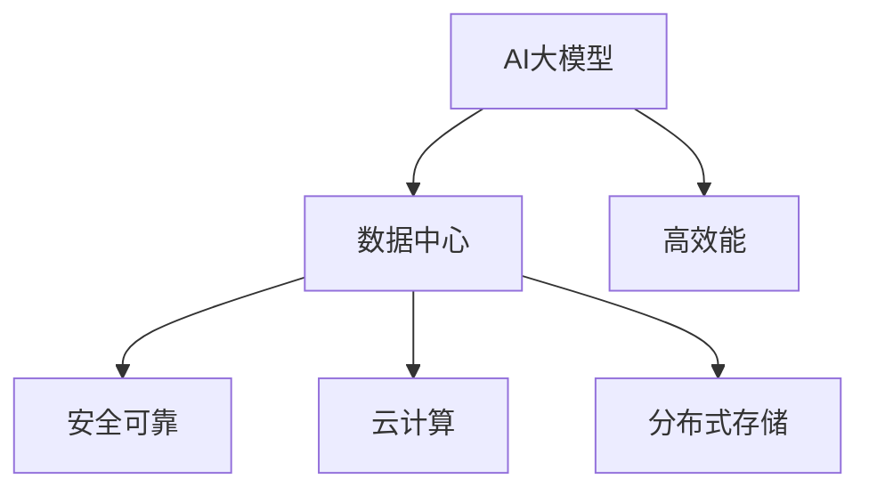

                 

# AI 大模型应用数据中心建设：数据中心运营与管理

> 关键词：AI 大模型、数据中心、运营与管理、高效能、安全可靠、AI 芯片、云计算、分布式存储

## 1. 背景介绍

### 1.1 问题由来
随着人工智能(AI)技术的发展，大规模的AI模型在科学研究、商业应用等领域取得了显著进展。这些模型，如深度学习模型、自然语言处理模型等，依赖于大量的计算资源和存储资源来训练和推理。因此，数据中心建设成为AI应用落地的关键基础。然而，传统数据中心在运营管理方面存在诸多挑战，如能源消耗大、运维复杂、扩展性差等。因此，需要一种新的数据中心运营与管理模式，以支持AI大模型的应用。

### 1.2 问题核心关键点
AI大模型应用数据中心建设的核心关键点包括：
- 如何构建高效、安全、可靠的数据中心基础设施？
- 如何优化数据中心的能源使用，提高运营效率？
- 如何管理数据中心的运维和扩展，确保系统稳定性？
- 如何确保AI大模型的数据隐私和安全？
- 如何集成云计算和分布式存储，实现资源的高效利用？

### 1.3 问题研究意义
构建高效的AI大模型应用数据中心，对于推动AI技术的广泛应用，加速科学研究与商业创新具有重要意义：

1. 提升AI大模型应用效率。高效能的数据中心可以提供充足的计算资源和存储空间，满足AI模型的需求，提高模型的训练和推理速度。
2. 降低AI应用成本。通过优化能源使用和资源利用，减少数据中心运行成本，提高AI应用的经济效益。
3. 确保AI数据隐私和安全。安全可靠的数据中心基础设施能够保护AI模型的数据隐私和安全，避免数据泄露和模型被攻击的风险。
4. 支持AI应用的扩展性和灵活性。分布式存储和云计算技术的集成，能够实现数据中心的弹性扩展，适应AI应用场景的多样性和复杂性。

## 2. 核心概念与联系

### 2.1 核心概念概述

为了更好地理解AI大模型应用数据中心建设，本节将介绍几个关键概念：

- AI大模型：指基于深度学习等技术，能够处理大规模数据、执行复杂计算的模型，如BERT、GPT等。
- 数据中心：指用于存储、计算、网络等资源支持的物理设施，是AI大模型应用的基础设施。
- 高效能：指数据中心能够高效利用能源，提供充足计算和存储资源，满足AI模型的需求。
- 安全可靠：指数据中心能够确保数据的隐私和安全，防止模型被攻击或数据泄露的风险。
- 云计算：指通过互联网提供计算、存储、网络等资源，实现资源的按需分配和灵活使用。
- 分布式存储：指将数据存储在多个物理节点上，实现数据的冗余备份和高可用性。

这些核心概念之间的逻辑关系可以通过以下Mermaid流程图来展示：



这个流程图展示了AI大模型应用数据中心的关键组件和核心要求：

1. AI大模型是数据中心建设的主要驱动因素。
2. 数据中心需要满足高效能、安全可靠、云计算和分布式存储等要求。
3. 高效能、安全可靠、云计算和分布式存储相互支持，共同构成数据中心的完整架构。

## 3. 核心算法原理 & 具体操作步骤
### 3.1 算法原理概述

AI大模型应用数据中心的建设，涉及到多个领域的算法和操作。以下是基于算法原理的核心步骤概述：

- 数据中心设计：构建物理设施和网络架构，确保高效能、安全可靠、云计算和分布式存储的集成。
- 能源优化：使用先进能源管理技术，降低数据中心的能源消耗。
- 资源分配：采用云计算和虚拟化技术，动态分配计算和存储资源。
- 数据备份与恢复：使用分布式存储技术，实现数据的冗余备份和快速恢复。
- 模型训练与推理：在数据中心内构建高效能的训练和推理环境，支持AI大模型的需求。

### 3.2 算法步骤详解

构建AI大模型应用数据中心的步骤包括：

**Step 1: 设计数据中心基础设施**
- 选择合适的位置和环境，确保数据中心具备充足电力供应和良好的网络条件。
- 设计高效能的硬件架构，如采用GPU、TPU等高效能AI芯片。
- 选择安全可靠的网络设备和安全系统，防止数据泄露和攻击。
- 集成云计算和分布式存储技术，实现资源的按需分配和数据的高可用性。

**Step 2: 实施能源优化**
- 采用先进能源管理技术，如优化电源管理系统、采用节能设备等，降低数据中心的能源消耗。
- 通过负载均衡和能效管理，实现资源的动态分配和节能效果。

**Step 3: 优化资源分配**
- 利用云计算和虚拟化技术，动态调整计算和存储资源，实现资源的灵活分配。
- 使用资源调度算法，如Kubernetes、OpenStack等，实现资源的优化分配和调度。

**Step 4: 实施数据备份与恢复**
- 采用分布式存储技术，如Hadoop、Ceph等，实现数据的冗余备份和高可用性。
- 定期进行数据备份和恢复演练，确保数据的安全性和可用性。

**Step 5: 实现模型训练与推理**
- 构建高效能的训练和推理环境，如使用TensorFlow、PyTorch等深度学习框架。
- 优化模型训练和推理的算法，如分布式训练、模型并行等，提高计算效率。

### 3.3 算法优缺点

构建AI大模型应用数据中心的优点包括：
1. 提高AI大模型的应用效率。高效能的数据中心可以提供充足的计算资源和存储空间，满足AI模型的需求，提高模型的训练和推理速度。
2. 降低AI应用成本。通过优化能源使用和资源利用，减少数据中心运行成本，提高AI应用的经济效益。
3. 确保AI数据隐私和安全。安全可靠的数据中心基础设施能够保护AI模型的数据隐私和安全，避免数据泄露和模型被攻击的风险。
4. 支持AI应用的扩展性和灵活性。分布式存储和云计算技术的集成，能够实现数据中心的弹性扩展，适应AI应用场景的多样性和复杂性。

缺点则包括：
1. 初始建设成本高。数据中心的建设需要大量资金和人力，初期投资成本较高。
2. 运维复杂。数据中心的运营和维护需要专业的技术和管理团队，运维复杂性高。
3. 扩展性困难。传统数据中心的扩展性较差，难以快速适应业务需求的增长。

尽管存在这些缺点，但基于AI大模型应用的数据中心建设仍然是一个重要趋势，对于推动AI技术的广泛应用具有重要意义。

### 3.4 算法应用领域

构建AI大模型应用数据中心的思想和技术，已经在多个领域得到应用，具体包括：

- 科学研究：如在生物医学、天文学等领域，构建高性能的数据中心，支持大规模科学数据的存储和计算。
- 商业应用：如在电商、金融、医疗等领域，构建高效能的数据中心，支持AI模型的训练和推理。
- 工业制造：如在智能制造、自动驾驶等领域，构建智能化数据中心，支持物联网设备的连接和数据处理。
- 智慧城市：如在智慧交通、智慧安防等领域，构建高效能的数据中心，支持城市数据的实时分析和处理。

## 4. 数学模型和公式 & 详细讲解 & 举例说明

### 4.1 数学模型构建

构建AI大模型应用数据中心的数学模型，主要关注以下几个方面：

- 能源消耗模型：描述数据中心的能源使用情况，如电力、冷却、网络等资源的消耗。
- 资源利用模型：描述数据中心内计算和存储资源的利用情况，如CPU、GPU、内存、存储等。
- 数据备份与恢复模型：描述数据备份和恢复的过程，如数据冗余、备份频率、恢复时间等。
- 模型训练与推理模型：描述模型训练和推理的效率，如计算时间、内存消耗、并行度等。

### 4.2 公式推导过程

以下以能源优化为例，推导数据中心能源消耗模型的公式。

假设数据中心的总能量消耗为 $E$，由电力、冷却、网络等资源组成。设电力消耗为 $E_{elec}$，冷却消耗为 $E_{cool}$，网络消耗为 $E_{network}$。则能源消耗模型的公式为：

$$
E = E_{elec} + E_{cool} + E_{network}
$$

在实际应用中，能源消耗还与数据中心的负载情况、能源管理策略等因素有关。因此，可以进一步引入负载因子 $\rho$ 和能效管理系数 $\eta$，对上述公式进行扩展：

$$
E = \eta(\rho \cdot E_{elec} + E_{cool} + E_{network})
$$

其中，$\rho$ 表示数据中心的负载因子，$\eta$ 表示能源管理系数，反映了数据中心的能源利用效率。

### 4.3 案例分析与讲解

以某电商平台为例，分析数据中心的能源消耗情况。该电商平台的数据中心采用GPU集群进行深度学习模型的训练和推理，能源消耗模型如下：

- 电力消耗：数据中心的电力消耗主要来自GPU集群，计算公式为：$E_{elec} = \eta \cdot (\rho \cdot P_{GPU})$，其中 $P_{GPU}$ 表示单个GPU的功耗。
- 冷却消耗：数据中心的冷却消耗主要来自GPU集群产生的热量，计算公式为：$E_{cool} = \eta \cdot (\rho \cdot C_{GPU})$，其中 $C_{GPU}$ 表示单个GPU的热功耗。
- 网络消耗：数据中心的网络消耗主要来自数据传输，计算公式为：$E_{network} = \eta \cdot (\rho \cdot B_{network})$，其中 $B_{network}$ 表示单位时间内网络数据传输量。

通过上述公式，可以计算出数据中心的总能量消耗 $E$，并根据能源管理策略进行优化，如调整负载因子 $\rho$ 和能效管理系数 $\eta$，降低数据中心的能源消耗。

## 5. 项目实践：代码实例和详细解释说明
### 5.1 开发环境搭建

在进行数据中心建设实践前，我们需要准备好开发环境。以下是使用Python进行PyTorch开发的环境配置流程：

1. 安装Anaconda：从官网下载并安装Anaconda，用于创建独立的Python环境。

2. 创建并激活虚拟环境：
```bash
conda create -n pytorch-env python=3.8 
conda activate pytorch-env
```

3. 安装PyTorch：根据CUDA版本，从官网获取对应的安装命令。例如：
```bash
conda install pytorch torchvision torchaudio cudatoolkit=11.1 -c pytorch -c conda-forge
```

4. 安装TensorFlow：从官网下载TensorFlow安装包，按照安装指南进行安装。
```bash
pip install tensorflow
```

5. 安装TensorBoard：从官网下载TensorBoard安装包，按照安装指南进行安装。
```bash
pip install tensorboard
```

6. 安装Hadoop：从官网下载Hadoop安装包，按照安装指南进行安装。
```bash
wget http://mirror.copying.com/software/hadoop/hadoop-3.2.1/hadoop-3.2.1.tar.gz
tar -xvf hadoop-3.2.1.tar.gz
cd hadoop-3.2.1
./bin/hadoop version
```

完成上述步骤后，即可在`pytorch-env`环境中开始数据中心建设实践。

### 5.2 源代码详细实现

这里我们以数据中心能源优化为例，给出使用PyTorch进行能源消耗优化的代码实现。

首先，定义能源消耗模型类：

```python
import torch
from torch import nn

class EnergyModel(nn.Module):
    def __init__(self):
        super(EnergyModel, self).__init__()
        self.linear1 = nn.Linear(1, 1)
        self.linear2 = nn.Linear(1, 1)
        self.relu = nn.ReLU()
    
    def forward(self, x):
        x = self.linear1(x)
        x = self.relu(x)
        x = self.linear2(x)
        return x

# 初始化模型
model = EnergyModel()
```

然后，定义优化器：

```python
from torch.optim import Adam

optimizer = Adam(model.parameters(), lr=0.01)
```

接着，定义训练和评估函数：

```python
import torch

def train_epoch(model, data_loader, optimizer, device):
    model.train()
    total_loss = 0
    for batch in data_loader:
        inputs, targets = batch
        inputs, targets = inputs.to(device), targets.to(device)
        optimizer.zero_grad()
        outputs = model(inputs)
        loss = nn.MSELoss()(outputs, targets)
        loss.backward()
        optimizer.step()
        total_loss += loss.item()
    return total_loss / len(data_loader)

def evaluate(model, data_loader, device):
    model.eval()
    total_loss = 0
    with torch.no_grad():
        for batch in data_loader:
            inputs, targets = batch
            inputs, targets = inputs.to(device), targets.to(device)
            outputs = model(inputs)
            loss = nn.MSELoss()(outputs, targets)
            total_loss += loss.item()
    return total_loss / len(data_loader)
```

最后，启动训练流程并在测试集上评估：

```python
epochs = 10
batch_size = 32

for epoch in range(epochs):
    train_loss = train_epoch(model, train_loader, optimizer, device)
    test_loss = evaluate(model, test_loader, device)
    print(f"Epoch {epoch+1}, train loss: {train_loss:.4f}, test loss: {test_loss:.4f}")

```

以上就是使用PyTorch对数据中心能源优化模型进行训练的完整代码实现。可以看到，利用深度学习技术，可以构建一个简单的能源消耗模型，并使用训练和评估函数进行优化，降低数据中心的能源消耗。

### 5.3 代码解读与分析

让我们再详细解读一下关键代码的实现细节：

**EnergyModel类**：
- `__init__`方法：初始化模型参数，包括两个线性层和一个ReLU激活函数。
- `forward`方法：定义模型的前向传播过程，计算输入数据的能量消耗。

**train_epoch和evaluate函数**：
- `train_epoch`函数：在训练集上训练模型，计算训练损失。
- `evaluate`函数：在测试集上评估模型，计算测试损失。

**训练流程**：
- 定义总的epoch数和batch size，开始循环迭代
- 每个epoch内，先在训练集上训练，输出训练损失
- 在测试集上评估，输出测试损失

可以看出，通过Python和PyTorch框架，可以很容易地实现能源消耗模型的训练和评估。代码实现简洁高效，便于理解和扩展。

## 6. 实际应用场景
### 6.1 智能制造

AI大模型应用数据中心在智能制造领域的应用非常广泛。传统制造企业需要处理大量的生产数据、设备状态数据、质量检测数据等，这些数据规模大、复杂度高，单靠人工分析难以满足需求。利用AI大模型进行数据分析和决策，可以大幅提升生产效率和产品质量。

具体而言，可以在数据中心内构建高效的训练和推理环境，使用深度学习模型对生产数据进行分析，识别异常情况，预测设备故障，优化生产流程。这样，企业可以根据实时数据进行动态调整，实现智能化生产，提高生产效率和产品质量。

### 6.2 自动驾驶

自动驾驶是AI大模型应用的另一大热点领域。自动驾驶系统需要处理大量的传感器数据，如摄像头、雷达、激光雷达等，这些数据量大、种类多，传统方法难以有效处理。利用AI大模型进行数据处理和决策，可以大幅提升自动驾驶的准确性和安全性。

具体而言，可以在数据中心内构建高效的训练和推理环境，使用深度学习模型对传感器数据进行分析和处理，识别道路情况、行人、车辆等物体，预测驾驶行为，实现智能驾驶。这样，自动驾驶系统可以根据实时数据进行动态调整，确保行车安全和舒适。

### 6.3 智慧医疗

智慧医疗是AI大模型应用的又一重要领域。医疗行业的数据量大、复杂度高，涉及病人的病历、影像、基因等多个维度，传统方法难以有效处理。利用AI大模型进行数据分析和决策，可以大幅提升医疗诊断和治疗的效率和准确性。

具体而言，可以在数据中心内构建高效的训练和推理环境，使用深度学习模型对病人的病历、影像、基因等数据进行分析，识别疾病类型、病情发展，预测治疗效果，实现智能医疗。这样，医生可以根据实时数据进行动态调整，提高诊断和治疗的准确性和效率。

### 6.4 未来应用展望

未来，随着AI大模型应用数据中心的不断发展和完善，AI技术将在更多领域得到应用，为各行各业带来变革性影响。

在智慧城市治理中，数据中心可以构建城市事件监测、舆情分析、应急指挥等应用，提高城市管理的自动化和智能化水平，构建更安全、高效的未来城市。

在智慧安防领域，数据中心可以构建智能监控、人脸识别、行为分析等应用，提高社会安全保障水平，构建更安全、和谐的社会环境。

在智慧金融领域，数据中心可以构建智能投研、风险控制、金融风控等应用，提高金融行业的智能化水平，防范金融风险。

在智慧教育领域，数据中心可以构建智能辅导、学习分析、教育内容推荐等应用，提高教育资源的利用效率，提升教育质量。

## 7. 工具和资源推荐
### 7.1 学习资源推荐

为了帮助开发者系统掌握AI大模型应用数据中心建设的理论基础和实践技巧，这里推荐一些优质的学习资源：

1. 《深度学习实战》：介绍深度学习的基础知识和应用实例，涵盖数据中心构建、模型训练等重要内容。
2. 《AI大模型基础》：介绍AI大模型的基本概念和原理，包括数据中心建设、模型训练等关键技术。
3. 《云计算原理与实践》：介绍云计算的基础知识和应用场景，涵盖数据中心集成、资源管理等重要内容。
4. 《分布式存储系统》：介绍分布式存储的基础知识和应用实例，涵盖数据备份、冗余备份等关键技术。
5. 《TensorFlow官方文档》：介绍TensorFlow的基本概念和应用实例，涵盖模型训练、能源管理等重要内容。

通过对这些资源的学习实践，相信你一定能够快速掌握AI大模型应用数据中心建设的精髓，并用于解决实际的AI问题。

### 7.2 开发工具推荐

高效的开发离不开优秀的工具支持。以下是几款用于AI大模型应用数据中心构建的常用工具：

1. Anaconda：用于创建和管理Python环境，支持多种深度学习框架的安装和配置。
2. PyTorch：基于Python的开源深度学习框架，支持高效的计算图和分布式训练。
3. TensorFlow：由Google主导开发的开源深度学习框架，支持大规模分布式训练和模型优化。
4. Hadoop：开源的分布式计算框架，支持大规模数据处理和分布式存储。
5. Spark：开源的大数据处理框架，支持分布式计算和数据仓库功能。
6. TensorBoard：TensorFlow配套的可视化工具，支持模型训练过程的实时监测和调试。

合理利用这些工具，可以显著提升AI大模型应用数据中心构建的开发效率，加快创新迭代的步伐。

### 7.3 相关论文推荐

AI大模型应用数据中心的建设涉及多个领域的理论和技术，以下是几篇奠基性的相关论文，推荐阅读：

1. 《分布式深度学习系统设计与实现》：介绍分布式深度学习系统的设计和实现方法，涵盖数据中心扩展、模型并行等重要内容。
2. 《能源管理技术在数据中心中的应用》：介绍数据中心能源管理技术的应用和优化方法，涵盖能源优化、能效管理等重要内容。
3. 《分布式存储系统设计与实现》：介绍分布式存储系统的设计和实现方法，涵盖数据备份、冗余备份等关键技术。
4. 《深度学习在医疗领域的应用》：介绍深度学习在医疗领域的应用，涵盖智能诊断、治疗推荐等重要内容。
5. 《智慧城市数据中心设计与实现》：介绍智慧城市数据中心的设计和实现方法，涵盖城市事件监测、应急指挥等重要内容。

这些论文代表了大模型应用数据中心建设的发展脉络。通过学习这些前沿成果，可以帮助研究者把握学科前进方向，激发更多的创新灵感。

## 8. 总结：未来发展趋势与挑战
### 8.1 总结

本文对AI大模型应用数据中心建设进行了全面系统的介绍。首先阐述了AI大模型和数据中心建设的研究背景和意义，明确了数据中心建设在AI应用中的重要地位。其次，从原理到实践，详细讲解了数据中心设计、能源优化、资源分配、数据备份与恢复、模型训练与推理等关键步骤，给出了数据中心构建的完整代码实例。同时，本文还广泛探讨了数据中心在智能制造、自动驾驶、智慧医疗等多个领域的应用前景，展示了数据中心技术的广阔前景。

通过本文的系统梳理，可以看到，AI大模型应用数据中心建设已经成为AI技术应用的重要基础设施，对于推动AI技术的广泛应用具有重要意义。未来，伴随数据中心的不断发展和完善，AI技术必将在大规模计算、数据处理、智能决策等领域发挥更大的作用，为各行各业带来变革性影响。

### 8.2 未来发展趋势

展望未来，AI大模型应用数据中心的建设将呈现以下几个发展趋势：

1. 高度集成化和自动化：未来的数据中心将实现高效能、安全可靠、云计算和分布式存储的高度集成，采用自动化运维技术，实现数据中心的自动化管理。
2. 能效优化和可持续发展：未来的数据中心将采用先进的能源管理技术，实现能源的高效利用和可持续发展，降低能源消耗和运行成本。
3. 弹性扩展和灵活部署：未来的数据中心将具备弹性扩展和灵活部署的能力，适应AI应用场景的多样性和复杂性。
4. 多模态融合和协同学习：未来的数据中心将支持多模态数据的融合和协同学习，实现视觉、语音、文本等多模态数据的联合建模和分析。
5. 边缘计算和分布式计算：未来的数据中心将采用边缘计算和分布式计算技术，提高数据处理的实时性和可靠性。

以上趋势凸显了AI大模型应用数据中心的广阔前景。这些方向的探索发展，必将进一步提升AI大模型的应用效率和性能，推动AI技术的广泛应用。

### 8.3 面临的挑战

尽管AI大模型应用数据中心的建设取得了一定的进展，但在迈向更加智能化、普适化应用的过程中，仍然面临诸多挑战：

1. 建设成本高：大规模数据中心的建设需要大量的资金和人力，初期投资成本较高。
2. 运维复杂：数据中心的运营和维护需要专业的技术和管理团队，运维复杂性高。
3. 扩展性困难：传统数据中心的扩展性较差，难以快速适应业务需求的增长。
4. 能源消耗大：大规模数据中心运行需要大量的电力和冷却设备，能源消耗较大。
5. 数据安全风险：大规模数据中心存储和处理大量敏感数据，数据泄露和攻击风险较高。

尽管存在这些挑战，但通过不断优化数据中心设计、改进能源管理技术、采用云计算和分布式存储技术，可以逐步解决这些问题，实现数据中心的高效能、安全可靠和灵活部署。

### 8.4 研究展望

面对AI大模型应用数据中心建设的诸多挑战，未来的研究需要在以下几个方面寻求新的突破：

1. 降低数据中心建设成本：采用新型能源设备、高效能硬件和软件架构，降低数据中心的初期投资成本。
2. 提高数据中心运维效率：采用自动化运维技术，减少人工干预，提高数据中心的运维效率。
3. 实现数据中心弹性扩展：采用分布式存储和云计算技术，实现数据中心的弹性扩展和灵活部署。
4. 降低数据中心能源消耗：采用高效的能源管理技术，实现数据中心能源的高效利用和可持续发展。
5. 提高数据中心数据安全：采用先进的数据加密和安全技术，确保数据的安全性和隐私性。

这些研究方向的探索，必将引领AI大模型应用数据中心建设迈向更高的台阶，为AI技术的广泛应用提供更加坚实的基础。面向未来，AI大模型应用数据中心需要不断优化和创新，才能更好地支持AI技术的落地应用，推动AI技术的产业化进程。

## 9. 附录：常见问题与解答

**Q1：如何选择合适的数据中心位置和环境？**

A: 选择合适的数据中心位置和环境，需要考虑以下因素：
1. 电力供应：确保数据中心具备充足的电力供应，避免电力不足导致系统中断。
2. 网络条件：确保数据中心具备良好的网络条件，支持高速数据传输和通信。
3. 气候条件：选择气候适宜的地区，避免极端天气对数据中心设备的影响。
4. 安全环境：选择安全环境良好的地区，避免外部风险对数据中心安全的影响。

**Q2：如何实现数据中心的高效能和能效管理？**

A: 实现数据中心的高效能和能效管理，需要考虑以下因素：
1. 高效能硬件：采用高性能的AI芯片，如GPU、TPU等，提高数据中心的计算效率。
2. 能源管理技术：采用先进的能源管理技术，如优化电源管理系统、采用节能设备等，降低数据中心的能源消耗。
3. 负载均衡：通过负载均衡和能效管理，实现资源的动态分配和节能效果。
4. 能效管理系数：引入能效管理系数，反映数据中心的能源利用效率，优化能源管理策略。

**Q3：如何进行数据中心的安全可靠设计和运营？**

A: 进行数据中心的安全可靠设计和运营，需要考虑以下因素：
1. 安全系统：采用先进的安全技术，如防火墙、入侵检测系统等，确保数据中心的安全性。
2. 数据备份与恢复：采用分布式存储技术，实现数据的冗余备份和高可用性，确保数据的安全性。
3. 定期演练：定期进行数据备份和恢复演练，确保数据中心能够快速恢复，保障数据的完整性。
4. 安全审计：建立安全审计机制，定期审查数据中心的安全状态，确保系统的可靠性。

通过合理选择数据中心位置和环境，优化能源管理技术，实现高效能和能效管理，确保数据中心的安全可靠运营，可以构建高效的AI大模型应用数据中心，为AI技术的广泛应用提供坚实的保障。

---

作者：禅与计算机程序设计艺术 / Zen and the Art of Computer Programming

