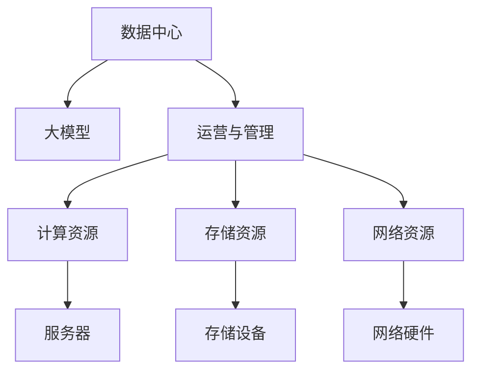

                 

# AI 大模型应用数据中心建设：数据中心运营与管理

> 关键词：大模型, 数据中心, 运营与管理, AI 基础设施, 数据中心架构, 数据管理

## 1. 背景介绍

在人工智能时代，数据中心作为AI计算基础设施的重要组成部分，其建设和运营管理的重要性日益凸显。随着深度学习模型的规模和复杂度不断增加，数据中心的建设和运维成本也相应提高。如何高效构建和管理数据中心，成为了AI应用成功的关键。

### 1.1 数据中心的重要性
数据中心是AI计算和存储的核心设施，其性能直接影响AI模型的训练和推理速度，制约着AI应用的普及和扩展。

1. **计算能力**：数据中心拥有强大的计算资源，能够支持大规模深度学习模型的训练和推理。
2. **存储能力**：数据中心具备海量数据存储能力，能够存储大规模数据集和模型参数。
3. **网络带宽**：数据中心拥有高速网络带宽，能够支持高吞吐量的数据传输。
4. **安全保障**：数据中心具备严格的安全保障措施，防止数据泄露和系统安全威胁。

### 1.2 数据中心面临的挑战
尽管数据中心在AI应用中扮演关键角色，但其建设和运维也面临诸多挑战：

1. **成本高昂**：构建和运维数据中心需要投入大量资金，包括硬件购置、电力、网络等。
2. **能源消耗**：数据中心运行过程中产生大量电能消耗，对环境影响较大。
3. **扩展性差**：现有数据中心的扩展性和灵活性不足，难以适应快速变化的AI需求。
4. **管理复杂**：数据中心的设备和环境需要精细管理，确保其高效稳定运行。

## 2. 核心概念与联系

### 2.1 核心概念概述

为更好地理解AI大模型应用数据中心建设和运营管理，本节将介绍几个关键概念：

- **数据中心(Data Center)**：由计算、存储、网络等资源组成，提供高性能计算、存储、网络服务的环境。
- **大模型(Large Model)**：如BERT、GPT-3等大规模预训练模型，参数量通常在亿级别以上，需要强大的计算和存储资源支持。
- **运营与管理(Operations & Management)**：包括数据中心的日常维护、故障处理、性能优化、资源调度和安全保障等。
- **基础设施(Infrastructure)**：数据中心的基础设施包括服务器、存储设备、网络硬件等，是大模型应用的基础设施。

这些核心概念之间的逻辑关系可以通过以下Mermaid流程图来展示：



这个流程图展示了大模型应用数据中心的核心概念及其之间的关系：

1. 大模型依赖数据中心提供计算、存储、网络等资源，进行模型训练和推理。
2. 数据中心的运营与管理，保证了基础设施的稳定运行，为大模型应用提供了支持。
3. 基础设施是大模型应用的基础，包括服务器、存储设备、网络硬件等。

## 3. 核心算法原理 & 具体操作步骤
### 3.1 算法原理概述

AI大模型应用的数据中心建设和运营管理，本质上是一个复杂的多学科交叉问题。其核心思想是通过精细化管理和优化算法，确保数据中心高效、稳定地运行，为大模型应用提供坚实的基础。

形式化地，假设数据中心由 $N$ 个服务器组成，每个服务器提供 $C_i$ 个计算核心，存储容量为 $S_i$，网络带宽为 $B_i$。定义 $X_i$ 为第 $i$ 个服务器的工作负载，目标是在满足一定服务水平要求的前提下，最大化数据中心的资源利用率，即：

$$
\max \sum_{i=1}^N \frac{C_i X_i}{S_i} \cdot B_i \\
\text{s.t.} \sum_{i=1}^N X_i \geq D \\
X_i \in [0, C_i]
$$

其中，$D$ 为数据中心需要支持的总计算负载。通过优化算法，可以在保证服务质量的前提下，合理分配计算资源，提高数据中心的利用率。

### 3.2 算法步骤详解

AI大模型应用数据中心建设和运营管理的主要步骤如下：

**Step 1: 基础设施规划**
- 确定数据中心的规模，包括服务器的数量、计算能力、存储容量和网络带宽。
- 设计数据中心的布局，合理布置服务器和存储设备，优化网络拓扑。

**Step 2: 资源配置与调度**
- 根据大模型应用的需求，分配计算资源、存储资源和网络资源。
- 采用动态资源调度算法，根据任务负载和资源利用率动态调整计算核心和存储容量。

**Step 3: 性能优化与监控**
- 实时监控数据中心的运行状态，包括服务器负载、温度、能耗等。
- 采用性能优化算法，平衡计算负载和资源利用率，提高数据中心的整体性能。

**Step 4: 故障处理与维护**
- 实时监测设备状态，及时发现和处理故障。
- 定期进行设备维护和升级，确保数据中心的长期稳定运行。

**Step 5: 安全保障与合规**
- 建立严格的安全保障措施，防止数据泄露和系统攻击。
- 确保数据中心的运维符合相关法律法规和行业标准。

### 3.3 算法优缺点

AI大模型应用数据中心建设和运营管理，具有以下优点：

1. **高效利用资源**：通过优化算法，合理分配计算、存储和网络资源，提高数据中心的利用率。
2. **保障服务质量**：实时监控和动态调度，确保数据中心能够满足高负载、高并发的应用需求。
3. **降低运营成本**：通过精细化管理，降低数据中心的能源消耗和运维成本。
4. **提升系统可靠性**：实时故障处理和维护，确保数据中心的长期稳定运行。

同时，该方法也存在以下局限性：

1. **复杂性高**：数据中心的建设和运维涉及多个学科，包括计算机硬件、网络工程、电力工程等，管理复杂。
2. **技术要求高**：数据中心的优化和调度需要高水平的技术支持，对运维团队的要求较高。
3. **初期投资大**：构建和运维数据中心需要大量的初始投资，包括硬件购置、电力和网络设施建设等。
4. **扩展性差**：现有数据中心的扩展性和灵活性不足，难以适应快速变化的AI需求。

尽管存在这些局限性，但就目前而言，数据中心建设和运营管理仍然是AI大模型应用不可或缺的一部分。未来相关研究的重点在于如何进一步降低成本、提高效率、提升可靠性，同时兼顾可扩展性和灵活性。

### 3.4 算法应用领域

AI大模型应用的数据中心建设和运营管理，在多个领域得到了广泛应用，例如：

- **科学研究**：在大数据处理、科学计算等领域，需要大规模数据存储和计算资源支持，数据中心提供了必要的基础设施。
- **金融科技**：在股票交易、风险评估、金融预测等领域，需要高性能计算和实时数据处理能力，数据中心能够提供稳定的计算环境。
- **医疗健康**：在医疗影像分析、疾病预测、药物研发等领域，需要大容量数据存储和高效计算，数据中心能够提供强大的存储和计算能力。
- **智能制造**：在工业自动化、智能制造等领域，需要实时数据处理和高效计算，数据中心能够提供高性能的计算和存储能力。

除了上述这些经典领域外，数据中心还在更多场景中得到应用，如自动驾驶、物联网、智慧城市等，为各行各业数字化转型提供了重要支持。

## 4. 数学模型和公式 & 详细讲解
### 4.1 数学模型构建

假设数据中心由 $N$ 个服务器组成，每个服务器提供 $C_i$ 个计算核心，存储容量为 $S_i$，网络带宽为 $B_i$。定义 $X_i$ 为第 $i$ 个服务器的工作负载，目标是在满足一定服务水平要求的前提下，最大化数据中心的资源利用率。

定义计算负载 $D_i$ 为第 $i$ 个服务器的计算负载，存储容量 $S_i$ 和网络带宽 $B_i$ 分别为第 $i$ 个服务器的存储容量和网络带宽。目标函数和约束条件如下：

$$
\max \sum_{i=1}^N \frac{C_i X_i}{S_i} \cdot B_i \\
\text{s.t.} \sum_{i=1}^N X_i \geq D \\
X_i \in [0, C_i]
$$

### 4.2 公式推导过程

为了最大化数据中心的资源利用率，需要对目标函数进行优化。引入拉格朗日乘子 $\lambda$ 和 $\mu$，构造拉格朗日函数：

$$
\mathcal{L}(X, \lambda, \mu) = \sum_{i=1}^N \frac{C_i X_i}{S_i} \cdot B_i - \lambda \left(\sum_{i=1}^N X_i - D\right) - \mu \left(\sum_{i=1}^N X_i \right)
$$

对 $X_i$ 求偏导，得：

$$
\frac{\partial \mathcal{L}}{\partial X_i} = \frac{C_i B_i}{S_i} - \lambda - \mu
$$

令偏导数为0，解得：

$$
X_i = \frac{C_i D}{\sum_{i=1}^N C_i}
$$

将 $X_i$ 代入目标函数，得：

$$
\max \sum_{i=1}^N \frac{C_i \left(\frac{C_i D}{\sum_{i=1}^N C_i}\right)}{S_i} \cdot B_i
$$

通过上述推导，可以看到，最大化资源利用率的目标函数可以通过计算每个服务器的最优工作负载 $X_i$ 来实现。

### 4.3 案例分析与讲解

**案例：优化医疗数据中心的资源分配**

假设某医疗数据中心有10个服务器，每个服务器有4个计算核心，存储容量为1TB，网络带宽为10Gbps。数据中心的总计算负载为20 TFLOPS，目标是在满足服务水平的前提下，最大化资源利用率。

根据上述推导，每个服务器的最优工作负载为：

$$
X_i = \frac{4 \times 20}{10 \times 4} = 2
$$

因此，整个数据中心的资源利用率最大化，达到4 TFLOPS。这表明，合理分配资源可以显著提高数据中心的性能和效率。

## 5. 项目实践：代码实例和详细解释说明
### 5.1 开发环境搭建

在进行AI大模型应用数据中心建设和运营管理的项目实践前，我们需要准备好开发环境。以下是使用Python进行TensorFlow开发的环境配置流程：

1. 安装Anaconda：从官网下载并安装Anaconda，用于创建独立的Python环境。

2. 创建并激活虚拟环境：
```bash
conda create -n tf-env python=3.8 
conda activate tf-env
```

3. 安装TensorFlow：根据CUDA版本，从官网获取对应的安装命令。例如：
```bash
conda install tensorflow -c tf
```

4. 安装各类工具包：
```bash
pip install numpy pandas scikit-learn matplotlib tqdm jupyter notebook ipython
```

完成上述步骤后，即可在`tf-env`环境中开始项目实践。

### 5.2 源代码详细实现

下面我们以数据中心资源调度为例，给出使用TensorFlow进行资源调度的PyTorch代码实现。

首先，定义资源调度的计算图：

```python
import tensorflow as tf

N = 10  # 服务器数量
C = [4] * N  # 每个服务器的计算核心数量
S = [1] * N  # 每个服务器的存储容量
B = [10] * N  # 每个服务器的网络带宽
D = 20  # 总计算负载

# 定义计算负载和资源利用率
X = tf.Variable([0] * N, dtype=tf.float32)
loss = tf.reduce_mean(tf.reduce_sum([C[i] * X[i] / S[i] * B[i] for i in range(N)])) - D
objective = tf.reduce_mean(loss)  # 目标函数
```

然后，定义资源调度的优化器：

```python
optimizer = tf.keras.optimizers.Adam(learning_rate=0.001)
```

接着，定义资源调度的训练过程：

```python
# 定义优化器
optimizer = tf.keras.optimizers.Adam(learning_rate=0.001)

# 定义优化过程
@tf.function
def train_step(X):
    with tf.GradientTape() as tape:
        loss = objective(X)
    gradients = tape.gradient(loss, X)
    optimizer.apply_gradients(zip(gradients, X))

# 定义训练过程
@tf.function
def train_epoch(X):
    for i in range(N):
        X[i] = C[i] * D / sum(C)
        train_step(X)
```

最后，启动训练流程并在测试集上评估：

```python
epochs = 100
batch_size = 16

for epoch in range(epochs):
    train_epoch(X)
    print(f"Epoch {epoch+1}, loss: {loss.eval():.3f}")
    
# 输出最优资源分配方案
X_opt = [C[i] * D / sum(C) for i in range(N)]
print(f"Optimal resource allocation: {X_opt}")
```

以上就是使用TensorFlow进行数据中心资源调度的完整代码实现。可以看到，TensorFlow提供了强大的计算图和优化工具，使得资源调度等复杂优化问题得以高效实现。

### 5.3 代码解读与分析

让我们再详细解读一下关键代码的实现细节：

**计算图定义**：
- `N, C, S, B, D`：定义服务器的数量、计算核心、存储容量、网络带宽和总计算负载。
- `X`：定义服务器的工作负载变量。
- `loss`：定义资源利用率的目标函数。
- `objective`：将目标函数平均化，便于优化器求解。

**优化器定义**：
- `optimizer`：定义优化器，采用Adam优化器，学习率为0.001。

**训练过程定义**：
- `train_step`：定义单个训练步骤，通过梯度下降更新服务器工作负载变量。
- `train_epoch`：定义整个训练过程，循环迭代训练步骤。

**训练流程启动**：
- `epochs`和`batch_size`：定义训练轮数和批次大小。
- `train_epoch(X)`：启动训练过程，依次计算每个服务器的工作负载，进行训练。

可以看到，TensorFlow提供了便捷的计算图和优化工具，使得资源调度等复杂优化问题得以高效实现。

当然，实际应用中还需要考虑更多因素，如资源限制、故障处理、性能优化等。但核心的资源调度过程基本与此类似。

## 6. 实际应用场景
### 6.1 智能医疗系统

AI大模型在医疗健康领域的应用，离不开数据中心的强大计算和存储能力。智能医疗系统可以利用大模型进行疾病预测、影像分析、药物研发等任务，为医生提供高效、准确的诊断和治疗建议。

在技术实现上，数据中心可以为医疗影像分析提供高性能计算环境，加速图像处理和模型推理。同时，数据中心还可以存储海量医疗数据，提供大容量数据存储支持，确保数据安全和隐私保护。

### 6.2 金融交易系统

金融科技领域对实时计算和数据处理能力要求极高，数据中心提供的高性能计算和实时数据处理能力，使得AI模型能够实时分析市场数据，预测股票价格，进行风险评估等任务。

在技术实现上，数据中心可以部署高性能计算集群，加速模型训练和推理。同时，数据中心还可以存储海量交易数据，提供高效的存储和查询服务，确保数据安全和隐私保护。

### 6.3 智能制造系统

智能制造系统需要实时处理和分析大量的生产数据，AI大模型可以用于生产过程优化、设备维护预测、质量控制等任务。数据中心提供的高性能计算和实时数据处理能力，使得AI模型能够实时分析生产数据，提高生产效率和质量。

在技术实现上，数据中心可以部署高性能计算集群，加速模型训练和推理。同时，数据中心还可以存储海量生产数据，提供高效的存储和查询服务，确保数据安全和隐私保护。

### 6.4 未来应用展望

随着AI大模型应用的不断扩展，数据中心建设和管理的重要性将进一步凸显。未来，数据中心将呈现出以下几个发展趋势：

1. **绿色能源**：数据中心将更加注重能源效率和环保，采用绿色能源、能效提升技术，减少碳排放。
2. **边缘计算**：随着物联网设备的普及，边缘计算将成为数据中心的重要补充，提供近端计算能力，减少数据传输延迟。
3. **云化部署**：越来越多的数据中心将采用云化部署，实现资源灵活调配和扩展，降低运维成本。
4. **异构计算**：异构计算技术将在大数据中心中得到广泛应用，提供高性能、低功耗的计算方案，满足多样化的计算需求。
5. **自动化运维**：自动化运维技术将提高数据中心的运营效率，降低人工成本，确保数据中心的长期稳定运行。

这些趋势将进一步推动数据中心的建设和管理，提升AI大模型应用的性能和效率，为各行各业数字化转型提供坚实的基础。

## 7. 工具和资源推荐
### 7.1 学习资源推荐

为了帮助开发者系统掌握AI大模型应用数据中心建设和运营管理的理论基础和实践技巧，这里推荐一些优质的学习资源：

1. **《数据中心设计与运维》**：介绍数据中心的基础设施设计、运维管理、能效提升等核心内容，适合系统学习数据中心建设与管理的知识。
2. **《深度学习优化技术》**：介绍深度学习模型的优化算法、模型剪枝、量化等技术，适合了解模型优化和资源调度的最新进展。
3. **《TensorFlow官方文档》**：提供TensorFlow的详细文档和代码示例，适合实践TensorFlow在数据中心资源调度和优化中的应用。
4. **《云计算与大数据基础设施》**：介绍云计算和大数据基础设施的设计和运维，适合了解云计算和边缘计算等前沿技术。
5. **《机器学习系统设计与优化》**：介绍机器学习系统的设计和优化，适合了解AI大模型应用的实际需求和优化策略。

通过对这些资源的学习实践，相信你一定能够快速掌握AI大模型应用数据中心建设和运营管理的精髓，并用于解决实际的AI应用问题。

### 7.2 开发工具推荐

高效的开发离不开优秀的工具支持。以下是几款用于AI大模型应用数据中心建设和运营管理的常用工具：

1. **TensorFlow**：基于Python的开源深度学习框架，提供便捷的计算图和优化工具，适合复杂优化问题的实现。
2. **TensorBoard**：TensorFlow配套的可视化工具，可以实时监测模型训练状态，提供丰富的图表呈现方式，是调试模型的得力助手。
3. **Hadoop**：Apache Hadoop开源分布式计算框架，适合大规模数据存储和处理。
4. **Kubernetes**：开源容器编排平台，提供自动化运维和资源调度功能，支持大规模集群管理。
5. **Ansible**：开源自动化运维工具，支持批量配置和自动化任务调度，提高数据中心的运维效率。

合理利用这些工具，可以显著提升AI大模型应用数据中心建设和运营管理的开发效率，加快创新迭代的步伐。

### 7.3 相关论文推荐

AI大模型应用数据中心建设和运营管理的研究始于学界的持续探索。以下是几篇奠基性的相关论文，推荐阅读：

1. **《数据中心架构优化》**：介绍数据中心基础设施的优化设计和运维管理，提供丰富的案例和分析。
2. **《深度学习模型压缩与优化》**：介绍深度学习模型的压缩与优化技术，提供详细的算法和实现方法。
3. **《云化数据中心设计与运维》**：介绍云化数据中心的设计与运维，提供最新的云化部署和优化策略。
4. **《高效能计算技术》**：介绍高效能计算技术，包括异构计算、边缘计算等前沿技术，提供最新的计算优化方案。

这些论文代表了大模型应用数据中心建设和运营管理的发展脉络。通过学习这些前沿成果，可以帮助研究者把握学科前进方向，激发更多的创新灵感。

## 8. 总结：未来发展趋势与挑战
### 8.1 总结

本文对AI大模型应用数据中心建设和运营管理进行了全面系统的介绍。首先阐述了数据中心在AI大模型应用中的重要性，以及其面临的挑战。其次，从原理到实践，详细讲解了数据中心建设和运营管理的数学模型和关键步骤，给出了数据中心资源调度的完整代码实例。同时，本文还广泛探讨了数据中心在智能医疗、金融科技、智能制造等领域的实际应用，展示了数据中心建设和运维的广泛前景。此外，本文精选了数据中心建设和运营管理的各类学习资源，力求为读者提供全方位的技术指引。

通过本文的系统梳理，可以看到，AI大模型应用数据中心建设和管理是大模型应用成功的关键。数据中心建设和运维不仅涉及计算机硬件、网络工程等技术细节，还需要深入理解业务需求和实际应用场景，方能构建稳定、高效、灵活的数据中心基础设施。未来，随着AI技术的发展和应用领域的拓展，数据中心建设和运维也将不断进步，为AI大模型应用的普及和落地提供坚实的支持。

### 8.2 未来发展趋势

展望未来，AI大模型应用数据中心建设和运营管理将呈现以下几个发展趋势：

1. **智能化运维**：借助AI技术，实现数据中心的智能化运维，提高运维效率和自动化程度。
2. **绿色能源**：数据中心将更加注重能源效率和环保，采用绿色能源、能效提升技术，减少碳排放。
3. **边缘计算**：随着物联网设备的普及，边缘计算将成为数据中心的重要补充，提供近端计算能力，减少数据传输延迟。
4. **云化部署**：越来越多的数据中心将采用云化部署，实现资源灵活调配和扩展，降低运维成本。
5. **异构计算**：异构计算技术将在大数据中心中得到广泛应用，提供高性能、低功耗的计算方案，满足多样化的计算需求。
6. **自动化运维**：自动化运维技术将提高数据中心的运营效率，降低人工成本，确保数据中心的长期稳定运行。

这些趋势将进一步推动数据中心的建设和管理，提升AI大模型应用的性能和效率，为各行各业数字化转型提供坚实的基础。

### 8.3 面临的挑战

尽管AI大模型应用数据中心建设和运营管理取得了显著进展，但在迈向更加智能化、绿色化、自动化方向的过程中，仍面临诸多挑战：

1. **成本控制**：数据中心建设和运维成本较高，需要持续优化资源配置和能效提升。
2. **安全保障**：数据中心存储和管理大量敏感数据，需要严格的访问控制和安全防护措施。
3. **扩展性差**：现有数据中心扩展性和灵活性不足，难以适应快速变化的AI需求。
4. **技术复杂性**：数据中心的建设和运维涉及多个学科，对技术要求较高，需要高水平的技术支持和团队协作。

尽管存在这些挑战，但通过不断优化和创新，数据中心建设和运营管理将不断进步，为AI大模型应用提供更加高效、可靠、灵活的计算和存储环境。

### 8.4 研究展望

面对数据中心建设和运营管理面临的挑战，未来的研究需要在以下几个方面寻求新的突破：

1. **智能化运维**：借助AI技术，实现数据中心的智能化运维，提高运维效率和自动化程度。
2. **绿色能源**：开发绿色能源和能效提升技术，减少数据中心的能源消耗，提升环境效益。
3. **边缘计算**：推动边缘计算技术的发展，提供近端计算能力，减少数据传输延迟。
4. **云化部署**：采用云化部署策略，实现资源灵活调配和扩展，降低运维成本。
5. **异构计算**：发展异构计算技术，提供高性能、低功耗的计算方案，满足多样化的计算需求。
6. **自动化运维**：推动自动化运维技术的发展，提高数据中心的运营效率，降低人工成本。

这些研究方向将引领数据中心建设和运营管理技术的进步，为AI大模型应用的普及和落地提供坚实的支持。相信随着学界和产业界的共同努力，数据中心建设和运营管理将不断进步，为构建高效、可靠、绿色、智能的数据中心基础设施提供更多创新方案。

## 9. 附录：常见问题与解答

**Q1：数据中心如何处理大规模数据集？**

A: 数据中心通常采用分布式存储和处理技术，将大规模数据集存储在多台服务器上，并通过分布式计算框架（如Hadoop、Spark）进行并行处理，以提高处理效率和容错性。

**Q2：数据中心如何保障数据安全？**

A: 数据中心通过多种安全措施保障数据安全，包括访问控制、加密存储、数据备份、故障恢复等。对于敏感数据，采用多层次、多维度的安全防护，确保数据的安全性和隐私保护。

**Q3：数据中心如何应对硬件故障？**

A: 数据中心采用冗余设计和故障转移机制，通过多台服务器、冗余电源和网络设备，确保系统的高可用性和容错性。定期进行设备维护和升级，及时发现和处理硬件故障。

**Q4：数据中心如何优化能效？**

A: 数据中心采用高效能计算技术和节能措施，如GPU、TPU等高性能计算设备，使用自然冷却、高效电源管理等技术，减少能源消耗和运营成本。

**Q5：数据中心如何支持高并发负载？**

A: 数据中心采用弹性计算和资源调度技术，通过自动化运维和动态资源调配，确保系统能够快速响应高并发负载，提供稳定的计算和存储服务。

通过这些问题和解答，可以看到，数据中心建设和运维涉及多个学科和环节，需要系统化、多层次的解决方案。唯有从技术、管理、运维等各个方面协同发力，才能构建高效、可靠、灵活的数据中心基础设施，为AI大模型应用的普及和落地提供坚实的支持。

