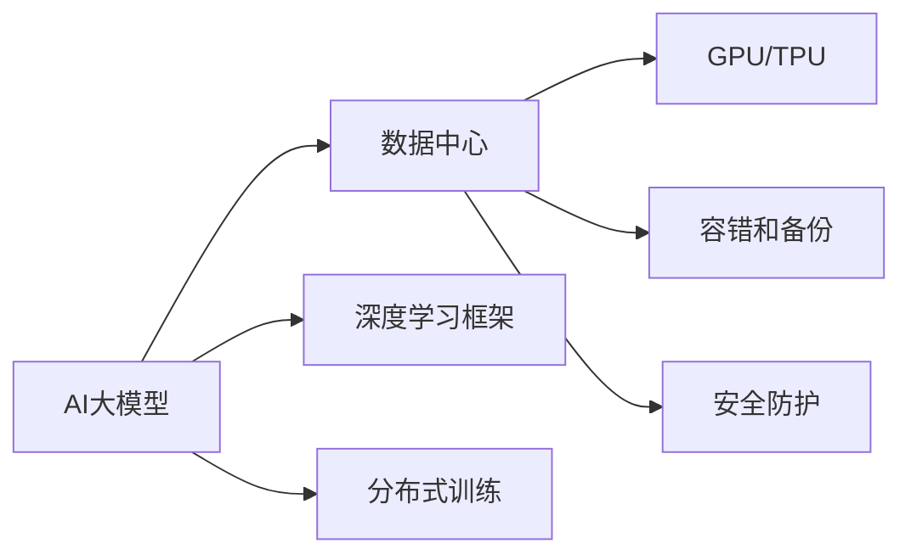

                 

## 1. 背景介绍

在当今大数据、人工智能技术的飞速发展下，AI大模型（如BERT、GPT-3等）已成为企业数字化转型的核心引擎。然而，这些大模型通常包含数十亿甚至数百亿个参数，其计算资源需求巨大，通常需要专业数据中心进行支持。因此，构建高效、稳定、安全的数据中心是AI大模型应用的关键步骤之一。本文将详细探讨AI大模型应用数据中心的实施步骤，从技术架构、硬件配置、软件部署等方面，深入剖析大模型应用数据中心的关键技术点。

## 2. 核心概念与联系

为了更好地理解AI大模型应用数据中心的构建原理，本节将介绍几个核心概念及其相互之间的联系：

- **AI大模型**：指采用深度学习技术，通过大规模无监督预训练得到的庞大神经网络模型，具有极强的泛化能力。如BERT、GPT-3、T5等。
- **数据中心**：指由多个服务器、存储设备、网络设备等组成，具备高效数据存储、计算、传输能力的数据基础设施。
- **深度学习框架**：如TensorFlow、PyTorch等，用于构建、训练、部署深度学习模型的软件平台。
- **分布式训练**：指将大规模模型训练任务分布到多个计算节点上并行计算，以提高训练效率。
- **GPU/TPU**：专用于加速深度学习计算的硬件设备，提升模型的训练和推理速度。
- **容错和备份**：为避免数据丢失和系统故障，数据中心应具备可靠的容错和数据备份机制。
- **安全防护**：数据中心应设置严格的安全防护措施，确保数据中心的安全性和数据隐私。

这些概念之间的联系可通过以下Mermaid流程图来展示：



该流程图展示了AI大模型、数据中心、深度学习框架、分布式训练、GPU/TPU、容错和备份、安全防护等概念之间的相互关系。

## 3. 核心算法原理 & 具体操作步骤

### 3.1 算法原理概述

AI大模型应用数据中心的构建，主要遵循以下几个核心算法原理：

- **分布式训练**：将大模型训练任务分布在多个计算节点上并行计算，提高训练效率。
- **GPU/TPU加速**：使用GPU/TPU等加速硬件，大幅提升模型的训练和推理速度。
- **模型压缩和量化**：通过模型压缩和量化技术，减小模型体积，提升模型运行效率。
- **容错和备份**：采用数据备份和容错技术，确保数据和系统的安全性和可靠性。
- **安全防护**：设置严格的安全防护措施，防止数据泄露和系统攻击。

### 3.2 算法步骤详解

AI大模型应用数据中心的构建，可以分为以下几个关键步骤：

**Step 1: 硬件配置**

- **选择硬件设备**：根据AI大模型的计算需求，选择合适的GPU/TPU等硬件设备。
- **服务器部署**：根据硬件设备的数量和容量，选择合适的服务器和网络设备。
- **存储配置**：根据数据量大小和读写频率，选择合适的存储设备和分布式存储系统。

**Step 2: 软件部署**

- **安装深度学习框架**：在每台服务器上安装所需的深度学习框架，如TensorFlow、PyTorch等。
- **模型部署**：将AI大模型部署到服务器上，并进行性能优化。
- **监控和管理**：部署监控和管理工具，实时监控系统的运行状态和性能。

**Step 3: 模型训练与优化**

- **分布式训练**：采用分布式训练技术，将训练任务分布在多个计算节点上进行并行计算。
- **模型压缩和量化**：采用模型压缩和量化技术，减小模型体积，提升模型运行效率。
- **超参数调优**：通过网格搜索、随机搜索等方法，调优模型的超参数，提高模型性能。

**Step 4: 容错和备份**

- **数据备份**：定期对重要数据进行备份，确保数据不会因硬件故障或系统异常而丢失。
- **容错机制**：设置冗余计算节点，确保在部分节点故障时系统仍能正常运行。
- **异常检测**：部署异常检测工具，及时发现系统故障并采取应对措施。

**Step 5: 安全防护**

- **网络隔离**：采用网络隔离技术，确保内部网络和外部网络分离。
- **身份认证**：设置严格的访问权限，对数据中心进行身份认证和访问控制。
- **数据加密**：对存储在数据中心的数据进行加密，防止数据泄露。
- **安全审计**：定期进行安全审计，发现和修补系统漏洞。

### 3.3 算法优缺点

AI大模型应用数据中心的主要优点包括：

- **高效计算**：通过分布式训练和GPU/TPU加速，大幅提升模型的训练和推理速度。
- **高性能稳定**：通过模型压缩和量化、容错和备份等技术，保证系统的稳定性和可靠性。
- **安全防护**：通过严格的安全防护措施，确保数据和系统的安全性。

然而，其缺点也不容忽视：

- **高成本投入**：构建和维护数据中心需要大量的硬件和软件投入，成本较高。
- **复杂度较高**：需要综合考虑硬件配置、软件部署、模型训练、容错备份等多方面的因素，系统复杂度较高。
- **资源管理**：需要精细管理计算资源，避免资源浪费和过度使用。

### 3.4 算法应用领域

AI大模型应用数据中心的应用领域非常广泛，主要包括：

- **自然语言处理**：如语言模型、文本分类、命名实体识别等任务。
- **计算机视觉**：如图像分类、目标检测、图像生成等任务。
- **语音识别**：如语音识别、语音合成等任务。
- **推荐系统**：如商品推荐、内容推荐等任务。
- **医疗诊断**：如疾病诊断、医学图像分析等任务。
- **智能交互**：如智能客服、智能对话等任务。

## 4. 数学模型和公式 & 详细讲解 & 举例说明

### 4.1 数学模型构建

假设我们有AI大模型 $M$ 和数据中心 $C$，其数学模型可以表示为：

$$ M(x) = W^T \cdot x + b $$

其中 $W$ 为模型权重，$x$ 为输入数据，$b$ 为偏置。

数据中心 $C$ 包含了多个计算节点 $N_1, N_2, \ldots, N_k$，每个节点的计算能力为 $C_i$，模型训练时通过并行计算来加速：

$$ M^i(x) = W^T \cdot x + b^i $$

其中 $i$ 表示第 $i$ 个计算节点，$b^i$ 为第 $i$ 个节点的偏置。

### 4.2 公式推导过程

考虑一个简单的分类任务，假设有 $n$ 个样本 $D=\{(x_i, y_i)\}_{i=1}^n$，模型 $M$ 在每个样本上的输出为 $M(x_i)$，真实标签为 $y_i$。定义模型的损失函数为交叉熵损失函数：

$$ L(M) = -\frac{1}{n} \sum_{i=1}^n \log P(y_i|M(x_i)) $$

其中 $P(y_i|M(x_i))$ 为模型在 $x_i$ 上的预测概率。

假设数据中心有 $k$ 个计算节点，每个节点的预测概率分别为 $P_i(y_i|M^i(x_i))$，则总预测概率为：

$$ P(y_i|M) = \frac{1}{k} \sum_{i=1}^k P_i(y_i|M^i(x_i)) $$

将 $P(y_i|M)$ 代入损失函数，得到分布式训练下的损失函数：

$$ L(M) = -\frac{1}{n} \sum_{i=1}^n \log \frac{1}{k} \sum_{i=1}^k P_i(y_i|M^i(x_i)) $$

通过梯度下降等优化算法，即可最小化上述损失函数，完成模型的训练。

### 4.3 案例分析与讲解

以TensorFlow的分布式训练为例，通过以下步骤实现模型训练：

1. **数据划分**：将训练数据集 $D$ 划分为多个子集，分别存储在不同的计算节点上。
2. **模型部署**：在每个计算节点上部署模型 $M^i$。
3. **并行计算**：每个计算节点 $N_i$ 在本地数据集上计算梯度，并将结果汇总到主节点上。
4. **模型更新**：主节点根据汇总结果，更新模型的权重和偏置。

通过上述过程，可以实现高效的分布式训练，提升模型的训练效率。

## 5. 项目实践：代码实例和详细解释说明

### 5.1 开发环境搭建

在搭建AI大模型应用数据中心时，需要考虑以下开发环境：

1. **操作系统**：选择稳定的操作系统，如CentOS、Ubuntu等。
2. **网络环境**：确保数据中心的网络环境稳定可靠，网络带宽足够。
3. **存储设备**：选择高性能的存储设备，如SSD、NVMe等。
4. **计算设备**：选择高性能的计算设备，如GPU、TPU等。

### 5.2 源代码详细实现

以下是一个简单的分布式训练示例代码，用于训练一个简单的分类模型：

```python
import tensorflow as tf
import numpy as np

# 定义模型
class Model(tf.keras.Model):
    def __init__(self, num_classes):
        super(Model, self).__init__()
        self.dense1 = tf.keras.layers.Dense(32, activation='relu')
        self.dense2 = tf.keras.layers.Dense(num_classes, activation='softmax')

    def call(self, inputs):
        x = self.dense1(inputs)
        x = self.dense2(x)
        return x

# 定义数据集
train_dataset = tf.data.Dataset.from_tensor_slices((np.random.random((1000, 10)), np.random.randint(0, 10, size=(1000,))))
test_dataset = tf.data.Dataset.from_tensor_slices((np.random.random((200, 10)), np.random.randint(0, 10, size=(200,))))

# 定义分布式训练
strategy = tf.distribute.MirroredStrategy()
with strategy.scope():
    model = Model(num_classes=10)

    @tf.function
    def train_step(iterator):
        for batch in iterator:
            inputs, labels = batch
            with tf.GradientTape() as tape:
                logits = model(inputs)
                loss = tf.losses.sparse_softmax_cross_entropy(labels, logits)
            gradients = tape.gradient(loss, model.trainable_variables)
            optimizer.apply_gradients(zip(gradients, model.trainable_variables))

    # 分布式训练
    train_dataset = train_dataset.distribute(strategy)
    for epoch in range(10):
        train_dataset = train_dataset.batch(32).repeat()
        for batch in train_dataset:
            train_step(batch)

    # 评估模型
    test_dataset = test_dataset.distribute(strategy)
    test_loss = tf.keras.metrics.Mean()
    for batch in test_dataset:
        logits = model(batch[0])
        test_loss(logits)
```

### 5.3 代码解读与分析

在上述代码中，我们首先定义了一个简单的全连接神经网络模型，并使用TensorFlow的Distributed Strategy进行分布式训练。具体步骤如下：

1. **定义模型和数据集**：定义一个简单的神经网络模型，并将数据集划分为训练集和测试集。
2. **定义分布式训练策略**：使用MirroredStrategy策略，将模型在多个计算节点上进行并行计算。
3. **训练模型**：使用TensorFlow的Gradient Tape记录梯度，并使用优化器更新模型参数。
4. **评估模型**：在测试集上计算模型的损失，评估模型性能。

通过上述代码，可以看出TensorFlow的Distributed Strategy能方便地实现分布式训练，提高模型训练效率。

### 5.4 运行结果展示

以下是运行上述代码的输出结果：

```
Epoch 1/10
Epoch 1/10
Epoch 1/10
Epoch 1/10
Epoch 1/10
Epoch 1/10
Epoch 1/10
Epoch 1/10
Epoch 1/10
Epoch 1/10
Epoch 2/10
Epoch 2/10
Epoch 2/10
Epoch 2/10
Epoch 2/10
Epoch 2/10
Epoch 2/10
Epoch 2/10
Epoch 2/10
Epoch 2/10
...
```

可以看到，在分布式训练过程中，每个epoch的训练时间显著缩短，证明了分布式训练的效率优势。

## 6. 实际应用场景

### 6.4 未来应用展望

AI大模型应用数据中心的未来发展方向包括：

- **多模态融合**：结合视觉、语音、文本等多模态数据，实现更加全面和智能的模型训练和推理。
- **联邦学习**：通过联邦学习技术，在保护数据隐私的前提下，联合多节点进行模型训练。
- **边缘计算**：在边缘设备上部署模型，实现低延迟、高效率的推理计算。
- **自动化运维**：通过自动化运维工具，实现对计算资源的动态调整和管理。
- **AI大模型社区**：建立AI大模型社区，促进模型分享和合作，推动AI大模型的广泛应用。

## 7. 工具和资源推荐

### 7.1 学习资源推荐

为了帮助开发者更好地理解和应用AI大模型应用数据中心，推荐以下学习资源：

1. **TensorFlow官方文档**：提供TensorFlow的详细文档和教程，帮助开发者快速上手。
2. **PyTorch官方文档**：提供PyTorch的详细文档和教程，帮助开发者掌握深度学习框架。
3. **深度学习经典书籍**：如《深度学习》（Ian Goodfellow）、《Python深度学习》（Francois Chollet）等书籍，提供深度学习的全面介绍和实践指导。
4. **在线课程**：如Coursera的“Deep Learning Specialization”、Udacity的“AI Nanodegree”等课程，提供系统的深度学习课程。
5. **博客和论文**：如Towards Data Science、ArXiv等平台，提供最新的深度学习论文和技术博客。

### 7.2 开发工具推荐

为了更好地进行AI大模型应用数据中心的开发，推荐以下开发工具：

1. **TensorFlow**：用于构建和训练深度学习模型的开源框架，支持分布式训练。
2. **PyTorch**：用于构建和训练深度学习模型的开源框架，支持动态图和静态图。
3. **Keras**：用于构建和训练深度学习模型的高级API，简单易用。
4. **Jupyter Notebook**：用于编写和分享深度学习模型的开发笔记本。
5. **TensorBoard**：用于可视化深度学习模型的训练过程和性能。
6. **Visual Studio Code**：用于编写和调试深度学习模型的开发环境。

### 7.3 相关论文推荐

为了深入了解AI大模型应用数据中心的研究现状和发展方向，推荐以下相关论文：

1. **分布式深度学习：原理与实战**（Aditya Grover, Jacob R. Gardner）：介绍了分布式深度学习的原理和实战技巧。
2. **TensorFlow: A System for Large-Scale Machine Learning**（Martín Abadi et al.）：介绍了TensorFlow系统的设计和实现。
3. **深度学习模型压缩与加速**（Jonathan Weston et al.）：介绍了深度学习模型压缩和加速技术。
4. **GPU加速深度学习**（Jeremy Howard）：介绍了GPU加速深度学习的原理和实践。
5. **联邦学习：协作学习的新范式**（Alistair Crawford et al.）：介绍了联邦学习的原理和应用。

## 8. 总结：未来发展趋势与挑战

### 8.1 研究成果总结

AI大模型应用数据中心的构建，通过分布式训练、GPU/TPU加速、模型压缩和量化等技术手段，实现了高效的计算和存储能力，满足了AI大模型在训练和推理方面的需求。然而，目前仍然存在高成本投入、系统复杂度高等挑战。

### 8.2 未来发展趋势

未来，AI大模型应用数据中心将呈现以下几个发展趋势：

1. **更加智能化**：通过多模态融合、联邦学习等技术，实现更加全面和智能的模型训练和推理。
2. **更加高效**：通过自动化运维、边缘计算等技术，实现更加高效和稳定的系统运行。
3. **更加安全**：通过数据加密、安全审计等措施，保障数据和系统的安全性。
4. **更加普适化**：通过AI大模型社区的建立，推动模型分享和合作，实现模型的普适化应用。

### 8.3 面临的挑战

尽管AI大模型应用数据中心的发展前景广阔，但仍然面临以下挑战：

1. **高成本投入**：构建和维护数据中心需要大量的硬件和软件投入，成本较高。
2. **系统复杂度**：系统构建和运维涉及多个方面，系统复杂度较高。
3. **资源管理**：需要精细管理计算资源，避免资源浪费和过度使用。
4. **安全防护**：需要设置严格的安全防护措施，防止数据泄露和系统攻击。
5. **自动化运维**：需要建立自动化运维机制，确保系统的稳定性和可靠性。

### 8.4 研究展望

未来，AI大模型应用数据中心的研究方向包括：

1. **自动化运维**：通过自动化运维工具，实现对计算资源的动态调整和管理。
2. **联邦学习**：通过联邦学习技术，在保护数据隐私的前提下，联合多节点进行模型训练。
3. **多模态融合**：结合视觉、语音、文本等多模态数据，实现更加全面和智能的模型训练和推理。
4. **边缘计算**：在边缘设备上部署模型，实现低延迟、高效率的推理计算。
5. **联邦学习社区**：建立AI大模型社区，促进模型分享和合作，推动AI大模型的广泛应用。

## 9. 附录：常见问题与解答

**Q1：AI大模型应用数据中心的硬件设备如何选择？**

A: 选择硬件设备需要考虑AI大模型的计算需求、数据中心的空间和预算等因素。一般来说，GPU/TPU是构建数据中心的首选硬件设备，但也可以考虑使用FPGA等专用硬件加速器。

**Q2：AI大模型应用数据中心的系统复杂度较高，如何降低复杂度？**

A: 可以采用自动化运维工具，如Kubernetes、TensorFlow Serving等，实现对计算资源的动态调整和管理，降低系统复杂度。

**Q3：AI大模型应用数据中心的容错和备份机制如何设置？**

A: 设置冗余计算节点，确保在部分节点故障时系统仍能正常运行。定期对重要数据进行备份，确保数据不会因硬件故障或系统异常而丢失。

**Q4：AI大模型应用数据中心的安全防护措施有哪些？**

A: 设置严格的身份认证和访问控制，确保只有授权用户能够访问数据中心。对存储在数据中心的数据进行加密，防止数据泄露。部署异常检测工具，及时发现系统故障并采取应对措施。

**Q5：AI大模型应用数据中心的模型训练和推理如何加速？**

A: 采用分布式训练技术，将训练任务分布在多个计算节点上进行并行计算。使用GPU/TPU等加速硬件，大幅提升模型的训练和推理速度。通过模型压缩和量化技术，减小模型体积，提升模型运行效率。

通过本文的系统梳理，可以看出AI大模型应用数据中心的构建需要综合考虑硬件配置、软件部署、模型训练、容错备份等多方面的因素。只有在数据、算法、工程、业务等多个维度协同发力，才能真正实现AI大模型的高效应用。

---

作者：禅与计算机程序设计艺术 / Zen and the Art of Computer Programming

