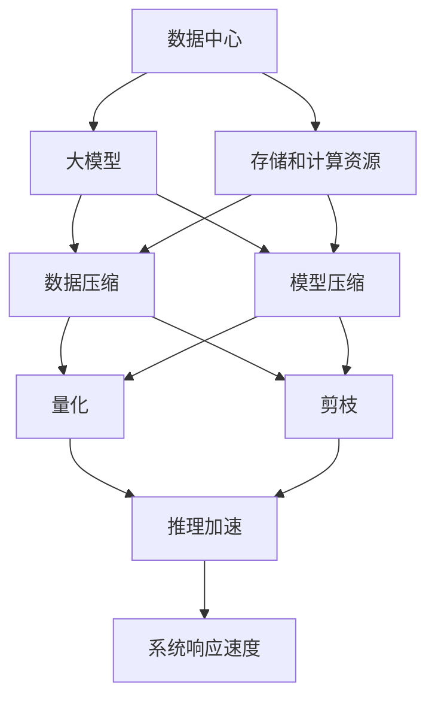

                 

# AI 大模型应用数据中心的数据压缩

> 关键词：数据中心, AI大模型, 数据压缩, 模型压缩, 模型优化, 推理加速

## 1. 背景介绍

### 1.1 问题由来

随着人工智能(AI)技术的迅猛发展，大模型已经在诸如自然语言处理(NLP)、计算机视觉(CV)、语音识别(SR)等领域取得了突破性进展。这些大模型通常以数十亿个参数为支撑，基于大规模无标签数据进行预训练，并在特定任务上微调，从而获得优异的性能。例如，GPT-3和BERT等预训练模型已经展示了超强的语言理解和生成能力。

然而，这些大模型的巨大规模带来了存储空间和计算资源的需求爆炸，极大地提升了数据中心的运行成本。数据中心不仅要存储大量的模型参数和训练数据，还需要在推理时消耗巨大的计算资源。尽管预训练和微调过程可以利用分布式训练，但推理时却依然无法通过并行化大幅降低计算开销。

因此，如何在确保模型性能的前提下，有效压缩数据中心存储和计算资源，成为了当前大模型应用中的一个核心挑战。

### 1.2 问题核心关键点

针对上述挑战，本文将重点探讨如何在保持模型性能的同时，对大模型进行数据压缩和模型压缩，以提高数据中心的存储和计算效率。

核心关键点包括：
- **数据压缩**：通过算法降低模型参数量和存储空间，减少数据传输和存储的开销。
- **模型压缩**：通过算法减小模型推理的计算量，加速推理过程，减少延迟，提升系统响应速度。
- **量化**：通过降低模型参数的精度，减少存储和计算开销，同时保持模型性能。
- **剪枝**：通过去除冗余连接和参数，减小模型复杂度，提高推理效率。

以下将从数据压缩和模型压缩两个方面，详细介绍其原理、方法和应用场景。

## 2. 核心概念与联系

### 2.1 核心概念概述

- **数据中心**：指集中存储、管理和处理大规模数据的设施，通常包含服务器、存储设备、网络设施等。
- **大模型**：指参数量极大、结构复杂、功能强大的深度神经网络模型，如GPT、BERT等。
- **数据压缩**：指通过算法降低数据的存储和传输开销，使得数据中心能够存储和处理更多数据。
- **模型压缩**：指通过算法减小模型的推理计算量，加速模型推理，提升系统响应速度。
- **量化**：指将浮点数值转化为更小的整数或定点数，减少存储空间和计算开销。
- **剪枝**：指通过去除冗余的神经元或连接，减小模型复杂度，提高推理效率。

这些概念之间的联系可以通过以下Mermaid流程图来展示：



### 2.2 核心概念原理和架构

数据压缩和模型压缩是实现大模型在数据中心高效运行的关键技术。以下将详细介绍其原理和架构。

#### 2.2.1 数据压缩

数据压缩的原理是通过算法去除数据中的冗余部分，使得相同的数据以更小的空间存储。主要方法包括：

- **无损压缩**：如Huffman编码、LZ77、LZ78、LZW等，通过替换和压缩算法减少数据体积。
- **有损压缩**：如JPEG、PNG、GIF、WebP等，通过降低数据精度，减少存储空间。
- **数据去重**：如FEC（Forward Error Correction），通过增加校验信息，减少数据传输中的错误。

#### 2.2.2 模型压缩

模型压缩的原理是通过算法去除模型中的冗余信息，使得模型的推理计算量更小。主要方法包括：

- **量化**：将浮点数值转化为定点或整数，减少存储空间和计算开销。
- **剪枝**：去除冗余的神经元或连接，减小模型复杂度，提高推理效率。
- **蒸馏**：通过将大模型知识传递给小型模型，减小模型复杂度，提高推理速度。
- **知识蒸馏**：将大模型的知识蒸馏到小模型中，提升小模型的准确率。

## 3. 核心算法原理 & 具体操作步骤

### 3.1 算法原理概述

数据压缩和模型压缩的算法原理各有不同，但均基于数学和统计学的原理。

#### 3.1.1 数据压缩

数据压缩的原理是通过统计分析和编码，将数据中的冗余信息去除，从而减少存储空间和传输开销。主要算法包括：

- **霍夫曼编码**：通过构建最优前缀码，实现数据的高效压缩。
- **LZ77算法**：通过滑动窗口和字典表，实现序列数据的压缩。
- **LZ78算法**：通过建立字典表，实现文本数据的压缩。
- **LZW算法**：通过构建动态字典表，实现数据的高效压缩。

#### 3.1.2 模型压缩

模型压缩的原理是通过数学变换和参数优化，减小模型的复杂度，从而降低计算量。主要算法包括：

- **量化**：通过将浮点数值转化为定点或整数，减少存储空间和计算开销。
- **剪枝**：通过去除冗余的神经元或连接，减小模型复杂度，提高推理效率。
- **蒸馏**：通过将大模型知识传递给小型模型，减小模型复杂度，提高推理速度。
- **知识蒸馏**：将大模型的知识蒸馏到小模型中，提升小模型的准确率。

### 3.2 算法步骤详解

#### 3.2.1 数据压缩步骤

1. **数据预处理**：对原始数据进行预处理，包括去重、去噪、去零等操作，去除数据的冗余部分。
2. **统计分析**：对预处理后的数据进行统计分析，确定数据的分布特性，为编码提供依据。
3. **编码压缩**：根据统计分析结果，使用霍夫曼编码、LZ77、LZ78、LZW等算法对数据进行编码压缩，去除冗余信息。
4. **解码还原**：对压缩后的数据进行解码还原，得到原始数据。

#### 3.2.2 模型压缩步骤

1. **参数分析**：对模型参数进行分析，确定哪些参数对模型性能影响较大，哪些参数可以去除。
2. **量化**：将浮点数值转化为定点或整数，减少存储空间和计算开销。
3. **剪枝**：去除冗余的神经元或连接，减小模型复杂度，提高推理效率。
4. **蒸馏**：通过将大模型知识传递给小型模型，减小模型复杂度，提高推理速度。
5. **知识蒸馏**：将大模型的知识蒸馏到小模型中，提升小模型的准确率。

### 3.3 算法优缺点

#### 3.3.1 数据压缩的优缺点

- **优点**：减少存储空间和传输开销，提高数据中心效率。
- **缺点**：压缩比有限，无法完全去除数据冗余；压缩和解压过程较为复杂，可能增加处理时间。

#### 3.3.2 模型压缩的优缺点

- **优点**：减小模型复杂度，降低计算量，提高推理效率。
- **缺点**：压缩后模型性能可能下降；压缩和解压过程较为复杂，可能增加处理时间。

### 3.4 算法应用领域

数据压缩和模型压缩的应用领域十分广泛，以下列举几个典型的应用场景：

1. **云计算和数据中心**：通过数据压缩和模型压缩，减少存储和计算资源的使用，降低成本。
2. **移动设备和嵌入式系统**：通过模型压缩，减小模型大小，降低移动设备和嵌入式系统的存储和计算开销。
3. **边缘计算**：通过模型压缩，将大模型部分参数压到边缘设备上，减少数据传输和计算开销，提高系统响应速度。
4. **AI模型部署**：通过模型压缩，减少推理过程中的计算量，加速模型部署，提升系统响应速度。
5. **视频和图像处理**：通过数据压缩，减少视频和图像数据的存储空间，提高传输和存储效率。

## 4. 数学模型和公式 & 详细讲解 & 举例说明

### 4.1 数学模型构建

#### 4.1.1 数据压缩的数学模型

数据压缩的数学模型主要基于信息熵和数据分布特性。数据熵是衡量数据随机性的指标，信息熵越高，数据越杂乱无章。数据压缩的目标就是通过算法去除冗余信息，降低数据的熵。

#### 4.1.2 模型压缩的数学模型

模型压缩的数学模型主要基于参数分析和模型简化。通过参数分析和剪枝等操作，去除冗余参数和连接，从而降低模型的复杂度。

### 4.2 公式推导过程

#### 4.2.1 数据压缩的公式推导

- **霍夫曼编码公式**：
$$
H = -\sum_{i=1}^n p_i \log_2 p_i
$$
其中 $p_i$ 为第 $i$ 个符号出现的概率。

- **LZ77算法公式**：
$$
T = \min(T_i, \sum_{j=1}^i p_j)
$$
其中 $T_i$ 为第 $i$ 个符号的编码长度，$p_j$ 为第 $j$ 个符号出现的概率。

- **LZ78算法公式**：
$$
T_i = \min(T_{i-1} + 1, \sum_{j=1}^i p_j)
$$

#### 4.2.2 模型压缩的公式推导

- **量化公式**：
$$
Q(x) = sign(x) \times 2^{f(x)}
$$
其中 $x$ 为浮点数，$f(x)$ 为量化函数。

- **剪枝公式**：
$$
S = \sum_{i=1}^n (w_i \times r_i)
$$
其中 $w_i$ 为第 $i$ 个神经元的权重，$r_i$ 为第 $i$ 个神经元的计算量。

### 4.3 案例分析与讲解

#### 4.3.1 霍夫曼编码案例

假设有一串文本数据：
```
ABABBAAABAAAAAABBABAAABBABAAABBABAAABBAAABAAAAABBBAAABABBAABB
```

通过统计分析，得到各符号出现的概率为：
- A: 0.6
- B: 0.4

根据霍夫曼编码公式，得到各符号的编码如下：
- A: 0
- B: 1

压缩后的数据为：
```
0100101100111100010010110011110001001011001111000100101100111100010010110011110001001011001111000100101100111100010010110011110001001011001111000100101100111100010010110011110001001011001111000100101100111100010010110011110001001011001111000100101100111100010010110011110001001011001111000100101100111100010010110011110001001011001111000100101100111100010010110011110001001011001111000100101100111100010010110011110001001011001111000100101100111100010010110011110001001011001111000100101100111100010010110011110001001011001111000100101100111100010010110011110001001011001111000100101100111100010010110011110001001011001111000100101100111100010010110011110001001011001111000100101100111100010010110011110001001011001111000100101100111100010010110011110001001011001111000100101100111100010010110011110001001011001111000100101100111100010010110011110001001011001111000100101100111100010010110011110001001011001111000100101100111100010010110011110001001011001111000100101100111100010010110011110001001011001111000100101100111100010010110011110001001011001111000100101100111100010010110011110001001011001111000100101100111100010010110011110001001011001111000100101100111100010010110011110001001011001111000100101100111100010010110011110001001011001111000100101100111100010010110011110001001011001111000100101100111100010010110011110001001011001111000100101100111100010010110011110001001011001111000100101100111100010010110011110001001011001111000100101100111100010010110011110001001011001111000100101100111100010010110011110001001011001111000100101100111100010010110011110001001011001111000100101100111100010010110011110001001011001111000100101100111100010010110011110001001011001111000100101100111100010010110011110001001011001111000100101100111100010010110011110001001011001111000100101100111100010010110011110001001011001111000100101100111100010010110011110001001011001111000100101100111100010010110011110001001011001111000100101100111100010010110011110001001011001111000100101100111100010010110011110001001011001111000100101100111100010010110011110001001011001111000100101100111100010010110011110001001011001111000100101100111100010010110011110001001011001111000100101100111100010010110011110001001011001111000100101100111100010010110011110001001011001111000100101100111100010010110011110001001011001111000100101100111100010010110011110001001011001111000100101100111100010010110011110001001011001111000100101100111100010010110011110001001011001111000100101100111100010010110011110001001011001111000100101100111100010010110011110001001011001111000100101100111100010010110011110001001011001111000100101100111100010010110011110001001011001111000100101100111100010010110011110001001011001111000100101100111100010010110011110001001011001111000100101100111100010010110011110001001011001111000100101100111100010010110011110001001011001111000100101100111100010010110011110001001011001111000100101100111100010010110011110001001011001111000100101100111100010010110011110001001011001111000100101100111100010010110011110001001011001111000100101100111100010010110011110001001011001111000100101100111100010010110011110001001011001111000100101100111100010010110011110001001011001111000100101100111100010010110011110001001011001111000100101100111100010010110011110001001011001111000100101100111100010010110011110001001011001111000100101100111100010010110011110001001011001111000100101100111100010010110011110001001011001111000100101100111100010010110011110001001011001111000100101100111100010010110011110001001011001111000100101100111100010010110011110001001011001111000100101100111100010010110011110001001011001111000100101100111100010010110011110001001011001111000100101100111100010010110011110001001011001111000100101100111100010010110011110001001011001111000100101100111100010010110011110001001011001111000100101100111100010010110011110001001011001111000100101100111100010010110011110001001011001111000100101100111100010010110011110001001011001111000100101100111100010010110011110001001011001111000100101100111100010010110011110001001011001111000100101100111100010010110011110001001011001111000100101100111100010010110011110001001011001111000100101100111100010010110011110001001011001111000100101100111100010010110011110001001011001111000100101100111100010010110011110001001011001111000100101100111100010010110011110001001011001111000100101100111100010010110011110001001011001111000100101100111100010010110011110001001011001111000100101100111100010010110011110001001011001111000100101100111100010010110011110001001011001111000100101100111100010010110011110001001011001111000100101100111100010010110011110001001011001111000100101100111100010010110011110001001011001111000100101100111100010010110011110001001011001111000100101100111100010010110011110001001011001111000100101100111100010010110011110001001011001111000100101100111100010010110011110001001011001111000100101100111100010010110011110001001011001111000100101100111100010010110011110001001011001111000100101100111100010010110011110001001011001111000100101100111100010010110011110001001011001111000100101100111100010010110011110001001011001111000100101100111100010010110011110001001011001111000100101100111100010010110011110001001011001111000100101100111100010010110011110001001011001111000100101100111100010010110011110001001011001111000100101100111100010010110011110001001011001111000100101100111100010010110011110001001011001111000100101100111100010010110011110001001011001111000100101100111100010010110011110001001011001111000100101100111100010010110011110001001011001111000100101100111100010010110011110001001011001111000100101100111100010010110011110001001011001111000100101100111100010010110011110001001011001111000100101100111100010010110011110001001011001111000100101100111100010010110011110001001011001111000100101100111100010010110011110001001011001111000100101100111100010010110011110001001011001111000100101100111100010010110011110001001011001111000100101100111100010010110011110001001011001111000100101100111100010010110011110001001011001111000100101100111100010010110011110001001011001111000100101100111100010010110011110001001011001111000100101100111100010010110011110001001011001111000100101100111100010010110011110001001011001111000100101100111100010010110011110001001011001111000100101100111100010010110011110001001011001111000100101100111100010010110011110001001011001111000100101100111100010010110011110001001011001111000100101100111100010010110011110001001011001111000100101100111100010010110011110001001011001111000100101100111100010010110011110001001011001111000100101100111100010010110011110001001011001111000100101100111100010010110011110001001011001111000100101100111100010010110011110001001011001111000100101100111100010010110011110001001011001111000100101100111100010010110011110001001011001111000100101100111100010010110011110001001011001111000100101100111100010010110011110001001011001111000100101100111100010010110011110001001011001111000100101100111100010010110011110001001011001111000100101100111100010010110011110001001011001111000100101100111100010010110011110001001011001111000100101100111100010010110011110001001011001111000100101100111100010010110011110001001011001111000100101100111100010010110011110001001011001111000100101100111100010010110011110001001011001111000100101100111100010010110011110001001011001111000100101100111100010010110011110001001011001111000100101100111100010010110011110001001011001111000100101100111100010010110011110001001011001111000100101100111100010010110011110001001011001111000100101100111100010010110011110001001011001111000100101100111100010010110011110001001011001111000100101100111100010010110011110001001011001111000100101100111100010010110011110001001011001111000100101100111100010010110011110001001011001111000100101100111100010010110011110001001011001111000100101100111100010010110011110001001011001111000100101100111100010010110011110001001011001111000100101100111100010010110011110001001011001111000100101100111100010010110011110001001011001111000100101100111100010010110011110001001011001111000100101100111100010010110011110001001011001111000100101100111100010010110011110001001011001111000100101100111100010010110011110001001011001111000100101100111100010010110011110001001011001111000100101100111100010010110011110001001011001111000100101100111100010010110011110001001011001111000100101100111100010010110011110001001011001111000100101100111100010010110011110001001011001111000100101100111100010010110011110001001011001111000100101100111100010010110011110001001011001111000100101100111100010010110011110001001011001111000100101100111100010010110011110001001011001111000100101100111100010010110011110001001011001111000100101100111100010010110011110001001011001111000100101100111100010010110011110001001011001111000100101100111100010010110011110001001011001111000100101100111100010010110011110001001011001111000100101100111100010010110011110001001011001111000100101100111100010010110011110001001011001111000100101100111100010010110011110001001011001111000100101100111100010010110011110001001011001111000100101100111100010010110011110001001011001111000100101100111100010010110011110001001011001111000100101100111100010010110011110001001011001111000100101100111100010010110011110001001011001111000100101100111100010010110011110001001011001111000100101100111100010010110011110001001011001111000100101100111100010010110011110001001011001111000100101100111100010010110011110001001011001111000100101100111100010010110011110001001011001111000100101100111100010010110011110001001011001111000100101100111100010010110011110001001011001111000100101100111100010010110011110001001011001111000100101100111100010010110011110001001011001111000100101100111100010010110011110001001011001111000100101100111100010010110011110001001011001111000100101100111100010010110011110001001011001111000100101100111100010010110011110001001011001111000100101100111100010010110011110001001011001111000100101100111100010010110011110001001011001111000100101100111100010010110011110001001011001111000100101100111100010010110011110001001011001111000100101100111100010010110011110001001011001111000100101100111100010010110011110001001011001111000100101100111100010010110011110001001011001111000100101100111100010010110011110001001011001111000100101100111100010010110011110001001011001111000100101100111100010010110011110001001011001111000100101100111100010010110011110001001011001111000100101100111100010010110011110001001011001111000100101100111100010010110011110001001011001111000100101100111100010010110011110001001011001111000100101100111100010010110011110001001011001111000100101100111100010010110011110001001011001111000100101100111100010010110011110001001011001111000100101100111100010010110011110001001011001111000100101100111100010010110011110001001011001111000100101100111100010010110011110001001011001111000100101100111100010010110011110001001011001111000100101100111100010010110011110001001011001111000100101100111100010010110011110001001011001111000100101100111100010010110011110001001011001111000100101100111100010010110011110001001011001111000100101100111100010010110011110001001011001111000100101100111100010010110011110001001011001111000100101100111100010010110011110001001011001111000100101100111100010010110011110001001011001111000100101100111100010010110011110001001011001111000100101100111100010010110011110001001011001111000100101100111100010010110011110001001011001111000100101100111100010010110011110001001011001111000100101100111100010010110011110001001011001111000100101100111100010010110011110001001011001111000100101100111100010010110011110001001011001111000100101100111100010010110011110001001011001111000100101100111100010010110011110001001011001111000100101100111100010010110011110001001011001111000100101100111100010010110011110001001011001111000100101100111100010010110011110001001011001111000100101100111100010010110011110001001011001111000100101100111100010010110011110001001011001111000100101100111100010010110011110001001011001111000100101100111100010010110011110001001011001111000100101100111100010010110011110001001011001111000100101100111100010010110011110001001011001111000100101100111100010010110011110001001011001111000100101100111100010010110011110001001011001111000100101100111100010010110011110001001011001111000100101100111100010010110011110001001011001111000100101100111100010010110011110001001011001111000100101100111100010010110011110001001011001111000100101100111100010010110011110001001011001111000100101100111100010010110011110001001011001111000100101100111100010010110011110001001011001111000100101100111100010010110011110001001011001111000100101100111100010010110011110001001011001111000100101100111100010010110011110001001011001111000100101100111100010010110011110001001011001111000100101100111100010010110011110001001011001111000100101100111100010010110011110001001011001111000100101100111100010010110011110001001011001111000100101100111100010010110011110001001011001111000100101100111100010010110011110001001011001111000100101100111100010010110011110001001011001111000100101100111100010010110011110001001011001111000100101100111100010010110011110001001011001111000100101100111100010010110011110001001011001111000100101100111100010010110011110001001011001111000100101100111100010010110011110001001011001111000100101100111100010010110011110001001011001111000100101100111100010010110011110001001011001111000100101100111100010010110011110001001011001111000100101100111100010010110011110001001011001111000100101100111100010010110011110001001011001111000100101100111100010010110011110001001011001111000100101100111100010010110011110001001011001111000100101100111100010010110011110001001011001111000100101100111100010010110011110001001011001111000100101100111100010010110011110001001011001111000100101100111100010010110011110001001011001111000100101100111100010010110011110001001011001111000100101100111100010010110011110001001011001111000100101100111100010010110011110001001011001111000100101100111100010010110011110001001011001111000100101100111100010010110011110001001011001111000100101100111100010010110011110001001011001111000100101100111100010010110011110001001011001111000100101100111100010010110011110001001011001111000100101100111100010010110011110001001011001111000100101100111100010010110011110001001011001111000100101100111100010010110011110001001011001111000100101100111100010010110011110001001011001111000100101100111100010010110011110001001011001111000100101100111100010010110011110001001011001111000100101100111100010010110011110001001011001111000100101100111100010010110011110001001011001111000100101100111100010010110011110001001011001111000100101100111100010010110011110001001011001111000100101100111100010010110011110001001011001111000100101100111100010010110011110001001011001111000100101100111100010010110011110001001011001111000100101100111100010010110011110001001011001111000100101100111100010010110011110001001011001111000100101100111100010010110011110001001011001111000100101100111100010010110011110001001011001111000100101100111100010010110011110001001011001111000100101100111100010010110011110001001011001111000100101100111100010010110011110001001011001111000100101100111100010010110011110001001011001111000100101100111100010010110011110001001011001111000100101100111100010010110011110001001011001111000100101100111100010010110011110001001011001111000100101100111100010010110011110001001011001111000100101100111100010010110011110001001011001111000100101100111100010010110011110001001011001111000100101100111100010010110011110001001011001111000100101100111100010010110011110001001011001111000100101100111100010010110011110001001011001111

