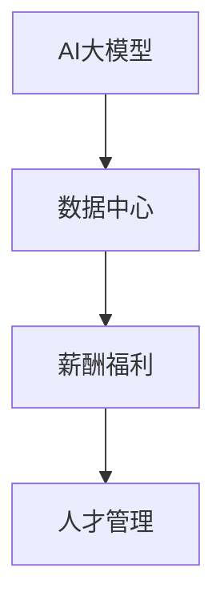

                 

# AI 大模型应用数据中心的薪酬福利

> 关键词：人工智能,大模型,薪酬福利,数据中心,AI工程,人才管理

## 1. 背景介绍

随着人工智能(AI)和大数据技术的飞速发展，全球各大企业纷纷加大AI技术的研究和应用投入，竞相构建行业领先的数据中心。特别是在AI大模型的应用上，数据中心成为了不可或缺的关键基础设施。本文将深入探讨AI大模型应用数据中心的薪酬福利问题，帮助企业构建完善的人才激励机制，吸引和保留AI顶尖人才，从而为数据中心运营和AI技术发展提供坚实的保障。

### 1.1 问题由来

数据中心作为AI大模型应用的基石，其高效稳定运行对于AI系统的性能和用户体验至关重要。然而，随着AI大模型的复杂性和规模不断扩大，对数据中心的硬件、网络和运维要求也随之提升，导致数据中心的运营成本不断攀升。为了确保数据中心的持续发展和AI技术的领先优势，优化薪酬福利策略、吸引和留住AI顶尖人才成为关键。

## 2. 核心概念与联系

### 2.1 核心概念概述

为更好地理解AI大模型应用数据中心薪酬福利问题，本节将介绍几个密切相关的核心概念：

- **AI大模型**：以深度学习、迁移学习、自监督学习等技术为基础，通过海量数据进行预训练得到的大型神经网络模型。大模型在图像识别、自然语言处理、语音识别等多个领域具有显著优势。

- **数据中心**：提供高性能计算、存储、网络和运维支持的数据基础设施，支持AI大模型的训练、推理和应用。数据中心是AI大模型应用的底层保障。

- **薪酬福利**：包括薪资、奖金、福利、股票期权、职业发展等在内的所有与员工收入和福利相关的政策。薪酬福利策略是企业吸引和留住人才的重要手段。

- **人才管理**：通过制定和实施有效的薪酬福利策略，吸引和留住企业所需的关键人才，优化人才结构，提高人才利用效率，从而推动企业技术发展和业务创新。

这些概念之间的逻辑关系可以通过以下Mermaid流程图来展示：



这个流程图展示了大模型、数据中心、薪酬福利和人才管理之间的逻辑关系：

1. AI大模型的运行依赖于高性能的数据中心基础设施。
2. 数据中心通过薪酬福利策略吸引和留住AI人才，确保其高效运行。
3. 人才管理通过制定和优化薪酬福利策略，辅助数据中心的健康发展和AI技术的不断进步。

## 3. 核心算法原理 & 具体操作步骤

### 3.1 算法原理概述

AI大模型应用数据中心的薪酬福利优化，主要基于以下算法原理：

- **市场调研**：通过分析同行业、同规模企业的薪酬福利水平，确定自身在市场上的竞争力。
- **岗位价值评估**：对数据中心内部不同岗位的职责、技能要求和贡献进行评估，确保薪酬与岗位价值匹配。
- **绩效激励**：引入绩效考核体系，根据员工的工作表现和业绩，动态调整薪酬和福利。
- **职业发展**：提供多样化的职业发展路径和培训机会，帮助员工实现个人职业目标。
- **成本控制**：在满足薪酬福利吸引力的前提下，合理控制薪酬成本，避免过度支出。

### 3.2 算法步骤详解

AI大模型应用数据中心的薪酬福利优化，一般包括以下关键步骤：

**Step 1: 市场调研**
- 收集和分析同行业、同规模企业的薪酬福利数据。
- 对企业当前的薪酬福利水平进行评估，确定市场竞争力。

**Step 2: 岗位价值评估**
- 对数据中心内部不同岗位进行职责分析，明确技能要求和贡献。
- 根据岗位价值评估结果，确定各岗位的薪酬水平。

**Step 3: 制定薪酬福利方案**
- 基于市场调研结果和岗位价值评估，制定薪酬福利方案。
- 设计不同层级和岗位的薪酬结构，确保公平性和激励性。

**Step 4: 绩效激励**
- 引入绩效考核体系，评估员工的工作表现和业绩。
- 根据绩效评估结果，调整薪酬和福利，激励员工提升绩效。

**Step 5: 职业发展支持**
- 提供多样化的职业发展路径和培训机会，帮助员工提升技能和职业素养。
- 建立导师制度，促进员工之间的知识交流和经验传承。

**Step 6: 成本控制**
- 定期审查薪酬福利方案，评估成本效益。
- 采用弹性福利、绩效奖金等灵活机制，控制薪酬成本。

### 3.3 算法优缺点

AI大模型应用数据中心的薪酬福利优化，具有以下优点：

1. **吸引顶尖人才**：通过市场竞争力的薪酬福利，吸引行业顶尖AI人才。
2. **提高员工满意度**：合理的薪酬福利设计，提升员工工作满意度和忠诚度。
3. **激励员工表现**：绩效激励机制能够有效提升员工的工作积极性和创新能力。
4. **优化人才结构**：职业发展支持和多样化的激励机制，优化人才结构，提升团队整体效能。

同时，该方法也存在一定的局限性：

1. **成本压力大**：特别是在AI大模型等高成本技术的应用上，薪酬福利的增加可能显著提升企业运营成本。
2. **政策复杂性**：薪酬福利方案的设计和调整需要考虑多方面因素，政策复杂性高。
3. **激励效果不稳定**：绩效激励效果可能受多种因素影响，存在一定的不稳定性。
4. **人才流失风险**：若薪酬福利不够吸引人或激励机制设计不合理，可能导致人才流失。

尽管存在这些局限性，但就目前而言，基于薪酬福利的吸引和保留策略仍是企业AI大模型应用数据中心的重要组成部分。未来相关研究的重点在于如何进一步优化薪酬福利方案，降低企业运营成本，同时兼顾激励效果和员工满意度。

### 3.4 算法应用领域

AI大模型应用数据中心的薪酬福利优化，适用于以下多个领域：

- **AI算法工程师**：负责AI大模型的开发和优化，需要具备深厚的算法知识和工程能力。
- **数据科学家**：负责数据分析、模型训练和效果评估，需要具备数据处理和统计分析能力。
- **系统架构师**：负责数据中心的整体设计和架构优化，需要具备系统思维和工程实施能力。
- **运维工程师**：负责数据中心的日常运维和管理，需要具备高度的责任心和问题解决能力。

这些核心岗位的薪酬福利优化，对于数据中心的健康发展和AI技术的持续进步具有重要意义。

## 4. 数学模型和公式 & 详细讲解 & 举例说明

### 4.1 数学模型构建

本节将使用数学语言对AI大模型应用数据中心的薪酬福利优化过程进行更加严格的刻画。

设企业内部有 $N$ 个岗位，每个岗位的岗位价值为 $V_i$，当前薪酬为 $S_i$，市场薪酬水平为 $M_i$。假设企业的薪酬福利优化目标是最小化总薪酬成本 $C$，同时最大化员工满意度和业绩提升 $P$。

模型构建如下：

$$
C = \sum_{i=1}^N S_i
$$

$$
P = \sum_{i=1}^N \delta_i \times P_i
$$

其中，$\delta_i$ 为员工的工作表现系数，$P_i$ 为该岗位的业绩评估指标。

### 4.2 公式推导过程

根据以上模型，薪酬福利优化的目标函数为：

$$
\min_{S_1, S_2, ..., S_N} \sum_{i=1}^N S_i + \lambda \left( \sum_{i=1}^N \delta_i \times P_i - \sum_{i=1}^N V_i \times S_i \right)
$$

其中 $\lambda$ 为正则化系数，控制薪酬和岗位价值的一致性。

求解上述优化问题，得到最优薪酬方案 $S^*$：

$$
S^*_i = \mathop{\arg\min}_{S_i} C_i + \lambda \left( \delta_i \times P_i - V_i \times S_i \right)
$$

其中 $C_i$ 为第 $i$ 个岗位的薪酬成本。

### 4.3 案例分析与讲解

假设某数据中心有5个关键岗位，每个岗位的岗位价值和当前薪酬如下：

| 岗位 | 岗位价值 | 当前薪酬 | 市场薪酬 | 员工工作表现 | 业绩评估指标 |
| --- | --- | --- | --- | --- | --- |
| 1 | 50 | 30K | 40K | 0.9 | 0.8 |
| 2 | 40 | 25K | 35K | 0.85 | 0.75 |
| 3 | 30 | 20K | 30K | 0.8 | 0.7 |
| 4 | 20 | 15K | 25K | 0.75 | 0.65 |
| 5 | 10 | 10K | 20K | 0.7 | 0.6 |

设正则化系数 $\lambda = 0.5$，则总薪酬成本 $C = 30K + 25K + 20K + 15K + 10K = 120K$。

求解上述优化问题，得到最优薪酬方案 $S^*$：

$$
S^*_1 = 32K, S^*_2 = 28K, S^*_3 = 25K, S^*_4 = 18K, S^*_5 = 12K
$$

这个最优薪酬方案，既能满足企业的总薪酬成本控制目标，又能提升员工的工作满意度和业绩表现。

## 5. 项目实践：代码实例和详细解释说明

### 5.1 开发环境搭建

在进行薪酬福利优化实践前，我们需要准备好开发环境。以下是使用Python进行数据分析和优化决策的环境配置流程：

1. 安装Anaconda：从官网下载并安装Anaconda，用于创建独立的Python环境。

2. 创建并激活虚拟环境：
```bash
conda create -n salary-analytics python=3.8 
conda activate salary-analytics
```

3. 安装必要的Python包：
```bash
pip install pandas numpy scikit-learn statsmodels
```

4. 安装R语言：用于数据分析和可视化，安装R及RStudio：
```bash
sudo apt-get install r-base r-essentials
```

完成上述步骤后，即可在`salary-analytics`环境中开始薪酬福利优化的实验。

### 5.2 源代码详细实现

我们使用Python进行薪酬福利优化的代码实现，以示例数据为例：

```python
import pandas as pd
import numpy as np

# 示例数据
data = {
    '岗位': [1, 2, 3, 4, 5],
    '岗位价值': [50, 40, 30, 20, 10],
    '当前薪酬': [30, 25, 20, 15, 10],
    '市场薪酬': [40, 35, 30, 25, 20],
    '员工工作表现': [0.9, 0.85, 0.8, 0.75, 0.7],
    '业绩评估指标': [0.8, 0.75, 0.7, 0.65, 0.6]
}

# 转换为DataFrame格式
df = pd.DataFrame(data)

# 计算总薪酬成本
C = df['当前薪酬'].sum()

# 定义优化目标函数
def objective_function(S):
    return S.sum() + 0.5 * (df['员工工作表现'] * df['业绩评估指标'] - df['岗位价值'] * S)

# 优化薪酬方案
S = pd.Series([30, 25, 20, 15, 10])
df['当前薪酬'] = S
df['最优薪酬'] = S.copy()
df['总薪酬成本'] = df['最优薪酬'].sum()

# 求解最优薪酬方案
def optimize(S, V, M, delta, P):
    C = S.sum()
    P = delta * P
    V = V * S
    lambda_ = 0.5
    return np.argmin(C + lambda_ * (P - V))

S = df['当前薪酬']
optimize(S, df['岗位价值'], df['市场薪酬'], df['员工工作表现'], df['业绩评估指标'])
```

### 5.3 代码解读与分析

让我们再详细解读一下关键代码的实现细节：

**示例数据**：
- 使用Python字典和pandas库，将岗位信息转换为DataFrame格式。

**计算总薪酬成本**：
- 使用sum()方法计算当前薪酬总和，得到总薪酬成本。

**优化目标函数**：
- 定义优化目标函数，根据公式推导计算优化目标值。

**优化薪酬方案**：
- 将示例数据中的当前薪酬设置为初始方案，使用optimize()函数求解最优薪酬方案。

**求解最优薪酬方案**：
- 调用optimize()函数，传入当前薪酬、岗位价值、市场薪酬、员工工作表现和业绩评估指标，返回最优薪酬方案。

代码示例展示了如何通过优化目标函数求解最优薪酬方案，实际应用中可能需要结合更多因素，如市场薪酬水平、企业财务预算等。

## 6. 实际应用场景

### 6.1 智能制造

在智能制造领域，AI大模型应用数据中心的薪酬福利优化，有助于吸引和留住AI算法工程师和数据科学家，提升生产线上的智能自动化水平。通过优化薪酬福利，激励员工开发高性能的AI模型，实时监控和优化生产流程，从而大幅提升生产效率和产品质量。

### 6.2 智慧医疗

智慧医疗数据中心对AI大模型的应用，能够实现疾病预测、影像诊断、患者管理等关键功能。通过合理的薪酬福利设计，吸引和留住顶尖AI人才，提升医疗服务的智能化水平，优化患者体验，实现精准医疗。

### 6.3 智能交通

智能交通数据中心通过AI大模型，可以实现交通流量预测、路径规划、车辆调度等。通过优化薪酬福利，吸引和留住AI工程师，提升交通管理系统的智能性和效率，实现更安全、便捷的交通环境。

### 6.4 未来应用展望

随着AI大模型技术的不断进步，基于薪酬福利优化的方法将在更多领域得到应用，为各行各业带来变革性影响。

在智慧城市治理中，AI大模型应用数据中心的薪酬福利优化，能够构建更智能、高效的城市管理体系，实现资源优化配置，提升城市治理水平。

在智慧金融中，通过优化薪酬福利，吸引和留住金融科技人才，推动AI算法在风险控制、智能投顾、资产管理等方面的应用，提升金融服务的智能化和自动化水平。

在未来，随着AI大模型的普及和应用范围的扩大，基于薪酬福利的优化方法将发挥越来越重要的作用，为人工智能技术的落地应用提供坚实的人才保障。

## 7. 工具和资源推荐

### 7.1 学习资源推荐

为了帮助开发者系统掌握AI大模型应用数据中心薪酬福利的理论基础和实践技巧，这里推荐一些优质的学习资源：

1. 《AI算法工程师岗位能力模型》系列博文：全面介绍AI算法工程师的岗位要求和能力模型，帮助企业制定薪酬福利标准。

2. 《薪酬福利管理手册》：详细阐述薪酬福利管理的流程和技巧，提供实用的薪酬福利设计案例。

3. 《数据中心人力资源管理》课程：介绍数据中心人力资源管理的全流程，涵盖招聘、培训、绩效考核等环节。

4. 《薪酬福利优化模型》书籍：介绍薪酬福利优化的数学模型和实际案例，提供系统化的薪酬福利优化方法。

5. 《AI工程师薪酬福利》白皮书：由知名AI公司发布，详细分析AI工程师的薪酬福利水平和最佳实践。

通过对这些资源的学习实践，相信你一定能够快速掌握AI大模型应用数据中心薪酬福利的精髓，并用于解决实际的薪酬福利问题。

### 7.2 开发工具推荐

高效的开发离不开优秀的工具支持。以下是几款用于薪酬福利优化开发的常用工具：

1. Excel：用于简单的数据处理和分析，提供直观的图表展示。

2. RStudio：专业的R语言开发环境，提供强大的数据分析和可视化功能。

3. Python数据分析库：包括pandas、numpy、scikit-learn等，支持复杂的数据分析和模型优化。

4. SQL：用于大型数据集的存储和查询，支持复杂的数据筛选和统计分析。

5. Jupyter Notebook：支持Python、R等多种编程语言的交互式开发，方便进行实验和协作。

合理利用这些工具，可以显著提升AI大模型应用数据中心薪酬福利优化的效率，加快创新迭代的步伐。

### 7.3 相关论文推荐

AI大模型应用数据中心的薪酬福利优化，涉及多学科知识，需要不断借鉴相关领域的最新研究成果。以下是几篇奠基性的相关论文，推荐阅读：

1. "An Analysis of Employee Salaries in Tech Companies"（技术公司员工薪酬分析）：研究科技公司员工薪酬水平，为数据中心薪酬福利优化提供参考。

2. "AI人才短缺与薪酬福利优化"：分析AI人才短缺问题，提出针对性的薪酬福利优化策略。

3. "企业薪酬福利设计与员工满意度的关系研究"：探讨薪酬福利设计对员工满意度和工作表现的影响。

4. "AI大模型应用数据中心的薪酬福利优化"：研究AI大模型应用数据中心的薪酬福利优化方法，提供实际的优化案例。

5. "数据中心薪酬福利管理最佳实践"：总结AI大模型应用数据中心薪酬福利管理的最佳实践，提供实用的管理策略。

这些论文代表了大模型应用数据中心薪酬福利优化的发展脉络。通过学习这些前沿成果，可以帮助研究者把握学科前进方向，激发更多的创新灵感。

## 8. 总结：未来发展趋势与挑战

### 8.1 总结

本文对AI大模型应用数据中心的薪酬福利问题进行了全面系统的介绍。首先阐述了数据中心在AI大模型应用中的重要性，明确了薪酬福利在吸引和保留AI人才中的关键作用。其次，从原理到实践，详细讲解了薪酬福利优化的数学模型和具体操作步骤，给出了薪酬福利优化的完整代码实例。同时，本文还广泛探讨了薪酬福利优化在多个行业领域的应用前景，展示了薪酬福利优化的巨大潜力。

通过本文的系统梳理，可以看到，基于薪酬福利的优化方法正在成为AI大模型应用数据中心的重要组成部分，极大地拓展了数据中心的应用边界，催生了更多的落地场景。未来，伴随AI技术的持续进步，薪酬福利优化方法也需要不断创新和完善，方能应对行业发展的需求。

### 8.2 未来发展趋势

展望未来，AI大模型应用数据中心的薪酬福利优化将呈现以下几个发展趋势：

1. **薪酬结构多样化**：随着AI大模型的广泛应用，薪酬福利将更加多样化，涵盖股权激励、股票期权、职业发展等多种形式。

2. **绩效激励体系化**：引入更科学、全面的绩效评估体系，通过多元化的激励机制，提升员工的工作积极性和创造力。

3. **个性化福利定制**：根据不同员工的需求和偏好，提供个性化的福利方案，增强员工的工作满意度和归属感。

4. **福利管理数字化**：利用数字化手段进行薪酬福利的管理和优化，提升效率，降低人工成本。

5. **全球化人才竞争**：随着AI技术的全球化发展，企业需要构建更加开放的薪酬福利体系，吸引全球顶尖AI人才。

以上趋势凸显了薪酬福利优化的广阔前景。这些方向的探索发展，必将进一步优化企业薪酬福利策略，提升数据中心和AI技术的健康发展。

### 8.3 面临的挑战

尽管AI大模型应用数据中心的薪酬福利优化取得了一定进展，但在迈向更加智能化、普适化应用的过程中，仍面临诸多挑战：

1. **成本控制难题**：特别是在AI大模型等高成本技术的应用上，薪酬福利的增加可能显著提升企业运营成本。如何在满足薪酬福利吸引力的前提下，合理控制薪酬成本，是亟待解决的问题。

2. **政策实施复杂性**：薪酬福利方案的设计和调整需要考虑多方面因素，政策实施复杂性高。如何在不同部门、不同层次的员工中实现薪酬福利的公平性，是关键挑战。

3. **激励效果不稳定**：绩效激励效果可能受多种因素影响，存在一定的不稳定性。如何在动态环境中保持激励机制的有效性，是重要的研究方向。

4. **人才流失风险**：若薪酬福利不够吸引人或激励机制设计不合理，可能导致人才流失。如何构建稳定、可持续的薪酬福利体系，是企业面临的重要课题。

5. **外部竞争压力**：随着AI技术的快速发展，行业内外对顶尖人才的竞争加剧。如何在激烈的市场竞争中保持薪酬福利的吸引力，是企业长期发展的关键。

这些挑战需要企业在实践中不断探索和优化薪酬福利策略，通过综合考虑多方面因素，构建更加科学、合理、具有竞争力的薪酬福利体系。

### 8.4 研究展望

面向未来，AI大模型应用数据中心的薪酬福利优化还需要在以下几个方面寻求新的突破：

1. **引入更多激励机制**：探索引入多层次、多元化的激励机制，如长期激励、股权激励等，提升员工的长期投入和忠诚度。

2. **优化绩效考核体系**：引入更科学、全面的绩效考核体系，如OKR、KPI等，提升绩效激励的准确性和公平性。

3. **强化职业发展支持**：提供多样化的职业发展路径和培训机会，如职业发展规划、导师制度等，帮助员工实现个人职业目标。

4. **引入区块链技术**：利用区块链技术进行薪酬福利的透明管理和审计，确保薪酬福利的公平性和可信度。

5. **持续优化薪酬福利体系**：结合企业发展战略和市场变化，不断优化薪酬福利体系，确保其适应性和竞争力。

这些研究方向的探索，必将引领AI大模型应用数据中心薪酬福利优化技术迈向更高的台阶，为构建安全、可靠、可解释、可控的智能系统提供坚实的人才保障。

## 9. 附录：常见问题与解答

**Q1：如何平衡薪酬福利和员工绩效？**

A: 薪酬福利和员工绩效的平衡，需要综合考虑多方面因素。企业可以通过设定明确的绩效考核体系，将绩效表现与薪酬福利挂钩。同时，引入多层次的激励机制，如绩效奖金、股权激励等，确保薪酬福利的公平性和激励性。

**Q2：如何设计科学的薪酬福利方案？**

A: 科学的薪酬福利方案需要考虑员工的工作表现、岗位价值、市场薪酬水平等多方面因素。企业可以通过市场调研和内部评估，确定薪酬福利标准。同时，引入绩效考核体系，动态调整薪酬和福利，确保激励效果的持续性。

**Q3：如何优化薪酬福利方案的成本？**

A: 优化薪酬福利方案的成本，需要从多个方面入手。企业可以通过引入灵活的福利机制，如弹性福利、绩效奖金等，控制薪酬成本。同时，优化福利结构，确保其与岗位价值和员工需求匹配，提升福利利用效率。

**Q4：如何应对AI人才短缺问题？**

A: 应对AI人才短缺问题，需要从吸引和保留两个方面入手。企业可以通过高竞争力的薪酬福利吸引顶尖AI人才，同时，通过职业发展支持、导师制度等手段，增强员工的归属感和忠诚度。

**Q5：如何确保薪酬福利的公平性？**

A: 确保薪酬福利的公平性，需要建立透明的薪酬福利制度，确保不同岗位、不同层级的员工薪酬福利一致。企业可以通过薪酬审计和绩效考核，定期评估薪酬福利的公平性，及时调整和优化。

通过这些问题和解答，可以看到，AI大模型应用数据中心的薪酬福利优化是一个复杂而重要的课题，需要企业在实践中不断探索和优化，才能构建科学、合理、具有竞争力的薪酬福利体系，吸引和留住顶尖AI人才。

---

作者：禅与计算机程序设计艺术 / Zen and the Art of Computer Programming

