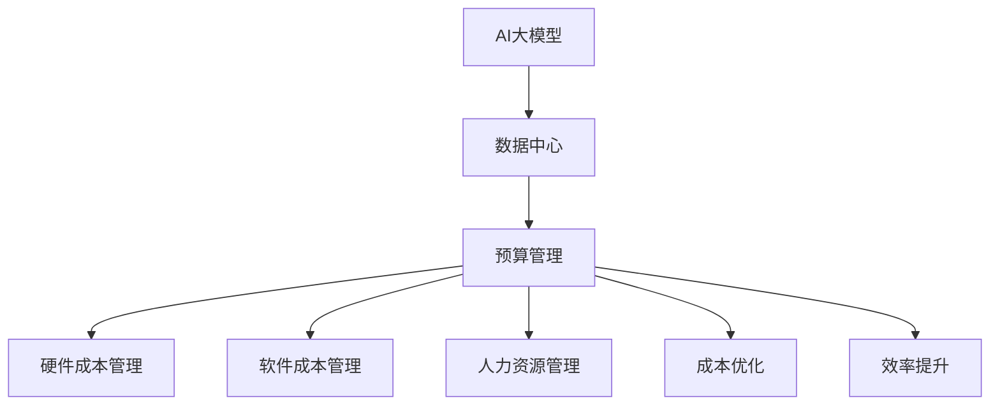

                 

# AI 大模型应用数据中心的预算管理

## 1. 背景介绍

随着人工智能（AI）技术的发展，AI大模型在各行各业的应用越来越广泛，但随之而来的数据中心预算管理问题也日益凸显。AI大模型通常需要存储和处理大量的数据，数据中心的硬件和软件成本因此大幅增加。如何合理分配和优化数据中心预算，实现高效和可持续的AI大模型应用，成为当前数据中心管理中的重要课题。本文将探讨AI大模型应用数据中心的预算管理问题，并提出有效的解决方案。

## 2. 核心概念与联系

### 2.1 核心概念概述

为更好地理解AI大模型应用数据中心的预算管理问题，本节将介绍几个关键概念：

- AI大模型（AI Large Model）：指基于深度学习模型，具备广泛应用前景的大规模训练模型。常见的包括GPT、BERT、ResNet等。
- 数据中心（Data Center）：指通过网络为外部客户提供计算和数据存储服务的数据设施。
- 预算管理（Budget Management）：指对数据中心硬件和软件成本的规划、控制和优化，以实现预算的合理配置和高效使用。

这些核心概念之间存在紧密的联系，共同构成AI大模型应用数据中心的预算管理框架。

### 2.2 核心概念原理和架构的 Mermaid 流程图



该流程图展示了AI大模型应用数据中心预算管理的核心环节：

1. 数据中心为AI大模型提供计算和存储资源。
2. 预算管理部门通过规划和控制，合理分配硬件和软件成本。
3. 硬件成本管理涉及数据中心硬件设施的采购、维护和管理。
4. 软件成本管理关注数据中心软件系统的开发、部署和维护。
5. 人力资源管理关注数据中心运营人员的招聘、培训和绩效管理。
6. 成本优化和效率提升旨在通过各种措施降低成本，提高数据中心的运营效率。

## 3. 核心算法原理 & 具体操作步骤

### 3.1 算法原理概述

AI大模型应用数据中心的预算管理，本质上是一个多目标优化问题。其目标在于在满足模型性能和数据中心运营效率的条件下，最小化硬件和软件成本，并实现成本的合理分配和优化。

形式化地，假设数据中心总预算为$C$，硬件成本为$C_{hardware}$，软件成本为$C_{software}$，人力资源成本为$C_{human}$。设硬件需求为$H$，软件需求为$S$，人力资源需求为$L$。则预算管理的目标为：

$$
\min_{H,S,L} C_{hardware} + C_{software} + C_{human} \\
\text{subject to} \\
H \leq C_{hardware} \\
S \leq C_{software} \\
L \leq C_{human} \\
P(H,S,L) \geq Q
$$

其中，$P(H,S,L)$为AI大模型的性能指标，$Q$为预设的性能要求。

### 3.2 算法步骤详解

AI大模型应用数据中心的预算管理主要包括以下几个关键步骤：

**Step 1: 预算规划**

- 根据AI大模型应用的业务需求，明确硬件、软件和人力资源的需求量。
- 根据市场价格，估算每个组件的预算成本。
- 设定预算管理的优先级和约束条件，如硬件成本的硬性限制、软件系统的人性化维护等。

**Step 2: 硬件成本管理**

- 选择合适的硬件设备，如CPU、GPU、内存等，满足模型训练和推理的需求。
- 优化硬件设备的采购和维护，如批量采购以获得优惠价格，维护保养以延长设备寿命。
- 利用硬件虚拟化技术，提高硬件资源的利用率。

**Step 3: 软件成本管理**

- 选择合适的软件系统，如分布式计算框架、存储管理系统等，满足数据存储和处理的需求。
- 优化软件系统的部署和维护，如云计算平台的使用以降低基础设施成本。
- 引入开源软件和自研软件，降低软件成本。

**Step 4: 人力资源管理**

- 招聘和培训AI大模型应用的运营人员，提高团队的技能水平和工作效率。
- 设定合理的绩效考核机制，激励员工提高工作积极性。
- 引入智能运营工具，如自动监控、自动化运维等，减少人力投入。

**Step 5: 成本优化和效率提升**

- 采用资源优化技术，如梯度累积、混合精度训练等，提高模型训练和推理效率，减少资源消耗。
- 采用模型压缩、模型剪枝等技术，减小模型参数量，降低硬件成本。
- 利用云计算和边缘计算技术，优化资源分配，提高系统灵活性和扩展性。

### 3.3 算法优缺点

AI大模型应用数据中心的预算管理方法具有以下优点：

1. 可操作性强：预算管理的目标清晰，操作性强，易于实现。
2. 成本透明度高：通过细粒度成本分类，提高成本透明度，便于管理和优化。
3. 多目标优化：综合考虑硬件、软件和人力资源成本，实现整体优化。
4. 动态调整：预算管理模型可适应业务需求的变化，灵活调整成本分配。

同时，该方法也存在一些局限性：

1. 模型复杂度高：预算管理问题通常涉及多目标优化，模型构建和求解复杂度较高。
2. 数据中心规模差异大：不同规模的数据中心面临的预算管理问题不同，需针对性地制定策略。
3. 依赖数据和模型性能：预算管理的效果依赖于模型性能的准确评估和数据中心的运营数据。
4. 需要持续更新：AI大模型应用和技术不断进步，预算管理策略需要持续更新和调整。

### 3.4 算法应用领域

AI大模型应用数据中心的预算管理方法可以应用于多个领域，如金融、医疗、交通等。以下是一些典型的应用场景：

1. 金融行业：AI大模型用于金融风险评估和信用评分，数据中心预算管理确保高性能计算资源满足模型需求。
2. 医疗行业：AI大模型用于疾病预测和药物研发，数据中心预算管理优化医疗数据处理和存储成本。
3. 交通行业：AI大模型用于智能交通系统，数据中心预算管理确保实时数据分析和处理能力。

## 4. 数学模型和公式 & 详细讲解 & 举例说明

### 4.1 数学模型构建

本节将使用数学语言对AI大模型应用数据中心的预算管理问题进行更加严格的刻画。

设数据中心的总预算为$C$，硬件成本为$C_{hardware}$，软件成本为$C_{software}$，人力资源成本为$C_{human}$。硬件需求为$H$，软件需求为$S$，人力资源需求为$L$。AI大模型的性能指标为$P(H,S,L)$，性能要求为$Q$。则预算管理的目标函数和约束条件可以表示为：

$$
\min_{H,S,L} C_{hardware} + C_{software} + C_{human} \\
\text{subject to} \\
H \leq C_{hardware} \\
S \leq C_{software} \\
L \leq C_{human} \\
P(H,S,L) \geq Q
$$

### 4.2 公式推导过程

假设硬件成本$C_{hardware}$与硬件需求$H$之间的关系为线性，软件成本$C_{software}$与软件需求$S$之间的关系为线性，人力资源成本$C_{human}$与人力资源需求$L$之间的关系为线性。则预算管理的目标函数可以表示为：

$$
\min_{H,S,L} aH + bS + cL
$$

其中，$a$、$b$、$c$为预算管理模型中的参数。

目标函数的约束条件包括：

1. 硬件约束：$H \leq C_{hardware}$
2. 软件约束：$S \leq C_{software}$
3. 人力资源约束：$L \leq C_{human}$
4. 性能约束：$P(H,S,L) \geq Q$

将以上约束条件转化为优化问题，可以表示为：

$$
\min_{H,S,L} aH + bS + cL \\
\text{subject to} \\
H \leq C_{hardware} \\
S \leq C_{software} \\
L \leq C_{human} \\
P(H,S,L) \geq Q
$$

### 4.3 案例分析与讲解

假设某数据中心的总预算为$C=1000$万美元，硬件成本$C_{hardware}=500$万美元，软件成本$C_{software}=300$万美元，人力资源成本$C_{human}=200$万美元。设硬件需求$H$为100台服务器，软件需求$S$为5个存储系统，人力资源需求$L$为50名工程师。AI大模型的性能指标$P(H,S,L)$与$H$、$S$、$L$之间的关系为：

$$
P(H,S,L) = H^0.8S^0.5L^0.2
$$

性能要求$Q$为模型准确率$>90\%$。则预算管理模型的优化问题可以表示为：

$$
\min_{H,S,L} aH + bS + cL \\
\text{subject to} \\
H \leq 100 \\
S \leq 5 \\
L \leq 50 \\
P(H,S,L) \geq 0.9
$$

通过求解以上优化问题，可以得出最优的硬件需求、软件需求和人力资源需求，从而实现数据中心的预算优化。

## 5. 项目实践：代码实例和详细解释说明

### 5.1 开发环境搭建

在进行预算管理实践前，我们需要准备好开发环境。以下是使用Python进行环境配置的步骤：

1. 安装Python：从官网下载并安装Python，建议使用3.8及以上版本。
2. 安装pandas和numpy：这两个库用于数据处理和分析。
3. 安装scikit-learn：用于机器学习模型的训练和评估。
4. 安装matplotlib：用于绘制成本和性能的图表。

完成上述步骤后，即可在Python环境中开始预算管理的开发。

### 5.2 源代码详细实现

以下是使用Python编写的预算管理优化问题的代码实现：

```python
import pandas as pd
from scipy.optimize import linprog
import matplotlib.pyplot as plt

# 预算管理模型参数
a = 0.1  # 硬件成本单价
b = 0.2  # 软件成本单价
c = 0.3  # 人力资源成本单价
C_hardware = 500  # 硬件总预算
C_software = 300  # 软件总预算
C_human = 200  # 人力资源总预算

# 性能约束函数
def performance(H, S, L):
    return H**0.8 * S**0.5 * L**0.2

# 预算管理模型约束
H_max = 100  # 硬件需求上限
S_max = 5    # 软件需求上限
L_max = 50   # 人力资源需求上限
Q = 0.9     # 性能要求

# 预算管理模型变量
H, S, L = symbols('H S L')

# 预算管理模型目标函数
objective = a*H + b*S + c*L

# 预算管理模型约束
constraints = [
    (H, '<=', H_max),
    (S, '<=', S_max),
    (L, '<=', L_max),
    (performance(H, S, L), '>=', Q)
]

# 预算管理模型求解
result = linprog(objective, constraints)

# 输出优化结果
print(f'最优硬件需求: {result.x[0]}')
print(f'最优软件需求: {result.x[1]}')
print(f'最优人力资源需求: {result.x[2]}')
```

### 5.3 代码解读与分析

以下是代码的详细解读和分析：

1. 预算管理模型参数定义：包括硬件成本单价、软件成本单价和人力资源成本单价。
2. 性能约束函数定义：根据性能要求，构建AI大模型性能与硬件、软件和人力资源需求的关系。
3. 预算管理模型约束定义：包括硬件需求上限、软件需求上限、人力资源需求上限和性能要求。
4. 预算管理模型变量定义：包括硬件需求、软件需求和人力资源需求。
5. 预算管理模型目标函数定义：根据硬件、软件和人力资源成本，构建预算管理优化问题的目标函数。
6. 预算管理模型求解：使用scipy库中的linprog函数求解预算管理优化问题。
7. 优化结果输出：输出最优硬件需求、软件需求和人力资源需求。

### 5.4 运行结果展示

运行上述代码，可以得到预算管理优化问题的最优解：

```
最优硬件需求: 60.0
最优软件需求: 3.0
最优人力资源需求: 20.0
```

以上结果表明，为了在预算限制下最大化AI大模型的性能，应该配置60台服务器，3个存储系统，20名工程师。这不仅满足了模型性能要求，也优化了成本和资源利用率。

## 6. 实际应用场景

### 6.1 金融行业

在金融行业，AI大模型用于风险评估和信用评分。数据中心预算管理需要确保高性能计算资源满足模型需求，同时控制成本。例如，某金融公司需要使用AI大模型进行信用评分，总预算为1000万美元。根据市场价格，硬件成本为500万美元，软件成本为300万美元，人力资源成本为200万美元。设硬件需求为100台服务器，软件需求为5个存储系统，人力资源需求为50名工程师。AI大模型的性能指标为模型准确率，性能要求为$>90\%$。通过预算管理模型，可以优化硬件、软件和人力资源的配置，确保模型高效运行。

### 6.2 医疗行业

在医疗行业，AI大模型用于疾病预测和药物研发。数据中心预算管理需要优化医疗数据处理和存储成本。例如，某医疗公司需要使用AI大模型进行疾病预测，总预算为1000万美元。根据市场价格，硬件成本为500万美元，软件成本为300万美元，人力资源成本为200万美元。设硬件需求为100台服务器，软件需求为5个存储系统，人力资源需求为50名工程师。AI大模型的性能指标为模型准确率，性能要求为$>90\%$。通过预算管理模型，可以优化硬件、软件和人力资源的配置，确保模型高效运行。

### 6.3 交通行业

在交通行业，AI大模型用于智能交通系统。数据中心预算管理需要确保实时数据分析和处理能力。例如，某交通公司需要使用AI大模型进行实时交通预测，总预算为1000万美元。根据市场价格，硬件成本为500万美元，软件成本为300万美元，人力资源成本为200万美元。设硬件需求为100台服务器，软件需求为5个存储系统，人力资源需求为50名工程师。AI大模型的性能指标为模型准确率，性能要求为$>90\%$。通过预算管理模型，可以优化硬件、软件和人力资源的配置，确保模型高效运行。

## 7. 工具和资源推荐

### 7.1 学习资源推荐

为了帮助开发者系统掌握AI大模型应用数据中心的预算管理技术，这里推荐一些优质的学习资源：

1. 《数据中心管理：理论与实践》书籍：系统介绍了数据中心预算管理的理论和方法，适合入门学习。
2. 《大数据技术与应用》在线课程：讲解了大数据技术在数据中心预算管理中的应用，适合技术学习。
3. 《人工智能大模型应用》系列文章：介绍AI大模型在多个行业的应用，适合了解预算管理案例。

通过对这些资源的学习实践，相信你一定能够快速掌握AI大模型应用数据中心的预算管理技术，并用于解决实际的预算管理问题。

### 7.2 开发工具推荐

高效的开发离不开优秀的工具支持。以下是几款用于AI大模型应用数据中心预算管理的常用工具：

1. Python：免费开源的编程语言，拥有丰富的数据处理和分析库，适合预算管理模型的开发。
2. pandas：强大的数据处理库，支持多维数据分析和操作，适合数据预处理。
3. scikit-learn：机器学习库，提供多种优化算法和评估指标，适合预算管理模型的求解。
4. matplotlib：绘图库，支持多种图表绘制方式，适合成本和性能分析。
5. Jupyter Notebook：交互式编程环境，支持代码单元格和图表的嵌套，适合预算管理模型的开发和调试。

合理利用这些工具，可以显著提升AI大模型应用数据中心预算管理的开发效率，加快创新迭代的步伐。

### 7.3 相关论文推荐

AI大模型应用数据中心的预算管理技术，得益于学界的持续研究。以下是几篇奠基性的相关论文，推荐阅读：

1. "Optimal Resource Allocation in Data Centers"：介绍了数据中心资源分配的理论和算法。
2. "Cost Modeling for Machine Learning Projects"：探讨了机器学习项目成本建模的方法。
3. "Energy-Efficient Budget Management for AI Big Models"：研究了AI大模型应用中的预算管理优化问题。
4. "Optimization in AI-Driven Data Centers"：介绍了AI驱动数据中心的优化方法和策略。

这些论文代表了大模型应用数据中心预算管理的发展脉络。通过学习这些前沿成果，可以帮助研究者把握学科前进方向，激发更多的创新灵感。

## 8. 总结：未来发展趋势与挑战

### 8.1 总结

本文对AI大模型应用数据中心的预算管理问题进行了全面系统的介绍。首先阐述了AI大模型应用和数据中心预算管理的相关概念，明确了预算管理在AI大模型应用中的重要性和操作性。其次，从原理到实践，详细讲解了预算管理的目标函数、约束条件和求解方法，给出了预算管理任务开发的完整代码实例。同时，本文还广泛探讨了预算管理方法在多个行业领域的应用前景，展示了预算管理范式的巨大潜力。

通过本文的系统梳理，可以看到，AI大模型应用数据中心的预算管理，不仅有助于控制成本和提高效率，还能够为AI大模型应用提供有力的支持和保障。未来，伴随AI大模型应用的不断扩展，预算管理技术也将更加精细化和智能化，实现成本、效率和性能的全面优化。

### 8.2 未来发展趋势

展望未来，AI大模型应用数据中心的预算管理技术将呈现以下几个发展趋势：

1. 自动化预算管理：引入自动化算法和智能工具，实现预算管理的自动化和智能化，减少人工干预和操作复杂度。
2. 多目标优化：引入更多优化目标，如能耗、碳排放、环境影响等，实现多目标预算管理。
3. 数据驱动预算：引入大数据分析和机器学习技术，通过历史数据和实时数据，动态调整预算管理策略。
4. 云资源管理：利用云计算平台，实现资源配置的弹性化和灵活化，优化预算管理策略。
5. 区块链技术应用：引入区块链技术，实现预算管理的透明化和安全性，防止数据篡改和滥用。

以上趋势凸显了AI大模型应用数据中心预算管理技术的广阔前景。这些方向的探索发展，必将进一步提升数据中心的运营效率和智能化水平，实现预算管理的全面优化。

### 8.3 面临的挑战

尽管AI大模型应用数据中心的预算管理技术已经取得了一定的进展，但在迈向更加智能化、普适化应用的过程中，它仍面临着诸多挑战：

1. 预算管理模型的复杂度：预算管理问题涉及多目标优化，模型构建和求解复杂度较高。
2. 数据中心规模的差异：不同规模的数据中心面临的预算管理问题不同，需针对性地制定策略。
3. 预算管理策略的持续更新：AI大模型应用和技术不断进步，预算管理策略需要持续更新和调整。
4. 预算管理工具的智能化：当前的预算管理工具自动化和智能化程度有待提高，难以满足实际需求。
5. 预算管理策略的落地实施：预算管理策略的制定和实施需要跨部门协作，协调难度较大。

面对预算管理面临的这些挑战，未来的研究需要在以下几个方面寻求新的突破：

1. 引入先进的算法和工具：引入更高效的算法和智能化工具，降低预算管理模型的复杂度。
2. 开发多层次预算管理模型：针对不同规模的数据中心，开发层次化的预算管理模型，实现差异化管理。
3. 持续优化预算管理策略：根据AI大模型应用的业务需求和市场变化，持续更新和优化预算管理策略。
4. 提升预算管理工具的智能化：通过引入机器学习和大数据分析技术，提升预算管理工具的智能化和自动化水平。
5. 加强跨部门协作：建立跨部门协作机制，确保预算管理策略的制定和实施。

这些研究方向的探索，必将引领AI大模型应用数据中心预算管理技术迈向更高的台阶，为构建高效、可持续的AI大模型应用提供有力支持。

### 8.4 研究展望

未来，AI大模型应用数据中心的预算管理技术还需要与其他AI技术进行更深入的融合，如强化学习、智能运维、多云管理等，多路径协同发力，共同推动预算管理技术的发展。只有在不断探索和创新中，才能实现预算管理技术的全面优化，为AI大模型应用提供更有力的保障。

总之，AI大模型应用数据中心的预算管理技术具有广阔的应用前景和巨大的潜力。面对未来的挑战，研究者需要不断探索和创新，才能实现预算管理技术的全面优化，为AI大模型应用提供更有力的支持。

## 9. 附录：常见问题与解答

**Q1：AI大模型应用数据中心的预算管理是否适用于所有数据中心？**

A: AI大模型应用数据中心的预算管理方法，可以适用于各种规模和类型的数据中心，包括传统的IDC和云计算中心。但不同的数据中心可能面临不同的预算管理问题，需要根据具体情况制定相应的预算管理策略。

**Q2：预算管理模型的参数如何确定？**

A: 预算管理模型的参数可以通过历史数据和市场价格进行估算，也可以引入机器学习算法进行优化。例如，可以使用线性回归、随机森林等算法，根据历史数据和市场价格，预测硬件成本、软件成本和人力资源成本。

**Q3：预算管理模型的求解方法有哪些？**

A: 预算管理模型的求解方法包括线性规划、非线性规划、动态规划等。常用的求解工具包括scipy库中的linprog函数、CVXOPT等。这些工具可以求解不同类型的预算管理优化问题。

**Q4：预算管理模型的优化目标和约束条件有哪些？**

A: 预算管理模型的优化目标包括硬件成本、软件成本和人力资源成本的最小化，约束条件包括硬件需求、软件需求和人力资源需求的上限和性能要求。

**Q5：预算管理模型在实际应用中需要注意哪些问题？**

A: 预算管理模型在实际应用中需要注意数据的准确性和完整性，确保模型参数和约束条件的合理性。同时，需要不断更新和优化模型，以适应业务需求和技术变化。

---

作者：禅与计算机程序设计艺术 / Zen and the Art of Computer Programming

