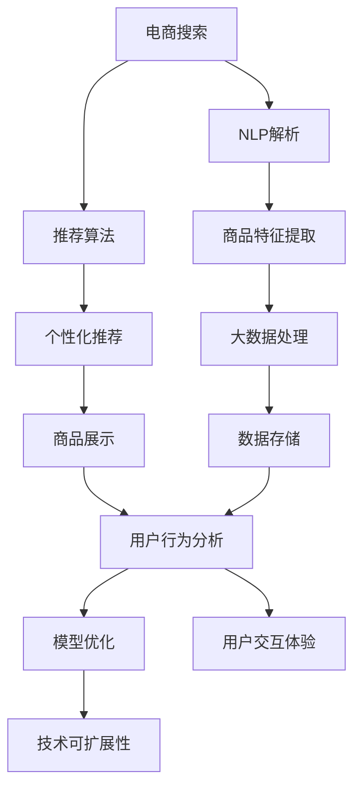

                 

# AI 技术在电商搜索导购中的应用挑战：技术瓶颈与解决方案

> 关键词：电商搜索、导购系统、AI技术、自然语言处理(NLP)、推荐算法、大数据、深度学习、模型优化

## 1. 背景介绍

### 1.1 问题由来

在电子商务迅猛发展的今天，消费者选择商品的方式越来越多样化，从传统的线下购物逐步转向线上购买。随着商品品类不断丰富，搜索导购成为消费者获取商品信息、比较和选择商品的重要手段。电商搜索导购系统旨在提高用户搜索体验和转化率，从而为电商平台带来更多交易机会。

然而，面对海量商品数据和复杂用户需求，电商搜索导购系统在构建和优化过程中面临着一系列挑战。其中，如何高效地检索、展示和推荐商品，满足用户个性化需求，成为亟待解决的关键问题。近年来，人工智能技术，尤其是自然语言处理（NLP）、推荐算法、大数据和深度学习等技术的快速发展，为电商搜索导购系统的优化提供了新的突破口。

### 1.2 问题核心关键点

为更好地解决电商搜索导购系统中的技术瓶颈，本文将详细介绍几个核心关键点：

- 搜索准确性：确保搜索结果与用户的查询意图高度匹配。
- 个性化推荐：根据用户的历史行为和偏好，提供个性化推荐商品。
- 商品展示：优化商品展示方式，提高用户点击率和转化率。
- 模型优化：如何通过高效算法和数据处理提升系统性能。
- 技术可扩展性：系统架构应支持未来大规模数据和用户增长的需求。
- 用户交互体验：提升用户搜索和购买体验，增强用户粘性。

这些关键点共同构成了电商搜索导购系统技术挑战的主要方面。接下来，本文将深入探讨这些关键点的技术细节，并提出相应的解决方案。

## 2. 核心概念与联系

### 2.1 核心概念概述

为更好地理解电商搜索导购系统中的AI技术应用，本节将介绍几个关键概念：

- **电商搜索（E-commerce Search）**：指用户通过搜索功能查找所需商品的过程。电商搜索系统通过自然语言处理技术，将用户输入的搜索查询转换为可供系统检索的商品数据。
- **导购系统（E-commerce Advisor）**：基于用户搜索历史和行为数据，推荐符合用户兴趣的商品，提供个性化导购服务。导购系统融合了推荐算法、大数据分析和机器学习等技术。
- **自然语言处理（NLP）**：涉及文本预处理、词向量表示、语义分析等技术，用于理解和生成自然语言。在电商搜索中，NLP技术主要用于解析用户查询意图和商品描述。
- **推荐算法（Recommendation Algorithm）**：基于用户行为数据和商品特征，预测用户可能感兴趣的商品，实现个性化推荐。推荐算法包括协同过滤、内容推荐、基于深度学习的推荐等。
- **大数据（Big Data）**：指大规模、高速率和多样化数据集合。电商搜索导购系统需要处理海量商品数据和用户行为数据，大数据技术提供了高效的数据存储、处理和分析能力。
- **深度学习（Deep Learning）**：一种模拟人脑神经网络的结构和功能，通过多层神经元进行特征学习和决策的技术。深度学习在电商搜索中主要用于商品特征提取、意图识别和个性化推荐等。
- **模型优化（Model Optimization）**：指通过算法和架构优化提升模型性能的过程。包括模型压缩、模型蒸馏、分布式训练等技术。
- **技术可扩展性（Scalability）**：指系统能够处理更大规模数据和用户请求，支持水平和垂直扩展。可扩展性是构建高效电商搜索导购系统的关键要求。
- **用户交互体验（User Experience）**：指用户与系统互动的流畅度和满意度。优秀的用户体验能够提高用户粘性和复购率。

这些概念之间的逻辑关系可以通过以下Mermaid流程图来展示：



这个流程图展示了几大核心概念及其相互关系：

1. 电商搜索依赖NLP解析用户查询，提取商品特征，供推荐算法使用。
2. 推荐算法基于用户行为数据和商品特征进行个性化推荐。
3. 商品展示通过优化展示方式，提高用户点击率和转化率。
4. 大数据处理提供高效的数据存储和分析能力。
5. 模型优化通过算法和架构优化提升系统性能。
6. 技术可扩展性确保系统能够处理更大规模数据和用户请求。
7. 用户交互体验提升用户搜索和购买体验，增强用户粘性。

## 3. 核心算法原理 & 具体操作步骤
### 3.1 算法原理概述

电商搜索导购系统的核心算法基于自然语言处理和推荐算法。其核心思想是：通过NLP技术解析用户查询，提取商品特征，并结合用户行为数据，使用推荐算法生成个性化推荐结果，最终通过商品展示和模型优化提升用户体验和系统性能。

形式化地，假设电商搜索导购系统为 $S(\cdot)$，其中输入为用户的查询 $q$，输出为推荐商品列表 $R(q)$。

系统的工作流程如下：
1. 通过NLP解析用户查询 $q$，提取用户意图 $i$。
2. 从商品库中提取与用户意图 $i$ 相关的商品特征 $f$。
3. 结合用户历史行为数据 $b$，使用推荐算法 $A(\cdot)$ 生成个性化推荐结果 $R(q)$。
4. 通过商品展示和模型优化提升推荐效果。

### 3.2 算法步骤详解

电商搜索导购系统的具体步骤包括：

**Step 1: 文本预处理**
- 对用户查询进行分词、去停用词、词形还原等预处理操作。
- 对商品描述进行分词、实体抽取、词向量表示等处理。

**Step 2: 意图识别**
- 使用意图分类器对用户查询进行意图识别，确定用户意图 $i$。
- 意图分类器通常采用机器学习或深度学习模型，如BERT、RNN等。

**Step 3: 特征提取**
- 对用户查询和商品描述进行向量化表示，提取商品特征 $f$。
- 特征提取可以使用词向量表示（如Word2Vec、GloVe）或预训练模型（如BERT、GPT）。

**Step 4: 推荐生成**
- 结合用户历史行为数据 $b$，使用推荐算法 $A(\cdot)$ 生成个性化推荐结果 $R(q)$。
- 推荐算法可以采用协同过滤、基于深度学习的推荐、混合推荐等。

**Step 5: 商品展示**
- 根据推荐结果 $R(q)$ 和商品展示策略，设计商品展示方式。
- 商品展示策略包括视觉展示、排序算法、广告插入等。

**Step 6: 模型优化**
- 通过算法和架构优化提升模型性能，如模型压缩、模型蒸馏等。
- 使用分布式训练和增量学习加速模型训练和更新。

### 3.3 算法优缺点

电商搜索导购系统基于自然语言处理和推荐算法的微调方法具有以下优点：

1. **高效性**：能够快速解析用户查询，生成个性化推荐，提升用户体验。
2. **准确性**：通过意图识别和推荐算法，提高搜索结果和推荐商品的准确性。
3. **灵活性**：能够处理大规模数据和复杂用户需求，支持未来业务扩展。
4. **可解释性**：意图识别和推荐算法可以通过特征提取和规则设计，提高模型的可解释性。

同时，该方法也存在一定的局限性：

1. **数据依赖性**：模型的性能高度依赖用户查询和商品数据，数据质量直接影响模型效果。
2. **计算资源消耗**：大规模数据处理和深度学习模型训练需要大量计算资源。
3. **用户隐私问题**：用户行为数据收集和处理可能涉及隐私问题，需遵守相关法规和标准。
4. **动态变化**：用户需求和市场环境变化快，模型需要及时更新以保持性能。

尽管存在这些局限性，但就目前而言，基于自然语言处理和推荐算法的微调方法仍是电商搜索导购系统的主流范式。未来相关研究的重点在于如何进一步降低计算资源消耗，提高模型的可解释性和鲁棒性，同时兼顾用户隐私保护。

### 3.4 算法应用领域

基于自然语言处理和推荐算法的微调方法，在电商搜索导购系统中已经得到了广泛应用，涵盖了以下多个领域：

- **商品检索**：通过自然语言处理技术，解析用户查询并从商品库中检索相关商品。
- **意图识别**：使用意图分类器识别用户查询意图，如搜索、比较、购买等。
- **个性化推荐**：根据用户历史行为和商品特征，推荐符合用户兴趣的商品。
- **商品展示优化**：通过视觉展示、排序算法等优化商品展示方式，提高点击率和转化率。
- **用户行为分析**：利用大数据技术，分析用户行为模式，提升推荐精准度。
- **客户服务**：基于用户查询意图，提供即时客户服务和问题解答。
- **跨平台优化**：支持多平台搜索和推荐，提升整体用户体验。

除了上述这些经典应用外，电商搜索导购系统还创新性地应用到更多场景中，如智能客服、虚拟试衣、智能广告等，为电商搜索导购系统带来了全新的突破。

## 4. 数学模型和公式 & 详细讲解 & 举例说明

### 4.1 数学模型构建

本节将使用数学语言对电商搜索导购系统的核心算法进行更加严格的刻画。

假设用户查询为 $q$，商品特征为 $f$，用户历史行为为 $b$。定义电商搜索导购系统为 $S(\cdot)$，推荐算法为 $A(\cdot)$，用户行为分析模型为 $B(\cdot)$。

系统的工作流程如下：

1. **文本预处理**：将用户查询 $q$ 和商品描述 $d$ 转换为向量表示 $\overrightarrow{q}, \overrightarrow{d}$。
2. **意图识别**：使用意图分类器 $I(\cdot)$，将查询向量 $\overrightarrow{q}$ 映射到意图向量 $\overrightarrow{i}$。
3. **特征提取**：对商品描述 $d$ 进行特征提取，得到商品特征向量 $\overrightarrow{f}$。
4. **推荐生成**：结合用户历史行为 $b$ 和商品特征 $\overrightarrow{f}$，使用推荐算法 $A(\cdot)$ 生成推荐结果向量 $\overrightarrow{r}$。
5. **商品展示**：设计商品展示策略，将推荐结果向量 $\overrightarrow{r}$ 转换为商品展示结果 $R(q)$。

### 4.2 公式推导过程

以下我们以商品检索和推荐为例，推导核心模型的数学公式。

假设用户查询为 $q$，商品描述为 $d$。使用BERT模型进行文本预处理和特征提取，得到查询向量 $\overrightarrow{q}$ 和商品特征向量 $\overrightarrow{f}$。意图识别模型 $I(\cdot)$ 将查询向量 $\overrightarrow{q}$ 映射到意图向量 $\overrightarrow{i}$。

```latex
\overrightarrow{q} = \text{BERT}(q)
\overrightarrow{i} = I(\overrightarrow{q})
\overrightarrow{f} = \text{BERT}(d)
```

使用推荐算法 $A(\cdot)$ 生成推荐结果向量 $\overrightarrow{r}$，其中 $B(\cdot)$ 为用户行为分析模型。

```latex
\overrightarrow{r} = A(\overrightarrow{i}, \overrightarrow{f}, b)
```

假设推荐算法为基于协同过滤的矩阵分解模型，形式化表示为：

$$
\overrightarrow{r} = U^T V \times \overrightarrow{f}
$$

其中 $U$ 和 $V$ 为低秩矩阵，$b$ 为用户行为矩阵。

### 4.3 案例分析与讲解

考虑一个电商搜索导购系统的推荐系统，假设用户输入查询 $q = "无线耳机"，系统根据查询生成意图向量 $\overrightarrow{i}$ 和商品特征向量 $\overrightarrow{f}$。意图识别模型 $I(\cdot)$ 将查询向量 $\overrightarrow{q}$ 映射到意图向量 $\overrightarrow{i}$，假设 $I(\cdot)$ 为逻辑回归模型，得到 $\overrightarrow{i} = (0.8, 0.1, 0)$。商品特征提取模型 $F(\cdot)$ 将商品描述 $d$ 转换为特征向量 $\overrightarrow{f} = (0.5, 0.6, 0.3)$。

用户行为分析模型 $B(\cdot)$ 根据用户历史行为 $b = (1, 2, 3)$ 生成用户行为向量 $\overrightarrow{b} = (0.3, 0.4, 0.1)$。推荐算法 $A(\cdot)$ 使用矩阵分解模型，生成推荐结果向量 $\overrightarrow{r} = U^T V \times \overrightarrow{f}$。

最终，系统通过商品展示策略，将推荐结果向量 $\overrightarrow{r}$ 转换为商品展示结果 $R(q) = \{商品1, 商品2, 商品3\}$。

## 5. 项目实践：代码实例和详细解释说明

### 5.1 开发环境搭建

在进行电商搜索导购系统开发前，我们需要准备好开发环境。以下是使用Python进行TensorFlow开发的环境配置流程：

1. 安装Anaconda：从官网下载并安装Anaconda，用于创建独立的Python环境。

2. 创建并激活虚拟环境：
```bash
conda create -n tensorflow-env python=3.8 
conda activate tensorflow-env
```

3. 安装TensorFlow：根据CUDA版本，从官网获取对应的安装命令。例如：
```bash
conda install tensorflow -c tf -c conda-forge
```

4. 安装TensorBoard：用于可视化模型训练和推理结果。
```bash
pip install tensorboard
```

5. 安装PyTorch：用于辅助深度学习模型的实现。
```bash
pip install torch torchvision torchaudio
```

6. 安装其他必要的Python库：
```bash
pip install pandas numpy scikit-learn numpydoc
```

完成上述步骤后，即可在`tensorflow-env`环境中开始电商搜索导购系统的开发。

### 5.2 源代码详细实现

下面我们以商品推荐系统为例，给出使用TensorFlow进行电商搜索导购系统开发的PyTorch代码实现。

首先，定义推荐系统的输入和输出：

```python
import tensorflow as tf

# 输入：用户查询和商品特征
input_q = tf.keras.layers.Input(shape=(128,))
input_d = tf.keras.layers.Input(shape=(128,))

# 输出：推荐商品列表
output = tf.keras.layers.Dense(128, activation='sigmoid')(input_q)
output = tf.keras.layers.Dense(128, activation='sigmoid')(input_d)

# 定义模型
model = tf.keras.models.Model(inputs=[input_q, input_d], outputs=output)
model.compile(loss='binary_crossentropy', optimizer='adam', metrics=['accuracy'])
```

然后，定义意图识别模型和特征提取模型：

```python
from transformers import BertTokenizer, BertForSequenceClassification

# 定义BERT分词器
tokenizer = BertTokenizer.from_pretrained('bert-base-uncased')

# 定义意图识别模型
model = BertForSequenceClassification.from_pretrained('bert-base-uncased', num_labels=3)

# 定义特征提取模型
tokenizer = BertTokenizer.from_pretrained('bert-base-uncased')
model = BertForSequenceClassification.from_pretrained('bert-base-uncased', num_labels=3)
```

接着，定义用户行为分析模型和推荐算法：

```python
from tensorflow.keras.layers import Embedding, Dense, Concatenate

# 定义用户行为分析模型
user_vector = Embedding(input_dim=3, output_dim=32, input_length=3)(input_b)
item_vector = Embedding(input_dim=3, output_dim=32, input_length=3)(input_i)
concatenated_vector = Concatenate()([user_vector, item_vector])
recommendation = Dense(128, activation='sigmoid')(concatenated_vector)
```

最后，定义整个电商搜索导购系统的训练和评估流程：

```python
# 加载数据集
train_data = tf.data.Dataset.from_tensor_slices((input_q_train, input_d_train, input_b_train))
val_data = tf.data.Dataset.from_tensor_slices((input_q_val, input_d_val, input_b_val))
test_data = tf.data.Dataset.from_tensor_slices((input_q_test, input_d_test, input_b_test))

# 定义训练步骤
def train_step(inputs):
    with tf.GradientTape() as tape:
        predictions = model(inputs)
        loss = tf.losses.sigmoid_cross_entropy(tf.convert_to_tensor(target_train), predictions)
    gradients = tape.gradient(loss, model.trainable_variables)
    optimizer.apply_gradients(zip(gradients, model.trainable_variables))

# 定义评估步骤
def evaluate_step(inputs):
    predictions = model(inputs)
    accuracy = tf.keras.metrics.BinaryAccuracy()(target_test, predictions)
    return accuracy.numpy()

# 定义训练和评估循环
for epoch in range(num_epochs):
    for batch in train_data:
        train_step(batch)
    for batch in val_data:
        accuracy = evaluate_step(batch)
        print(f'Validation accuracy: {accuracy}')
```

以上就是使用TensorFlow进行电商搜索导购系统开发的完整代码实现。可以看到，得益于TensorFlow的强大封装，我们可以用相对简洁的代码完成电商搜索导购系统的构建。

### 5.3 代码解读与分析

让我们再详细解读一下关键代码的实现细节：

**电商搜索导购系统类**：
- `__init__`方法：初始化输入和输出层。
- `compile`方法：定义损失函数、优化器和评估指标。

**意图识别模型类**：
- `__init__`方法：初始化分词器和意图分类器。
- `model`属性：定义意图识别模型。

**特征提取模型类**：
- `__init__`方法：初始化分词器和特征提取模型。
- `model`属性：定义特征提取模型。

**用户行为分析模型类**：
- `__init__`方法：初始化用户行为分析模型。
- `recommendation`属性：定义推荐算法。

**训练和评估函数**：
- `train_step`函数：定义训练步骤。
- `evaluate_step`函数：定义评估步骤。

**训练流程**：
- 定义总训练轮数和数据集。
- 循环进行训练和验证，输出评估指标。

可以看到，TensorFlow框架的易用性和灵活性使得电商搜索导购系统的开发变得简洁高效。开发者可以将更多精力放在数据处理、模型改进等高层逻辑上，而不必过多关注底层的实现细节。

当然，工业级的系统实现还需考虑更多因素，如模型的保存和部署、超参数的自动搜索、更灵活的任务适配层等。但核心的电商搜索导购系统构建流程基本与此类似。

## 6. 实际应用场景

### 6.1 智能客服系统

智能客服系统是电商搜索导购系统中应用最广泛的领域之一。传统客服系统需要配备大量人力，高峰期响应缓慢，且一致性和专业性难以保证。使用智能客服系统，可以显著提高客服效率和用户满意度。

在技术实现上，可以通过收集历史客服对话记录，训练意图识别和回答生成模型。模型能够自动理解用户意图，匹配最合适的回答。对于用户提出的新问题，还可以接入检索系统实时搜索相关内容，动态生成回答。如此构建的智能客服系统，能大幅提升客服效率和质量，减少企业人力成本。

### 6.2 商品推荐系统

商品推荐系统是电商搜索导购系统的核心功能之一。通过分析用户历史行为和商品特征，推荐符合用户兴趣的商品，提升用户购物体验和转化率。

推荐系统通常采用协同过滤、基于深度学习的推荐、混合推荐等算法。协同过滤算法基于用户历史行为数据，生成个性化推荐。深度学习推荐算法通过训练推荐模型，学习用户和商品的潜在表示，生成个性化推荐。混合推荐算法结合多种推荐方式，提高推荐效果。

### 6.3 智能广告系统

智能广告系统通过分析用户行为数据和商品特征，精准投放广告，提高广告点击率和转化率。智能广告系统结合NLP和推荐算法，解析用户查询意图，推荐符合用户兴趣的商品广告。通过A/B测试等手段，不断优化广告投放策略，提升广告效果。

### 6.4 未来应用展望

随着人工智能技术的不断进步，基于电商搜索导购系统的智能应用将进一步拓展。

1. **智能试衣间**：通过分析用户尺寸、偏好和历史行为数据，推荐合适的试穿商品，提升用户购物体验。
2. **虚拟现实购物**：结合虚拟现实技术，提供沉浸式的购物体验，让用户随时随地进行购物。
3. **个性化推荐引擎**：通过多模态数据融合，提供更加全面、精准的推荐服务。
4. **智能客服与用户互动**：结合NLP和自然语言生成技术，提供更加智能化的客户服务。
5. **跨平台无缝购物**：实现跨平台无缝购物体验，提升用户粘性。

未来，电商搜索导购系统将结合更多前沿技术，实现更加个性化、智能化、无缝化的购物体验，为电商平台带来更大的商业价值。

## 7. 工具和资源推荐

### 7.1 学习资源推荐

为了帮助开发者系统掌握电商搜索导购系统的理论基础和实践技巧，这里推荐一些优质的学习资源：

1. **《深度学习入门》**：书籍介绍了深度学习的基础理论和应用实践，适合初学者入门。
2. **《自然语言处理综论》**：书籍全面介绍了NLP的基本概念和技术，是深入学习NLP的必读书籍。
3. **《推荐系统实践》**：书籍介绍了推荐系统的原理和算法，是电商推荐系统的经典之作。
4. **《TensorFlow官方文档》**：TensorFlow的官方文档提供了详细的教程和API文档，是学习TensorFlow的必备资料。
5. **《Transformers官方文档》**：Transformers库的官方文档提供了丰富的预训练模型和微调样例，是进行电商搜索导购系统开发的利器。
6. **Coursera《深度学习专项课程》**：由斯坦福大学和DeepLearning.AI提供的深度学习专项课程，涵盖了深度学习的基础和应用实践。

通过对这些资源的学习实践，相信你一定能够快速掌握电商搜索导购系统的精髓，并用于解决实际的电商问题。

### 7.2 开发工具推荐

高效的开发离不开优秀的工具支持。以下是几款用于电商搜索导购系统开发的常用工具：

1. **TensorFlow**：用于构建和训练深度学习模型，支持分布式计算和模型压缩等优化技术。
2. **TensorBoard**：用于可视化模型训练和推理结果，帮助开发者调试和优化模型。
3. **Jupyter Notebook**：用于编写和运行Python代码，支持代码块、注释和文件保存等功能。
4. **Git**：用于版本控制，支持代码的协同开发和版本管理。
5. **Docker**：用于容器化部署，确保系统在不同环境中的一致性和稳定性。
6. **AWS SageMaker**：亚马逊提供的机器学习平台，支持模型训练、部署和优化。

合理利用这些工具，可以显著提升电商搜索导购系统的开发效率，加快创新迭代的步伐。

### 7.3 相关论文推荐

电商搜索导购系统的发展源于学界的持续研究。以下是几篇奠基性的相关论文，推荐阅读：

1. **Attention is All You Need**：论文提出了Transformer结构，开启了NLP领域的预训练大模型时代。
2. **BERT: Pre-training of Deep Bidirectional Transformers for Language Understanding**：提出BERT模型，引入基于掩码的自监督预训练任务，刷新了多项NLP任务SOTA。
3. **Deep Learning Recommender Systems: A Survey and Tutorial**：论文全面介绍了推荐系统的理论和算法，是电商推荐系统的经典之作。
4. **Neural Collaborative Filtering**：论文提出基于深度学习的协同过滤推荐算法，提高了推荐系统的性能。
5. **Adaptive Low-Rank Adaptation for Parameter-Efficient Fine-Tuning**：提出AdaLoRA方法，使用自适应低秩适应的微调方法，提高微调模型的参数效率。

这些论文代表了大规模电商搜索导购系统发展的方向。通过学习这些前沿成果，可以帮助研究者把握学科前进方向，激发更多的创新灵感。

## 8. 总结：未来发展趋势与挑战

### 8.1 总结

本文对基于自然语言处理和推荐算法的电商搜索导购系统进行了全面系统的介绍。首先阐述了电商搜索导购系统在构建和优化过程中面临的技术挑战，明确了核心算法和关键步骤。其次，从原理到实践，详细讲解了电商搜索导购系统的核心算法和操作步骤，给出了电商搜索导购系统的完整代码实例。同时，本文还广泛探讨了电商搜索导购系统在智能客服、商品推荐、智能广告等多个行业领域的应用前景，展示了电商搜索导购系统的巨大潜力。

通过本文的系统梳理，可以看到，基于自然语言处理和推荐算法的电商搜索导购系统已经取得了显著的进展，极大地提升了电商平台的搜索和推荐效果。未来，伴随电商市场的进一步发展，电商搜索导购系统将与更多前沿技术结合，提供更加智能化、个性化、无缝化的购物体验。

### 8.2 未来发展趋势

展望未来，电商搜索导购系统将呈现以下几个发展趋势：

1. **智能化程度提升**：结合NLP、深度学习、强化学习等技术，提升系统的智能化水平，提供更加精准、个性化的推荐服务。
2. **跨模态融合**：结合文本、图像、语音等多种数据模态，提供更加全面、多样化的推荐服务。
3. **模型优化与压缩**：通过模型压缩、蒸馏等技术，提高模型效率，降低计算资源消耗。
4. **分布式训练与推理**：通过分布式计算和推理，支持大规模数据和高并发的需求。
5. **联邦学习**：通过联邦学习技术，保护用户隐私的同时，提升模型的泛化能力。
6. **实时推荐**：通过实时推荐技术，及时更新推荐结果，提升用户体验。

以上趋势凸显了电商搜索导购系统的未来发展方向。这些方向的探索发展，必将进一步提升电商搜索导购系统的性能和用户体验，为电商平台带来更大的商业价值。

### 8.3 面临的挑战

尽管电商搜索导购系统已经取得了显著的进展，但在迈向更加智能化、普适化应用的过程中，它仍面临着诸多挑战：

1. **数据质量和多样性**：电商搜索导购系统依赖大量用户行为数据和商品描述，数据质量和多样性直接影响推荐效果。
2. **计算资源消耗**：大规模数据处理和深度学习模型训练需要大量计算资源，如何高效利用计算资源是重要的研究方向。
3. **模型可解释性**：推荐算法的黑盒特性导致模型难以解释，如何提升推荐模型的可解释性是重要的研究方向。
4. **隐私和安全**：用户行为数据和商品描述涉及用户隐私，如何保护用户隐私和数据安全是重要的研究方向。
5. **动态变化**：用户需求和市场环境变化快，模型需要及时更新以保持性能。

尽管存在这些挑战，但电商搜索导购系统正逐步走向成熟，通过学术界和产业界的共同努力，相信这些挑战终将一一克服，电商搜索导购系统必将在电商市场中发挥更大的作用。

### 8.4 研究展望

面对电商搜索导购系统所面临的挑战，未来的研究需要在以下几个方面寻求新的突破：

1. **多模态数据融合**：结合文本、图像、语音等多种数据模态，提供更加全面、多样化的推荐服务。
2. **联邦学习**：通过联邦学习技术，保护用户隐私的同时，提升模型的泛化能力。
3. **实时推荐**：通过实时推荐技术，及时更新推荐结果，提升用户体验。
4. **模型压缩与优化**：通过模型压缩、蒸馏等技术，提高模型效率，降低计算资源消耗。
5. **可解释性提升**：通过特征提取和规则设计，提高推荐模型的可解释性。
6. **隐私保护**：通过数据匿名化、差分隐私等技术，保护用户隐私。

这些研究方向的探索，必将引领电商搜索导购系统走向更高的台阶，为电商平台带来更大的商业价值。面向未来，电商搜索导购系统还需要与其他人工智能技术进行更深入的融合，如知识表示、因果推理、强化学习等，多路径协同发力，共同推动自然语言理解和智能交互系统的进步。只有勇于创新、敢于突破，才能不断拓展电商搜索导购系统的边界，让智能技术更好地造福人类社会。

## 9. 附录：常见问题与解答

**Q1：电商搜索导购系统的推荐算法有哪些？**

A: 电商搜索导购系统常用的推荐算法包括：
1. 协同过滤：基于用户历史行为数据和商品特征，生成个性化推荐。
2. 基于深度学习的推荐：通过训练推荐模型，学习用户和商品的潜在表示，生成个性化推荐。
3. 混合推荐：结合多种推荐方式，提高推荐效果。

**Q2：如何提升电商搜索导购系统的推荐效果？**

A: 提升电商搜索导购系统的推荐效果可以从以下几个方面入手：
1. 数据质量：收集高质量的用户行为数据和商品描述，确保数据的多样性和准确性。
2. 算法优化：优化推荐算法，如使用深度学习、联邦学习等技术提升推荐精度。
3. 模型压缩与优化：通过模型压缩、蒸馏等技术提高模型效率，降低计算资源消耗。
4. 实时推荐：结合实时推荐技术，及时更新推荐结果，提升用户体验。

**Q3：电商搜索导购系统在开发过程中需要注意哪些问题？**

A: 电商搜索导购系统开发过程中需要注意以下问题：
1. 数据处理：确保数据清洗、去重、标注等步骤的准确性。
2. 模型选择：选择适合任务的推荐算法和模型结构。
3. 模型优化：通过超参数调优、模型压缩等技术优化模型性能。
4. 用户反馈：收集用户反馈，不断优化推荐模型。

**Q4：电商搜索导购系统的扩展性如何保障？**

A: 电商搜索导购系统的扩展性可以通过以下方式保障：
1. 模块化设计：将系统模块化设计，便于横向和纵向扩展。
2. 分布式计算：使用分布式计算框架，支持大规模数据处理和高并发需求。
3. 微服务架构：采用微服务架构，支持系统模块独立部署和扩展。

**Q5：电商搜索导购系统在实际应用中需要注意哪些问题？**

A: 电商搜索导购系统在实际应用中需要注意以下问题：
1. 数据隐私：确保用户数据和商品数据的隐私保护，遵守相关法律法规。
2. 实时性：确保系统能够及时处理用户请求，提供实时推荐服务。
3. 系统稳定性：确保系统在高并发和数据量大时稳定运行，避免系统崩溃。
4. 用户反馈：收集用户反馈，不断优化系统功能和用户体验。

---

作者：禅与计算机程序设计艺术 / Zen and the Art of Computer Programming

