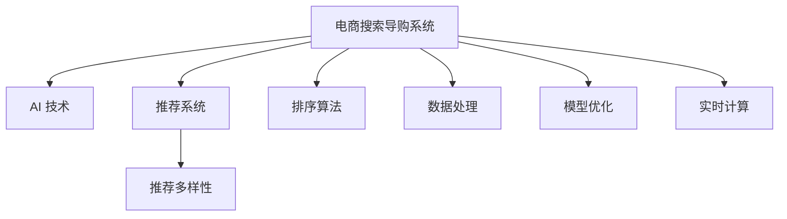

                 

# AI 技术在电商搜索导购中的应用挑战：技术瓶颈与解决方案

> 关键词：电商搜索导购, AI 技术, 推荐系统, 排序算法, 数据处理, 模型优化, 实时计算, 推荐多样性

## 1. 背景介绍

随着电商行业的快速发展，消费者对购物体验的要求日益提高，电子商务平台已不仅仅是商品展示和交易的场所，更是提供全方位个性化服务的平台。为了满足用户的多样化需求，电商搜索导购系统必须能够实时、精准、高效地处理大量的用户查询和商品数据，并从中筛选出最符合用户需求的搜索结果和推荐商品。

AI 技术在此背景下逐渐成为电商搜索导购系统的重要引擎，驱动着个性化推荐、搜索结果排序、广告投放、客户服务等功能的实现。然而，电商搜索导购系统的复杂性和数据量使得AI 技术应用面临诸多挑战。本文将从背景介绍入手，梳理AI 技术在电商搜索导购中的应用场景，详细探讨面临的技术瓶颈，并提出一些解决方案。

## 2. 核心概念与联系

### 2.1 核心概念概述

为了更清晰地了解AI 技术在电商搜索导购中的应用，本节将介绍一些核心概念及其相互关系。

- **电商搜索导购系统**：包括商品搜索、商品推荐、广告推荐、购物车管理等功能，是电商平台的核心应用之一。
- **AI 技术**：包括机器学习、深度学习、自然语言处理、计算机视觉等，是实现电商搜索导购系统智能化的重要工具。
- **推荐系统**：根据用户行为和商品属性，推荐用户可能感兴趣的商品。
- **排序算法**：用于对搜索结果进行排序，提升用户体验和点击率。
- **数据处理**：包括数据清洗、数据整合、特征工程等，是AI 应用的基础。
- **模型优化**：包括超参数调优、模型压缩、模型剪枝等，提高模型性能和运行效率。
- **实时计算**：指数据实时处理和计算，实现高效决策和响应。
- **推荐多样性**：指在个性化推荐的同时，保持推荐的商品多样性，避免用户产生单调感。

这些概念之间的逻辑关系可以通过以下Mermaid流程图来展示：



这个流程图展示了电商搜索导购系统中各个AI 技术模块的相互关系和应用场景。

## 3. 核心算法原理 & 具体操作步骤
### 3.1 算法原理概述

AI 技术在电商搜索导购中的应用，本质上是构建一个能够高效处理海量数据、快速响应用户查询的智能系统。其核心原理可以概括为：

1. **数据收集与预处理**：从电商平台的各类数据源收集用户行为数据、商品数据、广告数据等，并对数据进行清洗、整合、特征工程等预处理工作。
2. **模型训练与优化**：基于处理后的数据，训练推荐模型、排序模型、广告模型等，并通过超参数调优、模型压缩、剪枝等方法优化模型性能。
3. **实时计算与决策**：将训练好的模型部署到实时计算引擎中，对用户查询进行实时处理，并根据最新数据动态调整推荐结果，提升用户体验。

### 3.2 算法步骤详解

基于上述原理，AI 技术在电商搜索导购中的应用主要分为以下几个步骤：

1. **数据收集与预处理**：
   - 收集电商平台的用户行为数据、商品数据、广告数据等。
   - 对数据进行清洗，去除噪声、异常值等。
   - 进行特征工程，提取用户画像、商品属性、广告特征等。

2. **模型训练与优化**：
   - 选择合适的推荐模型（如协同过滤、矩阵分解等）。
   - 利用推荐模型训练数据集进行模型训练，并利用验证集进行调优。
   - 对模型进行压缩和剪枝，减小模型尺寸，提升计算效率。

3. **实时计算与决策**：
   - 将训练好的模型部署到实时计算系统（如Spark Streaming、Flink等）中。
   - 对用户查询进行实时处理，根据用户历史行为、商品属性、广告特征等动态调整推荐结果。
   - 利用分布式计算技术，实现高效、并行的推荐和排序计算。

### 3.3 算法优缺点

AI 技术在电商搜索导购中的应用具有以下优点：

1. **个性化推荐**：通过分析用户行为和商品属性，实现个性化推荐，提升用户体验和转化率。
2. **实时计算**：实现高效的实时计算，快速响应用户查询，提升系统响应速度。
3. **广告投放优化**：利用推荐系统优化广告投放，提升广告效果和ROI。

但同时也存在以下缺点：

1. **数据依赖性强**：AI 技术的应用效果依赖于数据的丰富性和质量，数据不足或数据质量差会严重影响系统性能。
2. **计算资源消耗大**：实时计算和模型优化需要大量计算资源，对硬件设施要求较高。
3. **模型复杂度高**：AI 技术涉及复杂的数学模型和算法，模型解释性和可控性较差。
4. **推荐多样性不足**：过度依赖用户历史行为，可能导致推荐商品多样性不足，用户产生单调感。

### 3.4 算法应用领域

AI 技术在电商搜索导购中的应用非常广泛，具体包括：

- **推荐系统**：根据用户历史行为、商品属性等，推荐用户可能感兴趣的商品。
- **排序算法**：根据商品相关性、用户画像等，对搜索结果进行排序，提升用户体验。
- **广告投放**：通过分析用户行为和商品属性，优化广告投放策略，提升广告效果和ROI。
- **客户服务**：利用自然语言处理技术，构建智能客服系统，提供实时解答和推荐。
- **实时计算**：实现高效的实时计算，快速响应用户查询和动态调整推荐结果。

这些应用场景构成了电商搜索导购系统的核心功能，通过AI 技术的深度应用，电商平台能够提供更加个性化、智能化的服务，提升用户体验和运营效率。

## 4. 数学模型和公式 & 详细讲解 & 举例说明
### 4.1 数学模型构建

AI 技术在电商搜索导购中的应用涉及多种数学模型，其中推荐系统常用的模型包括协同过滤、矩阵分解等。以下以协同过滤为例，介绍推荐系统的数学模型构建。

设推荐系统中共有$N$个用户，$M$个商品，$N \times M$个用户-商品评分矩阵$R$，其中$R_{ui}=1$表示用户$u$对商品$i$的评分，$R_{ui}=0$表示用户$u$未对商品$i$进行评分，$R_{ui}=其他值$表示用户$u$对商品$i$的评分。

推荐系统的目标是预测用户对商品未评分时的评分，即：

$$
\hat{R}_{ui} = f_{\theta}(u,i)
$$

其中$f_{\theta}(u,i)$为推荐模型，$\theta$为模型参数。

### 4.2 公式推导过程

常用的协同过滤模型包括基于用户的协同过滤和基于商品的协同过滤。以基于用户的协同过滤为例，模型的训练过程如下：

1. 用户-商品评分矩阵$R$中的缺失值补全，得到完整的$N \times M$矩阵$\tilde{R}$。
2. 对矩阵$\tilde{R}$进行奇异值分解（SVD），得到$\tilde{R} = U \Sigma V^T$。
3. 利用分解后的矩阵$U$和$V$进行预测，即：

$$
\hat{R}_{ui} = \tilde{R}_{ui} = \sum_{k=1}^{K} U_{uk} \Sigma_{k} V^T_{ki}
$$

其中$K$为分解后的矩阵维度。

4. 利用预测结果进行评分排序，选择评分最高的商品进行推荐。

### 4.3 案例分析与讲解

以亚马逊的推荐系统为例，该系统采用了基于用户的协同过滤算法，将用户和商品表示为向量形式，通过余弦相似度计算用户-商品之间的相似度，从而实现个性化推荐。具体而言，对于用户$u$，计算其与所有商品的相似度$S(u,i)$：

$$
S(u,i) = \frac{\hat{R}_{ui}}{\sqrt{\Sigma_j \hat{R}_{uj}^2} \sqrt{\Sigma_k \hat{R}_{ik}^2}}
$$

其中$\hat{R}_{uj}$和$\hat{R}_{ik}$分别为用户$u$对商品$j$和商品$i$的预测评分。

通过计算相似度，可以得到用户$u$对所有商品的评分排名，从而实现个性化推荐。

## 5. 项目实践：代码实例和详细解释说明
### 5.1 开发环境搭建

在开始实际项目开发之前，我们需要搭建好开发环境。以下是在Python中使用PyTorch进行电商搜索导购系统开发的开发环境配置流程：

1. 安装Anaconda：从官网下载并安装Anaconda，用于创建独立的Python环境。

2. 创建并激活虚拟环境：
```bash
conda create -n ecommerce-env python=3.8 
conda activate ecommerce-env
```

3. 安装PyTorch：根据CUDA版本，从官网获取对应的安装命令。例如：
```bash
conda install pytorch torchvision torchaudio cudatoolkit=11.1 -c pytorch -c conda-forge
```

4. 安装相关的第三方库：
```bash
pip install numpy pandas scikit-learn transformers
```

完成上述步骤后，即可在`ecommerce-env`环境中开始电商搜索导购系统的开发。

### 5.2 源代码详细实现

下面我们以协同过滤算法为例，给出使用PyTorch进行电商推荐系统的代码实现。

```python
import torch
import torch.nn as nn
from sklearn.decomposition import TruncatedSVD

class CollaborativeFiltering(nn.Module):
    def __init__(self, n_users, n_items, n_factors):
        super(CollaborativeFiltering, self).__init__()
        self.user_factors = nn.Embedding(n_users, n_factors)
        self.item_factors = nn.Embedding(n_items, n_factors)
        self.svd = TruncatedSVD(n_factors, n_components=1)

    def forward(self, user_ids, item_ids):
        user_factors = self.user_factors(user_ids)
        item_factors = self.item_factors(item_ids)
        predictions = torch.bmm(user_factors, item_factors.permute(0, 2, 1)) @ self.svd.components_
        return predictions

def train_model(model, train_data, val_data, n_epochs, batch_size):
    criterion = nn.MSELoss()
    optimizer = torch.optim.Adam(model.parameters(), lr=0.001)
    
    for epoch in range(n_epochs):
        for user_ids, item_ids, ratings in train_data:
            optimizer.zero_grad()
            predictions = model(user_ids, item_ids)
            loss = criterion(predictions, ratings)
            loss.backward()
            optimizer.step()
        
        for user_ids, item_ids, ratings in val_data:
            with torch.no_grad():
                predictions = model(user_ids, item_ids)
                loss = criterion(predictions, ratings)
                print(f"Epoch {epoch+1}, Val Loss: {loss.item()}")
```

### 5.3 代码解读与分析

让我们再详细解读一下关键代码的实现细节：

**CollaborativeFiltering类**：
- `__init__方法`：初始化用户-商品因子矩阵，设置分解后的矩阵维度。
- `forward方法`：计算用户对商品的预测评分，并利用奇异值分解进行评分预测。

**train_model函数**：
- 定义损失函数和优化器。
- 使用Adam优化器训练模型，计算损失并更新参数。
- 在验证集上定期评估模型性能，输出损失值。

**模型训练流程**：
- 定义总的epoch数和batch size，开始循环迭代
- 每个epoch内，对训练数据进行迭代，更新模型参数
- 在验证集上评估模型性能，输出验证集损失

可以看到，使用PyTorch进行电商推荐系统的开发，能够通过简洁的代码实现复杂的协同过滤算法，极大地简化了开发过程。

## 6. 实际应用场景
### 6.1 智能推荐系统

智能推荐系统是电商搜索导购系统的核心功能之一，通过分析用户历史行为和商品属性，推荐用户可能感兴趣的商品。在实际应用中，智能推荐系统可以包括以下几种形式：

1. **商品推荐**：根据用户浏览历史和购买历史，推荐用户可能感兴趣的商品。
2. **跨品类推荐**：根据用户的历史行为，推荐跨品类关联的商品，如购买某一商品后，推荐相关类别下的其他商品。
3. **热门商品推荐**：根据平台热销商品数据，推荐当前热门商品。

智能推荐系统在提高用户粘性和销售额方面具有重要作用，通过优化推荐算法和模型，可以显著提升用户体验和转化率。

### 6.2 实时排序算法

实时排序算法是电商搜索导购系统的另一核心功能，通过根据商品相关性和用户画像等，对搜索结果进行排序，提升用户体验和点击率。在实际应用中，实时排序算法可以包括以下几种形式：

1. **相关性排序**：根据商品与用户查询的匹配度，对搜索结果进行排序。
2. **热门度排序**：根据商品的热门程度和销量，对搜索结果进行排序。
3. **用户画像排序**：根据用户的画像特征，对搜索结果进行排序。

实时排序算法能够提高搜索结果的相关性和多样性，提升用户体验和点击率，是电商搜索导购系统不可或缺的一部分。

### 6.3 广告投放优化

广告投放优化是电商搜索导购系统的另一核心功能，通过分析用户行为和商品属性，优化广告投放策略，提升广告效果和ROI。在实际应用中，广告投放优化可以包括以下几种形式：

1. **定向广告投放**：根据用户画像特征，定向投放相关广告。
2. **竞价广告投放**：根据广告效果，动态调整广告投放策略。
3. **效果评估**：通过广告效果评估，优化广告投放策略。

广告投放优化能够提高广告投放的精准度和效果，提升广告ROI，是电商搜索导购系统的重要组成部分。

### 6.4 未来应用展望

随着AI 技术的发展，电商搜索导购系统将在未来迎来更广阔的应用前景，具体包括：

1. **多模态融合**：将商品图片、视频等多模态数据与文本数据结合，提升推荐系统的表现力。
2. **实时计算优化**：利用分布式计算技术，实现更高效的实时计算，提升系统响应速度。
3. **个性化推荐优化**：通过用户行为、商品属性等多维度信息，优化推荐算法，提高推荐效果。
4. **推荐多样性提升**：通过多样性约束和推荐策略优化，提升推荐商品的多样性，提升用户体验。
5. **跨平台协同**：将电商平台与其他平台数据结合，提升推荐系统的表现力。

这些应用场景将进一步提升电商搜索导购系统的智能化水平，为电商平台带来更高的用户粘性和销售额。

## 7. 工具和资源推荐
### 7.1 学习资源推荐

为了帮助开发者系统掌握电商搜索导购系统的开发，这里推荐一些优质的学习资源：

1. 《深度学习与推荐系统》课程：斯坦福大学开设的深度学习课程，涵盖推荐系统的经典算法和实际应用。
2. 《推荐系统实战》书籍：讲解推荐系统的理论基础和实际应用，提供大量代码和案例分析。
3. 《电商搜索导购系统设计》博客：由电商技术专家撰写，涵盖电商搜索导购系统的设计思路和实现技巧。
4. 《机器学习实战》书籍：讲解机器学习的理论基础和实际应用，提供大量代码和案例分析。

通过对这些资源的学习实践，相信你一定能够快速掌握电商搜索导购系统的开发思路，并用于解决实际的电商问题。

### 7.2 开发工具推荐

高效的开发离不开优秀的工具支持。以下是几款用于电商搜索导购系统开发的常用工具：

1. PyTorch：基于Python的开源深度学习框架，灵活动态的计算图，适合快速迭代研究。大部分电商推荐系统都有PyTorch版本的实现。
2. TensorFlow：由Google主导开发的开源深度学习框架，生产部署方便，适合大规模工程应用。
3. Spark Streaming：Apache Spark的实时计算组件，支持大数据流处理，适合电商搜索导购系统的实时计算。
4. Flink：Apache Flink的实时计算组件，支持大数据流处理，适合电商搜索导购系统的实时计算。
5. Hadoop：Apache Hadoop的大数据处理平台，适合电商搜索导购系统的数据处理。
6. Kafka：Apache Kafka的消息队列，适合电商搜索导购系统的数据传输。

合理利用这些工具，可以显著提升电商搜索导购系统的开发效率，加快创新迭代的步伐。

### 7.3 相关论文推荐

电商搜索导购系统的研究源于学界的持续研究。以下是几篇奠基性的相关论文，推荐阅读：

1. "Item-based Collaborative Filtering"：提出协同过滤算法的经典论文，奠定了推荐系统的基础。
2. "A Probabilistic Model of User Preference for Recommendation and Value"：提出基于概率模型的推荐算法，在电商推荐系统中广泛应用。
3. "The Netflix Prize"：讲解Netflix推荐系统优化问题的经典论文，展示了优化算法的应用效果。
4. "Deep Neural Networks for Recommendation"：提出深度神经网络在推荐系统中的应用，提高了推荐系统的效果。
5. "Adaptive Neighborhood Component Analysis: A New Method for Collaborative Filtering"：提出邻域适应性方法，提升了协同过滤算法的表现力。

这些论文代表了大语言模型微调技术的发展脉络。通过学习这些前沿成果，可以帮助研究者把握学科前进方向，激发更多的创新灵感。

## 8. 总结：未来发展趋势与挑战
### 8.1 总结

本文对AI 技术在电商搜索导购系统中的应用进行了全面系统的介绍。首先阐述了电商搜索导购系统的背景和AI 技术的应用场景，明确了推荐系统、排序算法等核心技术的逻辑关系。其次，从原理到实践，详细讲解了电商搜索导购系统的构建流程，包括数据收集与预处理、模型训练与优化、实时计算与决策等步骤。同时，本文还广泛探讨了电商搜索导购系统在智能推荐、实时排序、广告投放等诸多应用场景中的具体实现，展示了AI 技术在电商领域的广泛应用。此外，本文精选了电商搜索导购系统相关的学习资源、开发工具和相关论文，力求为读者提供全方位的技术指引。

通过本文的系统梳理，可以看到，AI 技术在电商搜索导购系统中的应用前景广阔，推动了电商平台智能化水平的不断提升。未来，伴随技术的不断进步，电商搜索导购系统将在更多领域得到应用，为消费者带来更加个性化、智能化的购物体验。

### 8.2 未来发展趋势

展望未来，电商搜索导购系统将呈现以下几个发展趋势：

1. **多模态融合**：将商品图片、视频等多模态数据与文本数据结合，提升推荐系统的表现力。
2. **实时计算优化**：利用分布式计算技术，实现更高效的实时计算，提升系统响应速度。
3. **个性化推荐优化**：通过用户行为、商品属性等多维度信息，优化推荐算法，提高推荐效果。
4. **推荐多样性提升**：通过多样性约束和推荐策略优化，提升推荐商品的多样性，提升用户体验。
5. **跨平台协同**：将电商平台与其他平台数据结合，提升推荐系统的表现力。

以上趋势凸显了电商搜索导购系统的广阔前景。这些方向的探索发展，必将进一步提升电商搜索导购系统的智能化水平，为电商平台带来更高的用户粘性和销售额。

### 8.3 面临的挑战

尽管电商搜索导购系统在AI 技术的应用中已经取得了显著成效，但在迈向更加智能化、普适化应用的过程中，仍面临诸多挑战：

1. **数据质量问题**：电商搜索导购系统依赖于高质量的数据，数据质量差或数据量不足都会严重影响系统性能。如何获取高质量数据、清洗和整合数据，将是未来的一大挑战。
2. **模型复杂度问题**：电商搜索导购系统涉及复杂的数学模型和算法，模型解释性和可控性较差。如何简化模型结构，提高模型可解释性，将是重要的研究方向。
3. **计算资源问题**：实时计算和模型优化需要大量计算资源，对硬件设施要求较高。如何优化资源消耗，提高计算效率，将是重要的优化方向。
4. **推荐多样性问题**：过度依赖用户历史行为，可能导致推荐商品多样性不足，用户产生单调感。如何提升推荐多样性，将是重要的研究方向。
5. **系统安全性问题**：电商搜索导购系统涉及大量用户隐私数据，如何保障数据安全和隐私保护，将是重要的研究方向。

### 8.4 研究展望

面对电商搜索导购系统所面临的挑战，未来的研究需要在以下几个方面寻求新的突破：

1. **数据治理与质量控制**：通过数据治理技术和质量控制方法，保障数据的高质量和完整性，提升系统性能。
2. **模型简化与可解释性**：通过简化模型结构，提高模型可解释性，增强系统的透明性和可控性。
3. **计算优化与资源管理**：通过分布式计算技术和资源管理方法，优化系统计算资源，提高计算效率。
4. **推荐多样性与推荐策略优化**：通过多样性约束和推荐策略优化，提升推荐商品的多样性，增强用户粘性。
5. **隐私保护与数据安全**：通过隐私保护技术和数据安全技术，保障用户隐私数据的安全性。

这些研究方向将进一步推动电商搜索导购系统的发展，提升系统的智能化水平，为消费者带来更加个性化、智能化的购物体验。

## 9. 附录：常见问题与解答
**Q1：电商搜索导购系统如何实现个性化推荐？**

A: 电商搜索导购系统通过分析用户历史行为和商品属性，利用协同过滤、矩阵分解等推荐算法，实现个性化推荐。具体而言，系统会将用户和商品表示为向量形式，通过计算相似度，得到用户对商品的评分预测，从而实现个性化推荐。

**Q2：如何评估电商搜索导购系统的推荐效果？**

A: 电商搜索导购系统的推荐效果可以通过多种指标进行评估，包括点击率、转化率、用户满意度等。具体而言，可以通过A/B测试、相关性分析、热图分析等方式，评估推荐系统的表现。

**Q3：电商搜索导购系统在数据处理中需要注意哪些问题？**

A: 电商搜索导购系统在数据处理中需要注意以下问题：

1. 数据收集：需要收集用户行为数据、商品数据、广告数据等，保证数据来源的全面性和多样性。
2. 数据清洗：需要去除噪声、异常值等，保证数据的准确性和完整性。
3. 数据整合：需要将不同来源的数据进行整合，保证数据的统一性和一致性。
4. 特征工程：需要提取用户画像、商品属性、广告特征等，提升模型的表现力。

**Q4：电商搜索导购系统在实时计算中需要注意哪些问题？**

A: 电商搜索导购系统在实时计算中需要注意以下问题：

1. 实时数据处理：需要实时处理用户查询和动态调整推荐结果，保证系统响应速度。
2. 数据流处理：需要利用分布式计算技术，实现高效、并行的数据处理。
3. 计算资源管理：需要合理管理计算资源，保证系统的稳定性和可靠性。

**Q5：电商搜索导购系统在推荐多样性方面需要注意哪些问题？**

A: 电商搜索导购系统在推荐多样性方面需要注意以下问题：

1. 推荐算法设计：需要设计多样性约束和推荐策略，避免推荐商品过于集中。
2. 用户画像分析：需要分析用户画像特征，提升推荐商品的多样性。
3. 反馈机制优化：需要建立反馈机制，根据用户反馈动态调整推荐策略。

总之，电商搜索导购系统的开发需要全面考虑数据处理、模型训练、实时计算等多个环节，通过不断优化和改进，才能实现高效、智能的推荐系统，提升用户体验和运营效率。

---

作者：禅与计算机程序设计艺术 / Zen and the Art of Computer Programming

