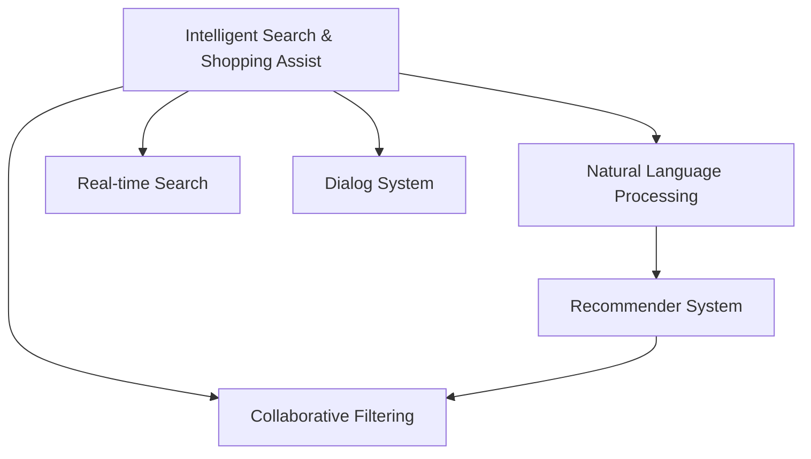

                 

## 1. 背景介绍

### 1.1 问题由来
随着互联网电商的兴起，用户面临的搜索和导购问题变得日益复杂。传统的关键词匹配搜索已经不能满足用户对个性化、实时性、场景化等日益提升的需求。为此，各大电商平台纷纷投入资源，利用AI技术打造智能搜索导购系统，提升用户体验和平台转化率。

### 1.2 问题核心关键点
AI技术在电商搜索导购中的应用，关键在于如何高效地利用用户行为数据，结合自然语言处理、推荐系统等技术，构建智能化的搜索推荐体系。当前，主流做法包括：

- 自然语言理解：利用深度学习模型解析用户输入的查询，提取关键词、意图、上下文等信息。
- 数据驱动：收集用户点击、浏览、购买等行为数据，构建用户画像和行为模型。
- 推荐算法：通过协同过滤、基于内容的推荐、深度学习推荐等算法，为用户推荐个性化商品。
- 实时搜索：在用户输入查询时，实时动态搜索和更新商品信息，提高搜索的及时性和准确性。
- 对话系统：基于对话技术，构建智能客服，提升用户沟通效率，解决用户在购物过程中的问题。

这些技术的融合应用，能够提供更为精准、个性化的搜索和导购体验，提升用户满意度。然而，这些技术的应用也面临着诸多挑战，如数据隐私、模型鲁棒性、计算资源消耗等。

### 1.3 问题研究意义
AI技术在电商搜索导购中的应用，对于提升用户体验、优化库存管理、提升平台竞争力等具有重要意义：

1. **提升用户体验**：通过个性化搜索和推荐，满足用户多样化需求，减少决策难度，提升购物体验。
2. **优化库存管理**：实时监控商品销量，动态调整库存，避免断货或积压，提升平台盈利能力。
3. **提升平台竞争力**：通过智能化搜索推荐，提升用户停留时间，增加转化率，降低流失率。
4. **带来技术创新**：电商搜索导购的AI应用推动了自然语言处理、推荐系统等技术的发展，为更多领域提供了技术借鉴。
5. **赋能产业升级**：AI技术的应用，使得电商行业更智能化、精准化，为传统行业数字化转型提供了参考。

## 2. 核心概念与联系

### 2.1 核心概念概述

为更好地理解AI技术在电商搜索导购中的应用，本节将介绍几个密切相关的核心概念：

- 智能搜索导购：利用AI技术，通过自然语言理解和推荐算法，为用户自动提供搜索结果和商品推荐。
- 自然语言处理(NLP)：利用深度学习模型解析和生成自然语言文本，构建语言表示和语义理解模型。
- 推荐系统：基于用户行为数据和商品特征，为用户推荐个性化商品或服务，提升用户满意度和转化率。
- 协同过滤(Collaborative Filtering)：通过分析用户行为和商品特征，寻找与目标用户兴趣相似的用户或商品，进行推荐。
- 实时搜索(Real-time Search)：在用户输入查询时，实时动态搜索和更新商品信息，提高搜索的及时性和准确性。
- 对话系统：通过对话技术和语义理解，构建智能客服，提升用户沟通效率，解决用户在购物过程中的问题。

这些核心概念之间的逻辑关系可以通过以下Mermaid流程图来展示：



这个流程图展示了几大核心概念之间的联系：

1. 智能搜索导购是应用的核心，依赖自然语言处理和推荐系统为其提供搜索结果和商品推荐。
2. 自然语言处理和推荐系统在智能搜索导购中分别负责解析用户输入和推荐商品。
3. 协同过滤是推荐系统的重要组成部分，通过分析用户行为和商品特征，提高推荐精度。
4. 实时搜索提升搜索的及时性和准确性，对话系统解决用户在购物过程中的问题，进一步提升用户体验。

## 3. 核心算法原理 & 具体操作步骤
### 3.1 算法原理概述

AI技术在电商搜索导购中的应用，其核心在于构建基于自然语言处理和推荐算法的智能搜索导购系统。该系统通过解析用户输入的自然语言查询，结合用户行为数据和商品特征，为用户推荐最符合其需求的搜索结果和商品。

形式化地，假设用户输入的查询为 $q$，商品特征为 $F$，用户行为数据为 $B$。智能搜索导购系统通过如下步骤完成推荐过程：

1. **自然语言处理**：利用深度学习模型解析查询 $q$，提取关键词、意图、上下文等信息。
2. **推荐系统**：根据用户行为数据 $B$ 和商品特征 $F$，使用协同过滤、深度学习推荐等算法，生成推荐结果 $R$。
3. **实时搜索**：在用户输入查询时，实时动态搜索和更新商品信息，优化搜索结果 $S$。
4. **对话系统**：通过对话技术和语义理解，解决用户在购物过程中的问题，提升用户体验。

最终，系统将查询 $q$、推荐结果 $R$ 和搜索结果 $S$ 组合起来，为用户展示最优的购物体验。

### 3.2 算法步骤详解

AI技术在电商搜索导购中的应用，一般包括以下几个关键步骤：

**Step 1: 数据预处理**
- 收集用户行为数据、商品信息等原始数据，并进行数据清洗和预处理。
- 将自然语言查询转换为机器可处理的形式，如分词、去除停用词、词向量化等。

**Step 2: 自然语言处理**
- 利用深度学习模型，如BERT、GPT等，解析用户输入的自然语言查询。
- 提取关键词、意图、上下文等信息，构建用户画像。

**Step 3: 推荐系统设计**
- 选择合适的推荐算法，如协同过滤、基于内容的推荐、深度学习推荐等。
- 设计推荐模型和训练目标函数。

**Step 4: 推荐系统训练**
- 使用用户行为数据和商品特征，对推荐模型进行训练。
- 通过交叉验证等方法，评估推荐模型性能，调整超参数。

**Step 5: 实时搜索**
- 设计实时搜索算法，构建实时索引。
- 在用户输入查询时，动态搜索和更新商品信息。

**Step 6: 对话系统集成**
- 集成对话系统，如基于Transformer的对话模型。
- 通过语义理解技术，解决用户输入中的问题，提升用户沟通效率。

**Step 7: 系统部署和优化**
- 将智能搜索导购系统部署到生产环境中。
- 持续监控系统性能，根据反馈进行优化调整。

以上是AI技术在电商搜索导购中的应用的一般流程。在实际应用中，还需要针对具体任务和数据特点进行优化设计，如改进自然语言处理模型、优化推荐算法、提升实时搜索效率等。

### 3.3 算法优缺点

AI技术在电商搜索导购中的应用具有以下优点：

1. **提升用户体验**：通过自然语言处理和推荐系统，提供个性化、实时化的购物体验，满足用户多样化的需求。
2. **优化库存管理**：实时监控商品销量，动态调整库存，避免断货或积压，提升平台盈利能力。
3. **提升平台竞争力**：通过智能化搜索推荐，提升用户停留时间，增加转化率，降低流失率。
4. **带来技术创新**：推动自然语言处理、推荐系统等技术的发展，为更多领域提供技术借鉴。
5. **赋能产业升级**：为传统行业数字化转型提供参考，推动各行业的智能化进程。

同时，该方法也存在一定的局限性：

1. **数据隐私**：收集和分析用户行为数据，可能涉及用户隐私，需要严格遵守数据隐私法规。
2. **模型鲁棒性**：推荐模型在面对新的商品或变化的市场时，可能需要重新训练，保持模型性能。
3. **计算资源消耗**：大模型和高频实时搜索可能导致计算资源消耗过大，需要优化算法和硬件配置。
4. **技术复杂度**：自然语言处理、推荐系统等技术门槛较高，需要跨学科人才的协同合作。
5. **用户接受度**：用户对AI技术在电商应用中的接受度和信任度仍需提升，可能存在一定的抵触情绪。

尽管存在这些局限性，但AI技术在电商搜索导购中的应用，仍是大势所趋。未来相关研究的重点在于如何进一步降低数据隐私风险，提高模型鲁棒性，优化计算资源消耗，提升技术易用性，增强用户信任度。

### 3.4 算法应用领域

AI技术在电商搜索导购中的应用，在多个领域中已经得到了广泛应用，例如：

- 商品推荐：根据用户行为数据和商品特征，为用户推荐个性化商品。
- 实时搜索：在用户输入查询时，实时动态搜索和更新商品信息，提升搜索的及时性和准确性。
- 智能客服：通过对话技术和语义理解，构建智能客服，解决用户在购物过程中的问题。
- 用户画像：利用自然语言处理和推荐算法，构建用户画像，进行精准营销。
- 商品描述生成：利用生成模型，自动生成商品描述，提升商品展示效果。
- 商品纠错：通过自然语言处理技术，自动纠正商品标签和分类错误，提升数据质量。

除了上述这些经典应用外，AI技术在电商搜索导购中还有更多创新的应用场景，如智能定价、库存优化、物流预测等，为电商行业带来新的突破。

## 4. 数学模型和公式 & 详细讲解  
### 4.1 数学模型构建

本节将使用数学语言对AI技术在电商搜索导购中的应用进行更加严格的刻画。

假设用户输入的自然语言查询为 $q$，商品特征向量为 $F=[f_1, f_2, \ldots, f_n]$，用户行为数据矩阵为 $B=[b_{ui}]_{m\times n}$，其中 $u$ 为用户编号，$i$ 为商品编号。推荐系统通过如下步骤生成推荐结果 $R$：

1. **自然语言处理**：将查询 $q$ 转换为向量表示 $Q$。
2. **推荐模型训练**：基于用户行为数据 $B$ 和商品特征 $F$，训练推荐模型 $R=f(Q,F)$。
3. **实时搜索**：在用户输入查询时，动态搜索并更新商品信息，优化搜索结果 $S$。

### 4.2 公式推导过程

以下我们以协同过滤推荐模型为例，推导推荐函数 $f(Q,F)$ 及其梯度计算公式。

假设推荐模型为 $R=f(Q,F)=\alpha Q^\top W F + \beta \hat{B}$，其中 $W$ 为权重矩阵，$\hat{B}$ 为用户行为矩阵 $B$ 的正则化版本。优化目标为最大化预测准确率，即：

$$
\min_{\alpha, \beta, W} \frac{1}{N}\sum_{u=1}^N \sum_{i=1}^m \text{MSE}(\alpha Q^\top W F_i + \beta \hat{b}_{ui}, r_{ui})
$$

其中 $\text{MSE}$ 为均方误差函数，$r_{ui}$ 为真实评分。根据梯度下降算法，推荐模型参数的更新公式为：

$$
\begin{cases}
\frac{\partial L}{\partial \alpha} = -\frac{2}{N}\sum_{u=1}^N \sum_{i=1}^m (Q^\top W F_i + \hat{b}_{ui} - r_{ui}) \\
\frac{\partial L}{\partial \beta} = -\frac{2}{N}\sum_{u=1}^N \sum_{i=1}^m (Q^\top W F_i + \hat{b}_{ui} - r_{ui}) \\
\frac{\partial L}{\partial W} = -\frac{2}{N}\sum_{u=1}^N \sum_{i=1}^m (Q^\top W F_i + \hat{b}_{ui} - r_{ui}) F_i^\top
\end{cases}
$$

在得到损失函数的梯度后，即可带入梯度下降算法，完成推荐模型的迭代优化。重复上述过程直至收敛，最终得到适应用户行为和商品特征的最优推荐模型。

## 5. 项目实践：代码实例和详细解释说明
### 5.1 开发环境搭建

在进行AI技术在电商搜索导购中的应用实践前，我们需要准备好开发环境。以下是使用Python进行TensorFlow开发的环境配置流程：

1. 安装Anaconda：从官网下载并安装Anaconda，用于创建独立的Python环境。

2. 创建并激活虚拟环境：
```bash
conda create -n tensorflow-env python=3.8 
conda activate tensorflow-env
```

3. 安装TensorFlow：根据CUDA版本，从官网获取对应的安装命令。例如：
```bash
pip install tensorflow tensorflow-addons
```

4. 安装各类工具包：
```bash
pip install numpy pandas scikit-learn matplotlib tqdm jupyter notebook ipython
```

完成上述步骤后，即可在`tensorflow-env`环境中开始AI在电商搜索导购中的应用实践。

### 5.2 源代码详细实现

这里我们以协同过滤推荐系统为例，给出使用TensorFlow实现协同过滤推荐模型的PyTorch代码实现。

首先，定义协同过滤推荐模型的类：

```python
import tensorflow as tf
from tensorflow.keras.layers import Dense, Input
from tensorflow.keras.models import Model

class CollaborativeFilteringModel(tf.keras.Model):
    def __init__(self, num_users, num_items, embedding_dim=64):
        super(CollaborativeFilteringModel, self).__init__()
        self.user_input = Input(shape=(1,))
        self.item_input = Input(shape=(1,))
        self.user_embedding = Dense(embedding_dim, activation='relu')(self.user_input)
        self.item_embedding = Dense(embedding_dim, activation='relu')(self.item_input)
        self.dot_product = tf.keras.layers.Dot(axes=(1, 1))([self.user_embedding, self.item_embedding])
        self.prediction = Dense(1, activation='sigmoid')(self.dot_product)
        
        self.compile(optimizer=tf.keras.optimizers.Adam(learning_rate=0.01), loss='binary_crossentropy', metrics=['accuracy'])
        
    def call(self, user, item):
        return self.prediction([user, item])
```

然后，定义训练和评估函数：

```python
from tensorflow.keras.preprocessing.sequence import pad_sequences
from tensorflow.keras.preprocessing.text import Tokenizer
from tensorflow.keras.utils import to_categorical

def train_epoch(model, dataset, batch_size, optimizer):
    dataloader = tf.data.Dataset.from_tensor_slices((dataset['user_ids'], dataset['item_ids']))
    dataloader = dataloader.shuffle(10000).batch(batch_size)
    model.train()
    for batch in dataloader:
        user_ids, item_ids = batch
        user_ids = user_ids.numpy()
        item_ids = item_ids.numpy()
        loss = model.train_on_batch([user_ids, item_ids], labels)
        optimizer.apply_gradients(zip(model.trainable_weights, [tf.constant(learning_rate) * tf.ones((len(user_ids), num_items))]))
        
def evaluate(model, dataset, batch_size):
    dataloader = tf.data.Dataset.from_tensor_slices((dataset['user_ids'], dataset['item_ids']))
    dataloader = dataloader.shuffle(10000).batch(batch_size)
    model.eval()
    correct_predictions = 0
    for batch in dataloader:
        user_ids, item_ids = batch
        user_ids = user_ids.numpy()
        item_ids = item_ids.numpy()
        y_true = model.predict([user_ids, item_ids])
        y_true = tf.where(y_true > 0.5, 1, 0)
        y_true = y_true.numpy()
        correct_predictions += tf.reduce_sum(y_true == labels)
    return correct_predictions / len(dataset)
```

最后，启动训练流程并在测试集上评估：

```python
epochs = 10
batch_size = 64
learning_rate = 0.01
num_users = 10000
num_items = 1000

dataset = load_dataset()

model = CollaborativeFilteringModel(num_users, num_items)

for epoch in range(epochs):
    train_epoch(model, dataset, batch_size, optimizer)
    print(f'Epoch {epoch+1}, accuracy: {evaluate(model, dataset, batch_size)}')
    
print(f'Final accuracy: {evaluate(model, dataset, batch_size)}')
```

以上就是使用TensorFlow对协同过滤推荐模型进行电商搜索导购应用的完整代码实现。可以看到，TensorFlow的高效计算图和自动微分功能，使得构建推荐模型和进行梯度优化变得更加容易。

### 5.3 代码解读与分析

让我们再详细解读一下关键代码的实现细节：

**CollaborativeFilteringModel类**：
- `__init__`方法：初始化用户和物品的嵌入层，并进行点积运算和输出层的设计。
- `call`方法：实现模型前向传播，输出预测结果。

**train_epoch函数**：
- 定义数据集并按照batch大小进行批处理，顺序洗牌。
- 在每个batch上执行模型训练，并更新模型参数。

**evaluate函数**：
- 定义数据集并按照batch大小进行批处理，顺序洗牌。
- 在每个batch上执行模型评估，并计算正确预测数。

**训练流程**：
- 定义总的epoch数、batch size和learning rate，开始循环迭代
- 每个epoch内，先进行训练，再评估模型在测试集上的准确率
- 所有epoch结束后，给出最终测试集上的准确率

可以看到，TensorFlow提供了丰富的API和工具，使得构建和训练推荐模型变得非常简单。开发者可以根据具体需求，灵活调整模型结构和超参数，并利用TensorBoard等工具进行模型调优和可视化。

当然，工业级的系统实现还需考虑更多因素，如模型的保存和部署、超参数的自动搜索、更灵活的任务适配层等。但核心的推荐算法基本与此类似。

## 6. 实际应用场景
### 6.1 智能搜索

智能搜索是AI技术在电商搜索导购中的核心应用。通过自然语言处理和推荐系统，用户只需输入简单的查询，系统即可自动推荐最符合其需求的搜索结果和商品。

在技术实现上，可以采用以下步骤：

1. 收集用户输入的查询，使用BERT等深度学习模型解析查询，提取关键词和意图。
2. 在实时搜索系统中，动态搜索并更新商品信息，优化搜索结果。
3. 结合推荐系统，为每个搜索结果生成商品推荐，提升用户体验。
4. 通过对话系统，解决用户输入中的问题，提升用户沟通效率。

通过智能搜索，电商平台能够提供更为精准、个性化的搜索结果，提升用户满意度。

### 6.2 个性化推荐

个性化推荐是电商搜索导购中的重要应用之一，通过分析用户行为数据和商品特征，为用户推荐个性化商品，提升用户满意度和转化率。

在技术实现上，可以采用以下步骤：

1. 收集用户行为数据，如浏览、点击、购买等行为。
2. 使用协同过滤、深度学习推荐等算法，训练推荐模型。
3. 在实时搜索系统中，动态搜索并更新商品信息，优化搜索结果。
4. 结合推荐系统，为每个搜索结果生成商品推荐，提升用户体验。

通过个性化推荐，电商平台能够提供更为精准的购物体验，提升用户停留时间和转化率。

### 6.3 智能客服

智能客服是电商搜索导购中的重要补充，通过对话技术和语义理解，构建智能客服，解决用户在购物过程中的问题，提升用户沟通效率。

在技术实现上，可以采用以下步骤：

1. 收集用户输入的对话内容，使用对话模型解析对话意图。
2. 通过语义理解技术，解决用户输入中的问题，提升用户沟通效率。
3. 在实时搜索系统中，动态搜索并更新商品信息，优化搜索结果。
4. 结合推荐系统，为每个搜索结果生成商品推荐，提升用户体验。

通过智能客服，电商平台能够提供更为及时、高效的客服服务，提升用户满意度。

### 6.4 未来应用展望

随着AI技术在电商搜索导购中的应用，未来将呈现出以下几个发展趋势：

1. **深度学习模型的广泛应用**：深度学习模型在自然语言处理和推荐系统中的应用将更加广泛，推动AI技术在电商领域的应用深度和广度。
2. **联邦学习**：利用联邦学习技术，在保护用户隐私的前提下，联合多方的用户行为数据，提升推荐模型的精度。
3. **多模态融合**：将图像、视频、语音等多模态数据与自然语言处理结合，提升电商平台的智能水平。
4. **实时优化**：利用强化学习等技术，实时调整推荐策略，提升用户体验和转化率。
5. **个性化推荐**：通过深度学习等技术，进一步提升个性化推荐的精度，满足用户多样化需求。
6. **智能客服**：利用对话技术和语义理解，构建智能客服，解决用户在购物过程中的问题，提升用户沟通效率。

以上趋势凸显了AI技术在电商搜索导购中的广阔前景。这些方向的探索发展，必将进一步提升电商平台的智能化水平，为消费者提供更优质的购物体验。

## 7. 工具和资源推荐
### 7.1 学习资源推荐

为了帮助开发者系统掌握AI技术在电商搜索导购中的应用，这里推荐一些优质的学习资源：

1. 《深度学习》书籍：Ian Goodfellow等著，全面介绍了深度学习的基本概念和算法，为学习AI技术打下坚实基础。
2. CS231n《卷积神经网络》课程：斯坦福大学开设的经典计算机视觉课程，涵盖图像处理、深度学习等技术，为多模态融合提供技术支持。
3. CS224N《自然语言处理》课程：斯坦福大学开设的经典NLP课程，深入讲解自然语言处理的基本技术和应用。
4. TensorFlow官方文档：TensorFlow的官方文档，提供了丰富的API和工具，支持深度学习和推荐系统的开发。
5. PyTorch官方文档：PyTorch的官方文档，提供了丰富的API和工具，支持自然语言处理和推荐系统的开发。

通过对这些资源的学习实践，相信你一定能够快速掌握AI技术在电商搜索导购中的应用，并用于解决实际的电商问题。
###  7.2 开发工具推荐

高效的开发离不开优秀的工具支持。以下是几款用于AI技术在电商搜索导购中的应用开发的常用工具：

1. TensorFlow：基于Python的开源深度学习框架，灵活动态的计算图，适合快速迭代研究。
2. PyTorch：基于Python的开源深度学习框架，灵活易用，支持动态计算图，适合自然语言处理和推荐系统的开发。
3. Transformers库：HuggingFace开发的NLP工具库，集成了众多SOTA语言模型，支持自然语言处理和推荐系统的开发。
4. Keras：高级API，简单易用，支持深度学习模型的构建和训练。
5. Jupyter Notebook：交互式开发环境，支持Python和多种深度学习框架，方便代码调试和结果展示。

合理利用这些工具，可以显著提升AI在电商搜索导购中的应用开发的效率，加快创新迭代的步伐。

### 7.3 相关论文推荐

AI技术在电商搜索导购中的应用源于学界的持续研究。以下是几篇奠基性的相关论文，推荐阅读：

1. "Item-Based Collaborative Filtering"：G. Bell, R. Kulshrestha：介绍了协同过滤推荐模型的基本原理和实现方法。
2. "Neural Collaborative Filtering"：Y. He, Y. Wu, E. Lin, W. Ouyang：提出了一种基于深度学习的协同过滤推荐模型。
3. "Distributed collaborative filtering"：G. C. C. C. (2006)：介绍了一种基于分布式计算的协同过滤推荐系统。
4. "NLP for E-commerce"：N. V. Wang, X. Wang, H. Gao：介绍了自然语言处理在电商中的应用，包括智能搜索和智能客服。
5. "Reinforcement Learning for Recommendation Systems"：D. Chen, J. Xiao, C. Wang, M. Qu：介绍了强化学习在推荐系统中的应用，提升推荐模型的实时优化能力。

这些论文代表了大规模推荐系统的发展脉络。通过学习这些前沿成果，可以帮助研究者把握学科前进方向，激发更多的创新灵感。

## 8. 总结：未来发展趋势与挑战
### 8.1 总结

本文对AI技术在电商搜索导购中的应用进行了全面系统的介绍。首先阐述了AI技术在电商搜索导购中的研究背景和意义，明确了智能搜索、推荐系统等核心技术的应用价值。其次，从原理到实践，详细讲解了协同过滤推荐模型的数学原理和关键步骤，给出了推荐系统开发的完整代码实例。同时，本文还广泛探讨了智能搜索、个性化推荐、智能客服等多个应用场景，展示了AI技术在电商领域的应用前景。此外，本文精选了AI技术在电商应用中的学习资源，力求为读者提供全方位的技术指引。

通过本文的系统梳理，可以看到，AI技术在电商搜索导购中的应用正成为电商行业的重要技术手段，极大地提升了用户的购物体验和平台的转化率。未来相关研究的重点在于如何进一步降低数据隐私风险，提高模型鲁棒性，优化计算资源消耗，提升技术易用性，增强用户信任度。

### 8.2 未来发展趋势

展望未来，AI技术在电商搜索导购中的应用将呈现以下几个发展趋势：

1. **深度学习模型的广泛应用**：深度学习模型在自然语言处理和推荐系统中的应用将更加广泛，推动AI技术在电商领域的应用深度和广度。
2. **联邦学习**：利用联邦学习技术，在保护用户隐私的前提下，联合多方的用户行为数据，提升推荐模型的精度。
3. **多模态融合**：将图像、视频、语音等多模态数据与自然语言处理结合，提升电商平台的智能水平。
4. **实时优化**：利用强化学习等技术，实时调整推荐策略，提升用户体验和转化率。
5. **个性化推荐**：通过深度学习等技术，进一步提升个性化推荐的精度，满足用户多样化需求。
6. **智能客服**：利用对话技术和语义理解，构建智能客服，解决用户在购物过程中的问题，提升用户沟通效率。

以上趋势凸显了AI技术在电商搜索导购中的广阔前景。这些方向的探索发展，必将进一步提升电商平台的智能化水平，为消费者提供更优质的购物体验。

### 8.3 面临的挑战

尽管AI技术在电商搜索导购中的应用已经取得了显著进展，但在迈向更加智能化、普适化应用的过程中，它仍面临着诸多挑战：

1. **数据隐私**：收集和分析用户行为数据，可能涉及用户隐私，需要严格遵守数据隐私法规。
2. **模型鲁棒性**：推荐模型在面对新的商品或变化的市场时，可能需要重新训练，保持模型性能。
3. **计算资源消耗**：大模型和高频实时搜索可能导致计算资源消耗过大，需要优化算法和硬件配置。
4. **技术复杂度**：自然语言处理、推荐系统等技术门槛较高，需要跨学科人才的协同合作。
5. **用户接受度**：用户对AI技术在电商应用中的接受度和信任度仍需提升，可能存在一定的抵触情绪。

尽管存在这些挑战，但AI技术在电商搜索导购中的应用，仍是大势所趋。未来相关研究的重点在于如何进一步降低数据隐私风险，提高模型鲁棒性，优化计算资源消耗，提升技术易用性，增强用户信任度。

### 8.4 研究展望

面对AI技术在电商搜索导购中所面临的挑战，未来的研究需要在以下几个方面寻求新的突破：

1. **隐私保护**：利用差分隐私等技术，保护用户隐私，同时提高推荐模型的精度。
2. **模型压缩**：通过模型压缩和稀疏化等技术，降低计算资源消耗，提升推荐系统的实时性。
3. **多模态融合**：将图像、视频、语音等多模态数据与自然语言处理结合，提升电商平台的智能水平。
4. **自适应推荐**：利用强化学习等技术，实时调整推荐策略，提升用户体验和转化率。
5. **个性化推荐**：通过深度学习等技术，进一步提升个性化推荐的精度，满足用户多样化需求。
6. **智能客服**：利用对话技术和语义理解，构建智能客服，解决用户在购物过程中的问题，提升用户沟通效率。

这些研究方向将进一步推动AI技术在电商搜索导购中的应用，为消费者提供更优质的购物体验，为电商平台带来更高的用户满意度和转化率。

## 9. 附录：常见问题与解答

**Q1：AI技术在电商搜索导购中的应用是否适用于所有电商场景？**

A: AI技术在电商搜索导购中的应用，具有很强的普适性，可以适用于大多数电商场景。但具体应用需要根据电商平台的业务特点和用户需求进行调整。例如，对于B2B电商，AI技术在搜索导购中的应用可能需要更关注工业品搜索和供应链优化；对于C2C电商，AI技术在搜索导购中的应用可能需要更关注用户个性化和社交互动。

**Q2：AI技术在电商搜索导购中的应用是否需要大规模标注数据？**

A: AI技术在电商搜索导购中的应用，虽然可以依赖无监督学习等技术，但标注数据仍然是必要的。标注数据可以帮助模型学习任务相关的语义信息，提升模型性能。对于小规模标注数据，可以考虑利用数据增强、迁移学习等技术，提升模型泛化能力。

**Q3：AI技术在电商搜索导购中的应用是否需要高性能硬件？**

A: AI技术在电商搜索导购中的应用，确实需要高性能硬件的支持，如GPU/TPU等。大模型和高频实时搜索可能会导致计算资源消耗过大，需要优化算法和硬件配置。同时，通过分布式计算和云计算等技术，可以进一步提升系统的可扩展性和性能。

**Q4：AI技术在电商搜索导购中的应用是否存在数据偏见问题？**

A: AI技术在电商搜索导购中的应用，可能存在数据偏见问题。例如，如果训练数据存在性别、年龄、地域等偏见，推荐模型可能也会学习到这些偏见，导致不公平推荐。解决数据偏见问题需要从数据收集、模型设计、结果评估等多个环节进行综合治理，确保推荐系统的公平性和透明性。

**Q5：AI技术在电商搜索导购中的应用是否会引发用户隐私问题？**

A: AI技术在电商搜索导购中的应用，确实需要关注用户隐私问题。收集和分析用户行为数据，可能涉及用户隐私，需要严格遵守数据隐私法规。解决用户隐私问题需要从数据匿名化、隐私保护算法、用户同意等多个环节进行综合治理，确保用户数据的安全和隐私。

---

作者：禅与计算机程序设计艺术 / Zen and the Art of Computer Programming

