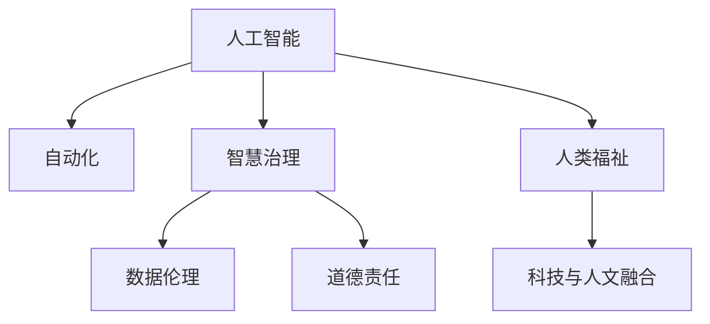

                 

# AI 驱动人类文明进步：科技与人文融合

> 关键词：人工智能,文明进步,科技与人文融合,自动化,数据伦理,智慧治理,道德责任

## 1. 背景介绍

### 1.1 问题由来

随着人工智能(AI)技术的迅猛发展，人类社会正迎来一场前所未有的变革。AI在提高生产效率、优化决策支持、推动智慧治理等方面展现了巨大潜力。然而，AI技术的快速发展也引发了一系列复杂的伦理和社会问题，对人类的价值观念、道德规范、社会结构带来了深刻挑战。

当前，AI技术已经渗透到医疗、教育、金融、制造、物流等各行各业，但如何在使用AI技术的同时，确保其符合人类的伦理标准，推动社会公正、促进人类福祉，是亟待解决的问题。科技与人文的深度融合，成为AI时代的重要课题。

### 1.2 问题核心关键点

- 如何通过科技手段，解决现实社会问题，提升人类生活质量？
- 如何在技术发展的同时，保持人文价值的引领和保障？
- 如何平衡技术效率与道德伦理，实现技术与人的和谐共生？
- 如何在AI的智能决策过程中，融入人类的情感、价值观、伦理标准？
- 如何建立公平、透明、可解释的AI系统，提升社会对AI的信任和接受度？

## 2. 核心概念与联系

### 2.1 核心概念概述

为了更好地理解AI在驱动人类文明进步中的作用，本节将介绍几个密切相关的核心概念：

- **人工智能(Artificial Intelligence, AI)**：通过计算机模拟人类智能行为，实现自主感知、判断、决策、学习等功能的技术。AI技术的核心在于模仿人类的认知能力，应用广泛且发展迅速。
- **自动化(Automation)**：通过AI技术自动化处理重复、规律性的任务，释放人力、提高效率、降低成本。自动化是AI技术的重要应用场景之一。
- **智慧治理(Smart Governance)**：利用AI技术优化政府管理和服务，提升决策科学性、治理效率和公共服务水平。智慧治理旨在构建更加智能、透明、高效的政府体系。
- **数据伦理(Data Ethics)**：在数据收集、存储、处理、分享等环节，遵循伦理原则和法律规定，保护个人隐私和数据安全，避免数据滥用和歧视性决策。
- **道德责任(Ethical Responsibility)**：在使用AI技术时，开发者和应用者应承担起道德责任，确保AI系统的行为符合人类的价值观念和伦理标准，避免对社会产生负面影响。

这些核心概念之间的逻辑关系可以通过以下Mermaid流程图来展示：



这个流程图展示了AI技术与人类福祉、自动化、智慧治理、数据伦理、道德责任等概念之间的联系和作用：

1. **人工智能**通过自动化、智慧治理等技术，提升社会效率和治理能力。
2. **数据伦理**和**道德责任**确保AI技术在处理数据和应用中遵循伦理和法律。
3. **人类福祉**是AI技术发展的最终目标，技术应服务于人类的利益。
4. **科技与人文融合**体现了科技与人文价值相辅相成的理念。

## 3. 核心算法原理 & 具体操作步骤
### 3.1 算法原理概述

AI在驱动人类文明进步的过程中，涉及多个核心算法和技术手段。以下将详细介绍AI技术的主要原理和操作步骤：

1. **机器学习**：通过大量数据训练模型，使其具备自动学习和适应新数据的能力。机器学习是AI技术的基础，应用广泛。

2. **深度学习**：通过多层神经网络结构，模拟人脑神经元的工作机制，解决复杂非线性问题。深度学习是机器学习的高级形式，在图像识别、语音识别、自然语言处理等领域表现优异。

3. **强化学习**：通过与环境的交互，逐步学习最优决策策略，优化复杂系统的控制行为。强化学习在游戏、机器人、自动驾驶等领域有重要应用。

4. **自然语言处理(NLP)**：通过计算机理解和生成自然语言，实现语言与计算机的交互。NLP是AI技术的重要分支，在智能客服、文本分析、机器翻译等方面有广泛应用。

5. **计算机视觉**：通过计算机识别和理解图像、视频等视觉信息，实现自动监控、图像分类、目标检测等功能。计算机视觉在医疗影像分析、智能安防、自动驾驶等领域具有重要价值。

6. **智能推荐系统**：通过分析用户行为数据，推荐个性化产品、内容和服务，提升用户体验和满意度。智能推荐系统在电商、媒体、社交网络等领域有广泛应用。

### 3.2 算法步骤详解

基于上述核心算法，AI技术在推动人类文明进步的过程中，主要经过以下几个步骤：

1. **数据收集与处理**：从现实世界获取数据，进行清洗、标注、整合等预处理，生成可用于模型训练的数据集。

2. **模型构建与训练**：选择合适的算法和模型架构，利用数据集进行模型训练，调整模型参数，优化模型性能。

3. **模型应用与评估**：将训练好的模型应用于实际场景，进行性能评估和反馈调整，逐步优化系统表现。

4. **系统集成与部署**：将AI模型集成到业务系统中，进行部署和运行，提供智能化服务。

5. **监控与维护**：持续监控系统运行状态，及时发现和解决问题，确保系统稳定可靠。

6. **升级与迭代**：根据业务需求和技术进展，定期升级模型和系统，不断提升AI能力。

### 3.3 算法优缺点

AI技术在推动人类文明进步的过程中，具有以下优点：

- **高效能**：AI技术通过自动化和智能化处理，大幅度提升效率，减少人工操作和决策误差。
- **大容量**：AI系统能够处理海量数据，提供全面、精准的分析和预测。
- **多领域**：AI技术广泛应用于医疗、教育、金融、制造等领域，推动各行业转型升级。
- **低成本**：AI系统通过技术手段实现优化，降低人力、物力、财力的投入。

同时，AI技术也存在以下缺点：

- **依赖数据**：AI系统的表现高度依赖数据质量，数据偏差可能导致系统决策失误。
- **算法黑箱**：AI模型通常难以解释其决策过程，缺乏透明性和可解释性。
- **伦理风险**：AI系统的决策可能存在偏见、歧视，引发社会公平性问题。
- **安全风险**：AI系统可能被攻击、篡改，引发隐私泄露和系统安全问题。
- **技术鸿沟**：AI技术复杂度高，需要专业知识和技能，存在技术鸿沟问题。

### 3.4 算法应用领域

AI技术在推动人类文明进步的过程中，具有广泛的应用领域，涵盖以下几个方面：

- **医疗健康**：利用AI技术进行疾病预测、诊断、治疗方案优化，提升医疗服务质量和效率。
- **智能制造**：通过AI技术实现生产过程自动化、智能化，提高生产效率和产品质量。
- **智慧城市**：利用AI技术优化城市管理、公共服务、交通调度，提升城市治理水平。
- **环境保护**：利用AI技术进行环境监测、污染治理、资源管理，推动可持续发展。
- **金融科技**：利用AI技术进行风险评估、欺诈检测、智能投顾，提升金融服务水平。
- **教育科技**：利用AI技术进行个性化教学、智能评估、学习推荐，提升教育效果和公平性。

这些应用领域展示了AI技术在各个领域的巨大潜力，未来随着技术的不断进步，AI将在更多领域发挥重要作用，推动社会进步。

## 4. 数学模型和公式 & 详细讲解 & 举例说明
### 4.1 数学模型构建

AI技术的数学模型构建通常包括以下几个步骤：

1. **定义模型输入与输出**：明确输入数据的格式和特征，确定输出结果的类别和形式。
2. **设计模型架构**：选择合适的神经网络层数、节点数、激活函数等参数，构建模型结构。
3. **确定损失函数**：定义模型的训练目标函数，通常采用交叉熵损失、均方误差损失等形式。
4. **选择优化器**：选择合适的优化算法，如随机梯度下降、Adam、Adagrad等，调整模型参数。

### 4.2 公式推导过程

以下以一个简单的线性回归模型为例，推导其损失函数和优化算法。

设线性回归模型的输入为 $x_i \in \mathbb{R}^n$，输出为 $y_i \in \mathbb{R}$，目标函数为 $y_i = w^Tx_i + b$，其中 $w \in \mathbb{R}^n$，$b \in \mathbb{R}$。模型的损失函数为均方误差损失函数：

$$
\mathcal{L} = \frac{1}{N}\sum_{i=1}^N (y_i - w^Tx_i - b)^2
$$

求解最小化损失函数，通过梯度下降法更新模型参数 $w$ 和 $b$。梯度下降法的更新公式为：

$$
w_{t+1} = w_t - \eta \frac{1}{N}\sum_{i=1}^N (2y_i - 2w^T_t x_i - 2b)x_i
$$

其中 $\eta$ 为学习率，控制每次参数更新的幅度。

### 4.3 案例分析与讲解

假设我们有一个包含1000个样本的线性回归问题，样本数据为 $x_i \in [0, 1]$，对应的 $y_i$ 值为 $y_i = 2x_i + \epsilon$，其中 $\epsilon \sim N(0, 0.1^2)$。我们选择Adam优化器，学习率为 $0.01$，训练10个epoch。

使用Python和PyTorch进行模型实现：

```python
import torch
import torch.nn as nn
import torch.optim as optim

class LinearRegression(nn.Module):
    def __init__(self, input_size, output_size):
        super(LinearRegression, self).__init__()
        self.linear = nn.Linear(input_size, output_size)
        
    def forward(self, x):
        return self.linear(x)

x_train = torch.randn(1000, 1)
y_train = 2 * x_train + torch.randn(1000, 1) * 0.1
model = LinearRegression(1, 1)
optimizer = optim.Adam(model.parameters(), lr=0.01)

for epoch in range(10):
    y_pred = model(x_train)
    loss = torch.mean((y_pred - y_train) ** 2)
    optimizer.zero_grad()
    loss.backward()
    optimizer.step()
    
print(model.linear.weight, model.linear.bias)
```

通过训练，可以得到最优的模型参数 $w$ 和 $b$，进一步验证模型的预测能力。

## 5. 项目实践：代码实例和详细解释说明
### 5.1 开发环境搭建

在进行AI项目实践前，我们需要准备好开发环境。以下是使用Python进行TensorFlow开发的环境配置流程：

1. 安装Anaconda：从官网下载并安装Anaconda，用于创建独立的Python环境。

2. 创建并激活虚拟环境：
```bash
conda create -n tf-env python=3.8 
conda activate tf-env
```

3. 安装TensorFlow：根据CUDA版本，从官网获取对应的安装命令。例如：
```bash
pip install tensorflow==2.7.0
```

4. 安装其他依赖库：
```bash
pip install numpy scipy pandas scikit-learn matplotlib tqdm jupyter notebook ipython
```

完成上述步骤后，即可在`tf-env`环境中开始AI项目实践。

### 5.2 源代码详细实现

下面我们以图像分类任务为例，给出使用TensorFlow进行卷积神经网络(CNN)模型训练的PyTorch代码实现。

首先，导入必要的库和模块：

```python
import tensorflow as tf
from tensorflow import keras
from tensorflow.keras import layers
```

接着，定义模型和数据集：

```python
def create_model():
    model = keras.Sequential([
        layers.Conv2D(32, (3, 3), activation='relu', input_shape=(28, 28, 1)),
        layers.MaxPooling2D((2, 2)),
        layers.Flatten(),
        layers.Dense(64, activation='relu'),
        layers.Dense(10, activation='softmax')
    ])
    return model

(train_images, train_labels), (test_images, test_labels) = keras.datasets.mnist.load_data()
train_images = train_images.reshape(train_images.shape[0], 28, 28, 1) / 255.0
test_images = test_images.reshape(test_images.shape[0], 28, 28, 1) / 255.0
```

然后，定义模型编译和训练：

```python
model = create_model()
model.compile(optimizer='adam', loss='sparse_categorical_crossentropy', metrics=['accuracy'])

model.fit(train_images, train_labels, epochs=10, validation_data=(test_images, test_labels))
```

最后，评估模型性能：

```python
test_loss, test_acc = model.evaluate(test_images, test_labels)
print('Test accuracy:', test_acc)
```

以上就是使用TensorFlow进行卷积神经网络模型训练的完整代码实现。可以看到，TensorFlow提供了丰富的API接口，使得模型构建和训练变得简洁高效。

### 5.3 代码解读与分析

让我们再详细解读一下关键代码的实现细节：

**create_model函数**：
- `layers.Conv2D`：定义卷积层，输入为28x28的灰度图像，输出32个特征图。
- `layers.MaxPooling2D`：定义池化层，对特征图进行降采样。
- `layers.Flatten`：将特征图展平为一维向量。
- `layers.Dense`：定义全连接层，输出64个神经元。
- `layers.Dense`：定义输出层，输出10个类别的概率分布。

**训练和评估函数**：
- `model.compile`：配置模型优化器、损失函数、评估指标。
- `model.fit`：对数据集进行训练，设置迭代次数和验证集。
- `model.evaluate`：在测试集上评估模型性能，输出准确率。

**训练流程**：
- 定义模型结构，进行模型编译。
- 对训练集进行拟合，设置epoch数和验证集。
- 评估模型在测试集上的性能，输出准确率。

可以看到，TensorFlow提供了丰富的工具和接口，使得模型构建和训练变得简单易行。开发者可以将更多精力放在模型设计和应用优化上，而不必过多关注底层的实现细节。

当然，工业级的系统实现还需考虑更多因素，如模型保存和部署、超参数搜索、更灵活的任务适配层等。但核心的模型构建和训练流程基本与此类似。

## 6. 实际应用场景
### 6.1 智能制造

利用AI技术优化生产流程，实现智能制造是AI技术的重要应用场景之一。传统制造过程中，生产设备、物料、人力资源管理复杂，生产效率低、成本高、浪费大。通过AI技术，可以实现生产过程自动化、智能化，提升生产效率和产品质量。

在技术实现上，可以构建智能生产线，通过物联网(IoT)技术收集设备运行数据、人员操作数据等，利用机器学习、数据分析技术优化生产计划、预测设备故障、优化物料库存。同时，利用计算机视觉技术实现质量检测，确保产品合格率。AI技术的应用，使得生产过程更加高效、精准、安全，推动制造业向智能制造转型。

### 6.2 智能客服

智能客服系统利用AI技术，能够提供24/7不间断的客户服务，解决客户咨询、问题解决、订单管理等问题。传统客服依靠人力，高峰期响应慢、效率低、服务质量难以保障。AI技术的应用，使得智能客服系统能够理解自然语言，自动生成回复，提升客户体验和服务效率。

在技术实现上，可以收集历史客服对话数据，利用自然语言处理技术进行文本分类、意图识别、实体抽取等处理，构建对话模型，实现客户查询自动回复、订单处理、情感分析等功能。AI技术的应用，使得智能客服系统具备高度自主性，能够快速响应客户需求，提高服务质量。

### 6.3 智慧城市

智慧城市是AI技术在城市治理、公共服务、交通管理等领域的重要应用。通过AI技术，可以实现城市管理的智能化、精准化、人性化，提升城市治理效率和居民生活质量。

在技术实现上，可以利用AI技术进行城市事件监测、交通流量预测、垃圾分类管理等，通过数据分析技术优化城市资源配置、提升服务效率。同时，利用计算机视觉技术进行交通监控、安防识别，确保城市安全稳定。AI技术的应用，使得城市管理更加高效、智能、人性化，提升居民生活品质。

### 6.4 未来应用展望

随着AI技术的发展，未来将有更多领域受益于AI技术的应用。

- **智慧医疗**：利用AI技术进行疾病预测、诊断、治疗方案优化，提升医疗服务质量和效率。
- **智能交通**：利用AI技术进行交通流量预测、智能调度、自动驾驶，提升交通管理水平和出行效率。
- **智能农业**：利用AI技术进行作物生长监测、病虫害预测、产量预测，优化农业生产管理。
- **智能金融**：利用AI技术进行风险评估、欺诈检测、智能投顾，提升金融服务水平和客户体验。
- **智能教育**：利用AI技术进行个性化教学、智能评估、学习推荐，提升教育效果和公平性。

AI技术的应用前景广阔，未来随着技术的不断进步，AI将在更多领域发挥重要作用，推动社会进步。

## 7. 工具和资源推荐
### 7.1 学习资源推荐

为了帮助开发者系统掌握AI技术的基础和应用，这里推荐一些优质的学习资源：

1. **《深度学习》书籍**：Ian Goodfellow等著，系统介绍了深度学习的原理、算法和应用。适合初学者和进阶者。

2. **《机器学习实战》书籍**：Peter Harrington著，通过实例介绍了机器学习算法的实现和应用。适合编程实践者。

3. **《Python机器学习》书籍**：Sebastian Raschka著，介绍了机器学习算法的Python实现和应用。适合编程实践者。

4. **Deep Learning Specialization课程**：由Andrew Ng在Coursera开设，涵盖了深度学习的多个方面，适合系统学习。

5. **Kaggle平台**：一个数据科学竞赛平台，提供大量数据集和挑战题目，适合实践应用。

6. **Google AI博客**：谷歌AI团队发布的技术博客，涵盖深度学习、自然语言处理、计算机视觉等多个领域，适合学习前沿技术。

通过学习这些资源，相信你一定能够系统掌握AI技术的基础和应用，实现更多的创新和突破。

### 7.2 开发工具推荐

高效的开发离不开优秀的工具支持。以下是几款用于AI开发常用的工具：

1. **TensorFlow**：由谷歌主导开发的开源深度学习框架，支持分布式计算、模型优化、模型部署等，适合大规模工程应用。

2. **PyTorch**：由Facebook开发的开源深度学习框架，灵活动态的计算图，适合快速迭代研究。

3. **Scikit-learn**：Python机器学习库，提供丰富的机器学习算法和工具，适合数据预处理、模型训练等。

4. **Jupyter Notebook**：一个交互式笔记本环境，支持Python、R等多种编程语言，适合数据科学研究和算法开发。

5. **AWS SageMaker**：亚马逊提供的云平台，提供模型训练、部署、监控等一站式服务，适合企业应用。

6. **TensorBoard**：TensorFlow配套的可视化工具，可以实时监测模型训练状态，提供丰富的图表展示，适合调试和优化。

合理利用这些工具，可以显著提升AI项目的开发效率，加快创新迭代的步伐。

### 7.3 相关论文推荐

AI技术的发展离不开学界的持续研究。以下是几篇奠基性的相关论文，推荐阅读：

1. **Deep Blue**：IBM开发的国际象棋AI，展示了机器学习在智能决策中的应用。

2. **AlphaGo**：谷歌DeepMind开发的围棋AI，利用深度强化学习技术，展示了AI在复杂游戏中的智能决策能力。

3. **ImageNet Large Scale Visual Recognition Challenge**：大规模图像识别竞赛，推动了计算机视觉技术的发展。

4. **BERT: Pre-training of Deep Bidirectional Transformers for Language Understanding**：BERT模型，利用自监督学习任务进行预训练，刷新了多项NLP任务SOTA。

5. **GPT-3: Language Models are Unsupervised Multitask Learners**：GPT-3模型，展示了预训练大模型在零样本学习和多任务学习中的应用。

6. **AlphaZero**：谷歌DeepMind开发的通用AI，利用强化学习和蒙特卡洛树搜索，展示了AI在多个游戏中的智能决策能力。

这些论文代表了大数据、深度学习、强化学习等领域的研究进展，通过学习这些前沿成果，可以帮助研究者把握学科前进方向，激发更多的创新灵感。

## 8. 总结：未来发展趋势与挑战

### 8.1 总结

本文对AI技术在驱动人类文明进步中的应用进行了全面系统的介绍。首先阐述了AI技术在自动化、智慧治理、数据伦理、道德责任等方面的作用，明确了AI技术在推动社会进步中的重要价值。其次，从原理到实践，详细讲解了AI技术的主要算法和技术手段，给出了AI项目开发的完整代码实例。同时，本文还广泛探讨了AI技术在医疗、制造、交通、教育等多个行业领域的应用前景，展示了AI技术的广阔前景。最后，本文精选了AI技术的各类学习资源，力求为读者提供全方位的技术指引。

通过本文的系统梳理，可以看到，AI技术在推动人类文明进步的过程中，展示了巨大的潜力。AI技术通过自动化、智能化处理，大幅度提升效率，推动社会各个领域的转型升级。未来随着技术的不断进步，AI将在更多领域发挥重要作用，推动社会进步。

### 8.2 未来发展趋势

展望未来，AI技术的发展将呈现以下几个趋势：

1. **自动化程度的提升**：随着AI技术的不断进步，自动化程度将不断提升，更多重复性、规律性的任务将由机器完成，释放人力、提高效率。

2. **智慧治理的深化**：通过AI技术优化政府管理和服务，提升决策科学性、治理效率和公共服务水平，推动构建更加智能、透明、高效的政府体系。

3. **数据伦理的重视**：数据伦理将成为AI技术发展的重要保障，确保数据收集、处理、共享等环节符合伦理和法律要求，避免数据滥用和歧视性决策。

4. **道德责任的加强**：开发者和应用者应承担起道德责任，确保AI系统的行为符合人类的价值观念和伦理标准，避免对社会产生负面影响。

5. **技术融合的加强**：AI技术将与其他技术进行更深入的融合，如知识表示、因果推理、强化学习等，多路径协同发力，共同推动社会进步。

6. **多模态应用的推广**：AI技术将更多应用于多模态数据处理，实现视觉、语音、文本等信息的整合，提升系统的智能决策能力。

以上趋势凸显了AI技术在推动人类文明进步中的重要价值。这些方向的探索发展，将进一步提升AI能力，推动社会进步。

### 8.3 面临的挑战

尽管AI技术在推动人类文明进步的过程中已经取得了显著成就，但在迈向更加智能化、普适化应用的过程中，仍面临诸多挑战：

1. **技术鸿沟**：AI技术复杂度高，需要专业知识和技能，存在技术鸿沟问题。如何普及AI技术，提升公众科技素养，是一个重要的挑战。

2. **伦理风险**：AI系统的决策可能存在偏见、歧视，引发社会公平性问题。如何确保AI系统的公平性、透明性，避免数据滥用和歧视性决策，是一个重要的研究方向。

3. **安全风险**：AI系统可能被攻击、篡改，引发隐私泄露和系统安全问题。如何提升AI系统的安全性，保障数据和系统安全，是一个重要的挑战。

4. **资源瓶颈**：AI系统的训练和推理需要大量的计算资源和存储资源，如何优化资源消耗，提升系统效率，是一个重要的研究方向。

5. **技术鸿沟**：AI技术复杂度高，需要专业知识和技能，存在技术鸿沟问题。如何普及AI技术，提升公众科技素养，是一个重要的挑战。

6. **伦理风险**：AI系统的决策可能存在偏见、歧视，引发社会公平性问题。如何确保AI系统的公平性、透明性，避免数据滥用和歧视性决策，是一个重要的研究方向。

7. **安全风险**：AI系统可能被攻击、篡改，引发隐私泄露和系统安全问题。如何提升AI系统的安全性，保障数据和系统安全，是一个重要的挑战。

8. **资源瓶颈**：AI系统的训练和推理需要大量的计算资源和存储资源，如何优化资源消耗，提升系统效率，是一个重要的研究方向。

这些挑战凸显了AI技术在推动社会进步中的复杂性和艰巨性。为应对这些挑战，需要各方的共同努力和持续创新。

### 8.4 研究展望

面对AI技术在推动人类文明进步中所面临的挑战，未来的研究需要在以下几个方面寻求新的突破：

1. **数据伦理与隐私保护**：在数据收集、处理、共享等环节，确保数据的安全性和隐私性，避免数据滥用和歧视性决策。

2. **AI系统的公平性与透明性**：确保AI系统的决策过程透明、可解释，避免偏见和歧视，提升系统的公平性和可信度。

3. **多模态信息融合**：将符号化的先验知识，如知识图谱、逻辑规则等，与神经网络模型进行融合，提升系统的智能决策能力。

4. **对抗样本与攻击防御**：研究对抗样本生成与防御技术，确保AI系统在面对攻击时具备鲁棒性，避免安全风险。

5. **可解释性与可控性**：研究AI系统的可解释性、可控性，确保其行为符合人类的价值观念和伦理标准，提升系统的可解释性和可控性。

6. **持续学习与演化**：研究AI系统的持续学习与演化能力，确保其能够不断从新数据中学习，更新知识，避免过拟合和数据偏见。

7. **通用人工智能**：研究通用人工智能(AI)的目标，提升AI系统的智能决策能力，推动AI向更全面、更智能的方向发展。

这些研究方向的探索，将引领AI技术迈向更高的台阶，为构建安全、可靠、可解释、可控的智能系统铺平道路。面向未来，AI技术还需要与其他人工智能技术进行更深入的融合，如知识表示、因果推理、强化学习等，多路径协同发力，共同推动社会进步。只有勇于创新、敢于突破，才能不断拓展AI技术的边界，让智能技术更好地造福人类社会。

## 9. 附录：常见问题与解答

**Q1：如何平衡技术效率与道德伦理？**

A: 在AI系统设计过程中，应充分考虑技术效率与道德伦理的平衡，确保系统行为符合人类的价值观念和伦理标准。可以通过以下措施平衡两者：

- **伦理审查**：在系统开发过程中，进行伦理审查和风险评估，确保系统设计符合伦理标准。
- **可解释性设计**：增强系统的可解释性，使决策过程透明、可解释，便于人类理解和监督。
- **公平性设计**：确保系统决策的公平性，避免偏见和歧视，提升系统的可信度。
- **用户参与**：在系统设计中引入用户反馈，确保系统行为符合用户期望和需求。

**Q2：如何应对AI系统的偏见和歧视？**

A: AI系统可能存在偏见和歧视，需要采取以下措施应对：

- **数据清洗**：对训练数据进行清洗，确保数据集的多样性和代表性，避免数据偏见。
- **模型监督**：在模型训练过程中，加入监督机制，实时监控模型决策，及时发现和纠正偏见。
- **模型可解释性**：增强模型的可解释性，便于人类理解和监督模型行为。
- **多方协作**：在AI系统设计中引入多方协作机制，确保系统的公平性和透明性。

**Q3：如何提升AI系统的安全性？**

A: AI系统可能面临安全威胁，需要采取以下措施提升系统安全性：

- **安全设计**：在系统设计中考虑安全性，确保系统的鲁棒性和抗攻击性。
- **安全测试**：在系统开发过程中进行安全测试，发现和修复潜在漏洞。
- **安全监控**：在系统运行过程中进行安全监控，及时发现和应对安全威胁。
- **安全合规**：确保系统遵守相关的法律法规，避免违法违规行为。

这些措施可以帮助提升AI系统的安全性，保障数据和系统的安全。

---

作者：禅与计算机程序设计艺术 / Zen and the Art of Computer Programming

