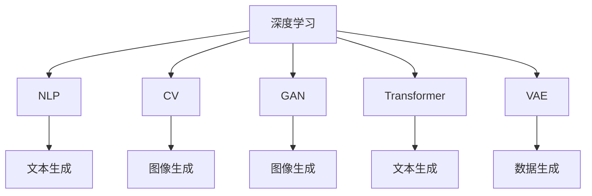

                 

# AIGC(AI Generated Content) - 原理与代码实例讲解

> 关键词：AIGC, AI Generated Content, 深度学习, 自然语言处理(NLP), 计算机视觉(CV), 生成对抗网络(GAN), 文本生成, 图像生成, 视频生成, 语音合成

## 1. 背景介绍

### 1.1 问题由来

随着人工智能(AI)技术的飞速发展，人工智能生成内容(AIGC)逐渐成为技术前沿和研究热点。AI生成的内容不仅包括自然语言文本，还包括图像、视频、音频等多种形式。AIGC技术在内容创作、娱乐、教育、医疗等领域展现出了巨大的潜力，正在逐步改变人类的生活方式。

但与此同时，AIGC技术的原理和应用也面临着诸多挑战。如何通过深度学习、自然语言处理(NLP)、计算机视觉(CV)等技术，实现高质量的生成内容，是一个复杂且多学科交叉的难题。本文将系统地介绍AIGC技术的原理和应用，并通过代码实例讲解关键技术，帮助读者全面掌握这一前沿技术。

### 1.2 问题核心关键点

AIGC技术的核心在于通过深度学习算法，从大规模数据中学习和捕捉内容的生成规律，实现高效、自动、高精度的内容生成。核心点包括：

- **深度学习算法**：通过多层神经网络，捕捉输入与输出之间的复杂映射关系。
- **数据集与标注**：高质量的数据集和标注是生成高质量内容的基础。
- **生成对抗网络(GAN)**：一种特殊的深度学习框架，通过对抗训练生成高逼真度的内容。
- **自然语言处理(NLP)**：处理文本数据，实现自然语言的生成和理解。
- **计算机视觉(CV)**：处理图像数据，生成高逼真度、有意义的图像内容。
- **视频生成与合成**：结合CV和NLP，生成自然流畅的视频内容。
- **语音合成**：实现自然流畅的语音输出，结合文本输入和语言模型训练。

## 2. 核心概念与联系

### 2.1 核心概念概述

为更好地理解AIGC技术的核心原理和应用，本节将介绍几个密切相关的核心概念：

- **深度学习**：一种基于神经网络的机器学习方法，通过多层非线性映射实现复杂数据的拟合和预测。
- **自然语言处理(NLP)**：研究如何使计算机理解和生成人类语言的技术，包括文本分类、情感分析、机器翻译、文本生成等。
- **计算机视觉(CV)**：研究如何使计算机理解和处理图像和视频等视觉数据，包括图像分类、目标检测、图像生成、视频生成等。
- **生成对抗网络(GAN)**：一种特殊的深度学习框架，由生成器和判别器两个子网络组成，通过对抗训练生成高逼真度的内容。
- **自回归模型(如Transformer)**：一种基于序列建模的深度学习模型，用于生成文本、音频等序列数据。
- **变分自编码器(VAE)**：一种生成模型，通过编码器将输入数据映射到潜在空间，再通过解码器生成输出数据，实现数据的生成和压缩。

这些核心概念之间的逻辑关系可以通过以下Mermaid流程图来展示：



这个流程图展示了大语言模型的工作原理和应用领域：

1. 深度学习为各种生成任务提供了理论基础，实现从数据中自动学习和提取规律。
2. NLP、CV、GAN等框架基于深度学习，用于文本、图像、视频等多种形式的内容生成。
3. Transformer、VAE等模型作为深度学习的重要分支，实现序列数据的高效生成。
4. 通过这些核心概念的组合和应用，AIGC技术可以生成高质量、高逼真度的内容，满足多样化的需求。

## 3. 核心算法原理 & 具体操作步骤
### 3.1 算法原理概述

AIGC技术的核心算法原理包括深度学习模型、自然语言处理模型、生成对抗网络等。这些算法在数据集上进行训练，以捕捉生成内容的规律，实现高效、自动、高精度的内容生成。

**深度学习模型**：通过多层神经网络，捕捉输入与输出之间的复杂映射关系。在文本生成中，常用的模型包括LSTM、GRU、Transformer等。在图像生成中，常用的模型包括CNN、GAN等。

**自然语言处理模型**：研究如何使计算机理解和生成人类语言。常见的NLP任务包括文本分类、情感分析、机器翻译、文本生成等。

**生成对抗网络(GAN)**：一种特殊的深度学习框架，由生成器和判别器两个子网络组成，通过对抗训练生成高逼真度的内容。GAN在图像生成、视频生成等领域表现优异。

**自回归模型(如Transformer)**：一种基于序列建模的深度学习模型，用于生成文本、音频等序列数据。Transformer在文本生成中表现出色，可以处理长文本和复杂的语言结构。

**变分自编码器(VAE)**：一种生成模型，通过编码器将输入数据映射到潜在空间，再通过解码器生成输出数据，实现数据的生成和压缩。VAE在图像生成、音频生成等任务中也有广泛应用。

### 3.2 算法步骤详解

AIGC技术的主要步骤包括数据集准备、模型构建、训练和评估等。具体步骤如下：

**Step 1: 数据集准备**
- 收集高质量的数据集，包括文本、图像、视频、音频等多种形式。数据集应涵盖多种风格、场景、主题，以提高模型的泛化能力。
- 对数据集进行预处理，如数据清洗、数据增强、标注等，保证数据的质量和多样性。

**Step 2: 模型构建**
- 根据生成任务选择合适的深度学习模型。例如，对于文本生成，可以使用Transformer等自回归模型；对于图像生成，可以使用GAN等生成对抗网络。
- 构建模型的损失函数和优化器，设置合适的超参数，如学习率、批大小、迭代轮数等。

**Step 3: 训练和评估**
- 在准备好的数据集上，进行模型训练。训练过程通常包括前向传播、损失计算、反向传播等步骤。
- 在训练过程中，周期性评估模型性能，如使用BLEU、ROUGE等指标评估文本生成质量，使用Inception Score等指标评估图像生成质量。
- 调整模型超参数，优化模型结构，提高生成质量。

**Step 4: 生成与后处理**
- 使用训练好的模型生成新内容。对于文本生成，可以使用模型的参数生成自然流畅的文本；对于图像生成，可以使用模型的参数生成高逼真度的图像。
- 对生成的内容进行后处理，如文本纠错、图像滤波、音视频合成等，提升生成内容的自然度和质量。

### 3.3 算法优缺点

AIGC技术具有以下优点：

- **高效性**：利用深度学习算法，自动捕捉生成内容的规律，生成速度较快。
- **多样性**：可以生成多种形式的内容，满足多样化的需求。
- **高逼真度**：利用生成对抗网络等技术，生成高逼真度的内容，提升用户体验。
- **自动化**：自动完成内容的生成和处理，减少人工干预，提高效率。

同时，AIGC技术也存在一些缺点：

- **数据依赖性**：生成质量受数据集质量的影响较大。
- **模型复杂度**：深度学习模型通常参数较多，训练和推理需要较高的计算资源。
- **结果不确定性**：模型生成的内容存在不确定性，可能出现不合理或不准确的情况。
- **伦理与法律问题**：生成的内容可能存在版权、隐私等问题，需要谨慎处理。

### 3.4 算法应用领域

AIGC技术在多个领域得到了广泛应用，具体包括：

- **内容创作**：自动生成新闻、文章、小说、广告文案等内容，提高创作效率。
- **娱乐与游戏**：生成虚拟角色、场景、故事情节等，丰富娱乐体验。
- **教育**：生成教育资源、教材、习题等内容，提高教育质量。
- **医疗**：生成医学文献、报告、科普文章等内容，辅助医学研究。
- **广告与营销**：生成广告素材、营销文案等内容，提高广告效果。
- **创意设计**：生成设计稿、图形、视频等内容，辅助创意设计。

## 4. 数学模型和公式 & 详细讲解 & 举例说明（备注：数学公式请使用latex格式，latex嵌入文中独立段落使用 $$，段落内使用 $)
### 4.1 数学模型构建

本节将使用数学语言对AIGC技术的核心数学模型进行详细讲解。

以文本生成为例，假设输入序列为 $X=(x_1,x_2,...,x_t)$，输出序列为 $Y=(y_1,y_2,...,y_t)$。目标是训练一个语言模型 $p(Y|X)$，使得在给定输入 $X$ 的情况下，生成输出 $Y$ 的概率最大化。

语言模型的基本形式为：

$$
p(Y|X) = \prod_{i=1}^t p(y_i|y_{<i},x)
$$

其中 $y_{<i}$ 表示 $y_i$ 之前的所有字符，$p(y_i|y_{<i},x)$ 表示在给定输入和之前生成的字符 $y_{<i}$ 的情况下，当前字符 $y_i$ 的条件概率。

对于自回归模型如Transformer，$p(y_i|y_{<i},x)$ 可以通过训练获得。具体而言，假设模型参数为 $\theta$，则有：

$$
p(y_i|y_{<i},x) = \frac{e^{\log p(y_i|y_{<i},x;\theta)}}{\sum_{y'} p(y'|y_{<i},x;\theta)}
$$

其中 $\log p(y_i|y_{<i},x;\theta)$ 为模型在输入 $x$ 和之前生成的字符 $y_{<i}$ 的情况下，生成当前字符 $y_i$ 的log概率。

### 4.2 公式推导过程

以自回归模型Transformer为例，假设模型的输出层为 $[H;2H;2H;O]$，其中 $H$ 为隐藏层维度，$O$ 为输出维度。则Transformer的输出层可以表示为：

$$
X = \text{Linear}(Y; \text{Softmax})
$$

其中 $\text{Linear}$ 为线性层，$\text{Softmax}$ 为softmax函数。

假设输入序列为 $(x_1,x_2,...,x_t)$，则Transformer的输出为：

$$
\begin{aligned}
& Y = \text{LayerNorm}(X) + \text{Attention}(X;X) + \text{FeedForward}(\text{Attention}(X;X)) \\
& \text{Attention}(X;X) = \text{MultiHeadAttention}(X;X) + \text{FeedForward}(\text{MultiHeadAttention}(X;X))
\end{aligned}
$$

其中 $\text{LayerNorm}$ 为层归一化，$\text{MultiHeadAttention}$ 为多头注意力机制，$\text{FeedForward}$ 为前馈层。

### 4.3 案例分析与讲解

以文本生成任务为例，假设输入序列为 "I am"，使用Transformer模型生成接下来的几个单词。模型的输入为：

$$
X = \text{Embedding}(I;\text{LayerNorm})
$$

其中 $\text{Embedding}$ 为嵌入层，$\text{LayerNorm}$ 为层归一化。

模型的输出为：

$$
\begin{aligned}
& Y = \text{LayerNorm}(X) + \text{Attention}(X;X) + \text{FeedForward}(\text{Attention}(X;X)) \\
& \text{Attention}(X;X) = \text{MultiHeadAttention}(X;X) + \text{FeedForward}(\text{MultiHeadAttention}(X;X))
\end{aligned}
$$

其中 $\text{Attention}(X;X)$ 表示在输入序列 $X$ 上进行的自注意力机制，$\text{FeedForward}$ 表示前馈层。

通过训练获得的模型参数 $\theta$，可以计算在输入序列 $X$ 和之前生成的字符 $y_{<i}$ 的情况下，生成当前字符 $y_i$ 的概率：

$$
p(y_i|y_{<i},x) = \frac{e^{\log p(y_i|y_{<i},x;\theta)}}{\sum_{y'} p(y'|y_{<i},x;\theta)}
$$

最后，使用softmax函数将计算结果转换为概率分布，实现文本生成。

## 5. 项目实践：代码实例和详细解释说明
### 5.1 开发环境搭建

在进行AIGC实践前，我们需要准备好开发环境。以下是使用Python进行PyTorch开发的环境配置流程：

1. 安装Anaconda：从官网下载并安装Anaconda，用于创建独立的Python环境。

2. 创建并激活虚拟环境：
```bash
conda create -n pytorch-env python=3.8 
conda activate pytorch-env
```

3. 安装PyTorch：根据CUDA版本，从官网获取对应的安装命令。例如：
```bash
conda install pytorch torchvision torchaudio cudatoolkit=11.1 -c pytorch -c conda-forge
```

4. 安装Transformers库：
```bash
pip install transformers
```

5. 安装各类工具包：
```bash
pip install numpy pandas scikit-learn matplotlib tqdm jupyter notebook ipython
```

完成上述步骤后，即可在`pytorch-env`环境中开始AIGC实践。

### 5.2 源代码详细实现

下面我们以文本生成任务为例，给出使用Transformers库对GPT模型进行文本生成的PyTorch代码实现。

首先，定义文本生成模型：

```python
from transformers import GPT2Tokenizer, GPT2LMHeadModel

tokenizer = GPT2Tokenizer.from_pretrained('gpt2')
model = GPT2LMHeadModel.from_pretrained('gpt2')
```

然后，定义生成函数：

```python
def generate_text(model, tokenizer, prompt, max_length=50):
    input_ids = tokenizer.encode(prompt, return_tensors='pt')
    outputs = model.generate(input_ids, max_length=max_length)
    return tokenizer.decode(outputs[0])
```

最后，进行文本生成：

```python
prompt = "I am"
result = generate_text(model, tokenizer, prompt)
print(result)
```

以上代码展示了如何使用GPT2模型进行文本生成。可以看到，利用Transformers库，我们可以非常方便地实现文本生成任务。

### 5.3 代码解读与分析

让我们再详细解读一下关键代码的实现细节：

**GPT2模型**：
- 通过预训练语言模型GPT2进行微调，可以使用小规模数据集，生成高质量的文本内容。

**GPT2Tokenizer**：
- 使用GPT2Tokenizer对输入文本进行分词和编码，转换成模型能够接受的格式。

**generate_text函数**：
- 对输入文本进行编码，通过GPT2模型生成文本，并解码成可读字符串。
- 使用`max_length`参数控制生成的文本长度，防止过度生成。

**文本生成结果**：
- 根据模型和数据集的不同，生成的文本质量也会有所不同。
- 可以通过调整超参数、数据集和模型结构，优化生成的文本质量。

**生成文本**：
- 输入提示词 "I am"，模型生成接下来的文本，并打印输出。
- 生成的文本内容可能因模型和超参数的不同而有所差异。

## 6. 实际应用场景
### 6.1 内容创作

AIGC技术在内容创作领域具有广泛的应用前景。传统的文本创作需要大量的时间和人力，AIGC技术可以自动生成新闻、文章、小说、广告文案等内容，提高创作效率。

例如，新闻机构可以使用AIGC技术自动生成新闻摘要，节省人力成本，提高报道效率。广告公司可以使用AIGC技术生成广告文案，提升广告创意和覆盖率。小说创作平台可以使用AIGC技术生成小说情节和角色，激发作者的灵感。

### 6.2 娱乐与游戏

AIGC技术可以生成虚拟角色、场景、故事情节等，丰富娱乐体验。例如，游戏公司可以使用AIGC技术生成游戏背景、对话和任务，提高游戏的沉浸感和互动性。

电影和电视节目可以使用AIGC技术生成角色和情节，降低制作成本，提升创意效果。

### 6.3 教育

AIGC技术可以生成教育资源、教材、习题等内容，提高教育质量。例如，教育平台可以使用AIGC技术生成个性化学习计划和练习题，提升学习效果。

语言学习应用可以使用AIGC技术生成模拟对话和场景，提高语言学习的趣味性和效果。

### 6.4 医疗

AIGC技术可以生成医学文献、报告、科普文章等内容，辅助医学研究。例如，医院可以使用AIGC技术生成医学论文和病例分析，提升科研水平。

医疗科普平台可以使用AIGC技术生成医学科普文章，提高公众健康意识。

### 6.5 广告与营销

AIGC技术可以生成广告素材、营销文案等内容，提高广告效果。例如，电商平台可以使用AIGC技术生成商品描述和推荐文案，提升销售转化率。

品牌公司可以使用AIGC技术生成营销视频和广告，提升品牌形象和市场影响力。

### 6.6 创意设计

AIGC技术可以生成设计稿、图形、视频等内容，辅助创意设计。例如，设计公司可以使用AIGC技术生成广告设计、平面设计、室内设计等，提高设计效率和创意水平。

游戏公司可以使用AIGC技术生成游戏角色和场景，提升游戏设计效果。

## 7. 工具和资源推荐
### 7.1 学习资源推荐

为了帮助开发者系统掌握AIGC技术的理论基础和实践技巧，这里推荐一些优质的学习资源：

1. 《Deep Learning for Natural Language Processing》课程：斯坦福大学开设的NLP课程，涵盖深度学习在NLP中的应用，包括文本生成、机器翻译等。

2. 《Natural Language Processing with Python》书籍：Python自然语言处理实战，涵盖NLP基础、文本分析、机器翻译等，提供了丰富的代码示例。

3. 《Generative Adversarial Nets》论文：GAN的开创性论文，详细介绍了GAN的基本原理和应用。

4. 《Attention Is All You Need》论文：Transformer的开创性论文，详细介绍了Transformer的基本原理和应用。

5. 《TensorFlow for Deep Learning》书籍：TensorFlow深度学习实战，涵盖深度学习框架的使用，包括文本生成、图像生成等。

6. 《Natural Language Generation with Deep Learning》论文：NLP领域的经典论文，详细介绍了文本生成的方法和应用。

通过对这些资源的学习实践，相信你一定能够快速掌握AIGC技术的精髓，并用于解决实际的NLP问题。
###  7.2 开发工具推荐

高效的开发离不开优秀的工具支持。以下是几款用于AIGC开发的常用工具：

1. PyTorch：基于Python的开源深度学习框架，灵活动态的计算图，适合快速迭代研究。大部分预训练语言模型都有PyTorch版本的实现。

2. TensorFlow：由Google主导开发的开源深度学习框架，生产部署方便，适合大规模工程应用。同样有丰富的预训练语言模型资源。

3. Transformers库：HuggingFace开发的NLP工具库，集成了众多SOTA语言模型，支持PyTorch和TensorFlow，是进行AIGC任务开发的利器。

4. Weights & Biases：模型训练的实验跟踪工具，可以记录和可视化模型训练过程中的各项指标，方便对比和调优。与主流深度学习框架无缝集成。

5. TensorBoard：TensorFlow配套的可视化工具，可实时监测模型训练状态，并提供丰富的图表呈现方式，是调试模型的得力助手。

6. Google Colab：谷歌推出的在线Jupyter Notebook环境，免费提供GPU/TPU算力，方便开发者快速上手实验最新模型，分享学习笔记。

合理利用这些工具，可以显著提升AIGC任务的开发效率，加快创新迭代的步伐。

### 7.3 相关论文推荐

AIGC技术的发展源于学界的持续研究。以下是几篇奠基性的相关论文，推荐阅读：

1. Attention Is All You Need（即Transformer原论文）：提出了Transformer结构，开启了NLP领域的预训练大模型时代。

2. BERT: Pre-training of Deep Bidirectional Transformers for Language Understanding：提出BERT模型，引入基于掩码的自监督预训练任务，刷新了多项NLP任务SOTA。

3. Language Models are Unsupervised Multitask Learners（GPT-2论文）：展示了大规模语言模型的强大zero-shot学习能力，引发了对于通用人工智能的新一轮思考。

4. Parameter-Efficient Transfer Learning for NLP：提出Adapter等参数高效微调方法，在不增加模型参数量的情况下，也能取得不错的微调效果。

5. Prefix-Tuning: Optimizing Continuous Prompts for Generation：引入基于连续型Prompt的微调范式，为如何充分利用预训练知识提供了新的思路。

6. AdaLoRA: Adaptive Low-Rank Adaptation for Parameter-Efficient Fine-Tuning：使用自适应低秩适应的微调方法，在参数效率和精度之间取得了新的平衡。

这些论文代表了大语言模型微调技术的发展脉络。通过学习这些前沿成果，可以帮助研究者把握学科前进方向，激发更多的创新灵感。

## 8. 总结：未来发展趋势与挑战

### 8.1 总结

本文对AIGC技术的原理和应用进行了全面系统的介绍。首先阐述了AIGC技术在内容创作、娱乐、教育、医疗等领域的应用前景，明确了其带来的广泛影响和潜在的商业价值。其次，从原理到实践，详细讲解了深度学习、自然语言处理、生成对抗网络等核心算法，并给出了代码实例，帮助读者全面掌握AIGC技术的实现方法。

通过本文的系统梳理，可以看到，AIGC技术正在成为NLP领域的重要范式，其高效、自动、高精度的内容生成能力，正在逐步改变人类的生活方式。但与此同时，AIGC技术也面临着数据依赖性、模型复杂度、结果不确定性等诸多挑战。未来的研究需要在这些方面寻求新的突破，进一步提升AIGC技术的应用水平。

### 8.2 未来发展趋势

展望未来，AIGC技术将呈现以下几个发展趋势：

1. **多模态融合**：AIGC技术将进一步拓展到图像、视频、音频等多模态领域，实现跨模态的内容生成。多模态融合将提升内容生成的真实性和多样性，丰富用户体验。

2. **个性化生成**：基于用户行为和偏好，生成个性化内容，提高内容的精准性和相关性。个性化生成将使内容创作更加智能化、精准化，提升用户体验。

3. **模型可解释性**：提高模型的可解释性，使生成的内容更加可信、可靠。可解释性将增强用户对内容的信任度，提升内容的价值和影响力。

4. **自动化创作平台**：开发自动化内容创作平台，提供内容创作工具和资源，帮助用户高效创作内容。自动化平台将提升内容创作的效率和质量，降低创作门槛。

5. **跨领域应用**：AIGC技术将在更多领域得到应用，如医疗、教育、金融等，为这些领域带来新的变革。跨领域应用将拓展AIGC技术的应用范围，带来更大的社会价值。

以上趋势凸显了AIGC技术的广阔前景。这些方向的探索发展，必将进一步提升AIGC技术的应用水平，为人类带来更多便捷、高效、智能的内容生成体验。

### 8.3 面临的挑战

尽管AIGC技术已经取得了瞩目成就，但在迈向更加智能化、普适化应用的过程中，它仍面临着诸多挑战：

1. **数据依赖性**：生成质量受数据集质量的影响较大，难以适应新领域和新任务。
2. **模型复杂度**：深度学习模型通常参数较多，训练和推理需要较高的计算资源。
3. **结果不确定性**：模型生成的内容存在不确定性，可能出现不合理或不准确的情况。
4. **伦理与法律问题**：生成的内容可能存在版权、隐私等问题，需要谨慎处理。
5. **泛化能力不足**：模型在特定领域或特定任务上的泛化能力有限，难以应对复杂多变的生成需求。
6. **可解释性问题**：模型生成的内容缺乏可解释性，难以理解和信任。

这些挑战需要学界和产业界共同努力，通过不断改进算法、优化模型、提高数据质量等手段，逐步克服。

### 8.4 研究展望

未来的研究需要在以下几个方面寻求新的突破：

1. **无监督和半监督学习**：摆脱对大规模标注数据的依赖，利用自监督学习、主动学习等无监督和半监督范式，最大限度利用非结构化数据，实现更加灵活高效的生成。

2. **多模态生成**：将视觉、听觉等跨模态信息与文本信息进行协同建模，实现更加丰富、真实的内容生成。

3. **自动化创作平台**：开发自动化内容创作平台，提供内容创作工具和资源，帮助用户高效创作内容。

4. **跨领域应用**：将AIGC技术应用于更多领域，如医疗、教育、金融等，为这些领域带来新的变革。

5. **个性化生成**：基于用户行为和偏好，生成个性化内容，提高内容的精准性和相关性。

6. **可解释性增强**：提高模型的可解释性，使生成的内容更加可信、可靠。

通过这些研究方向，相信AIGC技术将不断进步，为人类带来更多便捷、高效、智能的内容生成体验，推动人工智能技术的进一步发展。

## 9. 附录：常见问题与解答

**Q1：如何利用AIGC技术进行内容创作？**

A: 利用AIGC技术进行内容创作，一般包括以下步骤：

1. 收集相关领域的高质量数据集，如新闻、文章、小说、广告文案等。
2. 使用预训练语言模型（如GPT、BERT等）进行微调，适应特定的生成任务。
3. 在微调后的模型上，输入提示词或部分文本，生成接下来的文本内容。
4. 对生成的文本进行后处理，如文本纠错、语法调整等，提升文本质量。

**Q2：如何提高AIGC技术的生成质量？**

A: 提高AIGC技术的生成质量，可以从以下几个方面进行优化：

1. 选择高质量的数据集进行预训练和微调，确保模型具备丰富的语言知识和生成能力。
2. 调整模型的超参数，如学习率、批大小、迭代轮数等，优化生成过程。
3. 采用多任务学习和数据增强等技术，提升模型的泛化能力。
4. 使用对抗训练等技术，提升模型的鲁棒性和生成质量。
5. 对生成内容进行后处理，如文本纠错、语法调整等，提升文本质量。

**Q3：AIGC技术在实际应用中面临哪些挑战？**

A: AIGC技术在实际应用中面临以下挑战：

1. 数据依赖性：生成质量受数据集质量的影响较大，难以适应新领域和新任务。
2. 模型复杂度：深度学习模型通常参数较多，训练和推理需要较高的计算资源。
3. 结果不确定性：模型生成的内容存在不确定性，可能出现不合理或不准确的情况。
4. 伦理与法律问题：生成的内容可能存在版权、隐私等问题，需要谨慎处理。
5. 泛化能力不足：模型在特定领域或特定任务上的泛化能力有限，难以应对复杂多变的生成需求。
6. 可解释性问题：模型生成的内容缺乏可解释性，难以理解和信任。

**Q4：AIGC技术在实际应用中有哪些成功案例？**

A: AIGC技术在实际应用中已经取得了一些成功案例，如：

1. 新闻机构使用AIGC技术自动生成新闻摘要，提高报道效率。
2. 电商平台使用AIGC技术生成商品描述和推荐文案，提升销售转化率。
3. 广告公司使用AIGC技术生成广告文案，提升广告创意和覆盖率。
4. 游戏公司使用AIGC技术生成游戏角色和场景，提高游戏设计效果。
5. 医疗平台使用AIGC技术生成医学文献和科普文章，辅助医学研究。

通过这些案例，可以看到AIGC技术在多个领域的广泛应用和显著效果。

**Q5：AIGC技术的未来发展方向是什么？**

A: AIGC技术的未来发展方向包括：

1. 多模态融合：AIGC技术将进一步拓展到图像、视频、音频等多模态领域，实现跨模态的内容生成。
2. 个性化生成：基于用户行为和偏好，生成个性化内容，提高内容的精准性和相关性。
3. 模型可解释性：提高模型的可解释性，使生成的内容更加可信、可靠。
4. 自动化创作平台：开发自动化内容创作平台，提供内容创作工具和资源，帮助用户高效创作内容。
5. 跨领域应用：AIGC技术将在更多领域得到应用，如医疗、教育、金融等，为这些领域带来新的变革。

这些方向将推动AIGC技术不断进步，为人类带来更多便捷、高效、智能的内容生成体验。

---

作者：禅与计算机程序设计艺术 / Zen and the Art of Computer Programming

