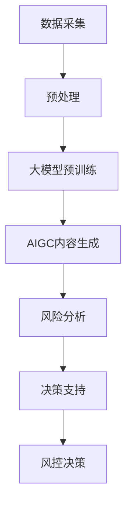

                 

# AIGC助力智能金融风控

## 1. 背景介绍

### 1.1 问题由来

随着金融科技的快速发展，金融市场日趋复杂化、数字化和智能化。智能风控系统成为金融机构在风险管理中的重要工具，不仅能提升风险管理效率，还能显著降低人力和运营成本。传统风控系统多依赖规则和经验，往往难以应对快速变化的市场环境。而AI技术，尤其是大模型与AIGC（人工智能生成内容）的结合，为智能风控系统注入了新活力。

### 1.2 问题核心关键点

AIGC技术在智能风控中的应用，主要体现在数据处理、风险分析与决策支持三个方面：

- **数据处理**：AIGC技术可以自动化生成海量高质量数据，为风控模型提供更丰富、更多元的数据来源。
- **风险分析**：通过预训练语言模型进行情感分析、舆情监控等，从文本中挖掘出深层次风险信息。
- **决策支持**：生成基于规则和逻辑的智能决策报告，辅助风控人员做出更精准的决策。

### 1.3 问题研究意义

AIGC技术在智能风控中的应用，具有以下几方面的重要意义：

- **提升风控效率**：自动化数据处理和风险分析，大大提升风控系统的处理速度和响应速度。
- **降低成本**：减少对人工和规则的依赖，降低了运营成本和错误率。
- **增强决策支持**：生成基于大模型的智能决策报告，提供精准的决策依据。
- **拓展应用边界**：拓展风控系统到更多复杂、细微的场景，如信用评估、反欺诈等。

## 2. 核心概念与联系

### 2.1 核心概念概述

为更好地理解AIGC技术在智能风控中的应用，本节将介绍几个关键概念：

- **人工智能生成内容（AIGC）**：利用深度学习和自然语言处理技术，自动生成文本、图像、音频等多种形式的智能内容，辅助决策支持。
- **大语言模型（Large Language Model, LLM）**：通过海量无标签文本数据预训练得到的语言模型，具备强大的语言理解与生成能力。
- **预训练-微调（Pre-training & Fine-tuning）**：在大规模无标签数据上预训练模型，再在有标签数据上微调模型，以适应特定任务。
- **自监督学习（Self-supervised Learning）**：利用大规模未标注数据进行训练，无需标注信息即可学习到丰富的特征表示。
- **对抗训练（Adversarial Training）**：通过在模型输入中加入对抗样本，增强模型的鲁棒性和泛化能力。
- **知识图谱（Knowledge Graph）**：基于实体与关系构建的图谱，为风控系统提供结构化知识辅助决策。

这些概念之间存在紧密的联系，通过AIGC技术，我们可以从海量数据中自动生成高质量的内容，再利用大语言模型进行预训练和微调，从文本中挖掘出更深入的风险信息，并结合知识图谱进行多维度分析，从而构建智能风控系统。

### 2.2 核心概念原理和架构的 Mermaid 流程图(Mermaid 流程节点中不要有括号、逗号等特殊字符)



这个流程图展示了大模型、AIGC和智能风控系统之间的联系和互动：

1. **数据采集**：从多种数据源获取原始数据。
2. **数据预处理**：对数据进行清洗、去重、标注等预处理，确保数据质量。
3. **大模型预训练**：在无标签数据上进行预训练，学习语言和知识表示。
4. **AIGC内容生成**：自动生成海量高质量文本、图像等数据。
5. **风险分析**：利用大模型进行情感分析、舆情监控等，提取风险信息。
6. **决策支持**：基于知识图谱和多维度分析结果，生成决策支持报告。
7. **风控决策**：结合业务规则和智能报告，做出风控决策。

## 3. 核心算法原理 & 具体操作步骤
### 3.1 算法原理概述

AIGC技术在智能风控中的应用，主要基于预训练语言模型和自监督学习范式。其核心思想是：通过大量无标签文本数据进行预训练，学习到丰富的语言表示和知识表示，再通过自监督学习生成高质量的内容，并结合大模型的语言理解和生成能力，从文本中挖掘出深层次的风险信息。

具体来说，AIGC技术在智能风控中的应用主要包括以下几个关键步骤：

1. **数据采集与预处理**：从多个数据源获取原始数据，并进行清洗、标注等预处理。
2. **大模型预训练**：在大规模无标签文本数据上进行预训练，学习通用语言表示。
3. **AIGC内容生成**：利用预训练模型，自动生成高质量的文本、图像等多模态数据。
4. **风险分析**：对生成的内容进行情感分析、舆情监控等，提取风险信息。
5. **决策支持**：基于知识图谱和多维度分析结果，生成智能决策报告。
6. **风控决策**：结合业务规则和智能报告，做出精准的风险控制决策。

### 3.2 算法步骤详解

#### 3.2.1 数据采集与预处理

1. **数据来源**：包括但不限于金融新闻、社交媒体、客户反馈等。
2. **数据清洗**：去除无关信息、格式转换、去重等预处理步骤。
3. **数据标注**：对部分数据进行标签标注，用于后续训练和评估。

#### 3.2.2 大模型预训练

1. **模型选择**：选择适合的大模型，如GPT、BERT等。
2. **预训练任务**：设计自监督学习任务，如掩码语言模型、对抗训练等。
3. **预训练步骤**：在无标签文本数据上进行预训练，学习语言表示。

#### 3.2.3 AIGC内容生成

1. **模型训练**：在预训练模型基础上，进行自监督训练，学习生成高质量文本、图像等。
2. **内容生成**：生成与风险事件相关的文本、图像等。
3. **数据增强**：对生成内容进行增强，确保多样性和代表性。

#### 3.2.4 风险分析

1. **情感分析**：对生成文本进行情感分析，判断其情感倾向。
2. **舆情监控**：监控社交媒体、新闻等文本，提取舆情信息。
3. **风险评估**：结合风险评分模型，评估风险等级。

#### 3.2.5 决策支持

1. **知识图谱构建**：构建金融领域知识图谱，存储实体与关系信息。
2. **多维度分析**：结合生成内容、风险评估结果，进行多维度分析。
3. **智能报告生成**：利用大模型生成决策支持报告。

#### 3.2.6 风控决策

1. **规则融合**：将智能报告与业务规则融合，形成风控决策依据。
2. **决策执行**：根据决策依据，进行风险控制。

### 3.3 算法优缺点

**优点**：

- **效率提升**：自动生成高质量数据，减少数据采集和标注成本。
- **鲁棒性增强**：利用大模型增强泛化能力，提高风险评估的准确性。
- **决策支持**：生成智能决策报告，辅助人工决策。

**缺点**：

- **数据依赖**：生成内容的质量依赖于数据质量。
- **模型复杂**：需要复杂的大模型和生成模型，对计算资源需求高。
- **解释性不足**：生成内容的生成过程较为黑盒，难以解释。

### 3.4 算法应用领域

AIGC技术在智能风控中的应用，主要涵盖以下几个领域：

- **信用评估**：利用生成内容进行信用评分和预测。
- **反欺诈检测**：生成与欺诈相关的文本、图像等，辅助检测和分析。
- **客户行为分析**：生成客户行为数据，进行精准画像。
- **舆情监控**：监控社交媒体、新闻等，提取舆情信息，辅助决策。

## 4. 数学模型和公式 & 详细讲解 & 举例说明

### 4.1 数学模型构建

在智能风控系统中，常用的数学模型包括：

- **情感分析模型**：用于文本情感倾向的分类，常用的模型有BERT、XLNet等。
- **舆情监控模型**：用于提取舆情信息，常用的模型有LSTM、GRU等。
- **风险评估模型**：用于风险等级评估，常用的模型有决策树、线性回归等。
- **决策支持模型**：用于生成智能决策报告，常用的模型有GAN、Seq2Seq等。

### 4.2 公式推导过程

以情感分析为例，假设生成文本序列为 $x=\{x_1, x_2, \dots, x_n\}$，其中 $x_i$ 为第 $i$ 个词的表示向量，情感标签为 $y$。情感分析的目标是学习模型 $f$，使其满足 $f(x) = y$。

常用的模型包括BERT、XLNet等，其原理均为自监督学习。以下以BERT模型为例，介绍其情感分析的数学模型构建过程：

1. **输入表示**：将文本序列 $x$ 转换为BERT模型输入，得到序列表示 $\mathbf{H}=\{h_1, h_2, \dots, h_n\}$，其中 $h_i$ 为第 $i$ 个词的BERT表示。
2. **目标函数**：设计分类目标函数，常用的有交叉熵损失函数 $L$，计算公式为：

$$
L = -\frac{1}{N}\sum_{i=1}^N \sum_{j=1}^C y_j \log \hat{y}_j
$$

其中 $N$ 为样本数，$C$ 为情感类别数，$y_j$ 为真实标签，$\hat{y}_j$ 为模型预测的概率分布。
3. **模型训练**：在无标签数据上进行预训练，学习语言表示。
4. **情感分类**：在标注数据上进行微调，学习情感分类能力。

### 4.3 案例分析与讲解

以一个简单的情感分析案例为例，假设输入文本序列为“我非常不满意这个产品，质量很差”，模型需要判断其情感倾向。

1. **输入表示**：将文本序列转换为BERT模型输入，得到序列表示 $\mathbf{H}$。
2. **目标函数**：设计交叉熵损失函数 $L$，计算模型预测概率分布 $\hat{y}$。
3. **模型训练**：在标注数据上进行微调，学习情感分类能力。
4. **预测结果**：模型输出情感倾向，结果为“negative”。

通过以上过程，模型能够自动从文本中提取情感信息，并辅助风控决策。

## 5. 项目实践：代码实例和详细解释说明

### 5.1 开发环境搭建

进行AIGC在智能风控中的应用开发，需要以下环境：

1. **Python**：选择Python作为开发语言，便于调用深度学习库和数据处理库。
2. **深度学习框架**：选择PyTorch或TensorFlow等框架，便于构建模型和进行深度学习。
3. **NLP库**：选择NLTK、spaCy等库，便于进行文本处理和分析。
4. **知识图谱库**：选择RDFlib、Neo4j等库，便于构建和查询知识图谱。

完成上述环境配置后，即可开始开发。

### 5.2 源代码详细实现

以一个简单的情感分析系统为例，介绍代码实现。

```python
import torch
import torch.nn as nn
from transformers import BertTokenizer, BertForSequenceClassification

class SentimentClassifier(nn.Module):
    def __init__(self):
        super(SentimentClassifier, self).__init__()
        self.bert = BertForSequenceClassification.from_pretrained('bert-base-uncased', num_labels=2)
        self.dropout = nn.Dropout(0.1)
        self.fc = nn.Linear(768, 2)
        self.activation = nn.Tanh()
        self.softmax = nn.Softmax(dim=1)

    def forward(self, input_ids, attention_mask):
        features = self.bert(input_ids=input_ids, attention_mask=attention_mask)
        pooled_output = features.pooler_output
        pooled_output = self.dropout(pooled_output)
        output = self.fc(pooled_output)
        output = self.activation(output)
        logits = self.softmax(output)
        return logits

# 训练模型
device = torch.device('cuda' if torch.cuda.is_available() else 'cpu')
model = SentimentClassifier().to(device)
optimizer = torch.optim.Adam(model.parameters(), lr=2e-5)
tokenizer = BertTokenizer.from_pretrained('bert-base-uncased')

# 数据预处理
train_dataset = ...
train_loader = DataLoader(train_dataset, batch_size=16, shuffle=True)

# 模型训练
for epoch in range(epochs):
    for batch in train_loader:
        input_ids = batch['input_ids'].to(device)
        attention_mask = batch['attention_mask'].to(device)
        labels = batch['labels'].to(device)
        optimizer.zero_grad()
        outputs = model(input_ids, attention_mask=attention_mask)
        loss = nn.CrossEntropyLoss()(outputs, labels)
        loss.backward()
        optimizer.step()

# 模型评估
test_dataset = ...
test_loader = DataLoader(test_dataset, batch_size=16, shuffle=False)
evaluation = ...
```

### 5.3 代码解读与分析

以上代码实现了基于BERT模型的情感分析系统，具体步骤如下：

1. **模型定义**：定义了一个基于BERT的情感分类模型，包括BERT模型、Dropout层、全连接层等。
2. **训练过程**：在训练集上使用Adam优化器进行梯度下降，计算交叉熵损失，更新模型参数。
3. **评估过程**：在测试集上评估模型性能，输出预测结果。

## 6. 实际应用场景

### 6.1 智能舆情监控

金融机构可以利用AIGC技术，实时监控社交媒体、新闻等文本数据，及时发现舆情变化，采取相应的风险控制措施。例如，在市场出现负面消息时，及时调整投资策略，避免损失。

### 6.2 客户行为分析

AIGC技术可以自动生成客户行为数据，进行精准画像，帮助金融机构识别潜在风险客户，提高风险管理水平。例如，分析客户的交易行为、信用记录等，预测其还款能力。

### 6.3 反欺诈检测

利用AIGC技术生成与欺诈相关的文本、图像等，辅助检测和分析。例如，生成虚假交易记录、仿冒证件等，辅助识别欺诈行为。

### 6.4 未来应用展望

随着AIGC技术的发展，其在智能风控中的应用将更加广泛和深入。未来，可以进一步拓展到多模态数据生成、知识图谱融合等方向，构建更加全面、精准的风控系统。

## 7. 工具和资源推荐

### 7.1 学习资源推荐

1. **《自然语言处理综论》**：介绍自然语言处理的基本概念和常用算法，是入门NLP的经典教材。
2. **《深度学习与神经网络》**：涵盖深度学习的基本原理和应用场景，是学习深度学习的必备资料。
3. **HuggingFace官方文档**：提供各类预训练模型的API接口和使用方法，方便快速上手开发。
4. **GitHub开源项目**：查找和借鉴优秀的开源项目，快速构建智能风控系统。

### 7.2 开发工具推荐

1. **PyTorch**：支持动态图和静态图，方便构建和调试深度学习模型。
2. **TensorFlow**：生产部署方便，支持分布式计算，适合大规模应用。
3. **spaCy**：提供高效的文本处理工具，方便进行分词、命名实体识别等任务。
4. **RDFlib**：支持构建和查询知识图谱，方便进行多维度分析。

### 7.3 相关论文推荐

1. **《基于BERT的情感分析研究》**：介绍BERT模型在情感分析中的应用，是情感分析的经典论文。
2. **《知识图谱在金融风控中的应用》**：介绍知识图谱在金融风控中的应用，是知识图谱应用的经典案例。
3. **《基于AIGC的智能风控系统设计》**：介绍AIGC技术在智能风控中的应用，是AIGC应用的经典案例。

## 8. 总结：未来发展趋势与挑战

### 8.1 研究成果总结

AIGC技术在智能风控中的应用，取得了显著的成效，显著提升了风控系统的效率和效果。主要成果包括：

- **提升数据采集和处理效率**：自动生成海量高质量数据，减少数据采集和标注成本。
- **增强风险评估和决策支持**：利用大模型增强泛化能力，生成智能决策报告。
- **降低运营成本**：减少对人工和规则的依赖，降低运营成本。

### 8.2 未来发展趋势

未来，AIGC技术在智能风控中的应用将进一步拓展，主要趋势包括：

1. **多模态数据融合**：结合文本、图像、语音等多种数据，构建更加全面的风控系统。
2. **知识图谱应用**：利用知识图谱进行多维度分析，提升风控系统的智能性。
3. **自动化程度提升**：利用自动化技术，提高数据处理和风控决策的自动化水平。
4. **泛化能力增强**：通过深度学习和大模型技术，提升风控系统的泛化能力，适应更多场景。

### 8.3 面临的挑战

AIGC技术在智能风控中的应用，还面临以下挑战：

1. **数据依赖**：生成内容的质量依赖于数据质量，需要确保数据源的可靠性和多样性。
2. **模型复杂**：需要复杂的大模型和生成模型，对计算资源需求高。
3. **解释性不足**：生成内容的生成过程较为黑盒，难以解释。

### 8.4 研究展望

未来，需要进一步研究以下方向：

1. **数据增强技术**：利用生成对抗网络等技术，增强生成内容的真实性和多样性。
2. **模型优化技术**：开发更加参数高效的模型，提升模型效率和效果。
3. **智能决策框架**：构建基于AI的决策框架，提升风控系统的自动化和智能化水平。

## 9. 附录：常见问题与解答

### Q1: AIGC在智能风控中的应用是否依赖于数据质量？

A: 是的，AIGC技术生成内容的质量依赖于数据质量。需要确保数据源的可靠性和多样性，才能生成高质量的文本、图像等数据。

### Q2: 如何提高AIGC生成的内容的真实性？

A: 可以利用生成对抗网络（GAN）等技术，增强生成内容的真实性。GAN可以生成与真实数据相似的虚假数据，通过优化生成模型和判别模型，提高生成内容的真实性。

### Q3: 如何提高AIGC生成内容的解释性？

A: 可以利用可解释性技术，如LIME、SHAP等，生成生成内容的解释性报告，帮助理解生成内容的生成过程和推理逻辑。

### Q4: 如何构建多模态风控系统？

A: 可以结合文本、图像、语音等多种数据，构建多模态风控系统。例如，利用图像识别技术识别虚假证件，利用语音识别技术分析客户情绪，提升风控系统的全面性。

### Q5: 如何应对AIGC技术的应用挑战？

A: 需要综合利用多种技术手段，如数据增强、模型优化、智能决策框架等，提高AIGC技术在智能风控中的应用效果。同时，需要加强数据管理和模型解释性，确保生成内容的可靠性和可解释性。

通过以上探讨，可以看到AIGC技术在智能风控中的应用具有广阔的前景和巨大的潜力。未来，随着技术的发展和应用的深入，AIGC技术必将在金融风险管理中发挥越来越重要的作用，为金融机构带来更高的风控效率和更强的决策支持能力。

