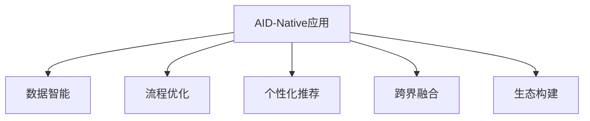

                 

## 1. 背景介绍

### 1.1 问题由来

在过去几十年中，人工智能（AI）技术在各行各业的应用不断深化，推动了产业的数字化转型和升级。然而，随着AI技术的迅猛发展，传统企业面临的商业模式和技术挑战也日益复杂。在信息化高度发达的今天，如何借助AI技术实现商业模式的创新，成为企业转型升级的关键问题。

AI-Native应用作为新一代的AI技术应用范式，具有更强的业务适配能力和更高的商业价值。它不仅能够深入挖掘数据价值，提升业务效率，还能通过新商业模式的探索，打开更多盈利空间，推动企业实现高质量发展。本文将围绕AI-Native应用的商业模式创新，探讨其在商业实践中的实现路径和应用场景，为企业提供切实可行的借鉴和启示。

### 1.2 问题核心关键点

AI-Native应用的商业模式创新，聚焦于如何利用AI技术的核心能力，重构传统企业的业务流程、生产模式和价值链，以适应数字化时代的新需求。这一过程中，需要深入理解AI技术的应用原理和商业逻辑，同时结合企业自身的发展战略，设计出符合市场需求的商业模式，实现技术价值和商业价值的双重提升。

AI-Native应用的关键要素包括：
1. **数据驱动决策**：利用AI技术进行数据分析和预测，支持企业决策制定。
2. **流程自动化**：通过AI技术实现业务流程的自动化和优化，提高效率。
3. **个性化服务**：运用AI技术提供精准的个性化产品和服务，提升用户体验。
4. **跨界融合**：探索AI技术与各行业的深度融合，开辟新的业务机会。
5. **生态构建**：构建AI技术生态系统，吸引更多合作伙伴和用户，实现共赢。

## 2. 核心概念与联系

### 2.1 核心概念概述

为了更好地理解AI-Native应用的商业模式创新，我们将首先介绍几个关键概念：

- **AI-Native应用**：指基于AI技术进行设计、开发和运行的应用系统，强调AI技术的原生融合和业务适配。
- **数据智能**：指利用数据进行智能分析，提供决策支持的能力。
- **流程优化**：指通过AI技术优化业务流程，提高效率和质量的过程。
- **个性化推荐**：指利用AI技术提供个性化的产品和服务，提升用户体验。
- **跨界融合**：指AI技术与不同行业的深度融合，创造出新的商业模式和业务机会。
- **生态构建**：指构建AI技术的生态系统，吸引更多的合作伙伴和用户，实现共赢。

这些概念之间的逻辑关系可以通过以下Mermaid流程图来展示：



这个流程图展示了AI-Native应用的几个核心能力，以及它们之间的相互关联和作用：

1. 通过数据智能，AI-Native应用能够提供精确的数据分析，支持企业决策。
2. 流程优化能够通过AI技术提高业务效率和质量。
3. 个性化推荐能够提升用户体验和满意度。
4. 跨界融合可以开辟新的业务机会和增长点。
5. 生态构建能够吸引更多合作伙伴和用户，实现共生共荣。

## 3. 核心算法原理 & 具体操作步骤
### 3.1 算法原理概述

AI-Native应用的商业模式创新，本质上是利用AI技术进行业务流程再造和新商业模式的探索。其核心算法原理包括数据智能、流程自动化和个性化推荐等，这些算法通过优化和融合，支持企业实现商业模式创新。

- **数据智能算法**：利用机器学习和深度学习技术，对企业内外数据进行深度分析和预测，提供决策支持。
- **流程自动化算法**：通过机器人流程自动化（RPA）和自然语言处理（NLP）等技术，实现业务流程的自动化和优化。
- **个性化推荐算法**：运用推荐系统和协同过滤等技术，为用户提供个性化的产品和服务。

这些算法通过不断迭代和优化，提升AI-Native应用的商业价值和用户体验。

### 3.2 算法步骤详解

AI-Native应用的商业模式创新，主要包括以下几个关键步骤：

**Step 1: 需求分析与数据准备**

1. **需求分析**：对企业内部和外部的需求进行深入分析，确定业务目标和挑战。
2. **数据准备**：收集和整理相关数据，确保数据质量和安全。

**Step 2: 技术选型与模型构建**

1. **技术选型**：根据需求选择合适的AI技术和工具，如TensorFlow、PyTorch、Transformers等。
2. **模型构建**：基于选定的技术构建相应的AI模型，如深度学习模型、推荐系统等。

**Step 3: 业务适配与流程优化**

1. **业务适配**：将AI模型与现有业务流程进行适配，确保其能够支持业务需求。
2. **流程优化**：利用AI技术对业务流程进行自动化和优化，提升效率和质量。

**Step 4: 个性化服务与用户体验提升**

1. **个性化服务**：利用AI技术提供个性化的产品和服务，提升用户体验。
2. **用户体验提升**：通过数据分析和用户反馈，持续优化产品和服务。

**Step 5: 跨界融合与新业务探索**

1. **跨界融合**：探索AI技术与各行业的深度融合，创造新的业务机会和增长点。
2. **新业务探索**：基于AI技术开发新的业务模式和产品，开拓市场。

**Step 6: 生态构建与合作共赢**

1. **生态构建**：构建AI技术的生态系统，吸引更多合作伙伴和用户。
2. **合作共赢**：通过合作和开放，实现各方共赢，推动企业发展。

### 3.3 算法优缺点

AI-Native应用的商业模式创新，具有以下优点：
1. **高效率**：利用AI技术提升业务效率和质量。
2. **高精度**：通过数据分析和预测，提高决策的科学性和准确性。
3. **个性化**：提供个性化的产品和服务，提升用户体验。
4. **跨界融合**：开拓新的业务机会和市场。
5. **生态构建**：吸引更多合作伙伴和用户，实现共赢。

同时，这一方法也存在一些局限性：
1. **数据依赖**：对高质量、大规模数据的依赖较大。
2. **技术复杂**：需要高水平的技术能力和团队支持。
3. **成本高**：初期投入较大，包括硬件和软件成本。
4. **风险管理**：需要有效的风险管理和数据隐私保护机制。

尽管如此，AI-Native应用的商业模式创新仍是大势所趋，对于推动企业数字化转型具有重要意义。

### 3.4 算法应用领域

AI-Native应用的商业模式创新，已经在多个领域得到了广泛应用，例如：

- **金融科技**：利用数据智能和流程自动化，提升金融服务的效率和安全性。
- **电子商务**：通过个性化推荐和跨界融合，提升用户体验和销售转化率。
- **智能制造**：结合流程优化和跨界融合，实现生产自动化和智能化。
- **健康医疗**：运用数据智能和个性化服务，提供精准的医疗服务。
- **智能交通**：结合数据智能和流程优化，实现交通管理的智能化。

除了这些典型应用外，AI-Native应用的商业模式创新还在更多行业领域得到应用，如智能家居、智慧城市、智慧教育等，为各行各业带来了全新的发展机遇。

## 4. 数学模型和公式 & 详细讲解  
### 4.1 数学模型构建

本节将使用数学语言对AI-Native应用的商业模式创新的主要算法进行更严格的刻画。

假设企业A希望通过AI-Native应用实现业务模式的创新，其主要算法包括以下几个关键部分：

- **数据智能算法**：记为 $M_{DIA}$，用于数据分析和预测。
- **流程优化算法**：记为 $M_{POA}$，用于业务流程的自动化和优化。
- **个性化推荐算法**：记为 $M_{PAR}$，用于提供个性化的产品和服务。

数据智能算法的输入为 $X$，输出为 $Y$，其损失函数为 $L_{DIA}$。流程优化算法的输入为 $X$，输出为 $Y$，其损失函数为 $L_{POA}$。个性化推荐算法的输入为 $X$ 和 $U$，输出为 $Y$，其损失函数为 $L_{PAR}$。

### 4.2 公式推导过程

以下我们以金融科技领域的信用评分为例，推导数据智能算法和个性化推荐算法的公式。

假设信用评分模型 $M_{DIA}$ 接收客户申请信息 $X$，输出信用评分 $Y$，损失函数为交叉熵损失：

$$
L_{DIA}(Y,\hat{Y})=-\sum_{i=1}^n (y_i\log \hat{y}_i+(1-y_i)\log(1-\hat{y}_i))
$$

其中，$y_i$ 为真实标签，$\hat{y}_i$ 为模型预测结果。

个性化推荐模型 $M_{PAR}$ 接收客户请求 $X$ 和用户兴趣 $U$，输出推荐结果 $Y$，损失函数为均方误差损失：

$$
L_{PAR}(Y,\hat{Y})=\frac{1}{n}\sum_{i=1}^n (y_i-\hat{y}_i)^2
$$

其中，$y_i$ 为真实推荐结果，$\hat{y}_i$ 为模型预测结果。

## 5. 项目实践：代码实例和详细解释说明
### 5.1 开发环境搭建

在进行AI-Native应用开发前，我们需要准备好开发环境。以下是使用Python进行TensorFlow开发的环境配置流程：

1. 安装Anaconda：从官网下载并安装Anaconda，用于创建独立的Python环境。

2. 创建并激活虚拟环境：
```bash
conda create -n tf-env python=3.8 
conda activate tf-env
```

3. 安装TensorFlow：根据CUDA版本，从官网获取对应的安装命令。例如：
```bash
conda install tensorflow
```

4. 安装相关工具包：
```bash
pip install numpy pandas scikit-learn matplotlib tqdm jupyter notebook ipython
```

完成上述步骤后，即可在`tf-env`环境中开始AI-Native应用的开发。

### 5.2 源代码详细实现

这里我们以金融科技领域的信用评分为例，展示TensorFlow进行AI-Native应用的开发。

首先，定义数据智能算法的输入和输出：

```python
import tensorflow as tf
from tensorflow.keras import layers

# 定义输入和输出
input_dim = 10
output_dim = 1

# 定义模型
model = tf.keras.Sequential([
    layers.Dense(32, activation='relu', input_shape=(input_dim,)),
    layers.Dense(16, activation='relu'),
    layers.Dense(output_dim, activation='sigmoid')
])
```

接着，定义模型损失函数和优化器：

```python
# 定义损失函数
loss_fn = tf.keras.losses.BinaryCrossentropy()

# 定义优化器
optimizer = tf.keras.optimizers.Adam(learning_rate=0.001)
```

然后，定义模型训练函数：

```python
# 定义训练函数
def train_epoch(model, data, batch_size):
    # 将数据转换为TensorFlow张量
    inputs = tf.convert_to_tensor(data['inputs'], dtype=tf.float32)
    labels = tf.convert_to_tensor(data['labels'], dtype=tf.float32)
    
    # 前向传播
    predictions = model(inputs)
    
    # 计算损失
    loss = loss_fn(labels, predictions)
    
    # 反向传播
    gradients = tf.gradients(loss, model.trainable_variables)
    optimizer.apply_gradients(zip(gradients, model.trainable_variables))
    
    return loss.numpy().mean()
```

最后，启动模型训练流程：

```python
# 训练模型
epochs = 10
batch_size = 32

for epoch in range(epochs):
    loss = train_epoch(model, train_data, batch_size)
    print(f"Epoch {epoch+1}, loss: {loss:.3f}")
```

以上就是一个完整的金融科技信用评分AI-Native应用的开发流程。可以看到，通过TensorFlow，我们可以非常方便地实现数据智能算法的开发和训练。

### 5.3 代码解读与分析

让我们再详细解读一下关键代码的实现细节：

**模型定义**：
- `layers.Dense` 层：定义了三个全连接层，第一个隐藏层32个神经元，使用ReLU激活函数；第二个隐藏层16个神经元，使用ReLU激活函数；输出层1个神经元，使用Sigmoid激活函数，用于二分类任务。

**损失函数**：
- `tf.keras.losses.BinaryCrossentropy()`：定义了二分类任务的损失函数，即交叉熵损失。

**优化器**：
- `tf.keras.optimizers.Adam(learning_rate=0.001)`：定义了Adam优化器，学习率为0.001。

**训练函数**：
- `train_epoch`函数：定义了模型的训练过程，首先通过`tf.convert_to_tensor`将输入数据转换为TensorFlow张量，然后前向传播计算预测结果，计算损失，反向传播更新模型参数，最后返回损失的均值。

**训练流程**：
- 在每个epoch中，通过调用`train_epoch`函数训练模型，输出每个epoch的损失。

可以看到，TensorFlow提供了丰富的API和工具，可以方便快捷地实现AI-Native应用的开发和训练。开发者可以将更多精力放在模型设计和优化上，而不必过多关注底层实现细节。

## 6. 实际应用场景
### 6.1 智能金融

AI-Native应用的商业模式创新在智能金融领域具有广泛应用，通过数据智能和流程自动化，提升了金融服务的效率和安全性。

具体而言，可以构建基于AI-Native应用的智能风控系统，利用数据智能算法进行客户信用评分，自动审批贷款和信用卡申请。通过分析历史交易数据和行为模式，实时监控交易异常，及时预警风险。此外，还可以开发基于AI-Native应用的智能投顾系统，通过个性化推荐算法，为客户提供定制化的投资建议。

### 6.2 智能制造

AI-Native应用的商业模式创新在智能制造领域也有重要应用，通过流程优化和跨界融合，实现了生产自动化和智能化。

在智能制造中，可以通过AI-Native应用构建基于数据智能的供应链管理系统，利用流程优化算法进行需求预测和库存管理，优化供应链运作。通过跨界融合，将AI技术与物联网（IoT）、云计算等技术结合，实现设备的智能维护和远程监控，提高生产效率和设备利用率。

### 6.3 智慧健康

AI-Native应用的商业模式创新在智慧健康领域也有广泛应用，通过数据智能和个性化服务，提供了精准的医疗服务。

在智慧健康领域，可以通过AI-Native应用构建基于数据智能的诊断和治疗系统，利用流程优化算法进行疾病预测和诊断，提供个性化的治疗方案。通过个性化推荐算法，为患者提供精准的健康管理服务，提升用户体验和满意度。

### 6.4 未来应用展望

随着AI-Native应用的不断发展和成熟，其应用领域将进一步扩展，带来更多的商业机遇和发展空间。

未来，AI-Native应用将在更多行业领域得到应用，如智能家居、智慧城市、智能交通等。通过数据智能、流程自动化和个性化推荐等技术，AI-Native应用将为各行各业带来全新的发展机遇，推动经济社会的高质量发展。

## 7. 工具和资源推荐
### 7.1 学习资源推荐

为了帮助开发者系统掌握AI-Native应用的商业模式创新的理论基础和实践技巧，这里推荐一些优质的学习资源：

1. **《TensorFlow官方文档》**：TensorFlow官方文档提供了全面的API和工具介绍，是学习AI-Native应用的必备资料。
2. **《深度学习》**：斯坦福大学Andrew Ng教授的经典课程，涵盖了深度学习的基本概念和应用方法。
3. **《AI-Native应用设计与实现》**：由AI领域的知名专家撰写，介绍了AI-Native应用的商业设计和实现方法。
4. **Kaggle**：Kaggle提供了丰富的AI竞赛和数据集，可以通过实际项目提升技术能力和商业思维。

通过对这些资源的学习实践，相信你一定能够快速掌握AI-Native应用的商业模式创新的精髓，并用于解决实际的商业问题。

### 7.2 开发工具推荐

高效的开发离不开优秀的工具支持。以下是几款用于AI-Native应用开发的常用工具：

1. **Jupyter Notebook**：用于编写和执行Python代码，支持数据可视化、代码调试等功能。
2. **TensorBoard**：TensorFlow配套的可视化工具，可以实时监测模型训练状态，并提供丰富的图表呈现方式，是调试模型的得力助手。
3. **Keras**：基于TensorFlow和Theano等库开发的高级API，提供了便捷的模型构建和训练工具。
4. **PyTorch**：由Facebook开发的深度学习框架，灵活高效，适合进行复杂模型开发。
5. **Scikit-learn**：Python的机器学习库，提供了丰富的算法和工具，支持数据处理和特征工程。

合理利用这些工具，可以显著提升AI-Native应用的开发效率，加快创新迭代的步伐。

### 7.3 相关论文推荐

AI-Native应用的商业模式创新的研究源于学界的持续研究。以下是几篇奠基性的相关论文，推荐阅读：

1. **《TensorFlow: A System for Large-Scale Machine Learning》**：TensorFlow的作者团队撰写的论文，介绍了TensorFlow的设计思路和实现原理。
2. **《Adaptive Computation Time: A Machine Learning Algorithm for Online Modeling》**：提出AdaCT，一种基于自适应计算时间的模型训练算法，适用于大规模数据集和动态学习率的场景。
3. **《Intelligent Manufacturing: From Big Data to Smart Manufacturing》**：介绍了智能制造的概念、技术和应用，探讨了AI-Native应用在智能制造中的应用前景。
4. **《Healthcare AI: Revolutionizing Medicine and Healthcare》**：探讨了AI技术在医疗健康领域的广泛应用，包括数据智能、个性化服务等方面。
5. **《The Evolution of AI-Native Applications in the Digital Economy》**：分析了AI-Native应用在数字经济中的发展历程和未来趋势，提供了丰富的案例和实践经验。

这些论文代表了大语言模型微调技术的发展脉络。通过学习这些前沿成果，可以帮助研究者把握学科前进方向，激发更多的创新灵感。

## 8. 总结：未来发展趋势与挑战
### 8.1 研究成果总结

本文对AI-Native应用的商业模式创新的相关内容进行了全面系统的介绍。首先阐述了AI-Native应用的商业模式创新的背景和意义，明确了其在商业实践中的实现路径和应用场景。其次，从原理到实践，详细讲解了数据智能、流程优化和个性化推荐等算法的构建和训练方法，提供了完整的代码实例。最后，文章探讨了AI-Native应用在智能金融、智能制造、智慧健康等领域的广泛应用，提供了工具和资源推荐。

通过本文的系统梳理，可以看到，AI-Native应用的商业模式创新正在成为企业数字化转型的重要方向，其应用范围和价值不断拓展。未来，伴随AI技术的不断演进和应用深入，AI-Native应用必将在更多行业领域得到推广和应用，为经济社会的高质量发展注入新的动力。

### 8.2 未来发展趋势

展望未来，AI-Native应用的商业模式创新将呈现以下几个发展趋势：

1. **技术融合加速**：AI-Native应用将与大数据、云计算、物联网等技术深度融合，推动各行业的数字化转型和智能化升级。
2. **应用场景丰富**：AI-Native应用将拓展到更多行业和领域，带来新的商业机会和发展空间。
3. **用户体验提升**：通过数据智能和个性化推荐，提供更好的用户体验和个性化服务。
4. **生态系统构建**：构建开放的AI技术生态系统，吸引更多的合作伙伴和用户，实现共生共荣。
5. **行业标准制定**：制定AI-Native应用的行业标准和规范，推动AI技术的规范化应用。

这些趋势凸显了AI-Native应用广阔的发展前景，也为企业在数字化转型中提供了重要的方向指引。

### 8.3 面临的挑战

尽管AI-Native应用的商业模式创新具有广阔的发展前景，但在迈向更加智能化、普适化应用的过程中，它仍面临着诸多挑战：

1. **数据隐私和安全**：在数据智能和个性化推荐中，如何保护用户隐私和数据安全，是亟待解决的问题。
2. **技术复杂度高**：AI-Native应用的技术实现需要高水平的技术能力和团队支持，初期投入较大。
3. **技术落地难**：如何将AI技术有效地融入现有业务流程，实现商业化落地，还需要更多实践和探索。
4. **成本控制**：需要有效控制AI技术的实施成本，确保企业的经济效益。
5. **伦理和道德**：AI-Native应用在带来商业价值的同时，可能涉及伦理和道德问题，需要制定相应的规范和标准。

这些挑战需要在技术、管理和伦理等方面进行全面考虑，才能实现AI-Native应用的可持续发展。

### 8.4 研究展望

面向未来，AI-Native应用的商业模式创新需要从以下几个方面寻求新的突破：

1. **技术创新**：开发更加高效、易用的AI-Native应用框架和工具，降低技术实现的复杂度。
2. **数据智能优化**：优化数据智能算法，提升模型精度和泛化能力，降低对标注数据的依赖。
3. **个性化服务深化**：探索更多个性化服务的实现方法，提升用户体验和满意度。
4. **跨界融合拓展**：拓展AI技术与更多行业的深度融合，开拓新的业务机会。
5. **生态系统构建**：构建更加开放、协作的AI技术生态系统，吸引更多的合作伙伴和用户。

这些方向的研究和探索，将推动AI-Native应用的商业模式创新进入新的阶段，为各行各业带来更广泛的应用和更高的价值。

## 9. 附录：常见问题与解答

**Q1: 什么是AI-Native应用？**

A: AI-Native应用是一种基于AI技术进行设计、开发和运行的应用系统，强调AI技术的原生融合和业务适配。与AI-As-a-Service（AIaaS）不同，AI-Native应用将AI技术深入融合到业务流程中，实现智能化升级。

**Q2: AI-Native应用有哪些核心能力？**

A: AI-Native应用的核心能力包括数据智能、流程优化、个性化推荐、跨界融合和生态构建。通过这些能力，AI-Native应用能够在各行业中实现业务流程的再造和新商业模式的探索。

**Q3: AI-Native应用面临哪些挑战？**

A: AI-Native应用面临的主要挑战包括数据隐私和安全、技术复杂度高、技术落地难、成本控制和伦理道德问题。这些挑战需要在技术、管理和伦理等方面进行全面考虑，才能实现AI-Native应用的可持续发展。

**Q4: 如何实现AI-Native应用的商业化落地？**

A: 实现AI-Native应用的商业化落地，需要从技术、业务和管理三个方面进行综合考虑：
1. **技术实现**：开发高效、易用的AI-Native应用框架和工具，降低技术实现的复杂度。
2. **业务适配**：将AI技术深度融合到现有业务流程中，实现智能化升级。
3. **管理支持**：制定相应的管理和伦理规范，确保AI-Native应用的可持续发展。

**Q5: AI-Native应用的未来发展趋势是什么？**

A: AI-Native应用的未来发展趋势包括技术融合加速、应用场景丰富、用户体验提升、生态系统构建和行业标准制定。这些趋势凸显了AI-Native应用的广阔发展前景，为企业数字化转型提供了重要的方向指引。

总之，AI-Native应用的商业模式创新是推动企业数字化转型的重要方向。通过深入理解其核心概念和算法原理，结合具体的业务场景和需求，可以在各行业中实现智能化升级和商业模式的创新，带来更多的商业机遇和发展空间。

