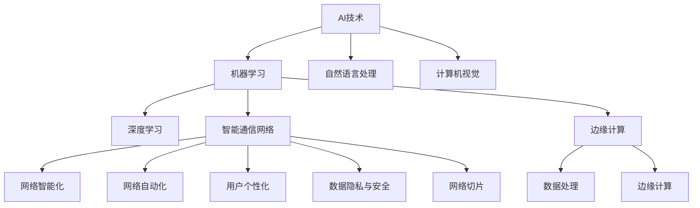

                 

## 1. 背景介绍

### 1.1 问题由来

随着信息技术的飞速发展，人工智能（AI）和5G通信技术正逐渐融合，催生智能通信网络的崛起。智能通信网络将AI技术应用于数据传输、网络优化、用户服务等方面，显著提升了网络性能和用户体验。这一新兴领域正成为全球科技巨头和创业公司竞相投入的热点，其前景广阔。

然而，AI与5G的深度融合仍面临诸多技术、产业和伦理挑战。如何更有效地将AI技术融入5G通信网络中，充分发挥各自优势，成为行业内外广泛关注的焦点。

### 1.2 问题核心关键点

AI与5G协同发展的关键点主要包括：

- 网络智能化：利用AI技术进行网络优化，提高网络运行效率和用户体验。
- 网络自动化：通过AI实现网络自动化管理，减少人为干预，提升网络稳定性。
- 用户个性化：根据用户行为和偏好，提供个性化服务，提升用户满意度。
- 数据隐私和安全：保护用户数据隐私，确保网络安全。

## 2. 核心概念与联系

### 2.1 核心概念概述

为更好地理解AI与5G协同发展的机制，本节将介绍几个关键概念：

- AI技术：包括机器学习、深度学习、自然语言处理、计算机视觉等。利用AI技术，可以从大量数据中提取知识，实现自主决策和推理。
- 5G通信技术：新一代无线通信技术，具有高速度、低延迟、大连接等特点，支持海量设备接入和多样化应用。
- 智能通信网络：将AI技术与5G通信技术结合，通过AI优化5G网络，实现智能化管理和服务。
- 边缘计算：将计算资源和数据处理能力从中心服务器迁移到网络边缘，提高数据处理速度和网络可靠性。
- 网络切片：基于软件定义网络（SDN）技术，将网络资源划分为多个虚拟网络切片，满足不同应用场景的特定需求。

这些概念之间存在紧密的联系，共同构成AI与5G协同发展的理论基础。

### 2.2 核心概念原理和架构的 Mermaid 流程图



## 3. 核心算法原理 & 具体操作步骤

### 3.1 算法原理概述

AI与5G协同发展主要基于以下几个算法原理：

- **机器学习与深度学习**：利用训练好的模型对网络数据进行预测和优化，提升网络性能。
- **自然语言处理（NLP）**：分析用户查询，提供智能响应，提升用户互动体验。
- **计算机视觉**：实时监测网络设备状态，进行图像识别和目标检测，保障网络稳定运行。
- **边缘计算**：将计算任务分散到网络边缘设备上，减少延迟，提高响应速度。
- **网络切片**：通过虚拟网络技术，根据不同应用需求分配网络资源，实现高效的网络管理。

### 3.2 算法步骤详解

#### 3.2.1 模型训练

1. **数据收集与预处理**：收集5G网络中的各种数据，包括用户流量、网络状态、设备状态等，并对数据进行清洗和预处理。
2. **模型选择与构建**：根据网络需求选择合适的AI模型，如CNN、RNN、GAN等，构建AI模型架构。
3. **模型训练与优化**：利用大数据集对模型进行训练，并使用优化算法（如SGD、Adam）对模型参数进行优化。

#### 3.2.2 网络优化与调度

1. **网络状态分析**：通过NLP和计算机视觉技术，实时分析网络状态和设备状态，识别异常情况。
2. **智能调度和优化**：利用机器学习模型对网络资源进行智能调度和优化，实现负载均衡和资源高效利用。
3. **实时反馈与调整**：将优化结果实时反馈到网络中，并根据实际情况进行动态调整。

#### 3.2.3 用户服务与个性化

1. **用户行为分析**：利用AI技术分析用户行为和偏好，提供个性化推荐和服务。
2. **智能响应与互动**：通过NLP技术，实时响应用户查询，提升用户互动体验。
3. **隐私保护与安全**：使用加密技术和隐私保护算法，确保用户数据安全和隐私。

### 3.3 算法优缺点

**优点：**

- **提升网络性能**：AI技术能够实时分析网络数据，优化网络资源分配，提升网络性能。
- **增强用户体验**：通过个性化服务和智能互动，提升用户满意度。
- **实现自动化管理**：利用AI技术实现网络自动化管理，减少人为干预，提高网络稳定性。
- **快速响应与调整**：实时监测和反馈机制，能够快速响应和调整网络状态，保障网络稳定。

**缺点：**

- **数据隐私和安全风险**：AI模型依赖大量用户数据，存在隐私泄露和数据被滥用的风险。
- **算法复杂度高**：AI模型训练和优化过程复杂，需要大量计算资源和数据集。
- **资源分配不均衡**：AI模型的应用可能造成资源分配不均衡，影响网络公平性。
- **网络延迟增加**：AI模型引入的边缘计算可能增加网络延迟，影响用户体验。

### 3.4 算法应用领域

AI与5G的协同发展涵盖了多个应用领域，包括但不限于：

- **智能运维与监控**：利用AI技术进行网络状态监测和故障诊断，实现智能运维。
- **个性化推荐与服务**：基于用户行为和偏好，提供个性化推荐和智能服务。
- **虚拟现实（VR）与增强现实（AR）**：通过5G网络传输高带宽、低延迟的AR/VR内容，提升用户体验。
- **工业互联网**：将AI技术应用于工业物联网，实现设备监控、故障预测和智能控制。
- **智慧城市**：通过5G网络传输城市运行数据，实现智能交通、智慧安防和环保监控等应用。

## 4. 数学模型和公式 & 详细讲解 & 举例说明

### 4.1 数学模型构建

AI与5G协同发展的数学模型构建主要涉及以下几个方面：

- **机器学习模型**：包括线性回归、逻辑回归、决策树、随机森林等。
- **深度学习模型**：包括卷积神经网络（CNN）、循环神经网络（RNN）、生成对抗网络（GAN）等。
- **NLP模型**：包括词袋模型、TF-IDF、BERT、GPT等。
- **计算机视觉模型**：包括卷积神经网络（CNN）、YOLO、SSD等。

### 4.2 公式推导过程

以BERT模型为例，其基本结构包含Transformer编码器，公式推导如下：

$$
\mathbf{Q}=\mathbf{W}^Q \mathbf{X}, \quad \mathbf{K}=\mathbf{W}^K \mathbf{X}, \quad \mathbf{V}=\mathbf{W}^V \mathbf{X}
$$

$$
\mathbf{L}=\mathbf{Q} \mathbf{K}^T / \sqrt{d_k}, \quad \mathbf{Z}=\text{Softmax}(\mathbf{L}), \quad \mathbf{L'}=\mathbf{Z} \mathbf{V}
$$

$$
\mathbf{H}=\text{MLP}(\mathbf{L'})
$$

其中，$\mathbf{X}$为输入序列，$d_k$为键向量的维度，$d_v$为值向量的维度，MLP为多层感知机。

### 4.3 案例分析与讲解

以智能运维为例，结合NLP和计算机视觉技术，构建智能运维系统。

1. **网络状态分析**：通过NLP技术，分析网络设备的状态描述，生成文本表示。
2. **异常检测**：利用计算机视觉技术，对设备状态图像进行实时分析，识别异常情况。
3. **故障诊断**：结合NLP和机器学习模型，对异常情况进行故障诊断，生成故障报告。
4. **智能调度和优化**：根据故障报告，利用机器学习模型进行网络资源调度和优化，恢复网络稳定。

## 5. 项目实践：代码实例和详细解释说明

### 5.1 开发环境搭建

开发环境搭建主要涉及以下几个步骤：

1. **安装Python**：确保Python环境稳定，推荐使用Anaconda。
2. **安装依赖包**：安装TensorFlow、PyTorch、Keras等深度学习框架，以及NLP和计算机视觉库。
3. **配置环境变量**：设置TensorFlow、PyTorch等框架的环境变量，确保依赖包可被正确导入。

### 5.2 源代码详细实现

以智能运维系统为例，以下是Python代码实现：

```python
import tensorflow as tf
from tensorflow.keras.models import Sequential
from tensorflow.keras.layers import Dense, Dropout, LSTM, Embedding
from tensorflow.keras.preprocessing.text import Tokenizer
from tensorflow.keras.preprocessing.sequence import pad_sequences
from tensorflow.keras.preprocessing.image import ImageDataGenerator

# 网络状态分析
tokenizer = Tokenizer(num_words=10000, oov_token="<OOV>")
tokenizer.fit_on_texts(state_descriptions)
sequences = tokenizer.texts_to_sequences(state_descriptions)
padded_sequences = pad_sequences(sequences, maxlen=100)

# 异常检测
image_generator = ImageDataGenerator(rescale=1./255)
train_generator = image_generator.flow_from_directory('images', target_size=(200, 200), batch_size=32, class_mode='binary')

# 故障诊断
model = Sequential()
model.add(Embedding(10000, 128, input_length=100))
model.add(LSTM(64))
model.add(Dense(1, activation='sigmoid'))

model.compile(optimizer='adam', loss='binary_crossentropy', metrics=['accuracy'])
model.fit(padded_sequences, labels, epochs=10, validation_split=0.2)

# 智能调度和优化
def optimize_network(resources, states):
    # 根据资源需求和状态，调用优化算法进行调度和优化
    pass
```

### 5.3 代码解读与分析

**网络状态分析**：
- 使用Tokenizer将设备状态描述转换为文本序列。
- 对文本序列进行padding处理，确保长度一致。
- 利用LSTM模型对文本序列进行预测，生成状态标签。

**异常检测**：
- 使用ImageDataGenerator对设备状态图像进行预处理和生成批次数据。
- 利用CNN模型对图像进行分类，判断是否为异常情况。

**故障诊断**：
- 构建神经网络模型，利用LSTM层捕捉状态序列的特征。
- 使用Dense层进行二分类预测，输出故障标签。

**智能调度和优化**：
- 根据资源需求和状态，调用优化算法进行网络调度和优化。

### 5.4 运行结果展示

运行上述代码后，可以分别得到网络状态分析、异常检测和故障诊断的结果。以智能运维为例，可以将分析结果可视化展示，并提供智能调度和优化建议。

## 6. 实际应用场景

### 6.1 智能运维与监控

AI与5G结合的智能运维系统可以实时监测网络状态，自动进行故障诊断和资源调度。在5G网络中，通过智能运维系统，运营商可以大幅提升网络运维效率和用户体验。

### 6.2 个性化推荐与服务

结合5G网络的高带宽和低延迟特性，AI系统可以提供实时个性化的推荐服务。例如，在智慧零售领域，利用AI分析用户行为，推荐商品，提升销售效率。

### 6.3 虚拟现实（VR）与增强现实（AR）

利用5G网络传输高带宽、低延迟的AR/VR内容，AI系统可以实现沉浸式的虚拟现实体验，满足用户的多样化需求。

### 6.4 工业互联网

AI与5G协同应用于工业物联网，实现设备监控、故障预测和智能控制。通过智能分析设备状态数据，提升生产效率和设备利用率。

### 6.5 智慧城市

结合5G网络传输的城市运行数据，AI系统可以实现智能交通、智慧安防和环保监控等应用。例如，通过AI分析交通流量数据，实时调整信号灯，提升交通效率。

## 7. 工具和资源推荐

### 7.1 学习资源推荐

1. **《深度学习》（Ian Goodfellow著）**：涵盖深度学习的理论基础和实践技巧，适合入门学习。
2. **Coursera《深度学习专项课程》**：由斯坦福大学教授Andrew Ng主讲，系统讲解深度学习理论和应用。
3. **Hugging Face官方文档**：提供丰富的预训练模型和微调样例，助力NLP技术开发。
4. **TensorFlow官方文档**：提供TensorFlow框架的详细文档和代码示例，适合深度学习开发。

### 7.2 开发工具推荐

1. **Anaconda**：提供Python虚拟环境管理工具，方便开发者进行依赖管理和环境搭建。
2. **TensorFlow**：开源深度学习框架，支持分布式计算和GPU加速，适合复杂模型的训练和推理。
3. **PyTorch**：开源深度学习框架，易用性强，支持动态计算图，适合快速原型开发。
4. **TensorBoard**：TensorFlow配套的可视化工具，实时监控模型训练和推理过程。
5. **Jupyter Notebook**：支持多种编程语言的开发环境，方便开发者进行代码调试和展示。

### 7.3 相关论文推荐

1. **《深度学习》（Ian Goodfellow、Yoshua Bengio、Aaron Courville著）**：深度学习领域的经典教材，涵盖深度学习的理论基础和实践技巧。
2. **《5G Networks: The Road to Next Generation Wireless Systems》（Hang Wang、Dong In Kim著）**：介绍5G网络的基本概念和关键技术，适合5G通信领域的入门学习。
3. **《AI for Internet of Things》（Andrew Moore、Xin Yao、He Chen、Changde Hu著）**：探讨AI技术在物联网中的应用，适合AI与物联网结合的学习。

## 8. 总结：未来发展趋势与挑战

### 8.1 研究成果总结

本文系统介绍了AI与5G协同发展的背景、核心概念和算法原理，并通过实际案例分析展示了AI技术在5G通信网络中的应用。通过对AI与5G协同发展机制的深入分析，希望能为读者提供全面的理论和技术指导。

### 8.2 未来发展趋势

未来，AI与5G的深度融合将带来更多创新应用，主要趋势如下：

1. **自动化与智能化**：利用AI技术实现网络的自动化管理，提升网络运行效率和用户体验。
2. **边缘计算与智能分析**：通过边缘计算和智能分析，实现对网络状态的实时监测和优化。
3. **个性化与服务优化**：根据用户行为和偏好，提供个性化的服务和优化方案，提升用户满意度。
4. **数据隐私与安全**：通过加密技术和隐私保护算法，确保用户数据安全和隐私。

### 8.3 面临的挑战

AI与5G协同发展仍面临诸多挑战：

1. **数据隐私和安全**：AI模型依赖大量用户数据，存在隐私泄露和数据被滥用的风险。
2. **算法复杂度高**：AI模型训练和优化过程复杂，需要大量计算资源和数据集。
3. **网络延迟增加**：AI模型引入的边缘计算可能增加网络延迟，影响用户体验。
4. **资源分配不均衡**：AI模型的应用可能造成资源分配不均衡，影响网络公平性。

### 8.4 研究展望

未来，AI与5G的协同发展需要在多个方向进行深入研究和创新：

1. **多模态数据融合**：将AI技术应用于图像、语音等多模态数据的处理和分析，提升数据利用率。
2. **联邦学习**：通过联邦学习技术，实现数据分布式存储和计算，保护用户隐私。
3. **跨领域应用推广**：将AI与5G技术推广应用到更多领域，如智慧医疗、智慧农业、智慧旅游等。
4. **智能运维与优化**：利用AI技术进行网络智能化运维和优化，提升网络性能和稳定性。

## 9. 附录：常见问题与解答

### Q1: 5G网络与AI技术结合的意义是什么？

A: 5G网络与AI技术的结合，可以显著提升网络的智能化水平，实现高效的网络优化和个性化服务。AI技术可以在网络优化、故障诊断、用户服务等方面发挥重要作用，提升用户体验和网络效率。

### Q2: 如何有效保护用户数据隐私？

A: 保护用户数据隐私是AI与5G协同发展中的重要问题。以下是一些保护措施：
1. 数据加密：使用数据加密技术，确保数据在传输和存储过程中的安全性。
2. 匿名化处理：对用户数据进行匿名化处理，避免敏感信息泄露。
3. 隐私保护算法：使用差分隐私等隐私保护算法，保护用户隐私。
4. 访问控制：通过访问控制机制，限制对数据的访问权限，确保数据安全。

### Q3: AI与5G协同发展的瓶颈是什么？

A: AI与5G协同发展的主要瓶颈在于数据隐私和安全、算法复杂度高、网络延迟增加和资源分配不均衡等方面。这些问题需要多方协作，通过技术创新和政策监管，逐步解决。

### Q4: AI与5G的协同发展将带来哪些机遇和挑战？

A: AI与5G的协同发展将带来诸多机遇，如智能运维与优化、个性化服务、虚拟现实等，提升用户体验和网络效率。但同时也面临数据隐私和安全、算法复杂度高、网络延迟增加和资源分配不均衡等挑战，需要持续创新和优化。

### Q5: AI与5G协同发展的未来趋势是什么？

A: 未来，AI与5G的协同发展将在自动化与智能化、边缘计算与智能分析、个性化与服务优化、数据隐私与安全等方面进一步深化。同时，多模态数据融合、联邦学习、跨领域应用推广和智能运维与优化等方向也将成为研究重点。

---

作者：禅与计算机程序设计艺术 / Zen and the Art of Computer Programming

