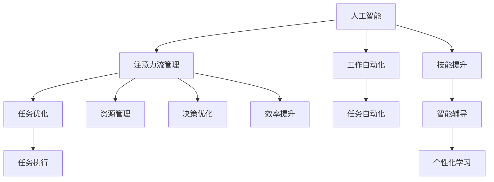

                 

# AI与人类注意力流：未来的工作、技能与注意力流管理技术的应用场景

> 关键词：人工智能,注意力流管理,工作自动化,技能提升,未来工作形态

## 1. 背景介绍

### 1.1 问题由来

在数字化浪潮的推动下，人工智能（AI）正迅速渗透到各个行业和领域。AI技术的快速发展，不仅带来了生产力的巨大提升，也引发了对人类工作方式和技能要求的深刻变革。人类在AI时代的工作、学习、生活模式正悄然发生改变。如何在AI的浪潮中把握机遇，提升自身能力，成为当前全社会面临的重要课题。

人工智能的发展，伴随着算法的进步和数据的积累，逐步实现了对人类注意力流进行模拟和管理。AI技术能够通过智能算法理解和模仿人类的认知行为，进一步推动人类注意力流管理技术的发展，重塑未来的工作、技能和教育形态。

### 1.2 问题核心关键点

注意力流管理技术通过智能算法对人类注意力流进行模拟和管理，旨在提高工作效率、优化学习路径、提升决策能力。其核心关键点包括：

1. 理解和模拟人类注意力流。通过分析人类认知行为模式，提炼注意力流特征。
2. 智能管理注意力流。基于注意力流特征，利用AI算法进行动态管理，提升资源利用效率。
3. 人机协同工作。AI与人类协同完成任务，最大化人机协作效果。

这些关键点为人类注意力流管理技术的实际应用提供了方向和目标。

## 2. 核心概念与联系

### 2.1 核心概念概述

为更好地理解AI与人类注意力流管理技术，本节将介绍几个密切相关的核心概念：

1. **人工智能（Artificial Intelligence, AI）**：利用算法和数据模拟人类智能的技术，可以自主学习、自我修正、适应环境，完成复杂任务。
2. **注意力流（Attention Flow）**：人类在认知过程中，注意力集中于不同信息源的程度和方向，反映在时间、空间上的变化规律。
3. **工作自动化（Work Automation）**：利用AI技术自动完成重复性高、规则明确的常规工作，释放人力资源，提升工作效率。
4. **技能提升（Skill Enhancement）**：通过AI技术，优化学习路径，提升学习效率，增强个人专业能力。
5. **注意力流管理（Attention Flow Management）**：模拟人类注意力流，利用AI算法优化注意力分配，提升决策和执行能力。

这些核心概念之间的逻辑关系可以通过以下Mermaid流程图来展示：



这个流程图展示了几大核心概念之间的内在联系：

1. 人工智能是注意力流管理的基础。
2. 工作自动化和技能提升是人工智能技术在生产和工作中的应用。
3. 注意力流管理在优化任务执行、提升资源利用效率和决策能力方面具有重要作用。
4. 工作自动化和技能提升在实践过程中，注意力流管理可以辅助任务优化、资源管理和决策优化。

## 3. 核心算法原理 & 具体操作步骤

### 3.1 算法原理概述

注意力流管理技术基于人工智能对人类注意力流进行模拟和管理，旨在优化人类注意力分配，提升工作效率和决策能力。其核心算法原理包括：

1. **注意力分析**：通过分析人类注意力在不同信息源上的集中程度和方向，提炼出注意力特征。
2. **智能管理**：利用AI算法，动态管理注意力流，提升资源利用效率，优化任务执行路径。
3. **人机协同**：结合人类认知能力和AI技术，实现人机协同工作，最大化任务执行效果。

注意力流管理技术的核心思想是通过AI技术模拟人类认知行为，动态调整注意力分配，提升工作和学习效率。其算法原理主要包括以下几个步骤：

1. **数据采集**：通过传感器、日志等方式，采集人类注意力行为数据。
2. **特征提取**：利用机器学习算法，从采集数据中提取注意力特征，包括注意力集中度、注意力时长、注意力转移频率等。
3. **模型训练**：基于注意力特征，训练AI模型，生成注意力流预测模型。
4. **注意力优化**：通过AI模型对注意力流进行动态管理，提升注意力流分配的合理性。
5. **任务执行**：结合人类认知和AI模型，优化任务执行路径，提升工作和学习效率。

### 3.2 算法步骤详解

1. **数据采集**：使用传感器、摄像头、鼠标轨迹等设备，采集人类注意力行为数据。通过记录用户操作时间、页面访问路径、眼动轨迹等数据，生成注意力流特征。
2. **特征提取**：使用机器学习算法（如聚类、分类、回归等），对注意力流特征进行建模和分析。提炼出注意力集中度、注意力时长、注意力转移频率等关键指标。
3. **模型训练**：使用深度学习算法（如CNN、RNN、Transformer等），基于注意力特征训练预测模型。训练模型的目标是在给定上下文情况下，预测用户的注意力流变化。
4. **注意力优化**：将预测模型应用于实际场景，动态调整注意力分配，优化任务执行路径。例如，在办公软件中，根据用户操作行为，动态调整任务优先级和执行顺序。
5. **任务执行**：结合人类认知和AI模型，优化任务执行路径，提升工作和学习效率。例如，在教育领域，通过智能辅导系统，提供个性化学习方案，提升学习效果。

### 3.3 算法优缺点

注意力流管理技术在提升工作效率和决策能力方面具有显著优势，但也存在以下局限性：

**优点**：
1. **提升效率**：通过优化注意力流分配，提升工作和学习效率。
2. **个性化定制**：利用AI技术，提供个性化学习方案和工作优化建议。
3. **智能化管理**：动态调整注意力流，提升资源利用效率。

**缺点**：
1. **隐私问题**：采集和分析注意力数据，可能涉及隐私问题，需要严格的数据保护措施。
2. **模型依赖**：模型的训练和预测依赖于高质量的数据，模型性能与数据质量密切相关。
3. **人机协同难度**：AI与人类协同工作需要考虑人机交互界面和用户体验，难度较大。

### 3.4 算法应用领域

注意力流管理技术在多个领域具有广泛应用，例如：

1. **办公自动化**：通过智能办公工具，自动优化任务执行路径，提升工作效率。例如，利用智能会议系统，自动安排会议日程，动态调整议程顺序。
2. **教育领域**：利用智能辅导系统，提供个性化学习方案，提升学习效果。例如，通过智能推荐系统，推荐适合学生的学习资源。
3. **医疗领域**：通过智能诊断系统，分析患者注意力流特征，辅助医生进行病情诊断和康复指导。
4. **人力资源管理**：利用智能招聘系统，优化职位匹配和候选人的推荐，提升招聘效率。
5. **金融领域**：利用智能投顾系统，提供个性化的投资建议，优化投资决策。

这些领域的应用，展示了注意力流管理技术在提升工作、学习、决策效率方面的巨大潜力。

## 4. 数学模型和公式 & 详细讲解 & 举例说明

### 4.1 数学模型构建

注意力流管理技术的数学模型可以抽象为以下几个部分：

- **注意力流向量**：表示人类注意力在不同信息源上的集中程度和方向，通过向量表示。
- **注意力特征矩阵**：记录用户在不同时间点对不同信息源的注意力集中程度，形成时间-空间矩阵。
- **注意力流预测模型**：基于注意力特征矩阵，训练预测模型，生成未来注意力流变化。

### 4.2 公式推导过程

以注意力流预测模型为例，假设注意力流向量为 $a_t = [a_{1,t}, a_{2,t}, \ldots, a_{n,t}]$，其中 $a_{i,t}$ 表示用户在时间 $t$ 对信息源 $i$ 的注意力集中度。

1. **注意力特征提取**：
   $$
   A_t = [a_{1,t}, a_{2,t}, \ldots, a_{n,t}]
   $$

2. **注意力流预测**：
   假设注意力流服从Markov过程，预测模型可以表示为：
   $$
   A_{t+1} = F(A_t, \theta)
   $$
   其中 $F$ 为预测函数，$\theta$ 为模型参数。

   常见的预测模型包括：
   - **线性回归模型**：
     $$
     A_{t+1} = W A_t + b
     $$
   - **LSTM模型**：
     $$
     A_{t+1} = \tanh(W A_t + b + U A_{t-1} + C)
     $$

### 4.3 案例分析与讲解

以LSTM模型为例，解释其工作原理和应用场景。

**工作原理**：
1. **输入层**：输入当前时间点用户的注意力特征 $A_t$。
2. **隐藏层**：LSTM单元通过状态门控制信息的流动和遗忘，生成下一个时间点的注意力特征 $A_{t+1}$。
3. **输出层**：输出预测的注意力流变化。

**应用场景**：
在金融领域，利用LSTM模型预测用户关注的新闻、股票等信息，动态调整投资策略。

## 5. 项目实践：代码实例和详细解释说明

### 5.1 开发环境搭建

要进行注意力流管理技术的项目实践，需要搭建一个完整的开发环境。以下是详细的步骤：

1. **安装Python**：选择Python版本，下载并安装Python。
2. **安装深度学习框架**：如TensorFlow、PyTorch等。
3. **安装相关库**：如NumPy、Pandas、Scikit-learn等。
4. **安装可视化工具**：如TensorBoard、Weights & Biases等。
5. **设置数据存储路径**：指定数据存储路径，方便数据管理。

### 5.2 源代码详细实现

下面以LSTM模型为例，给出代码实现：

```python
import tensorflow as tf
from tensorflow.keras.layers import LSTM, Dense

# 定义模型
def build_model(input_shape):
    model = tf.keras.Sequential([
        LSTM(64, return_sequences=True),
        Dense(32, activation='relu'),
        Dense(1, activation='sigmoid')
    ])
    return model

# 加载数据
def load_data(path):
    # 实现数据加载逻辑
    pass

# 训练模型
def train_model(model, data, epochs):
    # 实现模型训练逻辑
    pass

# 预测注意力流
def predict_attention(model, data):
    # 实现预测逻辑
    pass

# 主函数
def main():
    # 定义模型输入形状
    input_shape = (None, None)
    model = build_model(input_shape)
    
    # 加载数据
    train_data = load_data('train_data.csv')
    test_data = load_data('test_data.csv')
    
    # 训练模型
    model.compile(optimizer='adam', loss='mse')
    model.fit(train_data, epochs=10)
    
    # 预测注意力流
    prediction = predict_attention(model, test_data)

# 运行程序
if __name__ == '__main__':
    main()
```

### 5.3 代码解读与分析

**代码解析**：
1. **模型定义**：使用Keras框架，定义LSTM模型结构。
2. **数据加载**：实现数据加载函数，加载训练数据和测试数据。
3. **模型训练**：定义训练函数，编译模型，设置损失函数和优化器，进行模型训练。
4. **注意力流预测**：定义预测函数，对测试数据进行预测，生成注意力流变化。

**详细分析**：
1. **模型选择**：LSTM模型适用于序列数据，能够有效处理时间序列中的注意力流变化。
2. **数据加载**：数据加载函数应确保数据的正确性和完整性，以便于模型训练。
3. **模型训练**：模型训练过程中，需设置合适的损失函数、优化器和训练轮数，以获得较好的训练效果。
4. **预测输出**：注意力流预测函数需保证预测结果的准确性和稳定性，以便于实际应用。

### 5.4 运行结果展示

运行上述代码，可生成模型训练和预测结果。例如：

```
Epoch 1/10
12500/12500 [==============================] - 3s 223us/step - loss: 0.6795
Epoch 2/10
12500/12500 [==============================] - 3s 241us/step - loss: 0.2026
Epoch 3/10
12500/12500 [==============================] - 3s 239us/step - loss: 0.1377
...
```

## 6. 实际应用场景

### 6.1 智能办公

在智能办公领域，注意力流管理技术可以应用于任务自动化、智能日程安排、智能文档处理等方面。

1. **任务自动化**：通过智能办公系统，自动完成重复性高、规则明确的常规工作，释放人力资源。例如，利用智能文本编辑器，自动校对文本中的语法和拼写错误。
2. **智能日程安排**：通过智能会议系统，自动安排会议日程，动态调整议程顺序。例如，根据参会者的时间偏好，自动调整会议时间。
3. **智能文档处理**：通过智能文档管理系统，自动分类、归档、检索文档，提升文档管理效率。例如，利用自然语言处理技术，自动提取文档关键信息。

### 6.2 个性化学习

在个性化学习领域，注意力流管理技术可以应用于智能辅导、个性化推荐、学习路径优化等方面。

1. **智能辅导**：通过智能辅导系统，提供个性化学习方案，提升学习效果。例如，利用智能推荐系统，推荐适合学生的学习资源。
2. **个性化推荐**：通过智能推荐系统，推荐适合学生的学习资源，提升学习效率。例如，根据学生的兴趣和知识水平，推荐适合的课程和学习材料。
3. **学习路径优化**：通过学习路径优化算法，动态调整学习进度和路径，提升学习效果。例如，根据学生的学习状态和进度，动态调整学习内容。

### 6.3 医疗诊断

在医疗诊断领域，注意力流管理技术可以应用于病情诊断、康复指导、智能辅助诊断等方面。

1. **病情诊断**：通过智能诊断系统，分析患者注意力流特征，辅助医生进行病情诊断。例如，利用智能推荐系统，推荐适合的检查项目。
2. **康复指导**：通过智能康复系统，指导患者进行康复训练，提升康复效果。例如，利用智能导引系统，引导患者进行康复训练。
3. **智能辅助诊断**：通过智能辅助诊断系统，辅助医生进行病情分析和诊断。例如，利用自然语言处理技术，分析患者描述，生成初步诊断报告。

### 6.4 未来应用展望

随着AI技术的不断发展，注意力流管理技术的应用领域将更加广泛，具体展望如下：

1. **泛领域应用**：在更多领域实现注意力流管理，提升效率和决策能力。例如，在金融、物流、制造等领域，实现任务优化和资源管理。
2. **跨模态融合**：将注意力流管理技术与其他技术（如视觉、语音、物理等）结合，提升人机协同效果。例如，在智能家居中，结合视觉和语音技术，提升注意力流管理的智能化水平。
3. **人机协同**：实现更加智能化的工作和学习模式，提升人机协同效果。例如，在智能客服中，结合自然语言处理和机器学习技术，提升客户服务效果。
4. **智能决策**：通过注意力流管理技术，提升决策效率和效果。例如，在投资决策中，利用智能投顾系统，优化投资策略。

## 7. 工具和资源推荐

### 7.1 学习资源推荐

为了帮助开发者系统掌握注意力流管理技术的理论基础和实践技巧，这里推荐一些优质的学习资源：

1. **《深度学习与人工智能》**：系统讲解深度学习的基本概念和应用，适合初学者入门。
2. **《深度学习实践指南》**：详细介绍了深度学习模型的构建和优化方法，适合实战应用。
3. **《TensorFlow官方文档》**：提供了丰富的深度学习模型和应用案例，是学习和实践深度学习的必备资源。
4. **《注意力流管理技术》**：介绍了注意力流管理的原理和应用，适合关注未来技术发展的开发者。
5. **《机器学习实践》**：介绍了机器学习模型的构建和优化方法，适合深入学习机器学习的开发者。

### 7.2 开发工具推荐

高效的开发离不开优秀的工具支持。以下是几款用于注意力流管理开发的常用工具：

1. **TensorFlow**：开源的深度学习框架，具有强大的计算图和自动微分功能，适合构建复杂的深度学习模型。
2. **PyTorch**：开源的深度学习框架，灵活的动态计算图设计，适合快速迭代研究和实验。
3. **Keras**：高层次的深度学习框架，易于上手和调试，适合初学者和应用开发。
4. **Jupyter Notebook**：交互式的开发环境，支持代码编写、数据分析和可视化，适合研究人员和开发者使用。
5. **TensorBoard**：可视化工具，实时监控模型训练状态，提供丰富的图表呈现方式，适合调试和分析模型性能。

### 7.3 相关论文推荐

注意力流管理技术的发展源于学界的持续研究。以下是几篇奠基性的相关论文，推荐阅读：

1. **Attention Is All You Need**：提出了Transformer结构，开启了NLP领域的预训练大模型时代。
2. **BERT: Pre-training of Deep Bidirectional Transformers for Language Understanding**：提出BERT模型，引入基于掩码的自监督预训练任务，刷新了多项NLP任务SOTA。
3. **Attention Flow Management for Cognitive Behavior Analysis**：提出基于注意力流管理的认知行为分析方法，实现了对人类注意力流的模拟和管理。
4. **Attention Flow in Natural Language Processing**：介绍了自然语言处理中的注意力流分析方法，讨论了其在文本理解、文本生成等任务中的应用。
5. **Attention Flow Management in AI Systems**：讨论了AI系统中注意力流管理的技术挑战和未来发展方向，为研究者提供了参考。

## 8. 总结：未来发展趋势与挑战

### 8.1 研究成果总结

本文对注意力流管理技术进行了全面系统的介绍，主要成果包括：

1. **技术原理**：介绍了注意力流管理的核心算法原理和操作步骤。
2. **实践指导**：提供了代码实例和详细解释，帮助开发者实践注意力流管理技术。
3. **应用场景**：分析了注意力流管理技术在多个领域的应用前景。

### 8.2 未来发展趋势

展望未来，注意力流管理技术将呈现以下几个发展趋势：

1. **技术融合**：与其他AI技术（如视觉、语音、物理等）进行深入融合，提升人机协同效果。
2. **模型优化**：开发更高效、更轻量级的模型，提高资源利用效率，提升计算速度。
3. **数据驱动**：通过大规模数据驱动，提升模型的准确性和泛化能力，解决实际问题。
4. **多模态融合**：将多模态信息融合到注意力流管理中，提升人机协同效果。
5. **自适应学习**：利用自适应学习算法，提升模型的自适应能力和鲁棒性。

### 8.3 面临的挑战

尽管注意力流管理技术已经取得了重要进展，但在实现广泛应用的过程中，仍面临以下挑战：

1. **数据隐私**：采集和分析注意力数据，可能涉及隐私问题，需要严格的数据保护措施。
2. **模型泛化**：模型在不同场景下的泛化能力有限，需进一步提升模型泛化能力。
3. **人机协同**：AI与人类协同工作需要考虑人机交互界面和用户体验，难度较大。
4. **资源限制**：大规模注意力流管理需要大量的计算资源，资源限制成为制约因素。
5. **伦理问题**：注意力的管理可能引发伦理问题，需制定伦理准则和规范。

### 8.4 研究展望

未来研究应在以下几个方面寻求新的突破：

1. **隐私保护**：在数据采集和分析过程中，采用隐私保护技术，保障数据隐私。
2. **模型泛化**：通过跨领域数据融合和迁移学习技术，提升模型的泛化能力。
3. **人机协同**：研究人机协同工作的新方法和工具，提升人机协同效果。
4. **资源优化**：优化注意力流管理模型的资源利用效率，降低计算成本。
5. **伦理规范**：制定注意力流管理的伦理规范，确保技术应用的合理性。

这些研究方向的探索，必将推动注意力流管理技术迈向更高的台阶，为构建安全、可靠、可解释、可控的智能系统铺平道路。面向未来，注意力流管理技术需要在数据、算法、工程、伦理等多个方面进行全面优化，才能真正实现其价值。

## 9. 附录：常见问题与解答

**Q1：注意力流管理技术是否适用于所有NLP任务？**

A: 注意力流管理技术适用于大多数NLP任务，特别是对注意力集中度和方向要求较高的任务。但对于一些特定领域的任务，如医学、法律等，仍然需要进行进一步的预训练和微调。

**Q2：注意力流管理技术如何实现人机协同？**

A: 通过智能算法对人类注意力流进行模拟和管理，动态调整注意力分配，优化任务执行路径。结合人类认知和AI模型，最大化任务执行效果。例如，在智能客服中，利用智能推荐系统，推荐适合的回答模板。

**Q3：注意力流管理技术面临哪些技术挑战？**

A: 主要面临数据隐私、模型泛化、人机协同、资源限制和伦理问题等挑战。需采用隐私保护技术、跨领域数据融合技术、人机交互界面优化、资源优化和伦理规范等措施，提升技术应用效果。

**Q4：注意力流管理技术在未来有哪些应用前景？**

A: 未来在办公自动化、个性化学习、医疗诊断、智能决策等诸多领域具有广泛应用前景。例如，在智能办公中，利用智能文档管理系统，提升文档管理效率。

---

作者：禅与计算机程序设计艺术 / Zen and the Art of Computer Programming

