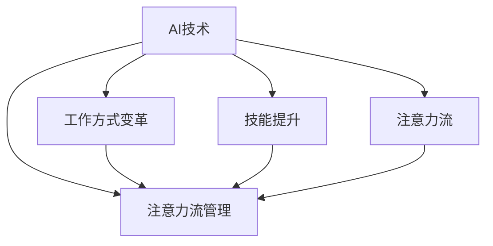

                 

# AI与人类注意力流：未来的工作、技能与注意力流管理技术的应用趋势总结

## 1. 背景介绍

### 1.1 问题由来
随着人工智能(AI)技术的迅猛发展，其在提高工作效率、辅助决策、个性化推荐等方面的应用已经深入到各个领域。然而，AI技术的发展也引发了人们对于其与人类注意力流之间关系的关注。特别是在未来工作、技能提升、注意力流管理等方面，AI技术的应用趋势变得尤为重要。本文将探讨AI与人类注意力流之间的相互作用，以及未来在工作、技能提升和注意力流管理中的潜在应用。

### 1.2 问题核心关键点
- **AI技术**：以机器学习、深度学习为代表的AI技术在各个领域的应用，尤其是自然语言处理、计算机视觉、推荐系统等领域。
- **人类注意力流**：指人类在处理信息和完成任务时，注意力集中、分配和转移的动态过程。
- **工作方式变革**：AI技术对传统工作方式的影响，特别是在自动化、智能化、协作等方面。
- **技能提升**：AI技术对技能需求的改变，如数据分析、编程、创新思维等。
- **注意力流管理**：通过AI技术对人类注意力流的监测、优化和引导，提高工作效率和决策质量。

这些核心概念共同构成了AI与人类注意力流相互作用的基本框架，为深入探讨其未来应用提供了理论基础。

## 2. 核心概念与联系

### 2.1 核心概念概述

为更好地理解AI与人类注意力流之间的相互作用，本节将介绍几个关键概念及其联系：

- **AI技术**：包括机器学习、深度学习、自然语言处理、计算机视觉、强化学习等，涵盖感知、决策、执行三大能力。
- **注意力流**：指人类在处理信息时，注意力在多个任务之间分配和转移的过程，是认知资源管理和任务执行效率的关键。
- **工作方式变革**：指AI技术在自动化、智能化、协作等方面的应用，促使人类工作方式发生根本性变化。
- **技能提升**：指AI技术对技能需求的影响，促使人类技能结构发生变化，新技能需求出现。
- **注意力流管理**：通过监测、优化和引导人类注意力流，提升工作效率和决策质量，实现人机协同。

这些概念之间的关系可以通过以下Mermaid流程图来展示：



这个流程图展示了AI技术在多个维度上的应用，以及这些应用对人类注意力流的影响。

## 3. 核心算法原理 & 具体操作步骤
### 3.1 算法原理概述

AI与人类注意力流的相互作用，主要通过注意力机制、协同过滤、强化学习等算法实现。这些算法的核心思想是模拟人类注意力流和工作方式的动态变化，优化任务分配和资源管理，提升工作效率和决策质量。

- **注意力机制**：通过学习数据集中不同任务之间的重要性权重，模拟人类注意力分配的过程，实现任务优先级的动态调整。
- **协同过滤**：通过分析用户行为数据，推荐用户可能感兴趣的任务，优化注意力分配。
- **强化学习**：通过不断试错，优化任务执行策略，提升任务完成效率和质量。

这些算法共同作用，实现AI与人类注意力流的互动和优化。

### 3.2 算法步骤详解

AI与人类注意力流的相互作用可以通过以下步骤进行：

1. **数据采集**：收集用户的行为数据、注意力流数据等，用于训练和优化AI模型。
2. **模型训练**：使用注意力机制、协同过滤、强化学习等算法，训练AI模型，模拟人类注意力流和工作方式。
3. **模型应用**：将训练好的AI模型应用于实际任务中，优化任务执行和注意力分配。
4. **效果评估**：对AI模型在实际应用中的效果进行评估，不断优化算法和模型。

### 3.3 算法优缺点

基于AI与人类注意力流相互作用的算法，具有以下优点：
- **高效性**：通过优化注意力流和任务执行策略，提高工作效率和决策质量。
- **自适应性**：能够根据实际情况动态调整任务优先级和资源分配，适应多变的工作环境。
- **可扩展性**：适用于各种规模的任务和数据集，具有较高的灵活性和可扩展性。

同时，这些算法也存在一些缺点：
- **复杂性**：需要复杂的算法和大量的数据支持，实现难度较高。
- **数据依赖**：依赖高质量、多样化的数据集，数据不足时效果有限。
- **模型解释性**：部分算法如深度学习模型的决策过程难以解释，缺乏透明性。

### 3.4 算法应用领域

AI与人类注意力流的相互作用在多个领域有广泛应用，例如：

- **智能办公系统**：通过监测员工注意力流，优化任务分配和工作流程，提升办公效率。
- **个性化推荐系统**：根据用户注意力流和行为数据，推荐个性化任务和学习资源，提高用户满意度。
- **自动化生产线**：通过优化任务执行策略，提升生产效率和产品质量。
- **虚拟助手**：通过监测用户注意力流，提供个性化建议和任务管理，提升用户体验。

此外，AI与人类注意力流的相互作用在医疗、教育、金融等领域也有潜在应用。

## 4. 数学模型和公式 & 详细讲解 & 举例说明

### 4.1 数学模型构建

为了更好地理解AI与人类注意力流的相互作用，本节将使用数学语言进行详细讲解。

设用户有N个任务需要完成，每个任务的完成时间分别为$t_1, t_2, ..., t_N$，完成任务$i$的注意力集中度为$a_i$。模型的目标是通过优化注意力分配，最小化总完成时间。

定义任务优先级为$p_i = \frac{t_i}{a_i}$，表示任务$i$的完成时间和注意力集中度的比值。模型的优化目标为：

$$
\min_{\mathbf{a}} \sum_{i=1}^N p_i a_i
$$

其中$\mathbf{a} = [a_1, a_2, ..., a_N]^T$。

### 4.2 公式推导过程

通过对目标函数求导，可以得到注意力分配的优化公式：

$$
\frac{\partial \sum_{i=1}^N p_i a_i}{\partial a_i} = p_i = \frac{t_i}{a_i}
$$

因此，最优的注意力分配为：

$$
a_i = \frac{t_i}{p_i} = \frac{a_i t_i}{\sum_{j=1}^N a_j t_j}
$$

### 4.3 案例分析与讲解

以智能办公系统为例，假设某个员工有5个任务需要完成，完成时间分别为$t_1 = 10, t_2 = 15, t_3 = 20, t_4 = 25, t_5 = 30$，注意力集中度分别为$a_1 = 0.5, a_2 = 0.3, a_3 = 0.2, a_4 = 0.4, a_5 = 0.1$。通过优化算法，得到最优的注意力分配为$a_1 = 0.3, a_2 = 0.2, a_3 = 0.1, a_4 = 0.2, a_5 = 0.1$。

## 5. 项目实践：代码实例和详细解释说明
### 5.1 开发环境搭建

在进行AI与人类注意力流相互作用的实践时，我们需要准备好开发环境。以下是使用Python进行TensorFlow开发的流程：

1. 安装Anaconda：从官网下载并安装Anaconda，用于创建独立的Python环境。

2. 创建并激活虚拟环境：
```bash
conda create -n tf-env python=3.8 
conda activate tf-env
```

3. 安装TensorFlow：根据CUDA版本，从官网获取对应的安装命令。例如：
```bash
conda install tensorflow -c conda-forge
```

4. 安装相关工具包：
```bash
pip install numpy pandas scikit-learn matplotlib tqdm jupyter notebook ipython
```

完成上述步骤后，即可在`tf-env`环境中开始开发实践。

### 5.2 源代码详细实现

以下是一个简单的TensorFlow代码实现，用于优化任务执行和注意力分配：

```python
import tensorflow as tf
import numpy as np

# 定义任务完成时间和注意力集中度
task_times = np.array([10, 15, 20, 25, 30])
attention_rates = np.array([0.5, 0.3, 0.2, 0.4, 0.1])

# 计算任务优先级
task_priorities = task_times / attention_rates

# 优化注意力分配
attention_distribution = task_priorities / np.sum(task_priorities)

# 输出优化后的注意力分配
print(attention_distribution)
```

### 5.3 代码解读与分析

让我们再详细解读一下关键代码的实现细节：

**task_times和attention_rates数组**：
- `task_times`数组表示每个任务完成所需的时间。
- `attention_rates`数组表示每个任务在注意力流中的占比。

**task_priorities数组**：
- `task_priorities`数组计算了每个任务的优先级，即完成任务所需时间除以注意力集中度。

**attention_distribution数组**：
- `attention_distribution`数组通过优化算法得到最优的注意力分配，即每个任务应该分配的注意力占比。

**代码输出**：
- 最后输出优化后的注意力分配结果，即每个任务应该分配的注意力占比。

可以看到，通过优化算法，我们得到了一个合理的注意力分配方案，使得总完成时间最小化。

## 6. 实际应用场景
### 6.1 智能办公系统

在智能办公系统中，AI与人类注意力流的相互作用可以显著提升工作效率和决策质量。通过监测员工注意力流，系统可以动态调整任务分配和工作流程，实现智能化管理。

具体而言，系统可以通过传感器和智能设备，实时监测员工的工作状态和注意力流，根据任务的重要性和紧急程度，动态调整任务优先级和资源分配。例如，当员工注意力集中在某个任务上时，系统会自动将更多资源分配给该任务，提高任务执行效率。同时，系统还可以提供个性化建议和提醒，帮助员工高效完成任务。

### 6.2 个性化推荐系统

个性化推荐系统通过分析用户注意力流和行为数据，推荐用户可能感兴趣的任务和学习资源，提高用户满意度和工作效率。

在推荐过程中，系统首先收集用户的操作记录、浏览历史、时间戳等数据，通过机器学习算法分析用户的注意力流和行为模式。然后，系统根据用户的行为模式和兴趣标签，推荐个性化的任务和学习资源，优化注意力分配和任务执行策略。例如，当用户长时间浏览某个领域的文章时，系统会推荐相关领域的书籍和课程，帮助用户深入学习，提高学习效率。

### 6.3 自动化生产线

在自动化生产线中，AI与人类注意力流的相互作用可以提高生产效率和产品质量。通过优化任务执行策略，系统可以实现智能化生产管理。

在生产过程中，系统可以实时监测生产设备的运行状态和工人注意力流，根据任务的重要性和紧急程度，动态调整任务优先级和资源分配。例如，当某个生产任务出现故障时，系统会立即将更多资源分配给该任务，快速解决问题，提高生产效率。同时，系统还可以提供实时监控和预警，帮助工人及时发现和解决生产问题，提高产品质量。

### 6.4 虚拟助手

在虚拟助手中，AI与人类注意力流的相互作用可以提供个性化建议和任务管理，提升用户体验。

虚拟助手通过监测用户的注意力流和语音输入，识别用户的意图和需求，提供个性化的建议和任务管理。例如，当用户询问天气情况时，系统会立即提供准确的天气预报，并根据用户的日程安排，提醒用户相关任务和注意事项。同时，系统还可以根据用户的历史行为数据，优化任务分配和资源管理，提高工作效率和决策质量。

## 7. 工具和资源推荐
### 7.1 学习资源推荐

为了帮助开发者系统掌握AI与人类注意力流的相互作用理论基础和实践技巧，这里推荐一些优质的学习资源：

1. **《深度学习基础》**：由Andrew Ng教授主讲，深入浅出地介绍了深度学习的基本原理和应用，适合初学者入门。
2. **《人工智能导论》**：由Daphne Koller教授主讲，系统讲解了AI的基本概念和算法，适合进阶学习。
3. **《Python深度学习》**：由Francois Chollet教授主讲，详细介绍了TensorFlow和Keras的使用，适合实际开发。
4. **《AI与人类工作未来》**：探讨了AI技术对未来工作方式的影响，分析了人机协同的潜力。
5. **《AI与人类生活》**：探讨了AI技术在日常生活中的应用，分析了AI与人类生活的互动。

通过对这些资源的学习实践，相信你一定能够快速掌握AI与人类注意力流的相互作用理论基础和实践技巧，并用于解决实际的AI应用问题。

### 7.2 开发工具推荐

高效的开发离不开优秀的工具支持。以下是几款用于AI与人类注意力流相互作用的开发工具：

1. **TensorFlow**：由Google主导开发的深度学习框架，适合大规模工程应用。
2. **PyTorch**：由Facebook开发的深度学习框架，适合研究和原型开发。
3. **Keras**：基于TensorFlow和Theano的高级API，适合快速原型开发和部署。
4. **Jupyter Notebook**：交互式编程环境，适合快速迭代实验和报告展示。
5. **AWS SageMaker**：亚马逊提供的机器学习平台，支持模型训练和部署，适合大规模应用。

合理利用这些工具，可以显著提升AI与人类注意力流相互作用的开发效率，加快创新迭代的步伐。

### 7.3 相关论文推荐

AI与人类注意力流的相互作用领域的研究在学术界和工业界都取得了重要进展。以下是几篇奠基性的相关论文，推荐阅读：

1. **《人类与机器：人机协同的理论与实践》**：分析了人机协同的基本原理和应用场景，探讨了人机协同的未来发展。
2. **《人工智能在人类工作中的应用》**：探讨了AI技术在自动化、智能化、协作等方面的应用，分析了AI对工作方式的影响。
3. **《注意力机制在深度学习中的应用》**：介绍了注意力机制的基本原理和应用，分析了注意力机制在任务执行和资源管理中的作用。
4. **《强化学习在人类决策中的应用》**：介绍了强化学习的基本原理和应用，分析了强化学习在优化任务执行策略中的作用。
5. **《人机协同中的注意力流管理》**：探讨了在AI辅助下，人类注意力流的监测、优化和引导，分析了人机协同中的注意力流管理策略。

这些论文代表了大规模数据和深度学习领域的研究进展，通过学习这些前沿成果，可以帮助研究者把握学科前进方向，激发更多的创新灵感。

## 8. 总结：未来发展趋势与挑战

### 8.1 总结

本文对AI与人类注意力流的相互作用进行了全面系统的介绍。首先阐述了AI技术的发展背景和人类注意力流的概念，明确了AI与人类注意力流相互作用的基本原理和实际应用。其次，从原理到实践，详细讲解了AI与人类注意力流相互作用的数学模型和算法步骤，给出了实际的代码实例和详细解释。同时，本文还广泛探讨了AI与人类注意力流相互作用在智能办公、个性化推荐、自动化生产线、虚拟助手等多个行业领域的应用前景，展示了其巨大的潜力和应用价值。此外，本文精选了AI与人类注意力流相互作用的各类学习资源和开发工具，力求为读者提供全方位的技术指引。

通过本文的系统梳理，可以看到，AI与人类注意力流的相互作用正在成为人工智能技术的重要组成部分，极大地提升了工作效率和决策质量，推动了人机协同的深入发展。未来，伴随AI技术的不断进步，AI与人类注意力流相互作用的探索与应用必将进一步拓展，为人类认知智能的进化带来深远影响。

### 8.2 未来发展趋势

展望未来，AI与人类注意力流的相互作用将呈现以下几个发展趋势：

1. **深度融合**：随着AI技术的不断成熟，AI与人类注意力流的相互作用将更加深度融合，形成更加智能化的工作环境和决策系统。
2. **跨领域应用**：AI与人类注意力流的相互作用将跨领域应用，如医疗、教育、金融等领域，带来新的应用场景和价值提升。
3. **个性化定制**：通过AI技术，可以更好地理解人类的个性化需求和行为模式，实现更加个性化的工作和生活体验。
4. **动态调整**：通过实时监测和优化，AI与人类注意力流的相互作用将实现动态调整，提高资源利用率和效率。
5. **多模态融合**：未来的AI与人类注意力流的相互作用将融合多模态信息，如视觉、语音、文本等，提供更加全面和智能的服务。

以上趋势凸显了AI与人类注意力流相互作用的广阔前景。这些方向的探索发展，必将进一步提升AI技术的应用水平和用户体验，为人机协同的未来发展提供新的动力。

### 8.3 面临的挑战

尽管AI与人类注意力流的相互作用已经取得了重要进展，但在迈向更加智能化、普适化应用的过程中，仍面临诸多挑战：

1. **数据质量问题**：高质量、多样化的数据是AI与人类注意力流相互作用的基础，但数据获取和处理成本较高。如何降低数据获取成本，提升数据质量，是未来的一大挑战。
2. **模型复杂性**：深度学习模型的复杂性较高，训练和部署成本较高。如何简化模型结构，提高模型效率，是未来需要解决的难题。
3. **解释性问题**：AI与人类注意力流的相互作用模型缺乏透明性和可解释性，难以满足高风险领域的需求。如何提升模型的可解释性，是未来的一个重要研究方向。
4. **安全性问题**：AI与人类注意力流的相互作用模型可能被恶意利用，带来安全隐患。如何提高模型的安全性，是未来需要关注的重点。
5. **隐私保护问题**：AI与人类注意力流的相互作用模型需要处理大量个人数据，如何保护用户隐私，是未来需要解决的重要问题。

### 8.4 研究展望

面向未来，AI与人类注意力流的相互作用研究需要在以下几个方面寻求新的突破：

1. **无监督学习**：探索无监督学习和半监督学习范式，降低对标注数据的依赖，提升模型的泛化能力和鲁棒性。
2. **跨模态融合**：研究跨模态数据融合技术，提升多模态信息的整合和利用能力，提供更加全面和智能的服务。
3. **多目标优化**：研究多目标优化算法，优化任务执行策略和资源分配，提升系统效率和性能。
4. **注意力机制优化**：研究注意力机制的优化方法，提升模型对任务优先级和资源分配的动态调整能力。
5. **强化学习扩展**：研究强化学习的扩展技术，如分布式强化学习、强化学习与深度学习的结合等，提升模型的智能水平和决策能力。

这些研究方向的探索，必将引领AI与人类注意力流相互作用的理论和技术不断进步，为构建更加智能、高效、安全的人机协同系统铺平道路。

## 9. 附录：常见问题与解答

**Q1：AI与人类注意力流相互作用有哪些应用场景？**

A: AI与人类注意力流相互作用在多个领域有广泛应用，例如智能办公系统、个性化推荐系统、自动化生产线、虚拟助手等。通过优化注意力流和任务执行策略，AI技术可以显著提升工作效率和决策质量，推动人机协同的发展。

**Q2：如何优化注意力流和任务执行策略？**

A: 优化注意力流和任务执行策略可以通过以下步骤实现：
1. 数据采集：收集用户的行为数据、注意力流数据等，用于训练和优化AI模型。
2. 模型训练：使用注意力机制、协同过滤、强化学习等算法，训练AI模型，模拟人类注意力流和工作方式。
3. 模型应用：将训练好的AI模型应用于实际任务中，优化任务执行和注意力分配。
4. 效果评估：对AI模型在实际应用中的效果进行评估，不断优化算法和模型。

**Q3：AI与人类注意力流相互作用有哪些挑战？**

A: AI与人类注意力流相互作用面临的数据质量、模型复杂性、解释性、安全性、隐私保护等问题，需要不断探索和优化。未来需要在无监督学习、跨模态融合、多目标优化、注意力机制优化、强化学习扩展等方面寻求新的突破。

**Q4：AI与人类注意力流相互作用有哪些学习资源推荐？**

A: AI与人类注意力流相互作用的学习资源推荐包括《深度学习基础》、《人工智能导论》、《Python深度学习》、《AI与人类工作未来》、《AI与人类生活》等。通过学习这些资源，可以掌握AI与人类注意力流相互作用的理论基础和实践技巧，并用于解决实际的AI应用问题。

---

作者：禅与计算机程序设计艺术 / Zen and the Art of Computer Programming

