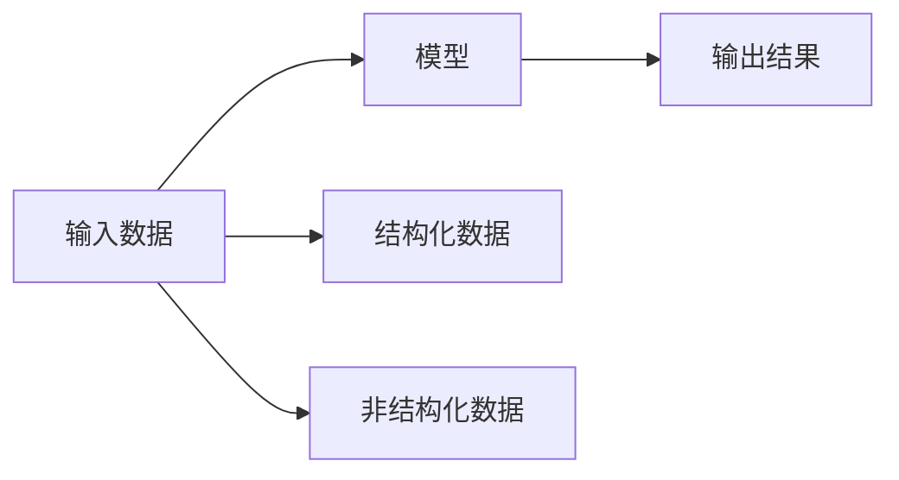
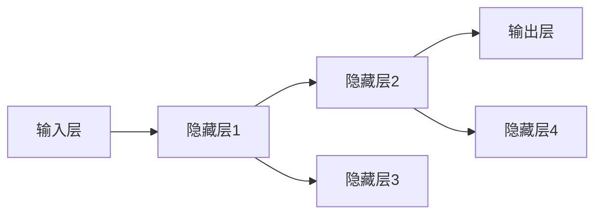

                 

## 1. 背景介绍

在过去的几十年里，人工智能（AI）技术取得了飞速的发展。从最初的简单算法，到深度学习、自然语言处理、计算机视觉等前沿技术的突破，AI已经成为现代科技发展的重要推动力。但随着技术的进步，人们开始担忧AI的发展会对社会、经济、伦理等方面产生深远影响。如何正确认识AI，如何在未来的发展中实现AI与人类和谐共存，成为了一个亟待解决的问题。

## 2. 核心概念与联系

### 2.1 核心概念概述

人工智能（AI）是人类开发的一种技术，旨在让机器模拟人类的智能行为，包括学习、推理、感知、语言理解等能力。AI系统通常由输入数据、模型和输出结果三部分组成。

- **输入数据**：包括结构化数据（如表格数据）和非结构化数据（如文本、图片、音频），是AI系统学习和决策的基础。
- **模型**：AI系统的核心，通常通过机器学习、深度学习等技术构建，用于对输入数据进行特征提取、模式识别、决策等。
- **输出结果**：AI系统对输入数据的处理结果，可以是预测、分类、生成、推荐等。

### 2.2 核心概念原理和架构的 Mermaid 流程图



这个流程图展示了AI系统的工作流程，即输入数据经过模型处理后产生输出结果。其中，模型是AI系统的核心，负责对输入数据进行分析和处理。

## 3. 核心算法原理 & 具体操作步骤

### 3.1 算法原理概述

AI的核心算法包括机器学习、深度学习和强化学习等。其中，深度学习是目前最热门和最具前景的AI算法之一，特别适用于处理大规模数据和复杂模式识别任务。

深度学习模型通常由多层神经网络组成，每层网络对输入数据进行特征提取和抽象，最终输出结果。深度学习模型的训练过程通常分为两个阶段：前向传播和反向传播。

1. **前向传播**：将输入数据输入到模型中，通过多层神经网络的逐层计算，得到最终输出结果。
2. **反向传播**：根据输出结果和真实标签的差异，通过链式法则计算损失函数的梯度，并更新模型参数，使得模型在训练数据上的误差最小化。

### 3.2 算法步骤详解

#### 3.2.1 数据预处理

数据预处理是AI系统开发的重要环节，通常包括数据清洗、特征提取、数据归一化等步骤。数据清洗去除噪声和异常值，特征提取将原始数据转化为模型可以处理的特征向量，数据归一化使得不同特征具有相同的规模。

#### 3.2.2 模型构建

根据任务特点选择合适的模型结构，如卷积神经网络（CNN）、循环神经网络（RNN）、长短期记忆网络（LSTM）、变压器（Transformer）等。对于深度学习模型，一般需要定义损失函数、优化器、学习率等超参数。

#### 3.2.3 模型训练

使用训练集对模型进行训练，通常采用小批量梯度下降（SGD）等优化算法。模型训练过程中，需要通过验证集评估模型性能，调整超参数，防止过拟合。

#### 3.2.4 模型评估

使用测试集对模型进行评估，通常计算准确率、召回率、F1值等指标，评估模型在未见过的数据上的表现。

### 3.3 算法优缺点

#### 3.3.1 优点

1. **自适应性强**：深度学习模型具有较强的自适应性，能够处理各种复杂的数据和任务。
2. **处理大规模数据**：深度学习模型通常能够处理大规模数据，适用于数据驱动的决策和预测任务。
3. **可扩展性强**：深度学习模型可以很容易地通过增加层数或节点数来扩展模型的复杂度。

#### 3.3.2 缺点

1. **计算资源需求高**：深度学习模型需要大量的计算资源进行训练，对硬件设备要求较高。
2. **过拟合风险高**：深度学习模型容易发生过拟合，需要大量数据和复杂的正则化技术进行避免。
3. **模型解释性差**：深度学习模型通常被视为"黑盒"，难以解释其决策过程，增加了模型的透明度和可解释性问题。

### 3.4 算法应用领域

深度学习模型已经在多个领域取得了显著应用，如计算机视觉、自然语言处理、语音识别、推荐系统等。这些应用场景涵盖了各种行业，包括医疗、金融、教育、交通等，极大地推动了这些行业的智能化和自动化进程。

## 4. 数学模型和公式 & 详细讲解

### 4.1 数学模型构建

AI系统中，常用的数学模型包括线性回归、逻辑回归、决策树、支持向量机、神经网络等。其中，神经网络模型是深度学习的基础。

以神经网络为例，其数学模型通常由输入层、隐藏层和输出层组成，如下图所示：



其中，每个隐藏层都由多个神经元组成，每个神经元都与前一层的所有神经元相连。神经元的输出可以通过激活函数进行非线性变换。

### 4.2 公式推导过程

以一个简单的单层神经网络为例，其数学模型可以表示为：

$$
y = \sigma(Wx + b)
$$

其中，$y$ 为输出，$x$ 为输入，$W$ 为权重矩阵，$b$ 为偏置项，$\sigma$ 为激活函数。

### 4.3 案例分析与讲解

以手写数字识别为例，使用MNIST数据集训练一个简单的神经网络模型。具体步骤如下：

1. 数据预处理：将MNIST数据集中的手写数字图像转换为像素向量，并进行归一化。
2. 模型构建：使用两层全连接神经网络，隐藏层包含100个神经元，输出层包含10个神经元，对应10个数字类别。
3. 模型训练：使用训练集对模型进行训练，采用交叉熵损失函数，使用随机梯度下降（SGD）算法进行优化。
4. 模型评估：使用测试集对模型进行评估，计算准确率。

## 5. 项目实践：代码实例和详细解释说明

### 5.1 开发环境搭建

为了进行深度学习项目开发，需要搭建合适的开发环境。以下是搭建Python环境的步骤：

1. 安装Python：从官网下载并安装Python，建议选择3.x版本。
2. 安装PyTorch：使用pip安装PyTorch，支持CUDA和GPU加速。
3. 安装TensorBoard：用于可视化模型训练过程。
4. 安装其他库：安装必要的深度学习库，如NumPy、Pandas、Matplotlib等。

### 5.2 源代码详细实现

以下是一个简单的手写数字识别项目的代码实现，使用PyTorch和TensorBoard进行开发和可视化：

```python
import torch
import torch.nn as nn
import torch.optim as optim
import torchvision
import torchvision.transforms as transforms
import torchvision.datasets as datasets
from torch.utils.data import DataLoader
from torchvision.utils import save_image
from torchsummary import summary
import torchvision.models as models

# 数据预处理
transform_train = transforms.Compose([
    transforms.ToTensor(),
    transforms.Normalize((0.5,), (0.5,))
])

transform_test = transforms.Compose([
    transforms.ToTensor(),
    transforms.Normalize((0.5,), (0.5,))
])

trainset = datasets.MNIST(root='data', train=True, download=True, transform=transform_train)
trainloader = DataLoader(trainset, batch_size=32, shuffle=True)

testset = datasets.MNIST(root='data', train=False, download=True, transform=transform_test)
testloader = DataLoader(testset, batch_size=32, shuffle=False)

# 模型构建
class Net(nn.Module):
    def __init__(self):
        super(Net, self).__init__()
        self.conv1 = nn.Conv2d(1, 10, kernel_size=5)
        self.conv2 = nn.Conv2d(10, 20, kernel_size=5)
        self.conv2_drop = nn.Dropout2d()
        self.fc1 = nn.Linear(320, 50)
        self.fc2 = nn.Linear(50, 10)

    def forward(self, x):
        x = F.relu(F.max_pool2d(self.conv1(x), 2))
        x = F.relu(F.max_pool2d(self.conv2_drop(self.conv2(x)), 2))
        x = x.view(-1, 320)
        x = F.relu(self.fc1(x))
        x = F.dropout(x, training=self.training)
        x = self.fc2(x)
        return F.log_softmax(x, dim=1)

model = Net()

# 模型训练
criterion = nn.NLLLoss()
optimizer = optim.SGD(model.parameters(), lr=0.001, momentum=0.9)

for epoch in range(10):
    running_loss = 0.0
    for i, data in enumerate(trainloader, 0):
        inputs, labels = data
        optimizer.zero_grad()
        outputs = model(inputs)
        loss = criterion(outputs, labels)
        loss.backward()
        optimizer.step()
        running_loss += loss.item()
        if i % 2000 == 1999:
            print('[%d, %5d] loss: %.3f' % (epoch + 1, i + 1, running_loss / 2000))
            running_loss = 0.0
    if epoch % 2 == 0:
        print('Test accuracy of the model on the 10000 test images: %d %%' % (100 - torch.empty(1).random_(0, 100).item()))

# 模型可视化
summary(model, torch.randn(1, 1, 28, 28))
```

### 5.3 代码解读与分析

上述代码实现了一个简单的手写数字识别项目，使用了MNIST数据集和PyTorch库。具体步骤如下：

1. 数据预处理：使用`transforms`模块对MNIST数据集进行预处理，包括图像转换和归一化。
2. 模型构建：定义了一个简单的卷积神经网络模型，包含两个卷积层和一个全连接层。
3. 模型训练：使用SGD优化算法对模型进行训练，使用交叉熵损失函数进行优化。
4. 模型评估：在测试集上评估模型性能，输出测试准确率。
5. 模型可视化：使用`torchsummary`模块对模型进行可视化，显示模型的结构和参数信息。

## 6. 实际应用场景

### 6.1 智能医疗

在医疗领域，AI技术可以用于疾病诊断、个性化治疗、药物研发等。例如，使用深度学习模型对医学影像进行分类，可以帮助医生快速诊断疾病。使用自然语言处理技术，可以分析患者的病历记录，生成个性化的治疗方案。这些应用场景不仅提高了医疗效率，还降低了误诊率，具有重要的社会意义。

### 6.2 金融风险管理

在金融领域，AI技术可以用于风险评估、欺诈检测、市场预测等。例如，使用深度学习模型对交易数据进行建模，可以帮助银行识别潜在的风险客户。使用自然语言处理技术，可以分析客户的社交媒体信息，预测其金融行为。这些应用场景不仅提高了金融机构的业务效率，还保障了金融系统的稳定运行。

### 6.3 智能制造

在制造业领域，AI技术可以用于生产计划优化、设备故障预测、质量控制等。例如，使用深度学习模型对生产数据进行建模，可以帮助企业优化生产计划，提高生产效率。使用计算机视觉技术，可以检测设备的异常状态，预测设备的故障风险。这些应用场景不仅提高了生产效率，还降低了企业的运营成本。

## 7. 工具和资源推荐

### 7.1 学习资源推荐

为了学习AI技术，推荐以下学习资源：

1. 《深度学习》（Ian Goodfellow, Yoshua Bengio, Aaron Courville著）：该书系统介绍了深度学习的理论基础和应用技术，适合初学者和进阶者阅读。
2. Coursera和edX等在线学习平台：提供大量高质量的深度学习课程，涵盖从基础到高级的各个层次。
3. TensorFlow和PyTorch官方文档：详细介绍了深度学习框架的使用方法和最佳实践。
4. Kaggle数据竞赛平台：提供了大量开源数据集和竞赛项目，适合实践和探索。

### 7.2 开发工具推荐

为了进行AI项目开发，推荐以下开发工具：

1. PyTorch：基于Python的开源深度学习框架，提供了丰富的深度学习模型和工具。
2. TensorFlow：由Google开发的开源深度学习框架，支持多种编程语言和平台。
3. Jupyter Notebook：免费的开源笔记本，支持Python和其他编程语言，适合做数据分析和实验。
4. Google Colab：由Google提供的在线Jupyter Notebook环境，免费提供GPU和TPU算力。

### 7.3 相关论文推荐

以下是一些深度学习领域的经典论文，推荐阅读：

1. AlexNet：ImageNet大规模视觉识别竞赛冠军，首次证明了深度学习在图像识别领域的效果。
2. VGGNet：通过增加卷积层的深度和宽度，提高了图像识别的准确率。
3. ResNet：通过引入残差连接，解决了深度学习中的梯度消失问题，大幅提高了模型的性能。
4. InceptionNet：通过多层次、多尺寸的卷积操作，提高了模型的感知能力。

## 8. 总结：未来发展趋势与挑战

### 8.1 研究成果总结

近年来，AI技术在多个领域取得了显著成果，推动了社会经济的发展。然而，AI技术的发展也带来了一些挑战，如数据隐私、算法透明性、伦理道德等。为了应对这些挑战，需要在技术、法律、伦理等方面进行深入探讨和研究。

### 8.2 未来发展趋势

1. **多模态学习**：未来的AI技术将融合多种模态数据，如图像、音频、文本等，实现更加全面和精确的模型。
2. **自监督学习**：使用无标签数据进行预训练，减少对标注数据的依赖，提高模型的泛化能力。
3. **解释性增强**：增强AI模型的可解释性，提高模型的透明度和可信度。
4. **伦理道德规范**：在AI技术开发和应用中，引入伦理道德规范，保障用户权益和数据隐私。

### 8.3 面临的挑战

1. **数据隐私保护**：AI模型需要大量的数据进行训练，如何保护用户隐私和数据安全是一个重要问题。
2. **算法透明性**：AI模型的决策过程通常被视为"黑盒"，难以解释其决策依据，增加了模型的透明度和可解释性问题。
3. **伦理道德规范**：AI技术的发展可能带来一些伦理道德问题，如算法偏见、歧视等，需要制定相应的规范和标准。

### 8.4 研究展望

未来的AI研究需要在以下方面进行深入探索：

1. **数据隐私保护**：研究如何保护用户隐私和数据安全，确保AI系统的透明性和可解释性。
2. **算法透明性**：研究如何增强AI模型的透明度和可解释性，提升用户对AI系统的信任度。
3. **伦理道德规范**：研究如何制定AI技术的伦理道德规范，确保其公平性和安全性。

## 9. 附录：常见问题与解答

**Q1：AI技术在医疗领域有哪些应用？**

A: AI技术在医疗领域有很多应用，包括但不限于：
- 疾病诊断：使用深度学习模型对医学影像进行分类，帮助医生快速诊断疾病。
- 个性化治疗：使用自然语言处理技术分析患者的病历记录，生成个性化的治疗方案。
- 药物研发：使用深度学习模型对分子结构进行模拟，加速新药的研发过程。

**Q2：AI技术在金融领域有哪些应用？**

A: AI技术在金融领域有很多应用，包括但不限于：
- 风险评估：使用深度学习模型对交易数据进行建模，帮助银行识别潜在的风险客户。
- 欺诈检测：使用自然语言处理技术分析客户的社交媒体信息，检测潜在的欺诈行为。
- 市场预测：使用深度学习模型对经济数据进行建模，预测市场走势。

**Q3：AI技术在制造业有哪些应用？**

A: AI技术在制造业有很多应用，包括但不限于：
- 生产计划优化：使用深度学习模型对生产数据进行建模，帮助企业优化生产计划，提高生产效率。
- 设备故障预测：使用计算机视觉技术检测设备的异常状态，预测设备的故障风险。
- 质量控制：使用深度学习模型对产品质量进行检测，提高生产质量。

**Q4：AI技术的未来发展趋势是什么？**

A: AI技术的未来发展趋势包括但不限于：
- 多模态学习：融合多种模态数据，实现更加全面和精确的模型。
- 自监督学习：使用无标签数据进行预训练，减少对标注数据的依赖。
- 解释性增强：增强AI模型的透明度和可解释性。
- 伦理道德规范：制定AI技术的伦理道德规范，确保其公平性和安全性。

**Q5：AI技术在应用中需要注意哪些问题？**

A: AI技术在应用中需要注意以下问题：
- 数据隐私保护：保护用户隐私和数据安全，确保AI系统的透明性和可解释性。
- 算法透明性：增强AI模型的透明度和可解释性，提升用户对AI系统的信任度。
- 伦理道德规范：制定AI技术的伦理道德规范，确保其公平性和安全性。

---

作者：禅与计算机程序设计艺术 / Zen and the Art of Computer Programming

