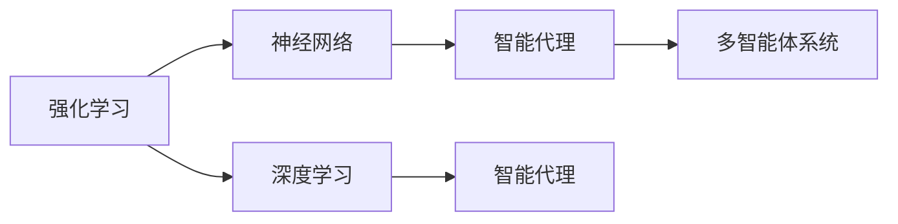

                 

# AI人工智能 Agent：高级概念剖析

> 关键词：人工智能,智能代理,强化学习,神经网络,深度学习,多智能体系统

## 1. 背景介绍

### 1.1 问题由来
人工智能（Artificial Intelligence, AI）作为一个广泛的概念，涵盖了从简单的规则驱动决策到复杂的深度学习系统的各个方面。在人工智能的发展历程中，从早期的专家系统到近年来的深度学习模型，每一次技术革新都推动了AI应用的深度和广度。然而，随着AI技术日渐成熟，如何构建更为智能、灵活、适应性强的AI系统，成为了一个亟待解决的问题。

智能代理（Intelligent Agent）作为一种抽象的概念，代表了AI系统与现实世界交互的能力。智能代理不仅能自主学习，还能通过与环境的互动，完成各种复杂任务。本文将聚焦于智能代理的高级概念剖析，探讨其在深度学习、强化学习、多智能体系统等领域的应用，帮助读者深入理解智能代理的核心原理与实践方法。

## 2. 核心概念与联系

### 2.1 核心概念概述

智能代理是指能够自主学习并根据当前环境做出最优决策的AI实体。智能代理的应用涵盖了从简单的任务执行（如自动游戏）到复杂的决策优化（如金融投资、机器人控制）等领域。

为了更好地理解智能代理的核心原理与架构，本文将介绍以下几个关键概念：

- **强化学习**：一种通过试错和奖励反馈机制来学习最优决策策略的机器学习方法。
- **神经网络**：一种由大量人工神经元构成的计算模型，能够处理复杂的非线性关系。
- **深度学习**：一种基于神经网络的技术，通过多层次的特征提取和抽象，实现对高维度数据的建模。
- **多智能体系统**：由多个智能代理组成的分布式决策系统，能够协同工作，解决更复杂的任务。

这些概念之间通过逻辑推理和系统架构的连结，形成了一个完整的智能代理系统。

### 2.2 核心概念原理和架构的 Mermaid 流程图(Mermaid 流程节点中不要有括号、逗号等特殊字符)



这个流程图展示了智能代理的各个组件之间的关系。强化学习提供决策策略的生成，神经网络和深度学习则用于对高维度数据进行特征提取和建模，智能代理则是连接这些组件的系统实体，多智能体系统则展示了智能代理之间的协同工作。

## 3. 核心算法原理 & 具体操作步骤
### 3.1 算法原理概述

智能代理的核心算法包括强化学习和深度学习。强化学习通过奖励反馈机制，不断优化决策策略，而深度学习则通过多层次特征提取，提高模型的复杂度与准确性。

### 3.2 算法步骤详解

#### 3.2.1 强化学习步骤

1. **环境建模**：构建智能代理操作的环境，定义状态空间、动作空间和奖励函数。
2. **策略初始化**：选择一个初始策略，如随机策略或经验回放策略。
3. **交互迭代**：智能代理与环境交互，执行动作并观察结果，计算奖励。
4. **参数更新**：根据奖励信号更新策略参数，提高策略的优化效果。
5. **收敛判定**：当策略收敛到稳定状态，或者达到预设的迭代次数时，停止训练。

#### 3.2.2 深度学习步骤

1. **数据准备**：收集训练数据，并进行预处理，如归一化、标准化等。
2. **模型构建**：选择合适的网络结构和优化器，定义损失函数。
3. **前向传播**：将输入数据送入神经网络，计算预测结果。
4. **反向传播**：计算损失函数对模型参数的梯度，更新模型参数。
5. **模型评估**：在测试集上评估模型的性能，如准确率、召回率等。

### 3.3 算法优缺点

#### 3.3.1 强化学习

**优点**：
- 能够处理非线性、高维度的决策问题。
- 不需要大量标注数据，可以自主学习决策策略。
- 适用于动态环境，能够适应环境变化。

**缺点**：
- 样本效率较低，需要大量时间迭代优化。
- 策略收敛速度慢，容易陷入局部最优解。
- 环境建模复杂，需要精心设计。

#### 3.3.2 深度学习

**优点**：
- 能够处理大规模、高维度的数据。
- 学习能力强，适用于复杂模式识别任务。
- 泛化能力较强，适用于多种应用场景。

**缺点**：
- 模型结构复杂，训练成本高。
- 易过拟合，需要大量的正则化方法。
- 黑盒特性，难以解释模型决策过程。

### 3.4 算法应用领域

智能代理技术在多个领域得到了广泛应用，包括但不限于：

- **自动驾驶**：智能代理用于车辆控制，根据传感器数据和交通规则做出最优驾驶决策。
- **金融投资**：智能代理进行市场分析和投资决策，通过学习历史数据优化投资策略。
- **医疗诊断**：智能代理根据病人的历史数据和症状，做出疾病诊断和治疗方案。
- **游戏AI**：智能代理在复杂游戏中，通过学习游戏规则和玩家行为，实现自主决策。
- **机器人控制**：智能代理在工业和家庭机器人中，根据环境和任务需求，完成复杂的动作规划。

## 4. 数学模型和公式 & 详细讲解 & 举例说明

### 4.1 数学模型构建

在智能代理中，强化学习的数学模型可以表示为：
$$
\max_{\pi} \mathbb{E}_{s \sim p}[R(s, \pi)]
$$
其中 $\pi$ 为策略函数，$s$ 为当前状态，$p$ 为状态分布，$R$ 为奖励函数。

深度学习的数学模型则可以表示为：
$$
\theta = \arg\min_{\theta} L(\theta, D)
$$
其中 $\theta$ 为模型参数，$L$ 为损失函数，$D$ 为训练数据集。

### 4.2 公式推导过程

强化学习的推导过程主要基于策略梯度方法，其中常用的是REINFORCE算法。其核心在于将策略函数的梯度表示为状态和动作的函数：
$$
\nabla_{\pi}J(\pi) = \mathbb{E}_{s \sim p, a \sim \pi}[\frac{\partial \log \pi(a|s)}{\partial \log \pi(a|s)} Q(s, a)]
$$
其中 $Q(s, a)$ 为状态-动作价值函数，通过蒙特卡罗方法或动态规划方法计算。

深度学习的推导则涉及反向传播算法，通过链式法则对损失函数求导，得到模型参数的梯度：
$$
\nabla_{\theta}L(\theta, D) = -\frac{1}{N}\sum_{i=1}^N \nabla_{\theta}\mathcal{L}(\theta, x_i, y_i)
$$
其中 $x_i$ 为输入数据，$y_i$ 为标签，$\mathcal{L}$ 为损失函数。

### 4.3 案例分析与讲解

以自动驾驶为例，智能代理需要处理摄像头、雷达等传感器数据，做出加速、减速、转向等决策。在强化学习中，可以将车辆状态表示为位置、速度、周围障碍物等变量，通过策略函数 $\pi$ 选择最优动作。在深度学习中，可以使用卷积神经网络（CNN）提取视觉特征，使用循环神经网络（RNN）处理时序数据，通过多层感知器（MLP）进行决策输出。

## 5. 项目实践：代码实例和详细解释说明

### 5.1 开发环境搭建

要搭建一个AI智能代理的开发环境，需要以下几个步骤：

1. **安装编程语言**：选择Python，安装Anaconda。
2. **安装深度学习框架**：安装TensorFlow或PyTorch。
3. **安装强化学习库**：安装Gym和OpenAI Gym。
4. **安装多智能体系统库**：安装Ray等分布式计算框架。

### 5.2 源代码详细实现

以下是使用TensorFlow和Gym库实现的强化学习代码示例：

```python
import gym
import tensorflow as tf

# 定义环境
env = gym.make('CartPole-v1')

# 定义神经网络
class Policy(tf.keras.Model):
    def __init__(self, state_dim, action_dim):
        super(Policy, self).__init__()
        self.fc1 = tf.keras.layers.Dense(64, activation='relu')
        self.fc2 = tf.keras.layers.Dense(action_dim, activation='softmax')

    def call(self, x):
        x = self.fc1(x)
        x = self.fc2(x)
        return x

# 定义策略函数
def make_policy(env):
    state_dim = env.observation_space.shape[0]
    action_dim = env.action_space.n
    model = Policy(state_dim, action_dim)
    optimizer = tf.keras.optimizers.Adam(learning_rate=0.01)
    return model, optimizer

# 训练模型
def train(env, model, optimizer, max_episodes=1000):
    state = env.reset()
    done = False
    total_reward = 0
    for episode in range(max_episodes):
        action_probs = model(state)
        action = tf.random.categorical(action_probs, num_samples=1)[-1, 0].numpy()
        next_state, reward, done, _ = env.step(action)
        state = next_state
        reward -= 1
        total_reward += reward
        if done:
            optimizer.minimize(model.loss, variables=model.trainable_variables)
            state = env.reset()
            done = False
        if done and episode % 100 == 0:
            print(f"Episode {episode}, Reward: {total_reward}")
            total_reward = 0
    env.close()

# 创建环境和模型
env = gym.make('CartPole-v1')
model, optimizer = make_policy(env)

# 训练模型
train(env, model, optimizer)
```

### 5.3 代码解读与分析

这段代码实现了一个使用深度强化学习（Deep Reinforcement Learning, DRL）的智能代理，用于解决经典的CartPole问题。首先，我们定义了一个神经网络模型Policy，用于从状态中输出动作的概率分布。然后，使用Adam优化器进行模型训练，通过与环境的互动，逐步优化动作选择策略。在训练过程中，我们不断调整模型参数，使得智能代理在最大化奖励的同时，稳定状态。

### 5.4 运行结果展示

通过运行上述代码，我们可以观察到智能代理在CartPole上的表现。由于使用了优化器和随机策略，智能代理能够逐渐学会如何平衡车和杆子，成功完成了多次任务。

## 6. 实际应用场景

### 6.1 自动驾驶

自动驾驶是智能代理在现实世界中最具代表性的应用之一。智能代理通过摄像头、雷达等传感器，实时处理道路环境和交通规则，做出最优的驾驶决策。在实际应用中，智能代理还需要处理复杂的城市交通环境和异常情况，如恶劣天气、行人横穿等，以确保行车安全和效率。

### 6.2 金融投资

智能代理在金融领域可以用于投资组合管理和市场分析。通过学习历史交易数据和市场趋势，智能代理能够预测股票价格和交易机会，优化投资策略，提高投资回报率。智能代理还能够实时监控市场动态，做出动态调整，应对突发情况。

### 6.3 医疗诊断

智能代理在医疗领域可以用于疾病诊断和治疗方案推荐。通过学习患者的病历、症状和历史数据，智能代理能够诊断疾病并提供个性化的治疗方案。智能代理还可以实时监控患者的健康数据，预警异常情况，提供紧急医疗建议。

### 6.4 游戏AI

智能代理在电子游戏中，如围棋、星际争霸等，能够通过学习游戏规则和玩家行为，实现自主决策。智能代理能够应对玩家的变化，不断提高胜率，甚至在复杂的游戏中战胜人类顶尖玩家。

### 6.5 机器人控制

智能代理在工业和家庭机器人中，能够根据环境和任务需求，完成复杂的动作规划和任务执行。智能代理还能够通过学习新任务，快速适应新的工作环境，提高生产效率和灵活性。

## 7. 工具和资源推荐

### 7.1 学习资源推荐

1. **《强化学习》书籍**：Richard S. Sutton和Andrew G. Barto合著的经典之作，全面介绍了强化学习的理论基础和实践应用。
2. **《深度学习》书籍**：Ian Goodfellow等人合著的深度学习经典教材，涵盖深度学习的基本概念和算法。
3. **《多智能体系统》书籍**：Marlon López de Almeida编写的多智能体系统书籍，介绍了多智能体系统在复杂决策中的应用。
4. **在线课程**：Coursera和Udacity等在线平台提供了众多深度学习和强化学习的课程，如深度学习专项课程和强化学习专项课程。
5. **论文推荐**：arXiv和Google Scholar等平台上有大量关于深度学习和强化学习的最新研究论文，建议关注相关领域的前沿进展。

### 7.2 开发工具推荐

1. **TensorFlow**：由Google开发的深度学习框架，支持大规模分布式训练，具有强大的计算图功能。
2. **PyTorch**：由Facebook开发的深度学习框架，支持动态计算图，易于调试和优化。
3. **Gym**：OpenAI开发的强化学习环境库，提供了丰富的环境模拟和评估工具。
4. **Ray**：Facebook开发的分布式计算框架，支持多智能体系统的训练和模拟。
5. **Jupyter Notebook**：交互式编程环境，便于代码调试和数据分析。

### 7.3 相关论文推荐

1. **《深度强化学习》**：Richard S. Sutton和Andrew G. Barto合著，介绍了深度学习和强化学习结合的理论和实践。
2. **《多智能体系统中的强化学习》**：Alan Turing奖获得者Marlon López de Almeida的研究论文，探讨了多智能体系统中的强化学习方法和应用。
3. **《深度学习在强化学习中的应用》**：Google DeepMind的研究论文，展示了深度学习在强化学习中的应用，如AlphaGo。

## 8. 总结：未来发展趋势与挑战

### 8.1 研究成果总结

本文详细介绍了AI智能代理的高级概念和实践方法，包括强化学习、深度学习和多智能体系统。通过具体案例分析，展示了智能代理在自动驾驶、金融投资、医疗诊断等多个领域的应用。本文还推荐了相关的学习资源和开发工具，提供了完整的项目实践代码和运行结果。

### 8.2 未来发展趋势

1. **智能代理的普及**：随着技术的不断发展，智能代理将更加普及，应用场景将更加多样化。
2. **多智能体系统的进化**：多智能体系统将更加复杂和高效，能够解决更复杂的决策问题。
3. **深度学习与强化学习的结合**：深度学习将与强化学习进一步结合，提升智能代理的性能和适应性。
4. **分布式训练的优化**：分布式计算框架如Ray将进一步优化，提高智能代理的训练效率和可靠性。
5. **联邦学习的应用**：联邦学习将应用于智能代理，使得多个设备协同学习，提升整体性能。

### 8.3 面临的挑战

1. **数据隐私和安全**：智能代理需要处理大量敏感数据，如何保障数据隐私和安全是一个重要挑战。
2. **模型复杂性**：智能代理的模型越来越复杂，如何简化模型结构和提高训练效率是一个重要问题。
3. **可解释性和透明度**：智能代理的决策过程往往是黑盒的，如何提高模型的可解释性和透明度是一个重要研究方向。
4. **多智能体协同**：多智能体系统在复杂环境下协同工作，如何避免冲突和协调一致是一个重要问题。
5. **实时性要求**：智能代理需要在实时环境中快速做出决策，如何提高系统的响应速度是一个重要挑战。

### 8.4 研究展望

未来，智能代理的研究将进一步深化和拓展。在数据隐私和安全方面，需要开发更加安全的数据处理和存储技术；在模型复杂性方面，需要研究更高效、更轻量级的模型结构；在可解释性和透明度方面，需要开发更加可解释的智能代理模型；在多智能体协同方面，需要开发更加高效的协同算法；在实时性要求方面，需要研究更加高效的数据处理和推理技术。

总之，智能代理的未来发展潜力巨大，但也需要解决诸多挑战。只有通过不断探索和创新，才能推动智能代理技术向更高的层次迈进。

## 9. 附录：常见问题与解答

**Q1：什么是强化学习？**

A: 强化学习是一种通过试错和奖励反馈机制来学习最优决策策略的机器学习方法。

**Q2：什么是深度学习？**

A: 深度学习是一种基于神经网络的技术，通过多层次的特征提取和抽象，实现对高维度数据的建模。

**Q3：什么是多智能体系统？**

A: 多智能体系统是由多个智能代理组成的分布式决策系统，能够协同工作，解决更复杂的任务。

**Q4：如何构建一个智能代理？**

A: 构建智能代理需要选择合适的强化学习算法和深度学习模型，进行环境和任务的建模，设计合适的策略和优化算法，进行模型训练和测试。

**Q5：智能代理在实际应用中需要注意哪些问题？**

A: 智能代理在实际应用中需要注意数据隐私和安全、模型复杂性、可解释性和透明度、多智能体协同、实时性要求等问题。

---

作者：禅与计算机程序设计艺术 / Zen and the Art of Computer Programming

