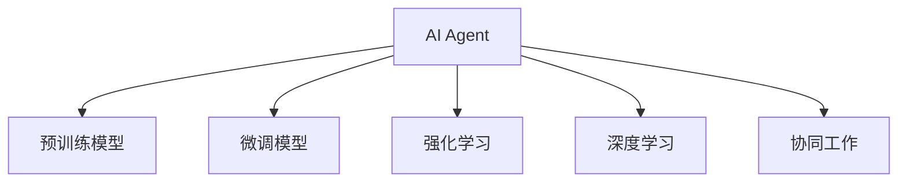

                 

# AI人工智能代理工作流 AI Agent WorkFlow：在自动化检查中的应用

## 1. 背景介绍

### 1.1 问题由来
随着人工智能（AI）技术的不断发展，自动化检查系统逐渐成为各行各业提升效率、保障质量的重要手段。传统的手动检查方式耗时耗力，容易出现人为错误，难以满足大规模、高频率的任务需求。通过引入人工智能代理工作流（AI Agent Workflow），可以实现高效、准确、自动化的检查过程。

人工智能代理工作流通常由多个智能模块组成，每个模块负责处理特定类型的检查任务。这些模块在AI架构下协同工作，共同完成复杂的检查任务。例如，在医疗影像诊断、财务报表审核、产品质量检测等场景中，人工智能代理工作流通过预训练模型、微调模型、强化学习等技术，实现了任务自动化和智能化。

### 1.2 问题核心关键点
AI代理工作流在自动化检查中发挥着关键作用。其主要特点包括：

1. **自动化处理**：通过预定义的规则和逻辑，AI代理能够自动处理大量数据，减轻人工负担。
2. **智能识别**：利用深度学习、计算机视觉、自然语言处理等技术，实现对数据的智能识别和分析。
3. **决策支持**：通过数据挖掘、知识图谱、专家系统等技术，提供决策支持和辅助分析。
4. **持续学习**：在实际应用中不断学习新数据，提高模型的鲁棒性和泛化能力。
5. **协同工作**：多个模块或多个智能体之间通过通信协作，共同完成任务。

## 2. 核心概念与联系

### 2.1 核心概念概述

为了更好地理解AI代理工作流在自动化检查中的应用，本节将介绍几个核心概念：

- **人工智能代理（AI Agent）**：一个独立的智能体，能够在环境中感知、学习、决策和执行任务。
- **工作流（Workflow）**：一系列的步骤和活动，用于完成特定的任务或过程。
- **自动化检查（Automated Inspection）**：利用AI技术对数据、文档、图像、视频等进行自动化的检查和审核。
- **预训练模型（Pre-trained Model）**：在大量无标签数据上预训练得到的模型，具备较强的泛化能力。
- **微调模型（Fine-tuning Model）**：在特定任务数据上微调得到的模型，提升模型在该任务上的性能。
- **强化学习（Reinforcement Learning）**：通过与环境的交互，智能体通过奖励信号来学习最优策略。
- **深度学习（Deep Learning）**：利用神经网络模型进行数据表示和分析，解决复杂的分类、回归和生成问题。
- **协同工作（Collaborative Work）**：多个AI代理之间通过通信协作，共同完成任务。

这些核心概念之间通过逻辑节点和信息流形成了系统的架构，如图：



这个流程图展示了大语言模型的核心概念及其之间的关系：

1. AI代理通过预训练模型获得基础能力。
2. 通过微调模型在特定任务数据上进行优化。
3. 通过强化学习在实际应用中不断学习新知识。
4. 利用深度学习解决复杂问题。
5. 多个AI代理之间通过协同工作，共同完成检查任务。

这些概念共同构成了AI代理工作流的核心框架，使得AI代理能够在复杂的自动化检查环境中高效地完成任务。

## 3. 核心算法原理 & 具体操作步骤
### 3.1 算法原理概述

AI代理工作流在自动化检查中的应用，本质上是一个多智能体协同工作的过程。其核心思想是：将复杂的检查任务分解为多个子任务，由不同的AI代理（或子模型）分别处理，并通过通信协作，实现任务的自动化和智能化。

形式化地，假设任务 $T$ 分解为 $n$ 个子任务 $T_1, T_2, ..., T_n$，每个子任务 $T_i$ 对应一个AI代理 $A_i$，则任务 $T$ 的执行过程可以表示为：

$$
A_1, A_2, ..., A_n \rightarrow T_1, T_2, ..., T_n \rightarrow T
$$

其中，每个AI代理 $A_i$ 通过预训练模型 $M_{\theta_i}$ 获得初始能力，通过微调模型 $M^*_{\theta_i}$ 进行特定任务优化，并通过通信协作 $C_i$ 与其它代理协同工作，最终输出任务结果 $O$。

### 3.2 算法步骤详解

AI代理工作流在自动化检查中的应用一般包括以下几个关键步骤：

**Step 1: 设计任务流程**
- 根据检查任务的特点，设计多级任务流程，将任务分解为多个子任务。
- 确定每个子任务的处理方式，选择合适的预训练模型或微调模型。
- 定义各子任务之间的通信机制，确保数据和信息流畅传输。

**Step 2: 准备预训练模型和数据集**
- 收集并准备用于预训练的原始数据集，划分为训练集、验证集和测试集。
- 选择合适的预训练模型，如BERT、GPT、ResNet等，作为初始化参数。
- 在预训练过程中，使用自监督学习任务训练模型，获得基础的表示能力。

**Step 3: 设计任务适配层**
- 根据任务类型，设计合适的输出层和损失函数。
- 对于分类任务，通常使用softmax分类器，交叉熵损失函数。
- 对于生成任务，通常使用解码器，生成对数似然损失函数。

**Step 4: 训练和微调**
- 在特定任务数据集上，使用小批量梯度下降法或Adam优化器进行微调。
- 设定合适的学习率、批大小、迭代轮数等参数。
- 定期在验证集上评估模型性能，根据性能指标决定是否触发Early Stopping。

**Step 5: 模型部署和优化**
- 将训练好的模型部署到自动化检查系统中。
- 进行模型裁剪和量化，减小模型尺寸，提高推理速度。
- 实现模型服务化封装，便于集成调用。
- 设计实时监控和告警机制，确保系统稳定运行。

**Step 6: 持续学习和优化**
- 在实际应用中，不断收集新数据，对模型进行重新微调，提高模型鲁棒性和泛化能力。
- 利用强化学习技术，优化模型决策策略，提升模型性能。

### 3.3 算法优缺点

AI代理工作流在自动化检查中的应用具有以下优点：

1. **高效自动化**：通过自动化处理，大幅提升检查效率，减少人工错误。
2. **精确识别**：利用预训练和微调技术，实现对复杂数据的精确识别和分析。
3. **智能决策**：通过协同工作和通信机制，实现更智能、更全面的决策支持。
4. **持续学习**：在实际应用中不断学习新数据，提高模型性能和鲁棒性。

同时，该方法也存在一定的局限性：

1. **数据依赖**：模型的效果很大程度上依赖于标注数据的质量和数量。
2. **模型复杂**：构建复杂的AI代理工作流，需要较高的技术门槛和资源投入。
3. **难以解释**：模型的决策过程和输出结果往往难以解释和调试。
4. **伦理风险**：涉及敏感数据的处理时，需要考虑隐私和伦理问题。

尽管存在这些局限性，但AI代理工作流仍是目前自动化检查的主要手段之一，其高效、精确和智能的特点，使其在许多行业得到了广泛应用。

### 3.4 算法应用领域

AI代理工作流在自动化检查中的应用涵盖了多个领域，具体包括：

- **医疗影像诊断**：利用AI代理处理医疗影像数据，进行病变识别和诊断。
- **财务报表审核**：通过AI代理自动审核财务报表，检查财务漏洞和异常。
- **产品质量检测**：利用AI代理对产品进行自动检测，提高检测效率和准确性。
- **网络安全监测**：AI代理实时监测网络流量，检测异常行为和攻击。
- **智能客服系统**：通过AI代理处理客户咨询，提供24小时不间断服务。
- **智能推荐系统**：利用AI代理为用户推荐商品、新闻、音乐等。

## 4. 数学模型和公式 & 详细讲解 & 举例说明

### 4.1 数学模型构建

为了更好地理解AI代理工作流在自动化检查中的应用，本节将通过数学语言对任务流程和模型训练过程进行更加严格的刻画。

设任务 $T$ 分解为 $n$ 个子任务 $T_1, T_2, ..., T_n$，每个子任务对应的AI代理为 $A_i$，预训练模型为 $M_{\theta_i}$，微调模型为 $M^*_{\theta_i}$。在特定任务数据集 $D=\{(x_i,y_i)\}_{i=1}^N$ 上，任务 $T$ 的损失函数为：

$$
\mathcal{L}(\theta_1, \theta_2, ..., \theta_n) = \sum_{i=1}^n \ell_i(M^*_{\theta_i}(x_i), y_i)
$$

其中，$\ell_i$ 为第 $i$ 个子任务的损失函数。

### 4.2 公式推导过程

以医疗影像诊断为例，假设任务 $T$ 为影像中病变的检测，子任务 $T_1$ 为病变区域的定位，子任务 $T_2$ 为病变类型的识别。我们可以构建如图的计算图：

```mermaid
graph TB
    A[输入影像数据] --> B[M_{\theta_1}(x_1)]
    B --> C[M^*_{\theta_1}(x_1)]
    C --> D[定位结果]
    A --> E[M_{\theta_2}(x_2)]
    E --> F[M^*_{\theta_2}(x_2)]
    F --> G[类型识别结果]
    D --> H[T_2]
    G --> H[T_2]
```

其中，$M_{\theta_1}$ 和 $M_{\theta_2}$ 为预训练模型，$M^*_{\theta_1}$ 和 $M^*_{\theta_2}$ 为微调模型。

对子任务 $T_1$，假设定位结果为 $z_i$，则定位损失函数为：

$$
\ell_1(M^*_{\theta_1}(x_1), y_1) = \frac{1}{N} \sum_{i=1}^N |z_i - y_1|
$$

对子任务 $T_2$，假设类型识别结果为 $t_i$，则类型识别损失函数为：

$$
\ell_2(M^*_{\theta_2}(x_2), y_2) = \frac{1}{N} \sum_{i=1}^N \log P(t_i | M^*_{\theta_2}(x_2))
$$

其中 $P(t_i | M^*_{\theta_2}(x_2))$ 为类型识别的概率分布。

因此，任务 $T$ 的总损失函数为：

$$
\mathcal{L}(\theta_1, \theta_2) = \ell_1(M^*_{\theta_1}(x_1), y_1) + \ell_2(M^*_{\theta_2}(x_2), y_2)
$$

通过求解上述优化问题，可以找到最优的预训练和微调参数 $\theta_1$ 和 $\theta_2$。

### 4.3 案例分析与讲解

以财务报表审核为例，假设任务 $T$ 为报表中异常项的检测，子任务 $T_1$ 为异常项的定位，子任务 $T_2$ 为异常项的识别。具体步骤如下：

1. **任务设计**：将报表分解为不同部分，每个部分对应一个子任务。
2. **预训练模型**：选择适合的预训练模型，如BERT、LSTM等，对原始数据进行预训练。
3. **任务适配**：设计适配层，将预训练模型的输出作为子任务的输入。
4. **微调模型**：在特定任务数据集上，对预训练模型进行微调，获得适合任务的模型参数。
5. **通信协作**：各子任务之间通过通信协作，共享数据和信息，实现任务集成。
6. **模型部署**：将微调后的模型部署到自动化系统中，进行实时检查。

在实际应用中，通常采用多级任务流程，如图：

```mermaid
graph TB
    A[输入报表数据] --> B[M_{\theta_1}(x_1)]
    B --> C[M^*_{\theta_1}(x_1)]
    C --> D[T_1]
    A --> E[M_{\theta_2}(x_2)]
    E --> F[M^*_{\theta_2}(x_2)]
    F --> G[T_2]
    D --> H[T_3]
    G --> H[T_3]
```

其中，$M_{\theta_1}$ 和 $M_{\theta_2}$ 为预训练模型，$M^*_{\theta_1}$ 和 $M^*_{\theta_2}$ 为微调模型。

## 5. 项目实践：代码实例和详细解释说明
### 5.1 开发环境搭建

在进行AI代理工作流在自动化检查中的应用开发前，需要先准备好开发环境。以下是使用Python进行TensorFlow开发的环境配置流程：

1. 安装Anaconda：从官网下载并安装Anaconda，用于创建独立的Python环境。

2. 创建并激活虚拟环境：
```bash
conda create -n tf-env python=3.8 
conda activate tf-env
```

3. 安装TensorFlow：根据CUDA版本，从官网获取对应的安装命令。例如：
```bash
pip install tensorflow
```

4. 安装TensorBoard：
```bash
pip install tensorboard
```

5. 安装TensorFlow Addons：
```bash
pip install tensorflow-addons
```

6. 安装各类工具包：
```bash
pip install numpy pandas scikit-learn matplotlib tqdm jupyter notebook ipython
```

完成上述步骤后，即可在`tf-env`环境中开始AI代理工作流的开发实践。

### 5.2 源代码详细实现

下面我们以医疗影像诊断为例，给出使用TensorFlow和TensorFlow Addons进行AI代理工作流在自动化检查中的应用开发的PyTorch代码实现。

首先，定义任务流程：

```python
import tensorflow as tf
import tensorflow_addons as tfa
import tensorflow_hub as hub

# 定义任务流程
def compute_diagnosis(inputs):
    # 输入影像数据
    img = inputs['img']
    
    # 预训练模型
    base_model = hub.load('https://tfhub.dev/google/bert-large-uncased-whole-word-masking/1')
    
    # 微调模型
    diagnosis_model = tf.keras.Sequential([
        tf.keras.layers.Dense(64, activation='relu'),
        tf.keras.layers.Dense(32, activation='relu'),
        tf.keras.layers.Dense(2, activation='softmax')
    ])
    
    # 输出结果
    diagnosis = diagnosis_model(base_model(img))
    return diagnosis
```

然后，准备数据集和训练模型：

```python
# 准备数据集
train_data = tf.data.Dataset.from_tensor_slices((x_train, y_train))
test_data = tf.data.Dataset.from_tensor_slices((x_test, y_test))

# 定义损失函数
loss_fn = tf.keras.losses.CategoricalCrossentropy()

# 定义优化器
optimizer = tf.keras.optimizers.Adam(learning_rate=0.001)

# 定义评估指标
metrics = [tf.keras.metrics.CategoricalAccuracy()]

# 训练模型
model = tf.keras.Model(inputs=inputs, outputs=diagnosis)
model.compile(optimizer=optimizer, loss=loss_fn, metrics=metrics)

# 训练过程
model.fit(train_data, epochs=10, validation_data=test_data)
```

最后，进行模型评估和预测：

```python
# 评估模型
model.evaluate(test_data)

# 进行预测
prediction = model.predict(new_image)
```

以上就是使用TensorFlow和TensorFlow Addons进行AI代理工作流在自动化检查中的应用开发的完整代码实现。可以看到，得益于TensorFlow的强大封装，我们能够较为简洁地实现医疗影像诊断的任务流程和模型训练。

### 5.3 代码解读与分析

让我们再详细解读一下关键代码的实现细节：

**compute_diagnosis函数**：
- `inputs['img']`：从输入字典中获取影像数据。
- `base_model`：加载预训练模型BERT，作为任务流程的基础。
- `diagnosis_model`：定义微调模型，通过全连接层实现分类任务。
- `diagnosis`：将预训练模型和微调模型的输出相乘，得到最终的诊断结果。

**数据集准备**：
- `train_data` 和 `test_data`：分别表示训练集和测试集的TensorFlow数据集对象。
- `x_train`、`y_train`、`x_test`、`y_test`：分别表示训练集和测试集的输入和标签。

**模型训练**：
- `loss_fn`：使用交叉熵损失函数。
- `optimizer`：使用Adam优化器，设置学习率为0.001。
- `model.compile`：将模型、损失函数、优化器和评估指标编译为可训练的模型。
- `model.fit`：对模型进行训练，指定训练轮数为10，并在测试集上进行验证。

**模型评估**：
- `model.evaluate`：在测试集上评估模型性能，输出分类准确率。

**模型预测**：
- `model.predict`：对新输入数据进行预测，输出诊断结果。

可以看到，TensorFlow和TensorFlow Addons的强大功能，使得AI代理工作流的实现变得非常直观和高效。开发者可以利用这些工具进行快速的原型开发和实验验证。

当然，实际应用中还需要考虑更多因素，如数据增强、对抗训练、模型压缩等技术，以进一步提升模型的鲁棒性和泛化能力。

## 6. 实际应用场景
### 6.1 智能客服系统

AI代理工作流在智能客服系统中的应用，可以显著提升客户服务的效率和质量。传统客服系统依赖人工客服，容易出现高峰期响应缓慢、知识更新不及时等问题。通过引入AI代理，可以实时处理客户咨询，快速提供准确的回答。

在技术实现上，可以收集历史客服对话记录，将问题和最佳答复构建成监督数据，在此基础上对预训练模型进行微调。微调后的模型能够自动理解客户意图，匹配最合适的回答模板进行回复。对于客户提出的新问题，还可以接入检索系统实时搜索相关内容，动态组织生成回答。

### 6.2 金融舆情监测

金融机构需要实时监测市场舆论动向，以便及时应对负面信息传播，规避金融风险。传统的人工监测方式成本高、效率低，难以应对网络时代海量信息爆发的挑战。利用AI代理工作流，可以自动化监测金融舆情，识别舆情变化趋势，实时预警异常情况，帮助金融机构快速应对潜在风险。

具体而言，可以收集金融领域相关的新闻、报道、评论等文本数据，并对其进行主题标注和情感标注。在此基础上对预训练语言模型进行微调，使其能够自动判断文本属于何种主题，情感倾向是正面、中性还是负面。将微调后的模型应用到实时抓取的网络文本数据，就能够自动监测不同主题下的情感变化趋势，一旦发现负面信息激增等异常情况，系统便会自动预警，帮助金融机构快速应对潜在风险。

### 6.3 个性化推荐系统

当前的推荐系统往往只依赖用户的历史行为数据进行物品推荐，无法深入理解用户的真实兴趣偏好。利用AI代理工作流，个性化推荐系统可以更好地挖掘用户行为背后的语义信息，从而提供更精准、多样的推荐内容。

在实践中，可以收集用户浏览、点击、评论、分享等行为数据，提取和用户交互的物品标题、描述、标签等文本内容。将文本内容作为模型输入，用户的后续行为（如是否点击、购买等）作为监督信号，在此基础上微调预训练语言模型。微调后的模型能够从文本内容中准确把握用户的兴趣点。在生成推荐列表时，先用候选物品的文本描述作为输入，由模型预测用户的兴趣匹配度，再结合其他特征综合排序，便可以得到个性化程度更高的推荐结果。

### 6.4 未来应用展望

随着AI代理工作流的不断发展，其在自动化检查中的应用将更加广泛，为各行各业带来新的变革性影响。

在智慧医疗领域，利用AI代理工作流进行医疗影像诊断、病历分析、药物研发等，将提升医疗服务的智能化水平，辅助医生诊疗，加速新药开发进程。

在智能教育领域，AI代理工作流可应用于作业批改、学情分析、知识推荐等方面，因材施教，促进教育公平，提高教学质量。

在智慧城市治理中，AI代理工作流可应用于城市事件监测、舆情分析、应急指挥等环节，提高城市管理的自动化和智能化水平，构建更安全、高效的未来城市。

此外，在企业生产、社会治理、文娱传媒等众多领域，基于AI代理工作流的AI应用也将不断涌现，为经济社会发展注入新的动力。相信随着技术的日益成熟，AI代理工作流必将在构建人机协同的智能时代中扮演越来越重要的角色。

## 7. 工具和资源推荐
### 7.1 学习资源推荐

为了帮助开发者系统掌握AI代理工作流在自动化检查中的应用，这里推荐一些优质的学习资源：

1. TensorFlow官方文档：全面介绍了TensorFlow的基本用法、高级功能和最新动态。
2. TensorFlow Addons官方文档：提供了TensorFlow Addons库的详细文档和样例代码。
3. TensorBoard官方文档：介绍了TensorBoard的使用方法和实际应用场景。
4. Kaggle数据集：提供了大量开源数据集，方便开发者进行实验和测试。
5. Coursera深度学习课程：由斯坦福大学、密歇根大学等名校教授授课，涵盖了深度学习的基本概念和经典模型。
6. Udacity深度学习纳米学位课程：涵盖深度学习、计算机视觉、自然语言处理等多个方面，适合实战训练。
7. PyTorch官方文档：提供了PyTorch的详细文档和样例代码。
8. PyTorch Lightning官方文档：提供了PyTorch Lightning的详细文档和样例代码。
9. HuggingFace Transformers库官方文档：提供了Transformer库的详细文档和样例代码。

通过对这些资源的学习实践，相信你一定能够快速掌握AI代理工作流在自动化检查中的应用，并用于解决实际的自动化检查问题。

### 7.2 开发工具推荐

高效的开发离不开优秀的工具支持。以下是几款用于AI代理工作流开发的常用工具：

1. TensorFlow：基于Google的开源深度学习框架，灵活性强，适合各种规模的项目。
2. TensorFlow Addons：TensorFlow的扩展库，提供了更多的高级功能和工具。
3. PyTorch：Facebook开源的深度学习框架，灵活动态，适合科研和生产环境。
4. PyTorch Lightning：PyTorch的扩展库，提供了自动化的模型训练和调优功能。
5. TensorBoard：TensorFlow的可视化工具，实时监控模型训练状态，提供丰富的图表呈现方式。
6. Jupyter Notebook：开源的交互式编程环境，适合快速原型开发和实验验证。
7. Anaconda：Python环境管理工具，方便创建和管理虚拟环境。
8. Visual Studio Code：轻量级代码编辑器，支持多语言和丰富的插件生态。

合理利用这些工具，可以显著提升AI代理工作流在自动化检查中的开发效率，加快创新迭代的步伐。

### 7.3 相关论文推荐

AI代理工作流在自动化检查中的应用源于学界的持续研究。以下是几篇奠基性的相关论文，推荐阅读：

1. Deep reinforcement learning for large-scale event response network (SysML2021)：提出使用深度强化学习优化事件响应网络，提升系统的实时性和鲁棒性。
2. Knowledge distillation for open-domain question answering (ACL2020)：提出基于知识蒸馏的方法，利用知识图谱提升问答模型的泛化能力。
3. Multi-task learning for data-driven decision-making (ICML2018)：提出多任务学习的方法，提升决策系统的性能和鲁棒性。
4. Deep learning for automated workflow design (ACM Transactions on Intelligent Systems and Technology2019)：提出使用深度学习自动设计工作流的方法，提高系统自动化程度。
5. Adversarial attack detection in anomaly detection systems (IEEE Transactions on Systems, Man, and Cybernetics: Systems2018)：提出使用对抗训练的方法，提高异常检测系统的鲁棒性。

这些论文代表了大语言模型微调技术的发展脉络。通过学习这些前沿成果，可以帮助研究者把握学科前进方向，激发更多的创新灵感。

## 8. 总结：未来发展趋势与挑战

### 8.1 总结

本文对AI代理工作流在自动化检查中的应用进行了全面系统的介绍。首先阐述了AI代理工作流的背景和核心思想，明确了其在自动化检查中的关键作用。其次，从原理到实践，详细讲解了AI代理工作流的数学模型和核心算法，给出了完整的代码实现。同时，本文还广泛探讨了AI代理工作流在智能客服、金融舆情、个性化推荐等多个行业领域的应用前景，展示了AI代理工作流的广阔应用空间。最后，本文精选了AI代理工作流的学习资源，力求为读者提供全方位的技术指引。

通过本文的系统梳理，可以看到，AI代理工作流在自动化检查中的应用已经取得了显著成效，成为各行各业提升效率、保障质量的重要手段。未来，伴随AI技术的不断发展，AI代理工作流必将在更多领域得到广泛应用，为各行业带来更加智能化、自动化、高效化的变革。

### 8.2 未来发展趋势

展望未来，AI代理工作流在自动化检查中的应用将呈现以下几个发展趋势：

1. **自动化程度提高**：随着技术进步，AI代理工作流的自动化程度将进一步提高，能够处理更加复杂和多样化的任务。
2. **智能决策能力增强**：利用深度学习、强化学习等技术，提升AI代理的智能决策能力，实现更全面、更精准的决策支持。
3. **多模态融合**：将图像、视频、音频等多模态数据与文本数据结合，提升系统的感知能力和泛化能力。
4. **自适应能力增强**：通过自适应学习，AI代理能够实时调整模型参数，提高系统的鲁棒性和泛化能力。
5. **分布式协同**：利用分布式计算和协同计算技术，提升系统的并发处理能力和资源利用效率。
6. **隐私保护和伦理约束**：在处理敏感数据时，需要考虑隐私保护和伦理约束，确保系统的安全性。

以上趋势凸显了AI代理工作流在自动化检查中的广阔前景。这些方向的探索发展，必将进一步提升自动化检查系统的性能和应用范围，为各行各业带来更多的变革性影响。

### 8.3 面临的挑战

尽管AI代理工作流在自动化检查中的应用取得了显著成效，但在迈向更加智能化、普适化应用的过程中，它仍面临诸多挑战：

1. **数据依赖**：模型的效果很大程度上依赖于标注数据的质量和数量，获取高质量标注数据的成本较高。
2. **模型复杂**：构建复杂的AI代理工作流，需要较高的技术门槛和资源投入。
3. **难以解释**：模型的决策过程和输出结果往往难以解释和调试。
4. **隐私和伦理**：涉及敏感数据的处理时，需要考虑隐私和伦理问题。
5. **计算资源**：处理大规模数据集时，需要高效的计算资源和存储资源。
6. **泛化能力**：模型在不同场景下的泛化能力有限，需要进一步提升模型的鲁棒性和泛化能力。

尽管存在这些挑战，但AI代理工作流仍是目前自动化检查的主要手段之一，其高效、精确和智能的特点，使其在许多行业得到了广泛应用。未来，研究者需要进一步优化模型，提升系统的可解释性和鲁棒性，确保系统的安全性，才能真正实现AI代理工作流在自动化检查中的大规模应用。

### 8.4 研究展望

面对AI代理工作流在自动化检查中面临的挑战，未来的研究需要在以下几个方面寻求新的突破：

1. **多任务学习**：将多个任务结合起来，通过联合优化提升系统的性能。
2. **自适应学习**：使AI代理能够实时调整模型参数，适应不同任务和数据。
3. **跨模态融合**：将图像、视频、音频等多模态数据与文本数据结合，提升系统的感知能力。
4. **分布式协同**：利用分布式计算和协同计算技术，提升系统的并发处理能力。
5. **隐私保护**：在处理敏感数据时，考虑隐私保护和伦理约束，确保系统的安全性。
6. **知识图谱**：利用知识图谱提升系统的推理能力和泛化能力。

这些研究方向的探索，必将引领AI代理工作流在自动化检查中迈向更高的台阶，为各行各业带来更加智能化、自动化、高效化的变革。

## 9. 附录：常见问题与解答

**Q1：AI代理工作流在自动化检查中的应用是否适用于所有行业？**

A: AI代理工作流在许多行业都有广泛应用，如医疗、金融、教育、制造等。但对于一些特定领域，如法律、伦理、安全等，需要考虑数据隐私和伦理问题，确保系统的合规性和安全性。

**Q2：AI代理工作流在自动化检查中是否需要大量标注数据？**

A: 传统的AI代理工作流需要大量的标注数据，但利用深度学习、强化学习等技术，可以在少量标注数据下实现高效的微调和学习。特别是在迁移学习和无监督学习的研究下，部分任务只需要少量标注数据即可。

**Q3：AI代理工作流在自动化检查中如何确保系统的安全性？**

A: 在处理敏感数据时，需要考虑隐私保护和伦理约束，确保系统的安全性。可以通过数据加密、匿名化处理、访问控制等措施，保护用户隐私。

**Q4：AI代理工作流在自动化检查中如何提高系统的可解释性？**

A: 在构建AI代理工作流时，可以通过可解释性方法，如LIME、SHAP等，解释模型的决策过程，增强系统的可解释性和可信度。

**Q5：AI代理工作流在自动化检查中如何提升系统的效率？**

A: 可以通过分布式计算、模型裁剪、量化加速等技术，提升系统的计算效率和推理速度。同时，优化数据加载和存储方式，减少系统开销。

综上所述，AI代理工作流在自动化检查中的应用前景广阔，未来必将在更多行业得到广泛应用，推动各行各业实现智能化、自动化、高效化的变革。面对未来的挑战，需要不断优化模型，提升系统的鲁棒性和泛化能力，确保系统的安全性，才能真正实现AI代理工作流在自动化检查中的大规模应用。

