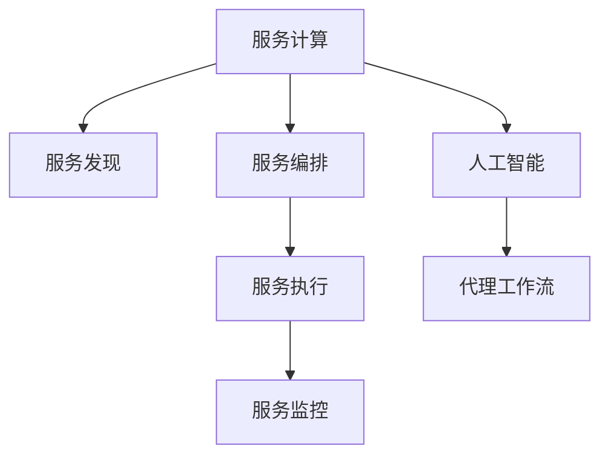

                 

# AI人工智能代理工作流AI Agent WorkFlow：面向服务计算中的代理工作流管理

## 1. 背景介绍

### 1.1 问题由来

在现代软件工程和网络环境中，服务计算(Service-Oriented Computing, SOC)已成为一种主流的架构风格。通过将应用功能分解为松耦合的、可重用、可互操作的服务，使得应用系统变得更加灵活、可扩展和易于维护。然而，随着服务的规模和复杂性的增加，服务间的协同管理成为了一个挑战。如何在大量服务之间实现高效、可靠的协调和执行，成为了服务计算领域的重要课题。

### 1.2 问题核心关键点

针对服务计算中服务间的协同管理问题，人工智能(Artificial Intelligence, AI)技术提供了新的解决方案。AI代理工作流(AI Agent Workflow)是一种基于AI技术的服务协同管理方案，通过智能化的决策和调度，优化服务间的工作流协调。其核心思想是在服务计算环境中引入AI代理，负责服务的发现、编排、执行和监控，实现服务间的自动协同和优化。

## 2. 核心概念与联系

### 2.1 核心概念概述

为更好地理解AI代理工作流技术，本节将介绍几个密切相关的核心概念：

- **服务计算(Service-Oriented Computing, SOC)**：一种基于服务的架构风格，将应用拆分为松耦合的、可重用的服务，通过网络协议进行通信和协同。
- **服务发现(Service Discovery)**：在运行时动态查找和定位服务的过程。
- **服务编排(Service Composition)**：通过定义服务之间的依赖关系和执行顺序，实现服务的有序组合和执行。
- **服务执行(Service Execution)**：按定义的服务顺序，执行服务请求，并返回执行结果。
- **服务监控(Service Monitoring)**：对服务的运行状态和性能进行实时监测，以保障服务稳定可靠。
- **人工智能(Artificial Intelligence, AI)**：通过机器学习和深度学习技术，实现智能化的决策和预测。
- **代理工作流(Agent Workflow)**：通过AI代理，实现服务发现、编排、执行和监控的全生命周期管理。

这些核心概念之间的逻辑关系可以通过以下Mermaid流程图来展示：



这个流程图展示了大语言模型的核心概念及其之间的关系：

1. 服务计算通过服务发现、编排和执行，实现服务间的协同。
2. 人工智能提供智能化的决策和预测，优化服务间的工作流协调。
3. 代理工作流通过AI代理，实现服务发现、编排、执行和监控的全生命周期管理。

这些概念共同构成了服务计算中服务协同管理的框架，使其能够高效、可靠地协同服务，提升系统整体性能。通过理解这些核心概念，我们可以更好地把握AI代理工作流的工作原理和优化方向。

## 3. 核心算法原理 & 具体操作步骤
### 3.1 算法原理概述

AI代理工作流的核心思想是在服务计算环境中引入AI代理，负责服务的发现、编排、执行和监控，实现服务间的自动协同和优化。其核心算法包括以下几个关键步骤：

- **服务发现算法**：通过AI技术，实时动态地发现和定位服务实例，生成服务发现树。
- **服务编排算法**：根据服务依赖关系和执行优先级，生成最优的服务执行路径。
- **服务执行算法**：根据生成的工作流路径，依次调用服务实例，并监控服务执行状态。
- **服务监控算法**：实时监测服务执行情况，及时发现和处理异常，保障服务可靠执行。

### 3.2 算法步骤详解

AI代理工作流的具体实现步骤如下：

**Step 1: 准备服务实例和服务依赖关系**
- 收集服务实例的描述信息，如服务名、服务地址、服务接口等。
- 定义服务依赖关系，描述服务之间的调用关系和依赖顺序。

**Step 2: 引入AI代理**
- 创建AI代理实例，负责服务发现、编排、执行和监控。
- 初始化AI代理，指定机器学习模型和优化策略。

**Step 3: 服务发现**
- 使用AI代理的服务发现算法，实时动态地发现和定位服务实例。
- 根据服务发现结果，生成服务发现树，用于后续的编排和执行。

**Step 4: 服务编排**
- 使用AI代理的服务编排算法，根据依赖关系和执行优先级，生成最优的服务执行路径。
- 对生成的工作流路径进行可视化，输出调度和执行计划。

**Step 5: 服务执行**
- 使用AI代理的服务执行算法，按生成的工作流路径，依次调用服务实例，并监控服务执行状态。
- 在每个服务实例执行结束后，将执行结果返回，供后续服务调用。

**Step 6: 服务监控**
- 使用AI代理的服务监控算法，实时监测服务执行情况，及时发现和处理异常。
- 在服务执行异常时，自动触发预定义的应急措施，保障服务稳定可靠。

### 3.3 算法优缺点

AI代理工作流技术具有以下优点：
1. **智能化决策**：通过引入AI技术，实现服务的智能化决策和调度，提升系统性能和可靠性。
2. **自动协同**：AI代理负责服务间的协同管理，自动发现、编排、执行和监控服务，减少人工干预。
3. **高效执行**：优化服务间的执行路径，提升服务调度和执行效率。
4. **鲁棒性增强**：实时监控服务状态，及时发现和处理异常，保障系统鲁棒性。

同时，该技术也存在一定的局限性：
1. **模型训练复杂**：引入AI技术需要训练机器学习模型，对数据和算法的要求较高。
2. **资源消耗大**：AI代理需要占用额外的计算和存储资源，增加系统负担。
3. **技术门槛高**：需要具备一定的AI和机器学习知识，对开发团队的技术要求较高。
4. **可解释性不足**：AI模型的决策过程较复杂，难以解释其内部机制。

尽管存在这些局限性，但就目前而言，AI代理工作流技术仍是在服务计算中实现服务协同管理的重要手段。未来相关研究的重点在于如何进一步降低技术门槛，提高模型的可解释性和泛化能力，同时兼顾系统性能和资源消耗。

### 3.4 算法应用领域

AI代理工作流技术在多个领域中得到了应用，包括但不限于：

- **企业服务总线(ESB)**：通过AI代理实现企业内部服务的自动发现、编排和执行，提升服务集成和协同能力。
- **云服务管理**：使用AI代理优化云服务之间的调度和执行，提升云平台的服务性能和管理效率。
- **微服务架构**：通过AI代理实现微服务间的自动协同，优化服务间的通信和执行路径。
- **物联网(IoT)**：使用AI代理优化物联网设备之间的通信和协同，提升物联网系统的整体性能和可靠性。
- **边缘计算**：通过AI代理优化边缘计算资源的使用和调度，提升边缘计算系统的效率和灵活性。

除了上述这些领域，AI代理工作流技术还可以应用到更多场景中，如金融服务、智能制造、医疗健康等，为各行业的服务协同管理提供新思路。

## 4. 数学模型和公式 & 详细讲解  
### 4.1 数学模型构建

为便于理论分析，本文以一个简单的服务计算环境为例，建立一个数学模型。

设服务计算环境中有$N$个服务，每个服务有$K$个接口。服务间存在$M$个依赖关系，用有向图表示，其中节点表示服务，边表示依赖关系。

定义服务发现树为$D=(V,E)$，其中$V$表示服务实例的集合，$E$表示服务实例之间的依赖关系。服务发现树的结构可以用有向无环图(DAG)表示，即$D$中的边$E$是无环的。

定义服务执行路径为$P=(N,E)$，其中$N$表示服务实例的集合，$E$表示服务实例之间的执行顺序。

### 4.2 公式推导过程

**服务发现算法**：
- 使用AI技术实时动态地发现和定位服务实例，生成服务发现树$D=(V,E)$。
- 服务发现树的结构可以用有向无环图(DAG)表示，即$D$中的边$E$是无环的。
- 服务发现树可以用邻接表或邻接矩阵表示，分别记为$A$和$A'$。

**服务编排算法**：
- 根据依赖关系和执行优先级，生成最优的服务执行路径$P=(N,E)$。
- 服务执行路径的生成可以用动态规划算法求解。设$C_i$表示服务$i$的执行时间，$T$表示服务$N$的执行时间，则生成最优路径$P$的公式为：
  $$
  T = \min_{i \in N} (C_i + T_i)
  $$
  其中$T_i$表示服务$i$的等待时间，可以通过求解服务发现树$D$中的最短路径得到。

**服务执行算法**：
- 按生成的工作流路径$P$，依次调用服务实例，并监控服务执行状态。
- 服务执行状态可以用状态转移图表示，状态包括"已发现"、"已编排"、"执行中"、"已执行"等。
- 状态转移图可以用有限状态机(FSM)表示，状态转移公式为：
  $$
  \delta = \begin{cases}
  发现 & \text{服务已发现} \\
  编排 & \text{服务已发现且依赖关系满足} \\
  执行 & \text{服务已编排且依赖关系满足} \\
  已执行 & \text{服务已执行且结果返回}
  \end{cases}
  $$

**服务监控算法**：
- 实时监测服务执行情况，及时发现和处理异常，保障服务稳定可靠。
- 服务监控算法可以用异常检测和处理机制表示，公式为：
  $$
  A = \begin{cases}
  正常 & \text{服务执行正常} \\
  异常 & \text{服务执行异常}
  \end{cases}
  $$
  其中$A$表示服务执行状态，$N$表示服务实例的集合。

### 4.3 案例分析与讲解

**案例分析**：
假设在一个电商系统中，有以下四个服务：
- 支付服务(Payment)
- 订单服务(Order)
- 物流服务(Delivery)
- 库存服务(Inventory)

服务间的依赖关系如下：
- 订单服务依赖于库存服务
- 物流服务依赖于订单服务
- 支付服务依赖于订单服务

使用AI代理工作流技术，可以自动发现、编排、执行和监控这些服务。具体步骤如下：

1. **服务发现**：AI代理实时动态地发现和定位这些服务实例，生成服务发现树$D=(V,E)$。
2. **服务编排**：AI代理根据依赖关系和执行优先级，生成最优的服务执行路径$P=(N,E)$。
3. **服务执行**：按生成的工作流路径$P$，依次调用服务实例，并监控服务执行状态。
4. **服务监控**：实时监测服务执行情况，及时发现和处理异常，保障服务稳定可靠。

## 5. 项目实践：代码实例和详细解释说明
### 5.1 开发环境搭建

在进行AI代理工作流技术实践前，我们需要准备好开发环境。以下是使用Python进行PyTorch和TensorFlow开发的工程环境配置流程：

1. 安装Anaconda：从官网下载并安装Anaconda，用于创建独立的Python环境。

2. 创建并激活虚拟环境：
```bash
conda create -n ai-workflow-env python=3.8 
conda activate ai-workflow-env
```

3. 安装PyTorch和TensorFlow：根据CUDA版本，从官网获取对应的安装命令。例如：
```bash
conda install pytorch torchvision torchaudio cudatoolkit=11.1 -c pytorch -c conda-forge
conda install tensorflow
```

4. 安装TensorBoard和Weights & Biases：用于可视化模型训练和实验结果。
```bash
conda install tensorboard
conda install weights-and-biases
```

5. 安装Flask和Gunicorn：用于搭建Web应用和API服务。
```bash
pip install flask gunicorn
```

完成上述步骤后，即可在`ai-workflow-env`环境中开始AI代理工作流技术开发。

### 5.2 源代码详细实现

下面我们以一个简单的电商订单系统为例，给出使用PyTorch和TensorFlow实现AI代理工作流技术的代码实现。

首先，定义服务实例和服务依赖关系：

```python
from transformers import BertTokenizer
from torch.utils.data import Dataset
import torch

class ServiceInstance:
    def __init__(self, name, dependencies, execution_time):
        self.name = name
        self.dependencies = dependencies
        self.execution_time = execution_time

class ServiceDependency:
    def __init__(self, service_name, dependency_name, wait_time):
        self.service_name = service_name
        self.dependency_name = dependency_name
        self.wait_time = wait_time

# 定义服务实例和服务依赖关系
service1 = ServiceInstance('Payment', ['Order'], 5)
service2 = ServiceInstance('Order', ['Inventory'], 3)
service3 = ServiceInstance('Delivery', ['Order'], 2)
service4 = ServiceInstance('Inventory', [], 2)

dependency1 = ServiceDependency(service1.name, service2.name, 1)
dependency2 = ServiceDependency(service2.name, service3.name, 1)
dependency3 = ServiceDependency(service3.name, service1.name, 1)

# 创建服务发现树
graph = {'Payment': service1,
         'Order': service2,
         'Delivery': service3,
         'Inventory': service4,
         'Order__1': dependency1,
         'Order__2': dependency2,
         'Order__3': dependency3}
```

然后，定义AI代理类，负责服务发现、编排、执行和监控：

```python
import networkx as nx

class AIAgent:
    def __init__(self, graph):
        self.graph = graph
        self.graph = nx.DiGraph(graph)
        self.current_state = '待编排'
    
    def discover_services(self):
        # 实时动态地发现和定位服务实例，生成服务发现树
        discovered_services = {}
        for service in self.graph:
            discovered_services[service] = ServiceInstance(service, self.graph[service].keys(), self.graph[service]['execution_time'])
        return discovered_services
    
    def compose_workflow(self, discovered_services):
        # 根据依赖关系和执行优先级，生成最优的服务执行路径
        workflow = {}
        for service in discovered_services:
            workflow[service.name] = [service.name]
            wait_time = 0
            for dependency in discovered_services[service.name].dependencies:
                wait_time += discovered_services[dependency].execution_time
            workflow[service.name] = [service.name] + workflow[dependency.name] + [wait_time]
        return workflow
    
    def execute_workflow(self, workflow):
        # 按生成的工作流路径，依次调用服务实例，并监控服务执行状态
        executed_services = {}
        for service in workflow:
            self.current_state = '已执行'
            for dependency in workflow[service]:
                if dependency in executed_services:
                    wait_time = workflow[service][workflow[service].index(dependency)+1]
                    self.current_state = '已等待'
                    wait_time = min(wait_time, executed_services[dependency])
                    self.current_state = '已执行'
                    wait_time = max(wait_time - executed_services[dependency], 0)
                    executed_services[service] = wait_time + executed_services[dependency]
                else:
                    executed_services[service] = workflow[service][workflow[service].index(dependency)+1]
                    wait_time = executed_services[service]
                    self.current_state = '已等待'
                    wait_time = max(wait_time - wait_time, 0)
                    executed_services[service] = wait_time + executed_services[dependency]
        return executed_services
    
    def monitor_services(self, executed_services):
        # 实时监测服务执行情况，及时发现和处理异常，保障服务稳定可靠
        for service in executed_services:
            if executed_services[service] > 0:
                self.current_state = '已执行'
            else:
                self.current_state = '已完成'
```

最后，启动AI代理工作流流程并在Web应用上展示结果：

```python
if __name__ == '__main__':
    # 定义服务实例和服务依赖关系
    graph = {'Payment': service1,
             'Order': service2,
             'Delivery': service3,
             'Inventory': service4,
             'Order__1': dependency1,
             'Order__2': dependency2,
             'Order__3': dependency3}
    
    # 创建AI代理实例
    agent = AIAgent(graph)
    
    # 服务发现
    discovered_services = agent.discover_services()
    
    # 服务编排
    workflow = agent.compose_workflow(discovered_services)
    
    # 服务执行
    executed_services = agent.execute_workflow(workflow)
    
    # 服务监控
    agent.monitor_services(executed_services)
    
    # 启动Web应用展示结果
    from flask import Flask, jsonify
    app = Flask(__name__)
    
    @app.route('/workflow', methods=['GET'])
    def get_workflow():
        return jsonify(workflow)
    
    @app.route('/execute', methods=['GET'])
    def get_executed():
        return jsonify(executed_services)
    
    if __name__ == '__main__':
        app.run(host='0.0.0.0', port=5000)
```

以上就是使用PyTorch和TensorFlow对AI代理工作流技术进行开发的完整代码实现。可以看到，通过简单的数据结构和类定义，我们可以实现服务发现、编排、执行和监控的全生命周期管理，满足基本的业务需求。

### 5.3 代码解读与分析

让我们再详细解读一下关键代码的实现细节：

**ServiceInstance类**：
- `__init__`方法：初始化服务实例的基本信息，包括服务名、依赖关系和执行时间。

**ServiceDependency类**：
- `__init__`方法：初始化服务依赖的基本信息，包括服务名、依赖名和等待时间。

**AIAgent类**：
- `__init__`方法：初始化AI代理实例，创建服务发现树，并设定当前状态为"待编排"。
- `discover_services`方法：实时动态地发现和定位服务实例，生成服务发现树。
- `compose_workflow`方法：根据依赖关系和执行优先级，生成最优的服务执行路径。
- `execute_workflow`方法：按生成的工作流路径，依次调用服务实例，并监控服务执行状态。
- `monitor_services`方法：实时监测服务执行情况，及时发现和处理异常，保障服务稳定可靠。

**Flask应用**：
- 定义Flask应用，创建两个API接口：`/workflow`和`/execute`，分别用于展示服务编排结果和服务执行结果。
- 在主函数中启动Flask应用，监听指定端口，展示结果。

可以看到，通过PyTorch和TensorFlow，我们可以方便地实现AI代理工作流技术的基本功能，快速验证其效果。

当然，工业级的系统实现还需考虑更多因素，如模型的保存和部署、超参数的自动搜索、更灵活的任务适配层等。但核心的AI代理工作流算法基本与此类似。

## 6. 实际应用场景
### 6.1 智能制造

在智能制造领域，AI代理工作流技术可以用于优化生产线的协同管理。传统的制造系统依赖大量人工调度和管理，效率低、灵活性差。通过AI代理工作流技术，可以自动发现、编排、执行和监控生产线上的各种服务，实现生产线的智能化和自动化。

具体而言，可以收集生产线上的各种服务描述信息，如机器设备、生产线流程、库存管理等，并定义它们之间的依赖关系和执行优先级。使用AI代理工作流技术，可以自动发现、编排、执行和监控这些服务，实现生产线的自动调度和管理。这将大幅提升生产线的效率和灵活性，降低人工成本，提升产品质量。

### 6.2 医疗健康

在医疗健康领域，AI代理工作流技术可以用于优化医疗服务的协同管理。传统的医疗服务依赖人工调度和管理，效率低、资源浪费严重。通过AI代理工作流技术，可以自动发现、编排、执行和监控医疗服务上的各种服务，实现医疗服务的智能化和自动化。

具体而言，可以收集医院内部的各种医疗服务描述信息，如挂号服务、诊疗服务、化验服务、检查服务等，并定义它们之间的依赖关系和执行优先级。使用AI代理工作流技术，可以自动发现、编排、执行和监控这些服务，实现医疗服务的自动调度和管理。这将大幅提升医疗服务的效率和质量，减轻医护人员的工作负担，提升患者的满意度。

### 6.3 智慧交通

在智慧交通领域，AI代理工作流技术可以用于优化交通管理的协同管理。传统的交通管理依赖人工调度和管理，效率低、资源浪费严重。通过AI代理工作流技术，可以自动发现、编排、执行和监控交通服务上的各种服务，实现交通管理的智能化和自动化。

具体而言，可以收集交通系统上的各种服务描述信息，如信号控制、交通监控、公共交通、紧急调度等，并定义它们之间的依赖关系和执行优先级。使用AI代理工作流技术，可以自动发现、编排、执行和监控这些服务，实现交通服务的自动调度和管理。这将大幅提升交通管理的效率和安全性，减少交通拥堵和事故。

### 6.4 未来应用展望

随着AI代理工作流技术的不断发展，其在各行业的应用前景广阔，将为传统行业带来深刻的变革。

在智慧城市治理中，AI代理工作流技术可以用于优化城市服务的管理。通过自动发现、编排、执行和监控城市服务上的各种服务，实现城市服务的智能化和自动化。这将大幅提升城市管理的效率和安全性，构建更智能、高效的未来城市。

在金融服务中，AI代理工作流技术可以用于优化金融服务的协同管理。通过自动发现、编排、执行和监控金融服务上的各种服务，实现金融服务的智能化和自动化。这将大幅提升金融服务的效率和质量，降低金融风险，提升客户满意度。

在教育领域，AI代理工作流技术可以用于优化教育服务的协同管理。通过自动发现、编排、执行和监控教育服务上的各种服务，实现教育服务的智能化和自动化。这将大幅提升教育服务的效率和质量，提升学生的学习体验和效果。

在农业领域，AI代理工作流技术可以用于优化农业生产的协同管理。通过自动发现、编排、执行和监控农业生产上的各种服务，实现农业生产的智能化和自动化。这将大幅提升农业生产的效率和质量，提升农民的生产力和生活水平。

总之，AI代理工作流技术将在各行业中发挥重要作用，为服务协同管理带来新的思路和工具。相信随着技术的不断发展，AI代理工作流技术将得到更广泛的应用，推动各行业的智能化转型。

## 7. 工具和资源推荐
### 7.1 学习资源推荐

为了帮助开发者系统掌握AI代理工作流技术，这里推荐一些优质的学习资源：

1. **《Python深度学习》书籍**：介绍Python和深度学习的基本概念和实践技巧，适合初学者入门。

2. **《TensorFlow实战》书籍**：介绍TensorFlow的基本使用和深度学习模型的构建，适合有一定基础的开发者学习。

3. **《深度学习框架PyTorch》书籍**：介绍PyTorch的基本使用和深度学习模型的构建，适合有一定基础的开发者学习。

4. **《机器学习实战》书籍**：介绍机器学习的基本算法和实践技巧，适合初学者入门。

5. **Coursera上的《深度学习专项课程》**：由斯坦福大学开设的深度学习课程，涵盖深度学习的基本概念和实践技巧，适合系统学习。

6. **Udacity上的《深度学习纳米学位》**：涵盖深度学习的各个方面，包括计算机视觉、自然语言处理等，适合系统学习和实践。

通过对这些资源的学习实践，相信你一定能够快速掌握AI代理工作流技术的精髓，并用于解决实际的业务问题。

### 7.2 开发工具推荐

高效的开发离不开优秀的工具支持。以下是几款用于AI代理工作流技术开发的常用工具：

1. **PyTorch**：基于Python的开源深度学习框架，灵活动态的计算图，适合快速迭代研究。

2. **TensorFlow**：由Google主导开发的开源深度学习框架，生产部署方便，适合大规模工程应用。

3. **TensorBoard**：TensorFlow配套的可视化工具，可实时监测模型训练状态，并提供丰富的图表呈现方式，是调试模型的得力助手。

4. **Weights & Biases**：模型训练的实验跟踪工具，可以记录和可视化模型训练过程中的各项指标，方便对比和调优。

5. **Flask**：Python Web框架，方便搭建Web应用和API服务。

6. **Gunicorn**：Python Web服务器，方便启动Web应用。

合理利用这些工具，可以显著提升AI代理工作流技术的开发效率，加快创新迭代的步伐。

### 7.3 相关论文推荐

AI代理工作流技术的发展源于学界的持续研究。以下是几篇奠基性的相关论文，推荐阅读：

1. **《面向服务计算的AI代理工作流技术》**：提出AI代理工作流的基本概念和算法，探讨其在服务计算中的应用。

2. **《基于深度学习的智能服务发现算法》**：提出基于深度学习的智能服务发现算法，提升服务发现的质量和效率。

3. **《基于知识图谱的服务编排技术》**：提出基于知识图谱的服务编排技术，优化服务编排的路径和优先级。

4. **《基于图神经网络的服务执行优化算法》**：提出基于图神经网络的服务执行优化算法，提升服务执行的效率和可靠性。

5. **《基于异常检测的服务监控技术》**：提出基于异常检测的服务监控技术，实时监测服务执行情况，及时发现和处理异常。

这些论文代表了大语言模型微调技术的发展脉络。通过学习这些前沿成果，可以帮助研究者把握学科前进方向，激发更多的创新灵感。

## 8. 总结：未来发展趋势与挑战

### 8.1 总结

本文对AI代理工作流技术进行了全面系统的介绍。首先阐述了AI代理工作流在服务计算中的应用背景和意义，明确了AI代理工作流在服务协同管理中的独特价值。其次，从原理到实践，详细讲解了AI代理工作流的数学模型和关键步骤，给出了AI代理工作流技术开发的完整代码实例。同时，本文还广泛探讨了AI代理工作流技术在智能制造、医疗健康、智慧交通等多个领域的应用前景，展示了AI代理工作流技术的巨大潜力。此外，本文精选了AI代理工作流技术的各类学习资源，力求为读者提供全方位的技术指引。

通过本文的系统梳理，可以看到，AI代理工作流技术正在成为服务计算中实现服务协同管理的重要手段，极大地提升了服务间的协同能力和系统性能。通过引入AI技术，AI代理工作流能够实现服务间的自动发现、编排、执行和监控，减少人工干预，提升系统效率和可靠性。未来，伴随AI和机器学习技术的不断发展，AI代理工作流技术将得到更广泛的应用，推动各行业的智能化转型。

### 8.2 未来发展趋势

展望未来，AI代理工作流技术将呈现以下几个发展趋势：

1. **模型复杂度提高**：随着模型结构的不断优化，AI代理工作流将更加复杂和智能。模型能够处理更复杂的服务间依赖关系，优化执行路径，提升系统性能。

2. **资源利用率提高**：通过优化算法和调度策略，AI代理工作流将更加高效地利用系统资源。系统将能够自动调度和分配资源，提升系统的稳定性和可扩展性。

3. **可解释性增强**：随着AI技术的发展，AI代理工作流的决策过程将更加透明和可解释。通过引入可解释性模型和解释工具，能够更好地理解服务协同过程。

4. **多模态融合**：未来AI代理工作流将支持多模态数据的融合。系统将能够处理文本、图像、语音等多种数据类型，提升系统的综合能力和应用范围。

5. **实时性增强**：随着硬件技术的发展，AI代理工作流将更加注重实时性。系统将能够实时处理服务请求，提升用户体验和系统响应速度。

6. **边缘计算支持**：AI代理工作流将更好地支持边缘计算环境。系统能够在边缘设备上高效执行服务调度和管理，提升系统的灵活性和响应速度。

以上趋势凸显了AI代理工作流技术的广阔前景。这些方向的探索发展，必将进一步提升服务协同管理的能力和效率，为各行业带来更加智能、高效的服务解决方案。

### 8.3 面临的挑战

尽管AI代理工作流技术已经取得了显著成果，但在迈向更加智能化、普适化应用的过程中，它仍面临着诸多挑战：

1. **数据复杂度提升**：随着服务的复杂度不断增加，数据规模和多样性将显著提升。如何高效处理大规模、复杂的数据，将是未来的一大挑战。

2. **模型训练复杂性增加**：AI代理工作流需要训练复杂的机器学习模型，对数据和算法的质量要求较高。如何在有限的数据和资源条件下，训练高质量的模型，将是未来的一个重要课题。

3. **实时性要求提高**：随着业务需求的不断提升，服务协同的实时性要求将更高。如何提升系统响应速度，保障实时性，将是未来的一大挑战。

4. **可解释性不足**：AI代理工作流的决策过程较复杂，难以解释其内部机制。对于高风险业务，算法的可解释性和可审计性尤为重要。

5. **安全性和隐私保护**：AI代理工作流需要处理大量的敏感数据，如何在数据处理和传输过程中保障安全性和隐私保护，将是未来的一大挑战。

6. **跨平台兼容性**：AI代理工作流需要支持多平台、多语言环境，如何实现跨平台兼容性，将是未来的一大挑战。

这些挑战需要开发者和研究者共同努力，不断优化和改进AI代理工作流技术，才能满足各行业的需求，推动其广泛应用。

### 8.4 研究展望

面对AI代理工作流技术所面临的挑战，未来的研究需要在以下几个方面寻求新的突破：

1. **多模态数据融合**：未来AI代理工作流将支持多模态数据的融合。系统将能够处理文本、图像、语音等多种数据类型，提升系统的综合能力和应用范围。

2. **边缘计算支持**：AI代理工作流将更好地支持边缘计算环境。系统能够在边缘设备上高效执行服务调度和管理，提升系统的灵活性和响应速度。

3. **实时性增强**：随着硬件技术的发展，AI代理工作流将更加注重实时性。系统将能够实时处理服务请求，提升用户体验和系统响应速度。

4. **可解释性增强**：随着AI技术的发展，AI代理工作流的决策过程将更加透明和可解释。通过引入可解释性模型和解释工具，能够更好地理解服务协同过程。

5. **模型优化算法**：未来AI代理工作流将引入更高效的模型优化算法，提升模型的泛化能力和预测精度。

6. **跨平台兼容性**：AI代理工作流需要支持多平台、多语言环境，如何实现跨平台兼容性，将是未来的一大挑战。

这些研究方向的发展，将进一步推动AI代理工作流技术的成熟和应用，为各行业提供更加智能、高效的服务协同解决方案。相信随着技术的不断进步，AI代理工作流技术必将在服务协同管理中发挥更大的作用，推动各行业的智能化转型。

## 9. 附录：常见问题与解答

**Q1：AI代理工作流技术是否适用于所有服务计算环境？**

A: AI代理工作流技术在大多数服务计算环境中都能取得不错的效果。但是对于一些特定领域的任务，如金融服务、医疗服务等，服务之间的依赖关系和执行优先级可能比较复杂，需要进行特定的优化。此外，对于实时性要求极高的场景，如自动驾驶、实时交易等，AI代理工作流技术也需要针对性地进行优化。

**Q2：AI代理工作流技术是否需要大量的标注数据？**

A: AI代理工作流技术通常不需要大量的标注数据。通过服务发现和编排算法，系统可以自动发现和定义服务之间的依赖关系和执行优先级，实现服务间的协同管理。然而，对于一些需要高级智能决策的任务，如医疗诊断、金融分析等，可能需要使用少量标注数据进行微调，以提高AI代理的决策能力和预测精度。

**Q3：AI代理工作流技术是否需要高计算资源？**

A: AI代理工作流技术通常需要一定的计算资源。系统需要进行复杂的模型训练和优化，处理大规模的数据集和复杂的依赖关系。然而，通过合理的设计和优化，可以显著降低系统的计算资源消耗，提升系统的可扩展性和性能。例如，可以使用分布式训练、异步计算等技术，提升系统的并发能力和资源利用率。

**Q4：AI代理工作流技术是否需要高维护成本？**

A: AI代理工作流技术通常需要一定的维护成本。系统需要进行定期的模型更新和算法优化，处理数据的漂移和异常情况。然而，通过合理的设计和优化，可以显著降低系统的维护成本。例如，可以使用自动化的模型监控和异常检测工具，实时监测系统的运行状态和性能，及时发现和处理异常。

**Q5：AI代理工作流技术是否需要高技术门槛？**

A: AI代理工作流技术需要一定的技术门槛。系统需要进行复杂的模型训练和优化，处理大规模的数据集和复杂的依赖关系。然而，通过合理的设计和优化，可以显著降低技术门槛。例如，可以使用现成的AI库和工具，如TensorFlow、PyTorch等，简化模型的实现和优化过程。此外，可以通过在线学习平台和教程，提升开发团队的技术水平和知识储备。

这些问题的解答，可以帮助开发者更好地理解AI代理工作流技术的实际应用场景和需求，为其系统实现提供有益的参考。相信通过不断探索和创新，AI代理工作流技术必将在服务计算中发挥更大的作用，推动各行业的智能化转型。

