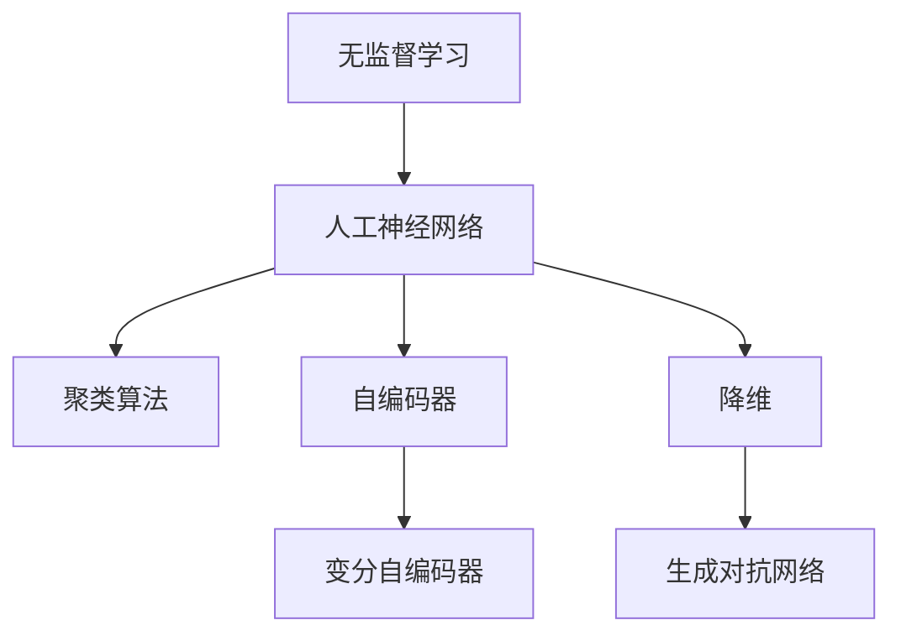

                 

# AI人工智能核心算法原理与代码实例讲解：无监督学习

> 关键词：无监督学习,人工神经网络,聚类算法,自编码器,变分自编码器,降维,生成对抗网络(GAN)

## 1. 背景介绍

### 1.1 问题由来
在机器学习中，无监督学习(Unsupervised Learning)是数据驱动学习的一个重要分支。与有监督学习(Supervised Learning)不同，无监督学习不需要标注数据，它通过数据本身的特征进行学习，目标是发现数据中的潜在结构、模式和规律。由于无监督学习不需要标注数据，数据获取成本较低，且可以在不知道具体任务的情况下进行模式发现，因此在现实世界中被广泛应用。

无监督学习的核心思想是“学习数据的分布”，通过数据本身的特征进行学习，发现数据之间的内在关联和规律。常见的无监督学习方法包括聚类算法、自编码器、变分自编码器、降维技术、生成对抗网络(GAN)等。这些方法在图像处理、自然语言处理、推荐系统等领域均有广泛应用。

### 1.2 问题核心关键点
无监督学习在现实世界中的广泛应用，得益于其无需标注数据的优势。然而，相较于有监督学习，无监督学习的学习目标和评估指标较为模糊，如何有效评估学习效果、优化模型性能，仍是无监督学习领域面临的主要挑战。

无监督学习的关键在于选择合适的算法和模型架构，并根据具体任务选择合适的优化目标和损失函数。常见的优化目标包括重构误差、相似度、密度等。无监督学习的另一个核心问题是如何避免过拟合，以及如何通过特征学习提升模型的泛化能力。

## 2. 核心概念与联系

### 2.1 核心概念概述

为更好地理解无监督学习，本节将介绍几个关键的无监督学习概念：

- 无监督学习(Unsupervised Learning)：不需要标注数据，通过数据本身的特征进行学习，发现数据中的潜在结构、模式和规律。
- 人工神经网络(Artificial Neural Network, ANN)：模拟人脑神经元处理信息的方式，通过多层非线性变换进行数据建模。
- 聚类算法(Clustering Algorithm)：将数据分为若干类，使得同一类内的数据相似度较高，不同类之间的数据相似度较低。
- 自编码器(Autoencoder)：通过降维将高维数据压缩到低维空间，再通过解码器将低维数据重构到高维空间，学习数据的内在表示。
- 变分自编码器(Variational Autoencoder, VAE)：通过变分推断方法，学习数据的高维隐变量的分布，生成新的数据。
- 降维(Dimensionality Reduction)：将高维数据压缩到低维空间，保留关键信息，降低计算复杂度。
- 生成对抗网络(Generative Adversarial Network, GAN)：通过两个对抗的神经网络，一个生成样本，一个进行判别，不断优化生成样本的质量。

这些核心概念之间的逻辑关系可以通过以下Mermaid流程图来展示：



这个流程图展示了无监督学习的核心概念及其之间的关系：

1. 无监督学习是数据驱动学习的一个重要分支。
2. 人工神经网络是无监督学习的主要工具，通过多层非线性变换进行数据建模。
3. 聚类算法、自编码器、变分自编码器、降维技术等，都是基于神经网络的无监督学习方法。
4. 生成对抗网络是一种特殊的无监督学习方法，通过对抗训练提升生成样本的质量。

这些概念共同构成了无监督学习的学习和应用框架，使其能够在各种场景下发挥强大的数据建模能力。通过理解这些核心概念，我们可以更好地把握无监督学习的原理和优化方向。

## 3. 核心算法原理 & 具体操作步骤
### 3.1 算法原理概述

无监督学习的核心思想是通过数据本身的特征进行学习，发现数据中的潜在结构、模式和规律。常见的方法包括聚类算法、自编码器、变分自编码器、降维技术等。

**聚类算法**：将数据分为若干类，使得同一类内的数据相似度较高，不同类之间的数据相似度较低。常见的聚类算法包括K-means、层次聚类、DBSCAN等。

**自编码器**：通过降维将高维数据压缩到低维空间，再通过解码器将低维数据重构到高维空间，学习数据的内在表示。自编码器可以用于特征提取、异常检测等任务。

**变分自编码器(VAE)**：通过变分推断方法，学习数据的高维隐变量的分布，生成新的数据。VAE可以用于生成对抗网络、数据增强等任务。

**降维技术**：将高维数据压缩到低维空间，保留关键信息，降低计算复杂度。常见的降维技术包括PCA、t-SNE、LLE等。

**生成对抗网络(GAN)**：通过两个对抗的神经网络，一个生成样本，一个进行判别，不断优化生成样本的质量。GAN可以用于图像生成、数据增强等任务。

### 3.2 算法步骤详解

无监督学习的方法各不相同，但一般包括以下几个关键步骤：

**Step 1: 准备数据集**
- 收集原始数据，包括文本、图像、音频等。
- 清洗和预处理数据，如去除噪声、缺失值处理、归一化等。

**Step 2: 选择合适的无监督算法**
- 根据任务类型和数据特征，选择合适的无监督算法。
- 对于聚类任务，可选择K-means、层次聚类、DBSCAN等算法。
- 对于特征学习任务，可选择自编码器、VAE等算法。
- 对于生成任务，可选择GAN等算法。

**Step 3: 设置算法参数**
- 设置算法的超参数，如学习率、迭代次数、正则化系数等。
- 对于自编码器，需要确定编码器和解码器的结构、正则化参数等。
- 对于VAE，需要确定隐变量维数、采样噪声标准差等。

**Step 4: 执行训练**
- 将数据集划分为训练集和测试集。
- 在训练集上执行无监督算法，不断迭代优化模型参数。
- 在测试集上评估模型效果，检查模型泛化能力。

**Step 5: 模型评估**
- 使用评价指标评估模型效果，如聚类算法中的类内相似度、类间相似度等。
- 对于自编码器、VAE等特征学习算法，评估重构误差、生成样本质量等。
- 对于GAN等生成算法，评估生成样本的真实性、多样性等。

**Step 6: 应用部署**
- 将训练好的模型应用于实际问题中，如图像分类、用户画像、推荐系统等。
- 不断收集反馈，调整模型参数和算法超参数，优化模型效果。

以上是无监督学习的一般流程。在实际应用中，还需要针对具体任务的特点，对无监督算法和模型进行优化设计，如改进训练目标函数，引入更多的正则化技术，搜索最优的超参数组合等，以进一步提升模型性能。

### 3.3 算法优缺点

无监督学习具有以下优点：
1. 数据获取成本低。无监督学习不需要标注数据，数据获取成本较低，适合大规模数据集的处理。
2. 数据探索能力强。无监督学习能够自动发现数据中的潜在结构、模式和规律，适合未知领域的数据探索。
3. 模型泛化能力强。无监督学习可以发现数据中隐含的特征，提高模型的泛化能力。

同时，无监督学习也存在一定的局限性：
1. 效果评估困难。无监督学习的效果评估较为困难，难以量化评估模型性能。
2. 算法复杂度高。无监督算法通常较为复杂，计算复杂度高，需要更多的计算资源。
3. 数据噪声敏感。无监督算法对数据噪声敏感，需要较高的数据质量才能获得理想的效果。
4. 无法解释。无监督学习模型通常难以解释，难以理解其内部工作机制。

尽管存在这些局限性，但就目前而言，无监督学习仍然是数据驱动学习的重要分支，具有广泛的应用前景。未来相关研究的重点在于如何进一步降低算法复杂度，提高模型解释性，以及如何更有效地应用于复杂场景。

### 3.4 算法应用领域

无监督学习在数据驱动学习中具有广泛的应用场景，覆盖了数据处理、特征提取、异常检测、生成模型等诸多领域：

- 图像处理：图像分割、特征提取、异常检测等。
- 自然语言处理：文本聚类、主题建模、情感分析等。
- 推荐系统：用户画像、商品关联推荐、内容推荐等。
- 金融风控：信用评分、风险评估、欺诈检测等。
- 医疗健康：疾病预测、基因分析、患者分群等。
- 环境监测：气象预测、水文分析、灾害预警等。

此外，无监督学习还被广泛应用于工业界的各种复杂场景，如图像增强、语音识别、智能制造等，为人工智能技术带来了新的突破。随着无监督算法的不断演进，相信其在数据驱动学习中的应用将更加广泛和深入。

## 4. 数学模型和公式 & 详细讲解
### 4.1 数学模型构建

本节将使用数学语言对无监督学习的核心算法进行更加严格的刻画。

### 4.2 公式推导过程

以自编码器为例，推导其数学模型和训练过程。

**自编码器模型**：假设输入数据 $x$ 为高维向量，编码器 $E$ 将其映射到低维空间 $z$，解码器 $D$ 将低维向量 $z$ 重构回高维向量 $\hat{x}$。自编码器的目标是最小化重构误差 $J(x)$：

$$
J(x) = ||x - \hat{x}||^2
$$

其中 $||.||$ 表示向量的范数。通过反向传播算法，可以计算自编码器各层神经元对 $J(x)$ 的梯度，更新模型参数 $\theta$。

### 4.3 案例分析与讲解

**K-means算法**：K-means算法是一种经典的聚类算法，通过将数据点分配到K个类中，使得同一类内的数据相似度较高，不同类之间的数据相似度较低。具体算法步骤如下：

1. 随机选择K个初始质心 $\mu_i$。
2. 对每个数据点 $x_i$，计算其到K个质心的距离，分配到距离最近的质心对应的类中。
3. 计算每个类的质心 $\mu_i = \frac{1}{n_i} \sum_{x_j \in C_i} x_j$，其中 $n_i$ 表示类 $C_i$ 中数据点的数量。
4. 重复步骤2-3，直到质心不再变化或达到预设的迭代次数。

K-means算法的时间复杂度为 $O(Kn)$，适用于数据量较大的场景。然而，K-means算法对初始质心的选择敏感，可能会陷入局部最优解。

**VAE模型**：变分自编码器通过变分推断方法，学习数据的高维隐变量的分布。具体模型结构如下：

$$
z \sim q(z|x) \\
\hat{x} = D(z) \\
p(x) = \mathcal{N}(x|\mu, \Sigma) \\
q(z) = \mathcal{N}(z|\mu, \Sigma) 
$$

其中，$z$ 为隐变量，$\hat{x}$ 为重构后的数据，$\mu$ 和 $\Sigma$ 为隐变量的均值和方差。VAE的目标是最小化重构误差和隐变量分布的KL散度：

$$
\min_{\mu, \Sigma} D_{KL}(q(z|x) || p(z)) + ||x - \hat{x}||^2
$$

通过反向传播算法，可以计算VAE各层神经元对上述目标函数的梯度，更新模型参数。VAE具有较好的生成能力，可以用于生成对抗网络、数据增强等任务。

## 5. 项目实践：代码实例和详细解释说明
### 5.1 开发环境搭建

在进行无监督学习实践前，我们需要准备好开发环境。以下是使用Python进行PyTorch开发的环境配置流程：

1. 安装Anaconda：从官网下载并安装Anaconda，用于创建独立的Python环境。

2. 创建并激活虚拟环境：
```bash
conda create -n pytorch-env python=3.8 
conda activate pytorch-env
```

3. 安装PyTorch：根据CUDA版本，从官网获取对应的安装命令。例如：
```bash
conda install pytorch torchvision torchaudio cudatoolkit=11.1 -c pytorch -c conda-forge
```

4. 安装TensorFlow：由Google主导开发的开源深度学习框架，生产部署方便，适合大规模工程应用。同样有丰富的预训练语言模型资源。

5. 安装各类工具包：
```bash
pip install numpy pandas scikit-learn matplotlib tqdm jupyter notebook ipython
```

完成上述步骤后，即可在`pytorch-env`环境中开始无监督学习实践。

### 5.2 源代码详细实现

这里我们以自编码器为例，给出使用PyTorch实现的无监督学习代码。

首先，定义自编码器的编码器和解码器：

```python
import torch
import torch.nn as nn

class Encoder(nn.Module):
    def __init__(self, input_dim, latent_dim):
        super(Encoder, self).__init__()
        self.fc1 = nn.Linear(input_dim, latent_dim)
        self.fc2 = nn.Linear(latent_dim, latent_dim)
        self.fc3 = nn.Linear(latent_dim, input_dim)
    
    def forward(self, x):
        x = torch.relu(self.fc1(x))
        x = torch.relu(self.fc2(x))
        x = self.fc3(x)
        return x

class Decoder(nn.Module):
    def __init__(self, input_dim, latent_dim):
        super(Decoder, self).__init__()
        self.fc1 = nn.Linear(latent_dim, latent_dim)
        self.fc2 = nn.Linear(latent_dim, latent_dim)
        self.fc3 = nn.Linear(latent_dim, input_dim)
    
    def forward(self, x):
        x = torch.relu(self.fc1(x))
        x = torch.relu(self.fc2(x))
        x = torch.sigmoid(self.fc3(x))
        return x
```

然后，定义自编码器的损失函数和优化器：

```python
class Autoencoder(nn.Module):
    def __init__(self, input_dim, latent_dim):
        super(Autoencoder, self).__init__()
        self.encoder = Encoder(input_dim, latent_dim)
        self.decoder = Decoder(latent_dim, input_dim)
    
    def forward(self, x):
        encoded = self.encoder(x)
        decoded = self.decoder(encoded)
        return decoded
    
    def loss(self, x):
        encoded = self.encoder(x)
        decoded = self.decoder(encoded)
        return nn.MSELoss()(x, decoded)
```

接着，定义训练和评估函数：

```python
def train_epoch(model, optimizer, loss_fn, data_loader):
    model.train()
    epoch_loss = 0
    for batch in data_loader:
        optimizer.zero_grad()
        output = model(batch)
        loss = loss_fn(output, batch)
        loss.backward()
        optimizer.step()
        epoch_loss += loss.item()
    return epoch_loss / len(data_loader)
    
def evaluate(model, loss_fn, data_loader):
    model.eval()
    test_loss = 0
    for batch in data_loader:
        with torch.no_grad():
            output = model(batch)
            loss = loss_fn(output, batch)
            test_loss += loss.item()
    return test_loss / len(data_loader)
```

最后，启动训练流程并在测试集上评估：

```python
epochs = 10
batch_size = 32
learning_rate = 0.001

model = Autoencoder(input_dim=784, latent_dim=64)
optimizer = torch.optim.Adam(model.parameters(), lr=learning_rate)

train_loader = torch.utils.data.DataLoader(torchvision.datasets.MNIST('mnist/', train=True, download=True, transform=torchvision.transforms.ToTensor()), batch_size=batch_size)
test_loader = torch.utils.data.DataLoader(torchvision.datasets.MNIST('mnist/', train=False, transform=torchvision.transforms.ToTensor()), batch_size=batch_size)

for epoch in range(epochs):
    train_loss = train_epoch(model, optimizer, model.loss, train_loader)
    print(f"Epoch {epoch+1}, train loss: {train_loss:.3f}")
    
    print(f"Epoch {epoch+1}, test loss: {evaluate(model, model.loss, test_loader):.3f}")
```

以上就是使用PyTorch实现自编码器的完整代码实现。可以看到，得益于PyTorch的强大封装，我们可以用相对简洁的代码完成自编码器的训练。

### 5.3 代码解读与分析

让我们再详细解读一下关键代码的实现细节：

**Encoder类**：
- `__init__`方法：定义编码器的网络结构。
- `forward`方法：将输入数据经过多层非线性变换，输出编码后的低维向量。

**Decoder类**：
- `__init__`方法：定义解码器的网络结构。
- `forward`方法：将编码后的低维向量经过多层非线性变换，输出重构后的高维向量。

**Autoencoder类**：
- `__init__`方法：定义自编码器的网络结构。
- `forward`方法：将输入数据经过编码器编码后，再经过解码器解码，输出重构后的高维向量。
- `loss`方法：定义自编码器的损失函数，即重构误差。

**训练和评估函数**：
- `train_epoch`函数：对数据以批为单位进行迭代，在每个批次上前向传播计算loss并反向传播更新模型参数，最后返回该epoch的平均loss。
- `evaluate`函数：与训练类似，不同点在于不更新模型参数，并在每个batch结束后将预测和标签结果存储下来，最后使用损失函数对整个测试集的预测结果进行评估。

**训练流程**：
- 定义总的epoch数、batch size和学习率，开始循环迭代
- 每个epoch内，先在训练集上训练，输出平均loss
- 在测试集上评估，输出平均loss

可以看到，PyTorch配合PyTorch的强大封装，使得无监督学习的代码实现变得简洁高效。开发者可以将更多精力放在数据处理、模型改进等高层逻辑上，而不必过多关注底层的实现细节。

当然，工业级的系统实现还需考虑更多因素，如模型的保存和部署、超参数的自动搜索、更灵活的任务适配层等。但核心的无监督学习范式基本与此类似。

## 6. 实际应用场景
### 6.1 图像处理

无监督学习在图像处理中具有广泛的应用，可以用于图像分割、特征提取、异常检测等任务。

**图像分割**：使用K-means算法对图像像素进行聚类，将相似像素分为同一类别，可以用于图像分割、图像分类等任务。

**特征提取**：使用自编码器对图像进行降维，保留关键信息，可以用于图像检索、图像压缩等任务。

**异常检测**：使用自编码器对图像进行重构，检测重构误差较大的图像，可以用于图像去噪、图像修复等任务。

### 6.2 自然语言处理

无监督学习在自然语言处理中也具有广泛的应用，可以用于文本聚类、主题建模、情感分析等任务。

**文本聚类**：使用K-means算法对文本进行聚类，将相似文本分为同一类别，可以用于文本分类、信息检索等任务。

**主题建模**：使用LDA算法对文本进行主题建模，发现文本中的主题分布，可以用于文本分类、推荐系统等任务。

**情感分析**：使用情感词典和无监督学习算法对文本进行情感分析，识别文本情感倾向，可以用于舆情监测、用户画像等任务。

### 6.3 推荐系统

无监督学习在推荐系统中也有广泛应用，可以用于用户画像、商品关联推荐、内容推荐等任务。

**用户画像**：使用K-means算法对用户行为数据进行聚类，发现用户兴趣点，可以用于个性化推荐、用户分析等任务。

**商品关联推荐**：使用协同过滤算法对商品进行关联推荐，发现用户喜好商品之间的关联关系，可以用于推荐系统、广告投放等任务。

**内容推荐**：使用自编码器对文本进行降维，发现文本相似度，可以用于推荐系统、内容分析等任务。

### 6.4 未来应用展望

随着无监督学习算法的不断演进，其在数据驱动学习中的应用将更加广泛和深入。未来无监督学习有望在以下几个方面取得新的突破：

**深度学习**：未来无监督学习将结合深度学习，进一步提高模型的表达能力和泛化能力。

**多模态学习**：未来无监督学习将结合多模态学习，处理视觉、语音、文本等多种模态的数据，提升模型的跨模态学习能力。

**自动化学习**：未来无监督学习将结合自动化学习，实现更加高效、灵活的无监督学习范式，适用于更加复杂的场景。

**联邦学习**：未来无监督学习将结合联邦学习，在多个分布式设备上共同学习，保护数据隐私的同时提升模型效果。

**可解释性**：未来无监督学习将结合可解释性技术，赋予模型更强的可解释性和可理解性，提升模型的可信度和可控性。

**自适应学习**：未来无监督学习将结合自适应学习，根据数据分布的变化，动态调整模型参数，提升模型的适应性。

这些研究方向的探索，必将引领无监督学习技术迈向更高的台阶，为人工智能技术的发展带来新的突破。相信随着算法的不断演进和技术的不断成熟，无监督学习必将在更多领域得到应用，为人类认知智能的进化带来深远影响。

## 7. 工具和资源推荐
### 7.1 学习资源推荐

为了帮助开发者系统掌握无监督学习理论基础和实践技巧，这里推荐一些优质的学习资源：

1. 《深度学习》书籍：由Ian Goodfellow、Yoshua Bengio、Aaron Courville合著，全面介绍了深度学习的基本概念和核心算法，包括无监督学习。

2. CS231n《深度学习与计算机视觉》课程：斯坦福大学开设的计算机视觉明星课程，涉及无监督学习、自编码器等核心内容。

3. 《模式识别与机器学习》书籍：由Christopher M. Bishop撰写，介绍了模式识别、机器学习的基本理论和方法，包括无监督学习。

4. HuggingFace官方文档：Transformers库的官方文档，提供了丰富的无监督学习算法和模型资源，是上手实践的必备资料。

5. Kaggle平台：提供各类无监督学习竞赛和数据集，适合初学者进行实践和挑战。

通过对这些资源的学习实践，相信你一定能够快速掌握无监督学习的精髓，并用于解决实际的机器学习问题。

### 7.2 开发工具推荐

高效的开发离不开优秀的工具支持。以下是几款用于无监督学习开发的常用工具：

1. PyTorch：基于Python的开源深度学习框架，灵活动态的计算图，适合快速迭代研究。适用于各类深度学习任务，包括无监督学习。

2. TensorFlow：由Google主导开发的开源深度学习框架，生产部署方便，适合大规模工程应用。同样适用于无监督学习任务。

3. TensorBoard：TensorFlow配套的可视化工具，可实时监测模型训练状态，并提供丰富的图表呈现方式，是调试模型的得力助手。

4. Jupyter Notebook：交互式编程环境，支持多种编程语言，适合进行无监督学习的研究和实验。

5. Weights & Biases：模型训练的实验跟踪工具，可以记录和可视化模型训练过程中的各项指标，方便对比和调优。

6. Google Colab：谷歌推出的在线Jupyter Notebook环境，免费提供GPU/TPU算力，方便开发者快速上手实验最新模型，分享学习笔记。

合理利用这些工具，可以显著提升无监督学习任务的开发效率，加快创新迭代的步伐。

### 7.3 相关论文推荐

无监督学习在机器学习领域具有重要的地位，许多研究者在该领域进行了深入的探索和实践。以下是几篇奠基性的相关论文，推荐阅读：

1. Deep Belief Networks（Hinton, 2006）：提出了深度信念网络，是一种基于无监督学习的深度神经网络，可以用于特征提取和数据建模。

2. Variational Autoencoder（Kingma & Welling, 2014）：提出了一种变分推断方法，可以用于生成新的数据，学习数据的高维隐变量的分布。

3. Self-Organizing Maps（Kohonen, 1981）：提出了一种聚类算法，通过神经元的自组织，发现数据中的结构，适用于图像分割等任务。

4. Principal Component Analysis（PCA, Jolliffe, 2002）：提出了一种降维技术，可以用于特征提取和数据压缩，适用于数据分析和模式识别等任务。

5. Generative Adversarial Nets（GANs, Goodfellow et al., 2014）：提出了一种生成对抗网络，通过两个对抗的神经网络，生成高质量的样本，适用于图像生成等任务。

这些论文代表了大数据驱动学习的研究脉络，为无监督学习提供了理论支持和实践指导。通过学习这些前沿成果，可以帮助研究者把握学科前进方向，激发更多的创新灵感。

## 8. 总结：未来发展趋势与挑战

### 8.1 总结

本文对无监督学习进行了全面系统的介绍。首先阐述了无监督学习的背景和意义，明确了无监督学习在数据驱动学习中的重要地位。其次，从原理到实践，详细讲解了无监督学习的核心算法和关键步骤，给出了无监督学习任务开发的完整代码实例。同时，本文还广泛探讨了无监督学习在图像处理、自然语言处理、推荐系统等领域的应用前景，展示了无监督学习技术的巨大潜力。此外，本文精选了无监督学习的各类学习资源，力求为读者提供全方位的技术指引。

通过本文的系统梳理，可以看到，无监督学习作为数据驱动学习的重要分支，已经在数据处理、特征提取、生成模型等诸多领域取得广泛应用，并正在成为人工智能技术的重要支撑。未来，随着深度学习、多模态学习、自动化学习等技术的发展，无监督学习必将在更多领域得到应用，为人工智能技术带来新的突破。

### 8.2 未来发展趋势

展望未来，无监督学习技术将呈现以下几个发展趋势：

1. 深度学习与无监督学习的结合。未来深度学习与无监督学习将进一步融合，通过深度神经网络进行数据建模，进一步提升模型的表达能力和泛化能力。

2. 多模态学习与无监督学习的结合。未来无监督学习将结合多模态学习，处理视觉、语音、文本等多种模态的数据，提升模型的跨模态学习能力。

3. 自动化学习与无监督学习的结合。未来无监督学习将结合自动化学习，实现更加高效、灵活的无监督学习范式，适用于更加复杂的场景。

4. 联邦学习与无监督学习的结合。未来无监督学习将结合联邦学习，在多个分布式设备上共同学习，保护数据隐私的同时提升模型效果。

5. 可解释性技术与无监督学习的结合。未来无监督学习将结合可解释性技术，赋予模型更强的可解释性和可理解性，提升模型的可信度和可控性。

6. 自适应学习与无监督学习的结合。未来无监督学习将结合自适应学习，根据数据分布的变化，动态调整模型参数，提升模型的适应性。

这些趋势凸显了无监督学习技术的广阔前景。这些方向的探索发展，必将进一步提升无监督学习模型的性能和应用范围，为人工智能技术的发展带来新的突破。

### 8.3 面临的挑战

尽管无监督学习技术已经取得了重要进展，但在迈向更加智能化、普适化应用的过程中，仍面临诸多挑战：

1. 效果评估困难。无监督学习的效果评估较为困难，难以量化评估模型性能。

2. 算法复杂度高。无监督算法通常较为复杂，计算复杂度高，需要更多的计算资源。

3. 数据噪声敏感。无监督算法对数据噪声敏感，需要较高的数据质量才能获得理想的效果。

4. 模型可解释性不足。无监督学习模型通常难以解释，难以理解其内部工作机制。

5. 自动化学习难度高。无监督学习模型自动化学习的难度较高，需要更多的先验知识和经验。

尽管存在这些挑战，但就目前而言，无监督学习仍然是数据驱动学习的重要分支，具有广泛的应用前景。未来相关研究的重点在于如何进一步降低算法复杂度，提高模型解释性，以及如何更有效地应用于复杂场景。

### 8.4 研究展望

面对无监督学习面临的挑战，未来的研究需要在以下几个方面寻求新的突破：

1. 探索无监督学习与深度学习的结合。通过深度神经网络进行数据建模，提升模型的表达能力和泛化能力。

2. 结合多模态学习，处理多种模态的数据。提升模型的跨模态学习能力，实现更加全面、准确的数据建模。

3. 引入自动化学习，实现更加高效、灵活的无监督学习范式。适用于更加复杂的场景。

4. 结合联邦学习，在多个分布式设备上共同学习，保护数据隐私的同时提升模型效果。

5. 引入可解释性技术，赋予模型更强的可解释性和可理解性。提升模型的可信度和可控性。

6. 结合自适应学习，根据数据分布的变化，动态调整模型参数。提升模型的适应性。

这些研究方向的探索，必将引领无监督学习技术迈向更高的台阶，为人工智能技术的发展带来新的突破。面向未来，无监督学习需要与其他人工智能技术进行更深入的融合，多路径协同发力，共同推动人工智能技术的发展。只有勇于创新、敢于突破，才能不断拓展无监督学习的边界，让智能技术更好地造福人类社会。

## 9. 附录：常见问题与解答

**Q1：无监督学习是否适用于所有数据集？**

A: 无监督学习适用于大多数数据集，但需要根据数据集的特点选择合适的算法和模型。对于结构化数据、有序数据，无监督学习效果较为理想。但对于不规则数据、离散数据，无监督学习效果可能较差。因此，在应用无监督学习时，需要综合考虑数据集的特点，选择最合适的算法和模型。

**Q2：无监督学习是否可以用于异常检测？**

A: 是的，无监督学习可以用于异常检测。通过学习数据的内在表示，无监督学习可以发现数据中的异常点。常见的无监督异常检测算法包括K-means聚类、孤立森林等。在实际应用中，可以结合领域知识，设计更加高效的异常检测算法。

**Q3：无监督学习的效果如何评估？**

A: 无监督学习的效果评估较为困难，但可以通过以下指标进行评估：
1. 重构误差：对于自编码器等特征学习算法，可以通过重构误差评估模型效果。
2. 类内相似度：对于聚类算法，可以通过类内相似度评估模型效果。
3. 隐变量分布：对于变分自编码器等生成模型，可以通过隐变量分布的KL散度评估模型效果。

**Q4：无监督学习的超参数如何设置？**

A: 无监督学习的超参数设置较为灵活，但需要根据具体任务进行优化。常见的超参数包括学习率、迭代次数、正则化系数等。在实际应用中，可以通过交叉验证等方法，搜索最优的超参数组合，提升模型效果。

**Q5：无监督学习如何结合领域知识？**

A: 无监督学习可以结合领域知识，提升模型的泛化能力和解释性。例如，在使用变分自编码器进行图像生成时，可以引入领域知识，如图像的语义信息、类别标签等，提高生成样本的质量和多样性。

这些问题的解答，帮助读者更好地理解无监督学习的基本概念和技术细节，相信你一定能够更加全面地掌握无监督学习技术，并用于解决实际的机器学习问题。

---

作者：禅与计算机程序设计艺术 / Zen and the Art of Computer Programming

