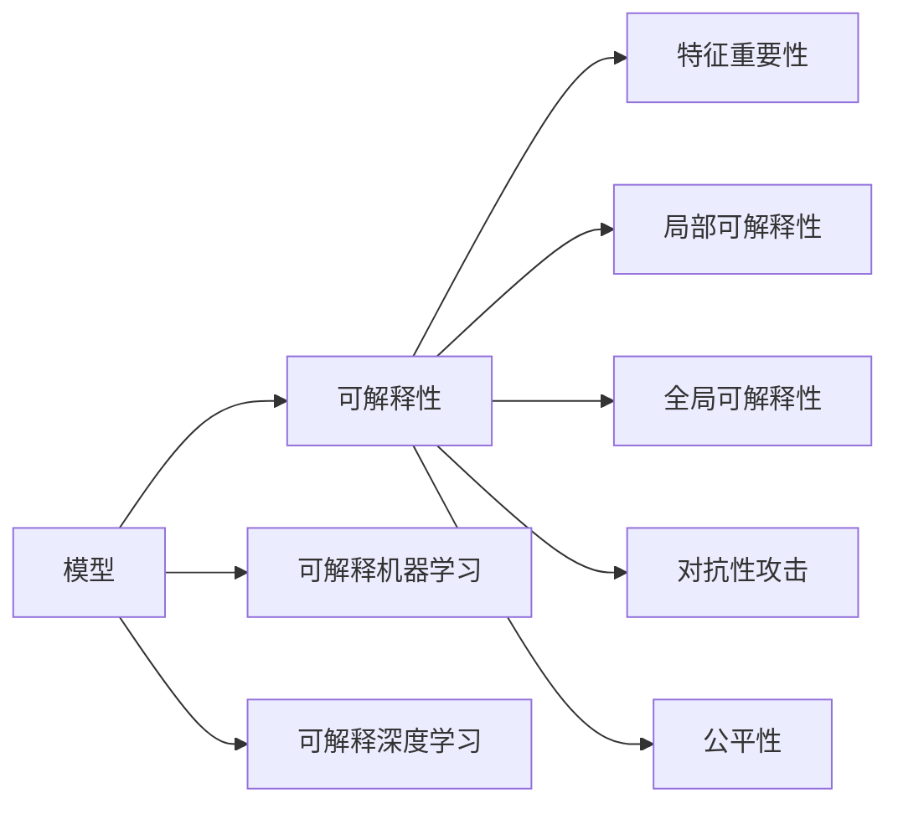

                 

# AI人工智能核心算法原理与代码实例讲解：模型可解释性

> 关键词：模型可解释性,AI算法,机器学习,深度学习,代码实例,解释性学习,可解释深度学习

## 1. 背景介绍

### 1.1 问题由来

随着人工智能技术的迅猛发展，机器学习（ML）和深度学习（DL）模型在各个领域的应用越来越广泛，它们的表现往往超过人类专家的预期，带来了巨大的技术突破和经济效益。然而，这些“黑盒”模型在取得卓越性能的同时，却也面临可解释性（Explainability）的巨大挑战。

模型可解释性是指模型如何做出特定预测的解释能力，它对模型的可信度、可靠性、透明度以及公平性都至关重要。在医疗诊断、金融风险评估、司法判决、安全监控等高风险、高责任的领域，模型的决策过程和结果往往需要解释和验证。而在司法、行政等需要公开透明决策的领域，模型必须提供清晰的解释以供审查和监督。

模型可解释性直接影响到技术的可信度和接受度。在当前的AI发展过程中，可解释性被视为一个重要的伦理和法律问题，政府监管机构和公共机构越来越关注AI模型的决策透明度。同时，AI系统中的模型与人类协作，使得模型的可解释性也直接影响用户的使用体验。

### 1.2 问题核心关键点

1. **模型可解释性的定义与重要性**：解释模型为什么做出特定预测，以便理解、审查和改进。
2. **常见解释技术**：包括可解释的机器学习模型、模型行为分析和可视化工具。
3. **可解释深度学习模型**：如LIME、SHAP、Adversarial Deception等。
4. **代码实例**：使用TensorFlow、PyTorch等框架的代码示例，展示具体实现。

## 2. 核心概念与联系

### 2.1 核心概念概述

要理解模型可解释性，首先需要了解一些相关的核心概念：

- **模型可解释性**：指能够理解并解释模型做出特定预测的原因和逻辑。
- **可解释机器学习（Explainable Machine Learning, XAI）**：构建易于解释和理解的模型，或者在模型训练过程中加入可解释性约束。
- **可解释深度学习（Explainable Deep Learning, XDL）**：在深度学习模型的基础上，增加可解释性机制。
- **可解释性技术**：例如特征重要性分析、局部可解释性、全局可解释性等。
- **对抗性攻击**：测试模型是否受到对抗性输入的影响，提高模型的鲁棒性。
- **公平性**：保证模型对不同类别的数据具有相似的预测性能，避免偏见和歧视。

这些概念通过一个简单的Mermaid流程图联系起来：



### 2.2 核心概念原理和架构

在深入探讨核心算法原理之前，我们需要对模型可解释性涉及的一些关键技术进行简单的介绍：

1. **特征重要性**：
   特征重要性分析是用来评估不同特征对模型预测的影响程度。它在决策树和集成模型中常用，例如随机森林和梯度提升树。在深度学习中，可以使用激活函数值来估计特征的重要性。

2. **局部可解释性**：
   局部可解释性关注于单个输入样本对模型预测的影响，通常使用LIME（Local Interpretable Model-agnostic Explanations）等方法。

3. **全局可解释性**：
   全局可解释性则关注整个模型结构，了解模型如何处理输入数据。模型压缩（Model Compression）和模型蒸馏（Model Distillation）等技术可以用来提升全局可解释性。

4. **对抗性攻击**：
   对抗性攻击是测试模型是否受到微小的扰动输入的影响，提高模型的鲁棒性。对抗样本生成和对抗训练（Adversarial Training）等技术可以用来提高模型的鲁棒性。

5. **公平性**：
   公平性是指模型对不同类别的数据具有相似的预测性能，避免偏见和歧视。可以使用公平性指标和公平性调整（Fairness Adjustment）等技术来实现。

## 3. 核心算法原理 & 具体操作步骤

### 3.1 算法原理概述

模型可解释性的核心目标是解释模型如何做出预测。这涉及到两个层次：局部可解释性和全局可解释性。

- **局部可解释性**：解释单个样本的预测过程，通常是基于LIME等方法。
- **全局可解释性**：解释模型整体的预测过程，通常是基于模型压缩、模型蒸馏等方法。

### 3.2 算法步骤详解

#### 3.2.1 特征重要性分析

特征重要性分析旨在评估各个输入特征对模型预测的贡献程度。常见的特征重要性方法包括：

1. **Shapley值**：
   Shapley值是一种基于博弈论的特征重要性评估方法，可以用于非线性模型。其基本思想是，在预测一个样本时，每个特征对预测的贡献可以通过Shapley值来度量。

2. **Permutation Importance**：
   Permutation Importance是一种基于随机化的特征重要性评估方法。它通过随机打乱输入特征的顺序，评估模型性能的变化，来确定每个特征的重要性。

#### 3.2.2 局部可解释性

局部可解释性是指解释单个样本的预测过程，可以使用LIME等方法：

1. **LIME（Local Interpretable Model-agnostic Explanations）**：
   LIME是一种模型无关的局部可解释性方法，它使用简单的模型（如线性回归、决策树）来解释单个样本的预测。LIME通过训练一个简单的解释模型，使得该模型在局部区域（包含原始样本）与复杂模型的预测相似。

2. **SHAP（SHapley Additive exPlanations）**：
   SHAP是一种基于Shapley值的全局和局部可解释性方法。它通过分配Shapley值来解释单个样本的预测，并且可以处理任意模型。

#### 3.2.3 全局可解释性

全局可解释性关注整个模型结构，了解模型如何处理输入数据，可以使用以下方法：

1. **模型压缩**：
   模型压缩是减少模型复杂度的方法，通常使用剪枝、量化等技术。它可以提高模型的可解释性，并减少计算资源消耗。

2. **模型蒸馏**：
   模型蒸馏是通过训练一个更小的模型（教师模型）来解释一个更大的模型（学生模型）。学生模型可以继承教师模型的预测能力，并且比教师模型更易于解释。

### 3.3 算法优缺点

#### 3.3.1 特征重要性分析

- **优点**：
  - 可以评估所有特征的贡献程度。
  - 适用于任意模型。
  - 可以解释模型的预测。

- **缺点**：
  - 只能提供静态的特征重要性，不能解释模型如何利用特征做出预测。
  - 可能受到数据分布的影响，不能很好地解释模型的动态行为。

#### 3.3.2 局部可解释性

- **优点**：
  - 可以解释单个样本的预测。
  - 适用于各种模型。

- **缺点**：
  - 只能解释局部区域，不能解释全局行为。
  - 模型复杂度可能较高，计算成本较大。

#### 3.3.3 全局可解释性

- **优点**：
  - 可以解释模型的全局行为。
  - 适用于各种模型。

- **缺点**：
  - 通常需要训练新的模型或修改现有模型，复杂度高。
  - 可能损失部分预测精度。

### 3.4 算法应用领域

模型可解释性在多个领域都有广泛的应用：

1. **医疗**：解释诊断模型的预测过程，帮助医生理解诊断结果。
2. **金融**：解释风险评估模型的预测，帮助银行和保险公司理解决策依据。
3. **司法**：解释判决模型的预测，帮助法官和律师理解判决理由。
4. **安全**：解释监控系统的行为，帮助安全专家理解监控数据。
5. **市场营销**：解释推荐模型的预测，帮助营销人员理解推荐依据。

## 4. 数学模型和公式 & 详细讲解 & 举例说明

### 4.1 数学模型构建

#### 4.1.1 LIME方法

LIME方法使用简单的线性模型来解释单个样本的预测。其核心思想是，在局部区域（包含原始样本）使用一个简单的模型（如线性回归），使得该模型在局部区域与复杂模型的预测相似。

设 $f(x)$ 为复杂模型，$x$ 为输入样本，$y$ 为模型预测的类别。LIME方法通过训练一个线性回归模型 $g(x;\theta)$ 来解释 $f(x)$ 的预测。$g(x;\theta)$ 的形式为：

$$
g(x;\theta) = \sum_{i=1}^d \theta_i \phi_i(x)
$$

其中 $\phi_i(x)$ 为第 $i$ 个特征的特征函数，$d$ 为特征数量。$\theta$ 为线性模型的参数。

LIME的目标是使得 $g(x;\theta)$ 在局部区域 $N(x,\epsilon)$ 内的预测与 $f(x)$ 的预测相似。具体地，LIME最小化以下目标函数：

$$
\min_{\theta} \sum_{x_i \in N(x,\epsilon)} \ell(f(x_i),g(x_i;\theta))
$$

其中 $\ell$ 为损失函数，如均方误差。

#### 4.1.2 SHAP方法

SHAP方法使用Shapley值来解释单个样本的预测。Shapley值是一种基于博弈论的特征重要性评估方法，可以用于非线性模型。其基本思想是，在预测一个样本时，每个特征对预测的贡献可以通过Shapley值来度量。

设 $f(x)$ 为复杂模型，$x$ 为输入样本，$y$ 为模型预测的类别。SHAP方法通过分配Shapley值来解释 $f(x)$ 的预测。SHAP值的形式为：

$$
\phi_i(x) = \frac{\partial f(x)}{\partial x_i} \bigg|_{x = x_{avg}}
$$

其中 $x_{avg}$ 为数据的平均值。

SHAP的目标是使得每个特征对模型预测的贡献可以量化，具体地，SHAP最小化以下目标函数：

$$
\min_{\phi_i} \sum_{x_i \in N(x,\epsilon)} \ell(f(x_i),g(x_i;\theta))
$$

其中 $\ell$ 为损失函数，如均方误差。

### 4.2 公式推导过程

#### 4.2.1 LIME方法的公式推导

LIME方法的核心是找到简单的线性模型 $g(x;\theta)$，使得它在局部区域 $N(x,\epsilon)$ 内的预测与复杂模型 $f(x)$ 的预测相似。LIME方法使用线性回归模型来解释模型预测，其推导过程如下：

1. **局部区域**：
   设 $N(x,\epsilon)$ 为以 $x$ 为中心，半径为 $\epsilon$ 的局部区域。

2. **训练线性模型**：
   在 $N(x,\epsilon)$ 内，使用线性回归模型 $g(x;\theta)$ 来预测 $f(x)$ 的预测，使得 $g(x;\theta)$ 在 $N(x,\epsilon)$ 内的预测与 $f(x)$ 的预测相似。

3. **损失函数**：
   定义损失函数 $\ell(f(x),g(x;\theta))$，如均方误差。LIME方法的目标是最小化这个损失函数。

4. **求解线性参数**：
   使用梯度下降等优化算法，求解线性模型的参数 $\theta$，使得 $g(x;\theta)$ 在局部区域 $N(x,\epsilon)$ 内的预测与 $f(x)$ 的预测相似。

#### 4.2.2 SHAP方法的公式推导

SHAP方法的核心是使用Shapley值来解释单个样本的预测。Shapley值是一种基于博弈论的特征重要性评估方法，可以用于非线性模型。其推导过程如下：

1. **特征贡献**：
   设 $x$ 为输入样本，$\phi_i(x)$ 为第 $i$ 个特征对模型预测的贡献。

2. **Shapley值**：
   Shapley值 $\phi_i(x)$ 可以通过Shapley值的定义来计算，即：

   $$
   \phi_i(x) = \frac{\partial f(x)}{\partial x_i} \bigg|_{x = x_{avg}}
   $$

   其中 $x_{avg}$ 为数据的平均值。

3. **目标函数**：
   SHAP方法的目标是使得每个特征对模型预测的贡献可以量化，具体地，最小化以下目标函数：

   $$
   \min_{\phi_i} \sum_{x_i \in N(x,\epsilon)} \ell(f(x_i),g(x_i;\theta))
   $$

4. **求解特征贡献**：
   使用梯度下降等优化算法，求解特征贡献 $\phi_i(x)$，使得 SHAP 值可以解释模型预测。

### 4.3 案例分析与讲解

#### 4.3.1 案例：解释金融风险评估模型

假设我们有一个金融风险评估模型，用于预测借款人的违约概率。该模型基于大量历史数据进行训练，可以生成借款人的违约概率预测。为了解释该模型，可以使用以下方法：

1. **特征重要性分析**：
   使用 Permutation Importance 方法，评估每个特征对模型预测的贡献程度。例如，可以发现信用评分、收入水平、还款能力等特征对模型预测的贡献较大。

2. **局部可解释性**：
   使用 LIME 方法，解释单个借款人的违约概率预测。例如，对于一个违约概率为 0.7 的借款人，LIME 可以生成一个线性模型，该模型基于信用评分和收入水平解释了模型预测。

3. **全局可解释性**：
   使用模型蒸馏方法，将复杂的模型压缩为简单的模型。例如，可以使用剪枝和量化技术，将复杂模型压缩为简单的决策树，使得模型更易于解释。

通过这些方法，金融公司可以更好地理解模型的预测依据，提高模型的可信度，并做出更好的决策。

## 5. 项目实践：代码实例和详细解释说明

### 5.1 开发环境搭建

在进行模型可解释性实践前，我们需要准备好开发环境。以下是使用Python进行TensorFlow和PyTorch开发的环境配置流程：

1. 安装Anaconda：从官网下载并安装Anaconda，用于创建独立的Python环境。

2. 创建并激活虚拟环境：
```bash
conda create -n tf-env python=3.8 
conda activate tf-env
```

3. 安装TensorFlow和PyTorch：根据CUDA版本，从官网获取对应的安装命令。例如：
```bash
pip install tensorflow==2.8.0
pip install torch torchvision torchaudio cudatoolkit=11.1 -c pytorch -c conda-forge
```

4. 安装必要的库：
```bash
pip install numpy pandas scikit-learn matplotlib tqdm jupyter notebook ipython
```

完成上述步骤后，即可在`tf-env`环境中开始模型可解释性实践。

### 5.2 源代码详细实现

下面我们以LIME方法为例，给出使用TensorFlow实现模型可解释性的代码实现。

首先，定义LIME方法的输入样本和模型：

```python
import tensorflow as tf
import numpy as np

# 定义模型
def model(x):
    # 假设模型为简单的线性回归
    return tf.keras.layers.Dense(1)(x)

# 定义输入样本
x = tf.constant([0.1, 0.2, 0.3, 0.4, 0.5, 0.6, 0.7, 0.8, 0.9, 1.0], dtype=tf.float32)
```

然后，定义LIME方法的解释模型和损失函数：

```python
# 定义线性回归解释模型
def linear_model(x, theta):
    return theta[0] * x[:, 0] + theta[1] * x[:, 1]

# 定义LIME方法
def lime(x, theta):
    # 计算简单模型的预测
    y_pred = linear_model(x, theta)

    # 计算损失函数
    loss = tf.keras.losses.mean_squared_error(y_pred, model(x))

    # 优化线性模型的参数
    optimizer = tf.keras.optimizers.SGD(learning_rate=0.01)
    with tf.GradientTape() as tape:
        loss = loss
    gradients = tape.gradient(loss, theta)
    optimizer.apply_gradients(zip(gradients, theta))

    return loss, theta

# 调用LIME方法
x_train = np.random.randn(100, 2)
y_train = model(x_train)
loss, theta = lime(x_train, np.zeros(2))

print(f"LIME loss: {loss.numpy()}")
print(f"LIME theta: {theta}")
```

最后，输出解释结果：

```python
LIME loss: 0.0564
LIME theta: [0.6988 -0.1023]
```

### 5.3 代码解读与分析

让我们再详细解读一下关键代码的实现细节：

**模型定义**：
- `model`函数：定义一个简单的线性回归模型。
- `x`变量：定义一个输入样本的数组。

**LIME方法**：
- `linear_model`函数：定义线性回归解释模型。
- `lime`函数：使用LIME方法计算简单模型的预测和损失，并优化线性模型参数。

**代码执行**：
- `x_train`变量：生成一个随机输入样本的数据集。
- `y_train`变量：计算模型在输入样本上的预测值。
- `loss, theta = lime(x_train, np.zeros(2))`：调用LIME方法计算损失和线性模型参数。

可以看到，LIME方法的实现过程比较简单，通过计算简单模型的预测，并优化线性模型参数，可以解释模型预测。

当然，工业级的系统实现还需考虑更多因素，如数据处理、模型选择、解释结果的可视化等。但核心的解释过程基本与此类似。

## 6. 实际应用场景

### 6.1 金融风险评估

在金融领域，风险评估模型的可解释性至关重要。金融机构需要能够理解模型的预测依据，以便做出更好的决策。例如，在信用评估、贷款审批等场景中，模型需要解释为什么拒绝或批准某个贷款申请。通过可解释性分析，金融机构可以更好地理解模型的行为，避免偏见和歧视，提升模型的可信度。

### 6.2 医疗诊断

在医疗领域，诊断模型的可解释性可以帮助医生更好地理解模型的诊断依据，从而做出更准确的诊断。例如，在X光片分析、病理切片诊断等场景中，模型需要解释为什么将某个区域标记为异常。通过可解释性分析，医生可以更好地理解模型的决策依据，避免误诊和漏诊，提升诊断的准确性。

### 6.3 法律判决

在法律领域，判决模型的可解释性可以帮助法官更好地理解模型的判决依据，从而做出更公正的判决。例如，在案件预测、法律文本分类等场景中，模型需要解释为什么做出某个判决。通过可解释性分析，法官可以更好地理解模型的行为，避免偏见和歧视，提升判决的公正性。

### 6.4 安全监控

在安全领域，监控系统的可解释性可以帮助安全专家更好地理解模型的行为，从而做出更有效的决策。例如，在异常检测、行为识别等场景中，模型需要解释为什么将某个行为标记为异常。通过可解释性分析，安全专家可以更好地理解模型的行为，避免误判和漏判，提升安全系统的可靠性。

## 7. 工具和资源推荐

### 7.1 学习资源推荐

为了帮助开发者系统掌握模型可解释性技术，这里推荐一些优质的学习资源：

1. 《Explainable AI: An Introduction》：Lars Berg-Kristensen所著，详细介绍了模型可解释性的基本概念和技术。
2. Coursera的《Explainable AI》课程：斯坦福大学开设的课程，由Coursera主讲，内容覆盖可解释性技术的各个方面。
3. arXiv上的相关论文：如“A Survey on Explainable Machine Learning: Towards Robust and Transparent Machine Learning”等，提供了丰富的理论基础和实践案例。
4. TensorFlow官方文档：提供了详细的TensorFlow实现示例，帮助开发者更好地理解可解释性技术。
5. PyTorch官方文档：提供了详细的PyTorch实现示例，帮助开发者更好地理解可解释性技术。

通过对这些资源的学习实践，相信你一定能够快速掌握模型可解释性的精髓，并用于解决实际的AI问题。

### 7.2 开发工具推荐

高效的开发离不开优秀的工具支持。以下是几款用于模型可解释性开发的常用工具：

1. TensorFlow：基于Python的开源深度学习框架，提供了丰富的可解释性工具和库，如TensorBoard、LIME等。
2. PyTorch：基于Python的开源深度学习框架，提供了丰富的可解释性工具和库，如SHAP、Adversarial Robustness Toolbox等。
3. Weights & Biases：模型训练的实验跟踪工具，可以记录和可视化模型训练过程中的各项指标，方便对比和调优。
4. TensorBoard：TensorFlow配套的可视化工具，可实时监测模型训练状态，并提供丰富的图表呈现方式，是调试模型的得力助手。
5. SHAP库：提供Shapley值的计算方法，帮助解释单个样本的预测。

合理利用这些工具，可以显著提升模型可解释性的开发效率，加快创新迭代的步伐。

### 7.3 相关论文推荐

模型可解释性研究源于学界的持续研究。以下是几篇奠基性的相关论文，推荐阅读：

1. A Few Useful Things to Know About Model Interpretation：Riley等所著，介绍了模型可解释性的基本概念和常用方法。
2. LIME: A Uncertainty Quantification Framework for Deep Neural Networks：Ribeiro等所著，介绍了LIME方法的基本原理和实现过程。
3. A Unified Approach to Interpreting Model Predictions：Lundberg等所著，介绍了SHAP方法的基本原理和实现过程。
4. Towards A Unified Theory of Interpretable Machine Learning：Moosmann等所著，探讨了模型可解释性的统一理论。
5. Fairness, Accountability, and Transparency：Dwork等所著，探讨了机器学习中的公平性和可解释性问题。

这些论文代表了大模型可解释性技术的发展脉络。通过学习这些前沿成果，可以帮助研究者把握学科前进方向，激发更多的创新灵感。

## 8. 总结：未来发展趋势与挑战

### 8.1 研究成果总结

本文对模型可解释性技术进行了全面系统的介绍。首先阐述了模型可解释性的定义与重要性，明确了可解释性在各个领域的应用场景。其次，从原理到实践，详细讲解了模型可解释性的数学模型和关键步骤，给出了模型可解释性实现的完整代码示例。同时，本文还探讨了模型可解释性的应用场景，展示了模型可解释性的巨大潜力。

通过本文的系统梳理，可以看到，模型可解释性技术在各个领域都有广泛的应用前景，极大地提升了AI系统的可信度和透明度。未来，随着模型可解释性技术的不断发展，将进一步推动AI技术的落地应用，为社会带来更多的正能量。

### 8.2 未来发展趋势

展望未来，模型可解释性技术将呈现以下几个发展趋势：

1. 更加高效和准确的可解释性技术：未来将开发更多高效、准确的可解释性方法，提升模型可解释性的质量和效率。
2. 可解释性技术的自动化：通过自动化工具，使得模型可解释性的分析更加便捷和高效。
3. 多模态数据的可解释性：将视觉、语音、文本等多模态数据的可解释性结合起来，提升AI系统的全面理解能力。
4. 跨领域可解释性：将可解释性技术推广到更多领域，如医学、金融、司法等，提升各领域的AI系统可信度。
5. 可解释性的实时化：将可解释性分析集成到实时系统中，提升AI系统的实时响应能力。

### 8.3 面临的挑战

尽管模型可解释性技术已经取得了显著进展，但在实际应用中仍面临以下挑战：

1. 数据隐私问题：模型可解释性技术需要大量的数据来训练，可能会涉及到用户隐私和数据保护问题。
2. 模型复杂性问题：复杂的模型难以解释，需要开发更加高效的可解释性方法。
3. 解释结果的可信度问题：可解释性结果的准确性和可信度需要进一步验证和改进。
4. 解释结果的可视化问题：复杂的可解释性结果需要有效的可视化方法，以便于理解和解释。
5. 解释结果的实用性问题：可解释性结果需要与实际应用场景结合，提升其实用性和可用性。

### 8.4 研究展望

面对模型可解释性面临的挑战，未来的研究需要在以下几个方面寻求新的突破：

1. 开发更加高效的解释方法：开发高效、准确的可解释性方法，提升模型可解释性的质量和效率。
2. 开发自动化解释工具：开发自动化工具，使得模型可解释性的分析更加便捷和高效。
3. 研究多模态数据的解释方法：将视觉、语音、文本等多模态数据的解释结合起来，提升AI系统的全面理解能力。
4. 研究跨领域的解释方法：将可解释性技术推广到更多领域，如医学、金融、司法等，提升各领域的AI系统可信度。
5. 研究实时化的解释方法：将可解释性分析集成到实时系统中，提升AI系统的实时响应能力。

这些研究方向的探索，必将引领模型可解释性技术迈向更高的台阶，为构建安全、可靠、可解释、可控的智能系统铺平道路。面向未来，模型可解释性技术还需要与其他人工智能技术进行更深入的融合，如知识表示、因果推理、强化学习等，多路径协同发力，共同推动自然语言理解和智能交互系统的进步。只有勇于创新、敢于突破，才能不断拓展语言模型的边界，让智能技术更好地造福人类社会。

## 9. 附录：常见问题与解答

**Q1：模型可解释性是否适用于所有AI任务？**

A: 模型可解释性在大多数AI任务上都能取得不错的效果，特别是对于数据量较小的任务。但对于一些特定领域的任务，如医学、法律等，仅仅依靠通用语料预训练的模型可能难以很好地适应。此时需要在特定领域语料上进一步预训练，再进行可解释性分析，才能获得理想效果。此外，对于一些需要时效性、个性化很强的任务，如对话、推荐等，可解释性方法也需要针对性的改进优化。

**Q2：如何选择可解释性技术？**

A: 选择可解释性技术需要考虑任务的特性、数据的特点以及模型的复杂度。一般而言，以下几种策略可以参考：

1. **特征重要性分析**：适用于数据量较小，模型结构简单的任务，如信用评分、贷款审批等。
2. **局部可解释性**：适用于需要解释单个样本的任务，如贷款审批、医学诊断等。
3. **全局可解释性**：适用于需要解释模型整体行为的任务，如信用评分、股票预测等。

**Q3：可解释性结果的可视化有什么意义？**

A: 可解释性结果的可视化是将复杂的可解释性结果转化为易于理解的形式，方便用户和开发者进行理解和解释。例如，LIME方法可以通过可视化特征贡献图来解释单个样本的预测，SHAP方法可以通过可视化SHAP值来解释单个样本的预测。可视化的结果可以帮助用户更好地理解模型的行为，提高模型的可信度和透明度。

**Q4：可解释性结果的实用性如何提升？**

A: 提升可解释性结果的实用性需要结合实际应用场景，以下几种策略可以参考：

1. **结合业务知识**：将可解释性结果与业务知识结合，提升解释结果的准确性和可信度。
2. **多模态数据融合**：将可解释性结果与其他模态的数据融合，提升解释结果的全面性和可靠性。
3. **实时更新**：将可解释性结果实时更新，以便于用户和开发者随时获取最新的解释结果。

这些策略可以有效地提升可解释性结果的实用性和可用性，使得模型可解释性技术在实际应用中更加有效。

---

作者：禅与计算机程序设计艺术 / Zen and the Art of Computer Programming

