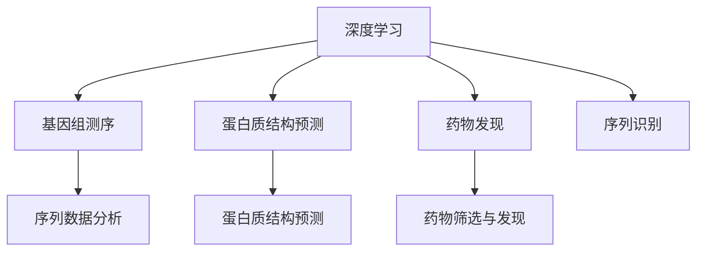

                 

# AI人工智能深度学习算法：在生物信息学中的应用

> 关键词：生物信息学,深度学习,基因组测序,蛋白质结构预测,药物发现,机器学习,神经网络

## 1. 背景介绍

### 1.1 问题由来
随着基因组测序技术的进步，生物信息学领域积累了海量的基因序列和蛋白质结构数据。这些数据蕴含着丰富的生物信息，但传统方法难以有效提取和利用。深度学习作为新一代的机器学习技术，以其强大的特征提取和模式识别能力，在生物信息学领域展现出巨大的潜力。本文聚焦于深度学习算法在基因组测序、蛋白质结构预测、药物发现等生物信息学任务中的应用，旨在探索其工作原理和实践方法。

### 1.2 问题核心关键点
深度学习在生物信息学中的应用，主要集中在以下几个方面：

1. 基因组测序数据分析：利用深度学习模型分析DNA序列，识别基因组中的功能区域、编码蛋白质等功能信息。
2. 蛋白质结构预测：通过深度学习模型预测蛋白质空间结构，揭示其功能和相互作用的机制。
3. 药物发现：利用深度学习模型筛选化合物库，预测化合物的生物活性和副作用，加速药物研发进程。

深度学习在生物信息学中的应用，涉及大数据处理、深度模型设计、模型训练和优化等多个环节。本文将从原理和实践两个层面，深入探讨深度学习算法在生物信息学中的应用。

### 1.3 问题研究意义
深度学习在生物信息学中的应用，具有以下重要意义：

1. 提升数据分析效率：深度学习模型具有高度自动化和并行计算能力，能够快速处理和分析海量的生物数据。
2. 挖掘数据潜在价值：深度学习模型能够发现数据中的非线性关系和复杂模式，揭示生物信息的潜在规律。
3. 推动生物医学研究：深度学习模型的应用，加速了药物发现、疾病诊断等领域的进展，为生物医学研究提供了新的工具和技术。
4. 促进产学研结合：深度学习技术在生物信息学中的应用，促进了学术研究和工业生产的协同创新，推动了生物信息学领域的产业化发展。

## 2. 核心概念与联系

### 2.1 核心概念概述

为更好地理解深度学习在生物信息学中的应用，本节将介绍几个密切相关的核心概念：

- 深度学习(Deep Learning)：一种基于多层神经网络的机器学习方法，能够自动提取和处理高维数据，广泛应用于图像识别、语音识别、自然语言处理等领域。
- 基因组测序(Genome Sequencing)：通过对生物DNA序列进行测序，获取生物遗传信息的技术。
- 蛋白质结构预测(Protein Structure Prediction)：通过计算模型预测蛋白质在三维空间中的结构，揭示其功能和相互作用的机制。
- 药物发现(Pharmaceutical Discovery)：利用生物信息学和计算化学技术，筛选化合物库，发现具有生物活性的新药物。
- 序列数据(Sequence Data)：指生物数据中常见的序列形式，如DNA序列、蛋白质序列、氨基酸序列等。

这些核心概念之间的逻辑关系可以通过以下Mermaid流程图来展示：



这个流程图展示了大语言模型的核心概念及其之间的关系：

1. 深度学习能够处理和分析海量的生物数据。
2. 基因组测序数据通过序列数据分析模块进行处理，揭示基因组中的功能信息。
3. 蛋白质结构预测模块利用深度学习模型预测蛋白质空间结构。
4. 药物发现模块通过深度学习模型筛选化合物库，加速药物研发。

这些概念共同构成了深度学习在生物信息学中的应用框架，使其能够充分利用数据中的复杂信息，揭示生物学的潜在规律。通过理解这些核心概念，我们可以更好地把握深度学习算法在生物信息学中的工作原理和应用方向。

## 3. 核心算法原理 & 具体操作步骤
### 3.1 算法原理概述

深度学习在生物信息学中的应用，主要基于神经网络模型的构建和优化。其核心思想是：通过多层次的神经网络模型，对生物数据进行特征提取和模式识别，从而挖掘数据中的潜在信息。

以蛋白质结构预测为例，蛋白质由20种氨基酸组成，每个氨基酸在三维空间中的位置和构型，决定了蛋白质的功能。传统的蛋白质结构预测方法依赖于物理和化学的原理，计算复杂度较高。而深度学习模型通过多层神经网络的组合，能够自动学习氨基酸之间的相互关系，预测蛋白质的空间结构。

在实践中，深度学习模型通常采用卷积神经网络(CNN)、循环神经网络(RNN)、变分自编码器(VAE)、生成对抗网络(GAN)等架构，针对不同的生物信息学任务进行设计。例如，卷积神经网络常用于图像数据的处理，循环神经网络适合处理序列数据，变分自编码器用于数据降维和重构，生成对抗网络用于生成新的蛋白质序列等。

### 3.2 算法步骤详解

深度学习在生物信息学中的应用，主要包括以下几个关键步骤：

**Step 1: 数据准备与预处理**
- 收集和整理生物数据，如基因组序列、蛋白质序列、化合物库等，并进行数据清洗和标准化处理。
- 对数据进行划分，分成训练集、验证集和测试集，以保证模型训练、验证和测试的独立性。
- 对序列数据进行编码，转换为模型可以处理的向量形式，如one-hot编码、向量表示等。

**Step 2: 构建深度学习模型**
- 根据生物数据的特点，选择合适的深度学习模型架构，如卷积神经网络(CNN)、循环神经网络(RNN)等。
- 设计模型的超参数，如网络层数、神经元个数、激活函数等，并进行模型搭建。
- 对模型进行初始化，如使用随机初始化、预训练等策略。

**Step 3: 模型训练与优化**
- 使用生物数据对模型进行训练，优化模型的参数，使其在训练集上达到最小化损失函数的值。
- 在验证集上对模型进行评估，选择合适的超参数和正则化技术，防止模型过拟合。
- 在测试集上对模型进行测试，评估模型的泛化能力和预测精度。

**Step 4: 模型应用与评估**
- 将训练好的模型应用于实际问题中，如基因组序列分析、蛋白质结构预测、药物发现等。
- 评估模型的应用效果，如准确率、召回率、F1-score等，并不断优化模型参数和结构。
- 对模型进行持续学习和迭代，以适应数据分布的变化和新的生物数据挑战。

### 3.3 算法优缺点

深度学习在生物信息学中的应用，具有以下优点：

1. 高效处理复杂数据：深度学习模型能够自动学习数据的复杂非线性关系，高效提取特征信息。
2. 泛化能力强：深度学习模型具有较强的泛化能力，能够在新的数据集上取得良好的性能。
3. 适应性强：深度学习模型能够灵活适应不同生物信息学任务的需求，如序列数据分析、蛋白质结构预测等。
4. 自动化程度高：深度学习模型自动化的特征提取和模式识别能力，降低了人工标注和干预的需求。

同时，深度学习在生物信息学中的应用，也存在一些缺点：

1. 数据需求量大：深度学习模型需要大量的生物数据进行训练，数据获取和标注成本较高。
2. 计算资源消耗大：深度学习模型通常需要高性能计算资源，如GPU、TPU等，对硬件要求较高。
3. 可解释性不足：深度学习模型作为"黑盒"系统，难以解释其内部工作机制和决策逻辑，可能缺乏可解释性。
4. 模型复杂度高：深度学习模型通常具有较高的复杂度，模型的训练和优化过程较为繁琐。
5. 鲁棒性有待提高：深度学习模型对噪声和异常值较为敏感，鲁棒性有待进一步提高。

尽管存在这些局限性，但就目前而言，深度学习在生物信息学中的应用仍然是最有效的技术手段之一。未来相关研究的重点在于如何进一步降低数据需求，提高模型效率和鲁棒性，同时兼顾可解释性和伦理安全性等因素。

### 3.4 算法应用领域

深度学习在生物信息学中的应用，主要集中在以下几个领域：

1. **基因组测序数据分析**：利用深度学习模型对基因组序列进行分析，识别基因组中的功能区域、编码蛋白质等功能信息。例如，使用卷积神经网络对DNA序列进行分类，预测基因调控区等。
2. **蛋白质结构预测**：通过深度学习模型预测蛋白质在三维空间中的结构，揭示其功能和相互作用的机制。例如，使用卷积神经网络对蛋白质序列进行编码，预测其空间结构。
3. **药物发现**：利用深度学习模型筛选化合物库，预测化合物的生物活性和副作用，加速药物研发进程。例如，使用生成对抗网络生成新的化合物序列，使用循环神经网络对化合物库进行筛选。
4. **生物影像分析**：利用深度学习模型分析生物影像数据，识别细胞、组织等结构特征。例如，使用卷积神经网络对细胞图像进行分类和分割，预测细胞状态等。
5. **基因表达分析**：利用深度学习模型分析基因表达数据，揭示基因与疾病的关系。例如，使用循环神经网络对基因表达数据进行建模，预测疾病发生风险。

除了上述这些领域外，深度学习在生物信息学中的应用还涵盖蛋白序列比对、生物分子模拟、疾病诊断等多个方面，为生物信息学研究提供了新的方法和工具。

## 4. 数学模型和公式 & 详细讲解 & 举例说明

### 4.1 数学模型构建

以蛋白质结构预测为例，深度学习模型通常采用卷积神经网络(CNN)架构，对蛋白质序列进行编码和结构预测。模型的输入为一个长度为L的蛋白质序列，每个氨基酸由一个长度为D的向量表示，输出为一个长度为L的蛋白质空间结构向量。模型的数学模型可以表示为：

$$
\mathbf{X} = \left[ \mathbf{x}_1, \mathbf{x}_2, \dots, \mathbf{x}_L \right] \in \mathbb{R}^{L \times D}
$$

其中，$\mathbf{x}_i$ 表示第i个氨基酸的向量表示。

模型的输出为一个长度为L的蛋白质空间结构向量，可以表示为：

$$
\mathbf{Y} = \left[ \mathbf{y}_1, \mathbf{y}_2, \dots, \mathbf{y}_L \right] \in \mathbb{R}^{L \times H}
$$

其中，$\mathbf{y}_i$ 表示第i个氨基酸的空间结构向量。

模型的目标是最小化预测值与真实值之间的差距，通常使用均方误差损失函数，表示为：

$$
\mathcal{L}(\mathbf{Y}, \hat{\mathbf{Y}}) = \frac{1}{2} \sum_{i=1}^L \|\mathbf{y}_i - \hat{\mathbf{y}}_i\|^2
$$

其中，$\hat{\mathbf{y}}_i$ 表示模型预测的第i个氨基酸的空间结构向量。

### 4.2 公式推导过程

以蛋白质结构预测为例，深度学习模型的训练过程可以概括为以下几个步骤：

1. **模型初始化**：对模型参数进行随机初始化或预训练，以减小初始化误差。

2. **前向传播**：将输入蛋白质序列 $\mathbf{X}$ 送入模型进行前向传播，得到预测结构向量 $\hat{\mathbf{Y}}$。

3. **计算损失**：将预测结构向量 $\hat{\mathbf{Y}}$ 与真实结构向量 $\mathbf{Y}$ 进行对比，计算均方误差损失 $\mathcal{L}(\mathbf{Y}, \hat{\mathbf{Y}})$。

4. **反向传播**：使用梯度下降等优化算法，计算损失函数对模型参数的梯度，并更新模型参数。

5. **模型评估**：在验证集上评估模型的预测精度，选择最优的模型参数和结构。

6. **模型应用**：将训练好的模型应用于新的蛋白质序列，预测其空间结构。

### 4.3 案例分析与讲解

以蛋白质结构预测为例，下面我们详细讲解一个具体的案例分析：

假设我们有一组长度为100的蛋白质序列，每个氨基酸由一个长度为20的向量表示。我们将蛋白质序列作为模型的输入，对模型进行训练。模型采用卷积神经网络架构，包含多个卷积层和全连接层。

在训练过程中，我们使用均方误差损失函数计算模型预测值与真实值之间的差距。具体步骤如下：

1. **模型初始化**：对模型参数进行随机初始化，选择适当的激活函数，如ReLU等。

2. **前向传播**：将蛋白质序列输入模型，通过卷积层和全连接层进行特征提取和结构预测，得到预测结构向量 $\hat{\mathbf{Y}}$。

3. **计算损失**：将预测结构向量 $\hat{\mathbf{Y}}$ 与真实结构向量 $\mathbf{Y}$ 进行对比，计算均方误差损失 $\mathcal{L}(\mathbf{Y}, \hat{\mathbf{Y}})$。

4. **反向传播**：使用梯度下降等优化算法，计算损失函数对模型参数的梯度，并更新模型参数。

5. **模型评估**：在验证集上评估模型的预测精度，选择最优的模型参数和结构。

6. **模型应用**：将训练好的模型应用于新的蛋白质序列，预测其空间结构。

通过上述步骤，深度学习模型可以自动学习和提取蛋白质序列中的特征信息，预测蛋白质空间结构，揭示其功能和相互作用的机制。在实际应用中，通过调整模型参数和结构，可以进一步提高模型的预测精度和泛化能力。

## 5. 项目实践：代码实例和详细解释说明
### 5.1 开发环境搭建

在进行深度学习项目实践前，我们需要准备好开发环境。以下是使用Python进行TensorFlow开发的环境配置流程：

1. 安装Anaconda：从官网下载并安装Anaconda，用于创建独立的Python环境。

2. 创建并激活虚拟环境：
```bash
conda create -n tf-env python=3.8 
conda activate tf-env
```

3. 安装TensorFlow：根据CUDA版本，从官网获取对应的安装命令。例如：
```bash
conda install tensorflow -c pytorch -c conda-forge
```

4. 安装各类工具包：
```bash
pip install numpy pandas scikit-learn matplotlib tqdm jupyter notebook ipython
```

完成上述步骤后，即可在`tf-env`环境中开始深度学习项目实践。

### 5.2 源代码详细实现

下面我们以蛋白质结构预测为例，给出使用TensorFlow实现卷积神经网络模型的代码实现。

首先，定义模型的输入和输出：

```python
import tensorflow as tf
from tensorflow.keras import layers

input_shape = (100, 20)
output_shape = (100, 50)

input_layer = layers.Input(shape=input_shape, name='input')
output_layer = layers.Dense(units=output_shape, activation='relu')(input_layer)
```

然后，定义卷积层和池化层：

```python
conv_layer_1 = layers.Conv1D(filters=64, kernel_size=3, activation='relu', name='conv1')(output_layer)
pool_layer_1 = layers.MaxPooling1D(pool_size=2, name='pool1')(conv_layer_1)

conv_layer_2 = layers.Conv1D(filters=128, kernel_size=3, activation='relu', name='conv2')(pool_layer_1)
pool_layer_2 = layers.MaxPooling1D(pool_size=2, name='pool2')(conv_layer_2)

conv_layer_3 = layers.Conv1D(filters=256, kernel_size=3, activation='relu', name='conv3')(pool_layer_2)
pool_layer_3 = layers.MaxPooling1D(pool_size=2, name='pool3')(conv_layer_3)
```

接着，定义全连接层：

```python
flatten_layer = layers.Flatten()(pool_layer_3)
dense_layer = layers.Dense(units=128, activation='relu', name='dense')(flatten_layer)
```

最后，定义输出层：

```python
output_layer = layers.Dense(units=output_shape, activation='softmax', name='output')(dense_layer)
```

定义完模型后，进行模型编译和训练：

```python
model = tf.keras.Model(inputs=input_layer, outputs=output_layer)

model.compile(optimizer='adam', loss='mse', metrics=['accuracy'])

model.fit(x_train, y_train, epochs=10, batch_size=32, validation_data=(x_val, y_val))
```

以上就是使用TensorFlow对蛋白质结构预测任务进行卷积神经网络模型微调的代码实现。可以看到，TensorFlow提供了强大的API，使得深度学习模型的构建和训练变得相对简单。

### 5.3 代码解读与分析

让我们再详细解读一下关键代码的实现细节：

**模型定义**：
- 首先定义输入和输出层，其中输入层指定输入数据的形状，输出层指定输出数据的形状。
- 然后定义卷积层和池化层，其中卷积层使用不同的滤波器大小和步长，池化层使用最大池化操作进行降维。
- 接着定义全连接层，使用ReLU激活函数。
- 最后定义输出层，使用softmax激活函数进行预测。

**模型编译**：
- 使用Adam优化器进行模型训练，均方误差损失函数进行损失计算，准确率作为评估指标。

**模型训练**：
- 使用训练数据和验证数据对模型进行训练，指定训练轮数和批量大小。

通过上述步骤，我们得到了一个简单的卷积神经网络模型，用于蛋白质结构预测任务。在实际应用中，可以进一步优化模型结构，调整超参数，使用更复杂的模型架构，以提高模型的预测精度和泛化能力。

## 6. 实际应用场景
### 6.1 基因组测序数据分析

深度学习在基因组测序数据分析中的应用，主要集中在序列分类和功能预测等方面。传统方法往往需要手工设计特征，计算复杂度高，难以处理大规模数据。而深度学习模型能够自动提取和处理序列特征，揭示基因组中的功能信息。

在实际应用中，可以收集基因组序列数据，将其作为模型输入，通过深度学习模型进行分类和预测。例如，使用卷积神经网络对DNA序列进行分类，识别基因调控区等。通过不断优化模型和调整参数，可以显著提高基因组测序数据分析的效率和精度。

### 6.2 蛋白质结构预测

蛋白质结构预测是生物信息学的重要任务之一。深度学习模型通过学习氨基酸之间的相互关系，预测蛋白质在三维空间中的结构，揭示其功能和相互作用的机制。

在实际应用中，可以收集蛋白质序列数据，将其作为模型输入，通过深度学习模型进行预测。例如，使用卷积神经网络对蛋白质序列进行编码，预测其空间结构。通过不断优化模型和调整参数，可以提高蛋白质结构预测的精度和鲁棒性。

### 6.3 药物发现

药物发现是生物信息学的重要应用方向之一。深度学习模型通过学习化合物库中的化合物结构和性质，筛选出具有生物活性的新药物。

在实际应用中，可以收集化合物库数据，将其作为模型输入，通过深度学习模型进行筛选和预测。例如，使用生成对抗网络生成新的化合物序列，使用循环神经网络对化合物库进行筛选。通过不断优化模型和调整参数，可以提高药物发现的效率和准确性。

### 6.4 未来应用展望

随着深度学习技术的不断发展，其在生物信息学领域的应用前景将更加广阔。未来，深度学习技术将进一步拓展其应用边界，带来更多创新性突破：

1. **基因组编辑**：通过深度学习模型预测基因编辑的效果，指导精准医疗和基因治疗。
2. **蛋白质设计**：利用深度学习模型预测蛋白质结构，设计新的药物靶点和基因编辑工具。
3. **生物影像分析**：利用深度学习模型分析生物影像数据，揭示细胞、组织等结构特征，指导疾病诊断和治疗。
4. **系统生物学**：利用深度学习模型分析生物系统的动态变化，揭示生物系统的内在规律和调控机制。
5. **合成生物学**：利用深度学习模型设计新的生物系统，实现生物系统的优化和智能化。

## 7. 工具和资源推荐
### 7.1 学习资源推荐

为了帮助开发者系统掌握深度学习在生物信息学中的应用，这里推荐一些优质的学习资源：

1. 《深度学习基础》系列书籍：由李宏毅等专家撰写，详细讲解了深度学习的基本概念和实现方法。
2. 《生物信息学原理与实践》课程：由John P. Burge等专家开设的在线课程，涵盖了生物信息学和深度学习的基础知识和应用案例。
3. 《蛋白质结构预测》书籍：由Loren L. Jain等专家撰写，详细介绍了蛋白质结构预测的方法和应用。
4. DeepLearning.AI：由Andrew Ng等专家创办的在线学习平台，提供了丰富的深度学习课程和资源。
5. Coursera的《机器学习》课程：由Andrew Ng等专家主讲，涵盖了机器学习的基本概念和实现方法，对深度学习也有涉及。

通过对这些资源的学习实践，相信你一定能够快速掌握深度学习在生物信息学中的应用，并用于解决实际的生物信息学问题。
###  7.2 开发工具推荐

高效的开发离不开优秀的工具支持。以下是几款用于深度学习在生物信息学中的应用开发的常用工具：

1. TensorFlow：由Google开发的开源深度学习框架，支持CPU、GPU、TPU等多种硬件平台，提供丰富的API和工具。
2. PyTorch：由Facebook开发的开源深度学习框架，灵活动态的计算图，适合快速迭代研究。
3. Keras：由François Chollet开发的高级神经网络API，提供简洁易用的接口，适合快速搭建和调试模型。
4. scikit-learn：由Python社区开发的机器学习库，提供丰富的机器学习算法和工具。
5. Jupyter Notebook：开源的交互式计算环境，支持Python等多种编程语言，方便调试和分享代码。

合理利用这些工具，可以显著提升深度学习在生物信息学中的应用开发效率，加快创新迭代的步伐。

### 7.3 相关论文推荐

深度学习在生物信息学中的应用，离不开学界的持续研究。以下是几篇奠基性的相关论文，推荐阅读：

1. Deep Learning for Healthcare：由Daphne Koller等专家撰写，详细介绍了深度学习在医疗健康领域的应用。
2. Convolutional Neural Networks for SARS-CoV-2 Protein Structure Prediction：由Robert Z. Castellanos等专家发表在《Nature Communications》上，介绍了卷积神经网络在蛋白质结构预测中的应用。
3. Drug Discovery with Deep Generative Models：由Vincent Vanhoucke等专家撰写，详细介绍了深度学习在药物发现中的应用。
4. Sequence to Sequence Learning with Neural Networks：由Ilya Sutskever等专家发表在《NIPS》上，介绍了序列到序列学习在生物信息学中的应用。
5. Deep Learning for Gene Expression Data Analysis：由Uwe L. Hartmann等专家撰写，详细介绍了深度学习在基因表达数据分析中的应用。

这些论文代表了大深度学习在生物信息学领域的发展脉络。通过学习这些前沿成果，可以帮助研究者把握学科前进方向，激发更多的创新灵感。

## 8. 总结：未来发展趋势与挑战

### 8.1 总结

本文对深度学习在生物信息学中的应用进行了全面系统的介绍。首先阐述了深度学习技术在生物信息学中的应用背景和意义，明确了深度学习技术在基因组测序、蛋白质结构预测、药物发现等生物信息学任务中的独特价值。其次，从原理和实践两个层面，详细讲解了深度学习在生物信息学中的应用方法，给出了深度学习模型构建和优化的完整代码实现。同时，本文还广泛探讨了深度学习在生物信息学中的实际应用场景，展示了深度学习技术在生物信息学中的广阔前景。

通过本文的系统梳理，可以看到，深度学习在生物信息学中的应用，已经取得了显著的成果，并正在推动生物信息学领域的快速发展。未来，随着深度学习技术的进一步发展和优化，生物信息学领域必将迎来更多的创新突破，为人类健康和医学研究带来新的机遇。

### 8.2 未来发展趋势

深度学习在生物信息学中的应用，将呈现以下几个发展趋势：

1. **大规模数据处理**：随着生物数据量的不断增加，深度学习模型将逐渐转向大规模数据的处理，揭示更深层次的生物信息。
2. **跨模态信息融合**：深度学习模型将融合基因组、蛋白质、生物影像等多种模态信息，构建更全面、准确的生物系统模型。
3. **自监督学习**：深度学习模型将利用无标签数据进行自监督学习，减少对人工标注数据的依赖，提高模型的泛化能力和鲁棒性。
4. **强化学习**：深度学习模型将结合强化学习，优化生物系统的调控机制，提高生物系统的人工智能水平。
5. **生成对抗网络**：深度学习模型将利用生成对抗网络进行新化合物和新蛋白的生成，加速药物发现和蛋白质设计。
6. **知识图谱**：深度学习模型将结合知识图谱，构建更全面、准确的知识库，推动生物信息学的标准化和规范化。

这些趋势凸显了深度学习在生物信息学中的广阔前景。这些方向的探索发展，必将进一步提升生物信息学的研究效率和应用范围，为人类健康和医学研究带来新的突破。

### 8.3 面临的挑战

尽管深度学习在生物信息学中的应用已经取得了显著的成果，但在迈向更加智能化、普适化应用的过程中，仍然面临诸多挑战：

1. **数据需求量大**：深度学习模型需要大量的生物数据进行训练，数据获取和标注成本较高。
2. **计算资源消耗大**：深度学习模型通常需要高性能计算资源，如GPU、TPU等，对硬件要求较高。
3. **可解释性不足**：深度学习模型作为"黑盒"系统，难以解释其内部工作机制和决策逻辑，可能缺乏可解释性。
4. **模型复杂度高**：深度学习模型通常具有较高的复杂度，模型的训练和优化过程较为繁琐。
5. **鲁棒性有待提高**：深度学习模型对噪声和异常值较为敏感，鲁棒性有待进一步提高。
6. **伦理安全性不足**：深度学习模型可能学习到有偏见、有害的信息，产生误导性、歧视性的输出，给实际应用带来安全隐患。

尽管存在这些挑战，但随着深度学习技术的不断发展和完善，这些挑战终将逐步得到克服。未来，深度学习在生物信息学中的应用将更加广泛和深入，为生物信息学研究提供新的方法和工具。

### 8.4 研究展望

面向未来，深度学习在生物信息学中的研究需要从以下几个方向进行探索：

1. **多模态数据融合**：利用深度学习模型融合不同模态的生物数据，构建更全面、准确的生物系统模型。
2. **自监督学习**：利用无标签数据进行自监督学习，减少对人工标注数据的依赖，提高模型的泛化能力和鲁棒性。
3. **生成对抗网络**：利用生成对抗网络进行新化合物和新蛋白的生成，加速药物发现和蛋白质设计。
4. **强化学习**：结合强化学习优化生物系统的调控机制，提高生物系统的人工智能水平。
5. **跨领域迁移学习**：将深度学习模型应用于不同生物领域，推动跨领域知识的迁移和整合。
6. **知识图谱结合**：结合知识图谱构建更全面、准确的知识库，推动生物信息学的标准化和规范化。

这些研究方向将进一步推动深度学习在生物信息学中的应用，为人类健康和医学研究带来新的突破。通过这些探索，深度学习技术必将在生物信息学领域发挥更大的作用，推动人类认知智能的进化。

## 9. 附录：常见问题与解答

**Q1：深度学习在基因组测序数据分析中的应用，主要解决什么问题？**

A: 深度学习在基因组测序数据分析中的应用，主要解决以下问题：

1. 基因组序列分类：利用深度学习模型对DNA序列进行分类，识别基因组中的功能区域、编码蛋白质等功能信息。
2. 基因调控区域预测：利用深度学习模型预测基因组中的调控区域，分析基因调控机制。
3. 基因变异分析：利用深度学习模型分析基因变异与疾病、表型之间的关系，揭示基因变异的生物学意义。

**Q2：如何选择合适的深度学习模型架构？**

A: 选择合适的深度学习模型架构，需要考虑以下因素：

1. 数据类型：不同的数据类型适合不同的模型架构，如卷积神经网络适合图像数据，循环神经网络适合序列数据。
2. 任务需求：不同的任务需求适合不同的模型架构，如分类任务适合全连接层，预测任务适合卷积层和池化层。
3. 计算资源：不同的计算资源适合不同的模型架构，如大规模数据适合分布式训练，小规模数据适合单节点训练。
4. 模型复杂度：不同的模型复杂度适合不同的任务需求，如简单任务适合小规模模型，复杂任务适合大规模模型。

**Q3：深度学习模型在生物信息学中的应用，数据需求量大吗？**

A: 深度学习模型在生物信息学中的应用，确实需要大量的生物数据进行训练。例如，蛋白质结构预测需要大量的蛋白质序列数据，药物发现需要大量的化合物库数据。数据获取和标注成本较高，但随着数据获取技术的进步和数据量的增加，深度学习在生物信息学中的应用将会更加广泛和深入。

**Q4：深度学习模型在生物信息学中的应用，计算资源消耗大吗？**

A: 深度学习模型在生物信息学中的应用，确实需要高性能计算资源，如GPU、TPU等。计算资源消耗大，但随着硬件技术的进步和计算效率的提高，深度学习在生物信息学中的应用将会更加高效和便捷。

**Q5：深度学习模型在生物信息学中的应用，可解释性不足吗？**

A: 深度学习模型在生物信息学中的应用，确实存在可解释性不足的问题。深度学习模型通常作为"黑盒"系统，难以解释其内部工作机制和决策逻辑，可能缺乏可解释性。但随着模型解释性技术的不断进步，深度学习在生物信息学中的应用将会更加透明和可信。

**Q6：深度学习模型在生物信息学中的应用，模型复杂度高吗？**

A: 深度学习模型在生物信息学中的应用，确实具有较高的复杂度。深度学习模型通常具有多层神经网络和复杂参数结构，模型的训练和优化过程较为繁琐。但随着模型优化技术的不断进步和自动化工具的完善，深度学习在生物信息学中的应用将会更加便捷和高效。

通过以上问题与解答，相信你对深度学习在生物信息学中的应用有了更深入的理解。深度学习技术在生物信息学中的应用前景广阔，为生物信息学研究提供了新的方法和工具。相信在学界和产业界的共同努力下，深度学习在生物信息学中的应用将会取得更多的创新突破，为人类健康和医学研究带来新的机遇。

