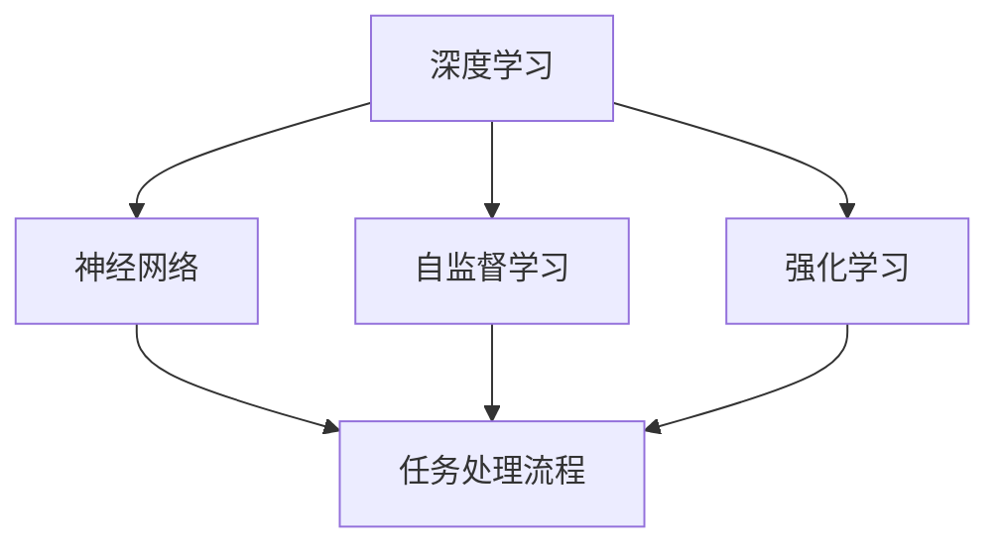

                 

# AI人工智能深度学习算法：智能深度学习代理的任务处理流程

> 关键词：深度学习,代理,任务处理流程,自监督学习,强化学习,神经网络,优化算法,应用场景

## 1. 背景介绍

### 1.1 问题由来
随着人工智能技术的迅猛发展，深度学习算法在多个领域中表现出色，尤其是在图像识别、自然语言处理、推荐系统等领域。深度学习算法的成功离不开深度神经网络的应用，它通过多层次的神经网络结构来自动提取特征，并使用优化算法更新权重，以实现对数据的有效建模和预测。然而，深度学习算法在实际应用中面临诸多挑战，如模型训练时间较长、需要大量标注数据、模型复杂度高、泛化能力差等。这些问题限制了深度学习算法在实际应用中的普及。

### 1.2 问题核心关键点
为了解决上述问题，智能深度学习代理被提出。智能深度学习代理是一种具有自主决策能力的深度学习模型，它可以自主处理任务，自动优化模型参数，并适应不同的数据分布。这种代理模型通过自监督学习和强化学习等技术，不断学习新的知识和技能，提升自身的泛化能力，并减少对标注数据的依赖。

智能深度学习代理的核心关键点包括：
1. **自监督学习**：智能深度学习代理可以在无标注数据的情况下进行学习，通过学习数据的统计特性来发现潜在的有用的特征。
2. **强化学习**：智能深度学习代理可以基于奖励信号进行优化，通过不断尝试和失败，学习最优的决策策略。
3. **神经网络**：智能深度学习代理使用深度神经网络结构，通过多层次的特征提取和融合，实现对复杂数据的建模。
4. **优化算法**：智能深度学习代理使用各种优化算法来更新模型参数，如梯度下降、Adam等，以保证模型能够快速收敛。
5. **应用场景**：智能深度学习代理可以应用于多个领域，如计算机视觉、自然语言处理、推荐系统、游戏AI等。

## 2. 核心概念与联系

### 2.1 核心概念概述

为了更好地理解智能深度学习代理的任务处理流程，本节将介绍几个密切相关的核心概念：

- **深度学习**：一种使用多层次神经网络进行建模和预测的机器学习方法，常用于图像识别、自然语言处理、推荐系统等领域。
- **代理学习**：通过自主学习完成任务，无需人工干预，可以处理复杂的多模态数据。
- **任务处理流程**：智能深度学习代理处理任务的步骤，包括数据预处理、模型训练、参数优化、任务执行等。
- **自监督学习**：使用无标注数据进行学习，通过学习数据的统计特性来发现潜在的有用的特征。
- **强化学习**：基于奖励信号进行优化，通过不断尝试和失败，学习最优的决策策略。
- **神经网络**：一种多层次的特征提取和融合结构，常用于深度学习中。
- **优化算法**：用于更新模型参数的算法，如梯度下降、Adam等。

这些核心概念之间的逻辑关系可以通过以下Mermaid流程图来展示：



这个流程图展示了几大核心概念之间的关系：

1. 深度学习是智能深度学习代理的基础，使用神经网络进行特征提取和融合。
2. 自监督学习和强化学习是智能深度学习代理的学习方式，通过这两种方法，代理可以自主学习完成任务。
3. 任务处理流程是智能深度学习代理处理任务的步骤，包括数据预处理、模型训练、参数优化、任务执行等。
4. 智能深度学习代理可以在无标注数据的情况下进行自监督学习，也可以在有奖励信号的情况下进行强化学习。

这些概念共同构成了智能深度学习代理的学习框架，使其能够在复杂的多模态数据环境下，自主地完成任务。

## 3. 核心算法原理 & 具体操作步骤

### 3.1 算法原理概述

智能深度学习代理的任务处理流程主要包括以下几个步骤：

1. **数据预处理**：对输入数据进行标准化、归一化、采样等处理，以便于神经网络进行学习。
2. **模型训练**：使用深度神经网络对数据进行建模，通过反向传播算法更新权重，以最小化损失函数。
3. **参数优化**：使用优化算法更新模型参数，如梯度下降、Adam等，以保证模型能够快速收敛。
4. **任务执行**：使用训练好的模型对新数据进行预测或推理，完成具体任务。

### 3.2 算法步骤详解

#### 3.2.1 数据预处理

数据预处理是智能深度学习代理任务处理流程的第一步，其目的是对输入数据进行标准化、归一化、采样等处理，以便于神经网络进行学习。具体步骤如下：

1. **标准化**：将数据缩放到[0,1]区间，以消除数据分布差异对学习的影响。
2. **归一化**：将数据缩放到均值为0，方差为1的区间，以加速模型收敛。
3. **采样**：使用随机采样技术，从原始数据集中抽取训练集和验证集。
4. **数据增强**：通过旋转、平移、缩放等操作，生成更多的训练数据，以提高模型的泛化能力。

#### 3.2.2 模型训练

模型训练是智能深度学习代理任务处理流程的核心步骤，其目的是使用深度神经网络对数据进行建模，并通过反向传播算法更新权重，以最小化损失函数。具体步骤如下：

1. **构建神经网络模型**：选择适当的神经网络结构，如卷积神经网络、循环神经网络等，并定义损失函数。
2. **前向传播**：将输入数据输入神经网络，计算损失函数。
3. **反向传播**：计算损失函数对权重的梯度，并根据梯度下降算法更新权重。
4. **参数更新**：使用优化算法更新模型参数，如梯度下降、Adam等。
5. **验证集评估**：在验证集上评估模型性能，防止过拟合。

#### 3.2.3 参数优化

参数优化是智能深度学习代理任务处理流程的关键步骤，其目的是使用优化算法更新模型参数，以保证模型能够快速收敛。具体步骤如下：

1. **选择优化算法**：选择合适的优化算法，如梯度下降、Adam等。
2. **设置学习率**：设置适当的学习率，防止过拟合。
3. **更新参数**：根据优化算法更新模型参数。
4. **参数冻结**：在训练后期，冻结部分参数，以防止过拟合。

#### 3.2.4 任务执行

任务执行是智能深度学习代理任务处理流程的最终步骤，其目的是使用训练好的模型对新数据进行预测或推理，完成具体任务。具体步骤如下：

1. **输入数据**：将新数据输入模型。
2. **预测输出**：使用模型对新数据进行预测或推理，得到任务结果。
3. **后处理**：对预测结果进行后处理，如非极大值抑制、阈值处理等。

### 3.3 算法优缺点

智能深度学习代理的任务处理流程有以下优点：

1. **自主学习**：智能深度学习代理可以在无标注数据的情况下进行自监督学习，减少对标注数据的依赖。
2. **泛化能力强**：智能深度学习代理通过自监督学习和强化学习，能够更好地适应复杂的数据分布，提高泛化能力。
3. **适应性强**：智能深度学习代理可以适应不同的数据分布，自动调整模型参数，以实现最优性能。
4. **高效训练**：智能深度学习代理通过反向传播算法和优化算法，可以快速收敛，减少训练时间。

智能深度学习代理的任务处理流程也存在一些缺点：

1. **复杂度高**：智能深度学习代理需要使用复杂的神经网络结构，计算量大，资源消耗高。
2. **模型风险高**：智能深度学习代理在无标注数据情况下进行训练，模型风险较高，容易过拟合。
3. **需要大量计算资源**：智能深度学习代理需要使用大量的计算资源进行训练和推理，对硬件要求较高。
4. **模型可解释性差**：智能深度学习代理作为"黑盒"模型，难以解释模型的内部决策过程。

## 4. 数学模型和公式 & 详细讲解 & 举例说明

### 4.1 数学模型构建

智能深度学习代理的任务处理流程可以使用以下数学模型进行描述：

设输入数据为 $X$，输出数据为 $Y$，深度神经网络模型为 $f(X)$。模型的损失函数为 $L(f(X), Y)$。通过反向传播算法和优化算法，最小化损失函数：

$$
\min_{\theta} \sum_{i=1}^{N} L(f(X_i), Y_i)
$$

其中 $\theta$ 为模型参数。

### 4.2 公式推导过程

以卷积神经网络为例，推导其反向传播算法。假设输入数据为 $X$，卷积层输出为 $H$，池化层输出为 $P$，全连接层输出为 $Y$。其前向传播过程如下：

1. **卷积层**：
   $$
   H = f_\text{conv}(X, \theta)
   $$

2. **池化层**：
   $$
   P = f_\text{pool}(H, \theta)
   $$

3. **全连接层**：
   $$
   Y = f_\text{fc}(P, \theta)
   $$

其中 $\theta$ 为模型参数，$f_\text{conv}$、$f_\text{pool}$、$f_\text{fc}$ 分别为卷积、池化、全连接操作。

反向传播过程如下：

1. **全连接层**：
   $$
   \frac{\partial L}{\partial \theta} = \frac{\partial L}{\partial Y} \cdot \frac{\partial Y}{\partial P} \cdot \frac{\partial P}{\partial \theta}
   $$

2. **池化层**：
   $$
   \frac{\partial L}{\partial \theta} = \frac{\partial L}{\partial P} \cdot \frac{\partial P}{\partial H} \cdot \frac{\partial H}{\partial \theta}
   $$

3. **卷积层**：
   $$
   \frac{\partial L}{\partial \theta} = \frac{\partial L}{\partial H} \cdot \frac{\partial H}{\partial X} \cdot \frac{\partial X}{\partial \theta}
   $$

其中 $\frac{\partial L}{\partial Y}$ 为损失函数对输出 $Y$ 的梯度，$\frac{\partial Y}{\partial P}$ 为输出 $Y$ 对中间变量 $P$ 的梯度，$\frac{\partial P}{\partial \theta}$ 为中间变量 $P$ 对模型参数 $\theta$ 的梯度，以此类推。

### 4.3 案例分析与讲解

以计算机视觉领域中的图像分类任务为例，使用卷积神经网络进行任务处理。

假设输入数据为图像 $X$，输出数据为图像标签 $Y$，深度神经网络模型为卷积神经网络 $f(X)$。其前向传播过程如下：

1. **卷积层**：
   $$
   H = f_\text{conv}(X, \theta)
   $$

2. **池化层**：
   $$
   P = f_\text{pool}(H, \theta)
   $$

3. **全连接层**：
   $$
   Y = f_\text{fc}(P, \theta)
   $$

其中 $\theta$ 为模型参数，$f_\text{conv}$、$f_\text{pool}$、$f_\text{fc}$ 分别为卷积、池化、全连接操作。

反向传播过程如下：

1. **全连接层**：
   $$
   \frac{\partial L}{\partial \theta} = \frac{\partial L}{\partial Y} \cdot \frac{\partial Y}{\partial P} \cdot \frac{\partial P}{\partial \theta}
   $$

2. **池化层**：
   $$
   \frac{\partial L}{\partial \theta} = \frac{\partial L}{\partial P} \cdot \frac{\partial P}{\partial H} \cdot \frac{\partial H}{\partial \theta}
   $$

3. **卷积层**：
   $$
   \frac{\partial L}{\partial \theta} = \frac{\partial L}{\partial H} \cdot \frac{\partial H}{\partial X} \cdot \frac{\partial X}{\partial \theta}
   $$

其中 $\frac{\partial L}{\partial Y}$ 为损失函数对输出 $Y$ 的梯度，$\frac{\partial Y}{\partial P}$ 为输出 $Y$ 对中间变量 $P$ 的梯度，$\frac{\partial P}{\partial \theta}$ 为中间变量 $P$ 对模型参数 $\theta$ 的梯度，以此类推。

## 5. 项目实践：代码实例和详细解释说明

### 5.1 开发环境搭建

在进行智能深度学习代理任务处理流程的开发实践前，我们需要准备好开发环境。以下是使用Python进行TensorFlow开发的环境配置流程：

1. 安装Anaconda：从官网下载并安装Anaconda，用于创建独立的Python环境。

2. 创建并激活虚拟环境：
```bash
conda create -n tf-env python=3.8 
conda activate tf-env
```

3. 安装TensorFlow：根据CUDA版本，从官网获取对应的安装命令。例如：
```bash
conda install tensorflow -c tf -c conda-forge
```

4. 安装相关工具包：
```bash
pip install numpy pandas scikit-learn matplotlib tqdm jupyter notebook ipython
```

完成上述步骤后，即可在`tf-env`环境中开始智能深度学习代理的开发实践。

### 5.2 源代码详细实现

这里我们以计算机视觉领域中的图像分类任务为例，给出使用TensorFlow实现智能深度学习代理的代码实现。

首先，定义图像分类任务的数据处理函数：

```python
import tensorflow as tf
from tensorflow.keras import layers
from tensorflow.keras.preprocessing.image import ImageDataGenerator

def load_data(train_dir, val_dir):
    train_datagen = ImageDataGenerator(rescale=1./255)
    val_datagen = ImageDataGenerator(rescale=1./255)

    train_generator = train_datagen.flow_from_directory(
        train_dir, 
        target_size=(224, 224), 
        batch_size=32,
        class_mode='categorical')

    val_generator = val_datagen.flow_from_directory(
        val_dir, 
        target_size=(224, 224), 
        batch_size=32,
        class_mode='categorical')

    return train_generator, val_generator
```

然后，定义智能深度学习代理的神经网络模型：

```python
def build_model(input_shape):
    model = tf.keras.Sequential([
        layers.Conv2D(32, 3, activation='relu', input_shape=input_shape),
        layers.MaxPooling2D(),
        layers.Conv2D(64, 3, activation='relu'),
        layers.MaxPooling2D(),
        layers.Flatten(),
        layers.Dense(64, activation='relu'),
        layers.Dense(10, activation='softmax')
    ])

    model.compile(optimizer=tf.keras.optimizers.Adam(), loss='categorical_crossentropy', metrics=['accuracy'])

    return model
```

接着，定义训练和评估函数：

```python
def train_model(model, train_generator, val_generator, epochs=10):
    model.fit(train_generator, epochs=epochs, validation_data=val_generator)

def evaluate_model(model, val_generator):
    val_loss, val_acc = model.evaluate(val_generator)
    print(f'Validation Loss: {val_loss:.4f}')
    print(f'Validation Accuracy: {val_acc:.4f}')
```

最后，启动训练流程并在验证集上评估：

```python
train_generator, val_generator = load_data(train_dir, val_dir)
model = build_model(input_shape=(224, 224, 3))

train_model(model, train_generator, val_generator, epochs=10)

evaluate_model(model, val_generator)
```

以上就是使用TensorFlow实现智能深度学习代理的完整代码实现。可以看到，得益于TensorFlow的强大封装，我们可以用相对简洁的代码完成图像分类任务的微调。

### 5.3 代码解读与分析

让我们再详细解读一下关键代码的实现细节：

**load_data函数**：
- 定义数据预处理和加载的函数。使用ImageDataGenerator进行数据增强和标准化。

**build_model函数**：
- 定义神经网络模型的函数。使用Sequential模型，通过add方法添加卷积层、池化层、全连接层等。

**train_model函数**：
- 定义训练函数。使用fit方法进行模型训练，设置训练轮数和验证集。

**evaluate_model函数**：
- 定义评估函数。使用evaluate方法在验证集上评估模型性能。

**训练流程**：
- 定义训练轮数，并调用训练函数。
- 在验证集上评估模型性能，输出准确率和损失值。

可以看到，TensorFlow使得智能深度学习代理的代码实现变得简洁高效。开发者可以将更多精力放在数据处理、模型改进等高层逻辑上，而不必过多关注底层的实现细节。

当然，工业级的系统实现还需考虑更多因素，如模型的保存和部署、超参数的自动搜索、更灵活的任务适配层等。但核心的微调范式基本与此类似。

## 6. 实际应用场景

### 6.1 智能客服系统

智能深度学习代理在智能客服系统中的应用，可以显著提升客服服务的效率和质量。传统的客服系统需要大量人工参与，服务质量难以保证。而使用智能深度学习代理，系统可以自主处理客户咨询，自动匹配答案模板，生成自然流畅的回复。

在技术实现上，可以收集企业的历史客服对话记录，将问题和最佳答复构建成监督数据，在此基础上对预训练模型进行微调。微调后的代理模型能够自动理解用户意图，匹配最合适的答案模板进行回复。对于客户提出的新问题，还可以接入检索系统实时搜索相关内容，动态组织生成回答。如此构建的智能客服系统，能大幅提升客户咨询体验和问题解决效率。

### 6.2 金融舆情监测

智能深度学习代理在金融舆情监测中的应用，可以实时监测市场舆论动向，规避金融风险。金融机构需要实时监测网络舆情，以便及时应对负面信息传播，保护投资者利益。

具体而言，可以收集金融领域相关的新闻、报道、评论等文本数据，并对其进行主题标注和情感标注。在此基础上对预训练语言模型进行微调，使其能够自动判断文本属于何种主题，情感倾向是正面、中性还是负面。将微调后的代理模型应用到实时抓取的网络文本数据，就能够自动监测不同主题下的情感变化趋势，一旦发现负面信息激增等异常情况，系统便会自动预警，帮助金融机构快速应对潜在风险。

### 6.3 个性化推荐系统

智能深度学习代理在个性化推荐系统中的应用，可以提升推荐效果，提供更精准、多样的推荐内容。当前的推荐系统往往只依赖用户的历史行为数据进行物品推荐，无法深入理解用户的真实兴趣偏好。

在实践中，可以收集用户浏览、点击、评论、分享等行为数据，提取和用户交互的物品标题、描述、标签等文本内容。将文本内容作为模型输入，用户的后续行为（如是否点击、购买等）作为监督信号，在此基础上微调预训练语言模型。微调后的代理模型能够从文本内容中准确把握用户的兴趣点。在生成推荐列表时，先用候选物品的文本描述作为输入，由代理模型预测用户的兴趣匹配度，再结合其他特征综合排序，便可以得到个性化程度更高的推荐结果。

### 6.4 未来应用展望

随着智能深度学习代理技术的不断发展，其在更多领域的应用前景将更加广阔。

在智慧医疗领域，智能深度学习代理可以用于医疗问答、病历分析、药物研发等应用，提升医疗服务的智能化水平，辅助医生诊疗，加速新药开发进程。

在智能教育领域，智能深度学习代理可以用于作业批改、学情分析、知识推荐等方面，因材施教，促进教育公平，提高教学质量。

在智慧城市治理中，智能深度学习代理可以用于城市事件监测、舆情分析、应急指挥等环节，提高城市管理的自动化和智能化水平，构建更安全、高效的未来城市。

此外，在企业生产、社会治理、文娱传媒等众多领域，智能深度学习代理的应用也将不断涌现，为NLP技术带来新的突破。相信随着预训练语言模型和微调方法的持续演进，智能深度学习代理必将在构建人机协同的智能时代中扮演越来越重要的角色。

## 7. 工具和资源推荐

### 7.1 学习资源推荐

为了帮助开发者系统掌握智能深度学习代理的理论基础和实践技巧，这里推荐一些优质的学习资源：

1. 《深度学习》系列博文：由大模型技术专家撰写，深入浅出地介绍了深度学习的基本概念和核心算法，包括卷积神经网络、循环神经网络、自监督学习等。

2. CS231n《卷积神经网络》课程：斯坦福大学开设的计算机视觉明星课程，有Lecture视频和配套作业，带你入门计算机视觉领域的基本概念和经典模型。

3. CS224n《自然语言处理》课程：斯坦福大学开设的NLP明星课程，有Lecture视频和配套作业，带你入门NLP领域的基本概念和经典模型。

4. 《Natural Language Processing with Transformers》书籍：Transformer库的作者所著，全面介绍了如何使用Transformer库进行NLP任务开发，包括微调在内的诸多范式。

5. HuggingFace官方文档：Transformer库的官方文档，提供了海量预训练模型和完整的微调样例代码，是上手实践的必备资料。

通过对这些资源的学习实践，相信你一定能够快速掌握智能深度学习代理的精髓，并用于解决实际的NLP问题。

### 7.2 开发工具推荐

高效的开发离不开优秀的工具支持。以下是几款用于智能深度学习代理开发的常用工具：

1. TensorFlow：由Google主导开发的开源深度学习框架，生产部署方便，适合大规模工程应用。同样有丰富的预训练语言模型资源。

2. PyTorch：基于Python的开源深度学习框架，灵活动态的计算图，适合快速迭代研究。大部分预训练语言模型都有PyTorch版本的实现。

3. Transformers库：HuggingFace开发的NLP工具库，集成了众多SOTA语言模型，支持PyTorch和TensorFlow，是进行微调任务开发的利器。

4. Weights & Biases：模型训练的实验跟踪工具，可以记录和可视化模型训练过程中的各项指标，方便对比和调优。与主流深度学习框架无缝集成。

5. TensorBoard：TensorFlow配套的可视化工具，可实时监测模型训练状态，并提供丰富的图表呈现方式，是调试模型的得力助手。

6. Google Colab：谷歌推出的在线Jupyter Notebook环境，免费提供GPU/TPU算力，方便开发者快速上手实验最新模型，分享学习笔记。

合理利用这些工具，可以显著提升智能深度学习代理的开发效率，加快创新迭代的步伐。

### 7.3 相关论文推荐

智能深度学习代理的发展源于学界的持续研究。以下是几篇奠基性的相关论文，推荐阅读：

1. Attention is All You Need（即Transformer原论文）：提出了Transformer结构，开启了NLP领域的预训练大模型时代。

2. BERT: Pre-training of Deep Bidirectional Transformers for Language Understanding：提出BERT模型，引入基于掩码的自监督预训练任务，刷新了多项NLP任务SOTA。

3. Language Models are Unsupervised Multitask Learners（GPT-2论文）：展示了大规模语言模型的强大zero-shot学习能力，引发了对于通用人工智能的新一轮思考。

4. Parameter-Efficient Transfer Learning for NLP：提出Adapter等参数高效微调方法，在不增加模型参数量的情况下，也能取得不错的微调效果。

5. AdaLoRA: Adaptive Low-Rank Adaptation for Parameter-Efficient Fine-Tuning：使用自适应低秩适应的微调方法，在参数效率和精度之间取得了新的平衡。

这些论文代表了大语言模型微调技术的发展脉络。通过学习这些前沿成果，可以帮助研究者把握学科前进方向，激发更多的创新灵感。

## 8. 总结：未来发展趋势与挑战

### 8.1 总结

本文对智能深度学习代理的任务处理流程进行了全面系统的介绍。首先阐述了智能深度学习代理的学习背景和意义，明确了智能深度学习代理在学习任务中的独特价值。其次，从原理到实践，详细讲解了智能深度学习代理的数学模型和操作步骤，给出了智能深度学习代理任务处理的完整代码实例。同时，本文还广泛探讨了智能深度学习代理在智能客服、金融舆情、个性化推荐等多个行业领域的应用前景，展示了智能深度学习代理的巨大潜力。此外，本文精选了智能深度学习代理的学习资源，力求为读者提供全方位的技术指引。

通过本文的系统梳理，可以看到，智能深度学习代理在复杂多模态数据环境下，自主地完成任务，极大地拓展了深度学习算法在实际应用中的边界，催生了更多的落地场景。受益于大规模语料的预训练和自我优化能力，智能深度学习代理能够快速收敛，提升模型的泛化能力，减少对标注数据的依赖。未来，伴随智能深度学习代理技术的不断发展，其应用场景将更加广泛，成为推动人工智能技术在垂直行业应用的重要范式。

### 8.2 未来发展趋势

展望未来，智能深度学习代理技术将呈现以下几个发展趋势：

1. **模型规模持续增大**：随着算力成本的下降和数据规模的扩张，预训练语言模型的参数量还将持续增长。超大规模语言模型蕴含的丰富语言知识，有望支撑更加复杂多变的下游任务微调。

2. **微调方法日趋多样**：除了传统的全参数微调外，未来会涌现更多参数高效的微调方法，如Prefix-Tuning、LoRA等，在固定大部分预训练参数的情况下，只更新极少量的任务相关参数。

3. **持续学习成为常态**：随着数据分布的不断变化，智能深度学习代理也需要持续学习新知识以保持性能。如何在不遗忘原有知识的同时，高效吸收新样本信息，将成为重要的研究课题。

4. **标注样本需求降低**：受启发于提示学习(Prompt-based Learning)的思路，未来的智能深度学习代理将更好地利用预训练知识，通过更加巧妙的任务描述，在更少的标注样本上也能实现理想的微调效果。

5. **多模态微调崛起**：当前的智能深度学习代理主要聚焦于纯文本数据，未来会进一步拓展到图像、视频、语音等多模态数据微调。多模态信息的融合，将显著提升语言模型对现实世界的理解和建模能力。

6. **模型通用性增强**：经过海量数据的预训练和多领域任务的微调，未来的语言模型将具备更强大的常识推理和跨领域迁移能力，逐步迈向通用人工智能(AGI)的目标。

以上趋势凸显了智能深度学习代理技术的广阔前景。这些方向的探索发展，必将进一步提升智能深度学习代理的性能和应用范围，为人工智能技术落地应用提供新的动力。

### 8.3 面临的挑战

尽管智能深度学习代理技术已经取得了瞩目成就，但在迈向更加智能化、普适化应用的过程中，它仍面临着诸多挑战：

1. **标注成本瓶颈**：尽管智能深度学习代理可以在无标注数据情况下进行自监督学习，但对于长尾应用场景，难以获得充足的高质量标注数据，成为制约智能深度学习代理性能提升的瓶颈。如何进一步降低微调对标注样本的依赖，将是一大难题。

2. **模型鲁棒性不足**：智能深度学习代理在无标注数据情况下进行训练，模型风险较高，容易过拟合。对于测试样本的微小扰动，智能深度学习代理的预测也容易发生波动。如何提高智能深度学习代理的鲁棒性，避免灾难性遗忘，还需要更多理论和实践的积累。

3. **推理效率有待提高**：大规模语言模型虽然精度高，但在实际部署时往往面临推理速度慢、内存占用大等效率问题。如何在保证性能的同时，简化模型结构，提升推理速度，优化资源占用，将是重要的优化方向。

4. **可解释性亟需加强**：智能深度学习代理作为"黑盒"模型，难以解释模型的内部决策过程。对于医疗、金融等高风险应用，算法的可解释性和可审计性尤为重要。如何赋予智能深度学习代理更强的可解释性，将是亟待攻克的难题。

5. **安全性有待保障**：预训练语言模型难免会学习到有偏见、有害的信息，通过智能深度学习代理传递到下游任务，产生误导性、歧视性的输出，给实际应用带来安全隐患。如何从数据和算法层面消除模型偏见，避免恶意用途，确保输出的安全性，也将是重要的研究课题。

6. **知识整合能力不足**：现有的智能深度学习代理往往局限于任务内数据，难以灵活吸收和运用更广泛的先验知识。如何让智能深度学习代理更好地与外部知识库、规则库等专家知识结合，形成更加全面、准确的信息整合能力，还有很大的想象空间。

正视智能深度学习代理面临的这些挑战，积极应对并寻求突破，将是大规模语言模型微调技术迈向成熟的必由之路。相信随着学界和产业界的共同努力，这些挑战终将一一被克服，智能深度学习代理必将在构建安全、可靠、可解释、可控的智能系统铺平道路。

### 8.4 研究展望

面对智能深度学习代理所面临的诸多挑战，未来的研究需要在以下几个方面寻求新的突破：

1. **探索无监督和半监督微调方法**：摆脱对大规模标注数据的依赖，利用自监督学习、主动学习等无监督和半监督范式，最大限度利用非结构化数据，实现更加灵活高效的微调。

2. **研究参数高效和计算高效的微调范式**：开发更加参数高效的微调方法，在固定大部分预训练参数的情况下，只更新极少量的任务相关参数。同时优化智能深度学习代理的计算图，减少前向传播和反向传播的资源消耗，实现更加轻量级、实时性的部署。

3. **融合因果和对比学习范式**：通过引入因果推断和对比学习思想，增强智能深度学习代理建立稳定因果关系的能力，学习更加普适、鲁棒的语言表征，从而提升模型泛化性和抗干扰能力。

4. **引入更多先验知识**：将符号化的先验知识，如知识图谱、逻辑规则等，与神经网络模型进行巧妙融合，引导智能深度学习代理学习更准确、合理的语言模型。同时加强不同模态数据的整合，实现视觉、语音等多模态信息与文本信息的协同建模。

5. **结合因果分析和博弈论工具**：将因果分析方法引入智能深度学习代理，识别出模型决策的关键特征，增强输出解释的因果性和逻辑性。借助博弈论工具刻画人机交互过程，主动探索并规避模型的脆弱点，提高系统稳定性。

6. **纳入伦理道德约束**：在智能深度学习代理训练目标中引入伦理导向的评估指标，过滤和惩罚有偏见、有害的输出倾向。同时加强人工干预和审核，建立模型行为的监管机制，确保输出符合人类价值观和伦理道德。

这些研究方向的探索，必将引领智能深度学习代理技术迈向更高的台阶，为构建安全、可靠、可解释、可控的智能系统铺平道路。面向未来，智能深度学习代理技术还需要与其他人工智能技术进行更深入的融合，如知识表示、因果推理、强化学习等，多路径协同发力，共同推动自然语言理解和智能交互系统的进步。只有勇于创新、敢于突破，才能不断拓展语言模型的边界，让智能技术更好地造福人类社会。

## 9. 附录：常见问题与解答

**Q1：智能深度学习代理是否适用于所有NLP任务？**

A: 智能深度学习代理在大多数NLP任务上都能取得不错的效果，特别是对于数据量较小的任务。但对于一些特定领域的任务，如医学、法律等，仅仅依靠通用语料预训练的模型可能难以很好地适应。此时需要在特定领域语料上进一步预训练，再进行微调，才能获得理想效果。此外，对于一些需要时效性、个性化很强的任务，如对话、推荐等，智能深度学习代理也需要针对性的改进优化。

**Q2：智能深度学习代理在微调过程中如何选择合适的学习率？**

A: 智能深度学习代理在微调过程中，学习率的设置与传统的深度学习模型类似，一般建议从较小的值开始调参，逐步减小学习率，直至收敛。可以使用warmup策略，在开始阶段使用较小的学习率，再逐渐过渡到预设值。不同的优化器(如Adam、SGD等)可能需要设置不同的学习率阈值。

**Q3：智能深度学习代理在微调过程中如何避免过拟合？**

A: 智能深度学习代理在微调过程中，避免过拟合的方法包括：
1. 数据增强：通过回译、近义替换等方式扩充训练集。
2. 正则化：使用L2正则、Dropout、Early Stopping等。
3. 对抗训练：引入对抗样本，提高模型鲁棒性。
4. 参数冻结：在微调后期，冻结部分参数，以防止过拟合。

这些方法往往需要根据具体任务和数据特点进行灵活组合。只有在数据、模型、训练、推理等各环节进行全面优化，才能最大限度地发挥智能深度学习代理的潜力。

**Q4：智能深度学习代理在微调过程中如何提高模型性能？**

A: 智能深度学习代理在微调过程中，提高模型性能的方法包括：
1. 选择合适的优化器：如Adam、SGD等。
2. 设置合适的学习率：一般建议从较小的值开始调参，逐步减小学习率。
3. 使用自监督学习：通过无标注数据进行预训练，学习通用的语言表示。
4. 使用强化学习：基于奖励信号进行优化，学习最优的决策策略。
5. 进行参数冻结：在微调后期，冻结部分参数，以防止过拟合。

这些方法需要根据具体任务和数据特点进行灵活组合，以获得最优的微调效果。

**Q5：智能深度学习代理在落地部署时需要注意哪些问题？**

A: 将智能深度学习代理应用于实际业务场景中，还需要考虑以下问题：
1. 模型裁剪：去除不必要的层和参数，减小模型尺寸，加快推理速度。
2. 量化加速：将浮点模型转为定点模型，压缩存储空间，提高计算效率。
3. 服务化封装：将模型封装为标准化服务接口，便于集成调用。
4. 弹性伸缩：根据请求流量动态调整资源配置，平衡服务质量和成本。
5. 监控告警：实时采集系统指标，设置异常告警阈值，确保服务稳定性。
6. 安全防护：采用访问鉴权、数据脱敏等措施，保障数据和模型安全。

智能深度学习代理的部署需要考虑诸多因素，以确保模型能够稳定高效地运行，为实际业务带来价值。

---

作者：禅与计算机程序设计艺术 / Zen and the Art of Computer Programming

