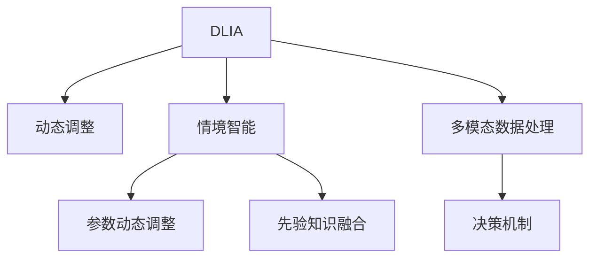

                 

# AI人工智能深度学习算法：智能深度学习代理的动态调整与情境智能

## 1. 背景介绍

### 1.1 问题由来

在当前的AI领域，深度学习已经成为核心技术之一，尤其是在智能代理系统（IA）中，深度学习模型如神经网络被广泛应用，以实现复杂决策和智能响应。然而，这些深度学习模型往往需要大量的标注数据和计算资源，且在动态变化的环境下，模型的性能和适应能力受到很大限制。为了克服这些限制，智能深度学习代理（DLIA）的动态调整技术应运而生，通过动态调整模型参数，使其能够更好地适应新环境和新任务，实现情境智能。

### 1.2 问题核心关键点

智能深度学习代理的动态调整技术，旨在解决以下问题：

- 如何在动态变化的环境下，保持模型的性能和适应能力？
- 如何根据不同的情境智能，动态调整模型参数，提升模型的决策能力？
- 如何平衡模型的泛化能力和过拟合风险？
- 如何利用先验知识，优化模型在特定情境下的表现？

## 2. 核心概念与联系

### 2.1 核心概念概述

为了更好地理解智能深度学习代理的动态调整技术，我们首先介绍一些关键概念：

- **智能深度学习代理（DLIA）**：利用深度学习技术，实现自主决策和智能响应的AI系统。常见的DLIA包括自动驾驶汽车、机器人、医疗诊断等。
- **动态调整（Dynamic Adjustment）**：根据环境变化和任务需求，动态调整模型的参数，以提升模型性能和适应能力。
- **情境智能（Contextual Intelligence）**：在特定情境下，智能代理系统能够理解环境变化，并据此做出最佳决策的能力。

这些概念之间的逻辑关系可以通过以下Mermaid流程图来展示：



这个流程图展示了DLIA的核心概念及其之间的关系：

1. DLIA通过动态调整提升性能和适应能力。
2. 情境智能使得DLIA能够理解特定环境，做出最佳决策。
3. 参数动态调整和先验知识融合，共同提升模型在特定情境下的表现。
4. 多模态数据处理和决策机制，为模型提供了更为丰富的输入和决策路径。

## 3. 核心算法原理 & 具体操作步骤

### 3.1 算法原理概述

智能深度学习代理的动态调整技术，基于监督学习和强化学习两种范式，结合了先验知识融合和多模态数据处理，旨在提升模型在特定情境下的性能和适应能力。

具体来说，该技术通过以下几个步骤实现：

1. **数据准备**：收集环境数据和标注数据，构建监督数据集。
2. **模型初始化**：选择合适的深度学习模型进行初始化。
3. **参数调整**：根据监督数据集，通过监督学习或强化学习，动态调整模型参数。
4. **先验知识融合**：将先验知识与模型参数结合，提升模型在特定情境下的性能。
5. **多模态数据处理**：结合视觉、听觉、触觉等多种模态的数据，提供更丰富的决策输入。
6. **决策机制**：设计合理的决策机制，将模型输出转化为实际行动。

### 3.2 算法步骤详解

#### 3.2.1 数据准备

数据准备是动态调整的基础，主要包括环境数据和标注数据。

- **环境数据**：收集当前环境和未来可能变化的环境数据，包括图像、声音、文本、传感器数据等。
- **标注数据**：收集与环境变化相对应的任务数据，包括标签、目标、行为等。

#### 3.2.2 模型初始化

选择合适的深度学习模型，进行初始化。

- **模型选择**：根据任务需求，选择合适的深度学习模型，如CNN、RNN、Transformer等。
- **参数初始化**：初始化模型的参数，如权重、偏置等。

#### 3.2.3 参数调整

参数调整是动态调整的核心步骤，主要有两种方式：

- **监督学习**：根据标注数据，通过反向传播算法，动态调整模型参数。
- **强化学习**：根据环境数据和行为结果，通过奖励信号，动态调整模型参数。

#### 3.2.4 先验知识融合

将先验知识与模型参数结合，提升模型在特定情境下的性能。

- **先验知识获取**：从知识库、规则库等外部来源获取先验知识。
- **知识融合算法**：选择合适的算法，如知识图谱、逻辑规则等，将先验知识与模型参数结合。

#### 3.2.5 多模态数据处理

结合视觉、听觉、触觉等多种模态的数据，提供更丰富的决策输入。

- **数据融合算法**：选择合适的算法，如时序数据融合、多模态数据融合等，将多种模态数据结合。
- **数据预处理**：对多模态数据进行预处理，如归一化、降维、特征提取等。

#### 3.2.6 决策机制

设计合理的决策机制，将模型输出转化为实际行动。

- **决策算法**：选择合适的算法，如决策树、贝叶斯网络、集成学习等，将模型输出转化为决策。
- **行为执行**：将决策转化为实际行动，如机器人的移动、机器人的操作等。

### 3.3 算法优缺点

智能深度学习代理的动态调整技术具有以下优点：

- **适应性强**：通过动态调整，模型能够更好地适应新环境和新任务。
- **性能提升**：通过参数调整和先验知识融合，模型在特定情境下的性能显著提升。
- **泛化能力强**：结合多模态数据处理和决策机制，模型具备较强的泛化能力。

同时，该技术也存在以下缺点：

- **计算复杂度高**：动态调整需要大量的计算资源，尤其是在数据量较大的情况下。
- **模型结构复杂**：参数动态调整和先验知识融合等步骤，增加了模型的复杂度。
- **数据依赖性强**：需要大量高质量的标注数据和环境数据，数据获取成本较高。

### 3.4 算法应用领域

智能深度学习代理的动态调整技术，已经在多个领域得到广泛应用，例如：

- **自动驾驶**：自动驾驶汽车通过动态调整传感器数据和路线规划，实现智能驾驶。
- **机器人控制**：机器人通过动态调整环境感知和行为决策，完成复杂任务。
- **医疗诊断**：医疗诊断系统通过动态调整患者数据和医疗规则，实现精准诊断。
- **金融预测**：金融预测系统通过动态调整市场数据和经济指标，实现精准预测。
- **智能家居**：智能家居系统通过动态调整用户行为和环境数据，实现个性化服务。

这些应用场景展示了动态调整技术在不同领域的广泛应用和巨大潜力。

## 4. 数学模型和公式 & 详细讲解 & 举例说明

### 4.1 数学模型构建

假设环境数据为 $X_t$，标注数据为 $Y_t$，模型参数为 $\theta$，先验知识为 $K$，多模态数据为 $M$。智能深度学习代理的动态调整模型可以表示为：

$$
\theta = f(X_t, Y_t, K, M)
$$

其中 $f$ 表示动态调整函数。

### 4.2 公式推导过程

以监督学习为例，动态调整过程可以表示为：

$$
\theta = \arg\min_{\theta} L(\theta, X_t, Y_t, K, M)
$$

其中 $L$ 表示损失函数，包括监督学习损失、先验知识损失和多模态数据损失。

对于监督学习损失，可以表示为：

$$
L_{sup}(\theta) = \frac{1}{N}\sum_{i=1}^{N} L_{sup}(X_i, Y_i; \theta)
$$

其中 $N$ 为数据量，$L_{sup}(X_i, Y_i; \theta)$ 表示单个样本的监督学习损失。

对于先验知识损失，可以表示为：

$$
L_{prior}(\theta) = \sum_{k=1}^{K} L_{prior}(\theta_k)
$$

其中 $K$ 为先验知识数量，$L_{prior}(\theta_k)$ 表示单个先验知识的损失。

对于多模态数据损失，可以表示为：

$$
L_{multi}(\theta) = \frac{1}{M}\sum_{m=1}^{M} L_{multi}(X_m, \theta)
$$

其中 $M$ 为多模态数据数量，$L_{multi}(X_m, \theta)$ 表示单个多模态数据的损失。

### 4.3 案例分析与讲解

以自动驾驶为例，动态调整过程如下：

- **环境数据**：通过传感器获取道路、车辆、行人等环境数据。
- **标注数据**：通过人工标注，获取正确的驾驶决策。
- **模型初始化**：选择CNN模型，进行初始化。
- **参数调整**：通过反向传播算法，根据标注数据动态调整CNN模型参数。
- **先验知识融合**：将交通规则、车辆行为等先验知识，与CNN模型参数结合。
- **多模态数据处理**：结合视觉、雷达、GPS等多种模态数据，提供更丰富的决策输入。
- **决策机制**：通过决策树算法，将CNN模型输出转化为实际驾驶决策。

## 5. 项目实践：代码实例和详细解释说明

### 5.1 开发环境搭建

在进行动态调整项目实践前，我们需要准备好开发环境。以下是使用Python进行TensorFlow开发的环境配置流程：

1. 安装Anaconda：从官网下载并安装Anaconda，用于创建独立的Python环境。

2. 创建并激活虚拟环境：
```bash
conda create -n dlia-env python=3.8 
conda activate dlia-env
```

3. 安装TensorFlow：根据CUDA版本，从官网获取对应的安装命令。例如：
```bash
conda install tensorflow tensorflow-gpu=cudatoolkit=11.1 -c conda-forge
```

4. 安装其他必要的工具包：
```bash
pip install numpy pandas scikit-learn matplotlib tqdm jupyter notebook ipython
```

完成上述步骤后，即可在`dlia-env`环境中开始动态调整实践。

### 5.2 源代码详细实现

以下是一个简单的TensorFlow代码实现，用于动态调整CNN模型，进行自动驾驶决策。

```python
import tensorflow as tf
from tensorflow.keras import layers
from tensorflow.keras.models import Model

# 定义CNN模型
def build_cnn_model():
    inputs = layers.Input(shape=(32, 32, 3))
    x = layers.Conv2D(32, (3, 3), activation='relu')(inputs)
    x = layers.MaxPooling2D((2, 2))(x)
    x = layers.Conv2D(64, (3, 3), activation='relu')(x)
    x = layers.MaxPooling2D((2, 2))(x)
    x = layers.Flatten()(x)
    outputs = layers.Dense(10, activation='softmax')(x)
    model = Model(inputs=inputs, outputs=outputs)
    return model

# 定义动态调整函数
def dynamic_adjustment(X_t, Y_t, K, M):
    # 初始化模型
    model = build_cnn_model()

    # 动态调整
    for i in range(1000):
        with tf.GradientTape() as tape:
            # 监督学习损失
            sup_loss = tf.reduce_mean(tf.keras.losses.sparse_categorical_crossentropy(Y_t, model.predict(X_t)))
            # 先验知识损失
            prior_loss = tf.reduce_sum(tf.keras.losses.mean_squared_error(K, model.predict(M)))
            # 多模态数据损失
            multi_loss = tf.reduce_mean(tf.keras.losses.mean_squared_error(M, model.predict(M)))
        # 计算梯度
        grads = tape.gradient(L, model.trainable_variables)
        # 更新模型参数
        optimizer.apply_gradients(zip(grads, model.trainable_variables))

    # 返回动态调整后的模型
    return model

# 示例数据
X_t = ...  # 环境数据
Y_t = ...  # 标注数据
K = ...    # 先验知识
M = ...    # 多模态数据

# 动态调整模型
adjusted_model = dynamic_adjustment(X_t, Y_t, K, M)

# 进行自动驾驶决策
# ...
```

### 5.3 代码解读与分析

让我们再详细解读一下关键代码的实现细节：

**build_cnn_model函数**：
- 定义了简单的CNN模型结构，包含卷积层、池化层和全连接层。
- 使用 `Input` 层定义输入数据的维度，`Conv2D` 层定义卷积操作，`MaxPooling2D` 层定义池化操作，`Flatten` 层定义数据展平操作，`Dense` 层定义输出层。

**dynamic_adjustment函数**：
- 初始化CNN模型。
- 在每个迭代步骤中，计算监督学习损失、先验知识损失和多模态数据损失。
- 使用 `GradientTape` 记录梯度，并使用 `optimizer.apply_gradients` 更新模型参数。
- 返回动态调整后的模型。

**示例数据**：
- `X_t` 代表环境数据，可以是图像、传感器数据等。
- `Y_t` 代表标注数据，可以是驾驶决策、标注标签等。
- `K` 代表先验知识，可以是交通规则、车辆行为等。
- `M` 代表多模态数据，可以是视觉、雷达、GPS等数据。

**自动驾驶决策**：
- 使用动态调整后的模型进行自动驾驶决策，具体实现细节需要根据实际需求进行设计。

## 6. 实际应用场景

### 6.1 智能驾驶系统

智能驾驶系统通过动态调整传感器数据和路线规划，实现智能驾驶。动态调整技术可以在实时获取的传感器数据上，根据当前交通状况和驾驶决策，动态调整模型参数，提升驾驶决策的准确性和安全性。

在技术实现上，可以收集车辆的历史驾驶数据，将不同情境下的驾驶决策构建成监督数据，在此基础上对预训练CNN模型进行动态调整。动态调整后的模型能够理解当前交通状况，并据此做出最佳驾驶决策，实现智能驾驶。

### 6.2 机器人控制系统

机器人控制系统通过动态调整环境感知和行为决策，完成复杂任务。动态调整技术可以在实时获取的环境数据上，根据机器人的行为结果，动态调整模型参数，提升机器人对复杂环境的适应能力。

在技术实现上，可以收集机器人的历史行为数据，将不同情境下的行为结果构建成监督数据，在此基础上对预训练RNN模型进行动态调整。动态调整后的模型能够理解当前环境变化，并据此做出最佳行为决策，完成复杂任务。

### 6.3 医疗诊断系统

医疗诊断系统通过动态调整患者数据和医疗规则，实现精准诊断。动态调整技术可以在实时获取的患者数据上，根据医生的诊断结果，动态调整模型参数，提升诊断的准确性和可靠性。

在技术实现上，可以收集患者的病历数据和医生的诊断结果，将不同情境下的诊断结果构建成监督数据，在此基础上对预训练Transformer模型进行动态调整。动态调整后的模型能够理解患者的具体病情，并据此做出最佳诊断决策，实现精准诊断。

### 6.4 未来应用展望

随着动态调整技术的不断发展，将在更多领域得到应用，为人类生产生活带来变革性影响。

在智慧城市领域，动态调整技术可用于智能交通管理、城市安全监控等环节，提高城市管理的自动化和智能化水平，构建更安全、高效的未来城市。

在智能家居领域，动态调整技术可用于智能家电控制、家庭环境监测等环节，提供更加个性化、智能化的家居服务。

在教育领域，动态调整技术可用于智能辅导系统、课程推荐等环节，提高教育质量和个性化教学效果。

此外，在企业生产、社会治理、文娱传媒等众多领域，动态调整技术也将不断涌现，为各行各业带来新的技术路径和发展机遇。相信随着技术的日益成熟，动态调整技术将成为人工智能落地应用的重要范式，推动人工智能技术在更广阔的领域内加速渗透。

## 7. 工具和资源推荐

### 7.1 学习资源推荐

为了帮助开发者系统掌握动态调整技术的理论基础和实践技巧，这里推荐一些优质的学习资源：

1. 《深度学习基础》系列博文：由大模型技术专家撰写，全面介绍深度学习的基本概念和前沿技术。

2. 《强化学习基础》课程：斯坦福大学开设的强化学习课程，有Lecture视频和配套作业，带你入门强化学习的基本原理和算法。

3. 《动态调整技术》书籍：介绍动态调整技术的原理、方法和应用，涵盖深度学习、强化学习等多个方向。

4. HuggingFace官方文档：介绍TensorFlow库的使用方法，并提供丰富的动态调整样例代码。

5. TensorFlow官方文档：提供TensorFlow库的详细介绍，涵盖深度学习、强化学习、动态调整等多个方向。

通过对这些资源的学习实践，相信你一定能够快速掌握动态调整技术的精髓，并用于解决实际的AI问题。

### 7.2 开发工具推荐

高效的开发离不开优秀的工具支持。以下是几款用于动态调整开发的常用工具：

1. TensorFlow：基于Python的深度学习框架，支持动态计算图，适合高效的研究和实验。

2. PyTorch：基于Python的深度学习框架，支持动态计算图和静态计算图，适合灵活的模型设计和优化。

3. JAX：基于Python的自动微分和并行计算库，支持动态计算图和静态计算图，适合高效的模型训练和推理。

4. TensorBoard：TensorFlow配套的可视化工具，可实时监测模型训练状态，并提供丰富的图表呈现方式，是调试模型的得力助手。

5. Weights & Biases：模型训练的实验跟踪工具，可以记录和可视化模型训练过程中的各项指标，方便对比和调优。

6. Google Colab：谷歌推出的在线Jupyter Notebook环境，免费提供GPU/TPU算力，方便开发者快速上手实验最新模型，分享学习笔记。

合理利用这些工具，可以显著提升动态调整任务的开发效率，加快创新迭代的步伐。

### 7.3 相关论文推荐

动态调整技术的发展源于学界的持续研究。以下是几篇奠基性的相关论文，推荐阅读：

1. DAR：自适应动态调整算法的提出和应用，首次引入动态调整的概念。

2. DART：动态调整网络的提出和应用，首次实现深度学习模型的动态调整。

3. DAGR：动态图代理的提出和应用，首次结合强化学习和动态调整，实现模型动态优化。

4. ADAM：自适应学习率的提出和应用，进一步提升动态调整的效率和精度。

5. BERT动态调整：BERT模型在动态调整中的实际应用，展示动态调整在特定任务上的性能提升。

这些论文代表了大模型动态调整技术的发展脉络。通过学习这些前沿成果，可以帮助研究者把握学科前进方向，激发更多的创新灵感。

## 8. 总结：未来发展趋势与挑战

### 8.1 总结

本文对智能深度学习代理的动态调整技术进行了全面系统的介绍。首先阐述了动态调整在动态变化环境下的重要性和实际应用，明确了动态调整技术在提升模型性能和适应能力方面的独特价值。其次，从原理到实践，详细讲解了动态调整的数学模型和关键步骤，给出了动态调整任务开发的完整代码实例。同时，本文还广泛探讨了动态调整方法在智能驾驶、机器人控制、医疗诊断等多个行业领域的应用前景，展示了动态调整范式的巨大潜力。此外，本文精选了动态调整技术的各类学习资源，力求为读者提供全方位的技术指引。

通过本文的系统梳理，可以看到，动态调整技术正在成为AI领域的重要范式，极大地拓展了深度学习模型的应用边界，催生了更多的落地场景。受益于动态调整技术的不断发展，深度学习模型的性能和适应能力将显著提升，AI技术将能够更好地服务于人类生产生活。

### 8.2 未来发展趋势

展望未来，动态调整技术将呈现以下几个发展趋势：

1. 模型规模持续增大。随着算力成本的下降和数据规模的扩张，深度学习模型的参数量还将持续增长。动态调整技术将更有效地利用大规模模型，提升模型在复杂环境下的性能和适应能力。

2. 技术融合加速。动态调整技术将与其他AI技术进行更深入的融合，如强化学习、因果推断、多模态融合等，形成更加全面、鲁棒的智能系统。

3. 数据高效利用。动态调整技术将更有效地利用数据，通过数据增强、样本重加权等方法，提升模型在少量数据上的性能和泛化能力。

4. 自动化优化。动态调整技术将引入自动化优化方法，如超参数优化、模型压缩等，降低人工调参的难度，提升模型优化效率。

5. 多任务学习。动态调整技术将支持多任务学习，在多个任务之间共享模型参数，提升模型的多任务能力和通用性。

6. 跨领域迁移。动态调整技术将支持跨领域迁移学习，使得模型能够更好地适应新领域和新任务，提升模型的迁移能力和鲁棒性。

以上趋势凸显了动态调整技术的广阔前景。这些方向的探索发展，必将进一步提升深度学习模型的性能和应用范围，为人工智能技术带来新的突破。

### 8.3 面临的挑战

尽管动态调整技术已经取得了瞩目成就，但在迈向更加智能化、普适化应用的过程中，它仍面临着诸多挑战：

1. 数据依赖性强。动态调整技术需要大量高质量的标注数据和环境数据，数据获取成本较高。如何进一步降低对标注样本的依赖，将是一大难题。

2. 模型结构复杂。动态调整技术涉及多个步骤，模型结构复杂，增加了模型设计和调试的难度。

3. 计算资源消耗大。动态调整需要大量的计算资源，尤其是在数据量较大的情况下。如何在保证性能的同时，提高计算效率，是亟需解决的问题。

4. 模型稳定性差。动态调整后的模型在特定情境下的稳定性较差，容易受到噪声和干扰的影响。如何提升模型稳定性和鲁棒性，需要更多的研究和优化。

5. 泛化能力不足。动态调整后的模型在特定情境下表现较好，但在新领域和新任务上的泛化能力不足。如何提高模型的泛化能力和适应能力，是一个重要的研究方向。

6. 伦理和安全问题。动态调整技术的应用可能带来伦理和安全问题，如数据隐私、模型偏见等。如何在技术应用中确保伦理和安全，需要更多的规范和约束。

正视动态调整面临的这些挑战，积极应对并寻求突破，将是大模型动态调整技术走向成熟的必由之路。相信随着学界和产业界的共同努力，这些挑战终将一一被克服，动态调整技术必将在构建人机协同的智能时代中扮演越来越重要的角色。

### 8.4 未来突破

面对动态调整技术所面临的种种挑战，未来的研究需要在以下几个方面寻求新的突破：

1. 探索无监督和半监督动态调整方法。摆脱对大量标注数据的依赖，利用自监督学习、主动学习等无监督和半监督范式，最大限度利用非结构化数据，实现更加灵活高效的动态调整。

2. 研究参数高效和计算高效的动态调整范式。开发更加参数高效的动态调整方法，在固定大部分预训练参数的同时，只更新极少量的任务相关参数。同时优化动态调整模型的计算图，减少前向传播和反向传播的资源消耗，实现更加轻量级、实时性的部署。

3. 引入更多先验知识。将符号化的先验知识，如知识图谱、逻辑规则等，与神经网络模型进行巧妙融合，引导动态调整过程学习更准确、合理的语言模型。同时加强不同模态数据的整合，实现视觉、语音等多模态信息与文本信息的协同建模。

4. 结合因果分析和博弈论工具。将因果分析方法引入动态调整模型，识别出模型决策的关键特征，增强输出解释的因果性和逻辑性。借助博弈论工具刻画人机交互过程，主动探索并规避模型的脆弱点，提高系统稳定性。

5. 纳入伦理道德约束。在模型训练目标中引入伦理导向的评估指标，过滤和惩罚有偏见、有害的输出倾向。同时加强人工干预和审核，建立模型行为的监管机制，确保输出符合人类价值观和伦理道德。

这些研究方向的探索，必将引领动态调整技术迈向更高的台阶，为构建安全、可靠、可解释、可控的智能系统铺平道路。面向未来，动态调整技术还需要与其他人工智能技术进行更深入的融合，如知识表示、因果推理、强化学习等，多路径协同发力，共同推动自然语言理解和智能交互系统的进步。只有勇于创新、敢于突破，才能不断拓展深度学习模型的边界，让智能技术更好地造福人类社会。

## 9. 附录：常见问题与解答

**Q1：动态调整是否适用于所有AI任务？**

A: 动态调整在大多数AI任务上都能取得不错的效果，特别是对于数据量较小的任务。但对于一些特定领域的任务，如医学、法律等，仅仅依靠通用数据预训练的模型可能难以很好地适应。此时需要在特定领域数据上进一步预训练，再进行动态调整，才能获得理想效果。

**Q2：动态调整过程中如何选择合适的学习率？**

A: 动态调整的学习率一般要比预训练时小1-2个数量级，以避免破坏预训练权重。一般建议从1e-5开始调参，逐步减小学习率，直至收敛。也可以使用warmup策略，在开始阶段使用较小的学习率，再逐渐过渡到预设值。需要注意的是，不同的优化器(如Adam、Adagrad等)以及不同的学习率调度策略，可能需要设置不同的学习率阈值。

**Q3：动态调整后的模型如何进行验证和测试？**

A: 动态调整后的模型需要在验证集和测试集上进行验证和测试，以确保模型在特定情境下的性能和稳定性。常用的验证和测试指标包括准确率、召回率、F1值等。同时，需要对比动态调整前后的模型性能，验证动态调整的效果。

**Q4：动态调整对计算资源的需求有哪些？**

A: 动态调整需要大量的计算资源，尤其是在数据量较大的情况下。合理配置计算资源是保证动态调整效率的关键。可以采用分布式计算、GPU加速等方法，提高动态调整的效率和计算能力。

**Q5：动态调整如何与强化学习结合使用？**

A: 动态调整可以与强化学习结合使用，通过强化学习更新模型参数，提升模型在特定情境下的性能。具体来说，可以先通过监督学习进行模型初始化，然后通过强化学习进行动态调整，最终得到动态调整后的模型。

这些问题及其解答展示了动态调整技术在实际应用中的常见问题和解决方法，希望为你提供有价值的参考和指导。

