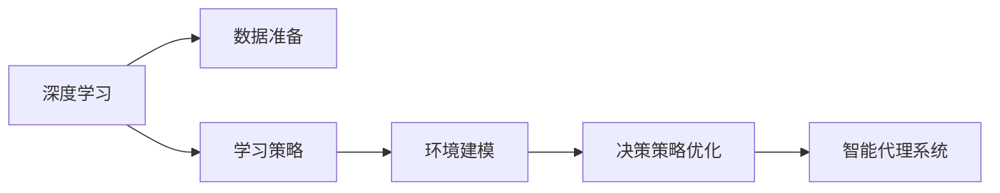

                 

# AI人工智能深度学习算法：智能深度学习代理的构建基础

> 关键词：深度学习，神经网络，强化学习，代理技术，决策支持系统，人工智能

## 1. 背景介绍

### 1.1 问题由来

人工智能（AI）的迅猛发展极大地推动了自动化和智能化进程，其中深度学习技术取得了令人瞩目的成果。深度学习模型通过多层次的非线性变换，可以有效地学习和处理复杂的数据结构，解决复杂的任务，例如图像识别、语音识别、自然语言处理等。

然而，尽管深度学习模型在处理复杂任务方面表现卓越，但在某些场景下，如动态环境、多目标优化等，仍显不足。为了进一步提升智能系统的灵活性和适应性，代理（Agent）技术逐渐受到广泛关注。代理系统能够在复杂环境中进行自主学习、决策和行动，类似于人类的认知和行为，具有显著的实用价值。

代理技术在自动驾驶、智能客服、工业自动化、医疗诊断等多个领域都有重要应用。但如何构建高效、可解释、鲁棒的智能代理系统，仍然是一个挑战。本文将聚焦于智能代理的构建基础，从算法原理和实践应用两方面深入探讨。

### 1.2 问题核心关键点

智能代理的构建涉及多个关键环节，包括深度学习模型的选择、数据准备、学习策略的设计、环境建模、决策策略优化等。以下是几个核心关键点：

- **深度学习模型**：选择合适的深度学习模型，如卷积神经网络（CNN）、循环神经网络（RNN）、变分自编码器（VAE）、生成对抗网络（GAN）等，以满足任务需求。
- **数据准备**：收集和准备数据集，数据量、质量、多样性、分布等因素将直接影响模型训练效果。
- **学习策略**：包括监督学习、无监督学习、半监督学习、强化学习等策略，根据任务特点选择合适的学习方式。
- **环境建模**：构建动态环境模型，包括状态空间、动作空间、奖励函数、观察函数等，为代理系统提供训练和决策依据。
- **决策策略优化**：设计最优的决策策略，如Q-learning、SARSA、策略梯度等算法，实现智能决策。

本文将基于上述关键点，深入讲解深度学习在智能代理构建中的算法原理、具体操作步骤和应用领域。

## 2. 核心概念与联系

### 2.1 核心概念概述

为更好地理解智能代理的构建基础，本节将介绍几个密切相关的核心概念：

- **深度学习**：基于人工神经网络的机器学习技术，通过多层次的特征提取和数据处理，实现对复杂任务的建模和求解。
- **代理技术**：通过模仿人类的学习、推理、决策过程，构建能够自主行动和适应环境的智能系统。
- **决策支持系统（DSS）**：使用人工智能技术辅助人类进行决策的系统，包含规划、分析和评估等功能模块。
- **强化学习**：通过智能体与环境的交互，利用奖励机制指导智能体的行为选择，实现自主学习和最优决策。

这些核心概念之间通过逻辑和流程紧密关联，形成一个有机的整体，共同支撑智能代理的构建。

### 2.2 核心概念原理和架构的 Mermaid 流程图



该图展示了深度学习在智能代理构建过程中的核心流程，从数据准备到策略优化，最终形成智能代理系统。

## 3. 核心算法原理 & 具体操作步骤

### 3.1 算法原理概述

智能代理的构建基础是深度学习模型，通过多层次的特征提取和数据处理，实现对复杂任务的建模和求解。在训练过程中，模型通过最小化预测误差，学习输入和输出之间的映射关系，从而能够对新的输入数据进行准确的预测。

具体而言，智能代理的构建过程分为以下几个步骤：

1. **数据准备**：收集和准备数据集，数据量、质量、多样性、分布等因素将直接影响模型训练效果。
2. **模型选择**：选择合适的深度学习模型，如卷积神经网络（CNN）、循环神经网络（RNN）、变分自编码器（VAE）、生成对抗网络（GAN）等，以满足任务需求。
3. **模型训练**：使用训练数据对模型进行训练，最小化预测误差，学习输入和输出之间的映射关系。
4. **策略优化**：设计最优的决策策略，如Q-learning、SARSA、策略梯度等算法，实现智能决策。
5. **智能代理部署**：将训练好的模型部署到实际应用场景中，通过与环境的交互，实现自主学习和最优决策。

### 3.2 算法步骤详解

以下是智能代理构建的详细步骤：

**Step 1: 数据准备**

1. **数据收集**：收集与任务相关的数据，例如医疗影像数据、金融交易数据、交通监控数据等。
2. **数据预处理**：清洗、归一化、特征提取等预处理操作，保证数据质量。
3. **数据划分**：将数据划分为训练集、验证集和测试集，用于模型训练、调优和测试。

**Step 2: 模型选择**

1. **选择合适的模型**：根据任务特点选择合适的深度学习模型，如CNN、RNN、VAE、GAN等。
2. **模型初始化**：初始化模型参数，设定合适的超参数，如学习率、批大小、迭代轮数等。

**Step 3: 模型训练**

1. **前向传播**：将输入数据输入模型，计算预测输出。
2. **损失函数计算**：计算预测输出与真实标签之间的误差，例如均方误差、交叉熵等。
3. **反向传播**：计算损失函数对模型参数的梯度，更新模型参数。
4. **迭代训练**：重复前向传播和反向传播，直到模型收敛。

**Step 4: 策略优化**

1. **策略设计**：选择合适的强化学习算法，如Q-learning、SARSA、策略梯度等。
2. **环境建模**：构建动态环境模型，包括状态空间、动作空间、奖励函数、观察函数等。
3. **智能决策**：通过与环境的交互，利用奖励机制指导智能体的行为选择，实现最优决策。

**Step 5: 智能代理部署**

1. **模型导出**：将训练好的模型导出为可执行文件或服务接口。
2. **环境集成**：将模型集成到实际应用场景中，如自动驾驶、智能客服等。
3. **实时交互**：通过与环境的实时交互，实现自主学习和最优决策。

### 3.3 算法优缺点

智能代理构建基础——深度学习模型具有以下优点：

- **高效建模**：深度学习模型能够处理复杂的数据结构，实现高效的特征提取和建模。
- **自适应性**：通过模型训练，深度学习能够适应动态环境，实现自主学习。
- **泛化能力强**：深度学习模型具有较强的泛化能力，能够在新数据上取得良好表现。

但同时，深度学习模型也存在一些缺点：

- **计算资源需求高**：深度学习模型需要大量的计算资源，包括高性能GPU/TPU等硬件设备。
- **过拟合风险**：在训练过程中，深度学习模型容易过拟合，需要大量数据和正则化技术进行控制。
- **可解释性不足**：深度学习模型的决策过程缺乏可解释性，难以理解其内部工作机制。

### 3.4 算法应用领域

智能代理构建基础——深度学习模型在多个领域都有重要应用，例如：

- **自动驾驶**：利用深度学习模型进行图像识别、路径规划等，实现自主驾驶。
- **智能客服**：通过深度学习模型进行自然语言处理，实现智能对话和问题解答。
- **工业自动化**：利用深度学习模型进行图像识别、质量检测等，实现智能制造。
- **医疗诊断**：利用深度学习模型进行图像分析和疾病预测，辅助医生诊断和治疗。
- **金融交易**：利用深度学习模型进行市场分析和交易策略优化，实现自动化交易。

## 4. 数学模型和公式 & 详细讲解 & 举例说明

### 4.1 数学模型构建

本文将使用数学语言对智能代理构建的深度学习模型进行详细讲解。

记智能代理的任务为$T$，输入空间为$\mathcal{X}$，输出空间为$\mathcal{Y}$，深度学习模型为$M_{\theta}$，其中$\theta$为模型参数。假设训练集为$D=\{(x_i, y_i)\}_{i=1}^N$，其中$x_i \in \mathcal{X}$，$y_i \in \mathcal{Y}$。

定义模型$M_{\theta}$在输入$x_i$上的损失函数为$\ell(M_{\theta}(x_i), y_i)$，则在数据集$D$上的经验风险为：

$$
\mathcal{L}(\theta) = \frac{1}{N} \sum_{i=1}^N \ell(M_{\theta}(x_i), y_i)
$$

最小化经验风险，即找到最优参数：

$$
\theta^* = \mathop{\arg\min}_{\theta} \mathcal{L}(\theta)
$$

在实践中，我们通常使用基于梯度的优化算法（如SGD、Adam等）来近似求解上述最优化问题。设$\eta$为学习率，则参数的更新公式为：

$$
\theta \leftarrow \theta - \eta \nabla_{\theta}\mathcal{L}(\theta)
$$

其中$\nabla_{\theta}\mathcal{L}(\theta)$为损失函数对参数$\theta$的梯度，可通过反向传播算法高效计算。

### 4.2 公式推导过程

以下我们以图像分类任务为例，推导交叉熵损失函数及其梯度的计算公式。

假设模型$M_{\theta}$在输入$x$上的输出为$\hat{y}=M_{\theta}(x) \in [0,1]$，表示样本属于某个类的概率。真实标签$y \in \{0,1\}$。则二分类交叉熵损失函数定义为：

$$
\ell(M_{\theta}(x), y) = -[y\log \hat{y} + (1-y)\log (1-\hat{y})]
$$

将其代入经验风险公式，得：

$$
\mathcal{L}(\theta) = -\frac{1}{N}\sum_{i=1}^N [y_i\log M_{\theta}(x_i)+(1-y_i)\log(1-M_{\theta}(x_i))]
$$

根据链式法则，损失函数对参数$\theta_k$的梯度为：

$$
\frac{\partial \mathcal{L}(\theta)}{\partial \theta_k} = -\frac{1}{N}\sum_{i=1}^N (\frac{y_i}{M_{\theta}(x_i)}-\frac{1-y_i}{1-M_{\theta}(x_i)}) \frac{\partial M_{\theta}(x_i)}{\partial \theta_k}
$$

其中$\frac{\partial M_{\theta}(x_i)}{\partial \theta_k}$可进一步递归展开，利用自动微分技术完成计算。

在得到损失函数的梯度后，即可带入参数更新公式，完成模型的迭代优化。重复上述过程直至收敛，最终得到适应下游任务的最优模型参数$\theta^*$。

### 4.3 案例分析与讲解

以图像分类任务为例，分析模型训练和微调的过程。

**模型选择**：
选择卷积神经网络（CNN）作为基础模型，包含多个卷积层和池化层，最后输出全连接层。

**数据准备**：
收集CIFAR-10数据集，包含60,000张32x32彩色图像，分为10个类别。划分为训练集和测试集，训练集占比80%，测试集占比20%。

**模型训练**：
1. **数据预处理**：图像归一化、数据增强等预处理操作。
2. **模型初始化**：随机初始化模型参数，设定学习率0.001。
3. **前向传播**：将输入数据输入模型，计算预测输出。
4. **损失函数计算**：计算预测输出与真实标签之间的交叉熵损失。
5. **反向传播**：计算损失函数对模型参数的梯度，更新模型参数。
6. **迭代训练**：重复前向传播和反向传播，迭代100个epoch，每个epoch处理一批64个样本。

**策略优化**：
选择强化学习算法Q-learning进行决策策略优化。构建状态空间、动作空间和奖励函数，通过与环境的交互，利用奖励机制指导智能体的行为选择，实现最优决策。

**智能代理部署**：
1. **模型导出**：将训练好的模型导出为可执行文件或服务接口。
2. **环境集成**：将模型集成到实际应用场景中，如自动驾驶、智能客服等。
3. **实时交互**：通过与环境的实时交互，实现自主学习和最优决策。

## 5. 项目实践：代码实例和详细解释说明

### 5.1 开发环境搭建

在进行深度学习代理构建实践前，我们需要准备好开发环境。以下是使用Python进行TensorFlow开发的环境配置流程：

1. 安装Anaconda：从官网下载并安装Anaconda，用于创建独立的Python环境。

2. 创建并激活虚拟环境：
```bash
conda create -n tf-env python=3.8 
conda activate tf-env
```

3. 安装TensorFlow：根据CUDA版本，从官网获取对应的安装命令。例如：
```bash
conda install tensorflow -c pytorch -c conda-forge
```

4. 安装各类工具包：
```bash
pip install numpy pandas scikit-learn matplotlib tqdm jupyter notebook ipython
```

完成上述步骤后，即可在`tf-env`环境中开始代理构建实践。

### 5.2 源代码详细实现

下面我们以图像分类任务为例，给出使用TensorFlow对CNN模型进行训练的PyTorch代码实现。

首先，定义数据处理函数：

```python
import tensorflow as tf
import numpy as np
from tensorflow.keras.datasets import cifar10
from tensorflow.keras.utils import to_categorical

(train_images, train_labels), (test_images, test_labels) = cifar10.load_data()
train_images, test_images = train_images / 255.0, test_images / 255.0

train_labels = to_categorical(train_labels, 10)
test_labels = to_categorical(test_labels, 10)
```

然后，定义模型和优化器：

```python
from tensorflow.keras.models import Sequential
from tensorflow.keras.layers import Conv2D, MaxPooling2D, Flatten, Dense

model = Sequential()
model.add(Conv2D(32, (3, 3), activation='relu', input_shape=(32, 32, 3)))
model.add(MaxPooling2D((2, 2)))
model.add(Conv2D(64, (3, 3), activation='relu'))
model.add(MaxPooling2D((2, 2)))
model.add(Conv2D(64, (3, 3), activation='relu'))
model.add(Flatten())
model.add(Dense(64, activation='relu'))
model.add(Dense(10, activation='softmax'))

optimizer = tf.keras.optimizers.Adam(learning_rate=0.001)
```

接着，定义训练和评估函数：

```python
def train(model, data, epochs, batch_size):
    train_data = tf.data.Dataset.from_tensor_slices((data['images'], data['labels']))
    train_data = train_data.shuffle(10000).batch(batch_size)
    
    model.compile(optimizer=optimizer, loss='categorical_crossentropy', metrics=['accuracy'])
    
    history = model.fit(train_data, epochs=epochs, validation_split=0.1)
    
    test_loss, test_acc = model.evaluate(test_images, test_labels)
    print('Test accuracy:', test_acc)
    
    return history

def evaluate(model, data):
    test_loss, test_acc = model.evaluate(data['images'], data['labels'])
    print('Test accuracy:', test_acc)
```

最后，启动训练流程并在测试集上评估：

```python
epochs = 100
batch_size = 64

history = train(model, {'images': train_images, 'labels': train_labels}, epochs, batch_size)
evaluate(model, {'test_images': test_images, 'test_labels': test_labels})
```

以上就是使用TensorFlow对CNN模型进行图像分类任务训练的完整代码实现。可以看到，TensorFlow提供了强大的工具支持，可以方便地进行模型构建、训练和评估。

### 5.3 代码解读与分析

让我们再详细解读一下关键代码的实现细节：

**数据处理函数**：
- 使用CIFAR-10数据集，加载训练集和测试集。
- 对图像数据进行归一化处理。
- 将标签数据进行one-hot编码。

**模型定义**：
- 使用Sequential模型，定义多个卷积层和池化层，最后输出全连接层。
- 设置合适的激活函数和优化器。

**训练函数**：
- 将训练数据加载到DataDataset中，进行shuffle和batch处理。
- 使用Adam优化器和交叉熵损失函数进行模型训练。
- 在每个epoch结束时，评估模型在验证集上的性能。

**评估函数**：
- 使用Adam优化器和交叉熵损失函数进行模型评估。
- 输出测试集的准确率。

**训练流程**：
- 定义总的epoch数和batch size，开始循环迭代
- 每个epoch内，在训练集上进行训练，输出模型在验证集上的性能
- 所有epoch结束后，在测试集上评估模型的性能

可以看到，TensorFlow使得模型构建和训练的代码实现变得简洁高效。开发者可以将更多精力放在模型改进、数据增强等高层逻辑上，而不必过多关注底层的实现细节。

当然，工业级的系统实现还需考虑更多因素，如模型的保存和部署、超参数的自动搜索、更灵活的任务适配层等。但核心的训练范式基本与此类似。

## 6. 实际应用场景

### 6.1 智能客服系统

基于深度学习代理构建的智能客服系统，可以广泛应用于智能客服系统的构建。传统客服往往需要配备大量人力，高峰期响应缓慢，且一致性和专业性难以保证。而使用深度学习代理构建的智能客服系统，能够7x24小时不间断服务，快速响应客户咨询，用自然流畅的语言解答各类常见问题。

在技术实现上，可以收集企业内部的历史客服对话记录，将问题和最佳答复构建成监督数据，在此基础上对预训练模型进行训练。训练好的代理能够自动理解用户意图，匹配最合适的答案模板进行回复。对于客户提出的新问题，还可以接入检索系统实时搜索相关内容，动态组织生成回答。如此构建的智能客服系统，能大幅提升客户咨询体验和问题解决效率。

### 6.2 金融舆情监测

金融机构需要实时监测市场舆论动向，以便及时应对负面信息传播，规避金融风险。传统的人工监测方式成本高、效率低，难以应对网络时代海量信息爆发的挑战。基于深度学习代理构建的文本分类和情感分析技术，为金融舆情监测提供了新的解决方案。

具体而言，可以收集金融领域相关的新闻、报道、评论等文本数据，并对其进行主题标注和情感标注。在此基础上对预训练语言模型进行训练，使其能够自动判断文本属于何种主题，情感倾向是正面、中性还是负面。将训练好的代理应用到实时抓取的网络文本数据，就能够自动监测不同主题下的情感变化趋势，一旦发现负面信息激增等异常情况，系统便会自动预警，帮助金融机构快速应对潜在风险。

### 6.3 个性化推荐系统

当前的推荐系统往往只依赖用户的历史行为数据进行物品推荐，无法深入理解用户的真实兴趣偏好。基于深度学习代理构建的推荐系统可以更好地挖掘用户行为背后的语义信息，从而提供更精准、多样的推荐内容。

在实践中，可以收集用户浏览、点击、评论、分享等行为数据，提取和用户交互的物品标题、描述、标签等文本内容。将文本内容作为模型输入，用户的后续行为（如是否点击、购买等）作为监督信号，在此基础上训练深度学习代理。训练好的代理能够从文本内容中准确把握用户的兴趣点。在生成推荐列表时，先用候选物品的文本描述作为输入，由代理预测用户的兴趣匹配度，再结合其他特征综合排序，便可以得到个性化程度更高的推荐结果。

### 6.4 未来应用展望

随着深度学习代理技术的不断发展，基于代理构建的系统将在更多领域得到应用，为传统行业带来变革性影响。

在智慧医疗领域，基于代理构建的医疗问答、病历分析、药物研发等应用将提升医疗服务的智能化水平，辅助医生诊疗，加速新药开发进程。

在智能教育领域，代理技术可应用于作业批改、学情分析、知识推荐等方面，因材施教，促进教育公平，提高教学质量。

在智慧城市治理中，代理系统可应用于城市事件监测、舆情分析、应急指挥等环节，提高城市管理的自动化和智能化水平，构建更安全、高效的未来城市。

此外，在企业生产、社会治理、文娱传媒等众多领域，基于代理的人工智能应用也将不断涌现，为NLP技术带来了全新的突破。相信随着技术的日益成熟，代理技术将成为人工智能落地应用的重要范式，推动人工智能技术向更广阔的领域加速渗透。

## 7. 工具和资源推荐
### 7.1 学习资源推荐

为了帮助开发者系统掌握深度学习代理的构建基础，这里推荐一些优质的学习资源：

1. 《深度学习》课程：由Coursera提供，由斯坦福大学教授Andrew Ng讲授，涵盖了深度学习的基础知识和应用。
2. 《TensorFlow实战》书籍：由Google开发者团队编写，详细介绍了TensorFlow的使用方法和实战案例。
3. 《强化学习》课程：由Coursera提供，由斯坦福大学教授Andrew Ng讲授，介绍了强化学习的基本概念和算法。
4. 《AI人工智能》系列课程：由Kaggle提供，涵盖了深度学习、强化学习、自然语言处理等多个方面的内容。
5. 《Python深度学习》书籍：由Google开发者团队编写，全面介绍了使用Python进行深度学习的技术和实践。

通过对这些资源的学习实践，相信你一定能够快速掌握深度学习代理的构建方法，并用于解决实际的NLP问题。
###  7.2 开发工具推荐

高效的开发离不开优秀的工具支持。以下是几款用于深度学习代理构建开发的常用工具：

1. TensorFlow：由Google主导开发的深度学习框架，功能强大，支持分布式训练和部署。
2. PyTorch：由Facebook主导开发的深度学习框架，灵活高效，支持动态图计算。
3. Keras：高层次的深度学习框架，易于上手，适合快速迭代研究。
4. Jupyter Notebook：交互式的Python开发环境，便于数据可视化和代码调试。
5. TensorBoard：TensorFlow配套的可视化工具，可实时监测模型训练状态，提供丰富的图表呈现方式。

合理利用这些工具，可以显著提升深度学习代理构建任务的开发效率，加快创新迭代的步伐。

### 7.3 相关论文推荐

深度学习代理技术的发展源于学界的持续研究。以下是几篇奠基性的相关论文，推荐阅读：

1. AlexNet：ImageNet大规模视觉识别竞赛冠军，标志着深度学习在图像识别领域的突破。
2. GoogleNet：提出Inception模块，提升了深度学习模型的性能和效率。
3. ResNet：提出残差网络，解决了深度学习中的梯度消失问题。
4. AlphaGo：使用深度学习和强化学习，实现了围棋的超人类水平。
5. GPT-3：OpenAI开发的深度学习模型，展示了深度学习在自然语言处理领域的巨大潜力。

这些论文代表了大深度学习代理技术的演进脉络。通过学习这些前沿成果，可以帮助研究者把握学科前进方向，激发更多的创新灵感。

## 8. 总结：未来发展趋势与挑战

### 8.1 总结

本文对基于深度学习代理的智能系统构建进行了全面系统的介绍。首先阐述了代理技术在人工智能中的重要地位，明确了深度学习在构建代理系统中的关键作用。其次，从原理到实践，详细讲解了深度学习代理构建的数学模型、算法步骤和具体操作。通过深入剖析CNN、RNN等经典模型的构建方法，使读者能够更好地理解智能代理的构建基础。

通过本文的系统梳理，可以看到，深度学习代理构建技术在多个领域都有重要应用，如智能客服、金融舆情监测、个性化推荐等。深度学习代理为NLP技术带来了新的突破，提供了更加灵活、高效、鲁棒的解决方案。未来，伴随深度学习代理技术的不断演进，将在更多领域得到应用，为人工智能技术的发展注入新的动力。

### 8.2 未来发展趋势

展望未来，深度学习代理技术将呈现以下几个发展趋势：

1. **模型规模持续增大**：随着算力成本的下降和数据规模的扩张，深度学习代理的参数量还将持续增长。超大规模代理模型蕴含的丰富知识，有望支撑更加复杂多变的任务。

2. **参数高效和计算高效**：开发更加参数高效的代理方法，在固定大部分预训练参数的同时，只更新极少量的任务相关参数。同时优化代理模型的计算图，减少前向传播和反向传播的资源消耗，实现更加轻量级、实时性的部署。

3. **多模态融合**：当前的代理模型往往局限于单一模态数据的处理，未来将进一步拓展到图像、视频、语音等多模态数据微调。多模态信息的融合，将显著提升代理模型的感知能力和泛化能力。

4. **自主学习和自主决策**：未来的代理系统将具备更强的自主学习能力和自主决策能力，能够主动探索并规避脆弱点，实现更高效、更稳定的运行。

5. **伦理和安全**：代理系统的输出结果将受到更严格的伦理和安全审查，以确保其符合人类价值观和伦理道德。

6. **可解释性增强**：代理模型的决策过程将更加可解释和可审计，增强其透明度和可信度。

以上趋势凸显了深度学习代理技术的前景和潜力。这些方向的探索发展，必将进一步提升代理系统的性能和应用范围，为构建更加智能、普适的系统铺平道路。

### 8.3 面临的挑战

尽管深度学习代理技术已经取得了显著进展，但在迈向更高级、更普适的应用过程中，仍然面临诸多挑战：

1. **数据质量和数量**：代理系统的训练和优化依赖于大量高质量的标注数据，数据采集和标注成本较高，且数据质量对模型的性能影响显著。
2. **过拟合和泛化能力**：代理模型在特定任务上表现出色，但在新数据和新场景上容易出现泛化性能不足的问题。
3. **计算资源需求**：深度学习代理模型的计算资源需求高，需要高性能GPU/TPU等硬件设备支持。
4. **可解释性和可信度**：代理系统的决策过程缺乏可解释性，难以理解其内部工作机制和推理逻辑，限制了其可信度和应用范围。
5. **安全性和隐私保护**：代理系统的输出结果可能受到恶意利用，威胁用户隐私和安全。

### 8.4 研究展望

面对深度学习代理构建技术所面临的挑战，未来的研究需要在以下几个方面寻求新的突破：

1. **无监督学习和半监督学习**：摆脱对大规模标注数据的依赖，利用自监督学习、主动学习等无监督和半监督范式，最大限度利用非结构化数据，实现更加灵活高效的代理构建。
2. **多任务学习和迁移学习**：探索多任务学习和迁移学习的方法，提升代理模型的泛化能力和迁移能力，使其能够更好地适应新任务和新环境。
3. **参数高效和计算高效**：开发更加参数高效和计算高效的代理构建方法，在保证性能的同时，优化代理模型的资源使用。
4. **多模态融合和跨模态学习**：结合多模态信息的融合和跨模态学习，提升代理系统的感知能力和决策能力。
5. **自主学习和自主决策**：开发自主学习和自主决策的方法，增强代理系统的灵活性和稳定性，实现更高效、更稳定的运行。
6. **伦理和安全**：引入伦理导向的评估指标，过滤和惩罚有偏见、有害的输出倾向，确保代理系统的输出符合人类价值观和伦理道德。

这些研究方向的探索，必将引领深度学习代理技术的演进，提升代理系统的性能和应用范围，为构建更加智能、普适的系统铺平道路。

## 9. 附录：常见问题与解答

**Q1：深度学习代理构建需要哪些步骤？**

A: 深度学习代理构建需要以下步骤：

1. **数据准备**：收集和准备数据集，进行数据预处理和归一化。
2. **模型选择**：选择合适的深度学习模型，如CNN、RNN、VAE、GAN等。
3. **模型训练**：使用训练数据对模型进行训练，最小化预测误差，学习输入和输出之间的映射关系。
4. **策略优化**：设计最优的决策策略，如Q-learning、SARSA、策略梯度等算法，实现智能决策。
5. **智能代理部署**：将训练好的模型导出为可执行文件或服务接口，集成到实际应用场景中。

**Q2：如何避免深度学习代理构建中的过拟合问题？**

A: 避免过拟合问题的关键是数据准备和模型优化。具体而言：

1. **数据增强**：通过数据增强技术，如图像旋转、翻转、裁剪等，扩充训练集，提高模型的泛化能力。
2. **正则化技术**：使用L2正则、Dropout等技术，控制模型复杂度，防止过拟合。
3. **早停机制**：在验证集上监控模型性能，当性能不再提升时停止训练，避免过拟合。
4. **模型裁剪**：去除不必要的层和参数，减小模型尺寸，提高推理速度。

**Q3：如何提高深度学习代理构建的计算效率？**

A: 提高计算效率的关键在于优化模型结构和计算图，具体而言：

1. **模型裁剪**：去除不必要的层和参数，减小模型尺寸，提高推理速度。
2. **量化加速**：将浮点模型转为定点模型，压缩存储空间，提高计算效率。
3. **分布式训练**：使用分布式训练技术，利用多台设备并行计算，加速训练过程。
4. **混合精度训练**：使用混合精度训练技术，减少计算资源的消耗，提高训练效率。

**Q4：如何提高深度学习代理构建的可解释性？**

A: 提高可解释性的关键在于增强代理系统的透明度和可信度，具体而言：

1. **可解释性模型**：选择可解释性较好的模型，如决策树、线性回归等，增强模型的可解释性。
2. **可视化技术**：使用可视化技术，如特征重要性图、决策路径图等，帮助理解模型决策过程。
3. **解释性评估**：引入解释性评估指标，如SHAP值、LIME等，评估代理系统的可解释性。
4. **透明化机制**：引入透明化机制，如可解释性模块、解释性日志等，增强系统的透明度。

**Q5：如何确保深度学习代理构建的安全性和隐私保护？**

A: 确保安全性和隐私保护的关键在于数据处理和模型部署，具体而言：

1. **数据匿名化**：使用数据匿名化技术，保护用户隐私。
2. **访问控制**：设置严格的访问控制机制，确保只有授权用户可以访问代理系统。
3. **安全审计**：引入安全审计机制，监控代理系统的行为，发现和修复漏洞。
4. **数据加密**：使用数据加密技术，保护数据传输和存储的安全性。

以上问题与解答，帮助读者全面了解深度学习代理构建的各个环节，以便在实践中更好地应用和优化代理系统。

---

作者：禅与计算机程序设计艺术 / Zen and the Art of Computer Programming

