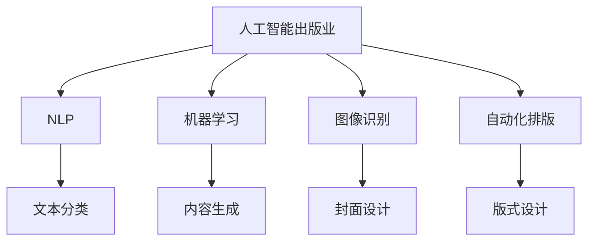

                 

# AI出版业前景：技术创新，场景无限

> 关键词：人工智能出版业, 自然语言处理(NLP), 机器学习(ML), 图像识别, 自动化排版, 智慧出版

## 1. 背景介绍

随着互联网的普及和数字化转型，出版业面临巨大的挑战和机遇。一方面，海量信息的爆炸使得读者获取知识的方式发生了深刻变革，出版行业的数字化转型迫在眉睫。另一方面，人工智能技术的快速发展为出版业注入了新的动力，带来了前所未有的可能性。

传统出版业主要依赖人工编辑和印刷流程，流程复杂，成本高昂，且信息传播速度较慢。然而，随着人工智能技术和大数据的发展，出版业可以借助算法自动化处理大量数据，大幅提高生产效率，降低成本，同时也能快速响应市场变化，提升内容质量。本文将深入探讨人工智能技术如何赋能出版业，推动其从传统模式向智能化、自动化方向转型，实现业务的创新和发展。

## 2. 核心概念与联系

### 2.1 核心概念概述

为更好地理解AI在出版业中的应用，本节将介绍几个核心概念：

- **人工智能出版业（AI Publishing）**：指利用人工智能技术，从内容创作、编辑校对、排版印刷到发行流通等各个环节，提升出版效率和质量，降低成本，实现出版的智能化、自动化和个性化。

- **自然语言处理（NLP）**：指利用计算机处理人类语言信息，如文本分类、情感分析、关键词提取、摘要生成等，是AI出版业中应用最为广泛的技术之一。

- **机器学习（ML）**：指通过算法模型自动分析数据，学习规律，并作出预测或决策。在出版业中，ML可以用于推荐系统、内容生成、版式设计等环节。

- **图像识别**：指利用计算机对图像进行自动识别和分类，应用于封面设计、图片标注、视觉辅助排版等。

- **自动化排版**：指通过计算机程序自动排版、格式化和生成版式文件，提升出版流程的效率和准确性。

- **智慧出版**：指利用AI技术，实现出版内容、流程、管理和服务的全面智能化，提升出版的可读性、互动性和可操作性。

这些概念之间的联系可以通过以下Mermaid流程图来展示：



这个流程图展示了大语言模型的工作原理和它们之间的联系：

1. 人工智能出版业通过NLP、ML等技术进行内容创作和处理，提升出版效率。
2. 图像识别技术用于封面设计和视觉辅助排版，增强出版的视觉效果。
3. 自动化排版技术提升出版流程的效率和准确性。
4. 智慧出版实现出版的全面智能化，提升可读性和互动性。

这些技术共同构成了AI出版业的核心技术框架，使其能够在各个环节提升出版质量和效率。

## 3. 核心算法原理 & 具体操作步骤

### 3.1 算法原理概述

AI出版业的核心算法原理主要包括自然语言处理（NLP）、机器学习（ML）和计算机视觉技术。本文将以NLP技术为例，深入介绍其在出版业中的应用。

### 3.2 算法步骤详解

以下是利用NLP技术进行出版物内容生成和处理的详细步骤：

1. **文本预处理**：将原始文本进行分词、去除停用词、词性标注等预处理操作，便于后续处理。

2. **文本分类**：使用分类模型，将文本划分为新闻、科普、文学等不同类型，便于后续的排版和发布。

3. **关键词提取**：使用TF-IDF或word2vec等算法，提取文本中的关键词，用于内容的推荐和关联。

4. **情感分析**：使用情感分析模型，判断文本情感倾向，用于内容推荐和筛选。

5. **文本摘要**：使用摘要模型，生成文本的简洁摘要，便于用户快速了解内容。

6. **文本校对**：使用自然语言模型，检查文本中的语法错误和拼写错误，提升内容质量。

7. **文本翻译**：使用机器翻译模型，将多语言文本翻译成目标语言，便于跨国出版和传播。

### 3.3 算法优缺点

NLP在出版业中具有以下优点：

- 自动化处理：通过算法自动化处理大量文本数据，提高出版效率。
- 降低成本：减少人工编辑和校对的需求，降低人力成本。
- 提升质量：通过机器学习，提升内容的准确性和一致性。

同时，NLP技术也存在一些缺点：

- 依赖高质量数据：NLP模型需要大量的标注数据进行训练，数据质量不高会影响模型效果。
- 语言理解和生成能力的局限性：不同语言的复杂度和表达方式不同，NLP技术在处理多语言文本时仍存在挑战。
- 对抗样本的脆弱性：NLP模型对输入的微小变化敏感，对抗样本攻击可能导致模型输出错误。

### 3.4 算法应用领域

NLP技术在出版业中的应用非常广泛，涵盖了内容创作、编辑校对、排版印刷等多个环节。以下是几个具体的应用领域：

- **内容创作**：使用生成对抗网络（GAN）等模型，生成高质量的出版物内容，提升内容生产效率。
- **编辑校对**：使用自然语言模型，自动检测和修正文本中的语法错误和拼写错误，提升出版物质量。
- **版式设计**：使用计算机视觉技术，自动识别文本中的段落和标题，生成美观的版式设计。
- **内容推荐**：使用推荐系统，根据用户兴趣和阅读历史，推荐相关出版物，提高用户粘性。
- **多媒体处理**：使用OCR技术，自动识别图像中的文本信息，用于封面设计、图片标注等。
- **出版物流管理**：使用区块链技术，确保出版物的版权和流通过程的透明和可信。

## 4. 数学模型和公式 & 详细讲解  
### 4.1 数学模型构建

为了更好地理解NLP在出版业中的应用，我们首先介绍一些常用的数学模型。

### 4.2 公式推导过程

以下以文本分类模型为例，推导其公式及计算过程：

假设有一个分类问题，有 $N$ 个样本，每个样本有 $D$ 个特征。设 $x_i$ 为第 $i$ 个样本的特征向量，$y_i$ 为对应的标签。定义一个线性分类器 $h_\theta(x)=\theta^Tx$，其中 $\theta$ 为分类器的权重向量。假设数据分布为高斯分布，则分类器损失函数为：

$$
L(h_\theta) = -\frac{1}{N}\sum_{i=1}^N[y_ih_\theta(x_i)+\log(1+e^{-h_\theta(x_i)})]
$$

通过梯度下降等优化算法，不断更新 $\theta$，使得损失函数最小化。

### 4.3 案例分析与讲解

以出版物情感分析为例，介绍NLP在实际中的应用：

1. **数据准备**：收集出版物的文本数据，并标注其情感倾向。

2. **模型训练**：使用朴素贝叶斯或支持向量机等算法，训练情感分类器。

3. **模型评估**：在测试集上评估模型的准确率、召回率、F1-score等指标。

4. **模型应用**：将训练好的模型应用于新的出版物，自动识别其情感倾向。

## 5. 项目实践：代码实例和详细解释说明

### 5.1 开发环境搭建

在进行项目实践前，我们需要准备好开发环境。以下是使用Python进行TensorFlow开发的环境配置流程：

1. 安装Anaconda：从官网下载并安装Anaconda，用于创建独立的Python环境。

2. 创建并激活虚拟环境：
```bash
conda create -n tf-env python=3.8 
conda activate tf-env
```

3. 安装TensorFlow：根据CUDA版本，从官网获取对应的安装命令。例如：
```bash
conda install tensorflow -c conda-forge
```

4. 安装各类工具包：
```bash
pip install numpy pandas scikit-learn matplotlib tqdm jupyter notebook ipython
```

完成上述步骤后，即可在`tf-env`环境中开始项目实践。

### 5.2 源代码详细实现

以下是使用TensorFlow进行出版物情感分析的代码实现：

```python
import tensorflow as tf
from tensorflow.keras.preprocessing.text import Tokenizer
from tensorflow.keras.preprocessing.sequence import pad_sequences
from tensorflow.keras.layers import Embedding, Dense, Flatten, LSTM
from tensorflow.keras.models import Sequential

# 数据准备
texts = ['这是一篇新闻报道。', '这是一篇科普文章。', '这是一本文学作品。']
labels = [0, 1, 2]

# 文本预处理
tokenizer = Tokenizer()
tokenizer.fit_on_texts(texts)
sequences = tokenizer.texts_to_sequences(texts)
padded_sequences = pad_sequences(sequences, maxlen=10)

# 模型构建
model = Sequential()
model.add(Embedding(len(tokenizer.word_index)+1, 64, input_length=10))
model.add(LSTM(64))
model.add(Dense(1, activation='sigmoid'))

# 模型训练
model.compile(optimizer='adam', loss='binary_crossentropy', metrics=['accuracy'])
model.fit(padded_sequences, labels, epochs=10, batch_size=16)

# 模型评估
test_sequences = tokenizer.texts_to_sequences(['这是一篇有趣的文章。'])
test_padded_sequences = pad_sequences(test_sequences, maxlen=10)
predictions = model.predict(test_padded_sequences)
print(predictions)

# 模型应用
new_text = '这是一篇技术文档。'
new_sequence = tokenizer.texts_to_sequences(new_text)
new_padded_sequence = pad_sequences(new_sequence, maxlen=10)
new_predictions = model.predict(new_padded_sequence)
print(new_predictions)
```

以上就是使用TensorFlow进行出版物情感分析的完整代码实现。可以看到，TensorFlow提供了一套强大的工具和算法，可以很方便地进行文本分类、情感分析等NLP任务的开发。

### 5.3 代码解读与分析

让我们再详细解读一下关键代码的实现细节：

**Tokenization和Sequencing**：
- `Tokenizer`类用于将文本转换成数字序列。
- `pad_sequences`函数用于对序列进行填充，使其长度一致，便于模型处理。

**模型构建**：
- `Sequential`模型类用于构建简单的顺序神经网络。
- `Embedding`层用于将输入的词序列转换成向量表示。
- `LSTM`层用于处理序列数据，提取特征。
- `Dense`层用于进行分类，输出二元标签。

**模型训练与评估**：
- `compile`方法用于配置模型的优化器、损失函数和评估指标。
- `fit`方法用于训练模型，指定训练集和批次大小。
- `predict`方法用于在测试集上评估模型，并生成新的文本分类结果。

**模型应用**：
- 使用训练好的模型对新的文本进行情感分类，输出预测结果。

可以看到，TensorFlow的API设计非常简洁，开发者可以通过简单的代码实现复杂的NLP模型，非常适合快速开发和实验。

## 6. 实际应用场景

### 6.1 出版内容创作

基于NLP的出版内容创作，可以大大提升内容生产效率和质量。出版商可以使用自动化工具，根据用户兴趣和阅读历史，自动生成高质量的出版物内容。例如，小说创作可以通过GPT-3等模型，自动生成情节、角色和对话，快速完成草稿，再由编辑进行进一步的润色和修改。

### 6.2 内容推荐

利用NLP技术，可以构建智能推荐系统，根据用户的历史阅读记录和行为数据，推荐相关出版物。推荐系统可以优化用户体验，提升用户粘性和满意度。例如，新闻网站可以根据用户对不同新闻类别的阅读量，自动推荐相关的新闻报道，提升用户的阅读量和参与度。

### 6.3 出版物流管理

在出版物流管理中，NLP技术可以用于版权保护和内容溯源。例如，可以使用区块链技术，将出版物的元数据和版权信息存储在链上，确保数据的不可篡改性和透明性。同时，NLP技术可以用于自动化出版物内容的版权审核，识别和标记版权信息，确保版权权益的清晰和可追溯性。

### 6.4 未来应用展望

随着AI技术的不断进步，NLP在出版业中的应用将更加广泛和深入。未来，可以期待以下几个方面的发展：

1. **生成式模型**：使用更先进的生成模型，如GPT-4、GPT-5等，生成更自然流畅的出版物内容，提升内容创作效率。
2. **情感分析与社交媒体监控**：利用NLP技术，分析社交媒体上的用户情感和趋势，为出版商提供市场洞察和内容优化建议。
3. **多语言处理**：在出版物跨国传播中，利用NLP技术，实现多语言自动翻译和本地化，提升出版物的全球影响力。
4. **交互式出版**：利用NLP技术，实现出版物的交互式功能，如智能问答、个性化推荐等，增强用户参与度和互动性。

以上趋势表明，AI技术在出版业中的应用前景广阔，有望带来深远的影响和变革。

## 7. 工具和资源推荐

### 7.1 学习资源推荐

为了帮助开发者系统掌握NLP在出版业中的应用，这里推荐一些优质的学习资源：

1. **TensorFlow官方文档**：提供了完整的API文档和教程，适合快速上手NLP模型开发。

2. **《自然语言处理综论》**：斯坦福大学课程，讲解了NLP中的核心概念和算法，适合系统学习。

3. **《深度学习》**：由Ian Goodfellow等人合著，介绍了深度学习的基本原理和应用，是NLP领域的经典教材。

4. **NLP开源项目**：如Hugging Face的Transformers库，提供了丰富的预训练模型和工具，适合快速开发和实验。

5. **NLP社区**：如arXiv、GitHub等，可以找到最新的NLP研究成果和代码实现，适合跟踪前沿动态。

通过对这些资源的学习实践，相信你一定能够快速掌握NLP技术在出版业中的应用，并用于解决实际的NLP问题。

### 7.2 开发工具推荐

高效的开发离不开优秀的工具支持。以下是几款用于NLP开发的常用工具：

1. **TensorFlow**：谷歌开源的深度学习框架，提供了丰富的NLP模型库和算法工具，适合大规模应用。

2. **PyTorch**：Facebook开源的深度学习框架，灵活性高，适用于NLP等前沿研究。

3. **Jupyter Notebook**：交互式开发环境，适合快速迭代和实验。

4. **Google Colab**：谷歌提供的免费云环境，适合进行GPU/TPU实验和分享学习笔记。

5. **Python**：简单易用的编程语言，适合开发和调试NLP模型。

合理利用这些工具，可以显著提升NLP应用的开发效率，加快创新迭代的步伐。

### 7.3 相关论文推荐

NLP技术的发展源于学界的持续研究。以下是几篇奠基性的相关论文，推荐阅读：

1. **Attention is All You Need**：提出了Transformer结构，开启了NLP领域的预训练大模型时代。

2. **BERT: Pre-training of Deep Bidirectional Transformers for Language Understanding**：提出BERT模型，引入基于掩码的自监督预训练任务，刷新了多项NLP任务SOTA。

3. **Generative Adversarial Text**：利用生成对抗网络（GAN）生成高质量的文本内容，提升了内容创作效率。

4. **BERT's Secret**：利用BERT模型的预训练知识，提升了文本分类和情感分析的效果。

5. **Semantic Embedding Based Multimodal Image Annotation**：利用多模态数据融合，提升图像标注和内容推荐的效果。

这些论文代表了大语言模型在出版业中的应用，是理解和应用NLP技术的基础。

## 8. 总结：未来发展趋势与挑战

### 8.1 总结

本文对NLP在出版业中的应用进行了全面系统的介绍。首先阐述了NLP技术在出版业中的重要性，明确了AI出版业的潜力和前景。其次，从原理到实践，详细讲解了NLP技术在出版内容创作、编辑校对、版式设计、内容推荐、版权保护等多个环节的应用，给出了完整的代码实例。同时，本文还探讨了NLP在出版业中的未来发展趋势和面临的挑战，提出了几条有价值的建议。

通过本文的系统梳理，可以看到，NLP技术在出版业中的应用前景广阔，有望带来深远的影响和变革。AI出版业的发展，需要技术、业务和市场的共同努力，才能实现从传统模式向智能化、自动化方向转型。

### 8.2 未来发展趋势

展望未来，NLP在出版业中的应用将呈现以下几个发展趋势：

1. **生成式模型**：使用更先进的生成模型，如GPT-4、GPT-5等，生成更自然流畅的出版物内容，提升内容创作效率。

2. **情感分析与社交媒体监控**：利用NLP技术，分析社交媒体上的用户情感和趋势，为出版商提供市场洞察和内容优化建议。

3. **多语言处理**：在出版物跨国传播中，利用NLP技术，实现多语言自动翻译和本地化，提升出版物的全球影响力。

4. **交互式出版**：利用NLP技术，实现出版物的交互式功能，如智能问答、个性化推荐等，增强用户参与度和互动性。

这些趋势表明，NLP技术在出版业中的应用前景广阔，有望带来深远的影响和变革。

### 8.3 面临的挑战

尽管NLP在出版业中的应用已经取得一定进展，但在迈向更加智能化、普适化应用的过程中，仍面临诸多挑战：

1. **数据依赖**：NLP模型需要大量的标注数据进行训练，数据质量不高会影响模型效果。

2. **语言复杂性**：不同语言的复杂度和表达方式不同，NLP技术在处理多语言文本时仍存在挑战。

3. **对抗样本**：NLP模型对输入的微小变化敏感，对抗样本攻击可能导致模型输出错误。

4. **版权保护**：NLP技术在版权保护方面仍存在一定的技术挑战，需要结合法律和政策手段共同保护。

5. **用户隐私**：利用NLP技术进行内容推荐时，需要保护用户隐私，防止数据滥用。

6. **伦理道德**：NLP技术在出版业中的应用需要考虑伦理道德问题，确保内容的公正性和可信性。

这些挑战需要各方共同努力，才能确保NLP技术在出版业中的健康发展和应用。

### 8.4 研究展望

面对NLP在出版业中面临的挑战，未来的研究需要在以下几个方面寻求新的突破：

1. **无监督学习**：开发更多无监督学习算法，减少对标注数据的依赖，提升模型的鲁棒性和泛化能力。

2. **多模态融合**：结合视觉、听觉等多模态数据，提升内容创作和推荐的效果。

3. **生成对抗网络（GAN）**：利用GAN等生成模型，生成更自然流畅的出版物内容，提升内容创作效率。

4. **对抗训练**：引入对抗训练技术，提高模型对对抗样本的鲁棒性。

5. **多语言处理**：开发更多适用于多语言的NLP模型，提升出版物的国际化水平。

6. **版权保护**：结合法律和政策手段，制定更完善的版权保护策略，确保出版物的版权权益。

这些研究方向的探索，必将引领NLP技术在出版业中的应用走向更高的台阶，为构建智慧出版体系铺平道路。

## 9. 附录：常见问题与解答

**Q1：NLP在出版业中的应用是否有限？**

A: 虽然NLP在出版业中的应用还面临一些挑战，但其应用场景非常广泛，涵盖内容创作、编辑校对、版式设计、内容推荐等多个环节。未来，随着技术的进步，NLP在出版业中的应用前景将更加广阔。

**Q2：NLP模型的训练需要哪些数据？**

A: NLP模型需要大量的标注数据进行训练，包括文本分类、情感分析、关键词提取等任务的数据。在实际应用中，可以收集出版物的数据，标注其情感倾向、关键词等信息，用于训练NLP模型。

**Q3：NLP在出版业中的应用存在哪些风险？**

A: NLP技术在出版业中的应用需要考虑一些风险，如数据隐私、版权保护、伦理道德等。需要制定相应的策略，确保NLP技术的应用安全、可信。

**Q4：NLP技术如何提升出版物质量？**

A: NLP技术可以通过自动检测和修正文本中的语法错误和拼写错误，提升出版物质量。同时，NLP技术还可以用于文本分类、情感分析等任务，提供内容优化建议，提升出版物内容质量。

**Q5：NLP技术在出版物流管理中的应用有哪些？**

A: NLP技术可以用于版权保护、内容溯源、智能推荐等出版物流管理环节。例如，可以使用区块链技术，将出版物的元数据和版权信息存储在链上，确保数据的不可篡改性和透明性。同时，NLP技术可以用于自动化出版物内容的版权审核，识别和标记版权信息，确保版权权益的清晰和可追溯性。

---

作者：禅与计算机程序设计艺术 / Zen and the Art of Computer Programming

