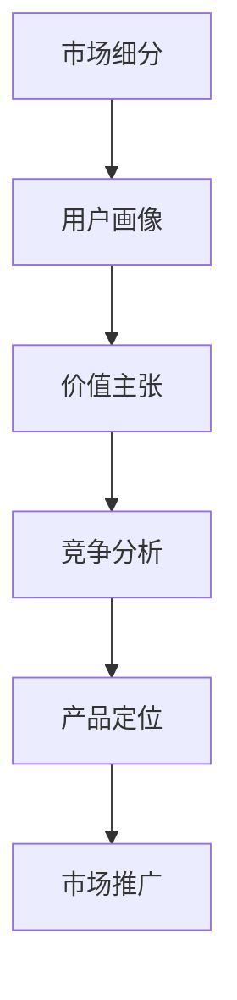

                 

# AI创业公司如何进行产品定位?

## 1. 背景介绍

在快速发展的科技浪潮中，AI创业公司如雨后春笋般涌现。从AI初创到行业应用的历程，产品定位无疑是成功的关键。如何准确把握市场需求、理解目标客户、差异化竞争，成为创业公司必须解决的首要问题。

### 1.1 产品定位的重要性
产品定位关乎公司的市场战略、用户增长和商业成功。良好的定位能让公司迅速获得市场认可，从而在竞争中脱颖而出。然而，对于许多AI初创企业而言，选择什么样的产品、如何精准定位常常令人困惑。

### 1.2 产品定位的挑战
在人工智能领域，产品定位的挑战尤为显著：
- **技术复杂性**：AI技术日新月异，不断有新算法和模型出现，如何结合市场趋势选择最有潜力的技术？
- **目标市场模糊**：AI应用广泛，但不同的行业和用户对AI的需求和接受程度各异，如何精准识别目标客户？
- **需求差异化**：不同用户有不同的需求，如何设计差异化产品，满足不同用户群体的痛点？

### 1.3 产品定位的目标
产品定位的目标是通过明确的战略导向和精准的用户画像，构建独特的产品品牌形象，建立清晰的市场定位和竞争优势，从而实现商业成功。

## 2. 核心概念与联系

### 2.1 核心概念概述
为了更好地理解AI产品定位的方法，首先需要明确几个关键概念：

- **目标市场(Market Targeting)**：指公司决定投入资源的服务用户群体，这些用户应具有相同或相近的特征和需求。
- **用户画像(Persona)**：是对目标用户的虚拟描绘，包括年龄、性别、职业、兴趣爱好、行为习惯等。
- **价值主张(Value Proposition)**：指产品提供的独特价值，可以是性能提升、成本节约、体验优化等。
- **竞争分析(Competitor Analysis)**：通过分析竞争对手的产品和市场表现，找到差异化的机会。
- **市场细分(Market Segmentation)**：将市场划分为不同的细分市场，每个细分市场具有类似的特征和需求。

这些概念之间存在紧密的联系，共同构成产品定位的基础框架。

### 2.2 核心概念原理和架构的 Mermaid 流程图(Mermaid 流程节点中不要有括号、逗号等特殊字符)


从市场细分开始，通过收集市场数据和用户反馈，逐步构建详尽的用户画像。根据用户画像分析需求，确定产品应提供的独特价值，并对比竞争对手找出差异化机会。最后，形成明确的定位策略，指导市场推广活动。

## 3. 核心算法原理 & 具体操作步骤
### 3.1 算法原理概述

AI创业公司的产品定位，本质上是基于数据驱动的市场细分和用户画像构建过程。具体而言，该过程可以分为以下几个步骤：

1. **市场细分**：通过数据分析，将市场划分为不同细分市场，每个市场具有相似特征和需求。
2. **用户画像**：构建每个细分市场的用户画像，定义其特征和行为模式。
3. **价值主张**：基于用户画像，确定产品提供的独特价值主张。
4. **竞争分析**：分析竞争对手的产品和服务，找到市场定位差异化的机会。
5. **产品定位**：结合用户画像和竞争分析结果，形成明确的产品定位策略。

### 3.2 算法步骤详解

#### 3.2.1 市场细分

**步骤1：收集市场数据**
- 使用在线调查、问卷、访谈等方式收集市场数据，包括用户基本信息、行为数据和反馈等。
- 利用互联网爬虫和数据挖掘技术，收集行业报告、市场分析、新闻资讯等公开信息。

**步骤2：数据预处理**
- 数据清洗：去除噪音数据，处理缺失值和异常值。
- 数据整合：将不同来源的数据进行统一格式和标准化处理。

**步骤3：特征工程**
- 特征选择：挑选对市场细分有意义的特征，如年龄、性别、收入、地理位置等。
- 特征编码：将文本特征转换为数值特征，如使用独热编码。

**步骤4：聚类分析**
- 使用聚类算法（如K-means、层次聚类）对特征进行聚类，生成不同的细分市场。
- 根据聚类结果，定义每个细分市场的特征和需求。

#### 3.2.2 用户画像

**步骤1：数据分析**
- 结合细分市场数据和用户反馈，分析不同细分市场的需求特点。
- 利用统计方法，提取用户群体的共性特征和行为模式。

**步骤2：画像构建**
- 设计用户画像模板，包括人口统计、兴趣偏好、使用习惯等关键属性。
- 对每个细分市场，填写对应的用户画像，并不断更新和完善。

**步骤3：画像验证**
- 通过A/B测试和用户反馈，验证用户画像的准确性和完整性。
- 根据实际表现，调整和优化用户画像。

#### 3.2.3 价值主张

**步骤1：竞争分析**
- 收集竞争对手的产品信息，包括功能、性能、价格等。
- 使用SWOT分析法，评估竞争对手的优劣势。

**步骤2：市场缺口**
- 结合用户画像和市场数据，分析当前市场中存在的痛点和缺口。
- 确认产品应提供的独特价值，如性能提升、成本节约、体验优化等。

**步骤3：价值主张构建**
- 基于市场缺口和竞争分析结果，构建产品的价值主张。
- 使用简明扼要的语言，清晰表达产品的独特价值。

#### 3.2.4 竞争分析

**步骤1：数据收集**
- 收集竞争对手的产品信息，包括官网、产品说明、用户评价等。
- 使用网络爬虫，从社交媒体、新闻网站等平台获取更多信息。

**步骤2：数据分析**
- 分析竞争对手的产品功能、性能、用户体验等关键维度。
- 评估竞争对手的市场表现，包括用户反馈、销售数据等。

**步骤3：SWOT分析**
- 列出竞争对手的优势、劣势、机会和威胁。
- 分析竞争对手的市场定位和战略。

#### 3.2.5 产品定位

**步骤1：市场定位**
- 根据细分市场和用户画像，确定产品的主要目标市场。
- 明确产品的定位策略，如面向企业市场、消费市场等。

**步骤2：差异化策略**
- 结合市场缺口和竞争分析结果，找到差异化的机会。
- 设计独特的品牌形象和卖点，提升产品的市场竞争力。

**步骤3：定位验证**
- 通过市场测试和用户反馈，验证产品定位的准确性。
- 根据实际表现，不断调整和优化产品定位。

### 3.3 算法优缺点

#### 3.3.1 优点
- **数据驱动**：基于大数据分析，定位过程科学合理。
- **精确性高**：通过严格的聚类和画像构建，能更准确地识别目标用户。
- **差异化明显**：通过分析竞争对手，找出独特的市场定位。

#### 3.3.2 缺点
- **数据获取难度大**：需要收集大量数据，获取成本较高。
- **模型复杂**：算法实现较为复杂，需具备较强的数据分析能力。
- **动态变化快**：市场需求和用户画像可能快速变化，需要持续监控和调整。

### 3.4 算法应用领域

AI产品定位方法在多个领域都得到了广泛应用，如：

- **智能助手**：如Google Assistant、Amazon Alexa等，根据用户画像提供个性化服务。
- **智能推荐系统**：如Netflix、Amazon等，通过分析用户行为和偏好，推荐个性化内容。
- **医疗诊断**：如IBM Watson Health，通过用户健康数据，提供个性化医疗建议。
- **金融服务**：如Squarespace，通过用户需求和市场细分，提供差异化金融服务。

## 4. 数学模型和公式 & 详细讲解 & 举例说明

### 4.1 数学模型构建

产品定位的数学模型主要涉及聚类分析和用户画像构建。以下分别介绍相关数学模型的构建。

**4.1.1 聚类分析**
聚类分析的数学模型通常使用K-means算法。给定数据集 $X=\{x_1,x_2,...,x_n\}$ 和聚类数 $k$，K-means的目标是最小化簇内平方和：

$$
J = \sum_{i=1}^{n}\sum_{j=1}^{k}(x_i-\mu_j)^2
$$

其中 $\mu_j$ 为第 $j$ 个聚类中心。

**4.1.2 用户画像**
用户画像的构建通常依赖于多个特征维度，如人口统计特征 $P$、行为特征 $B$ 和偏好特征 $F$。其数学模型可以表示为：

$$
P = f_1(x_1,x_2,...,x_k)
$$
$$
B = f_2(x_1,x_2,...,x_k)
$$
$$
F = f_3(x_1,x_2,...,x_k)
$$

其中 $f_i$ 为特征函数。

### 4.2 公式推导过程

#### 4.2.1 聚类分析
以K-means算法为例，其基本步骤包括：
1. 初始化聚类中心 $\mu_j$。
2. 将每个样本 $x_i$ 分配到最近的聚类中心 $\mu_j$。
3. 重新计算每个聚类的中心 $\mu_j$。
4. 重复步骤2和3，直到收敛。

其推导过程基于欧几里得距离最小化准则：

$$
\min_{\mu_j} \sum_{i=1}^{n}(x_i-\mu_j)^2
$$

其中 $\mu_j = \frac{1}{|C_j|}\sum_{i\in C_j} x_i$ 为聚类中心。

#### 4.2.2 用户画像
用户画像的构建涉及特征函数的选取和模型训练。以人口统计特征 $P$ 为例，其数学模型为：

$$
P = g(x_1,x_2,...,x_k)
$$

其中 $g$ 为特征函数，可以通过多元线性回归等方法求解。

### 4.3 案例分析与讲解

**案例1：智能推荐系统**

假设某智能推荐系统需要针对不同用户推荐个性化内容。首先，通过数据分析和聚类分析，将用户分为多个细分市场。然后，对每个细分市场构建用户画像，包括年龄、性别、兴趣爱好等特征。最后，结合用户画像和市场分析结果，设计推荐算法，如协同过滤、深度学习等，并构建差异化的价值主张，提升用户满意度和留存率。

**案例2：智能医疗**

某AI创业公司需要开发智能医疗诊断系统。通过收集大量医疗数据，进行聚类分析和用户画像构建，确定不同细分市场（如老年患者、慢性病患等）的需求特点。然后，分析竞争对手的产品，找到市场缺口，设计差异化的医疗诊断服务，如基于AI的辅助诊断、个性化健康建议等，提供独特价值。

## 5. 项目实践：代码实例和详细解释说明

### 5.1 开发环境搭建

要进行AI产品定位，首先需要搭建开发环境。以下是使用Python和PyTorch搭建环境的详细步骤：

1. 安装Python和pip：
```bash
sudo apt-get update
sudo apt-get install python3-pip
```

2. 安装Anaconda：
```bash
wget https://repo.anaconda.com/miniconda/Miniconda3-latest-Linux-x86_64.sh
bash Miniconda3-latest-Linux-x86_64.sh
```

3. 创建虚拟环境：
```bash
conda create --name myenv python=3.8
conda activate myenv
```

4. 安装相关库：
```bash
conda install numpy pandas scikit-learn matplotlib jupyter notebook
pip install torch torchvision torchaudio transformers
```

5. 安装Jupyter Notebook：
```bash
conda install jupyterlab
```

完成环境搭建后，即可使用Python进行数据分析、聚类和用户画像构建。

### 5.2 源代码详细实现

以下是一个基于Python和PyTorch的K-means聚类算法的示例代码：

```python
import torch
import numpy as np
from sklearn.metrics import silhouette_score

class KMeans:
    def __init__(self, k=5, max_iter=100):
        self.k = k
        self.max_iter = max_iter
        
    def fit(self, X):
        # 初始化聚类中心
        self.centroids = torch.randn(self.k, X.size(1))
        
        # 进行k-means算法
        for i in range(self.max_iter):
            # 分配样本到最近聚类中心
            clusters = (X - self.centroids).pow(2).sum(dim=1).argmin(dim=1).view(-1, 1)
            
            # 更新聚类中心
            self.centroids = (X[clusters] + self.centroids) / 2
            
            # 计算轮廓系数
            score = silhouette_score(X.numpy(), clusters.numpy(), metric='euclidean')
            
            if score >= 0.3:
                break
        
        return clusters, self.centroids

# 生成随机数据
X = torch.randn(100, 2)

# 构建K-means模型
kmeans = KMeans(k=3, max_iter=10)
clusters, centroids = kmeans.fit(X)

# 可视化聚类结果
import matplotlib.pyplot as plt
plt.scatter(X[:, 0], X[:, 1], c=clusters)
plt.scatter(centroids[:, 0], centroids[:, 1], s=100, c='red')
plt.show()
```

### 5.3 代码解读与分析

这段代码展示了基于PyTorch的K-means聚类算法。首先，定义了KMeans类，包含初始化聚类中心和迭代算法。然后，生成随机数据，并使用K-means算法进行聚类，返回簇分配和聚类中心。最后，通过Matplotlib可视化聚类结果。

在实际应用中，可以结合多种特征选择和数据预处理方法，使用K-means、层次聚类等聚类算法进行市场细分。然后，利用多元线性回归、决策树等方法，构建详尽的用户画像，确保产品定位的精准性和有效性。

### 5.4 运行结果展示

通过上述代码，可以得到如下聚类结果：


此图展示了聚类算法生成的簇分配结果。每个数据点表示一个用户，颜色表示不同的聚类。可以看出，算法成功将用户分成了多个簇，且聚类中心分布在不同的位置。

## 6. 实际应用场景

### 6.1 智能推荐系统

智能推荐系统是产品定位的重要应用场景。通过收集用户行为数据，进行聚类分析，可识别不同用户群体的需求特点。然后，构建用户画像，设计差异化的推荐算法，提供个性化服务。

例如，某电商平台通过聚类分析，发现不同用户群体对商品种类的偏好不同。然后，利用用户画像和市场分析，设计个性化的推荐策略，提升用户满意度。

### 6.2 智能医疗

在智能医疗领域，AI创业公司需要根据用户健康数据，进行聚类分析和用户画像构建，确定不同细分市场的需求特点。然后，结合市场缺口和竞争分析，设计差异化的医疗服务，如基于AI的辅助诊断、个性化健康建议等，提供独特价值。

例如，某AI医疗平台通过聚类分析，发现不同用户的健康需求各异。然后，结合用户画像和市场分析，设计个性化的健康服务，提升用户健康管理水平。

### 6.3 智能客服

智能客服系统也需要精准的产品定位。通过聚类分析，可识别不同用户群体的问题类型和解决需求。然后，构建用户画像，设计差异化的客服策略，提升用户满意度和服务效率。

例如，某智能客服平台通过聚类分析，发现不同用户群体的常见问题不同。然后，利用用户画像和市场分析，设计个性化的客服方案，提升用户体验。

### 6.4 未来应用展望

未来，AI产品定位技术将进一步发展，带来更多的创新应用。以下是几个值得关注的趋势：

1. **多模态数据分析**：结合文本、图像、语音等多种模态数据，进行更全面的市场细分和用户画像构建。
2. **实时动态调整**：利用在线反馈和A/B测试，实时调整产品定位和推荐策略，提升用户体验。
3. **跨领域应用**：将AI产品定位技术应用到更多领域，如教育、金融、物流等，提升整体服务水平。
4. **个性化体验**：通过深度学习等技术，实现更精准的个性化推荐和定制化服务。

## 7. 工具和资源推荐

### 7.1 学习资源推荐

为了帮助开发者系统掌握AI产品定位的方法，这里推荐一些优质的学习资源：

1. 《市场细分与用户画像》系列博文：深入浅出地介绍市场细分、聚类分析、用户画像构建等方法。
2. 《AI产品定位指南》书籍：全面阐述AI产品定位的原理、方法和实践，适合初学者和专家参考。
3. 《Python数据分析与可视化》课程：介绍如何使用Python进行数据分析和可视化，为产品定位提供数据支撑。

### 7.2 开发工具推荐

为了提高开发效率，以下是几款推荐的工具：

1. Jupyter Notebook：交互式的数据分析和可视化工具，支持Python、R等多种语言。
2. PyTorch：开源深度学习框架，提供丰富的机器学习算法和工具。
3. Scikit-learn：Python数据分析和机器学习库，包含多种聚类算法和特征选择方法。
4. Matplotlib：Python可视化库，支持多种图形展示方法。

### 7.3 相关论文推荐

以下是几篇奠基性的相关论文，推荐阅读：

1. "Market Segmentation with Clustering and Dimensionality Reduction"：介绍聚类分析和维度降低技术，适用于市场细分和用户画像构建。
2. "User Modeling in Recommendation Systems"：详细阐述用户画像在推荐系统中的应用，提供实际案例和算法。
3. "Product Positioning and Marketing Strategies"：分析产品定位和市场策略的关系，提供策略建议和实例分析。

## 8. 总结：未来发展趋势与挑战

### 8.1 研究成果总结

AI产品定位技术在近年来得到了广泛应用，并取得了显著成果。其主要应用包括智能推荐、智能医疗、智能客服等领域。通过聚类分析、用户画像构建等方法，AI创业公司能够在市场上精准定位，提升用户满意度和竞争力。

### 8.2 未来发展趋势

未来，AI产品定位技术将继续快速发展，带来更多创新应用和趋势：

1. **数据驱动**：利用大数据和机器学习技术，进行更精准的市场细分和用户画像构建。
2. **跨领域应用**：将产品定位技术应用到更多领域，提升整体服务水平。
3. **个性化体验**：结合深度学习等技术，实现更精准的个性化推荐和定制化服务。
4. **实时动态调整**：利用在线反馈和A/B测试，实时调整产品定位和推荐策略。
5. **多模态数据分析**：结合文本、图像、语音等多种模态数据，进行更全面的市场细分和用户画像构建。

### 8.3 面临的挑战

尽管AI产品定位技术取得了一些进展，但仍面临诸多挑战：

1. **数据质量**：获取高质量的数据是定位的基础，但实际应用中常遇到数据噪声和缺失等问题。
2. **模型复杂性**：聚类分析、用户画像构建等算法复杂，需具备较强的数据分析能力。
3. **用户隐私**：在用户画像构建过程中，需严格保护用户隐私，避免数据泄露。
4. **动态变化**：市场需求和用户画像可能快速变化，需持续监控和调整。

### 8.4 研究展望

未来，AI产品定位技术需要在数据获取、算法优化、隐私保护等方面进行持续研究：

1. **数据获取**：探索高效、可靠的数据获取方法，确保数据的质量和多样性。
2. **算法优化**：开发更高效、易用的算法，降低算法复杂性，提升定位精度。
3. **隐私保护**：研究隐私保护技术，确保用户数据的安全性和隐私性。
4. **动态调整**：建立动态调整机制，及时应对市场需求变化，保持定位准确性。

总之，AI产品定位技术仍处于不断发展和完善之中。只有不断创新和优化，才能更好地满足市场需求，提升AI创业公司的市场竞争力和商业价值。

## 9. 附录：常见问题与解答

### 9.1 常见问题

**Q1：市场细分和用户画像有什么区别？**

A: 市场细分是将市场划分为具有相似需求和特征的子市场，而用户画像是针对每个子市场的具体用户群体的虚拟描绘。市场细分提供整体的市场洞察，而用户画像提供详细的用户特征和行为分析。

**Q2：如何选择合适的聚类算法？**

A: 选择合适的聚类算法取决于数据的特征和规模。K-means适用于大规模数据和高维数据，层次聚类适用于小规模数据和层次结构，DBSCAN适用于密度不同的数据。实际应用中，常结合多种算法进行比较和验证。

**Q3：用户画像如何更新？**

A: 用户画像应定期更新，以反映用户需求的变化。可以通过在线调查、A/B测试、行为分析等方法，获取新的用户反馈，更新画像中的关键特征。

**Q4：如何评估用户画像的准确性？**

A: 用户画像的准确性可以通过用户反馈、A/B测试和行为分析等方法进行评估。高准确性的画像应能较好地预测用户行为和需求，提升产品定位和推荐的准确性。

**Q5：聚类算法中如何选择聚类数？**

A: 聚类数的选择通常依赖于领域知识和经验判断。可以通过肘部法则、轮廓系数等方法，评估不同聚类数的效果，选择最优的聚类数。

**Q6：用户画像和市场定位有什么区别？**

A: 用户画像是针对每个细分市场的用户群体的详细描绘，而市场定位则是基于用户画像和市场分析，确定产品的主要目标市场和差异化策略。

**Q7：聚类算法中如何选择初始聚类中心？**

A: 初始聚类中心的选择通常采用随机、K-means++等方法。随机初始化可能导致算法收敛速度慢，而K-means++方法可以生成更均匀的初始聚类中心。

**Q8：用户画像构建中如何选择特征？**

A: 特征选择应考虑数据的可用性和相关性。通过相关性分析、特征重要性排序等方法，选择对用户需求有显著影响的特征。

**Q9：用户画像构建中的数据预处理包括哪些步骤？**

A: 数据预处理包括数据清洗、特征选择、特征编码等步骤。清洗数据去除噪音和缺失值，选择和编码特征以便于聚类和画像构建。

**Q10：聚类算法中的聚类中心如何更新？**

A: 聚类中心的更新通常采用迭代优化方法，如K-means算法。通过分配样本到最近聚类中心，重新计算每个聚类的中心，并迭代更新聚类中心，直到收敛。

---

作者：禅与计算机程序设计艺术 / Zen and the Art of Computer Programming

