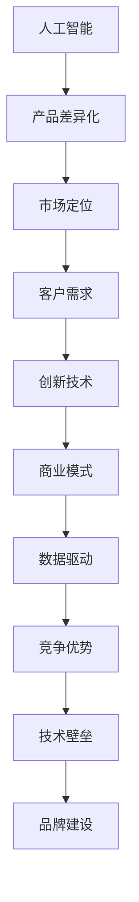

                 

# AI创业公司的产品差异化策略

> 关键词：人工智能,产品差异化,市场定位,客户需求,创新技术,商业模式,数据驱动,竞争优势,技术壁垒,品牌建设

## 1. 背景介绍

### 1.1 问题由来
在当今科技快速发展的时代，人工智能(AI)已成为推动各行各业转型的重要动力。AI技术的广泛应用，不仅提高了生产效率，还开创了新的商业模式和市场机会。然而，随着AI技术的普及，竞争也变得越来越激烈，如何在众多竞争对手中脱颖而出，成为了AI创业公司亟需解决的问题。产品差异化，即通过独特的产品特性和服务，获得市场竞争优势，成为了AI创业公司寻求发展的关键策略。

### 1.2 问题核心关键点
产品差异化策略的核心在于识别市场需求，明确目标客户，并通过独特的技术或服务优势，实现与竞争对手的区隔。成功的产品差异化策略不仅能增强公司市场竞争力，还能构建长期的品牌和客户忠诚度。

## 2. 核心概念与联系

### 2.1 核心概念概述

为更好地理解AI创业公司的产品差异化策略，本节将介绍几个密切相关的核心概念：

- **人工智能(AI)**：指利用机器学习、深度学习等技术，使计算机具备智能思考、判断、学习的能力。
- **产品差异化**：通过独特的产品特性和服务，实现与竞争对手的区隔，增强市场竞争力。
- **市场定位**：分析目标市场和客户需求，明确公司的市场角色和竞争优势。
- **客户需求**：根据市场调研和客户反馈，识别目标客户的具体需求，制定产品策略。
- **创新技术**：在技术研发上不断创新，保持技术领先优势。
- **商业模式**：结合产品和服务，构建独特的商业模式，实现盈利和可持续发展。
- **数据驱动**：利用大数据和人工智能技术，驱动产品创新和优化。
- **竞争优势**：通过独特的产品特性和服务，构建不易被模仿的竞争优势。
- **技术壁垒**：通过专利、技术秘密等方式，建立技术垄断地位。
- **品牌建设**：通过品牌营销，提升品牌知名度和美誉度，增强市场竞争力。

这些核心概念之间的逻辑关系可以通过以下Mermaid流程图来展示：



这个流程图展示了大语言模型的核心概念及其之间的关系：

1. 人工智能通过技术创新驱动产品开发和优化。
2. 产品差异化策略帮助公司在激烈竞争中脱颖而出。
3. 市场定位明确了公司的目标市场和客户群体。
4. 客户需求是产品设计和优化的出发点。
5. 创新技术保持公司产品竞争力。
6. 商业模式确保公司的盈利和可持续发展。
7. 数据驱动促进产品迭代和优化。
8. 竞争优势提升市场地位。
9. 技术壁垒增强公司的市场垄断能力。
10. 品牌建设提升公司的市场影响力和客户忠诚度。

## 3. 核心算法原理 & 具体操作步骤

### 3.1 算法原理概述

AI创业公司的产品差异化策略，本质上是一个综合的市场调研、技术创新和产品优化过程。其核心思想是：通过深入分析市场和客户需求，结合公司自身的技术优势，设计出独特的产品特性和服务，从而实现与竞争对手的区隔。

形式化地，假设公司目标市场为 $M$，客户需求为 $D$，创新技术为 $T$，产品差异化策略为 $S$。产品差异化策略的优化目标是最小化市场成本 $C$，即：

$$
\mathop{\arg\min}_{S} \mathcal{C}(S) \text{ s.t. } S \in T \times D
$$

其中 $\mathcal{C}$ 为成本函数，$T$ 为技术可行集合，$D$ 为需求集合。

通过梯度下降等优化算法，策略优化过程不断更新产品差异化策略 $S$，最小化市场成本 $C$，使得公司产品在目标市场 $M$ 上更具竞争力。由于 $S$ 已经通过市场需求 $D$ 和创新技术 $T$ 获得了较好的初始化，因此即便在成本约束下，也能较快找到理想的差异化策略 $S^*$。

### 3.2 算法步骤详解

AI创业公司的产品差异化策略一般包括以下几个关键步骤：

**Step 1: 市场调研**
- 使用问卷调查、焦点小组等方法，收集目标市场 $M$ 和客户需求 $D$ 的数据。
- 分析数据，确定市场需求的热点和高频场景。

**Step 2: 技术评估**
- 评估自身和竞争对手的技术优势和劣势。
- 确定可能的创新技术 $T$，如自然语言处理、图像识别、推荐系统等。

**Step 3: 产品设计**
- 结合市场需求和创新技术，设计独特的产品特性 $P$ 和服务 $S$。
- 设定产品差异化策略的优先级，如功能、性能、用户体验等。

**Step 4: 产品验证**
- 进行小规模试点和用户测试，收集反馈。
- 根据反馈，优化产品特性和服务。

**Step 5: 市场推广**
- 制定市场营销策略，推广产品。
- 利用数据分析和客户反馈，不断迭代优化。

**Step 6: 持续优化**
- 监控市场和客户反馈，实时调整产品特性和服务。
- 持续关注新技术的发展，及时优化产品策略。

以上是AI创业公司产品差异化策略的一般流程。在实际应用中，还需要针对具体市场和产品特点，对策略的各个环节进行优化设计，如改进市场调研方法，引入更多的技术评估维度，设计更高效的产品验证流程等，以进一步提升产品竞争力和用户满意度。

### 3.3 算法优缺点

AI创业公司的产品差异化策略具有以下优点：
1. 通过深入分析市场需求，设计出满足用户痛点、提升用户体验的产品特性和服务。
2. 利用技术创新，实现产品差异化，增强市场竞争力。
3. 数据驱动的决策过程，能够快速响应市场变化，提升产品迭代速度。
4. 持续优化策略，确保产品始终保持竞争优势。

同时，该策略也存在一定的局限性：
1. 需要投入大量资源进行市场调研和技术评估。
2. 对公司内部技术储备和创新能力要求较高。
3. 产品差异化策略的持续性和有效性，依赖于公司管理层的决策和技术团队的执行。
4. 市场需求和竞争对手的变化，可能导致产品差异化策略失效。
5. 高额的研发和推广成本，对中小企业来说可能是一大挑战。

尽管存在这些局限性，但就目前而言，基于差异化策略的产品开发，仍是AI创业公司获取市场竞争优势的重要手段。未来相关研究的重点在于如何进一步降低策略制定和执行的成本，提高策略的可持续性和灵活性，同时兼顾市场和客户需求。

### 3.4 算法应用领域

基于差异化策略的AI产品开发，已经在多个领域得到了广泛应用，例如：

- **医疗健康**：如智能诊疗系统、健康监测设备等，通过深度学习和大数据分析，实现个性化医疗服务。
- **金融科技**：如智能投顾、金融风控系统等，通过机器学习和大数据技术，提升金融服务的智能化水平。
- **智能制造**：如智能生产调度系统、预测性维护系统等，通过自然语言处理和图像识别技术，优化生产流程，提高效率和质量。
- **智慧城市**：如智能交通系统、智慧能源管理系统等，通过智能算法和大数据分析，提升城市治理能力，提高生活质量。
- **教育培训**：如智能学习平台、教育内容推荐系统等，通过个性化推荐和大数据分析，提升学习效果和用户体验。

除了上述这些经典领域外，AI产品差异化策略也被创新性地应用到更多新兴领域中，如智慧零售、智能客服、工业互联网等，为各行各业带来新的变革和发展机遇。

## 4. 数学模型和公式 & 详细讲解

### 4.1 数学模型构建

本节将使用数学语言对AI创业公司的产品差异化策略进行更加严格的刻画。

假设公司目标市场为 $M$，客户需求为 $D$，创新技术为 $T$，产品差异化策略为 $S$。定义市场成本函数 $\mathcal{C}(S)$，客户满意度函数 $\mathcal{S}(S)$，则优化目标为：

$$
\mathop{\arg\min}_{S} \mathcal{C}(S) \text{ s.t. } \mathcal{S}(S) \geq \mathcal{S}_0
$$

其中 $\mathcal{S}_0$ 为最低客户满意度阈值。

通过梯度下降等优化算法，策略优化过程不断更新产品差异化策略 $S$，最小化市场成本 $\mathcal{C}(S)$，同时满足客户满意度要求。由于 $\mathcal{C}(S)$ 和 $\mathcal{S}(S)$ 通常难以精确计算，实际应用中需要利用数据驱动的方法进行近似估计。

### 4.2 公式推导过程

以下我们以智能客服系统为例，推导产品差异化策略的优化公式。

假设公司目标市场 $M$ 为电商客户，客户需求 $D$ 包括订单查询、退换货、产品推荐等，创新技术 $T$ 包括自然语言处理、机器学习等。设 $S$ 为产品差异化策略，$C(S)$ 为市场成本函数，$S=\{P_1,P_2,P_3\}$ 为产品特性，$P_1$ 为语义理解能力，$P_2$ 为推荐准确性，$P_3$ 为响应速度。

产品特性 $P_1$ 的市场成本函数为 $C_1(S_1)=\sum_{i=1}^{n} p_i \times c_i$，其中 $p_i$ 为特性 $P_i$ 的市场份额，$c_i$ 为特性 $P_i$ 的成本。

客户满意度函数 $\mathcal{S}(S)$ 为：

$$
\mathcal{S}(S)=\frac{\sum_{i=1}^{n} p_i \times s_i}{\sum_{i=1}^{n} p_i}
$$

其中 $s_i$ 为特性 $P_i$ 的客户满意度评分。

优化目标为：

$$
\mathop{\arg\min}_{S} \sum_{i=1}^{n} p_i \times c_i \text{ s.t. } \frac{\sum_{i=1}^{n} p_i \times s_i}{\sum_{i=1}^{n} p_i} \geq \mathcal{S}_0
$$

根据上述公式，可以利用梯度下降等优化算法求解 $S^*$，得到最优产品差异化策略。

### 4.3 案例分析与讲解

假设某电商公司，其智能客服系统需要设计产品特性 $P_1$ 和 $P_2$。已知 $P_1$ 的市场份额为 $p_1=0.6$，成本为 $c_1=10$，客户满意度评分为 $s_1=4$。$P_2$ 的市场份额为 $p_2=0.4$，成本为 $c_2=20$，客户满意度评分为 $s_2=5$。目标市场客户满意度阈值为 $\mathcal{S}_0=4$。

则优化目标为：

$$
\mathop{\arg\min}_{S} (0.6 \times 10 + 0.4 \times 20) \text{ s.t. } \frac{0.6 \times 4 + 0.4 \times 5}{0.6 + 0.4} \geq 4
$$

解得 $P_1$ 和 $P_2$ 的市场成本函数为：

$$
C_1(S_1) = 10p_1 + 20p_2 = 10 \times 0.6 + 20 \times 0.4 = 26
$$

$$
C_2(S_2) = 20p_1 + 10p_2 = 20 \times 0.6 + 10 \times 0.4 = 22
$$

根据优化目标，选择 $P_1$ 作为主要特性， $P_2$ 作为次要特性，可以进一步优化客户满意度函数：

$$
\mathcal{S}(S)=\frac{0.6 \times 4 + 0.4 \times 5}{0.6 + 0.4} = 4.25
$$

满足客户满意度要求。因此，最优产品差异化策略 $S^*$ 为 $S=\{P_1,P_2\}$。

通过以上案例，可以看到，利用数学模型和优化算法，可以系统性地进行产品差异化策略的制定和优化，确保公司产品在目标市场具有竞争优势。

## 5. 项目实践：代码实例和详细解释说明

### 5.1 开发环境搭建

在进行产品差异化策略的实践前，我们需要准备好开发环境。以下是使用Python进行数据分析和优化的环境配置流程：

1. 安装Anaconda：从官网下载并安装Anaconda，用于创建独立的Python环境。

2. 创建并激活虚拟环境：
```bash
conda create -n pydata-env python=3.8 
conda activate pydata-env
```

3. 安装必要的库：
```bash
conda install pandas numpy matplotlib scikit-learn scipy
```

4. 安装优化算法库：
```bash
pip install scipy-optimize
```

完成上述步骤后，即可在`pydata-env`环境中开始策略优化实践。

### 5.2 源代码详细实现

下面我们以智能客服系统为例，给出使用SciPy库进行产品差异化策略优化的PyTorch代码实现。

首先，定义市场成本函数和客户满意度函数：

```python
from scipy.optimize import minimize

def cost_function(S):
    p1, p2 = S
    c1, c2 = 10, 20
    return p1 * c1 + p2 * c2

def satisfaction_function(S):
    p1, p2 = S
    s1, s2 = 4, 5
    return (p1 * s1 + p2 * s2) / (p1 + p2)
```

然后，定义优化目标和约束条件：

```python
def objective(S):
    return cost_function(S)

def constraint(S):
    return satisfaction_function(S) - 4

initial_guess = [0.6, 0.4]

result = minimize(objective, initial_guess, constraints={'type': 'ineq', 'fun': constraint}, bounds=((0, 1), (0, 1)))
```

最后，输出优化结果：

```python
print(result.x)
```

通过以上代码，我们可以快速地利用优化算法求解产品差异化策略的最优值。

### 5.3 代码解读与分析

让我们再详细解读一下关键代码的实现细节：

**objective函数**：
- 计算市场成本函数 $\mathcal{C}(S)$，即特性 $P_1$ 和 $P_2$ 的成本总和。

**constraint函数**：
- 定义客户满意度约束 $\mathcal{S}(S) \geq \mathcal{S}_0$，即客户满意度评分不低于4。

**initial_guess初始化值**：
- 设定特性 $P_1$ 和 $P_2$ 的初始化值。

**minimize函数**：
- 利用SciPy的优化算法，求解最小化市场成本函数的同时满足客户满意度约束。

通过以上分析，可以看到，优化算法在产品差异化策略的制定过程中起到了关键作用，帮助公司快速找到最优的策略组合，提升市场竞争力。

## 6. 实际应用场景

### 6.1 智能客服系统

基于产品差异化策略的智能客服系统，可以广泛应用于电商、金融、医疗等多个行业，提供高质量的客户服务。通过深度学习和大数据分析，系统能够理解客户需求，提供个性化推荐和服务，提高客户满意度和忠诚度。

在技术实现上，可以通过收集历史客服对话数据，使用自然语言处理技术，提取和理解客户问题，并根据问题类型和解决难度，动态生成推荐问题和解决方案。微调后的模型可以不断学习新的问题和回答，提升智能客服系统的智能化水平。

### 6.2 金融科技

金融科技公司通过产品差异化策略，可以构建独特的商业模式，提供更加智能、安全的金融服务。例如，智能投顾系统可以通过深度学习和大数据分析，为投资者提供个性化投资建议，提升投资回报率。风险管理平台可以利用机器学习技术，实时监测市场风险，提前预警和控制风险。

在技术实现上，可以利用自然语言处理技术，分析客户咨询内容，快速识别风险点，并给出相应建议和提示。利用图像识别技术，可以自动识别欺诈行为，提高风险控制的准确性。

### 6.3 智能制造

智能制造公司通过产品差异化策略，可以实现生产流程的优化和智能化升级。例如，预测性维护系统可以通过深度学习技术，预测设备故障，提前进行维护，减少停机时间和生产成本。智能生产调度系统可以利用自然语言处理技术，自动生成生产计划，优化生产资源配置。

在技术实现上，可以利用图像识别技术，监测设备运行状态，实时分析设备数据，预测故障点。利用自然语言处理技术，可以分析生产记录，生成生产报告，提供决策支持。

### 6.4 未来应用展望

随着AI技术的不断发展，基于产品差异化策略的AI应用将在更多领域得到应用，为各行各业带来新的变革和发展机遇。

在智慧城市治理中，智能交通系统可以通过深度学习和大数据分析，优化交通流量，提高道路利用率。智慧能源管理系统可以利用机器学习技术，预测能源需求，优化能源分配，减少浪费。

在教育培训领域，智能学习平台可以利用自然语言处理技术，分析学习行为，提供个性化推荐和学习资源。教育内容推荐系统可以利用机器学习技术，识别学习者兴趣，推荐相应学习内容，提升学习效果。

## 7. 工具和资源推荐

### 7.1 学习资源推荐

为了帮助开发者系统掌握产品差异化策略的理论基础和实践技巧，这里推荐一些优质的学习资源：

1. 《机器学习实战》：Wesley Chun所著，详细介绍了机器学习和深度学习的基本概念和应用实例，适合入门学习。
2. 《深度学习入门》：斋藤康毅所著，深入浅出地介绍了深度学习的基本原理和算法，适合进阶学习。
3. 《Python深度学习》：Francois Chollet所著，介绍了TensorFlow和Keras的深度学习模型开发技巧，适合实战应用。
4. Coursera《机器学习》课程：由斯坦福大学Andrew Ng教授主讲，系统介绍了机器学习的基本原理和算法，适合在线学习。
5. Udacity《深度学习基础》课程：由Google DeepMind的Yoshua Bengio教授主讲，深入讲解深度学习的基本理论和实践技巧，适合高阶学习。

通过对这些资源的学习实践，相信你一定能够快速掌握产品差异化策略的精髓，并用于解决实际的AI问题。

### 7.2 开发工具推荐

高效的开发离不开优秀的工具支持。以下是几款用于AI产品差异化策略开发的常用工具：

1. Jupyter Notebook：交互式Python开发环境，方便进行数据处理和算法优化。
2. TensorFlow：由Google主导开发的深度学习框架，支持分布式计算，适合大规模数据处理。
3. PyTorch：由Facebook主导的深度学习框架，灵活动态的计算图，适合快速迭代研究。
4. Scikit-learn：基于Python的机器学习库，提供丰富的机器学习算法和数据处理工具。
5. Pandas：基于Python的数据处理库，提供高效的数据读取、清洗和分析功能。
6. Matplotlib：基于Python的数据可视化库，支持多种图表类型，方便数据展示。

合理利用这些工具，可以显著提升AI产品差异化策略的开发效率，加快创新迭代的步伐。

### 7.3 相关论文推荐

AI产品差异化策略的发展源于学界的持续研究。以下是几篇奠基性的相关论文，推荐阅读：

1. Gumbel-Softmax for Continuous Multiclass Labeling：提出Gumbel-Softmax函数，解决深度学习中的离散概率生成问题，为产品特性设计提供了新思路。
2. BERT: Pre-training of Deep Bidirectional Transformers for Language Understanding：提出BERT模型，引入基于掩码的自监督预训练任务，刷新了多项NLP任务SOTA，为产品特性优化提供了新的方法和工具。
3. ImageNet Classification with Deep Convolutional Neural Networks：提出深度卷积神经网络，应用于图像识别领域，为视觉产品特性设计提供了新方法。
4. Recommender Systems in Commercial Environments：详细介绍推荐系统在商业环境中的应用，为推荐产品特性设计提供了实际案例和算法。
5. Multi-task Learning with Task-Coupling Principle：提出多任务学习，将多个任务联合训练，提升产品特性设计的效率和效果。

这些论文代表了大语言模型差异化策略的发展脉络。通过学习这些前沿成果，可以帮助研究者把握学科前进方向，激发更多的创新灵感。

## 8. 总结：未来发展趋势与挑战

### 8.1 研究成果总结

本文对AI创业公司的产品差异化策略进行了全面系统的介绍。首先阐述了产品差异化策略在AI产品开发中的重要性和意义，明确了策略制定和优化的关键步骤。其次，从原理到实践，详细讲解了差异化策略的数学模型和优化算法，给出了具体的应用案例。

通过本文的系统梳理，可以看到，基于产品差异化策略的AI产品开发，已经在电商、金融、智能制造等多个领域得到广泛应用，为传统行业带来新的变革和发展机遇。得益于数据驱动和算法优化，这些产品能够不断学习用户需求，优化用户体验，提高市场竞争力。未来，随着AI技术的不断发展，产品差异化策略将在更多领域得到应用，为各行各业带来新的变革和发展机遇。

### 8.2 未来发展趋势

展望未来，AI产品差异化策略将呈现以下几个发展趋势：

1. **技术融合**：AI产品将更多地融合多种技术，如自然语言处理、图像识别、语音识别等，提供更加全面、智能的服务。
2. **数据驱动**：产品差异化策略将更加依赖数据驱动，通过大数据分析和机器学习算法，实现更加精准的用户需求识别和产品设计。
3. **个性化服务**：通过深度学习和大数据分析，提供个性化推荐和服务，提升用户满意度和忠诚度。
4. **实时优化**：利用实时数据和在线优化算法，实现产品特性和服务的动态调整，提升用户体验。
5. **多模态融合**：将视觉、语音、文本等多模态信息融合，提升产品智能水平，提供更加全面的服务。
6. **跨领域应用**：AI产品在更多领域得到应用，如智慧城市、医疗健康、教育培训等，带来新的商业机会和发展空间。

以上趋势凸显了AI产品差异化策略的广阔前景。这些方向的探索发展，必将进一步提升AI产品的竞争力，为各行各业带来新的变革和发展机遇。

### 8.3 面临的挑战

尽管AI产品差异化策略已经取得了瞩目成就，但在迈向更加智能化、普适化应用的过程中，它仍面临着诸多挑战：

1. **数据获取成本**：高质量数据获取成本高，需要大量时间和资源。数据偏差和噪声也影响模型效果。
2. **技术壁垒高**：AI产品开发需要高水平的算法和数据处理能力，对企业技术储备要求高。
3. **用户体验**：AI产品设计需要考虑用户友好性，提升用户体验和满意度。
4. **市场接受度**：AI产品需要推广和用户教育，提高市场接受度。
5. **伦理和法律问题**：AI产品需要符合伦理和法律规定，避免歧视和偏见。
6. **安全性问题**：AI产品需要保障数据和用户隐私，防止数据泄露和滥用。

正视这些挑战，积极应对并寻求突破，将是大语言模型差异化策略走向成熟的必由之路。相信随着学界和产业界的共同努力，这些挑战终将一一被克服，AI产品差异化策略必将在构建人机协同的智能时代中扮演越来越重要的角色。

### 8.4 研究展望

面向未来，AI产品差异化策略的研究需要在以下几个方面寻求新的突破：

1. **无监督学习**：探索无监督学习范式，降低对标注数据的依赖，提高策略制定效率。
2. **强化学习**：引入强化学习算法，通过奖励机制引导策略优化，提高模型决策能力。
3. **多目标优化**：通过多目标优化算法，平衡不同特性和服务，实现全局最优。
4. **跨领域融合**：将AI技术与多种行业知识融合，提升产品应用效果。
5. **跨模态融合**：将视觉、语音、文本等多种模态信息融合，提供更加全面、智能的服务。
6. **伦理和法律合规**：在产品设计中考虑伦理和法律要求，保障用户权益和隐私。

这些研究方向的探索，必将引领AI产品差异化策略迈向更高的台阶，为构建安全、可靠、可解释、可控的智能系统铺平道路。面向未来，AI产品差异化策略还需要与其他人工智能技术进行更深入的融合，如知识表示、因果推理、强化学习等，多路径协同发力，共同推动人工智能技术在垂直行业的规模化落地。

## 9. 附录：常见问题与解答

**Q1：如何设计产品特性和服务？**

A: 设计产品特性和服务需要考虑目标市场的客户需求和自身技术优势。可以通过市场调研和客户反馈，识别客户痛点，并结合自身技术能力，设计出独特的产品特性和服务。同时，需要不断优化特性和服务，确保其具备良好的用户体验和市场竞争力。

**Q2：如何提升产品差异化策略的可持续性？**

A: 产品差异化策略的可持续性需要考虑技术迭代和市场需求的变化。可以通过持续的市场调研和客户反馈，不断优化产品特性和服务，适应市场变化。同时，需要建立反馈机制，及时调整策略，确保产品始终保持竞争力。

**Q3：如何选择优化算法？**

A: 选择优化算法需要考虑问题的性质和目标。对于连续优化问题，可以使用梯度下降等传统优化算法。对于离散优化问题，可以使用整数规划等算法。同时，需要根据实际情况，选择合适的约束条件和目标函数，确保优化结果的有效性和可行性。

**Q4：如何确保产品安全和合规？**

A: 确保产品安全和合规需要建立全面的风险管理和隐私保护机制。可以通过数据加密、访问控制、审计日志等技术手段，保障数据和用户隐私。同时，需要符合伦理和法律规定，避免歧视和偏见，确保产品应用的合法性和公正性。

通过以上分析，可以看到，AI创业公司的产品差异化策略，不仅需要考虑技术因素，还需要考虑市场、用户、法律等多方面因素。只有全面综合考虑，才能设计出高质量、可持续的产品，赢得市场竞争。总之，产品差异化策略需要不断优化和创新，才能在激烈的竞争中脱颖而出，实现可持续发展。

