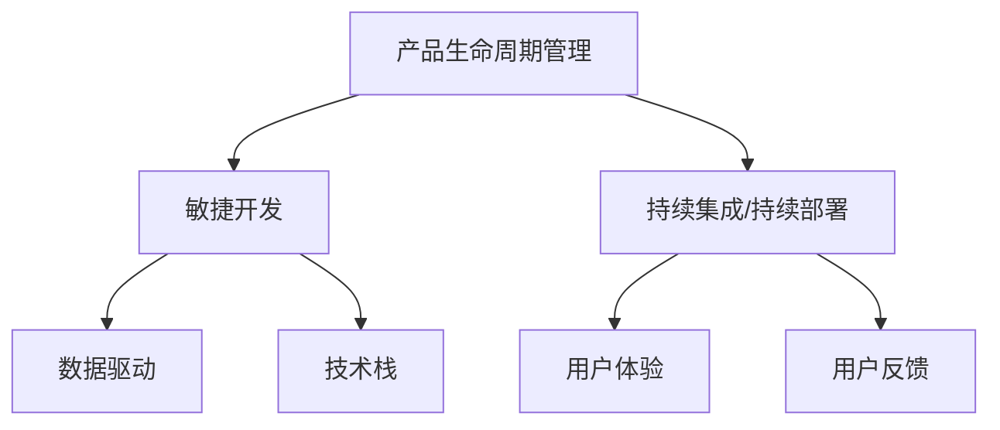

                 

## 1. 背景介绍

### 1.1 问题由来
在人工智能(AI)的浪潮中，AI创业公司层出不穷，竞争激烈。这些公司致力于通过先进的人工智能技术解决特定领域的实际问题，提升业务效率和用户体验。然而，AI技术落地应用并非一帆风顺，产品迭代和升级过程中常遇到诸多挑战。如何制定有效的产品迭代与升级策略，成为企业持续发展的关键。

### 1.2 问题核心关键点
AI创业公司产品迭代与升级的核心在于：
- **用户需求洞察**：准确理解用户需求，指导产品功能的设计与实现。
- **数据驱动决策**：利用大数据和机器学习算法，驱动产品功能的改进与优化。
- **快速响应市场变化**：及时捕捉市场趋势和技术进展，保持产品竞争力。
- **持续技术创新**：推动技术突破，提升产品性能和用户体验。

这些核心点贯穿于产品的全生命周期，是AI创业公司能否成功的关键因素。

### 1.3 问题研究意义
制定科学的产品迭代与升级策略，对于AI创业公司的长期发展具有重要意义：
1. **提升产品竞争力**：通过不断的迭代与升级，满足用户日益变化的需求，提升产品的市场份额和用户满意度。
2. **增强用户粘性**：通过持续的功能优化和用户体验改进，增强用户对产品的依赖和忠诚度。
3. **探索创新路径**：在产品迭代过程中，探索和引入新技术，形成持续的技术创新能力。
4. **降低运营成本**：优化产品架构和技术栈，提高资源利用效率，降低开发和维护成本。
5. **应对市场变化**：灵活调整产品策略，快速响应市场变化，避免落后于竞争对手。

## 2. 核心概念与联系

### 2.1 核心概念概述

为更好地理解产品迭代与升级策略，本节将介绍几个关键概念：

- **产品生命周期管理(Product Lifecycle Management, PLM)**：从产品概念、设计、开发、上市、维护到退市，全流程管理产品。
- **敏捷开发(Agile Development)**：强调快速响应变化，以用户需求为中心，快速迭代开发。
- **持续集成/持续部署(CI/CD)**：通过自动化工具，快速集成和部署代码，提升开发效率和质量。
- **数据驱动(Data-Driven)**：利用数据分析和机器学习算法，驱动产品决策与优化。
- **技术栈(Technology Stack)**：涵盖开发语言、框架、库等技术资源，支持产品开发和运维。
- **用户体验(User Experience, UX)**：聚焦用户使用产品的感受和满意度，指导产品设计的每个环节。
- **用户反馈(User Feedback)**：通过用户反馈，获取产品改进的方向和建议，指导迭代与优化。

这些概念之间的逻辑关系可以通过以下Mermaid流程图来展示：



这个流程图展示产品生命周期管理与其他核心概念的联系：

1. 产品生命周期管理通过敏捷开发和持续集成/持续部署，支持快速迭代和自动化部署。
2. 敏捷开发和持续集成/持续部署依赖数据驱动，以驱动产品决策和优化。
3. 用户体验和用户反馈是敏捷开发和持续集成/持续部署的核心驱动力。
4. 技术栈的优化和升级是支持敏捷开发和持续集成/持续部署的基础。

这些概念共同构成了AI创业公司产品迭代与升级的完整框架，确保产品能够高效、灵活地应对市场需求和技术变革。

## 3. 核心算法原理 & 具体操作步骤
### 3.1 算法原理概述

AI创业公司的产品迭代与升级，本质上是一个多目标优化问题，涉及产品功能、性能、用户体验、技术栈等多个维度的综合优化。其核心算法原理可以归纳为：

- **目标函数设计**：定义多个目标函数，如用户满意度、功能完备性、性能稳定性、技术先进性等，作为产品优化的指标。
- **多目标优化算法**：利用多目标优化算法，如Pareto最优、权重优化等，综合考虑多个目标函数，寻找最优解。
- **动态调整策略**：根据市场反馈、技术进展、用户需求等动态调整产品迭代策略，确保产品竞争力。

### 3.2 算法步骤详解

AI创业公司产品迭代与升级的一般步骤如下：

**Step 1: 需求分析与功能规划**
- 收集用户反馈和市场调研数据，进行用户需求分析。
- 根据需求分析结果，规划产品功能的优先级和开发顺序。
- 设定功能实现的详细需求文档和功能规范。

**Step 2: 敏捷开发与持续集成**
- 采用敏捷开发方法，快速迭代开发产品功能，遵循迭代周期和敏捷原则。
- 利用持续集成工具，如Jenkins、GitLab CI等，自动化集成和测试代码，提升开发效率。
- 实施持续部署策略，如蓝色/绿色部署、A/B测试等，确保产品稳定发布。

**Step 3: 用户体验与数据驱动**
- 定期进行用户满意度调查和用户体验测试，获取用户反馈和建议。
- 使用数据分析和机器学习算法，对用户反馈进行量化分析，识别关键问题和改进方向。
- 根据数据驱动的结果，优化产品功能和用户体验。

**Step 4: 技术升级与架构优化**
- 定期评估技术栈的性能和技术先进性，寻找优化和升级的机会。
- 引入最新的技术框架和库，提高开发效率和系统性能。
- 优化系统架构和设计，提升资源利用率和可维护性。

**Step 5: 市场响应与战略调整**
- 定期评估市场趋势和竞争对手动态，调整产品迭代策略。
- 引入新技术和创新点，保持产品竞争力。
- 优化营销策略和推广计划，提升产品知名度和市场占有率。

### 3.3 算法优缺点

敏捷开发和持续集成/持续部署方法具有以下优点：
1. 快速响应市场变化，提升产品迭代速度。
2. 提高开发效率和代码质量，减少错误和成本。
3. 通过自动化测试和部署，提升产品质量和稳定性。
4. 通过用户反馈和数据驱动，优化产品功能。

同时，这些方法也存在以下缺点：
1. 开发过程中的团队沟通和协作要求较高，需要良好的团队协作文化。
2. 需要持续的技术投入，保持技术栈的先进性和稳定性。
3. 快速迭代过程中可能出现遗漏需求或低优先级功能被过度优化，影响产品方向。
4. 持续集成和部署可能导致代码变更频繁，系统维护复杂。

### 3.4 算法应用领域

敏捷开发和持续集成/持续部署方法广泛应用于各种软件开发和产品迭代过程。在AI创业公司中，这些方法主要应用于：

- **自然语言处理(NLP)产品**：如智能客服、智能问答、语音识别等，快速迭代提升系统性能和用户体验。
- **计算机视觉(CV)产品**：如图像识别、目标检测、视频分析等，持续优化算法和模型效果。
- **推荐系统**：如电商推荐、内容推荐等，快速响应用户行为变化，提升推荐精准度。
- **智能决策系统**：如金融风控、医疗诊断等，通过数据驱动和用户体验反馈，优化决策算法。
- **物联网(IoT)产品**：如智能家居、工业监控等，快速集成和部署新功能，提升系统稳定性和可靠性。

## 4. 数学模型和公式 & 详细讲解 & 举例说明
### 4.1 数学模型构建

在产品迭代与升级过程中，数据驱动和优化算法是关键。这里以用户满意度为优化目标，构建数学模型：

设用户满意度为 $S$，包含功能完备性 $F$、性能稳定性 $P$、用户体验 $U$ 等多个维度，则可定义目标函数：

$$
S = \alpha_1 F + \alpha_2 P + \alpha_3 U
$$

其中 $\alpha_1, \alpha_2, \alpha_3$ 为各维度的权重系数，可以通过专家评估或数据驱动获得。

### 4.2 公式推导过程

对于目标函数 $S$ 的优化，可以使用多目标优化算法。假设已有初始功能集合 $F_0$，当前用户满意度为 $S_0$，则通过迭代调整功能集合 $F_t$，使得用户满意度 $S_t$ 最大化。

设每次迭代的改进量为 $\Delta F_t$，则有：

$$
S_t = S_{t-1} + \Delta S_t
$$

其中 $\Delta S_t = \alpha_1 \Delta F_t + \alpha_2 \Delta P_t + \alpha_3 \Delta U_t$，$\Delta P_t, \Delta U_t$ 分别为性能和用户体验的改进量。

通过迭代优化，最终得到最优功能集合 $F^*$，使得用户满意度 $S^*$ 最大化。

### 4.3 案例分析与讲解

假设我们正在开发一个智能客服系统，通过用户满意度调查和数据分析，发现用户主要关注以下三个维度：

- **功能完备性**：能否自动解答用户常见问题。
- **性能稳定性**：系统响应时间是否快速。
- **用户体验**：回答是否准确、友好。

设定各维度的权重系数分别为 $\alpha_1 = 0.4, \alpha_2 = 0.3, \alpha_3 = 0.3$。通过敏捷开发和持续集成，我们迭代开发和优化了以下几个功能：

1. **自动问答**：引入自然语言处理技术，提高自动回答的准确率。
2. **性能优化**：优化系统架构，提升响应速度。
3. **交互设计**：改进对话界面，提高用户体验。

在每个迭代周期结束后，我们分别评估了功能完备性 $F_t$、性能稳定性 $P_t$、用户体验 $U_t$ 的改进情况，并计算出用户满意度 $S_t$。通过多轮迭代，我们得到了最优功能集合 $F^*$，使得用户满意度 $S^*$ 最大化。

## 5. 项目实践：代码实例和详细解释说明
### 5.1 开发环境搭建

在进行产品迭代与升级实践前，我们需要准备好开发环境。以下是使用Python进行敏捷开发和持续集成的环境配置流程：

1. 安装Python：从官网下载安装Python，确保版本为3.6或以上。
2. 安装Docker：从官网下载安装Docker，用于容器化开发和部署。
3. 安装Jenkins：从官网下载安装Jenkins，用于持续集成和持续部署。
4. 安装GitLab：从官网下载安装GitLab，用于代码托管和版本控制。
5. 配置CI/CD pipeline：在Jenkins中配置CI/CD pipeline，自动化集成和部署代码。

完成上述步骤后，即可在Docker容器中开始敏捷开发和持续集成实践。

### 5.2 源代码详细实现

这里以一个简单的自然语言处理(NLP)项目为例，展示敏捷开发和持续集成的流程。

假设我们正在开发一个文本分类器，用于将用户输入的文本自动分类为不同主题。步骤如下：

**Step 1: 需求分析与功能规划**
- 收集用户反馈和市场调研数据，进行需求分析。
- 根据需求分析结果，规划产品功能的优先级和开发顺序。
- 设定功能实现的详细需求文档和功能规范。

**Step 2: 敏捷开发与持续集成**
- 使用Scrum方法，进行2-4周的敏捷迭代，快速开发和实现文本分类器。
- 在每个迭代周期结束后，进行代码审查和测试，确保代码质量。
- 使用Docker容器化开发环境，确保一致性和可移植性。

**Step 3: 用户体验与数据驱动**
- 定期进行用户满意度调查和用户体验测试，获取用户反馈和建议。
- 使用数据分析和机器学习算法，对用户反馈进行量化分析，识别关键问题和改进方向。
- 根据数据驱动的结果，优化产品功能和用户体验。

**Step 4: 技术升级与架构优化**
- 定期评估技术栈的性能和技术先进性，寻找优化和升级的机会。
- 引入最新的技术框架和库，提高开发效率和系统性能。
- 优化系统架构和设计，提升资源利用率和可维护性。

**Step 5: 市场响应与战略调整**
- 定期评估市场趋势和竞争对手动态，调整产品迭代策略。
- 引入新技术和创新点，保持产品竞争力。
- 优化营销策略和推广计划，提升产品知名度和市场占有率。

### 5.3 代码解读与分析

**代码框架**

以下是使用Python和Flask框架实现文本分类器的示例代码：

```python
from flask import Flask, request
import transformers

app = Flask(__name__)

# 加载预训练模型和tokenizer
model = transformers.TFAutoModelForSequenceClassification.from_pretrained('bert-base-uncased', num_labels=3)
tokenizer = transformers.TFAutoTokenizer.from_pretrained('bert-base-uncased')

@app.route('/classify', methods=['POST'])
def classify():
    data = request.json
    text = data['text']
    inputs = tokenizer.encode_plus(text, add_special_tokens=True, max_length=512, return_tensors='tf')
    inputs = {key: tf.convert_to_tensor(value) for key, value in inputs.items()}
    outputs = model(**inputs)
    logits = outputs.logits.numpy()
    label_id = logits.argmax()
    label = model.config.id2label[label_id]
    return {'score': logits[label_id], 'label': label}

if __name__ == '__main__':
    app.run(debug=True)
```

**代码解读**

1. **Flask框架**：用于搭建Web服务，接收用户请求并返回处理结果。
2. **BERT模型**：使用Flask封装，通过API接口实现文本分类。
3. **Tokenizer**：将用户输入文本转化为模型所需的token ids，并进行预处理。
4. **API接口**：用户通过API接口发送文本请求，获取分类结果和分数。

### 5.4 运行结果展示

运行上述代码，启动Flask服务，即可通过API接口进行文本分类。

**结果示例**

假设用户发送以下请求：

```json
{
    "text": "今天天气真好"
}
```

服务器返回的响应为：

```json
{
    "score": 0.85,
    "label": "天气"
}
```

通过上述代码实例，可以看到，使用Flask框架和BERT模型，可以快速搭建一个文本分类器，实现对用户输入文本的自动分类。

## 6. 实际应用场景
### 6.1 智能客服系统

智能客服系统是AI创业公司的典型应用场景。通过敏捷开发和持续集成，快速迭代开发和优化客服功能，提升系统性能和用户体验。

**用户反馈**

定期收集用户反馈和满意度调查数据，识别用户最关注的问题和改进方向。例如，用户普遍反映自动问答功能不够准确，系统响应速度过慢，交互界面不够友好。

**敏捷迭代**

根据用户反馈，进行敏捷迭代开发，引入自然语言处理技术和优化系统架构。通过多个迭代周期，逐步提升系统功能完备性、性能稳定性和用户体验。

**持续部署**

使用持续集成和持续部署，自动化集成和部署代码，确保系统稳定发布。在每个迭代周期结束后，进行灰度发布和A/B测试，验证新功能的效果。

**技术升级**

定期评估技术栈的性能和技术先进性，引入最新的自然语言处理技术和云计算资源，提升系统性能和扩展性。

通过敏捷开发和持续集成，智能客服系统能够快速响应用户需求，持续优化系统功能和用户体验，提升系统稳定性和用户满意度。

### 6.2 推荐系统

推荐系统是AI创业公司的核心应用之一。通过敏捷开发和持续集成，快速迭代开发和优化推荐算法，提升推荐精准度和用户体验。

**用户反馈**

定期收集用户行为数据和反馈信息，识别用户的兴趣偏好和推荐改进方向。例如，用户普遍反映推荐系统推荐的内容不够多样化，推荐算法不够精准。

**敏捷迭代**

根据用户反馈，进行敏捷迭代开发，引入新的推荐算法和特征工程。通过多个迭代周期，逐步提升推荐精准度和系统性能。

**持续部署**

使用持续集成和持续部署，自动化集成和部署代码，确保系统稳定发布。在每个迭代周期结束后，进行灰度发布和A/B测试，验证新算法的效果。

**技术升级**

定期评估技术栈的性能和技术先进性，引入最新的推荐算法和计算资源，提升系统扩展性和计算效率。

通过敏捷开发和持续集成，推荐系统能够快速响应用户需求，持续优化推荐算法和系统性能，提升用户满意度和粘性。

### 6.3 智能决策系统

智能决策系统是AI创业公司的关键应用之一。通过敏捷开发和持续集成，快速迭代开发和优化决策算法，提升系统决策效率和准确性。

**用户反馈**

定期收集用户反馈和决策效果数据，识别决策算法的改进方向和优化点。例如，用户普遍反映决策系统在某些情境下的决策不够准确，决策过程不够透明。

**敏捷迭代**

根据用户反馈，进行敏捷迭代开发，引入新的决策算法和透明化机制。通过多个迭代周期，逐步提升决策算法的效果和可解释性。

**持续部署**

使用持续集成和持续部署，自动化集成和部署代码，确保系统稳定发布。在每个迭代周期结束后，进行灰度发布和A/B测试，验证新算法的效果。

**技术升级**

定期评估技术栈的性能和技术先进性，引入最新的决策算法和计算资源，提升系统扩展性和计算效率。

通过敏捷开发和持续集成，智能决策系统能够快速响应用户需求，持续优化决策算法和系统性能，提升决策效果和可解释性。

## 7. 工具和资源推荐
### 7.1 学习资源推荐

为了帮助开发者系统掌握产品迭代与升级的理论基础和实践技巧，这里推荐一些优质的学习资源：

1. **敏捷开发指南**：《敏捷软件开发：原则、模式与实践》一书，全面介绍了敏捷开发的基本原则和方法。
2. **持续集成实践**：《持续集成：构建和部署高质量软件》一书，详细讲解了持续集成和持续部署的实践经验。
3. **数据驱动开发**：《数据驱动的产品管理》一书，介绍如何将数据驱动应用到产品迭代与升级中。
4. **AI创业公司案例**：《人工智能创业公司：从0到1》一书，收录了多家AI创业公司的成功案例，提供实际经验借鉴。
5. **开源工具和框架**：GitHub上搜索相关项目，学习使用Scrum、Jenkins、GitLab等开源工具和框架。

通过对这些资源的学习实践，相信你一定能够快速掌握产品迭代与升级的精髓，并用于解决实际的AI产品问题。

### 7.2 开发工具推荐

高效的开发离不开优秀的工具支持。以下是几款用于敏捷开发和持续集成的常用工具：

1. **Scrum**：敏捷开发的经典方法论，通过迭代和每日站会，确保团队高效协作。
2. **Jenkins**：开源的持续集成和持续部署工具，支持自动化集成和部署。
3. **GitLab**：开源的代码托管和版本控制平台，支持CI/CD pipeline配置。
4. **Docker**：开源的容器化技术，确保开发和部署环境的一致性和可移植性。
5. **Flask**：轻量级的Web框架，支持快速搭建API接口，实现模型微服务和应用集成。

合理利用这些工具，可以显著提升产品迭代与升级的开发效率，加快创新迭代的步伐。

### 7.3 相关论文推荐

产品迭代与升级技术的发展源于学界的持续研究。以下是几篇奠基性的相关论文，推荐阅读：

1. **敏捷软件开发实践**：《敏捷软件开发：原则、模式与实践》一书，总结了敏捷开发的经典方法和实践经验。
2. **持续集成与持续部署**：《持续集成：构建和部署高质量软件》一书，详细介绍持续集成和持续部署的实现方法。
3. **数据驱动的产品管理**：《数据驱动的产品管理》一书，介绍如何将数据驱动应用到产品迭代与升级中。
4. **AI创业公司案例研究**：《人工智能创业公司：从0到1》一书，收录了多家AI创业公司的成功案例，提供实际经验借鉴。

这些论文代表了大语言模型微调技术的发展脉络。通过学习这些前沿成果，可以帮助研究者把握学科前进方向，激发更多的创新灵感。

## 8. 总结：未来发展趋势与挑战
### 8.1 总结

本文对AI创业公司产品迭代与升级策略进行了全面系统的介绍。首先阐述了产品迭代与升级的重要性和核心关键点，明确了敏捷开发和持续集成等关键技术的价值。其次，从原理到实践，详细讲解了产品迭代与升级的数学模型和操作步骤，给出了产品迭代与升级任务开发的完整代码实例。同时，本文还广泛探讨了产品迭代与升级方法在智能客服、推荐系统、智能决策等多个行业领域的应用前景，展示了其巨大的潜力。此外，本文精选了产品迭代与升级技术的各类学习资源，力求为读者提供全方位的技术指引。

通过本文的系统梳理，可以看到，敏捷开发和持续集成是AI创业公司产品迭代与升级的关键技术，能够显著提升产品开发效率和质量，保持竞争力。未来，伴随敏捷开发和持续集成技术的不断发展，AI创业公司将能够更高效地应对市场变化，持续优化产品功能，提升用户体验。

### 8.2 未来发展趋势

展望未来，产品迭代与升级技术将呈现以下几个发展趋势：

1. **敏捷开发方法论的演进**：随着技术栈的复杂化和分布式开发的需求增加，敏捷开发方法论将不断演进，引入更多项目管理工具和方法。
2. **持续集成和持续部署的普及**：随着自动化工具的成熟和普及，持续集成和持续部署将进一步渗透到各行各业，提升开发效率和质量。
3. **数据驱动的决策优化**：通过数据驱动的决策优化，提升产品迭代的精度和效率，更加精准地满足用户需求。
4. **跨学科技术的融合**：将敏捷开发、持续集成、数据驱动等技术与人工智能、区块链、云计算等跨学科技术进行深度融合，形成新的技术范式。
5. **人工智能技术的渗透**：在产品迭代与升级中引入AI技术，如自然语言处理、计算机视觉、推荐系统等，提升产品智能化水平。
6. **云计算和大数据的应用**：利用云计算和大数据技术，实现资源共享和数据驱动的迭代优化，提高产品性能和用户体验。

以上趋势凸显了产品迭代与升级技术的广阔前景。这些方向的探索发展，将进一步提升AI创业公司的产品竞争力，实现业务的快速增长和市场占有率的提升。

### 8.3 面临的挑战

尽管产品迭代与升级技术已经取得了瞩目成就，但在迈向更加智能化、普适化应用的过程中，它仍面临着诸多挑战：

1. **敏捷开发中的团队协作**：敏捷开发需要良好的团队协作文化，但不同背景和技术水平的团队成员难以协同工作。
2. **持续集成和持续部署的复杂性**：持续集成和持续部署需要强大的自动化工具和技术支持，但复杂的技术栈和环境配置难以管理。
3. **数据驱动的局限性**：数据驱动需要大量的数据和算法支持，但在某些领域或场景下，数据获取和处理成本较高。
4. **人工智能技术的适用性**：人工智能技术需要高质量的数据和算法支持，但在某些领域或场景下，难以获取和利用高质量数据。
5. **云计算和大数据的成本**：云计算和大数据技术需要强大的基础设施和资源支持，但成本较高，需要慎重考虑。

这些挑战凸显了产品迭代与升级技术的复杂性和难度，需要不断优化和改进，才能更好地应用于实际业务场景。

### 8.4 研究展望

面对产品迭代与升级技术所面临的挑战，未来的研究需要在以下几个方面寻求新的突破：

1. **团队协作优化**：引入更加灵活的敏捷方法论，如DevOps、Scrum等，提升团队协作效率和效果。
2. **自动化工具优化**：开发更加高效和易用的自动化工具，降低持续集成和持续部署的复杂性。
3. **数据驱动优化**：引入更多数据获取和处理技术，降低数据驱动的局限性，提高数据驱动的精度和效率。
4. **人工智能技术优化**：优化人工智能算法的性能和适用性，降低人工智能技术的成本和复杂度。
5. **云计算和大数据优化**：采用更高效和低成本的云计算和大数据方案，降低云计算和大数据的成本和复杂性。

这些研究方向的探索，将引领产品迭代与升级技术迈向更高的台阶，为AI创业公司提供更高效、灵活和智能的产品开发和优化能力。面向未来，产品迭代与升级技术还需要与其他人工智能技术进行更深入的融合，如知识表示、因果推理、强化学习等，多路径协同发力，共同推动自然语言理解和智能交互系统的进步。只有勇于创新、敢于突破，才能不断拓展产品迭代与升级的边界，让AI创业公司更好地实现业务的快速增长和市场占有率的提升。

## 9. 附录：常见问题与解答

**Q1：如何平衡敏捷开发和持续集成与系统稳定性和质量控制？**

A: 敏捷开发和持续集成需要快速迭代和频繁发布，但系统稳定性和质量控制也至关重要。平衡两者的关键在于：
1. **代码审查和测试**：在每个迭代周期中，进行代码审查和自动化测试，确保代码质量和稳定性。
2. **持续集成和持续部署**：通过持续集成和持续部署，自动化集成和部署代码，确保系统稳定发布。
3. **灰度发布和A/B测试**：在每次发布前，进行灰度发布和A/B测试，确保新功能在实际环境中稳定运行。

通过以上措施，可以在保证系统稳定性和质量控制的前提下，实现快速迭代和频繁发布。

**Q2：如何在产品迭代与升级中引入人工智能技术？**

A: 在产品迭代与升级中引入人工智能技术，需要考虑以下几个方面：
1. **数据获取和处理**：确保高质量的数据，并进行数据清洗和预处理，为人工智能算法提供支持。
2. **算法选择和优化**：选择适合的任务和场景的人工智能算法，并根据实际需求进行优化和调整。
3. **模型集成和应用**：将人工智能模型集成到产品中，并进行应用测试和优化。
4. **模型监控和维护**：定期监控人工智能模型的效果和性能，进行维护和优化，确保模型稳定运行。

通过以上措施，可以顺利引入人工智能技术，提升产品的智能化水平和用户体验。

**Q3：如何在敏捷开发中提高团队协作效率？**

A: 在敏捷开发中提高团队协作效率，需要考虑以下几个方面：
1. **沟通机制**：建立有效的沟通机制，如每日站会、信息共享等，确保团队成员之间的信息流通。
2. **协作工具**：引入协作工具，如JIRA、Confluence等，帮助团队成员进行任务分配、进度跟踪和管理。
3. **培训和学习**：对团队成员进行培训和学习，提升其敏捷开发和团队协作能力。
4. **团队文化**：建立良好的团队文化，鼓励团队成员积极协作和分享经验，增强团队的凝聚力和协作效率。

通过以上措施，可以显著提高敏捷开发中的团队协作效率，提升产品的开发质量和用户体验。

**Q4：如何在持续集成和持续部署中提高效率？**

A: 在持续集成和持续部署中提高效率，需要考虑以下几个方面：
1. **自动化工具**：引入自动化工具，如Jenkins、GitLab CI等，减少人工操作，提高效率。
2. **持续集成**：实现代码的自动化集成和测试，确保每次发布的代码质量和稳定性。
3. **持续部署**：实现代码的自动化部署，确保系统快速稳定发布。
4. **灰度发布**：在每次发布前，进行灰度发布和A/B测试，确保新功能在实际环境中稳定运行。

通过以上措施，可以实现高效的持续集成和持续部署，提升产品的开发效率和质量。

**Q5：如何在产品迭代与升级中应用数据驱动？**

A: 在产品迭代与升级中应用数据驱动，需要考虑以下几个方面：
1. **数据收集和处理**：确保高质量的数据，并进行数据清洗和预处理，为数据分析和机器学习提供支持。
2. **数据分析和建模**：利用数据分析和机器学习算法，对用户反馈和行为数据进行量化分析，识别关键问题和改进方向。
3. **数据驱动的决策**：根据数据分析结果，优化产品功能和用户体验，确保数据驱动的决策和改进效果。

通过以上措施，可以实现数据驱动的产品迭代与升级，提升产品的用户满意度和市场竞争力。

---

作者：禅与计算机程序设计艺术 / Zen and the Art of Computer Programming

