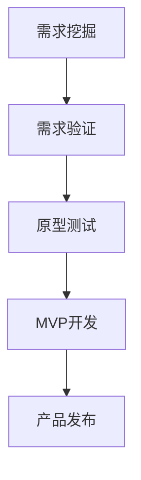

                 

# AI创业公司的产品需求挖掘与验证：需求访谈、原型测试与MVP开发

> 关键词：需求挖掘，产品验证，需求访谈，原型测试，MVP开发

## 1. 背景介绍

### 1.1 问题由来
在AI创业公司的产品开发过程中，需求挖掘与验证是一个至关重要的环节。错误的理解用户需求、产品功能定位不准确或者未能及时捕捉市场变化，会导致最终的产品难以满足用户需求，甚至可能失败。因此，深入理解并准确挖掘用户需求，是AI产品成功的关键。

### 1.2 问题核心关键点
本文将围绕AI创业公司产品需求挖掘与验证的核心问题，从需求访谈、原型测试、MVP开发等多个方面展开讨论，探讨如何通过科学合理的方法，全面了解用户需求，快速验证产品构想，高效构建最小可行产品，最终满足用户期望并实现产品成功。

## 2. 核心概念与联系

### 2.1 核心概念概述

为帮助读者系统理解需求挖掘与验证的核心内容，本节将详细解释以下核心概念：

- **需求挖掘（Requirement Gathering）**：通过一系列调查和分析，深入理解用户需求，形成产品需求说明书。
- **需求验证（Requirement Validation）**：通过原型测试等方式，验证需求说明书是否准确、合理，能否满足用户期望。
- **原型测试（Prototype Testing）**：通过构建原型，让用户实际使用并反馈，验证产品功能及用户体验。
- **MVP（Minimum Viable Product）**：最小可行产品，指以最小的成本和资源，构建一个最基本的产品原型，以便尽早验证商业模型。

这些概念之间紧密关联，共同构成了AI创业公司产品需求挖掘与验证的基础框架。

### 2.2 核心概念原理和架构的 Mermaid 流程图



该流程图展示了需求挖掘、需求验证、原型测试和MVP开发四个关键步骤，它们的逻辑关系和执行顺序。其中，需求挖掘是起点，通过详细访谈、问卷调查等方式获取用户需求；需求验证通过原型测试来验证需求是否符合用户期望；MVP开发则是将这些需求具体实现，构建出功能基本的产品原型；最终产品发布是基于MVP的进一步迭代。

## 3. 核心算法原理 & 具体操作步骤

### 3.1 算法原理概述

基于需求挖掘与验证的AI产品开发，是一个动态迭代的过程。核心思想是通过与用户的深度交流、实际验证，不断优化产品功能和用户体验，直至满足用户期望并实现商业成功。

算法原理主要包括以下几个关键步骤：

1. **需求访谈**：通过与用户进行面对面或在线访谈，详细了解用户需求和期望，收集用户反馈。
2. **需求分析**：对收集到的用户需求进行分类整理，形成系统的需求说明书。
3. **原型测试**：通过构建基本的产品原型，让用户实际使用并反馈，验证需求和设计的合理性。
4. **MVP开发**：基于用户反馈，迭代优化原型，构建出最小的可行产品，进行市场测试。
5. **市场反馈**：根据市场测试结果，进一步优化产品功能，并决定是否进行下一轮迭代。

### 3.2 算法步骤详解

**Step 1: 需求挖掘**
- 组织产品团队和用户进行需求访谈，面对面或在线。访谈内容应涵盖用户的使用场景、痛点、期望功能等。
- 制定详细的访谈提纲，确保所有关键问题都能覆盖到。
- 使用录音、文字记录等方式，确保访谈信息的完整性和准确性。
- 分析访谈录音和记录，提炼出核心需求。

**Step 2: 需求分析**
- 将访谈中收集到的需求进行分类整理，形成需求列表。
- 使用工具如JIRA、Trello等，将需求列表转化为系统的需求说明书。
- 确保需求说明书清晰明确，包含具体的功能描述、优先级、用户角色等。

**Step 3: 原型测试**
- 根据需求说明书，构建基本的产品原型。原型可以是简单的UI原型、功能原型或技术原型。
- 通过邮件、线上测试平台等方式，将原型提交给目标用户进行测试。
- 收集用户对原型的使用反馈，了解原型是否满足用户期望。
- 根据用户反馈，对原型进行迭代优化。

**Step 4: MVP开发**
- 基于优化后的原型，开发功能最基础、最核心的MVP。
- 选择适当的开发工具和框架，如React、Vue.js等。
- 在MVP开发过程中，保持高度灵活性，快速响应市场变化。
- 使用版本控制工具如Git，进行版本管理和迭代开发。

**Step 5: 市场反馈**
- 将MVP投放市场，进行小规模的市场测试。
- 收集用户反馈，了解MVP在实际使用中的效果。
- 根据市场测试结果，决定是否进行下一轮需求挖掘、原型测试和MVP迭代。

### 3.3 算法优缺点

基于需求挖掘与验证的AI产品开发方法具有以下优点：

1. **用户驱动**：以用户需求为中心，确保产品功能符合用户期望，提升用户满意度。
2. **灵活迭代**：通过快速迭代，及时捕捉市场变化，减少市场测试风险。
3. **资源高效**：通过最小可行产品，减少开发成本，提升资源利用效率。
4. **产品成功率高**：通过持续的需求验证和市场测试，降低产品失败的风险。

然而，该方法也存在一些局限性：

1. **时间成本高**：需求挖掘、原型测试和MVP开发等多个环节需要耗费大量时间。
2. **资源投入大**：特别是在早期阶段，需要投入大量的人力和财力。
3. **市场需求不稳定**：用户需求和市场变化具有不确定性，可能导致MVP开发方向偏离目标。

尽管存在这些局限性，但整体来看，需求挖掘与验证的AI产品开发方法依然是目前业界公认的高效、科学的产品开发方式。

### 3.4 算法应用领域

需求挖掘与验证的AI产品开发方法，广泛适用于各类AI创业公司的产品开发过程，包括但不限于以下几个领域：

- **医疗健康**：开发面向医生的智能诊断系统、患者管理平台等。
- **金融科技**：开发智能投顾、风险评估系统、反欺诈检测系统等。
- **教育科技**：开发智能教学平台、学习推荐系统、智能评估工具等。
- **智能制造**：开发工业物联网、智能仓储管理系统、智能质量检测系统等。
- **智能交通**：开发自动驾驶辅助系统、智能交通管理系统、车联网平台等。

## 4. 数学模型和公式 & 详细讲解

### 4.1 数学模型构建

在需求挖掘与验证的AI产品开发过程中，虽然没有明确的数学模型，但我们可以用系统化的流程和方法来描述和指导整个开发过程。以下是一个简化的流程模型：

```
需求挖掘 -> 需求分析 -> 原型测试 -> MVP开发 -> 市场反馈 -> 下一轮迭代
```

### 4.2 公式推导过程

虽然需求挖掘与验证的AI产品开发不涉及具体的数学公式，但我们可以使用一些通用的模型和方法，来辅助需求分析、原型测试和MVP开发。例如，在原型测试中，可以使用A/B测试来验证不同版本的用户体验效果，使用回归模型来分析用户反馈与需求之间的关系。

### 4.3 案例分析与讲解

以一个智能健康管理系统的开发为例，展示需求挖掘与验证的AI产品开发流程：

1. **需求挖掘**：通过与医生、患者等用户进行访谈，了解他们的健康管理需求，如健康数据记录、智能健康建议、在线咨询等。
2. **需求分析**：整理访谈记录，形成系统的需求说明书，包含健康数据记录、智能健康建议、在线咨询等核心功能。
3. **原型测试**：构建一个基础的原型，包含健康数据记录、智能健康建议两个核心功能，提交给医生和患者进行测试。
4. **MVP开发**：基于测试反馈，开发一个最小的可行产品，包含健康数据记录、智能健康建议两个核心功能，并进行小规模的市场测试。
5. **市场反馈**：根据市场测试结果，发现医生对健康数据记录功能需求较高，患者对智能健康建议功能反馈较好，决定下一步开发重点放在这两个功能上。

## 5. 项目实践：代码实例和详细解释说明

### 5.1 开发环境搭建

为了高效地进行需求挖掘与验证的AI产品开发，需要一个良好的开发环境。以下是使用Python进行开发的常见环境配置：

1. 安装Python 3.x，推荐使用Anaconda或Miniconda，创建独立的虚拟环境。
2. 安装Jupyter Notebook，用于编写和执行代码。
3. 安装Git，用于版本控制和团队协作。
4. 安装必要的库，如Pandas、Numpy、Matplotlib等，用于数据处理和可视化。

### 5.2 源代码详细实现

以一个智能健康管理系统为例，展示需求挖掘与验证的AI产品开发流程：

```python
# 需求挖掘阶段
def interview_users():
    # 实现需求访谈的具体逻辑
    pass

# 需求分析阶段
def analyze_demand():
    # 实现需求分析的具体逻辑
    pass

# 原型测试阶段
def prototype_test():
    # 实现原型测试的具体逻辑
    pass

# MVP开发阶段
def minimum_viable_product():
    # 实现MVP开发的具体逻辑
    pass

# 市场反馈阶段
def market_feedback():
    # 实现市场反馈的具体逻辑
    pass
```

### 5.3 代码解读与分析

以`minimum_viable_product()`函数为例，展示MVP开发的详细代码实现：

```python
def minimum_viable_product():
    # 定义MVP的核心功能
    features = ['健康数据记录', '智能健康建议']
    # 根据需求分析结果，选择优先级高的功能进行实现
    chosen_features = ['健康数据记录']
    # 使用Python的Web框架如Flask或Django，构建MVP的Web应用
    # 实现健康数据记录功能
    # 具体代码实现...
    # 构建MVP的UI界面
    # 具体代码实现...
    # 将MVP部署到服务器
    # 具体代码实现...
```

### 5.4 运行结果展示

在MVP开发阶段，可以展示一些关键的运行结果，如：

- 用户界面截图
- 功能演示视频
- 用户反馈摘要

这些结果可以直观地展示MVP的核心功能和用户体验，为后续的迭代提供数据支持。

## 6. 实际应用场景

### 6.1 智能客服系统

在智能客服系统中，需求挖掘与验证的AI产品开发方法可以显著提升系统的用户体验和满意度。具体而言：

1. **需求挖掘**：通过与客服人员和用户进行访谈，了解他们的需求，如智能回答、对话历史记录等。
2. **需求分析**：整理访谈记录，形成系统的需求说明书，包含智能回答、对话历史记录等核心功能。
3. **原型测试**：构建一个基础的原型，包含智能回答和对话历史记录两个核心功能，提交给客服人员和用户进行测试。
4. **MVP开发**：基于测试反馈，开发一个最小的可行产品，包含智能回答和对话历史记录两个核心功能，并进行小规模的市场测试。
5. **市场反馈**：根据市场测试结果，发现用户对智能回答功能需求较高，决定下一步开发重点放在智能回答功能上。

### 6.2 金融科技

在金融科技领域，需求挖掘与验证的AI产品开发方法可以提升系统的安全性和用户体验。具体而言：

1. **需求挖掘**：通过与金融分析师、客户服务人员等进行访谈，了解他们的需求，如风险评估、反欺诈检测等。
2. **需求分析**：整理访谈记录，形成系统的需求说明书，包含风险评估、反欺诈检测等核心功能。
3. **原型测试**：构建一个基础的原型，包含风险评估和反欺诈检测两个核心功能，提交给金融分析师和客户服务人员进行测试。
4. **MVP开发**：基于测试反馈，开发一个最小的可行产品，包含风险评估和反欺诈检测两个核心功能，并进行小规模的市场测试。
5. **市场反馈**：根据市场测试结果，发现客户对反欺诈检测功能反馈较好，决定下一步开发重点放在反欺诈检测功能上。

### 6.3 教育科技

在教育科技领域，需求挖掘与验证的AI产品开发方法可以提升系统的教学效果和用户体验。具体而言：

1. **需求挖掘**：通过与教师、学生等进行访谈，了解他们的需求，如智能推荐、学习分析等。
2. **需求分析**：整理访谈记录，形成系统的需求说明书，包含智能推荐、学习分析等核心功能。
3. **原型测试**：构建一个基础的原型，包含智能推荐和学习分析两个核心功能，提交给教师和学生进行测试。
4. **MVP开发**：基于测试反馈，开发一个最小的可行产品，包含智能推荐和学习分析两个核心功能，并进行小规模的市场测试。
5. **市场反馈**：根据市场测试结果，发现学生对智能推荐功能需求较高，决定下一步开发重点放在智能推荐功能上。

### 6.4 未来应用展望

展望未来，需求挖掘与验证的AI产品开发方法将面临以下挑战和机遇：

1. **用户需求的多样化**：随着市场变化和用户需求的多样化，如何有效挖掘用户需求，成为新的挑战。
2. **数据隐私保护**：在需求挖掘过程中，如何保护用户数据隐私，成为新的关注点。
3. **跨领域应用**：需求挖掘与验证方法不仅适用于单一领域，跨领域应用的需求将进一步增长。
4. **AI技术的融合**：与其他AI技术的融合，如自然语言处理、计算机视觉等，将提升需求挖掘与验证的效果。

## 7. 工具和资源推荐

### 7.1 学习资源推荐

为了帮助开发者系统掌握需求挖掘与验证的核心内容，这里推荐一些优质的学习资源：

1. **《用户体验指南》系列书籍**：详细介绍了用户体验设计的理论基础和实践方法，涵盖需求挖掘、原型测试等多个方面。
2. **《产品管理实战》课程**：斯坦福大学开设的产品管理课程，涵盖需求挖掘、产品迭代等多个环节，适合产品团队学习和实践。
3. **《敏捷开发》书籍**：介绍了敏捷开发方法论和实践案例，提升产品团队的开发效率和灵活性。
4. **JIRA、Trello等项目管理工具**：帮助团队高效进行需求管理、任务跟踪和版本控制。

### 7.2 开发工具推荐

为了高效地进行需求挖掘与验证的AI产品开发，建议使用以下工具：

1. **Jupyter Notebook**：用于编写和执行代码，支持Python、R等多种编程语言。
2. **Git**：用于版本控制和团队协作，支持分支管理、代码合并等功能。
3. **Postman**：用于测试API接口，支持多种HTTP协议和测试场景。
4. **JIRA、Trello等项目管理工具**：帮助团队高效进行需求管理、任务跟踪和版本控制。

### 7.3 相关论文推荐

需求挖掘与验证的AI产品开发方法，源自学界的持续研究。以下是几篇奠基性的相关论文，推荐阅读：

1. **《用户体验设计基础》**：详细介绍了用户体验设计的理论基础和实践方法，涵盖需求挖掘、原型测试等多个方面。
2. **《敏捷软件开发实践》**：介绍了敏捷开发方法论和实践案例，提升产品团队的开发效率和灵活性。
3. **《最小可行产品：实践指南》**：介绍了最小可行产品的概念和实施方法，适合产品团队学习和实践。

## 8. 总结：未来发展趋势与挑战

### 8.1 总结

本文对基于需求挖掘与验证的AI产品开发方法进行了全面系统的介绍。首先阐述了需求挖掘与验证的核心问题，从需求访谈、原型测试、MVP开发等多个方面展开讨论，详细讲解了需求挖掘与验证的算法原理和操作步骤，并给出了代码实例和详细解释说明。

通过本文的系统梳理，可以看到，基于需求挖掘与验证的AI产品开发方法在AI创业公司中得到了广泛应用，显著提升了产品的用户满意度和市场竞争力。未来，伴随技术的不断进步和市场的变化，需求挖掘与验证方法也将不断优化，为AI产品的成功提供坚实保障。

### 8.2 未来发展趋势

展望未来，需求挖掘与验证的AI产品开发方法将呈现以下几个发展趋势：

1. **用户需求的多样化**：随着市场变化和用户需求的多样化，需求挖掘方法将更加智能和精准。
2. **数据隐私保护**：在需求挖掘过程中，将更加注重数据隐私保护，确保用户数据安全。
3. **跨领域应用**：需求挖掘与验证方法不仅适用于单一领域，跨领域应用的需求将进一步增长。
4. **AI技术的融合**：与其他AI技术的融合，如自然语言处理、计算机视觉等，将提升需求挖掘与验证的效果。

### 8.3 面临的挑战

尽管需求挖掘与验证的AI产品开发方法已经取得了一定的成果，但在迈向更加智能化、普适化应用的过程中，仍面临以下挑战：

1. **用户需求的多样化**：随着市场变化和用户需求的多样化，如何有效挖掘用户需求，成为新的挑战。
2. **数据隐私保护**：在需求挖掘过程中，如何保护用户数据隐私，成为新的关注点。
3. **跨领域应用**：跨领域应用的需求挖掘与验证方法，仍需不断优化和探索。
4. **AI技术的融合**：与其他AI技术的融合，如自然语言处理、计算机视觉等，仍需进一步研究。

### 8.4 研究展望

为了应对未来需求挖掘与验证方法的挑战，未来的研究需要在以下几个方面寻求新的突破：

1. **智能需求挖掘**：利用自然语言处理、机器学习等技术，提升需求挖掘的精准度和智能化水平。
2. **隐私保护技术**：在需求挖掘过程中，引入隐私保护技术，确保用户数据安全。
3. **跨领域应用**：结合其他AI技术，提升需求挖掘与验证方法的跨领域应用能力。
4. **AI技术的融合**：探索与其他AI技术的融合方式，提升需求挖掘与验证的效果。

这些研究方向的探索，必将引领需求挖掘与验证方法迈向更高的台阶，为AI产品的成功提供坚实的保障。面向未来，需求挖掘与验证方法还需要与其他AI技术进行更深入的融合，共同推动AI产品的成功。总之，需求挖掘与验证方法需要不断优化和创新，以应对不断变化的市场需求和用户期望。

## 9. 附录：常见问题与解答

**Q1：需求挖掘与验证的AI产品开发方法是否适用于所有产品？**

A: 需求挖掘与验证的AI产品开发方法适用于大多数产品，但特别适用于需要用户参与、功能复杂的产品。对于简单、标准化的产品，可以直接跳过需求挖掘和原型测试，直接进入MVP开发阶段。

**Q2：需求挖掘与验证的AI产品开发方法是否适用于B2B产品？**

A: 需求挖掘与验证的AI产品开发方法同样适用于B2B产品，但需要在需求挖掘阶段更加注重业务需求和用户痛点。B2B产品通常涉及多个业务部门和用户角色，需要更全面的需求分析。

**Q3：需求挖掘与验证的AI产品开发方法是否适用于国际市场？**

A: 需求挖掘与验证的AI产品开发方法同样适用于国际市场，但需要考虑文化差异、语言差异等因素。在需求挖掘阶段，需要进行本地化研究，了解不同市场的用户需求和期望。

**Q4：需求挖掘与验证的AI产品开发方法是否适用于已有产品的迭代升级？**

A: 需求挖掘与验证的AI产品开发方法同样适用于已有产品的迭代升级。在已有产品的基础上，可以通过需求访谈、原型测试等方式，了解用户反馈，快速进行迭代优化。

**Q5：需求挖掘与验证的AI产品开发方法是否适用于AI创业公司？**

A: 需求挖掘与验证的AI产品开发方法特别适用于AI创业公司。AI创业公司通常面临资源紧张、时间紧迫等问题，需要高效、灵活的产品开发方法。需求挖掘与验证方法能够帮助AI创业公司快速捕捉用户需求，验证产品构想，高效构建最小可行产品。

总之，需求挖掘与验证的AI产品开发方法是高效、科学的产品开发方法，适用于各类AI创业公司，帮助他们快速构建成功产品，满足用户需求。通过科学的方法，不断优化和创新，需求挖掘与验证方法将在未来AI产品开发中发挥更大的作用。

