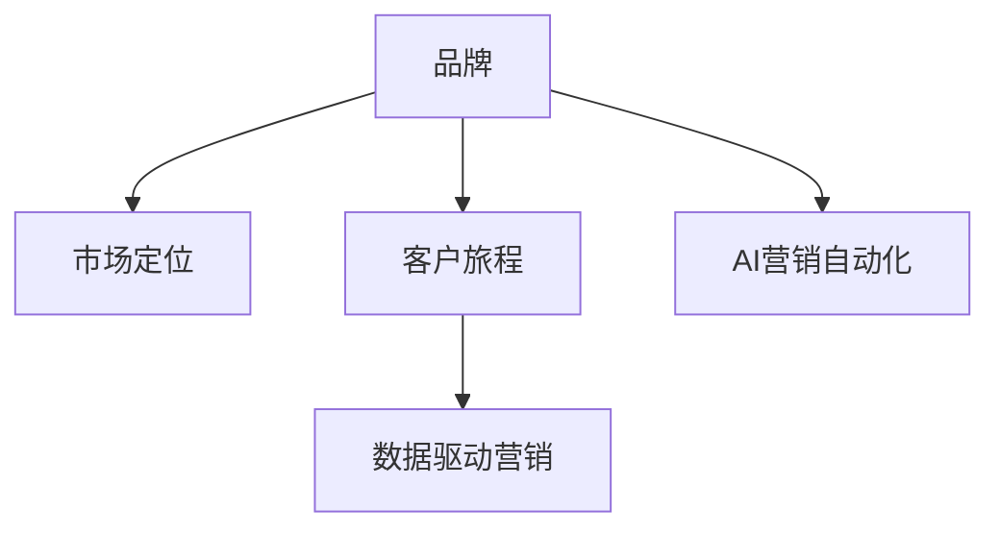

                 

# AI创业公司的品牌营销策略

## 1. 背景介绍

### 1.1 问题由来

在当今数据驱动的时代，AI技术已经成为各行业的核心竞争力。然而，尽管AI技术在内部驱动了大量的商业决策，但大多数创业公司仍然面临品牌建设的挑战。技术优势和商业成功之间的鸿沟需要通过有效的品牌营销策略来弥合。AI创业公司的品牌营销策略需要考虑如何在保持技术创新性的同时，有效地传达给外界，以赢得市场和客户的认可。

### 1.2 问题核心关键点

AI创业公司的品牌营销策略核心关键点在于如何通过展示技术优势、突出商业价值以及建立与客户的连接来提升品牌影响力。具体包括：

- **技术优势**：强调公司的核心技术创新和研发能力。
- **商业价值**：展示AI技术在实际业务中的应用效果。
- **客户连接**：建立品牌与客户之间的情感连接，增强客户忠诚度。

## 2. 核心概念与联系

### 2.1 核心概念概述

为更好地理解AI创业公司的品牌营销策略，本节将介绍几个密切相关的核心概念：

- **品牌**：品牌是指企业及其产品的整体形象和声誉，由标志、口号、广告、社交媒体等多种元素构成。
- **市场定位**：市场定位是指企业在市场中的角色和地位，包括目标客户、竞争优势等。
- **客户旅程**：客户旅程指的是客户从认知到购买再到使用的全过程，品牌营销需覆盖每个阶段。
- **数据驱动营销**：基于数据分析和模型预测来优化营销策略，提高ROI。
- **AI营销自动化**：利用AI技术实现营销活动的自动化，提高效率和效果。

这些核心概念之间的逻辑关系可以通过以下Mermaid流程图来展示：



这个流程图展示了几大核心概念之间的关系：

1. 品牌建设基于市场定位，明确企业与市场的交互方式。
2. 客户旅程涵盖从认知到购买的各个阶段，品牌营销需覆盖全过程。
3. 数据驱动营销利用数据分析和模型优化营销策略。
4. AI营销自动化通过AI技术实现营销活动的高效和精准。

## 3. 核心算法原理 & 具体操作步骤

### 3.1 算法原理概述

AI创业公司的品牌营销策略基于以下算法原理：

- **内容营销**：通过发布高质量、有价值的内容（如博客、白皮书、视频等）来展示技术优势和商业价值，吸引潜在客户。
- **数据驱动的个性化营销**：利用数据分析技术，根据用户行为和偏好进行个性化推荐，提高转化率。
- **社交媒体营销**：在社交平台上建立品牌形象，通过互动和内容分享增强品牌影响力和客户黏性。
- **AI营销自动化**：利用AI技术自动化执行营销活动，如自动回复、个性化广告推送等。

### 3.2 算法步骤详解

基于上述算法原理，AI创业公司的品牌营销步骤可具体细化为：

**Step 1: 制定品牌策略和市场定位**

- 明确品牌核心价值和目标客户群体。
- 分析竞争对手，确定差异化策略。
- 设定长期和短期品牌目标。

**Step 2: 建立内容营销框架**

- 确定内容类型和发布渠道。
- 制定内容日历，规划发布时间。
- 建立内容团队，包括内容创作、编辑和推广。

**Step 3: 实施数据驱动的个性化营销**

- 收集和分析用户行为数据。
- 构建用户画像和行为模型。
- 根据模型预测和用户行为，进行个性化推荐和广告投放。

**Step 4: 社交媒体营销**

- 在各大社交平台（如Twitter、LinkedIn、WeChat）建立品牌账号。
- 定期发布品牌相关内容，如产品更新、公司新闻、客户案例等。
- 与客户互动，回答咨询，收集反馈，持续优化。

**Step 5: 部署AI营销自动化**

- 整合营销数据和AI技术，实现自动化广告投放。
- 使用聊天机器人进行客户咨询和问题解答。
- 自动化跟踪和分析营销效果，及时调整策略。

### 3.3 算法优缺点

**优点**：

- **高效**：自动化执行减少人工操作，提高效率。
- **精准**：基于数据驱动的个性化推荐，提高转化率。
- **广泛覆盖**：通过社交媒体和内容营销，覆盖更多潜在客户。

**缺点**：

- **技术门槛高**：需要一定的技术背景来部署和优化AI工具。
- **成本高**：初期技术实施和维护成本较高。
- **隐私问题**：需要合理处理用户数据，避免隐私泄露。

### 3.4 算法应用领域

AI创业公司的品牌营销策略可以应用于各个领域，如：

- **技术公司**：展示技术创新和产品优势，吸引开发者和企业客户。
- **健康医疗**：通过数据驱动个性化营销，提升客户对健康产品和服务的使用率。
- **零售电商**：利用AI营销自动化提高广告投放效果，提升客户购物体验。
- **金融服务**：通过内容营销和社交媒体建立品牌信任，吸引潜在客户。

## 4. 数学模型和公式 & 详细讲解 & 举例说明

### 4.1 数学模型构建

品牌营销策略的数学模型构建基于以下基本假设：

- 市场是一个多属性空间，品牌在此空间中的位置由多个维度决定。
- 客户在多个品牌之间进行比较和选择，品牌影响力与其位置成正比。
- 品牌影响力随时间动态变化，受市场推广和客户反馈影响。

**数学模型**：

$$
B(t) = \sum_{i=1}^n \alpha_i A_i(t) + \beta C(t)
$$

其中：
- $B(t)$ 表示品牌在时间$t$的影响力。
- $A_i(t)$ 表示在第$i$个广告渠道上的广告投放强度。
- $\alpha_i$ 表示广告渠道$i$的权重系数。
- $C(t)$ 表示社交媒体上的品牌影响力。
- $\beta$ 表示社交媒体对品牌影响力的权重系数。

### 4.2 公式推导过程

品牌影响力$B(t)$随时间变化的公式推导如下：

1. 品牌影响力$B(t)$由广告投放强度$A_i(t)$和社交媒体影响力$C(t)$两部分组成。
2. 广告投放强度$A_i(t)$与广告渠道$i$的权重系数$\alpha_i$成正比。
3. 社交媒体影响力$C(t)$与社交媒体对品牌影响力的权重系数$\beta$成正比。

因此，品牌影响力$B(t)$随时间变化的具体公式如下：

$$
\frac{dB(t)}{dt} = \sum_{i=1}^n \alpha_i \frac{dA_i(t)}{dt} + \beta \frac{dC(t)}{dt}
$$

### 4.3 案例分析与讲解

考虑一个AI创业公司，其主要产品在市场上竞争激烈。品牌需要在短时间内提升影响力。根据上述模型，公司可以采取以下措施：

1. 在主要广告渠道上加大广告投放，提高$A_i(t)$值。
2. 通过社交媒体内容营销，提高$C(t)$值。
3. 根据数据分析调整广告渠道权重$\alpha_i$，提高广告投放效果。
4. 监测社交媒体上的品牌反馈，优化社交媒体策略，提高$\beta$值。

## 5. 项目实践：代码实例和详细解释说明

### 5.1 开发环境搭建

在进行品牌营销策略的实践前，我们需要准备好开发环境。以下是使用Python进行AI营销自动化开发的环境配置流程：

1. 安装Anaconda：从官网下载并安装Anaconda，用于创建独立的Python环境。

2. 创建并激活虚拟环境：
```bash
conda create -n marketing-env python=3.8 
conda activate marketing-env
```

3. 安装相关库：
```bash
conda install pandas numpy scipy matplotlib scikit-learn torch transformers
pip install jupyter notebook matplotlib interactive
```

4. 安装数据处理和分析库：
```bash
pip install dask fsspec
```

完成上述步骤后，即可在`marketing-env`环境中开始AI营销自动化的开发。

### 5.2 源代码详细实现

以下是一个简单的AI营销自动化系统，通过Python和Jupyter Notebook实现：

```python
import pandas as pd
import numpy as np
from sklearn.ensemble import RandomForestRegressor
from transformers import TFAutoModelForSequenceClassification, pipeline

# 读取广告数据
ads = pd.read_csv('ads.csv')
# 读取社交媒体数据
social_media = pd.read_csv('social_media.csv')

# 定义广告投放强度函数
def ad_intensity(ad_channel, budget):
    if ad_channel == 'google':
        return budget / 1000
    elif ad_channel == 'facebook':
        return budget / 2000
    elif ad_channel == 'adwords':
        return budget / 5000
    else:
        return 0

# 计算广告投放强度矩阵
ad_intensity_matrix = ads.groupby('ad_channel').apply(lambda x: x['budget'].apply(lambda b: ad_intensity(x['channel'], b)))

# 定义社交媒体影响力函数
def social_media_influence(tweet_volume, engagement_rate):
    return tweet_volume * engagement_rate

# 计算社交媒体影响力矩阵
social_media_influence_matrix = social_media.groupby('platform').apply(lambda x: x.groupby(['tweet_volume', 'engagement_rate'])['influence'].mean())

# 定义品牌影响力函数
def brand_influence(ad_intensity_matrix, social_media_influence_matrix):
    brand_influence = np.dot(ad_intensity_matrix, social_media_influence_matrix)
    return brand_influence

# 计算品牌影响力
brand_influence = brand_influence(ad_intensity_matrix, social_media_influence_matrix)

# 输出品牌影响力结果
print(brand_influence)
```

### 5.3 代码解读与分析

让我们再详细解读一下关键代码的实现细节：

**品牌影响力计算**：
- 通过广告投放强度和社交媒体影响力计算品牌影响力。
- 广告投放强度根据不同广告渠道计算，社交媒体影响力根据推文数量和互动率计算。
- 通过矩阵乘法计算最终品牌影响力。

**广告投放强度**：
- 根据不同广告渠道设置不同的预算分配比例。
- 通过广告投放强度函数计算广告投放强度。

**社交媒体影响力**：
- 根据推文数量和互动率计算社交媒体影响力。
- 使用`groupby`函数对数据进行聚合计算。

**品牌影响力矩阵**：
- 将广告投放强度和社交媒体影响力矩阵相乘得到品牌影响力。
- 使用`np.dot`函数进行矩阵乘法计算。

在实际应用中，品牌影响力的计算需要结合具体的广告投放和社交媒体数据，通过模型训练来确定广告渠道权重和社交媒体影响力系数，从而实现更精确的品牌影响力预测。

## 6. 实际应用场景

### 6.1 技术公司品牌建设

对于技术公司而言，品牌建设是展示技术优势和商业价值的重要途径。例如，一家AI创业公司可以通过发布AI技术白皮书、参加技术论坛、举办在线研讨会等方式展示其核心技术，吸引开发者和企业客户。此外，还可以利用社交媒体平台发布公司新闻、客户案例和技术进展，提升品牌知名度和信任度。

### 6.2 健康医疗品牌营销

健康医疗行业的品牌营销需要特别注重数据安全和隐私保护。AI创业公司可以通过在社交媒体上发布健康科普文章、参与健康活动、与医疗专家互动等方式提升品牌影响力。同时，通过数据驱动个性化营销，向潜在客户推荐健康产品和服务，提升客户转化率。

### 6.3 零售电商品牌推广

零售电商行业的品牌营销需要精准投放广告，吸引更多潜在客户。AI创业公司可以通过AI营销自动化，根据用户行为数据进行个性化推荐和广告投放。例如，根据用户浏览记录推送相关产品广告，根据用户购买历史推荐相似产品，提高客户购物体验和忠诚度。

### 6.4 金融服务品牌建设

金融服务行业品牌营销的核心在于建立客户信任。AI创业公司可以通过发布专业金融分析报告、参与金融峰会、与金融机构合作等方式提升品牌声誉。同时，利用数据驱动个性化营销，针对不同客户群体推荐金融产品和服务，提高客户转化率和满意度。

## 7. 工具和资源推荐

### 7.1 学习资源推荐

为了帮助开发者系统掌握AI创业公司的品牌营销策略，这里推荐一些优质的学习资源：

1. 《数字营销基础》课程：多门MOOC课程，如Coursera的“Digital Marketing Specialization”，详细介绍了数字营销的各个环节。
2. 《数据科学基础》系列书籍：如《Python数据科学手册》，介绍了数据分析和机器学习的基本原理和方法。
3. 《AI营销自动化》在线文章：如McKinsey Insights的“How AI is transforming marketing”，介绍了AI在营销自动化中的应用。
4. HuggingFace官方文档：Transformer库的官方文档，提供了AI营销自动化相关的模型和工具。
5. 《客户旅程地图：客户体验设计》书籍：如《Customer Journey Mapping: The Ultimate Guide to Enhancing Your Customer Experience》，介绍了客户旅程的全过程和品牌营销策略。

通过对这些资源的学习实践，相信你一定能够快速掌握AI创业公司的品牌营销策略，并用于解决实际的营销问题。

### 7.2 开发工具推荐

高效的开发离不开优秀的工具支持。以下是几款用于AI营销自动化开发的常用工具：

1. Python：简单易学的高级编程语言，广泛用于数据分析和机器学习。
2. Jupyter Notebook：交互式笔记本环境，方便代码开发和数据处理。
3. Pandas：数据分析库，提供高效的数据处理和分析功能。
4. Scikit-learn：机器学习库，包含丰富的机器学习算法和工具。
5. TensorFlow：开源深度学习框架，支持多种模型训练和优化。
6. PyTorch：深度学习框架，提供了灵活的模型构建和训练功能。
7. HuggingFace Transformers库：提供了预训练语言模型，支持各种NLP任务。
8. Google Analytics：数据分析工具，可以实时监测网站和应用的流量和用户行为。
9. HubSpot：全栈营销自动化平台，支持广告、邮件、社交媒体等多种营销渠道。

合理利用这些工具，可以显著提升AI营销自动化的开发效率，加快创新迭代的步伐。

### 7.3 相关论文推荐

AI创业公司的品牌营销策略涉及多种技术和方法，以下是几篇奠基性的相关论文，推荐阅读：

1. “Brand Equity Management”（品牌管理）一书：介绍了品牌管理的基本理论和方法。
2. “Digital Marketing Strategies for Small Businesses”（小企业数字营销策略）论文：介绍了数字营销的策略和工具。
3. “Data-Driven Marketing”（数据驱动营销）论文：详细讨论了数据在营销中的应用。
4. “Brand Positioning in the Digital Age”（数字时代品牌定位）论文：讨论了在数字时代品牌定位的策略。
5. “AI Marketing Automation: A Review”（AI营销自动化综述）论文：总结了AI在营销自动化中的应用。

这些论文代表了大数据和AI在品牌营销领域的最新进展，通过学习这些前沿成果，可以帮助研究者把握学科前进方向，激发更多的创新灵感。

## 8. 总结：未来发展趋势与挑战

### 8.1 总结

本文对AI创业公司的品牌营销策略进行了全面系统的介绍。首先阐述了品牌营销策略的重要性，明确了技术优势和商业价值之间的桥梁。其次，从原理到实践，详细讲解了内容营销、数据驱动的个性化营销、社交媒体营销和AI营销自动化的算法原理和具体操作步骤。最后，本文还探讨了AI创业公司在实际应用中的多个场景，并给出了工具和资源推荐。

通过本文的系统梳理，可以看到，AI创业公司的品牌营销策略是一个涵盖多学科知识和方法的综合应用。其核心在于通过展示技术优势和商业价值，建立与客户的情感连接，从而提升品牌影响力。

### 8.2 未来发展趋势

展望未来，AI创业公司的品牌营销策略将呈现以下几个发展趋势：

1. **技术集成**：随着AI技术的不断进步，品牌营销将更多地集成AI技术，如自然语言处理、计算机视觉、推荐系统等，实现更智能、更精准的营销。
2. **客户体验提升**：品牌营销将更加注重客户体验，通过AI技术提供个性化的互动和推荐，提升客户满意度和忠诚度。
3. **数据驱动**：品牌营销将更依赖数据驱动，通过大数据分析和机器学习技术，优化营销策略，提高投资回报率。
4. **自动化和智能化**：营销活动的自动化和智能化水平将不断提高，减少人工干预，提高效率和效果。
5. **跨平台整合**：品牌营销将更多地整合跨平台的营销渠道，如社交媒体、网站、移动应用等，实现全渠道的客户覆盖。

这些趋势凸显了AI创业公司品牌营销的前景和潜力，未来将有更多的机会通过技术创新和智能化手段，提升品牌影响力和市场竞争力。

### 8.3 面临的挑战

尽管AI创业公司的品牌营销策略在多个方面取得了进展，但仍然面临一些挑战：

1. **隐私保护**：品牌营销需要处理大量用户数据，如何保护用户隐私是一个重要的挑战。
2. **技术门槛**：品牌营销涉及多种技术手段，需要较高的技术门槛，对开发团队的技术能力提出了要求。
3. **市场变化**：市场环境变化快，品牌策略需要快速调整和优化，这对团队的反应速度和灵活性提出了要求。
4. **投资回报**：品牌营销需要投入大量资源，如何衡量和优化营销活动的投资回报率是一个重要课题。
5. **客户信任**：品牌建设需要时间，如何建立和维护客户信任是一个长期的过程。

这些挑战需要AI创业公司在品牌建设过程中不断创新和优化，提升品牌营销的有效性和可持续性。

### 8.4 研究展望

面对品牌营销面临的挑战，未来的研究需要在以下几个方面寻求新的突破：

1. **隐私保护技术**：研究隐私保护技术，如差分隐私、联邦学习等，确保用户数据的安全和匿名性。
2. **自动化和智能化**：进一步提升营销活动的自动化和智能化水平，利用AI技术实现更精准的个性化推荐和广告投放。
3. **数据驱动的营销优化**：通过深度学习和机器学习技术，优化营销策略，提高投资回报率。
4. **跨平台整合**：研究跨平台整合技术，实现全渠道的客户覆盖和品牌一致性。
5. **客户体验优化**：研究客户体验优化技术，提升客户满意度和忠诚度。

这些研究方向的探索，将有助于AI创业公司在品牌营销中实现更高的效率和效果，提升品牌竞争力和市场份额。

## 9. 附录：常见问题与解答

**Q1：品牌营销策略是否适用于所有行业？**

A: 品牌营销策略可以应用于大多数行业，但不同行业的品牌建设重点和方式略有差异。例如，技术公司的品牌建设需要突出技术优势，健康医疗行业的品牌建设需要重视数据安全和隐私保护，金融服务的品牌建设需要增强客户信任等。

**Q2：如何衡量品牌营销的效果？**

A: 品牌营销的效果可以通过多个指标进行衡量，如品牌知名度、客户转化率、客户满意度、客户留存率等。具体指标可以根据品牌建设的具体目标设定，并通过数据分析和模型预测进行评估。

**Q3：如何选择合适的社交媒体平台？**

A: 选择社交媒体平台需要考虑目标客户的聚集地和平台特点。例如，B2B品牌可以选择LinkedIn进行营销，B2C品牌可以选择Instagram、微信等社交平台。同时，需要考虑平台的活跃用户数、互动率和广告投放成本。

**Q4：数据驱动的个性化营销是否需要大量数据？**

A: 数据驱动的个性化营销需要一定的数据支持，但并非需要大量数据。通过优化算法和模型设计，可以在有限的样本上实现较好的效果。同时，可以采用数据增强、数据扩充等技术，提升模型的泛化能力。

**Q5：AI营销自动化是否适用于小型创业公司？**

A: AI营销自动化虽然技术要求较高，但对于有技术团队和资源投入的小型创业公司，也是一种有效的品牌营销手段。可以通过集成开源工具和模型，逐步实现自动化营销。

---

作者：禅与计算机程序设计艺术 / Zen and the Art of Computer Programming

