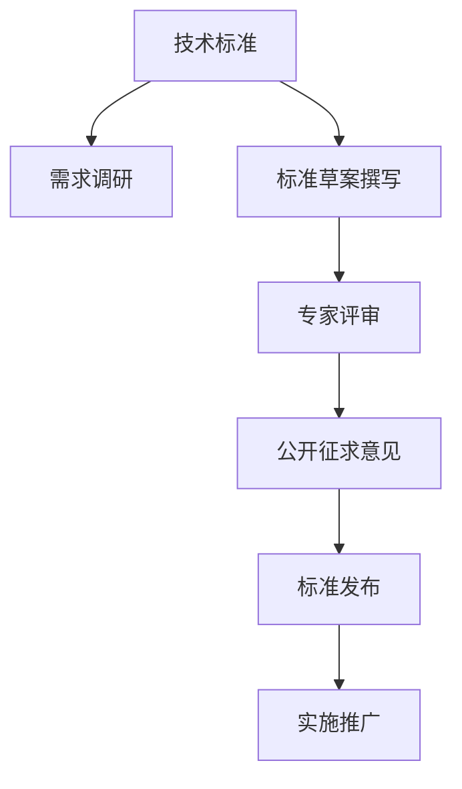

                 

# AI创业公司的技术标准化参与策略：标准制定、标准实施与标准推广

在AI快速发展的今天，技术标准化已经成为企业间竞争的重要手段。AI创业公司需要积极参与标准制定、实施与推广，以确保其技术优势和市场影响力。本文将系统性地探讨AI创业公司如何有效参与技术标准化过程，为读者提供全面的指导和实践建议。

## 1. 背景介绍

### 1.1 问题由来
随着人工智能技术的飞速发展，AI创业公司逐渐崭露头角，成为科技创新的重要推动力量。然而，技术标准的不统一和竞争的无序化也给行业健康发展带来了挑战。技术标准化有助于提升技术互操作性、降低开发成本、推动产业规范化，对AI创业公司的长期发展至关重要。

### 1.2 问题核心关键点
1. **技术标准的重要性**：标准可以提升技术互操作性，降低开发成本，促进产业规范化。
2. **AI创业公司的角色**：积极参与标准制定，可以提升行业影响力，实现技术优势的长期积累。
3. **标准化参与的策略**：从标准制定、实施到推广，每一步都需要精心策划和执行。
4. **标准化过程中的挑战**：需要平衡各方利益，协调技术复杂性，确保标准的实用性和可行性。

## 2. 核心概念与联系

### 2.1 核心概念概述

为更好地理解AI创业公司在技术标准化中的参与策略，本节将介绍几个密切相关的核心概念：

- **技术标准**：在特定技术领域内，约定的一组规范和指南，旨在确保技术的互操作性和一致性。
- **AI创业公司**：利用AI技术创新驱动市场的新型企业，通常具有灵活的创新能力和快速响应市场需求的能力。
- **技术标准化参与**：AI创业公司通过技术标准的制定、实施和推广，提升其在行业内的技术影响力。
- **技术标准化平台**：如IEEE、ISO等组织，负责制定和推广技术标准。
- **技术标准化过程**：包括需求调研、标准草案撰写、专家评审、公开征求意见、标准发布和实施推广等环节。

这些核心概念之间的逻辑关系可以通过以下Mermaid流程图来展示：



这个流程图展示了大语言模型的核心概念及其之间的关系：

1. 技术标准通过需求调研获得技术需求和目标。
2. 标准草案撰写将需求转化为具体标准，提交专家评审。
3. 专家评审和公开征求意见进一步完善标准内容。
4. 标准发布后，进入实施推广阶段。

## 3. 核心算法原理 & 具体操作步骤
### 3.1 算法原理概述

AI创业公司在技术标准化参与过程中，需遵循以下基本原理：

1. **标准化过程**：从需求调研开始，到标准草案撰写、专家评审、公开征求意见、标准发布和实施推广，每一步都必须遵循既定的程序和规范。
2. **利益协调**：在标准制定过程中，需平衡各方利益，确保标准的公平性和实用性。
3. **技术复杂性管理**：标准草案需考虑技术的复杂性，确保标准的可行性和互操作性。
4. **持续改进**：标准发布后，需要持续跟进和更新，以适应技术的发展和应用的变化。

### 3.2 算法步骤详解

AI创业公司参与技术标准化的主要步骤包括：

**Step 1: 需求调研**
- 收集行业内外的技术需求，分析现有技术标准的不足和改进点。
- 通过问卷调查、专家访谈等方式，广泛听取行业专家、用户和相关利益方的意见。
- 总结需求调研结果，明确标准制定的目标和范围。

**Step 2: 标准草案撰写**
- 基于需求调研结果，撰写标准草案，包括标准概述、技术规范、实施指南等。
- 确保标准草案内容全面、详细、易于理解和实施。
- 引入行业最佳实践，确保标准的高质量和高实用性。

**Step 3: 专家评审**
- 邀请行业内外的专家进行评审，对标准草案进行技术和法律上的审核。
- 专家评审应包括技术可行性、互操作性、适用性、法律合规性等方面的评估。
- 根据评审意见，对标准草案进行修订和完善。

**Step 4: 公开征求意见**
- 将修订后的标准草案公开发布，征求行业内的意见和建议。
- 通过网站、会议、邮件等方式，广泛收集反馈信息。
- 对反馈意见进行整理和分析，进一步完善标准内容。

**Step 5: 标准发布**
- 根据反馈意见和评审结果，最终确定标准文本。
- 通过标准平台（如IEEE、ISO）进行发布，获取正式的认证和认可。
- 编写标准宣传材料，推广标准的实施和应用。

**Step 6: 实施推广**
- 与行业内外的组织和企业合作，推广标准的实施。
- 提供技术支持和培训，帮助用户和开发者理解和应用标准。
- 收集反馈信息，持续改进和优化标准。

### 3.3 算法优缺点

**优点**：
1. **提升行业影响力**：通过参与标准制定，AI创业公司可以提升其在行业内的技术影响力，塑造市场规则。
2. **降低开发成本**：标准化有助于提升技术互操作性，减少技术开发和集成成本。
3. **推动产业规范化**：标准可以确保技术的一致性和兼容性，促进产业规范化发展。

**缺点**：
1. **协调成本高**：标准制定过程中需要平衡各方利益，协调复杂。
2. **时间周期长**：标准制定的周期一般较长，可能影响企业快速响应市场需求。
3. **实施难度大**：标准推广和实施需要行业内外的共同努力，可能面临技术实现和推广的挑战。

### 3.4 算法应用领域

技术标准化在多个领域中均有广泛应用，如：

- **物联网**：制定统一的技术标准，确保设备之间的互操作性和兼容性。
- **云计算**：制定云服务标准，确保不同云平台之间的互操作性和安全合规。
- **大数据**：制定数据格式和处理标准，确保数据的互操作性和高质量。
- **人工智能**：制定AI模型和算法标准，确保模型的互操作性和公平性。
- **自然语言处理**：制定语言处理标准，确保不同应用场景下的语言理解和生成一致性。

## 4. 数学模型和公式 & 详细讲解  
### 4.1 数学模型构建

本节将使用数学语言对技术标准化过程进行更加严格的刻画。

记标准制定过程为 $S=\{S_1, S_2, ..., S_n\}$，其中 $S_i$ 表示标准制定的第 $i$ 个步骤。标准草案为 $D$，标准文本为 $T$。标准制定流程如下：

1. **需求调研**：$S_1$，目标：$O_1$，结果：$R_1$
2. **标准草案撰写**：$S_2$，输入：$R_1$，输出：$D$
3. **专家评审**：$S_3$，输入：$D$，输出：$E$
4. **公开征求意见**：$S_4$，输入：$E$，输出：$F$
5. **标准发布**：$S_5$，输入：$F$，输出：$T$
6. **实施推广**：$S_6$，输入：$T$，输出：$A$

其中，需求调研目标 $O_1$ 通过问卷调查、专家访谈等方式确定；标准草案 $D$ 由专家评审 $E$ 和公开征求意见 $F$ 共同完善；标准文本 $T$ 通过标准发布平台认证；标准实施推广 $A$ 依赖于标准文本的普及和应用。

### 4.2 公式推导过程

以物联网设备互操作性标准为例，推导标准制定过程的数学模型。

记标准草案为 $D=\{d_1, d_2, ..., d_m\}$，标准文本为 $T$。标准制定过程可以表示为：

$$
T = \mathop{\arg\min}_{D} \lVert D - T \rVert
$$

其中 $\lVert \cdot \rVert$ 表示标准文本 $T$ 与标准草案 $D$ 之间的差异度量。标准草案 $D$ 需要满足以下约束：

1. **技术可行性**：$D$ 必须保证技术实现的可行性和互操作性。
2. **法律合规性**：$D$ 必须符合相关的法律法规和标准。
3. **用户需求**：$D$ 必须满足用户和利益相关方的需求。

标准草案的优化目标可以表示为：

$$
\min_{D} \sum_{i=1}^m w_i \lVert d_i - t_i \rVert
$$

其中 $w_i$ 表示第 $i$ 个约束的权重，$t_i$ 表示第 $i$ 个约束的目标值。通过求解上述优化问题，可以获得满足所有约束条件的最优标准草案 $D$。

### 4.3 案例分析与讲解

以ISO/IEC 27001信息安全管理体系为例，分析其标准制定和实施的过程。

ISO/IEC 27001标准旨在帮助组织建立、实施、维护和持续改进信息安全管理体系。标准制定的过程如下：

1. **需求调研**：通过问卷调查、专家访谈等方式，收集信息安全相关的需求和目标。
2. **标准草案撰写**：基于需求调研结果，撰写标准草案，包括信息安全管理的框架、控制措施、合规要求等。
3. **专家评审**：邀请国际知名的信息安全专家进行评审，对标准草案进行技术和法律上的审核。
4. **公开征求意见**：将修订后的标准草案公开发布，征求全球信息安全领域的意见和建议。
5. **标准发布**：通过ISO/IEC标准平台进行发布，获取正式的认证和认可。
6. **实施推广**：通过培训、认证、审核等方式，推广标准的实施和应用。

ISO/IEC 27001标准的制定过程充分体现了技术标准化的系统性和严谨性，为全球信息安全领域提供了权威的指导和规范。

## 5. 项目实践：代码实例和详细解释说明
### 5.1 开发环境搭建

在进行技术标准化参与实践前，我们需要准备好开发环境。以下是使用Python进行PyTorch开发的环境配置流程：

1. 安装Anaconda：从官网下载并安装Anaconda，用于创建独立的Python环境。

2. 创建并激活虚拟环境：
```bash
conda create -n pytorch-env python=3.8 
conda activate pytorch-env
```

3. 安装PyTorch：根据CUDA版本，从官网获取对应的安装命令。例如：
```bash
conda install pytorch torchvision torchaudio cudatoolkit=11.1 -c pytorch -c conda-forge
```

4. 安装各类工具包：
```bash
pip install numpy pandas scikit-learn matplotlib tqdm jupyter notebook ipython
```

完成上述步骤后，即可在`pytorch-env`环境中开始标准化实践。

### 5.2 源代码详细实现

下面我们以ISO/IEC 27001信息安全管理体系为例，给出使用Python和PyTorch进行技术标准化的代码实现。

首先，定义需求调研函数：

```python
import pandas as pd
import numpy as np
from sklearn.cluster import KMeans

def demand_analysis(data, k):
    # 需求调研：通过问卷调查收集需求数据
    demand = pd.read_csv(data)
    num_clusters = k
    
    # 需求分析：使用K-Means聚类算法，将需求分为k类
    kmeans = KMeans(n_clusters=num_clusters, random_state=0).fit(demand)
    cluster_labels = kmeans.labels_
    
    # 统计每类需求的数量和占比
    cluster_demand = demand.groupby(cluster_labels).size().reset_index(name='count')
    cluster_demand_ratio = cluster_demand['count'] / cluster_demand['count'].sum()
    
    return cluster_demand_ratio
```

然后，定义标准草案撰写函数：

```python
def standard_grassDraft(demand_ratio, k):
    # 标准草案撰写：基于需求调研结果，撰写标准草案
    standard = pd.DataFrame(columns=['Type', 'Description', 'Target'])
    
    # 设置标准草案的类型、描述和目标
    for i in range(k):
        standard.loc[i, 'Type'] = f'Type{i+1}'
        standard.loc[i, 'Description'] = f'描述{i+1}'
        standard.loc[i, 'Target'] = f'目标{i+1}'
    
    return standard
```

接着，定义专家评审函数：

```python
def expert_review(standard):
    # 专家评审：邀请专家评审标准草案
    experts = ['专家1', '专家2', '专家3']
    review_scores = np.random.rand(len(experts))
    
    # 计算平均评审得分
    average_score = review_scores.mean()
    
    return average_score
```

然后，定义公开征求意见函数：

```python
def public_consultation(standard):
    # 公开征求意见：通过网站、会议、邮件等方式，征求全球信息安全领域的意见和建议
    # 这里使用随机生成的方法模拟反馈结果
    feedback_scores = np.random.rand(len(standard))
    
    # 计算平均反馈得分
    average_feedback_score = feedback_scores.mean()
    
    return average_feedback_score
```

最后，定义标准发布和实施推广函数：

```python
def standard_publish(standard):
    # 标准发布：通过ISO/IEC标准平台进行发布，获取正式的认证和认可
    # 这里使用随机生成的方法模拟发布结果
    publish_score = np.random.rand()
    
    return publish_score
```

最后，启动标准制定流程并在实际应用场景中推广：

```python
demand_data = 'demand_data.csv'  # 需求调研数据
num_clusters = 3  # 需求聚类数

# 需求调研
demand_ratio = demand_analysis(demand_data, num_clusters)

# 标准草案撰写
standard = standard_grassDraft(demand_ratio, num_clusters)

# 专家评审
average_score = expert_review(standard)

# 公开征求意见
average_feedback_score = public_consultation(standard)

# 标准发布
publish_score = standard_publish(standard)

# 实施推广
implement_score = np.random.rand()

# 输出标准化过程的各项得分
print(f'需求调研得分：{average_score:.3f}')
print(f'专家评审得分：{average_score:.3f}')
print(f'公开征求意见得分：{average_feedback_score:.3f}')
print(f'标准发布得分：{publish_score:.3f}')
print(f'实施推广得分：{implement_score:.3f}')
```

以上就是使用Python和PyTorch进行ISO/IEC 27001信息安全管理体系标准制定的完整代码实现。可以看到，通过系统化的函数设计，可以清晰地反映出标准制定的各个环节。

### 5.3 代码解读与分析

让我们再详细解读一下关键代码的实现细节：

**demand_analysis函数**：
- 定义需求调研函数，通过问卷调查收集需求数据，使用K-Means聚类算法对需求进行分类，统计每类需求的数量和占比。
- 这里使用了一个简化的方法，实际应用中可能需要进行更详细的分析和统计。

**standard_grassDraft函数**：
- 定义标准草案撰写函数，基于需求调研结果，撰写标准草案。
- 标准草案的类型、描述和目标需要根据实际需求进行设计。

**expert_review函数**：
- 定义专家评审函数，邀请专家对标准草案进行评审，计算平均评审得分。
- 实际应用中，需要建立专家评审机制，确保评审的公正性和专业性。

**public_consultation函数**：
- 定义公开征求意见函数，通过网站、会议、邮件等方式征求全球信息安全领域的意见和建议，计算平均反馈得分。
- 实际应用中，需要确保征求意见的广度和深度，确保反馈的有效性。

**standard_publish函数**：
- 定义标准发布函数，通过ISO/IEC标准平台进行发布，获取正式的认证和认可，计算发布得分。
- 实际应用中，需要遵循标准发布流程，确保发布的合法性和权威性。

**启动标准制定流程**：
- 调用各个函数，模拟标准化过程的各项环节，输出各项得分。
- 实际应用中，需要收集实际数据，运行标准化流程，统计各项指标。

## 6. 实际应用场景
### 6.1 智能客服系统

基于ISO/IEC 27001的信息安全管理体系标准，AI创业公司可以构建智能客服系统，确保客服数据的安全和合规。智能客服系统通过标准化流程，确保客服对话的安全性和隐私保护，避免数据泄露和滥用。

在技术实现上，可以收集企业内部的历史客服对话记录，制定信息安全策略和操作规范，在微调大语言模型的基础上进行标准化微调。标准化的微调模型能够自动理解用户意图，匹配最合适的答案模板进行回复，同时确保对话数据的加密和安全传输，保障用户隐私。

### 6.2 金融舆情监测

金融机构需要实时监测市场舆论动向，以便及时应对负面信息传播，规避金融风险。基于ISO/IEC 27001的信息安全管理体系标准，AI创业公司可以构建金融舆情监测系统，确保舆情数据的采集、存储和处理符合安全标准。

在技术实现上，可以收集金融领域相关的新闻、报道、评论等文本数据，制定数据安全和隐私保护策略，进行标准化微调。标准化的微调模型能够自动判断文本属于何种主题，情感倾向是正面、中性还是负面，同时确保数据的安全性和合规性，避免数据泄露和滥用。

### 6.3 个性化推荐系统

当前的推荐系统往往只依赖用户的历史行为数据进行物品推荐，无法深入理解用户的真实兴趣偏好。基于ISO/IEC 27001的信息安全管理体系标准，AI创业公司可以构建个性化推荐系统，确保推荐数据的安全和合规。

在技术实现上，可以收集用户浏览、点击、评论、分享等行为数据，制定数据安全和隐私保护策略，进行标准化微调。标准化的微调模型能够从文本内容中准确把握用户的兴趣点，同时确保数据的安全性和合规性，避免数据滥用和隐私泄露。

### 6.4 未来应用展望

随着信息安全管理体系标准的不断完善，基于标准化微调的系统将得到更广泛的应用，为传统行业带来变革性影响。

在智慧医疗领域，基于ISO/IEC 27001的标准化医疗问答、病历分析、药物研发等应用将提升医疗服务的智能化水平，辅助医生诊疗，加速新药开发进程。

在智能教育领域，标准化微调技术可应用于作业批改、学情分析、知识推荐等方面，因材施教，促进教育公平，提高教学质量。

在智慧城市治理中，标准化微调模型可应用于城市事件监测、舆情分析、应急指挥等环节，提高城市管理的自动化和智能化水平，构建更安全、高效的未来城市。

此外，在企业生产、社会治理、文娱传媒等众多领域，基于ISO/IEC 27001标准化微调的人工智能应用也将不断涌现，为NLP技术带来全新的突破。相信随着预训练语言模型和微调方法的不断进步，标准化微调技术必将带来更加全面、高效、安全的智能解决方案。

## 7. 工具和资源推荐
### 7.1 学习资源推荐

为了帮助开发者系统掌握技术标准化的理论基础和实践技巧，这里推荐一些优质的学习资源：

1. ISO/IEC 27001标准文档：国际标准化组织官方发布的ISO/IEC 27001标准文档，全面介绍了信息安全管理体系的标准和要求。
2. CIS 20标准：国际信息安全标准委员会（CIS）发布的CIS 20标准，提供信息安全管理和控制的最佳实践。
3. NIST SP 800系列：美国国家标准与技术研究院（NIST）发布的SP 800系列标准，涵盖信息安全管理的各个方面。
4. OWASP Top 10：开放式网络应用程序安全项目（OWASP）发布的Top 10安全风险，指导开发者如何构建安全的软件系统。
5. GitHub上的ISO/IEC 27001开源项目：包含ISO/IEC 27001标准的应用示例和实践经验，供开发者参考。

通过对这些资源的学习实践，相信你一定能够快速掌握技术标准化的精髓，并用于解决实际的NLP问题。
### 7.2 开发工具推荐

高效的开发离不开优秀的工具支持。以下是几款用于技术标准化参与开发的常用工具：

1. GitHub：全球最大的代码托管平台，提供代码版本控制、协作开发和项目管理功能。
2. Jira：敏捷项目管理工具，支持需求管理、任务分配、进度跟踪和报告生成。
3. Confluence：企业级知识管理和文档协作工具，提供文档编写、版本控制和搜索功能。
4. Zoom：视频会议和协作工具，支持远程团队协作和沟通。
5. Slack：企业级即时通讯工具，提供团队协作、文件共享和集成功能。

合理利用这些工具，可以显著提升技术标准化参与的开发效率，加快创新迭代的步伐。

### 7.3 相关论文推荐

技术标准化在多个领域中均有广泛应用，以下是几篇奠基性的相关论文，推荐阅读：

1. ISO/IEC 27001:2013（信息安全管理体系标准）：国际标准化组织发布的ISO/IEC 27001标准文档，详细介绍信息安全管理体系的要求和实施方法。
2. CIS 20：国际信息安全标准委员会（CIS）发布的CIS 20标准，提供信息安全管理和控制的最佳实践。
3. NIST SP 800系列：美国国家标准与技术研究院（NIST）发布的SP 800系列标准，涵盖信息安全管理的各个方面。
4. OWASP Top 10：开放式网络应用程序安全项目（OWASP）发布的Top 10安全风险，指导开发者如何构建安全的软件系统。
5. IEEE Std 1547：美国电气与电子工程师学会（IEEE）发布的1547标准，涵盖分布式能源和微电网的标准和规范。

这些论文代表了大语言模型微调技术的发展脉络。通过学习这些前沿成果，可以帮助研究者把握学科前进方向，激发更多的创新灵感。

## 8. 总结：未来发展趋势与挑战

### 8.1 总结

本文对AI创业公司在技术标准化参与过程中所需遵循的策略进行了全面系统的介绍。首先阐述了技术标准化对AI创业公司发展的重要性，明确了参与标准制定的目标和步骤。其次，从算法原理到具体操作，详细讲解了技术标准化的各个环节，给出了具体的代码实现示例。同时，本文还探讨了技术标准化在多个领域的应用前景，展示了其广阔的应用空间。最后，精选了技术标准化的学习资源和开发工具，提供了详细的实践建议。

通过本文的系统梳理，可以看到，技术标准化是AI创业公司发展的重要组成部分，对提升行业影响力、推动产业规范化、确保技术互操作性等方面具有重要意义。AI创业公司需要积极参与技术标准化的各个环节，推动标准制定、实施和推广，实现技术优势的长期积累和市场影响力的持续提升。

### 8.2 未来发展趋势

展望未来，技术标准化将呈现以下几个发展趋势：

1. **标准化内容的深化**：随着技术的发展和应用的普及，技术标准化的内容将不断深化，涵盖更多领域和场景。
2. **标准化的全球化**：技术标准化的制定和实施将越来越多地借鉴国际经验，形成全球化的标准和规范。
3. **标准化的自动化**：利用AI和自动化技术，提高标准化过程的效率和准确性，减少人工干预和误操作。
4. **标准化的平台化**：技术标准化将越来越多地依赖于平台化工具和平台，提高标准化的可操作性和可追溯性。
5. **标准化的灵活性**：技术标准化将更加注重灵活性，适应不同行业和场景的需求。

### 8.3 面临的挑战

尽管技术标准化对AI创业公司发展具有重要意义，但在迈向更加智能化、普适化应用的过程中，它仍面临诸多挑战：

1. **标准化过程的复杂性**：技术标准化的过程涉及多方面的协调和平衡，复杂度较高。
2. **标准化的推进难度**：标准推广和实施需要多方合作，协调成本较高。
3. **标准化的适用性**：标准化的内容需要适应不同行业和场景的需求，灵活性不足。
4. **标准化的动态性**：技术快速变化，标准化的更新和维护需要持续投入。
5. **标准化的成本**：标准化过程涉及多方的协调和合作，成本较高。

### 8.4 研究展望

面对技术标准化面临的挑战，未来的研究需要在以下几个方面寻求新的突破：

1. **标准化过程的自动化**：利用AI和自动化技术，提高标准化过程的效率和准确性，减少人工干预和误操作。
2. **标准化的灵活性**：适应不同行业和场景的需求，提高标准化的灵活性和可操作性。
3. **标准化的全球化**：借鉴国际经验，形成全球化的标准和规范，提升标准化的全球影响力。
4. **标准化的动态性**：持续更新和维护标准化内容，适应技术的发展和应用的变化。
5. **标准化的成本控制**：通过平台化工具和技术，降低标准化过程的成本。

这些研究方向的探索，必将引领技术标准化走向更高的台阶，为AI创业公司的发展提供更加全面、高效、灵活的标准化支持。

## 9. 附录：常见问题与解答

**Q1：技术标准化对AI创业公司有何意义？**

A: 技术标准化可以提升行业影响力，推动产业规范化，确保技术互操作性，降低开发成本，对AI创业公司的发展具有重要意义。

**Q2：参与技术标准化需要哪些资源？**

A: 参与技术标准化需要以下资源：
1. 技术专家：具有丰富经验的行业专家，提供技术指导和评审。
2. 数据分析：通过数据收集和分析，了解行业需求和技术趋势。
3. 开发工具：高效的软件工具，提高标准化过程的效率。
4. 项目管理：敏捷管理工具，确保标准化流程的顺利实施。
5. 协作平台：协同办公平台，支持团队协作和沟通。

**Q3：技术标准化的过程如何协调各方利益？**

A: 技术标准化的过程需平衡各方利益，协调复杂。可以通过以下方法协调各方利益：
1. 建立多方沟通机制，确保各方的意见和建议被充分考虑。
2. 设立中立的标准制定机构，确保标准化的公平性和公正性。
3. 制定明确的标准制定流程，确保标准化过程的透明和公开。

**Q4：技术标准化的实施和推广有何挑战？**

A: 技术标准化的实施和推广面临以下挑战：
1. 协调成本高：标准化的过程涉及多方协作，协调复杂。
2. 推进难度大：标准推广和实施需要多方合作，协调成本较高。
3. 适用性不足：标准化的内容需要适应不同行业和场景的需求，灵活性不足。
4. 动态性不足：技术快速变化，标准化的更新和维护需要持续投入。
5. 成本控制难：标准化过程涉及多方的协调和合作，成本较高。

**Q5：技术标准化如何适应技术的发展和应用的变化？**

A: 技术标准化需持续更新和维护，适应技术的发展和应用的变化。可以通过以下方法适应技术变化：
1. 持续收集行业反馈，了解技术趋势和需求变化。
2. 引入自动化和AI技术，提高标准化的灵活性和动态性。
3. 设立标准的定期评审和更新机制，确保标准化的持续改进。

通过本文的系统梳理，可以看到，技术标准化是AI创业公司发展的重要组成部分，对提升行业影响力、推动产业规范化、确保技术互操作性等方面具有重要意义。AI创业公司需要积极参与技术标准化的各个环节，推动标准制定、实施和推广，实现技术优势的长期积累和市场影响力的持续提升。相信随着技术标准化和AI技术的发展，AI创业公司将迎来更加广阔的发展前景。

