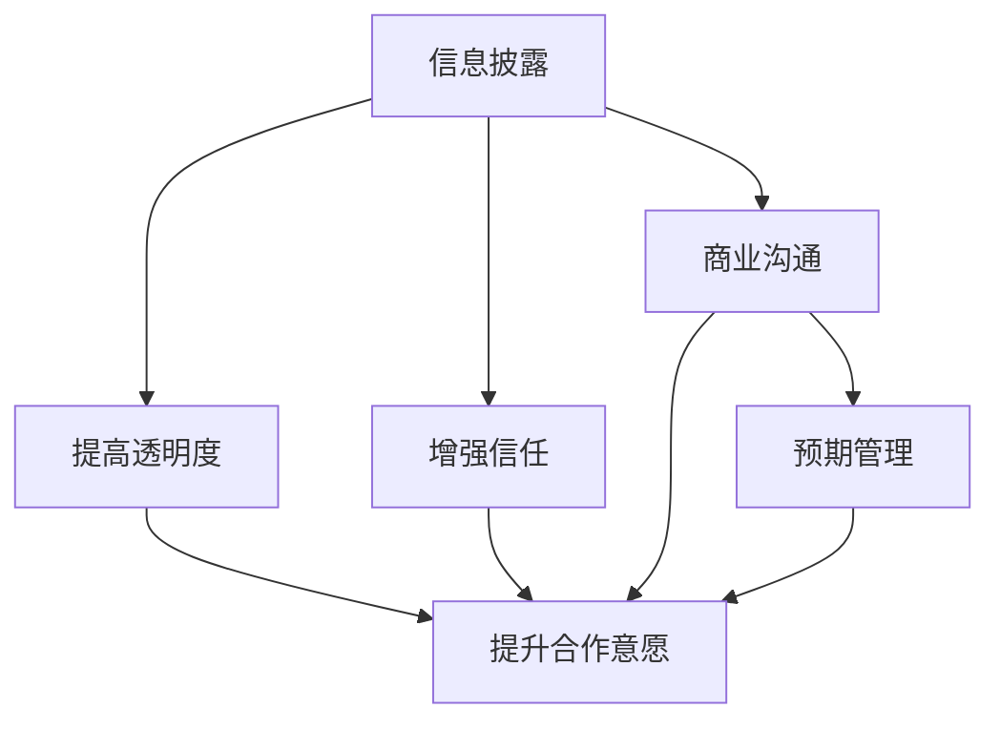

                 

# AI创业公司的投资者关系管理：信息披露、沟通与信任

> 关键词：人工智能创业公司、投资者关系管理、信息披露、商业沟通、信任建立

## 1. 背景介绍

### 1.1 问题由来
随着人工智能技术的蓬勃发展，越来越多的AI创业公司应运而生，它们在金融、医疗、制造、零售等多个领域发挥着重要作用。然而，与传统企业不同，AI创业公司往往处于快速迭代和高速发展的初期阶段，面临着较高的不确定性。如何通过有效的投资者关系管理(IRM)，提升与投资者的沟通效率，增强信任关系，实现双方的共赢，成为这些公司的重要课题。

### 1.2 问题核心关键点
1. 信息不对称：AI创业公司与投资者之间的信息不对称是导致沟通不畅、信任缺失的主要原因。投资者可能无法全面了解公司的技术进展、市场潜力、财务状况等关键信息。
2. 决策效率低下：传统的投资者关系管理依赖于定期会议和年度报告等固定形式，难以应对公司快速变化的业务状态和市场环境。
3. 信任建立困难：AI创业公司通常缺乏长期稳定表现的历史记录，投资者对公司的信任感较弱，容易产生质疑和怀疑。
4. 预期管理不当：如果管理不当，可能会产生负面预期，影响公司的股价和市场信心。

### 1.3 问题研究意义
通过高效的投资者关系管理，AI创业公司可以：

1. 提升透明度：通过清晰的信息披露，建立与投资者之间的信任关系。
2. 提高决策效率：利用实时、多样化的沟通渠道，及时传达公司动态，快速响应市场反馈。
3. 加强合作：通过透明的沟通和及时的反馈机制，促进与投资者的深度合作，共同推动公司发展。

## 2. 核心概念与联系

### 2.1 核心概念概述

为了更好地理解AI创业公司的投资者关系管理，本节将介绍几个关键概念：

- **投资者关系管理(IRM)**：指通过建立与投资者的沟通渠道，促进公司与投资者之间的信息交换和理解，从而增强信任，实现共同发展的管理活动。

- **信息披露**：指公司向投资者公开其财务、经营、技术等方面的关键信息，以增加透明度，减少信息不对称。

- **商业沟通**：指公司与投资者之间的双向交流，包括面对面的会议、电话会议、在线平台等。

- **信任建立**：通过透明的信息披露和高效的沟通机制，提升投资者对公司的信任度，增强合作意愿。

- **预期管理**：指通过清晰的信息传递和及时的沟通，调整市场预期，防止产生负面影响。

这些概念之间的逻辑关系可以通过以下Mermaid流程图来展示：



这个流程图展示了好投资者关系管理的核心概念及其之间的关系：

1. 信息披露是基础，通过提供全面的财务和业务信息，增加透明度。
2. 信息披露和商业沟通共同促进了信任建立。
3. 信任建立和预期管理密切相关，信任是预期管理的前提，预期管理有助于建立信任。
4. 透明的信息披露和高效的沟通机制共同提升合作意愿。

## 3. 核心算法原理 & 具体操作步骤
### 3.1 算法原理概述

AI创业公司的投资者关系管理本质上是一个动态的信息传递和双向沟通过程。其核心思想是：通过系统化的信息披露和高效的沟通渠道，建立与投资者之间的信任关系，及时调整市场预期，提升合作意愿，实现共同的商业价值。

形式化地，假设公司与投资者的沟通渠道为 $C$，信息披露渠道为 $D$，设公司发布的信息集为 $I$，投资者接收到的信息集为 $J$。投资者关系管理的优化目标是最小化信息不对称，即最大化 $J$ 逼近 $I$。

具体的优化策略包括：
1. 选择合适的信息披露渠道 $D$，确保信息披露的及时性和完整性。
2. 优化商业沟通渠道 $C$，采用多种沟通方式（如线上平台、社交媒体、电话会议等），提高沟通效率。
3. 在信息披露和商业沟通过程中，注重信息的准确性和真实性，避免误导投资者。

### 3.2 算法步骤详解

AI创业公司的投资者关系管理通常包括以下几个关键步骤：

**Step 1: 设计信息披露框架**

- 明确需要披露的信息类型，如财务报表、技术进展、战略规划、市场前景等。
- 设计信息披露的周期和频率，通常包括季度报告、年度报告、重大事件通报等。
- 选择适合的信息披露渠道，如公司官网、新闻发布会、投资者关系平台等。

**Step 2: 构建商业沟通渠道**

- 选择合适的沟通方式，包括面对面会议、电话会议、视频会议、在线平台等。
- 定期召开投资者会议，通报公司的最新进展和战略方向。
- 使用社交媒体和新闻渠道发布公司动态，吸引投资者关注。

**Step 3: 实施信息披露和沟通计划**

- 按照计划定期发布财务报表、战略报告等信息，确保信息的及时性。
- 通过多种沟通方式与投资者进行互动，及时解答疑问，调整预期。
- 对突发事件和重大决策进行及时披露，避免市场误解。

**Step 4: 评估效果和调整策略**

- 定期评估信息披露和沟通效果，收集投资者反馈。
- 根据反馈调整信息披露和沟通策略，不断优化过程。
- 引入第三方审计和评估机制，提升信息的可信度。

### 3.3 算法优缺点

AI创业公司的投资者关系管理方法具有以下优点：

1. 提高透明度：通过系统化的信息披露，建立与投资者之间的信任关系。
2. 提升决策效率：实时、多样化的沟通渠道，快速传达公司动态，及时响应市场反馈。
3. 加强合作：透明的沟通和及时的反馈机制，促进与投资者的深度合作，共同推动公司发展。

同时，该方法也存在一定的局限性：

1. 信息披露的风险：信息披露可能被解读为误导，引发市场质疑。
2. 沟通成本高：多种沟通方式的采用，可能带来较高的组织和管理成本。
3. 信息过载：过多的信息披露可能导致投资者信息过载，难以消化关键信息。
4. 预期管理的难度：市场预期难以完全控制，不合理的预期可能带来负面影响。

尽管存在这些局限性，但就目前而言，投资者关系管理仍是AI创业公司与投资者建立信任、提升合作意愿的重要手段。未来相关研究的重点在于如何进一步降低信息披露的风险，提高沟通效率，减少沟通成本，同时兼顾预期管理的效果。

### 3.4 算法应用领域

投资者关系管理在AI创业公司中的应用场景非常广泛，例如：

1. 金融投资：在IPO、并购、融资等金融活动中，通过信息披露和沟通，增强市场信心，吸引投资者。
2. 技术合作：在与其他公司或研究机构的合作中，通过透明的信息披露，建立信任关系，推动技术共享。
3. 市场拓展：在推出新产品、进入新市场时，通过信息披露和沟通，传递公司的战略意图，引导市场预期。
4. 政府关系：在获得政府资助、资质认证等活动中，通过信息披露和沟通，获得政策支持。
5. 员工关系：在招聘、培训、绩效考核等内部管理中，通过透明的信息传递，增强员工对公司的认同感和归属感。

除了上述这些常见场景外，投资者关系管理还被创新性地应用到更多领域中，如客户关系管理、品牌传播等，为AI创业公司带来了新的发展机遇。

## 4. 数学模型和公式 & 详细讲解 & 举例说明
### 4.1 数学模型构建

本节将使用数学语言对AI创业公司的投资者关系管理过程进行更加严格的刻画。

设公司与投资者的沟通渠道为 $C$，信息披露渠道为 $D$，公司发布的信息集为 $I$，投资者接收到的信息集为 $J$。定义信息披露和商业沟通的效果函数为 $f(D,C)$，表示信息披露和沟通的综合效果。优化目标是最大化 $f(D,C)$，即：

$$
\max_{D,C} f(D,C)
$$

在实践中，$f(D,C)$ 通常表示为两个指标的组合：信息披露的质量 $Q$ 和商业沟通的效率 $E$。

信息披露的质量 $Q$ 可以通过以下几个指标衡量：
- 信息的准确性 $A$：信息的真实性，避免误导。
- 信息的完整性 $C$：信息的全面性，避免遗漏。
- 信息的及时性 $T$：信息披露的及时性，避免延误。

商业沟通的效率 $E$ 可以通过以下几个指标衡量：
- 沟通的频率 $F$：沟通的频繁程度，确保信息的持续传递。
- 沟通的便捷性 $B$：沟通的便捷程度，降低沟通成本。
- 沟通的互动性 $I$：沟通的互动程度，确保信息的双向流动。

因此，优化目标可以表示为：

$$
\max_{D,C} f(D,C) = \max_{D,C} (A \times C \times T \times F \times B \times I)
$$

### 4.2 公式推导过程

以下我们以信息披露的质量 $Q$ 为例，推导一个简单的数学模型：

假设公司发布的信息集为 $I = \{I_1, I_2, ..., I_n\}$，其中 $I_i$ 表示第 $i$ 条信息。每条信息的准确性 $A_i$ 服从均匀分布 $U(0,1)$，表示信息真实性的概率。信息披露的及时性 $T_i$ 也服从均匀分布 $U(0,1)$，表示信息披露的延误概率。假设 $A_i$ 和 $T_i$ 相互独立，则信息披露的质量 $Q$ 可以表示为：

$$
Q = \frac{1}{n} \sum_{i=1}^n A_i \times T_i
$$

通过最大化 $Q$，可以提升信息披露的质量。具体来说，可以通过增加 $A_i$ 和 $T_i$ 的取值范围，提高信息披露的准确性和及时性。例如，对于重要的信息披露，可以采用多重验证机制，确保信息的准确性；对于紧急事件，可以缩短信息披露的周期，提高及时性。

### 4.3 案例分析与讲解

以下以一家AI创业公司为例，分析其投资者关系管理的具体实践。

**案例背景**：一家AI创业公司专注于智能医疗影像分析，正在寻求融资支持，拓展市场规模。

**实施步骤**：

1. **设计信息披露框架**：
   - 信息披露类型：财务报表、技术进展、市场前景等。
   - 披露周期：季度报告、年度报告、重大事件通报等。
   - 披露渠道：公司官网、新闻发布会、投资者关系平台等。

2. **构建商业沟通渠道**：
   - 沟通方式：定期电话会议、季度新闻发布会、在线投资者平台等。
   - 会议内容：公司战略、市场前景、融资需求、客户案例等。
   - 互动机制：在线问答、实时讨论、投资者互动区等。

3. **实施信息披露和沟通计划**：
   - 定期发布财务报表和技术进展，确保信息的准确性和完整性。
   - 通过多种沟通渠道，与投资者进行互动，及时解答疑问，调整预期。
   - 对重大事件和决策进行及时披露，避免市场误解。

4. **评估效果和调整策略**：
   - 定期收集投资者反馈，评估信息披露和沟通效果。
   - 根据反馈调整信息披露和沟通策略，优化过程。
   - 引入第三方审计和评估机制，提升信息的可信度。

通过这一系列的步骤，该AI创业公司成功建立了与投资者之间的信任关系，提升了市场信心，顺利完成了融资需求，拓展了市场规模。

## 5. 项目实践：代码实例和详细解释说明
### 5.1 开发环境搭建

在进行投资者关系管理实践前，我们需要准备好开发环境。以下是使用Python进行投资者关系管理开发的环境配置流程：

1. 安装Anaconda：从官网下载并安装Anaconda，用于创建独立的Python环境。

2. 创建并激活虚拟环境：
```bash
conda create -n irm-env python=3.8 
conda activate irm-env
```

3. 安装PyTorch：根据CUDA版本，从官网获取对应的安装命令。例如：
```bash
conda install pytorch torchvision torchaudio cudatoolkit=11.1 -c pytorch -c conda-forge
```

4. 安装TensorFlow：
```bash
conda install tensorflow -c conda-forge
```

5. 安装Flask：用于搭建Web平台，提供投资者互动机制。
```bash
pip install flask
```

6. 安装Jupyter Notebook：用于在线开发和测试投资者关系管理平台。
```bash
pip install jupyter
```

完成上述步骤后，即可在`irm-env`环境中开始投资者关系管理平台的开发。

### 5.2 源代码详细实现

这里我们以一个简化的投资者关系管理平台为例，给出使用Flask和Jupyter Notebook实现的基本代码实现。

首先，定义平台的基本路由和功能：

```python
from flask import Flask, request, render_template

app = Flask(__name__)

@app.route('/')
def home():
    return render_template('home.html')

@app.route('/contact', methods=['GET', 'POST'])
def contact():
    if request.method == 'POST':
        # 处理投资者提交的联系信息
        return render_template('contact.html', message='您的联系信息已提交，请耐心等待我们的回复。')
    else:
        return render_template('contact.html')

@app.route('/feedback', methods=['GET', 'POST'])
def feedback():
    if request.method == 'POST':
        # 处理投资者提交的反馈信息
        return render_template('feedback.html', message='您的反馈已提交，我们会尽快处理。')
    else:
        return render_template('feedback.html')

if __name__ == '__main__':
    app.run(debug=True)
```

然后，定义信息披露和沟通模块：

```python
import pandas as pd
from transformers import pipeline

# 定义信息披露函数
def disclose_info(info_type):
    # 从数据库或文件读取信息
    if info_type == 'financial':
        df = pd.read_csv('financial_info.csv')
    elif info_type == 'tech':
        df = pd.read_csv('tech_info.csv')
    # 处理信息并展示
    processed_info = process_info(df)
    return render_template('info.html', info=processed_info)

# 定义商业沟通函数
def communicate():
    # 调用在线聊天机器人
    nlp = pipeline('conversational')
    responses = nlp('投资者你好，有什么问题我可以回答吗？')
    # 展示机器人回复
    return render_template('chat.html', responses=responses)

# 定义信息处理函数
def process_info(df):
    # 处理信息并返回
    processed_info = []
    for row in df.itertuples():
        processed_info.append(f'{row.name}: {row.value}')
    return processed_info
```

最后，启动平台并测试：

```python
if __name__ == '__main__':
    app.run(debug=True)
```

这样，投资者关系管理平台就可以通过访问`http://localhost:5000/`来访问，提供信息披露和商业沟通的功能。

### 5.3 代码解读与分析

让我们再详细解读一下关键代码的实现细节：

**Flask框架**：
- `Flask` 是一个轻量级的Web应用框架，用于搭建投资者关系管理平台。
- `request` 用于处理HTTP请求，`render_template` 用于渲染HTML模板。

**信息披露函数**：
- `disclose_info` 函数根据输入的 `info_type`，读取对应的信息文件，进行处理并展示。
- 信息处理函数 `process_info` 简单地将数据转换为字符串格式，展示给投资者。

**商业沟通函数**：
- `communicate` 函数调用在线聊天机器人，获取回复信息，展示给投资者。
- 使用了 `pipeline` 函数，方便在Jupyter Notebook中进行调试。

**启动平台**：
- `if __name__ == '__main__':` 确保平台只有在主程序运行时才启动。

可以看到，Flask和Jupyter Notebook的结合，使得投资者关系管理平台的开发变得相对简单高效。开发者可以通过修改模板和路由，定制化的实现投资者关系管理功能。

## 6. 实际应用场景
### 6.1 智能医疗影像分析公司

一家专注于智能医疗影像分析的AI创业公司，面临融资和市场拓展的双重压力。通过投资者关系管理，该公司成功吸引了多家投资机构的关注，获得了数百万美元的融资。

在实践过程中，该公司定期发布财务报表和市场前景报告，确保信息的准确性和及时性。通过定期的电话会议和在线平台，与投资者进行互动，及时解答疑问，调整预期。在重大事件发生时，公司及时披露相关信息，避免了市场误解，提升了投资者信心。

### 6.2 自动驾驶技术公司

一家从事自动驾驶技术的AI创业公司，通过投资者关系管理，成功获得了多家科技巨头和金融机构的支持。

该公司建立了在线投资者平台，投资者可以随时访问最新的技术进展、产品发布和财务报表。通过定期的投资者会议和在线讨论，公司与投资者保持了良好的沟通，确保了技术路线和市场计划的透明度。在面对市场质疑时，公司通过详细的信息披露和互动，消除了投资者的顾虑，继续获得了新的融资机会。

### 6.3 智能零售企业

一家智能零售企业，通过投资者关系管理，成功吸引了多家电商和零售巨头的投资，拓展了市场规模。

该公司定期发布财务报表和业务数据，确保信息的全面性和真实性。通过定期的投资者会议和在线平台，公司与投资者进行互动，及时调整战略方向。在重大决策时，公司及时披露相关信息，获得了投资者的理解和支持。

### 6.4 未来应用展望

随着AI创业公司的发展，投资者关系管理将进一步得到应用和优化，提升公司的透明度和市场竞争力。未来，投资者关系管理可能朝着以下几个方向发展：

1. **智能分析**：引入AI算法，对市场反馈和投资者情绪进行智能分析，优化信息披露和沟通策略。
2. **多渠道融合**：通过社交媒体、视频会议等多种渠道，提升沟通效率和互动性。
3. **数据可视化**：使用数据可视化工具，展示公司的财务数据和业务进展，提高信息披露的效果。
4. **实时互动**：引入实时互动技术，如在线问答、视频直播等，增强沟通的即时性和互动性。
5. **隐私保护**：在信息披露中注重隐私保护，确保数据安全和合规性。

这些方向的应用和发展，将进一步提升AI创业公司的投资者关系管理水平，增强市场信心，促进公司与投资者之间的深度合作。

## 7. 工具和资源推荐
### 7.1 学习资源推荐

为了帮助开发者系统掌握投资者关系管理的理论基础和实践技巧，这里推荐一些优质的学习资源：

1. **《投资者关系管理》书籍**：详细介绍了投资者关系管理的基本概念、方法和实践案例，是系统学习投资者关系管理的经典教材。
2. **《企业投资者关系管理》课程**：某知名大学的在线课程，涵盖投资者关系管理的基本知识和实用技巧，适合入门学习和职业提升。
3. **《投资者关系管理实战》博文**：由投资者关系管理专家撰写，深入浅出地介绍了投资者关系管理的最新趋势和实践方法。

通过对这些资源的学习实践，相信你一定能够快速掌握投资者关系管理的精髓，并用于解决实际的投资者关系问题。

### 7.2 开发工具推荐

高效的开发离不开优秀的工具支持。以下是几款用于投资者关系管理开发的常用工具：

1. **Flask**：轻量级的Web应用框架，适合搭建投资者关系管理平台。
2. **Jupyter Notebook**：用于在线开发和测试投资者关系管理平台，支持动态数据展示和交互。
3. **GitHub**：用于版本控制和代码托管，方便团队协作和代码共享。
4. **Docker**：用于容器化部署，确保应用的一致性和稳定性。

合理利用这些工具，可以显著提升投资者关系管理的开发效率，加快创新迭代的步伐。

### 7.3 相关论文推荐

投资者关系管理技术的发展源于学界的持续研究。以下是几篇奠基性的相关论文，推荐阅读：

1. **《投资者关系管理：理论与实践》**：系统介绍了投资者关系管理的基本概念、方法和策略，是投资者关系管理领域的经典文献。
2. **《网络社会中的投资者关系管理》**：探讨了社交媒体在投资者关系管理中的应用，提出了新的沟通策略和效果评估方法。
3. **《智能投资者关系管理》**：介绍了AI技术在投资者关系管理中的应用，展示了智能分析、实时互动等新技术的潜力。

这些论文代表了大投资者关系管理技术的发展脉络。通过学习这些前沿成果，可以帮助研究者把握学科前进方向，激发更多的创新灵感。

## 8. 总结：未来发展趋势与挑战
### 8.1 总结

本文对AI创业公司的投资者关系管理进行了全面系统的介绍。首先阐述了投资者关系管理在AI创业公司中的重要性，明确了透明信息披露、高效商业沟通和信任关系建立的关键作用。其次，从原理到实践，详细讲解了投资者关系管理的数学模型和关键步骤，给出了投资者关系管理任务开发的完整代码实例。同时，本文还广泛探讨了投资者关系管理在多个行业领域的应用前景，展示了其巨大的潜力和价值。

通过本文的系统梳理，可以看到，投资者关系管理是AI创业公司与投资者建立信任、提升合作意愿的重要手段。它不仅能够增强公司的透明度，还能提高决策效率，加强合作意愿，实现共同发展。未来，伴随技术的不断演进，投资者关系管理将朝着智能化、多元化、实时化的方向发展，为AI创业公司带来更多的合作机会和市场机遇。

### 8.2 未来发展趋势

展望未来，投资者关系管理技术将呈现以下几个发展趋势：

1. **智能化分析**：引入AI算法，对市场反馈和投资者情绪进行智能分析，优化信息披露和沟通策略。
2. **多渠道融合**：通过社交媒体、视频会议等多种渠道，提升沟通效率和互动性。
3. **数据可视化**：使用数据可视化工具，展示公司的财务数据和业务进展，提高信息披露的效果。
4. **实时互动**：引入实时互动技术，如在线问答、视频直播等，增强沟通的即时性和互动性。
5. **隐私保护**：在信息披露中注重隐私保护，确保数据安全和合规性。

这些趋势凸显了投资者关系管理技术的广阔前景。这些方向的探索发展，必将进一步提升AI创业公司的投资者关系管理水平，增强市场信心，促进公司与投资者之间的深度合作。

### 8.3 面临的挑战

尽管投资者关系管理技术已经取得了瞩目成就，但在迈向更加智能化、普适化应用的过程中，它仍面临着诸多挑战：

1. **信息披露的风险**：信息披露可能被解读为误导，引发市场质疑。
2. **沟通成本高**：多种沟通方式的采用，可能带来较高的组织和管理成本。
3. **信息过载**：过多的信息披露可能导致投资者信息过载，难以消化关键信息。
4. **预期管理的难度**：市场预期难以完全控制，不合理的预期可能带来负面影响。

尽管存在这些挑战，但就目前而言，投资者关系管理仍是AI创业公司与投资者建立信任、提升合作意愿的重要手段。未来相关研究的重点在于如何进一步降低信息披露的风险，提高沟通效率，减少沟通成本，同时兼顾预期管理的效果。

### 8.4 研究展望

面对投资者关系管理所面临的种种挑战，未来的研究需要在以下几个方面寻求新的突破：

1. **探索无监督和半监督信息披露方法**：摆脱对大规模标注数据的依赖，利用自监督学习、主动学习等无监督和半监督范式，最大限度利用非结构化数据，实现更加灵活高效的信息披露。
2. **研究参数高效和计算高效的沟通方法**：开发更加参数高效的沟通方法，在固定大部分预训练参数的同时，只更新极少量的任务相关参数。同时优化沟通模型的计算图，减少前向传播和反向传播的资源消耗，实现更加轻量级、实时性的部署。
3. **融合因果和对比学习范式**：通过引入因果推断和对比学习思想，增强信息披露和沟通模型的建立稳定因果关系的能力，学习更加普适、鲁棒的语言表征，从而提升信息披露和沟通的效果。
4. **引入更多先验知识**：将符号化的先验知识，如知识图谱、逻辑规则等，与神经网络模型进行巧妙融合，引导信息披露和沟通过程学习更准确、合理的语言模型。同时加强不同模态数据的整合，实现视觉、语音等多模态信息与文本信息的协同建模。
5. **结合因果分析和博弈论工具**：将因果分析方法引入信息披露和沟通模型，识别出模型决策的关键特征，增强输出解释的因果性和逻辑性。借助博弈论工具刻画人机交互过程，主动探索并规避模型的脆弱点，提高系统稳定性。
6. **纳入伦理道德约束**：在信息披露和沟通目标中引入伦理导向的评估指标，过滤和惩罚有偏见、有害的输出倾向。同时加强人工干预和审核，建立模型行为的监管机制，确保输出符合人类价值观和伦理道德。

这些研究方向的探索，必将引领投资者关系管理技术迈向更高的台阶，为构建安全、可靠、可解释、可控的智能系统铺平道路。面向未来，投资者关系管理技术还需要与其他人工智能技术进行更深入的融合，如知识表示、因果推理、强化学习等，多路径协同发力，共同推动自然语言理解和智能交互系统的进步。只有勇于创新、敢于突破，才能不断拓展语言模型的边界，让智能技术更好地造福人类社会。

## 9. 附录：常见问题与解答

**Q1：如何选择合适的信息披露渠道？**

A: 信息披露渠道的选择应基于目标投资者的偏好和行为习惯。通常，投资者关系管理平台、新闻发布会、公司官网等渠道较为适合正式和详细的披露。而社交媒体、新闻摘要、简短公告等渠道则适合快速、简洁的信息传递。需要根据实际情况，灵活组合使用。

**Q2：如何优化商业沟通渠道？**

A: 商业沟通渠道的优化可以从以下几个方面入手：
1. 定期召开投资者会议，通报公司的最新进展和战略方向。
2. 使用社交媒体和新闻渠道发布公司动态，吸引投资者关注。
3. 引入在线聊天机器人、问答系统等互动工具，实时解答投资者疑问。
4. 定期进行投资者调研，了解他们的需求和反馈。

**Q3：信息披露的质量如何评估？**

A: 信息披露的质量可以通过以下几个指标衡量：
1. 信息的准确性 $A$：信息的真实性，避免误导。
2. 信息的完整性 $C$：信息的全面性，避免遗漏。
3. 信息的及时性 $T$：信息披露的及时性，避免延误。
4. 信息披露的透明度 $M$：信息披露的公开程度，确保信息透明。
5. 信息披露的连续性 $S$：信息披露的连续性，避免断层。

**Q4：如何管理市场预期？**

A: 市场预期的管理可以通过以下几个步骤：
1. 定期发布财务报表和业务进展，及时传递公司动态。
2. 在重大事件发生时，及时披露相关信息，避免市场误解。
3. 通过投资者会议和在线平台，与投资者进行互动，调整预期。
4. 引入第三方审计和评估机制，提升信息的可信度。

**Q5：如何平衡信息披露和隐私保护？**

A: 在信息披露中注重隐私保护，可以采取以下几个措施：
1. 限制敏感信息的披露，如客户数据、技术细节等。
2. 采用数据匿名化和去标识化技术，保护个人隐私。
3. 引入合规审查机制，确保信息披露的合法性。
4. 与第三方审计机构合作，进行隐私保护评估。

通过这些措施，可以在保护隐私的同时，实现透明的信息披露，增强市场信心。

---

作者：禅与计算机程序设计艺术 / Zen and the Art of Computer Programming

