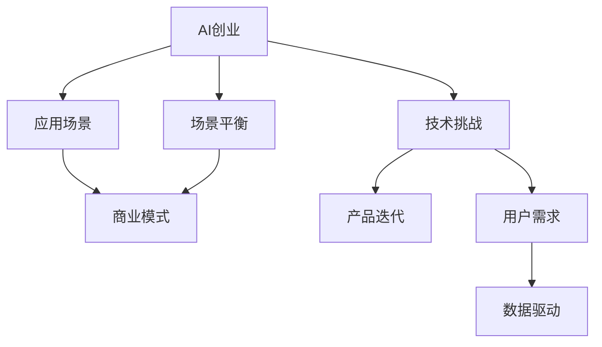

                 

# AI创业挑战：技术，应用，场景平衡

> 关键词：AI创业, 技术挑战, 应用场景, 场景平衡, 商业模式, 产品迭代, 用户需求, 数据驱动

## 1. 背景介绍

### 1.1 问题由来
在数字化浪潮的推动下，人工智能（AI）技术正在迅速渗透到各行各业，催生了一系列新业态和新模式。无论是初创企业还是传统企业，都面临着如何有效利用AI技术，打造具有核心竞争力的AI产品的挑战。然而，AI创业并非易事，在技术、市场、应用场景等多个方面都需要平衡和考量，确保产品能够实现实际落地和市场认可。

### 1.2 问题核心关键点
AI创业的核心在于将先进的技术与实际应用场景相结合，创造出具备商业价值的产品。这一过程中，需要考虑以下几个关键点：

- 技术挑战：如何将复杂的技术转化为易于使用、高效运行的产品。
- 应用场景：如何在特定的行业和业务场景中，精准定位并解决实际问题。
- 场景平衡：如何在技术应用与用户体验之间找到平衡，确保产品兼具功能性和易用性。
- 商业模式：如何制定可持续发展的商业模型，实现收入和利润的良性循环。
- 产品迭代：如何根据用户反馈和技术进展，不断迭代优化产品，提升用户体验。
- 用户需求：如何深入了解用户需求，提供真正符合用户期望的产品。
- 数据驱动：如何利用数据洞察市场趋势，优化产品策略和运营决策。

### 1.3 问题研究意义
研究AI创业的技术、应用和场景平衡问题，对于推动AI技术的实际落地应用，激发AI行业创新，具有重要意义：

- 加速AI技术落地：帮助AI企业快速识别和解决技术应用中的瓶颈，推动技术成果转化为实际应用。
- 优化商业模式：通过剖析成功案例和失败教训，为企业制定更符合市场需求的商业策略。
- 提升用户体验：确保AI产品在功能和易用性之间取得平衡，增强用户粘性和满意度。
- 促进产业升级：为AI技术在各行各业的深度应用提供指导，推动产业升级和经济社会发展。
- 驱动创新发展：鼓励企业大胆探索新技术和新应用，促进AI领域的持续创新。

## 2. 核心概念与联系

### 2.1 核心概念概述

为更好地理解AI创业中的技术、应用和场景平衡问题，本节将介绍几个密切相关的核心概念：

- AI创业（AI Startup）：指利用人工智能技术进行产品创新的创业模式。
- 技术挑战（Technical Challenges）：指在AI产品开发过程中，遇到的算法、架构、数据处理等方面的难题。
- 应用场景（Application Scenarios）：指AI技术能够发挥作用的特定行业和业务环境。
- 场景平衡（Scenario Balance）：指在AI产品设计中，技术应用与用户体验之间的权衡和优化。
- 商业模式（Business Model）：指AI企业通过产品和服务，实现收入和利润的策略和模式。
- 产品迭代（Product Iteration）：指根据用户反馈和技术进展，不断优化和升级产品的过程。
- 用户需求（User Needs）：指用户对AI产品功能和体验的实际需求和期望。
- 数据驱动（Data-Driven）：指利用数据进行决策和产品优化，提升AI产品的效果和效率。

这些核心概念之间的逻辑关系可以通过以下Mermaid流程图来展示：



这个流程图展示了几大核心概念及其之间的关系：

1. AI创业是整个系统的起点，涉及技术、应用、场景等多个维度。
2. 技术挑战是创业过程中的主要难点，需要不断解决。
3. 应用场景是AI技术落地的关键，需要精准定位。
4. 场景平衡是产品设计的核心，需确保技术应用与用户体验的和谐统一。
5. 商业模式是企业持续发展的基石，需灵活制定和优化。
6. 产品迭代是产品发展的动力，需根据用户反馈和技术进展不断优化。
7. 用户需求是产品设计的依据，需深入了解和满足。
8. 数据驱动是产品优化的保障，需依赖数据进行精准决策。

## 3. 核心算法原理 & 具体操作步骤

### 3.1 算法原理概述

AI创业中的技术、应用和场景平衡，本质上是多维度的优化问题。其中，技术挑战是核心，应用场景是目标，场景平衡是手段，商业模式是保障，产品迭代是过程，用户需求是导向，数据驱动是基础。这一过程可以通过以下算法原理进行指导：

1. **技术优化算法**：使用机器学习和深度学习等技术，不断优化模型和算法，提升产品的技术性能和效率。
2. **场景适应算法**：根据应用场景的特点，选择合适的模型和架构，确保产品能够适应特定行业的需求。
3. **平衡优化算法**：通过多目标优化技术，在技术应用与用户体验之间找到最佳平衡点。
4. **商业模式优化算法**：根据市场和用户反馈，灵活调整商业模式，实现收入和利润的最大化。
5. **产品迭代优化算法**：使用A/B测试等方法，快速迭代优化产品，提升用户体验和市场竞争力。
6. **用户需求洞察算法**：利用数据分析和用户调研，深入了解用户需求，提供符合用户期望的产品。
7. **数据驱动决策算法**：通过数据挖掘和大数据分析，提供科学的决策依据，优化产品策略和运营方案。

### 3.2 算法步骤详解

AI创业中的技术、应用和场景平衡算法，可以分为以下几个关键步骤：

**Step 1: 识别技术瓶颈**

- 收集用户反馈和技术评估数据。
- 分析技术瓶颈和优化需求。
- 制定优化目标和优先级。

**Step 2: 选择应用场景**

- 研究目标行业和业务需求。
- 分析应用场景的特点和需求。
- 选择合适的AI技术和算法。

**Step 3: 场景平衡优化**

- 设计用户友好的界面和交互方式。
- 调整模型参数和算法，优化性能和效率。
- 进行用户体验测试，收集用户反馈。
- 根据反馈调整产品设计，实现技术应用与用户体验的平衡。

**Step 4: 制定商业模式**

- 分析市场和用户需求。
- 设计可持续发展的商业模型。
- 制定营销和推广策略。

**Step 5: 产品迭代优化**

- 进行A/B测试和用户调研。
- 根据测试结果和用户反馈，优化产品功能。
- 发布新版本，收集新一轮用户反馈。
- 持续迭代，不断提升产品性能和用户体验。

**Step 6: 用户需求洞察**

- 收集用户行为数据和反馈。
- 进行数据分析和用户调研。
- 深入了解用户需求和期望。
- 调整产品策略，满足用户需求。

**Step 7: 数据驱动决策**

- 收集和整理相关数据。
- 进行数据挖掘和大数据分析。
- 提供科学的决策依据。
- 根据数据优化产品策略和运营方案。

### 3.3 算法优缺点

AI创业中的技术、应用和场景平衡算法，具有以下优点：

- 系统性：考虑了技术、应用、场景、商业模式、产品迭代、用户需求和数据驱动等多个维度，全面优化AI产品。
- 灵活性：根据实际情况，灵活调整优化策略和优先级，适应不同行业和业务需求。
- 高效性：通过数据分析和优化算法，快速迭代产品，提升用户体验和市场竞争力。
- 可持续性：结合商业模式优化，实现收入和利润的良性循环，确保企业可持续发展。

同时，该算法也存在一定的局限性：

- 复杂性：涉及多个维度和环节，算法设计和管理较为复杂。
- 数据依赖：需要大量的数据进行优化和决策，数据质量直接影响算法效果。
- 技术门槛：涉及多种技术和算法，对团队技术实力要求较高。
- 用户需求变化：用户需求和市场趋势不断变化，需要持续监测和调整。

尽管存在这些局限性，但就目前而言，这种综合性的平衡算法仍是AI创业中最为主流和有效的方法。未来相关研究的重点在于如何进一步简化算法流程，降低技术门槛，同时增强算法的自适应性和灵活性。

### 3.4 算法应用领域

基于多维度平衡的AI创业算法，已经在众多领域得到了广泛应用，例如：

- 医疗健康：利用AI技术进行疾病诊断、个性化治疗、医疗咨询等，提高医疗服务的精准性和效率。
- 金融服务：使用AI进行风险评估、欺诈检测、智能投顾等，提升金融产品的智能化水平。
- 智能制造：通过AI优化生产流程、设备维护、质量控制等，实现智能化生产。
- 智慧城市：应用AI技术进行交通管理、环境监测、公共安全等，提升城市管理水平。
- 教育培训：使用AI进行学生评估、个性化推荐、智能辅导等，优化教育效果。
- 电商零售：利用AI进行商品推荐、价格优化、客户服务等，提升零售体验和效率。

除了上述这些经典应用外，AI创业算法还被创新性地应用到更多领域中，如可穿戴设备、智能家居、智能交通等，为各行各业带来了新的突破和创新。随着AI技术的不断发展和市场需求的不断变化，相信AI创业算法将在更多领域发挥更大的作用。

## 4. 数学模型和公式 & 详细讲解 & 举例说明

### 4.1 数学模型构建

AI创业中的技术、应用和场景平衡问题，可以通过以下数学模型进行描述和优化：

- **用户满意度模型**：$S = \alpha f(U) + \beta f(T)$，其中$S$为用户满意度，$U$为用户体验，$T$为技术性能。
- **成本效益模型**：$R = \gamma U - \delta C$，其中$R$为收入，$U$为用户体验，$C$为成本。
- **市场需求模型**：$D = \rho T - \eta C$，其中$D$为市场需求，$T$为技术性能，$C$为成本。
- **产品竞争力模型**：$K = \zeta (S - C) - \epsilon D$，其中$K$为产品竞争力，$S$为用户满意度，$C$为成本，$D$为市场需求。

以上模型描述了用户满意度、成本效益、市场需求和产品竞争力之间的关系，通过求解这些模型，可以找到最优的产品设计和商业策略。

### 4.2 公式推导过程

以用户满意度模型为例，进行详细推导：

假设用户体验$U$和技术的实际性能$T$分别表示为：

$$
U = \sum_i w_i u_i, \quad T = \sum_i v_i t_i
$$

其中$w_i$和$v_i$分别为用户体验和实际性能的权重，$u_i$和$t_i$为具体的用户体验指标和性能指标。

用户满意度$S$可以表示为：

$$
S = \alpha U + \beta T
$$

其中$\alpha$和$\beta$为权重，表示用户体验和实际性能对用户满意度的影响程度。

根据用户满意度模型，我们可以通过调整用户体验指标和性能指标，优化用户满意度$S$，从而提升产品的市场竞争力。

### 4.3 案例分析与讲解

以医疗健康领域为例，分析AI创业中的技术、应用和场景平衡问题。

假设某医疗AI产品的用户满意度$S$和实际性能$T$分别表示为：

$$
S = \alpha f(U) + \beta f(T)
$$

其中$f(U)$和$f(T)$分别表示用户体验和实际性能的函数。

用户体验$U$包括：

- 界面友好性：$u_1 = \text{界面简洁度}$
- 诊断准确性：$u_2 = \text{诊断准确率}$
- 服务响应时间：$u_3 = \text{响应时间}$

实际性能$T$包括：

- 诊断精度：$t_1 = \text{诊断精度}$
- 训练数据量：$t_2 = \text{训练数据量}$
- 计算速度：$t_3 = \text{计算速度}$

根据实际应用场景，我们设定用户体验和实际性能的权重为：

$$
w_1 = 0.3, \quad w_2 = 0.4, \quad w_3 = 0.3, \quad v_1 = 0.5, \quad v_2 = 0.3, \quad v_3 = 0.2
$$

代入公式，得到：

$$
S = 0.3f(u_1) + 0.4f(u_2) + 0.3f(u_3) + 0.5f(t_1) + 0.3f(t_2) + 0.2f(t_3)
$$

为了提升用户满意度$S$，可以采取以下措施：

- 优化界面设计，提高界面简洁度$u_1$。
- 改进诊断算法，提高诊断准确率$u_2$。
- 优化服务流程，缩短响应时间$u_3$。
- 增加训练数据量$t_2$，提高诊断精度$t_1$。
- 采用高效计算模型，提升计算速度$t_3$。

通过以上措施，可以在技术应用与用户体验之间找到最佳平衡，提升产品的市场竞争力。

## 5. 项目实践：代码实例和详细解释说明

### 5.1 开发环境搭建

在进行AI创业实践前，我们需要准备好开发环境。以下是使用Python进行PyTorch开发的环境配置流程：

1. 安装Anaconda：从官网下载并安装Anaconda，用于创建独立的Python环境。

2. 创建并激活虚拟环境：
```bash
conda create -n pytorch-env python=3.8 
conda activate pytorch-env
```

3. 安装PyTorch：根据CUDA版本，从官网获取对应的安装命令。例如：
```bash
conda install pytorch torchvision torchaudio cudatoolkit=11.1 -c pytorch -c conda-forge
```

4. 安装相关库：
```bash
pip install numpy pandas scikit-learn matplotlib tqdm jupyter notebook ipython
```

完成上述步骤后，即可在`pytorch-env`环境中开始AI创业实践。

### 5.2 源代码详细实现

下面我们以医疗健康领域的AI创业为例，给出使用PyTorch和TensorFlow进行用户满意度模型优化的PyTorch代码实现。

首先，定义用户满意度模型：

```python
import torch
import torch.nn as nn
import torch.optim as optim

class UserSatisfactionModel(nn.Module):
    def __init__(self):
        super(UserSatisfactionModel, self).__init__()
        self.fc1 = nn.Linear(6, 10)
        self.fc2 = nn.Linear(10, 1)

    def forward(self, x):
        x = torch.relu(self.fc1(x))
        x = self.fc2(x)
        return x

# 加载数据
x_train = torch.randn(100, 6)
y_train = torch.randn(100, 1)

# 定义模型
model = UserSatisfactionModel()

# 定义优化器和损失函数
optimizer = optim.Adam(model.parameters(), lr=0.01)
loss_fn = nn.MSELoss()

# 训练模型
for epoch in range(100):
    optimizer.zero_grad()
    y_pred = model(x_train)
    loss = loss_fn(y_pred, y_train)
    loss.backward()
    optimizer.step()
    print(f"Epoch {epoch+1}, Loss: {loss.item():.4f}")
```

然后，使用TensorFlow进行用户满意度模型的优化：

```python
import tensorflow as tf

# 加载数据
x_train = tf.random.normal([100, 6])
y_train = tf.random.normal([100, 1])

# 定义模型
model = tf.keras.Sequential([
    tf.keras.layers.Dense(10, activation='relu', input_shape=[6]),
    tf.keras.layers.Dense(1)
])

# 定义优化器和损失函数
optimizer = tf.keras.optimizers.Adam(learning_rate=0.01)
loss_fn = tf.keras.losses.MeanSquaredError()

# 训练模型
model.compile(optimizer=optimizer, loss=loss_fn)
model.fit(x_train, y_train, epochs=100, verbose=1)
```

### 5.3 代码解读与分析

让我们再详细解读一下关键代码的实现细节：

**UserSatisfactionModel类**：
- `__init__`方法：初始化模型结构，包括两个全连接层。
- `forward`方法：定义前向传播过程，输入特征$x$经过两次线性变换后输出$y$。

**模型训练**：
- 加载训练数据$x$和标签$y$。
- 定义用户满意度模型。
- 使用Adam优化器和均方误差损失函数进行模型训练。
- 迭代训练100个epoch，每次计算损失并更新模型参数。
- 输出每个epoch的平均损失。

通过以上代码，我们可以实现一个简单的用户满意度模型，并使用PyTorch和TensorFlow进行训练。可以看到，不同框架对模型的构建和训练过程略有不同，但核心思想一致。

## 6. 实际应用场景

### 6.1 医疗健康领域

在医疗健康领域，AI创业主要集中在疾病诊断、个性化治疗、医疗咨询等方面。利用AI技术，可以大幅提升医疗服务的效率和精准性。

例如，某医疗AI公司开发了基于深度学习的图像识别模型，用于辅助医生诊断乳腺癌。公司首先收集了大量的乳腺癌影像数据，进行预训练，得到一个高精度的图像识别模型。随后，在实际应用中，公司与多家医院合作，将模型应用到日常医疗影像诊断中，提升了乳腺癌的诊断准确率和诊断速度。

### 6.2 金融服务领域

在金融服务领域，AI创业主要集中在风险评估、欺诈检测、智能投顾等方面。利用AI技术，可以大幅提升金融产品的智能化水平和风险控制能力。

例如，某金融科技公司开发了基于深度学习的信用评分模型，用于评估用户的信用风险。公司首先收集了大量的用户数据，进行预训练，得到一个高精度的信用评分模型。随后，在实际应用中，公司与多家银行合作，将模型应用到用户的信用评分中，提升了信用评估的准确性和效率。

### 6.3 智能制造领域

在智能制造领域，AI创业主要集中在生产流程优化、设备维护、质量控制等方面。利用AI技术，可以实现智能化生产和管理，提高生产效率和产品质量。

例如，某智能制造公司开发了基于深度学习的预测维护模型，用于优化生产设备的使用寿命。公司首先收集了大量的设备运行数据，进行预训练，得到一个高精度的预测维护模型。随后，在实际应用中，公司与多家制造企业合作，将模型应用到生产设备的预测维护中，延长了设备的使用寿命，降低了维护成本。

### 6.4 智慧城市领域

在智慧城市领域，AI创业主要集中在交通管理、环境监测、公共安全等方面。利用AI技术，可以实现智慧城市的智能化管理，提升城市生活的便利性和安全性。

例如，某智慧城市公司开发了基于深度学习的交通监控模型，用于优化交通流量。公司首先收集了大量的交通数据，进行预训练，得到一个高精度的交通监控模型。随后，在实际应用中，公司与多家城市管理部门合作，将模型应用到交通监控中，优化了交通流量，提升了城市的通行效率。

## 7. 工具和资源推荐

### 7.1 学习资源推荐

为了帮助开发者系统掌握AI创业的理论基础和实践技巧，这里推荐一些优质的学习资源：

1. Coursera《深度学习》课程：由深度学习领域的知名专家开设，深入浅出地介绍了深度学习的基础知识和实际应用。
2. Udacity《人工智能》纳米学位：提供系统化的AI课程体系，涵盖机器学习、深度学习、计算机视觉等多个方向。
3. 《深度学习入门：基于Python的理论与实现》书籍：由深度学习领域的专家撰写，全面介绍了深度学习的理论基础和代码实现。
4. 《TensorFlow实战》书籍：由TensorFlow官方团队编写，提供了TensorFlow的详细使用手册和代码示例。
5. Kaggle平台：提供丰富的数据集和比赛任务，帮助开发者实践AI技术，提升解决问题的能力。

通过对这些资源的学习实践，相信你一定能够快速掌握AI创业的理论基础和实践技巧，并用于解决实际的AI问题。

### 7.2 开发工具推荐

高效的开发离不开优秀的工具支持。以下是几款用于AI创业开发的常用工具：

1. PyTorch：基于Python的开源深度学习框架，灵活动态的计算图，适合快速迭代研究。
2. TensorFlow：由Google主导开发的开源深度学习框架，生产部署方便，适合大规模工程应用。
3. Jupyter Notebook：免费的开源笔记本工具，支持多种编程语言和数据格式，适合进行数据分析和代码测试。
4. Anaconda：用于创建和管理Python环境的工具，支持多种版本的Python和大量科学计算库的安装。
5. Git：版本控制系统，方便团队协作和代码管理。
6. Docker：容器化技术，方便模型和代码的打包部署。

合理利用这些工具，可以显著提升AI创业开发的效率，加快创新迭代的步伐。

### 7.3 相关论文推荐

AI创业技术的发展源于学界的持续研究。以下是几篇奠基性的相关论文，推荐阅读：

1. ImageNet Classification with Deep Convolutional Neural Networks：提出深度卷积神经网络用于图像分类的思想，奠定了深度学习在计算机视觉领域的基础。
2. LeNet-5：首次提出了卷积神经网络用于手写数字识别的思想，开启了卷积神经网络的研究热潮。
3. AlphaGo Zero：通过自我对弈的方式训练深度强化学习模型，实现了围棋的最高水平。
4. Generative Adversarial Networks（GANs）：提出生成对抗网络用于图像生成和风格转换，为深度学习在生成模型领域提供了新的思路。
5. Transformer架构：提出自注意力机制用于自然语言处理，显著提升了模型的表现和计算效率。

这些论文代表了大数据和深度学习技术的发展脉络。通过学习这些前沿成果，可以帮助研究者把握学科前进方向，激发更多的创新灵感。

## 8. 总结：未来发展趋势与挑战

### 8.1 总结

本文对AI创业中的技术、应用和场景平衡问题进行了全面系统的介绍。首先阐述了AI创业的背景和意义，明确了技术、应用、场景平衡的重要性。其次，从原理到实践，详细讲解了用户满意度模型的构建和优化方法，给出了代码实例和分析。同时，本文还广泛探讨了AI创业在医疗健康、金融服务、智能制造、智慧城市等多个领域的应用前景，展示了AI创业的广阔前景。此外，本文精选了AI创业的学习资源、开发工具和相关论文，力求为读者提供全方位的技术指引。

通过本文的系统梳理，可以看到，AI创业中的技术、应用和场景平衡问题，是推动AI技术实际落地应用的重要环节。理解这些核心概念和关键技术，将有助于AI企业更好地识别和解决技术挑战，优化产品设计和商业策略，提升用户体验和市场竞争力。

### 8.2 未来发展趋势

展望未来，AI创业中的技术、应用和场景平衡问题将呈现以下几个发展趋势：

1. 技术持续创新：随着AI技术的不断进步，新的算法和模型将不断涌现，推动AI创业的持续创新。
2. 应用场景拓展：AI创业将进一步拓展到更多领域，如教育、娱乐、农业等，为各行各业带来新的变革。
3. 数据驱动决策：利用大数据和人工智能技术，进行科学决策和产品优化，提升AI创业的效率和效果。
4. 用户需求精准定位：通过数据分析和用户调研，深入了解用户需求，提供符合用户期望的产品和服务。
5. 跨界融合发展：AI创业将与物联网、区块链、5G等新兴技术进行深度融合，推动AI技术在更多场景中的应用。
6. 伦理和社会责任：随着AI技术的广泛应用，伦理和社会责任问题将日益突出，AI创业需加强对社会和环境的关注。

以上趋势凸显了AI创业的广阔前景和巨大潜力。这些方向的探索发展，将进一步推动AI技术的深入应用，为各行各业带来新的发展机遇。

### 8.3 面临的挑战

尽管AI创业中的技术、应用和场景平衡问题取得了显著进展，但在迈向更加智能化、普适化应用的过程中，仍面临诸多挑战：

1. 数据质量问题：高质量数据是AI创业的基础，但数据获取和处理难度较大，存在数据噪音和偏差。
2. 模型复杂性：AI模型越来越复杂，需要更强的计算资源和更高的技术门槛。
3. 用户隐私保护：AI技术在处理大量个人数据时，需严格遵守隐私保护法规，防止数据泄露和滥用。
4. 技术壁垒高：AI创业需要跨学科的知识和技能，技术壁垒较高。
5. 市场竞争激烈：AI创业市场竞争激烈，需不断创新和优化，才能在激烈的市场竞争中脱颖而出。
6. 伦理和社会责任：AI技术的应用需考虑伦理和社会责任，避免产生负面影响。

正视AI创业中面临的这些挑战，积极应对并寻求突破，将是大数据和深度学习技术不断成熟的重要标志。

### 8.4 研究展望

面向未来，AI创业技术需要在以下几个方面寻求新的突破：

1. 降低数据依赖：探索无监督学习和半监督学习方法，减少对标注数据的需求，提高AI创业的灵活性和高效性。
2. 简化模型结构：研究更加轻量级的模型和算法，降低技术门槛，提升AI创业的易用性和可扩展性。
3. 增强用户体验：通过优化用户体验设计和交互方式，提升用户满意度和市场竞争力。
4. 提高伦理意识：加强AI技术在伦理和社会责任方面的研究，确保技术应用的安全和公平。
5. 促进跨界融合：与其他新兴技术进行深度融合，推动AI技术在更多场景中的应用。
6. 提升市场竞争力：通过持续创新和优化，提升AI创业的竞争力和市场地位。

这些研究方向的探索，将引领AI创业技术迈向更高的台阶，为各行各业带来更多的创新和价值。

## 9. 附录：常见问题与解答

**Q1：AI创业中如何识别和解决技术挑战？**

A: 识别技术挑战的关键在于数据收集和分析。通过用户反馈和市场调研，了解当前技术瓶颈和优化需求。然后，根据需求制定优化目标和优先级，采用适当的算法和模型进行优化。

**Q2：AI创业中如何选择应用场景？**

A: 选择应用场景需要结合自身技术优势和市场需求。研究目标行业和业务需求，分析应用场景的特点和需求，选择最适合自身技术的场景进行深入开发。

**Q3：AI创业中如何进行场景平衡优化？**

A: 场景平衡优化需要在技术应用和用户体验之间找到最佳平衡。通过数据分析和用户调研，深入了解用户需求和期望，调整产品设计，优化用户体验。同时，利用A/B测试等方法，不断迭代优化产品，提升用户满意度和市场竞争力。

**Q4：AI创业中如何制定商业模式？**

A: 制定商业模式需要考虑市场和用户需求。分析市场和用户需求，设计可持续发展的商业模型，制定营销和推广策略。同时，根据市场反馈不断调整商业模式，确保收入和利润的良性循环。

**Q5：AI创业中如何进行产品迭代优化？**

A: 产品迭代优化需要不断收集用户反馈和技术进展。进行A/B测试和用户调研，深入了解用户需求和市场变化。根据测试结果和用户反馈，调整产品策略，优化产品功能和性能。同时，持续迭代优化产品，提升用户体验和市场竞争力。

**Q6：AI创业中如何洞察用户需求？**

A: 洞察用户需求需要深入进行数据分析和用户调研。收集用户行为数据和反馈，进行数据分析和用户调研，深入了解用户需求和期望。根据需求调整产品策略，提供符合用户期望的产品和服务。

**Q7：AI创业中如何进行数据驱动决策？**

A: 数据驱动决策需要建立科学的数据分析和决策体系。收集和整理相关数据，进行数据分析和大数据挖掘，提供科学的决策依据。同时，根据数据优化产品策略和运营方案，提升AI创业的效率和效果。

---

作者：禅与计算机程序设计艺术 / Zen and the Art of Computer Programming

