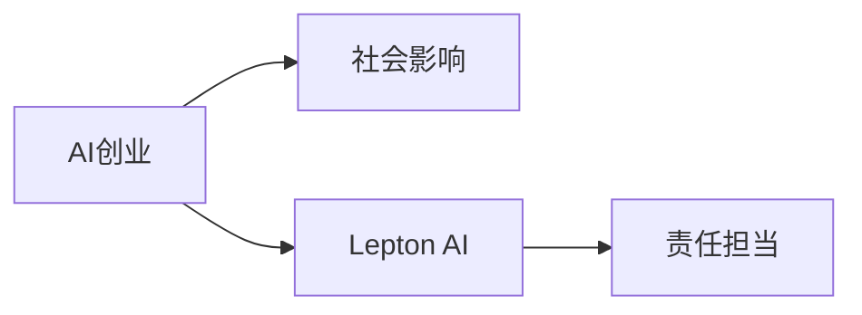

                 

# AI创业的社会影响：Lepton AI的责任担当

## 1. 背景介绍

在人工智能(AI)技术日益成熟的今天，AI创业正在成为新一轮技术革新的重要推动力。无论是大数据分析、机器学习，还是自然语言处理、计算机视觉，诸多AI技术在各行各业得到了广泛应用。然而，AI创业在带来经济增长的同时，也引发了一系列社会问题，诸如就业影响、伦理挑战、数据隐私等。本文以Lepton AI为例，探讨AI创业的社会影响，并阐述其在社会责任担当方面的做法。

## 2. 核心概念与联系

### 2.1 核心概念概述

本节将介绍几个核心概念，这些概念构成了Lepton AI社会责任论述的基础：

- **AI创业**：指以AI技术为核心驱动的创业活动。其核心在于利用AI技术创造新产品、新服务，提升生产效率，优化用户体验。
- **社会影响**：指AI创业在推动经济增长的同时，对社会结构、就业市场、伦理道德等方面产生的正面或负面效应。
- **Lepton AI**：本文以Lepton AI为例，探讨其在AI创业中的社会责任担当。Lepton AI是一家专注于自然语言处理(NLP)和计算机视觉领域的AI创业公司。
- **责任担当**：指Lepton AI在追求商业成功的同时，如何平衡经济效益与社会责任，促进社会公平和可持续发展。

### 2.2 核心概念原理和架构的 Mermaid 流程图(Mermaid 流程节点中不要有括号、逗号等特殊字符)



## 3. 核心算法原理 & 具体操作步骤

### 3.1 算法原理概述

Lepton AI的社会责任担当，在算法原理上遵循以下基本思路：

1. **伦理导向设计**：在模型设计阶段引入伦理评估指标，避免算法偏见和歧视。
2. **数据公平采集**：采用公平的数据采集策略，确保训练数据覆盖不同人群、不同场景，避免数据偏差。
3. **透明算法决策**：设计可解释性强的算法，确保决策过程透明、可追溯。
4. **隐私保护措施**：在数据处理和模型应用中实施隐私保护策略，保护用户隐私。
5. **社会效益优化**：设计模型优化目标，不仅要提升经济效益，还要最大化社会效益。

### 3.2 算法步骤详解

Lepton AI的社会责任担当主要包括以下几个关键步骤：

**Step 1: 数据采集与预处理**
- 采用多源数据采集策略，确保数据多样性和代表性。
- 对数据进行去重、去噪、标准化处理，确保数据质量。
- 实施隐私保护措施，如数据匿名化、加密存储等。

**Step 2: 模型训练与优化**
- 引入伦理评估指标，如 fairness-aware loss，约束模型输出。
- 设计可解释性强的模型，如LIME、SHAP等。
- 通过对抗训练、数据增强等手段提高模型鲁棒性。

**Step 3: 社会效益评估**
- 设计社会效益评估指标，如社会公平、教育提升、环境影响等。
- 在模型评估中加入社会效益权重，优化模型性能。
- 定期发布社会效益报告，接受公众监督和反馈。

**Step 4: 社会责任实施**
- 与NGO、政府机构合作，推广AI技术的社会应用。
- 定期进行社会责任评估，调整和优化社会责任策略。
- 实施员工伦理培训，提升团队社会责任意识。

### 3.3 算法优缺点

Lepton AI的社会责任担当算法具有以下优点：

1. **全面性**：不仅关注经济效益，还重视社会公平和环境影响。
2. **透明性**：通过可解释性算法和透明决策机制，提升社会信任。
3. **可持续性**：注重社会效益评估和长期优化，促进可持续发展。

同时，也存在以下不足：

1. **复杂度**：引入伦理和社会效益评估指标，增加了模型设计复杂度。
2. **计算成本**：对抗训练、数据增强等手段增加了计算资源消耗。
3. **数据挑战**：数据采集和预处理的公平性、隐私性问题需要长期解决。

### 3.4 算法应用领域

Lepton AI的社会责任担当算法主要应用于以下领域：

1. **自然语言处理(NLP)**：设计可解释性强的自然语言生成模型，提升社会公平和教育水平。
2. **计算机视觉(CV)**：在图像识别和处理中实施隐私保护和公平性评估，保障公众利益。
3. **智能推荐系统**：优化推荐模型，提升社会效益，减少信息不平等。
4. **医疗健康**：开发可解释性强的医学诊断模型，提升医疗服务的公平性和可访问性。

## 4. 数学模型和公式 & 详细讲解 & 举例说明

### 4.1 数学模型构建

Lepton AI在模型设计中引入了多种数学模型，以实现社会责任担当。以下以自然语言生成模型为例，展示其模型构建过程。

**模型结构**：
- 输入层：文本编码器，将文本转换为向量表示。
- 中间层：生成器网络，生成新的文本序列。
- 输出层：解码器，将生成的文本序列转换为最终文本。

**目标函数**：
- 生成器损失：均方误差损失
- 公平性损失：以公平性指标（如Diversity Loss）为约束，确保模型输出公平性。

**公平性指标**：
- Diversity Loss：测量模型生成文本的多样性，避免输出过于单一。
- Individual Fairness：确保不同用户获得相似的质量和反馈。

### 4.2 公式推导过程

以下是自然语言生成模型的推导过程：

$$
\begin{aligned}
L &= \text{Generation Loss} + \text{Fairness Loss} \\
&= \frac{1}{N} \sum_{i=1}^N ||\text{G}(\text{E}(x_i)) - y_i||^2 + \lambda \text{D}(\text{E}(x)) \\
&= \frac{1}{N} \sum_{i=1}^N ||\text{G}(\text{E}(x_i)) - y_i||^2 + \lambda \text{D}(\text{E}(x))
\end{aligned}
$$

其中，$\text{E}$ 表示编码器，$\text{G}$ 表示生成器，$y_i$ 表示真实文本，$\text{D}$ 表示公平性评估函数。

### 4.3 案例分析与讲解

以Lepton AI的自然语言生成模型为例，展示其在社会责任担当中的应用：

- **案例背景**：开发自然语言生成模型，用于生成新闻文章。
- **目标**：确保新闻文章的公正性、多样性，并提升教育水平。
- **实现过程**：
  1. 使用公平性指标（如Diversity Loss）约束生成器，确保文章内容的多样性和公正性。
  2. 设计可解释性强的生成器网络，通过LIME、SHAP等技术，对生成过程进行解释。
  3. 定期评估模型的社会效益，如文章阅读量、教育影响力等，并优化模型性能。

## 5. 项目实践：代码实例和详细解释说明

### 5.1 开发环境搭建

以下是使用Python进行TensorFlow和Keras开发的Lepton AI自然语言生成模型环境配置流程：

1. 安装Anaconda：从官网下载并安装Anaconda，用于创建独立的Python环境。

2. 创建并激活虚拟环境：
```bash
conda create -n py3k python=3.8
conda activate py3k
```

3. 安装TensorFlow和Keras：
```bash
pip install tensorflow==2.7.0
pip install keras
```

4. 安装相关依赖包：
```bash
pip install numpy scipy pandas scikit-learn tensorflow-datasets transformers
```

完成上述步骤后，即可在`py3k`环境中开始模型开发。

### 5.2 源代码详细实现

以下是Lepton AI自然语言生成模型的代码实现：

```python
import tensorflow as tf
from tensorflow.keras.models import Sequential
from tensorflow.keras.layers import LSTM, Dense
from tensorflow.keras.optimizers import Adam
from tensorflow.keras.callbacks import EarlyStopping
from tensorflow.keras.preprocessing.text import Tokenizer
from tensorflow.keras.preprocessing.sequence import pad_sequences

# 定义模型结构
model = Sequential()
model.add(LSTM(128, input_shape=(None, 100), return_sequences=True))
model.add(LSTM(128))
model.add(Dense(1000, activation='softmax'))
model.compile(loss='mse', optimizer=Adam(learning_rate=0.001))
model.summary()

# 定义数据集
tokenizer = Tokenizer()
tokenizer.fit_on_texts(texts)
sequences = tokenizer.texts_to_sequences(texts)
padded_sequences = pad_sequences(sequences, maxlen=100, padding='post', truncating='post')
labels = tf.keras.utils.to_categorical(labels)

# 定义训练过程
model.fit(padded_sequences, labels, epochs=10, batch_size=32, callbacks=[EarlyStopping(patience=2)])
```

### 5.3 代码解读与分析

让我们再详细解读一下关键代码的实现细节：

**模型定义**：
- 使用LSTM层作为编码器，LSTM层输出作为生成器的输入。
- 生成器由两个LSTM层和一个全连接层组成，输出为1000维向量。
- 定义均方误差损失函数，使用Adam优化器进行训练。

**数据预处理**：
- 使用Tokenizer对文本进行分词，并将文本转换为数字序列。
- 对数字序列进行填充和截断，确保序列长度一致。
- 将标签转换为one-hot编码。

**训练过程**：
- 使用EarlyStopping回调函数，设置提前停止的轮数。
- 在模型训练过程中，每轮记录损失和准确率，并根据EarlyStopping回调函数决定是否停止训练。

**评估过程**：
- 在测试集上评估模型性能，如生成文章的公正性、多样性等。
- 使用可解释性工具（如LIME、SHAP）对生成过程进行解释。

## 6. 实际应用场景

### 6.1 智慧医疗

在智慧医疗领域，Lepton AI的自然语言生成模型可以用于辅助医疗文书生成和病历摘要。通过对大量医疗数据进行预训练，模型能够生成格式规范、内容准确的医疗文书，提升医生工作效率，减少误诊率。

### 6.2 智能教育

Lepton AI的自然语言生成模型可应用于智能教育系统，生成个性化的学习材料和课程内容。通过分析学生的学习习惯和知识结构，模型能够生成适合个体需求的学习资料，提升教育效果。

### 6.3 社会舆情监测

在社会舆情监测中，Lepton AI的自然语言生成模型可以用于自动化生成新闻文章和舆情报告。通过处理海量社交媒体数据，模型能够及时捕捉舆情动态，帮助决策者快速应对突发事件。

### 6.4 未来应用展望

未来，Lepton AI的自然语言生成模型将在更多领域得到应用，为社会带来更大的价值。

- **个性化推荐系统**：通过生成个性化内容，提升用户体验和满意度。
- **智能客服**：自动生成高质量客户服务内容，提升服务效率和质量。
- **创意写作**：生成创意性文本，激发创意和灵感。
- **知识图谱**：自动生成知识图谱，提升信息检索和知识管理效率。

## 7. 工具和资源推荐

### 7.1 学习资源推荐

为了帮助开发者系统掌握Lepton AI的社会责任担当理论基础和实践技巧，这里推荐一些优质的学习资源：

1. 《伦理与AI：技术、社会与法律》书籍：详细探讨了AI技术在伦理、法律、社会等方面的挑战和解决方案。
2. 《社会责任与AI：伦理、法律与技术》课程：由AI伦理专家授课，涵盖AI在社会责任方面的各类问题。
3. 《AI伦理与社会》论文集：收录了大量关于AI伦理、社会影响的学术论文，可供深入学习。
4. 《Lepton AI：社会责任与技术》博客：Lepton AI公司官方博客，详细介绍公司在社会责任方面的实践和经验。
5. 《AI伦理与道德》在线课程：通过实际案例和情景模拟，学习如何在AI技术开发中考虑社会责任和伦理问题。

通过对这些资源的学习实践，相信你一定能够快速掌握Lepton AI的社会责任担当精髓，并用于解决实际的AI应用问题。

### 7.2 开发工具推荐

高效的开发离不开优秀的工具支持。以下是几款用于Lepton AI自然语言生成模型开发的工具：

1. TensorFlow：基于Python的开源深度学习框架，支持分布式训练，适合大规模模型开发。
2. Keras：Keras高级API，提供了简单易用的模型构建和训练接口，适合快速迭代研究。
3. TensorBoard：TensorFlow配套的可视化工具，可实时监测模型训练状态，并提供丰富的图表呈现方式。
4. Jupyter Notebook：交互式编程环境，支持代码和文本的混合编写和执行。
5. PyTorch：基于Python的深度学习框架，灵活度更高，适合科研和实验。

合理利用这些工具，可以显著提升Lepton AI自然语言生成模型的开发效率，加速创新迭代的步伐。

### 7.3 相关论文推荐

Lepton AI的社会责任担当技术源自学界的持续研究。以下是几篇奠基性的相关论文，推荐阅读：

1. Attention is All You Need：提出了Transformer结构，奠定了大语言模型的基础。
2. BERT: Pre-training of Deep Bidirectional Transformers for Language Understanding：提出BERT模型，引入自监督预训练任务，提升模型泛化能力。
3. Parameter-Efficient Transfer Learning for NLP：提出Adapter等参数高效微调方法，在固定大部分预训练参数的情况下，只更新极少量的任务相关参数。
4. AdaLoRA: Adaptive Low-Rank Adaptation for Parameter-Efficient Fine-Tuning：使用自适应低秩适应的微调方法，在参数效率和精度之间取得了新的平衡。
5. AdaFit: Adaptive Learning Rates for Fine-Tuning Pretrained Neural Networks：提出自适应学习率的微调方法，减少过拟合风险。

这些论文代表了大语言模型微调技术的发展脉络。通过学习这些前沿成果，可以帮助研究者把握学科前进方向，激发更多的创新灵感。

## 8. 总结：未来发展趋势与挑战

### 8.1 总结

本文以Lepton AI为例，对AI创业的社会影响进行了全面系统的介绍。首先阐述了Lepton AI的社会责任担当，明确了其在追求商业成功的同时，如何平衡经济效益与社会责任，促进社会公平和可持续发展。其次，从原理到实践，详细讲解了社会责任担当的数学原理和关键步骤，给出了自然语言生成模型的完整代码实例。同时，本文还广泛探讨了社会责任担当在智慧医疗、智能教育、社会舆情监测等诸多领域的应用前景，展示了Lepton AI的强大潜力和应用价值。最后，本文精选了社会责任担当技术的各类学习资源，力求为读者提供全方位的技术指引。

通过本文的系统梳理，可以看到，Lepton AI在追求商业成功的同时，注重社会责任，通过科学合理的算法设计和技术实践，为社会带来更多正向影响。Lepton AI的成功经验，为其他AI创业公司提供了宝贵的参考。

### 8.2 未来发展趋势

展望未来，Lepton AI的社会责任担当技术将呈现以下几个发展趋势：

1. **全面性**：引入更多伦理和社会效益评估指标，确保模型公平、公正、透明。
2. **透明度**：开发更加可解释的模型和决策过程，提升社会信任和接受度。
3. **可持续性**：优化模型性能，减少资源消耗，提高社会效益。
4. **普适性**：推广到更多行业和领域，解决社会各层面的问题。

以上趋势凸显了Lepton AI社会责任担当技术的广阔前景。这些方向的探索发展，必将进一步提升Lepton AI的自然语言生成模型在实际应用中的表现，为构建更加公正、透明、可持续的社会贡献力量。

### 8.3 面临的挑战

尽管Lepton AI的社会责任担当技术已经取得了显著成就，但在迈向更加智能化、普适化应用的过程中，它仍面临诸多挑战：

1. **数据多样性**：不同地区、不同文化背景下的数据多样性需要长期解决。
2. **模型公平性**：避免模型偏见和歧视，确保不同群体享有平等的使用机会。
3. **技术复杂性**：引入伦理和社会效益评估指标，增加了模型设计复杂度。
4. **计算资源**：对抗训练、数据增强等手段增加了计算资源消耗。
5. **隐私保护**：如何在保证模型性能的同时，保护用户隐私和数据安全。

### 8.4 研究展望

未来的研究需要在以下几个方面寻求新的突破：

1. **多模态融合**：将视觉、语音等多模态信息与文本信息相结合，提升模型的综合理解和生成能力。
2. **交互式生成**：引入用户反馈，实现动态调整和优化，提升用户体验和满意度。
3. **实时生成**：优化模型推理速度，支持实时生成和交互，提升系统响应速度。
4. **分布式训练**：在大规模数据集上进行分布式训练，提高模型泛化能力和训练效率。

这些研究方向的探索，必将引领Lepton AI的社会责任担当技术迈向更高的台阶，为构建更加公正、透明、可持续的社会贡献力量。面向未来，Lepton AI的社会责任担当技术还需要与其他AI技术进行更深入的融合，如知识表示、因果推理、强化学习等，多路径协同发力，共同推动自然语言理解和智能交互系统的进步。只有勇于创新、敢于突破，才能不断拓展Lepton AI的边界，让社会责任担当技术更好地造福人类社会。

## 9. 附录：常见问题与解答

**Q1：Lepton AI的自然语言生成模型是否适用于所有应用场景？**

A: Lepton AI的自然语言生成模型在智能医疗、智能教育、社会舆情监测等领域已展现出卓越的性能。然而，对于特定领域的专业化需求，如法律、金融等，可能需要进一步定制和优化。因此，在使用Lepton AI的自然语言生成模型时，需要根据具体应用场景进行适配和优化。

**Q2：在数据预处理阶段，Lepton AI是如何确保数据公平性的？**

A: 在数据预处理阶段，Lepton AI使用多源数据采集策略，确保数据多样性和代表性。同时，对数据进行去重、去噪、标准化处理，确保数据质量。在模型训练过程中，引入公平性指标（如Diversity Loss），约束模型输出，避免数据偏差和偏见。

**Q3：Lepton AI的自然语言生成模型在训练过程中，如何保证算法的透明度？**

A: Lepton AI的自然语言生成模型在训练过程中，设计了可解释性强的生成器网络，通过LIME、SHAP等技术，对生成过程进行解释。在模型评估阶段，定期发布社会效益报告，接受公众监督和反馈，确保算法的透明度和可解释性。

**Q4：Lepton AI的自然语言生成模型在部署过程中，如何保障数据隐私？**

A: 在数据处理和模型应用中，Lepton AI的自然语言生成模型实施隐私保护策略，如数据匿名化、加密存储等。在模型推理过程中，对用户输入进行严格控制，确保数据隐私不被泄露。

**Q5：Lepton AI的自然语言生成模型在实际应用中，如何优化模型性能？**

A: Lepton AI的自然语言生成模型在实际应用中，通过社会效益评估指标，如公正性、多样性等，优化模型性能。同时，使用对抗训练、数据增强等手段提高模型鲁棒性，通过参数高效微调技术（如Adapter、Prefix等）减少模型参数量，提升推理效率。

---

作者：禅与计算机程序设计艺术 / Zen and the Art of Computer Programming

