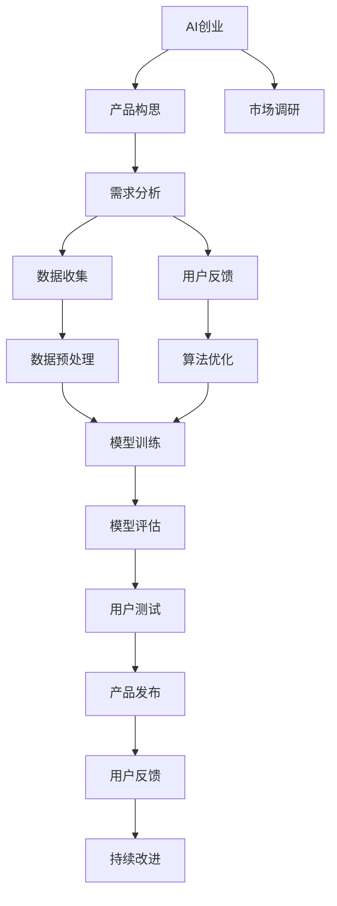

                 

# AI创业：产品改进方法

> 关键词：AI创业,产品改进,数据驱动,用户体验,敏捷开发,持续反馈,机器学习,自然语言处理,NLP,计算机视觉,深度学习,算法优化

## 1. 背景介绍

在人工智能(AI)迅速发展的今天，越来越多的初创公司将AI技术作为核心竞争力，通过产品创新来获取市场竞争优势。然而，AI创业不仅需要强大的技术实力，还需要一套科学合理的产品改进方法，以确保产品的持续迭代和市场成功。本文将详细介绍一套基于数据驱动的AI产品改进方法，涵盖从产品构思、开发、测试到上市的各个环节，助力AI创业者构建高性能、用户友好的产品。

## 2. 核心概念与联系

### 2.1 核心概念概述

在进行AI产品改进之前，首先需要理解几个核心概念及其之间的联系：

- **AI创业**：利用AI技术开发新产品或改进现有产品，以获得市场优势。
- **产品改进**：通过不断迭代优化产品功能，提升用户体验和市场竞争力。
- **数据驱动**：依据数据分析结果进行决策和优化，以提升产品性能和用户满意度。
- **用户体验**：用户在使用产品时的主观感受和反馈，是产品改进的关键指标。
- **敏捷开发**：快速响应市场变化和用户需求，实现产品的高效迭代。
- **持续反馈**：在产品发布后收集用户反馈，不断优化产品功能。
- **机器学习**：利用算法优化数据模型，提升产品性能。
- **自然语言处理(NLP)**：处理和理解人类语言，提升人机交互体验。
- **计算机视觉**：处理和分析图像和视频数据，实现视觉识别和增强。
- **深度学习**：基于神经网络的算法，用于处理大规模数据和复杂问题。
- **算法优化**：提升算法的效率和准确性，改善用户体验。

这些概念通过以下Mermaid流程图来展示它们之间的联系：



从上述流程图可以看到，AI创业者需要从市场调研开始，经过需求分析、数据收集和预处理、模型训练和优化，到最终的用户测试和产品发布，通过持续反馈和改进，不断提升产品的用户体验和市场竞争力。

## 3. 核心算法原理 & 具体操作步骤
### 3.1 算法原理概述

基于数据驱动的AI产品改进方法，主要依赖于以下几个核心算法原理：

1. **需求分析与定义**：通过对市场调研和用户反馈的数据分析，明确产品的需求和目标用户群体。
2. **数据收集与预处理**：收集与产品相关的数据，并对数据进行清洗、特征提取等预处理操作。
3. **模型训练与优化**：使用机器学习或深度学习算法，训练数据模型并进行优化，提升模型的准确性和效率。
4. **模型评估与测试**：通过交叉验证、A/B测试等方法，评估模型的性能和效果，确保模型的泛化能力。
5. **持续反馈与改进**：根据用户反馈和测试结果，不断调整产品功能和算法，提升用户体验。

### 3.2 算法步骤详解

下面是AI产品改进的详细步骤：

#### 3.2.1 需求分析与定义
- **市场调研**：通过问卷调查、访谈、社交媒体等手段，收集潜在用户的需求和痛点。
- **用户画像**：构建目标用户群体画像，明确其基本特征和使用场景。
- **需求优先级**：根据调研结果，确定不同功能的优先级和可行性。

#### 3.2.2 数据收集与预处理
- **数据来源**：选择合适数据来源，如社交媒体、客户反馈、公开数据集等。
- **数据清洗**：去除无关数据，处理缺失值和异常值。
- **特征提取**：选择合适的特征，如文本情感、用户行为等。

#### 3.2.3 模型训练与优化
- **算法选择**：根据任务特点选择合适的算法，如线性回归、决策树、随机森林、深度学习等。
- **数据划分**：将数据划分为训练集、验证集和测试集。
- **模型训练**：使用训练集训练模型，调整超参数以优化模型性能。
- **模型评估**：使用验证集评估模型效果，选择最优模型进行测试。

#### 3.2.4 模型评估与测试
- **交叉验证**：使用交叉验证方法评估模型的泛化能力。
- **A/B测试**：将新功能和旧功能进行对比测试，评估改进效果。

#### 3.2.5 持续反馈与改进
- **用户反馈**：通过用户调查、在线评论等方式收集用户反馈。
- **数据分析**：对反馈数据进行统计分析，识别常见问题和改进方向。
- **迭代改进**：根据反馈数据，调整产品功能并重新发布，持续优化。

### 3.3 算法优缺点

基于数据驱动的AI产品改进方法具有以下优点：

1. **科学决策**：通过数据分析支持决策，减少主观偏差。
2. **用户中心**：紧密结合用户需求，提升用户体验和满意度。
3. **灵活迭代**：快速响应市场变化，实现产品的高效迭代。
4. **精准优化**：通过算法优化提升模型性能，提升产品性能。

同时，该方法也存在以下缺点：

1. **数据依赖**：依赖高质量、丰富的数据，数据获取和处理成本较高。
2. **模型复杂**：模型训练和优化复杂，需要较高的技术门槛。
3. **反馈延迟**：从产品发布到收集反馈的周期较长，难以实时调整。
4. **隐私风险**：用户数据隐私问题需要严格控制和保护。

尽管存在这些局限性，但就目前而言，基于数据驱动的AI产品改进方法仍是最主流、最科学的产品优化范式。未来相关研究的重点在于如何进一步提高数据获取的效率和质量，优化模型训练流程，缩短反馈周期，同时兼顾隐私保护，以期构建更加高效、安全、用户友好的AI产品。

### 3.4 算法应用领域

基于数据驱动的AI产品改进方法，在多个领域得到了广泛应用，例如：

- **智能推荐系统**：根据用户行为和偏好，推荐个性化产品或内容，提升用户体验。
- **智能客服**：通过自然语言处理技术，提供智能化的客户服务，提升响应速度和准确性。
- **医疗诊断**：利用医学图像和文本数据，提供疾病诊断和预测，提升医疗效率。
- **金融风控**：通过数据分析和机器学习，评估用户信用风险，提供个性化贷款服务。
- **智能制造**：通过传感器数据和机器视觉技术，实现生产过程的自动化和智能化。

除了这些传统领域，AI产品改进方法还在智慧城市、智能交通、农业物联网等领域展现出巨大的应用潜力，推动各行业数字化、智能化的升级。

## 4. 数学模型和公式 & 详细讲解 & 举例说明

### 4.1 数学模型构建

在进行AI产品改进时，我们通常会构建一个基于机器学习或深度学习的数学模型，以优化产品的某些功能。以下是一个简单的线性回归模型：

设训练集为 $(x_i, y_i)_{i=1}^N$，其中 $x_i \in \mathbb{R}^d$ 为输入特征，$y_i \in \mathbb{R}$ 为输出标签。线性回归模型的目标是最小化预测值与真实值之间的误差平方和：

$$
\min_{\theta} \sum_{i=1}^N (y_i - \theta^T x_i)^2
$$

其中 $\theta$ 为模型参数，可以通过梯度下降等优化算法求解。

### 4.2 公式推导过程

以线性回归为例，进行公式推导：

设损失函数为 $L(\theta) = \frac{1}{2N} \sum_{i=1}^N (y_i - \theta^T x_i)^2$，则其梯度为：

$$
\nabla_{\theta} L(\theta) = \frac{1}{N} \sum_{i=1}^N (y_i - \theta^T x_i) x_i
$$

通过求解 $\nabla_{\theta} L(\theta) = 0$，可得参数 $\theta$ 的闭式解：

$$
\theta = (\sum_{i=1}^N x_i x_i^T)^{-1} \sum_{i=1}^N x_i y_i
$$

这就是线性回归模型的参数求解公式。

### 4.3 案例分析与讲解

假设我们要优化一款电商平台的推荐系统，目标是提高用户的点击率和购买率。我们选择从用户历史行为数据中提取特征，并构建一个线性回归模型，用于预测用户的购买意愿。具体步骤如下：

1. **数据准备**：收集用户历史浏览、购买、评价等数据，提取用户ID、商品ID、浏览时长等特征。
2. **特征预处理**：对特征进行归一化、缺失值处理等预处理操作。
3. **模型训练**：使用随机梯度下降算法，训练线性回归模型，调整超参数以优化模型性能。
4. **模型评估**：使用交叉验证和A/B测试方法，评估模型的预测效果和用户反馈。
5. **迭代改进**：根据反馈数据，调整模型参数和推荐算法，持续优化推荐系统。

## 5. 项目实践：代码实例和详细解释说明

### 5.1 开发环境搭建

在进行AI产品改进时，首先需要搭建开发环境。以下是使用Python和PyTorch进行机器学习开发的环境配置流程：

1. 安装Anaconda：从官网下载并安装Anaconda，用于创建独立的Python环境。
2. 创建并激活虚拟环境：
```bash
conda create -n ml-env python=3.8 
conda activate ml-env
```
3. 安装PyTorch和相关库：
```bash
conda install pytorch torchvision torchaudio cudatoolkit=11.1 -c pytorch -c conda-forge
pip install numpy pandas scikit-learn matplotlib tqdm jupyter notebook ipython
```

完成上述步骤后，即可在`ml-env`环境中开始AI产品改进的实践。

### 5.2 源代码详细实现

下面是使用PyTorch进行线性回归模型的Python代码实现：

```python
import torch
import torch.nn as nn
import torch.optim as optim
from torch.utils.data import DataLoader
from sklearn.model_selection import train_test_split
from sklearn.metrics import mean_squared_error

class LinearRegression(nn.Module):
    def __init__(self, input_dim):
        super(LinearRegression, self).__init__()
        self.linear = nn.Linear(input_dim, 1)
        
    def forward(self, x):
        return self.linear(x)

# 数据准备
X_train, X_test, y_train, y_test = train_test_split(X, y, test_size=0.2, random_state=42)
train_dataset = torch.utils.data.TensorDataset(torch.tensor(X_train), torch.tensor(y_train))
test_dataset = torch.utils.data.TensorDataset(torch.tensor(X_test), torch.tensor(y_test))
train_loader = DataLoader(train_dataset, batch_size=32, shuffle=True)
test_loader = DataLoader(test_dataset, batch_size=32)

# 模型训练
model = LinearRegression(input_dim)
optimizer = optim.SGD(model.parameters(), lr=0.01)
criterion = nn.MSELoss()

for epoch in range(1000):
    model.train()
    for X_batch, y_batch in train_loader:
        optimizer.zero_grad()
        y_pred = model(X_batch)
        loss = criterion(y_pred, y_batch)
        loss.backward()
        optimizer.step()
        
    model.eval()
    with torch.no_grad():
        y_pred = model(X_test)
        mse = mean_squared_error(y_test, y_pred)
        print(f"Epoch {epoch+1}, MSE: {mse:.3f}")
```

以上代码实现了线性回归模型的训练和评估，使用了PyTorch的TensorDataset和DataLoader进行数据批处理，通过SGD优化器进行参数更新，并使用均方误差(MSE)作为评估指标。

### 5.3 代码解读与分析

下面我们详细解读一下关键代码的实现细节：

**LinearRegression类**：
- `__init__`方法：初始化线性层，输入维度为1，输出维度为1。
- `forward`方法：定义模型前向传播过程，将输入通过线性层输出。

**数据准备**：
- 使用`train_test_split`函数将数据划分为训练集和测试集。
- 创建`TensorDataset`对象，将数据转化为Tensor格式。
- 使用`DataLoader`对数据进行批处理和随机打乱。

**模型训练**：
- 创建`LinearRegression`对象，并定义输入维度。
- 初始化优化器和损失函数。
- 使用循环迭代训练模型，每个epoch内通过梯度下降更新模型参数。
- 在每个epoch结束时，在测试集上进行模型评估，输出均方误差。

**代码解读与分析**：
- PyTorch的TensorDataset和DataLoader封装了数据预处理和批处理的逻辑，使模型训练更加方便。
- 使用SGD优化器进行参数更新，通过均方误差评估模型效果。
- 代码逻辑清晰，易于理解和调试。

## 6. 实际应用场景

### 6.1 智能推荐系统

智能推荐系统是AI产品改进的重要应用场景之一。推荐系统通过分析用户历史行为和偏好，提供个性化的推荐结果，提升用户满意度和平台转化率。在实际应用中，可以通过构建基于协同过滤、基于内容的推荐模型，并结合用户反馈进行持续优化，实现推荐系统的不断改进。

### 6.2 智能客服

智能客服是另一大应用场景。通过自然语言处理技术和机器学习算法，智能客服可以自动理解和解答用户咨询，提供24/7不间断的客户服务。在实际应用中，可以通过收集用户对话数据，训练情感分析、意图识别等模型，并根据用户反馈不断优化模型，提升智能客服系统的性能。

### 6.3 医疗诊断

在医疗领域，AI产品改进可以用于辅助诊断和预测。通过收集和分析医学图像、文本和电子病历等数据，构建基于深度学习的诊断模型，并结合医生的诊断结果进行持续优化，提升医疗诊断的准确性和效率。

### 6.4 金融风控

在金融领域，AI产品改进可以用于信用风险评估和欺诈检测。通过分析用户历史行为和交易数据，构建基于机器学习的风险评估模型，并结合用户反馈进行持续优化，提升金融风控系统的性能。

## 7. 工具和资源推荐

### 7.1 学习资源推荐

为了帮助开发者系统掌握AI产品改进的理论基础和实践技巧，这里推荐一些优质的学习资源：

1. 《机器学习实战》：介绍机器学习的基本概念和常用算法，适合初学者。
2. 《深度学习入门》：由深度学习专家撰写，详细介绍深度学习的基本原理和实践技巧。
3. 《Python深度学习》：介绍使用Python进行深度学习开发的方法和技巧。
4. 《TensorFlow官方文档》：TensorFlow的官方文档，提供了丰富的算法和模型示例，适合进阶学习。
5. 《自然语言处理入门》：介绍自然语言处理的基本概念和常用技术，适合初学者。
6. Kaggle平台：提供大量的数据集和竞赛，实践和提高数据处理和模型训练能力。

通过对这些资源的学习实践，相信你一定能够快速掌握AI产品改进的精髓，并用于解决实际的AI问题。

### 7.2 开发工具推荐

高效的开发离不开优秀的工具支持。以下是几款用于AI产品改进开发的常用工具：

1. PyTorch：基于Python的开源深度学习框架，灵活动态的计算图，适合快速迭代研究。
2. TensorFlow：由Google主导开发的开源深度学习框架，生产部署方便，适合大规模工程应用。
3. Jupyter Notebook：交互式的编程环境，支持代码和结果的可视化，适合数据探索和模型训练。
4. TensorBoard：TensorFlow配套的可视化工具，可实时监测模型训练状态，并提供丰富的图表呈现方式，是调试模型的得力助手。
5. Weights & Biases：模型训练的实验跟踪工具，可以记录和可视化模型训练过程中的各项指标，方便对比和调优。

合理利用这些工具，可以显著提升AI产品改进的开发效率，加快创新迭代的步伐。

### 7.3 相关论文推荐

AI产品改进技术的发展源于学界的持续研究。以下是几篇奠基性的相关论文，推荐阅读：

1. "Machine Learning Yearning" by Andrew Ng：介绍了机器学习项目管理和优化的方法和策略。
2. "Deep Learning Specialization" by Andrew Ng：Coursera上由Andrew Ng讲授的深度学习课程，涵盖深度学习的基本概念和实践技巧。
3. "Introduction to Statistical Learning" by Gareth James et al.：介绍了统计学习方法的基本原理和算法，适合机器学习基础入门。
4. "On the Importance of Initialization and Momentum in Deep Learning" by Kyunghyun Cho et al.：介绍了深度学习模型初始化和动量优化方法，提升模型训练效果。
5. "Attention is All You Need" by Ashish Vaswani et al.：介绍了Transformer模型架构，推动了NLP领域的预训练大模型发展。

这些论文代表了大规模AI产品改进技术的发展脉络。通过学习这些前沿成果，可以帮助研究者把握学科前进方向，激发更多的创新灵感。

## 8. 总结：未来发展趋势与挑战

### 8.1 总结

本文对基于数据驱动的AI产品改进方法进行了全面系统的介绍。首先阐述了AI创业和产品改进的背景，明确了数据驱动方法在产品优化中的重要性。其次，从原理到实践，详细讲解了需求分析、数据预处理、模型训练、持续反馈等核心步骤，给出了完整的AI产品改进代码实现。同时，本文还广泛探讨了AI产品改进在智能推荐、智能客服、医疗诊断等多个领域的应用前景，展示了数据驱动方法的强大威力。

通过本文的系统梳理，可以看到，数据驱动的AI产品改进方法已经成为AI创业和产品优化不可或缺的利器。这些方法不仅能够科学决策、用户中心，还能实现高效迭代、精准优化，显著提升产品的性能和市场竞争力。

### 8.2 未来发展趋势

展望未来，AI产品改进技术将呈现以下几个发展趋势：

1. **自动化优化**：引入自动化机器学习(AutoML)技术，自动选择最优算法和参数，实现模型的自动优化。
2. **跨领域融合**：结合自然语言处理、计算机视觉、时间序列分析等跨领域技术，提升产品的智能水平。
3. **实时优化**：通过实时数据收集和分析，实现模型的实时优化和动态调整。
4. **联邦学习**：利用分布式训练技术，在多个设备上协同训练模型，保护用户隐私同时提升模型性能。
5. **交互式优化**：利用增强学习技术，通过与用户互动，实现模型性能的持续优化。
6. **多模态数据融合**：结合语音、图像、文本等数据，提升产品的感知和理解能力。

以上趋势凸显了AI产品改进技术的广阔前景。这些方向的探索发展，必将进一步提升AI产品的性能和用户体验，为各行各业带来新的技术突破。

### 8.3 面临的挑战

尽管AI产品改进技术已经取得了瞩目成就，但在迈向更加智能化、普适化应用的过程中，它仍面临着诸多挑战：

1. **数据获取难度**：高质量、大规模的数据获取和预处理成本较高，难以应对复杂多变的业务需求。
2. **模型复杂度**：复杂的算法和模型需要较高的技术门槛，难以快速迭代和优化。
3. **隐私保护**：用户数据隐私问题需要严格控制和保护，避免数据泄露和滥用。
4. **计算资源**：大规模模型训练和推理需要高性能计算资源，资源限制可能影响模型的性能。
5. **鲁棒性问题**：模型在新环境下的泛化能力和鲁棒性需要进一步提升，避免出现过拟合和失效。

尽管存在这些挑战，但就目前而言，基于数据驱动的AI产品改进方法仍是最主流、最科学的产品优化范式。未来相关研究的重点在于如何进一步提高数据获取的效率和质量，优化模型训练流程，缩短反馈周期，同时兼顾隐私保护，以期构建更加高效、安全、用户友好的AI产品。

### 8.4 研究展望

面向未来，AI产品改进技术需要在以下几个方向寻求新的突破：

1. **自动化数据预处理**：利用自动化工具，实现数据清洗、特征提取等预处理操作的自动化，提升数据获取和处理的效率。
2. **自适应模型训练**：通过自适应算法，自动调整超参数，提升模型训练的效率和效果。
3. **实时反馈机制**：建立实时反馈机制，快速收集和分析用户反馈，实现模型的实时优化和调整。
4. **跨平台协同**：通过联邦学习等技术，实现跨平台协同训练，提升模型的泛化能力和鲁棒性。
5. **交互式AI**：利用增强学习技术，通过与用户的互动，实现模型的智能优化和持续改进。
6. **隐私保护机制**：建立严格的隐私保护机制，确保用户数据的安全和隐私。

这些研究方向的探索，必将引领AI产品改进技术迈向更高的台阶，为构建更加高效、安全、用户友好的AI产品提供新的思路和技术手段。

## 9. 附录：常见问题与解答

**Q1：如何确定AI产品的需求和目标用户群体？**

A: 确定AI产品需求和目标用户群体需要以下步骤：
1. 市场调研：通过问卷调查、访谈、社交媒体等手段，收集潜在用户的需求和痛点。
2. 用户画像：构建目标用户群体画像，明确其基本特征和使用场景。
3. 需求优先级：根据调研结果，确定不同功能的优先级和可行性。

**Q2：如何收集和处理高质量的数据？**

A: 收集高质量的数据需要以下步骤：
1. 确定数据来源：选择合适数据来源，如公开数据集、用户行为数据等。
2. 数据清洗：去除无关数据，处理缺失值和异常值。
3. 特征提取：选择合适的特征，如文本情感、用户行为等。

**Q3：如何评估模型的性能？**

A: 评估模型性能需要以下步骤：
1. 交叉验证：使用交叉验证方法评估模型的泛化能力。
2. A/B测试：将新功能和旧功能进行对比测试，评估改进效果。

**Q4：如何应对数据隐私问题？**

A: 应对数据隐私问题需要以下步骤：
1. 数据脱敏：对敏感数据进行脱敏处理，保护用户隐私。
2. 数据加密：采用数据加密技术，防止数据泄露。
3. 访问控制：设置严格的访问权限，防止数据滥用。

通过本文的系统梳理，可以看到，基于数据驱动的AI产品改进方法已经成为AI创业和产品优化不可或缺的利器。这些方法不仅能够科学决策、用户中心，还能实现高效迭代、精准优化，显著提升产品的性能和市场竞争力。

---

作者：禅与计算机程序设计艺术 / Zen and the Art of Computer Programming

