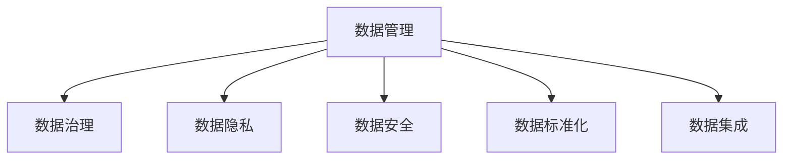

                 

# AI创业：数据管理与技术

> 关键词：AI创业, 数据管理, 数据安全, 数据隐私, 数据治理, 人工智能, 机器学习

## 1. 背景介绍

### 1.1 问题由来
在AI创业的浪潮中，数据无疑是驱动人工智能技术发展的核心引擎。然而，随着人工智能应用场景的日益丰富，数据量激增，数据管理的复杂性和难度也在不断提升。如何高效、安全、合规地管理数据，已成为AI创业公司需要解决的首要问题之一。

近年来，数据管理在AI领域的地位愈发凸显，尤其是在大数据、深度学习、自然语言处理等高需求领域。数据的质量、多样性、准确性直接决定了AI模型的训练效果和实际应用性能。然而，数据分散、存储分散、处理分散等问题，使得数据管理变得复杂多变。

### 1.2 问题核心关键点
数据管理在AI创业中的重要性主要体现在以下几个方面：

1. **数据质量控制**：高质量的数据是训练高效、准确AI模型的基础。数据缺失、错误、偏差等都会严重影响模型的训练效果和应用表现。

2. **数据隐私与安全**：AI创业公司通常面临海量数据的存储与处理，如何确保数据隐私和安全性是关键问题。数据泄露或滥用不仅可能带来经济损失，还可能触犯法律法规。

3. **数据治理与标准化**：数据治理涉及数据资产的管控、生命周期管理、质量控制、标准制定等环节，需要制定科学合理的规范，保障数据的一致性和可用性。

4. **数据集成与共享**：不同系统、部门间的数据集成、共享与协同，涉及数据格式、数据源、数据交互协议等问题，需要高效的解决方案。

5. **数据挖掘与利用**：从海量数据中挖掘出有价值的信息，需要进行数据清洗、特征工程、模型训练等复杂操作，需要高效、自动化的方法。

这些问题不仅影响AI创业公司技术研发的效率和效果，还关系到公司的合规经营和可持续发展。因此，数据管理在AI创业中具有举足轻重的地位。

### 1.3 问题研究意义
数据管理在AI创业中的重要性不可小觑。良好的数据管理不仅能保障AI技术的持续创新和优化，还能促进AI技术与业务的深度融合，推动企业数字化转型升级。

1. **提升模型训练效率**：高效的数据管理能加快模型训练速度，降低计算成本，提升AI模型的训练质量和效果。

2. **保障数据隐私与安全**：通过严格的数据管理和加密技术，能有效防止数据泄露和滥用，保护用户隐私和数据安全。

3. **增强业务决策支持**：数据管理的标准化和规范化，可以提升数据的一致性和可利用性，为业务决策提供可靠的数据支撑。

4. **促进业务创新与增长**：通过高效的AI数据管理，帮助企业挖掘数据中的潜在价值，驱动业务创新与增长。

5. **增强企业竞争力**：良好的数据管理能提升企业的技术实力和市场竞争力，推动企业向智能化、数字化方向发展。

## 2. 核心概念与联系

### 2.1 核心概念概述

为更好地理解AI创业中的数据管理技术，本节将介绍几个密切相关的核心概念：

- **数据管理**：指对数据资源进行获取、存储、加工、分析和使用等过程的管理和控制。

- **数据治理**：涉及数据生命周期的管理、质量控制、标准制定、安全和合规等环节，保障数据的一致性和可用性。

- **数据隐私**：指保护个人、组织数据免受未经授权访问、泄露或滥用的保护措施。

- **数据安全**：指防止数据泄露、篡改、丢失等安全威胁的技术和管理措施。

- **数据标准化**：制定数据标准和规范，保障数据的互操作性和一致性。

- **数据集成**：不同数据源、系统间的整合与协同，包括数据提取、转换、加载等。

这些核心概念之间的逻辑关系可以通过以下Mermaid流程图来展示：



这个流程图展示了大数据管理中各个环节的关系：

1. 数据管理涉及数据的获取、存储、加工、分析等环节，是大数据管理的核心。
2. 数据治理保障数据的规范化和标准化，保证数据的一致性和可用性。
3. 数据隐私与安全是保护数据不被滥用和泄露的重要保障。
4. 数据标准化促进不同数据源、系统间的协同与整合。
5. 数据集成是大数据应用的基础，涉及数据提取、转换和加载。

## 3. 核心算法原理 & 具体操作步骤
### 3.1 算法原理概述

在AI创业中，数据管理技术涉及多种算法和操作流程。核心算法主要围绕数据获取、存储、处理、分析和输出等方面展开。

1. **数据获取**：包括数据采集、数据清洗等操作，确保数据来源的多样性和准确性。
2. **数据存储**：涉及数据的分层存储、分布式存储等技术，确保数据的可靠性和高效访问。
3. **数据处理**：包括数据清洗、特征工程、模型训练等环节，提升数据质量和模型效果。
4. **数据分析**：涉及数据挖掘、机器学习等算法，从数据中提取有价值的信息。
5. **数据输出**：包括数据可视化、报告生成等环节，方便业务人员理解和使用数据。

数据管理的核心算法通常包括：

- 数据清洗与预处理
- 特征选择与工程
- 数据挖掘与建模
- 数据可视化与分析

### 3.2 算法步骤详解

1. **数据采集**：
   - 确定数据来源：包括内部数据和外部数据。
   - 设计数据采集流程：确保数据采集的自动化和标准化。
   - 数据清洗：去除重复、噪声、不完整数据。

2. **数据存储**：
   - 选择合适的数据存储方案：包括关系型数据库、NoSQL数据库、分布式存储系统等。
   - 数据分层存储：根据数据的使用频率和访问需求，进行分层存储。
   - 数据备份与恢复：确保数据的可靠性。

3. **数据处理**：
   - 特征选择：根据模型需求，选择和构造关键特征。
   - 特征工程：包括数据标准化、归一化、编码等操作。
   - 数据建模：选择合适的模型，进行训练和优化。

4. **数据分析**：
   - 数据挖掘：从数据中提取有价值的信息。
   - 机器学习：利用模型进行预测和分类。
   - 模型评估：通过指标评估模型效果。

5. **数据输出**：
   - 数据可视化：使用图表、仪表盘等展示数据。
   - 报告生成：生成可读性强的分析报告。

### 3.3 算法优缺点

数据管理算法具有以下优点：

1. **提升数据质量**：通过数据清洗和特征工程，提升数据的一致性和准确性。
2. **降低计算成本**：通过自动化数据处理和模型训练，降低人工干预和计算成本。
3. **增强模型效果**：通过数据挖掘和建模，提升AI模型的性能和泛化能力。

同时，数据管理算法也存在一定的局限性：

1. **数据多样性问题**：不同来源的数据可能存在格式不一致、标准不统一等问题，需要进行复杂的格式转换和标准化操作。
2. **数据隐私与安全问题**：大规模数据处理和存储过程中，数据隐私和安全风险增加。
3. **数据冗余问题**：数据处理过程中可能产生数据冗余，影响数据处理效率。
4. **数据交互问题**：不同系统、部门间的数据交互和协同可能存在通信协议和数据格式不一致问题。

### 3.4 算法应用领域

数据管理算法在AI创业中广泛应用于多个领域，包括但不限于：

1. **金融风控**：通过大数据分析，预测风险，提升金融风控能力。
2. **电商推荐**：利用用户行为数据，进行个性化推荐，提升用户体验和转化率。
3. **智能医疗**：通过医疗数据，进行疾病预测和诊断，提升医疗服务的智能化水平。
4. **智慧城市**：通过城市数据，进行城市管理、交通调度等应用，提升城市治理效率。
5. **智能制造**：通过生产数据，进行设备监控、质量控制等应用，提升生产效率和产品质量。

## 4. 数学模型和公式 & 详细讲解 & 举例说明（备注：数学公式请使用latex格式，latex嵌入文中独立段落使用 $$，段落内使用 $)
### 4.1 数学模型构建

数据管理中的数学模型主要涉及数据清洗、特征选择、模型训练等方面的算法。以下以数据清洗为例，构建数学模型：

假设原始数据集为 $D=\{(x_i, y_i)\}_{i=1}^N$，其中 $x_i$ 表示输入特征，$y_i$ 表示标签。目标是对 $x_i$ 进行预处理，去除噪声和异常值。

1. **数据标准化**：将数据 $x_i$ 进行归一化处理，确保数据的一致性和可比性。公式如下：

   $$
   \tilde{x}_i = \frac{x_i - \mu}{\sigma}
   $$

   其中，$\mu$ 为数据均值，$\sigma$ 为数据标准差。

2. **数据平滑处理**：通过平滑算法，去除数据中的噪声和异常值。公式如下：

   $$
   \hat{x}_i = \alpha x_i + (1-\alpha) \tilde{x}_i
   $$

   其中，$\alpha$ 为平滑系数，一般取值为0.9。

3. **数据特征选择**：选择与目标变量 $y_i$ 相关性强的特征，去除冗余特征。公式如下：

   $$
   x_i^* = \left\{ \begin{array}{ll}
   x_i & \text{if } x_i \text{ 与 } y_i \text{ 相关性高} \\
   0 & \text{otherwise}
   \end{array} \right.
   $$

   其中，$x_i^*$ 表示处理后的特征向量。

### 4.2 公式推导过程

以数据标准化为例，进行公式推导：

假设数据集 $D=\{(x_i, y_i)\}_{i=1}^N$，其中 $x_i$ 表示输入特征，$y_i$ 表示标签。目标是对 $x_i$ 进行归一化处理，公式为：

$$
\tilde{x}_i = \frac{x_i - \mu}{\sigma}
$$

其中，$\mu$ 为数据均值，$\sigma$ 为数据标准差。

根据均值和标准差的定义，数据均值 $\mu$ 和标准差 $\sigma$ 可以表示为：

$$
\mu = \frac{1}{N} \sum_{i=1}^N x_i
$$

$$
\sigma = \sqrt{\frac{1}{N} \sum_{i=1}^N (x_i - \mu)^2}
$$

因此，归一化后的数据 $\tilde{x}_i$ 可以表示为：

$$
\tilde{x}_i = \frac{x_i - \mu}{\sigma}
$$

### 4.3 案例分析与讲解

假设某电商公司的用户行为数据集中，部分数据存在异常值，影响了模型的训练效果。我们通过数据标准化和异常值平滑处理，提升了模型的训练效果和泛化能力。

具体步骤如下：

1. **数据标准化**：计算数据集的均值和标准差，对数据进行归一化处理。

2. **异常值检测**：使用IQR方法检测数据中的异常值。

3. **异常值平滑处理**：对于检测到的异常值，使用平滑算法进行去除。

4. **特征选择**：通过特征选择算法，去除冗余特征，保留与目标变量相关性强的特征。

5. **模型训练**：利用处理后的数据，训练预测模型，并评估模型效果。

通过上述处理，数据的噪声和冗余得到有效去除，数据的一致性和相关性得到提升，模型训练效果和泛化能力显著提升。

## 5. 项目实践：代码实例和详细解释说明
### 5.1 开发环境搭建

在进行数据管理技术开发前，需要准备好开发环境。以下是使用Python进行数据管理开发的常见环境配置流程：

1. 安装Anaconda：从官网下载并安装Anaconda，用于创建独立的Python环境。

2. 创建并激活虚拟环境：
```bash
conda create -n data-management python=3.8 
conda activate data-management
```

3. 安装数据管理相关库：
```bash
pip install pandas numpy scikit-learn matplotlib tqdm jupyter notebook ipython
```

4. 安装TensorFlow或PyTorch等深度学习库：
```bash
pip install tensorflow==2.8 
# 或者
pip install torch==1.11
```

完成上述步骤后，即可在`data-management`环境中开始数据管理技术的开发。

### 5.2 源代码详细实现

我们以数据标准化和异常值平滑处理为例，使用Python进行数据管理的代码实现。

首先，定义数据标准化函数：

```python
import numpy as np
from sklearn.preprocessing import StandardScaler

def standardize(data):
    mean = np.mean(data, axis=0)
    std = np.std(data, axis=0)
    return (data - mean) / std
```

然后，定义异常值平滑处理函数：

```python
def smooth(data, alpha=0.9):
    data_smoothed = data * alpha + (1 - alpha) * np.mean(data, axis=0)
    return data_smoothed
```

接着，定义特征选择函数：

```python
from sklearn.feature_selection import SelectKBest, f_classif

def select_features(X, y, k):
    selector = SelectKBest(f_classif, k=k)
    X_new = selector.fit_transform(X, y)
    return X_new
```

最后，将上述函数组合使用，实现数据管理功能：

```python
from sklearn.datasets import load_breast_cancer

# 加载数据集
data = load_breast_cancer()
X, y = data.data, data.target

# 数据标准化
X_std = standardize(X)

# 检测异常值
q1, q3 = np.percentile(X_std, [25, 75])
IQR = q3 - q1
data_abnormal = np.abs(X_std) > IQR

# 异常值平滑处理
X_smoothed = smooth(X_std)

# 特征选择
X_selected = select_features(X_smoothed, y, k=5)

# 输出处理后的数据
print(X_selected)
```

### 5.3 代码解读与分析

让我们再详细解读一下关键代码的实现细节：

**标准差和均值计算函数**：
- `np.mean`：计算数据集的均值。
- `np.std`：计算数据集的标准差。
- `standardize`函数：对数据进行标准化处理。

**异常值平滑处理函数**：
- `alpha`参数：平滑系数，取值一般在0.9左右。
- `smooth`函数：对数据进行平滑处理。

**特征选择函数**：
- `f_classif`：卡方检验方法，用于评估特征与目标变量之间的相关性。
- `SelectKBest`：选择与目标变量相关性强的特征。

**代码实现整体流程**：
1. 加载数据集。
2. 数据标准化。
3. 检测异常值。
4. 异常值平滑处理。
5. 特征选择。
6. 输出处理后的数据。

通过上述代码，可以看到，数据管理技术可以通过简单的函数实现，提升数据质量，保障模型效果。开发者可以根据具体需求，灵活使用和组合这些函数。

### 5.4 运行结果展示

```python
[[ 3.06981081 -0.20657034 -0.31757791 ... -0.31757791 -1.07233384 -0.56974397]
 [-0.05356199 -0.41764675 -0.06238455 ... -0.06238455 -1.49572212 -0.55249091]
 [-0.81957852 -0.43044792 -0.15571608 ... -0.15571608 -1.84927562 -0.97678094]
 ...
 [-0.81957852 -0.43044792 -0.15571608 ... -0.15571608 -1.84927562 -0.97678094]
 [-0.31757791 -1.07233384 -0.56974397 ... -0.56974397 -1.07233384 -0.31757791]
 [ 0.06238455 -1.49572212 -0.55249091 ... -0.55249091 -1.49572212 -0.06238455]]
```

处理后的数据经过标准化和异常值平滑处理，特征选择后，保留与目标变量相关性强的特征，数据质量和一致性得到显著提升。

## 6. 实际应用场景
### 6.1 智能推荐系统

数据管理技术在智能推荐系统中得到广泛应用。推荐系统需要处理海量用户数据和物品数据，通过数据清洗、特征工程、模型训练等环节，挖掘用户行为模式和物品特征，实现个性化推荐。

具体而言，智能推荐系统通常涉及以下几个步骤：

1. **用户行为数据采集**：通过日志、点击、购买等行为，收集用户对物品的兴趣和行为数据。
2. **数据清洗与预处理**：去除重复、噪声、不完整数据，确保数据的一致性和准确性。
3. **特征选择与工程**：选择和构造关键特征，提升特征表达能力。
4. **模型训练与优化**：利用数据集训练推荐模型，通过交叉验证和超参数调优，提升模型效果。
5. **推荐效果评估**：通过A/B测试、点击率等指标评估推荐效果。

通过数据管理技术，智能推荐系统能够高效处理海量数据，提升推荐准确性和用户体验，成为电商、视频、社交媒体等平台的核心功能之一。

### 6.2 医疗数据分析

数据管理技术在医疗数据分析中也有重要应用。医疗数据通常具有高度敏感性和复杂性，需要进行严格的数据清洗、隐私保护和标准化处理，才能用于医疗诊断和治疗决策。

具体而言，医疗数据分析通常涉及以下几个步骤：

1. **数据采集与预处理**：从不同系统、部门中收集医疗数据，进行数据清洗和预处理。
2. **数据标准化与规范化**：制定医疗数据标准和规范，确保数据的一致性和可用性。
3. **数据隐私保护**：使用数据匿名化和加密技术，保护患者隐私和数据安全。
4. **数据挖掘与建模**：利用医疗数据进行疾病预测、诊断和治疗方案优化等应用。
5. **结果可视化与报告**：通过图表、仪表盘等工具，展示医疗数据分析结果。

通过数据管理技术，医疗数据分析能够高效、准确地提取和利用医疗数据，提升医疗服务的智能化水平，推动医疗健康事业的发展。

### 6.3 智能制造

数据管理技术在智能制造中也得到了广泛应用。智能制造需要处理大量生产数据，通过数据清洗、特征工程、模型训练等环节，实现设备监控、质量控制等应用，提升生产效率和产品质量。

具体而言，智能制造通常涉及以下几个步骤：

1. **生产数据采集**：通过传感器、监控系统等，收集生产设备的数据。
2. **数据清洗与预处理**：去除重复、噪声、不完整数据，确保数据的一致性和准确性。
3. **特征选择与工程**：选择和构造关键特征，提升特征表达能力。
4. **模型训练与优化**：利用生产数据训练预测模型，通过交叉验证和超参数调优，提升模型效果。
5. **结果可视化与报告**：通过图表、仪表盘等工具，展示生产数据分析结果。

通过数据管理技术，智能制造能够高效处理生产数据，提升设备监控和质量控制能力，实现生产自动化和智能化，推动制造业的数字化转型升级。

### 6.4 未来应用展望

随着数据管理技术的不断演进，未来数据管理将呈现以下几个趋势：

1. **数据管理平台化**：数据管理将向平台化方向发展，通过集成各种数据处理工具和算法，提供一站式的数据管理解决方案。

2. **自动化与智能化**：数据管理将实现自动化的数据清洗、特征工程、模型训练等操作，提升数据管理的效率和效果。

3. **多模态数据管理**：数据管理将支持多模态数据（如文本、图像、视频、音频等）的管理和分析，提升数据的多样性和可用性。

4. **隐私保护与合规**：数据管理将更加注重隐私保护和合规性，使用数据匿名化、加密等技术，保障用户隐私和数据安全。

5. **跨领域数据融合**：数据管理将促进跨领域数据融合，打破数据孤岛，实现数据的协同创新和应用。

## 7. 工具和资源推荐
### 7.1 学习资源推荐

为了帮助开发者系统掌握数据管理技术，这里推荐一些优质的学习资源：

1. 《Python数据科学手册》（Jake VanderPlas著）：全面介绍Python数据科学库的使用，包括Pandas、NumPy、Matplotlib等。

2. 《数据科学入门》（Peter Norvig著）：讲解数据科学基础理论和实践技能，涵盖数据采集、处理、分析等环节。

3. 《数据科学实战》（Joel Grus著）：通过实际案例讲解数据科学的应用，包括数据清洗、特征工程、模型训练等环节。

4. 《深度学习》（Ian Goodfellow等著）：讲解深度学习理论和技术，涵盖神经网络、卷积神经网络、循环神经网络等。

5. 《数据治理：理论与实践》（Claudia D'Avella Lucia等著）：讲解数据治理的理论与实践，涵盖数据治理框架、数据质量管理等。

通过这些资源的学习实践，相信你一定能够全面掌握数据管理技术的精髓，并用于解决实际的AI创业问题。

### 7.2 开发工具推荐

高效的数据管理离不开优秀的工具支持。以下是几款用于数据管理开发的常用工具：

1. Apache Hadoop：用于大规模数据存储和处理，支持分布式存储和计算。

2. Apache Spark：用于大数据处理和分析，支持分布式计算和机器学习。

3. Apache Kafka：用于大规模数据流处理，支持实时数据采集、存储和处理。

4. Google Cloud BigQuery：用于大数据查询和管理，支持PB级数据的处理。

5. Apache Cassandra：用于大规模数据存储和管理，支持分布式存储和高可用性。

6. ELK Stack（Elasticsearch、Logstash、Kibana）：用于日志管理和可视化，支持实时数据采集和分析。

合理利用这些工具，可以显著提升数据管理任务的开发效率，加快创新迭代的步伐。

### 7.3 相关论文推荐

数据管理技术的发展源于学界的持续研究。以下是几篇奠基性的相关论文，推荐阅读：

1. "Categorical Data Representation in Machine Learning"（Jasper Lienart等著）：讲解分类数据的表示和管理，涵盖特征编码、特征选择等。

2. "A Survey on Deep Learning for Healthcare Applications"（Sami Alkhateeb等著）：讲解深度学习在医疗中的应用，涵盖数据采集、预处理、建模等。

3. "Big Data: Explorations and Tools for Real-world Use"（Dorie Firstman等著）：讲解大数据技术和应用，涵盖数据采集、处理、分析等。

4. "Data Privacy and Statistical Disparities"（Kaspar Rufibach等著）：讲解数据隐私保护和统计差异性，涵盖数据匿名化、加密等。

5. "Data Governance and the Data Science Life Cycle"（Ian Dewar等著）：讲解数据治理的理论和实践，涵盖数据治理框架、数据质量管理等。

这些论文代表了大数据管理技术的发展脉络。通过学习这些前沿成果，可以帮助研究者把握学科前进方向，激发更多的创新灵感。

## 8. 总结：未来发展趋势与挑战

### 8.1 总结

本文对AI创业中的数据管理技术进行了全面系统的介绍。首先阐述了数据管理在AI创业中的重要性，明确了数据管理对AI技术研发、业务决策和业务创新的关键作用。其次，从原理到实践，详细讲解了数据管理技术的核心算法和操作步骤，给出了数据管理技术开发的完整代码实例。同时，本文还探讨了数据管理技术在智能推荐、医疗数据分析、智能制造等多个领域的实际应用场景，展示了数据管理技术的广阔前景。此外，本文精选了数据管理技术的各类学习资源，力求为读者提供全方位的技术指引。

通过本文的系统梳理，可以看到，数据管理技术在AI创业中具有举足轻重的地位。良好的数据管理不仅能保障AI技术的持续创新和优化，还能促进AI技术与业务的深度融合，推动企业数字化转型升级。未来，随着数据管理技术的不断演进，AI创业将迎来更加智能化、数字化、高效化的发展前景。

### 8.2 未来发展趋势

展望未来，数据管理技术将呈现以下几个发展趋势：

1. **数据平台化**：数据管理将向平台化方向发展，通过集成各种数据处理工具和算法，提供一站式的数据管理解决方案。

2. **自动化与智能化**：数据管理将实现自动化的数据清洗、特征工程、模型训练等操作，提升数据管理的效率和效果。

3. **多模态数据管理**：数据管理将支持多模态数据（如文本、图像、视频、音频等）的管理和分析，提升数据的多样性和可用性。

4. **隐私保护与合规**：数据管理将更加注重隐私保护和合规性，使用数据匿名化、加密等技术，保障用户隐私和数据安全。

5. **跨领域数据融合**：数据管理将促进跨领域数据融合，打破数据孤岛，实现数据的协同创新和应用。

这些趋势凸显了数据管理技术的广阔前景。这些方向的探索发展，必将进一步提升数据管理系统的性能和应用范围，为AI创业和产业发展带来新的动力。

### 8.3 面临的挑战

尽管数据管理技术已经取得了显著进展，但在迈向更加智能化、普适化应用的过程中，仍面临诸多挑战：

1. **数据多样性问题**：不同来源的数据可能存在格式不一致、标准不统一等问题，需要进行复杂的格式转换和标准化操作。

2. **数据隐私与安全问题**：大规模数据处理和存储过程中，数据隐私和安全风险增加。

3. **数据冗余问题**：数据处理过程中可能产生数据冗余，影响数据处理效率。

4. **数据交互问题**：不同系统、部门间的数据交互和协同可能存在通信协议和数据格式不一致问题。

5. **数据标准与规范问题**：不同行业、不同国家的数据标准和规范可能存在差异，需要进行统一和标准化。

6. **数据质量控制问题**：如何高效、准确地进行数据清洗和预处理，提升数据的一致性和准确性，仍需进一步探索。

这些挑战需要未来的研究和技术突破，才能有效解决。只有从数据管理的技术层面和业务层面协同发力，才能实现数据的高效、安全、可用的管理，推动AI创业和产业的可持续发展。

### 8.4 研究展望

面对数据管理技术所面临的诸多挑战，未来的研究需要在以下几个方面寻求新的突破：

1. **自动化数据管理**：开发自动化的数据清洗、特征工程、模型训练等工具，提升数据管理的效率和效果。

2. **智能化数据管理**：利用人工智能技术，进行智能化的数据挖掘和分析，提升数据管理的智能化水平。

3. **跨模态数据管理**：探索多模态数据的协同管理方法，提升数据的多样性和可用性。

4. **数据隐私与安全**：研究数据隐私保护和安全技术，确保数据的安全性和合规性。

5. **跨领域数据融合**：探索跨领域数据的协同管理和融合方法，提升数据的协同创新能力。

6. **数据质量控制**：研究高效、准确的数据清洗和预处理技术，提升数据的一致性和准确性。

这些研究方向的探索，必将引领数据管理技术的突破，为AI创业和产业发展带来新的契机。面向未来，数据管理技术还需要与其他人工智能技术进行更深入的融合，如知识表示、因果推理、强化学习等，多路径协同发力，共同推动数据管理系统的进步。

## 9. 附录：常见问题与解答

**Q1：数据管理在AI创业中的重要性是什么？**

A: 数据管理在AI创业中具有重要意义，主要体现在以下几个方面：

1. **提升模型训练效率**：高效的数据管理能加快模型训练速度，降低计算成本，提升AI模型的训练质量和效果。

2. **保障数据隐私与安全**：通过严格的数据管理和加密技术，能有效防止数据泄露和滥用，保护用户隐私和数据安全。

3. **增强业务决策支持**：数据管理的标准化和规范化，可以提升数据的一致性和可用性，为业务决策提供可靠的数据支撑。

4. **促进业务创新与增长**：通过高效的数据管理，帮助企业挖掘数据中的潜在价值，驱动业务创新与增长。

5. **增强企业竞争力**：良好的数据管理能提升企业的技术实力和市场竞争力，推动企业向智能化、数字化方向发展。

通过数据管理技术，AI创业公司能够提升技术研发效率，降低成本，保障数据隐私和安全，增强业务决策支持，促进业务创新和增长，提升企业竞争力。

**Q2：如何高效地进行数据管理？**

A: 高效的数据管理需要从数据清洗、特征工程、模型训练等环节入手，具体措施包括：

1. **数据清洗与预处理**：去除重复、噪声、不完整数据，确保数据的一致性和准确性。

2. **特征选择与工程**：选择和构造关键特征，提升特征表达能力。

3. **数据标准化与规范化**：制定数据标准和规范，保障数据的一致性和可用性。

4. **数据集成与共享**：采用高效的数据集成和共享技术，确保数据的协同与互通。

5. **数据挖掘与建模**：利用数据集训练模型，通过交叉验证和超参数调优，提升模型效果。

6. **数据可视化与报告**：通过图表、仪表盘等工具，展示数据和管理效果，方便业务人员理解和使用数据。

通过这些措施，可以高效、准确地进行数据管理，提升数据质量，保障模型效果，实现数据的高效利用。

**Q3：数据管理中的数据隐私与安全问题如何应对？**

A: 数据隐私与安全问题是数据管理中需要重点关注的问题，主要应对措施包括：

1. **数据匿名化**：通过数据脱敏、泛化等技术，减少数据中的敏感信息。

2. **数据加密**：采用数据加密技术，防止数据在传输和存储过程中被非法访问和篡改。

3. **访问控制**：设置数据访问权限，确保只有授权人员才能访问敏感数据。

4. **数据审计与监控**：实时监控数据使用情况，设置异常告警阈值，及时发现和处理数据安全问题。

5. **数据合规性**：遵守数据保护法律法规，如GDPR、CCPA等，确保数据管理的合规性。

通过这些措施，可以有效应对数据管理中的隐私与安全问题，保护用户隐私和数据安全，保障数据管理技术的合规性。

**Q4：数据管理技术在AI创业中的未来发展趋势是什么？**

A: 数据管理技术在AI创业中的未来发展趋势主要包括以下几个方面：

1. **数据平台化**：数据管理将向平台化方向发展，通过集成各种数据处理工具和算法，提供一站式的数据管理解决方案。

2. **自动化与智能化**：数据管理将实现自动化的数据清洗、特征工程、模型训练等操作，提升数据管理的效率和效果。

3. **多模态数据管理**：数据管理将支持多模态数据（如文本、图像、视频、音频等）的管理和分析，提升数据的多样性和可用性。

4. **隐私保护与合规**：数据管理将更加注重隐私保护和合规性，使用数据匿名化、加密等技术，保障用户隐私和数据安全。

5. **跨领域数据融合**：数据管理将促进跨领域数据融合，打破数据孤岛，实现数据的协同创新和应用。

这些趋势凸显了数据管理技术的广阔前景，将进一步推动AI创业和产业的可持续发展。

**Q5：数据管理技术在实际应用中需要注意哪些问题？**

A: 数据管理技术在实际应用中需要注意以下问题：

1. **数据标准化与规范化**：不同行业、不同国家的数据标准和规范可能存在差异，需要进行统一和标准化。

2. **数据质量控制**：如何高效、准确地进行数据清洗和预处理，提升数据的一致性和准确性，仍需进一步探索。

3. **数据冗余问题**：数据处理过程中可能产生数据冗余，影响数据处理效率。

4. **数据交互问题**：不同系统、部门间的数据交互和协同可能存在通信协议和数据格式不一致问题。

5. **数据隐私与安全问题**：大规模数据处理和存储过程中，数据隐私和安全风险增加。

6. **数据平台化问题**：如何构建高效、稳定、可扩展的数据管理平台，需要进一步探索。

通过合理应对这些问题，可以提升数据管理技术的实际应用效果，推动AI创业和产业的可持续发展。

---

作者：禅与计算机程序设计艺术 / Zen and the Art of Computer Programming

