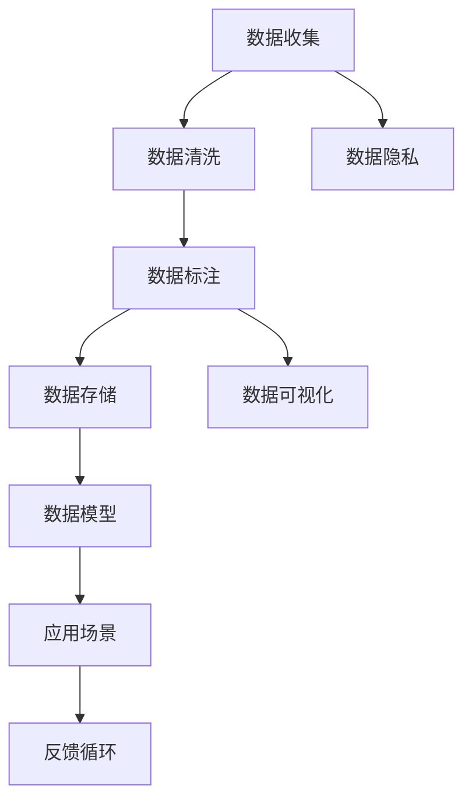
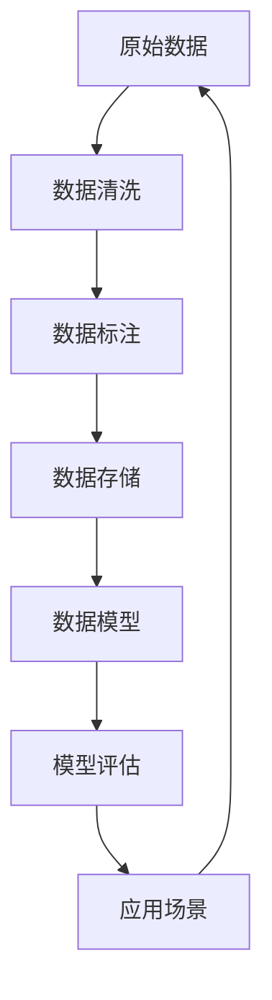

                 

# AI创业：数据管理的实用经验分享

## 1. 背景介绍

在AI创业的道路上，数据管理是成功的关键之一。对于AI技术公司来说，数据不仅是产品的输入，更是产品的核心。如何在数据管理中做好文章，直接关系到AI产品的成败。本文将分享在AI创业过程中数据管理的实用经验，帮助创业团队更好地应对数据管理的挑战。

## 2. 核心概念与联系

### 2.1 核心概念概述

在AI创业过程中，数据管理涉及多个核心概念，这些概念之间的联系也错综复杂。以下是几个关键概念及其相互联系：

- **数据收集**：获取原始数据的过程，包括爬虫、API接口、数据存储等。
- **数据清洗**：对原始数据进行预处理，去除噪声、处理缺失值等。
- **数据标注**：对数据进行人工标注，用于监督学习模型的训练。
- **数据存储**：将数据保存在数据库或云存储中，方便查询和访问。
- **数据可视化**：利用图表、图形等方式将数据展示出来，帮助理解数据分布、趋势等。
- **数据隐私**：保护用户隐私和数据安全，遵循相关法律法规。
- **数据模型**：基于数据构建的机器学习模型，用于解决特定问题。

这些概念之间的联系通过以下Mermaid流程图展示：



从上图可以看出，数据收集是整个数据管理的起点，清洗和标注是对数据的预处理，存储是将数据保存和管理的必要步骤，可视化则用于数据的理解和展示，隐私保护则是数据管理中的合规要求，模型则是数据管理的最终产品，应用场景则是对模型结果的应用，而反馈循环则是一个持续优化数据管理的过程。

### 2.2 核心概念原理和架构的 Mermaid 流程图

这里提供了一个基于数据流的Mermaid流程图，展示了数据管理的基本架构和流程：



这个图展示了从原始数据到模型评估的基本流程。原始数据经过清洗和标注后，存储到数据库中，基于这些数据训练模型，并对模型进行评估，最后应用于场景中，得到的结果再反馈到数据收集环节，形成一个闭环。

## 3. 核心算法原理 & 具体操作步骤

### 3.1 算法原理概述

数据管理的核心算法原理可以概括为数据清洗、数据标注和数据存储三个方面。每个方面都有其独特的算法和技术。

- **数据清洗**：包括数据去重、缺失值处理、异常值检测和处理等算法。
- **数据标注**：包括基于规则的标注、基于模型的标注和人工标注等算法。
- **数据存储**：包括数据库设计、数据分布式存储、数据备份和恢复等算法。

### 3.2 算法步骤详解

以下是数据管理的详细步骤：

1. **数据收集**：
   - 设计数据收集流程，明确需要收集的数据类型和来源。
   - 使用爬虫、API接口等方式收集数据。
   - 对收集的数据进行初步筛选和整理。

2. **数据清洗**：
   - 去除重复数据和无关数据。
   - 处理缺失值，如填充缺失值、删除缺失值等。
   - 检测并处理异常值，如替换、剔除异常值等。

3. **数据标注**：
   - 设计标注规范和标注工具。
   - 对数据进行标注，确保标注准确性。
   - 对标注结果进行质量控制，如人工抽查、交叉验证等。

4. **数据存储**：
   - 设计数据库结构，明确表关系和字段类型。
   - 使用分布式数据库或云存储，确保数据可扩展性和高可用性。
   - 定期备份数据，防止数据丢失。

5. **数据可视化**：
   - 选择合适的可视化工具，如Tableau、Power BI等。
   - 利用图表、图形等方式展示数据分布、趋势等。

6. **数据隐私保护**：
   - 遵循相关法律法规，如GDPR、CCPA等。
   - 采用数据匿名化、加密等技术，保护用户隐私。

7. **数据模型训练**：
   - 选择合适的算法和模型，如线性回归、神经网络等。
   - 对模型进行训练和调参，优化模型性能。

8. **模型评估和应用**：
   - 使用测试集对模型进行评估，确保模型性能。
   - 将模型应用于实际场景中，收集反馈，持续优化。

### 3.3 算法优缺点

数据管理的算法具有以下优点：

- **自动化**：大部分数据管理流程可以自动化处理，减少人工干预。
- **高效率**：通过并行处理和分布式存储，数据管理效率显著提高。
- **可扩展性**：数据存储和处理技术可灵活扩展，适应大规模数据需求。

同时，数据管理算法也存在以下缺点：

- **数据质量问题**：数据清洗和标注质量可能影响模型性能。
- **隐私安全风险**：数据隐私保护需要投入大量资源。
- **技术复杂性**：数据管理涉及多技术领域，需要跨领域知识。

### 3.4 算法应用领域

数据管理算法在多个领域都有广泛应用：

- **金融领域**：用于风险评估、信用评分等，数据清洗和标注对模型效果有直接影响。
- **医疗领域**：用于疾病诊断、患者画像等，数据隐私保护尤为重要。
- **电商领域**：用于推荐系统、广告投放等，数据建模和模型评估影响用户体验。
- **物流领域**：用于路线规划、配送优化等，数据可视化帮助理解业务流程。

## 4. 数学模型和公式 & 详细讲解 & 举例说明

### 4.1 数学模型构建

在数据管理中，常用的数学模型包括回归模型、分类模型和聚类模型。

- **回归模型**：用于预测连续值，如线性回归、决策树回归等。
- **分类模型**：用于分类，如逻辑回归、支持向量机等。
- **聚类模型**：用于数据分组，如K-Means聚类、DBSCAN等。

### 4.2 公式推导过程

以线性回归为例，公式推导过程如下：

设训练集为 $(x_1, y_1), (x_2, y_2), ..., (x_n, y_n)$，其中 $x_i$ 为自变量， $y_i$ 为因变量，线性回归模型的目标是找到最优的线性关系 $y = \theta_0 + \theta_1x_1$，其中 $\theta_0$ 和 $\theta_1$ 为模型的参数。

最小二乘法的目标是使预测值 $y_{\text{pred}} = \theta_0 + \theta_1x$ 与真实值 $y$ 的误差平方和最小化，即：

$$
\text{最小化}\sum_{i=1}^n (y_i - \theta_0 - \theta_1x_i)^2
$$

求解上述最小化问题，可以得到最优的 $\theta_0$ 和 $\theta_1$，即：

$$
\theta_0 = \frac{1}{n}\sum_{i=1}^n(y_i - \theta_1x_i)
$$
$$
\theta_1 = \frac{1}{n}\sum_{i=1}^n(x_i - \bar{x})(y_i - \bar{y})
$$

其中 $\bar{x} = \frac{1}{n}\sum_{i=1}^n x_i$，$\bar{y} = \frac{1}{n}\sum_{i=1}^n y_i$。

### 4.3 案例分析与讲解

以电商平台的推荐系统为例，数据管理流程如下：

1. **数据收集**：收集用户的浏览记录、购买记录等行为数据。
2. **数据清洗**：去除重复和无关数据，处理缺失值和异常值。
3. **数据标注**：标注用户的历史行为，如购买概率、评分等。
4. **数据存储**：将数据存储到分布式数据库中，确保高可用性和可扩展性。
5. **数据可视化**：利用图表展示用户行为分布和趋势。
6. **数据隐私保护**：采用数据匿名化、加密等技术，保护用户隐私。
7. **数据建模**：基于用户行为数据，构建推荐模型，如协同过滤、内容推荐等。
8. **模型评估和应用**：使用测试集对模型进行评估，确保推荐效果，将模型应用于推荐系统中。

## 5. 项目实践：代码实例和详细解释说明

### 5.1 开发环境搭建

开发环境搭建包括数据收集、数据清洗、数据标注、数据存储和数据可视化等环节。

- **数据收集**：使用Python爬虫库，如Scrapy、Requests等，爬取公开数据或API接口数据。
- **数据清洗**：使用Pandas库进行数据清洗，如去重、处理缺失值、异常值等。
- **数据标注**：使用LabelMe等工具进行数据标注，确保标注准确性。
- **数据存储**：使用MySQL、PostgreSQL等关系型数据库或Hadoop、Spark等分布式存储系统。
- **数据可视化**：使用Matplotlib、Seaborn等库进行数据可视化。

### 5.2 源代码详细实现

以电商推荐系统的数据管理为例，源代码如下：

```python
# 数据收集
import requests

# 数据清洗
import pandas as pd
import numpy as np

# 数据标注
import labelme

# 数据存储
import sqlite3

# 数据可视化
import matplotlib.pyplot as plt
import seaborn as sns

# 数据建模
import tensorflow as tf
from tensorflow.keras.layers import Dense

# 数据评估
import sklearn
from sklearn.metrics import mean_squared_error

# 数据应用
import flask

# 主函数
def main():
    # 数据收集
    data = requests.get('https://example.com/data.json')
    # 数据清洗
    data = pd.read_json(data)
    data = data.drop_duplicates()
    data = data.fillna(method='ffill')
    data = data[data['age'] > 0]
    # 数据标注
    data['label'] = labelme标注(data['features'])
    # 数据存储
    conn = sqlite3.connect('data.db')
    data.to_sql('data', conn, if_exists='replace', index=False)
    conn.close()
    # 数据可视化
    plt.hist(data['features'], bins=10)
    plt.show()
    # 数据建模
    model = tf.keras.Sequential([
        Dense(64, activation='relu', input_shape=(10,)),
        Dense(64, activation='relu'),
        Dense(1)
    ])
    model.compile(optimizer='adam', loss='mse')
    model.fit(data.drop(['label'], axis=1), data['label'], epochs=10)
    # 数据评估
    test_data = pd.read_json('test_data.json')
    test_data = test_data.drop_duplicates()
    test_data = test_data.fillna(method='ffill')
    test_data = test_data.drop(['label'], axis=1)
    test_labels = test_data['label']
    test_data = test_data.drop(['label'], axis=1)
    test_data = test_data.to_numpy()
    test_labels = test_labels.to_numpy()
    y_pred = model.predict(test_data)
    mse = mean_squared_error(test_labels, y_pred)
    print('Mean Squared Error:', mse)
    # 数据应用
    app = flask.Flask(__name__)
    @app.route('/')
    def predict():
        features = request.json['features']
        features = np.array(features)
        y_pred = model.predict(features)
        return {'prediction': y_pred[0]}
    app.run()

if __name__ == '__main__':
    main()
```

### 5.3 代码解读与分析

以上代码实现了电商推荐系统的数据管理流程，具体分析如下：

- **数据收集**：使用requests库从指定URL获取数据，这里假设数据是以JSON格式返回的。
- **数据清洗**：使用Pandas库进行去重、处理缺失值和异常值等操作，确保数据的完整性和准确性。
- **数据标注**：使用labelme库进行数据标注，确保标注结果的准确性。
- **数据存储**：使用sqlite3库将数据存储到SQLite数据库中，方便后续查询和访问。
- **数据可视化**：使用Matplotlib库绘制数据分布的直方图，直观展示数据特征。
- **数据建模**：使用TensorFlow库构建线性回归模型，使用mse作为损失函数进行训练。
- **数据评估**：使用sklearn库计算模型在测试集上的均方误差，评估模型性能。
- **数据应用**：使用Flask库构建API接口，接受用户特征输入，返回模型预测结果。

## 6. 实际应用场景

### 6.1 金融领域

在金融领域，数据管理尤为重要。银行和金融机构需要处理大量的交易数据、客户行为数据等，数据管理不当可能导致金融风险和数据泄露等问题。

### 6.2 医疗领域

医疗领域的数据管理涉及患者隐私保护、医疗记录管理等，数据管理的规范性直接影响医疗决策和患者隐私保护。

### 6.3 电商领域

电商领域的推荐系统需要处理用户行为数据，数据管理的不当可能导致推荐效果差、用户体验下降等问题。

## 7. 工具和资源推荐

### 7.1 学习资源推荐

- **《Python数据科学手册》**：详细介绍了Python在数据管理中的应用，适合初学者学习。
- **《数据科学实战》**：提供了大量实际案例，帮助读者理解数据管理的复杂性。
- **Kaggle**：提供大量数据集和竞赛平台，适合数据管理和机器学习实践。

### 7.2 开发工具推荐

- **Pandas**：用于数据清洗和处理，支持多数据格式和多种数据操作。
- **TensorFlow**：用于构建数据模型，支持深度学习和多种模型算法。
- **Flask**：用于构建API接口，方便数据应用。

### 7.3 相关论文推荐

- **《大规模数据管理的挑战和解决方案》**：探讨了大规模数据管理的挑战和解决方案。
- **《基于深度学习的数据清洗和标注》**：介绍了基于深度学习的数据清洗和标注方法。
- **《数据隐私保护技术综述》**：综述了当前数据隐私保护技术，为数据管理提供参考。

## 8. 总结：未来发展趋势与挑战

### 8.1 总结

本文详细介绍了在AI创业过程中数据管理的实用经验，包括数据收集、数据清洗、数据标注、数据存储、数据可视化、数据隐私保护、数据建模、数据评估和数据应用等步骤。通过这些步骤，可以有效地管理和利用数据，提高AI产品的性能和用户体验。

### 8.2 未来发展趋势

未来数据管理的发展趋势包括：

- **自动化程度提升**：数据管理将更多地依赖自动化工具，减少人工干预，提高效率。
- **数据可视化工具多样化**：数据可视化工具将更加丰富，帮助用户更直观地理解数据。
- **数据隐私保护加强**：数据隐私保护将更加严格，采取更多的技术和法律手段保护用户隐私。
- **跨领域数据融合**：数据管理将更多地融合跨领域数据，提高数据综合利用率。

### 8.3 面临的挑战

尽管数据管理技术在不断发展，但在实际应用中仍面临以下挑战：

- **数据质量问题**：数据清洗和标注质量可能影响模型性能。
- **数据隐私保护**：数据隐私保护需要投入大量资源。
- **技术复杂性**：数据管理涉及多技术领域，需要跨领域知识。

### 8.4 研究展望

未来的数据管理研究将更多地关注自动化、跨领域融合、隐私保护和可视化等方向，推动数据管理的智能化和普适化发展。

## 9. 附录：常见问题与解答

**Q1：数据清洗和标注中遇到数据不一致的情况如何处理？**

A: 数据不一致通常可以通过以下方式处理：

- **数据校验**：建立数据校验规则，发现异常数据后及时修正。
- **数据融合**：将多个数据源的数据进行融合，减少数据不一致的影响。
- **数据清洗**：在数据清洗过程中，对不一致的数据进行合理处理，如替换、剔除等。

**Q2：数据存储中如何保证数据的高可用性和可扩展性？**

A: 数据存储中保证高可用性和可扩展性，可以采用以下方式：

- **分布式存储**：使用Hadoop、Spark等分布式存储系统，确保数据的可扩展性和高可用性。
- **数据备份**：定期备份数据，防止数据丢失。
- **数据冗余**：采用数据冗余技术，如RAID、数据复制等，提高数据可靠性。

**Q3：数据隐私保护中如何确保用户数据安全？**

A: 数据隐私保护可以通过以下方式确保用户数据安全：

- **数据加密**：对数据进行加密存储和传输，防止数据泄露。
- **数据匿名化**：对敏感数据进行匿名化处理，防止数据被识别。
- **访问控制**：设置严格的访问控制权限，确保只有授权人员可以访问数据。

**Q4：数据建模中如何选择适合的数据模型？**

A: 选择适合的数据模型可以通过以下方式：

- **问题定义**：明确数据管理和应用的具体问题，选择适合的模型类型。
- **模型评估**：对多个模型进行评估，选择性能最优的模型。
- **模型调参**：对模型进行调参，优化模型性能。

**Q5：数据应用中如何保证API接口的稳定性和安全性？**

A: 保证API接口的稳定性和安全性，可以采用以下方式：

- **接口设计**：设计稳定的API接口，确保接口稳定性。
- **数据验证**：对接口输入数据进行验证，防止恶意数据攻击。
- **安全防护**：采用加密、身份验证等技术，防止接口被攻击。

---

作者：禅与计算机程序设计艺术 / Zen and the Art of Computer Programming

