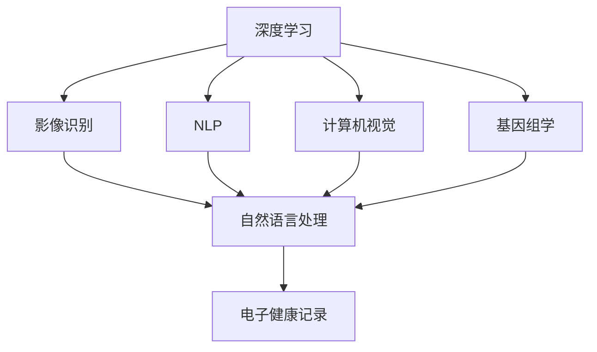

                 

# AI在医疗诊断中的应用与挑战

## 1. 背景介绍

### 1.1 问题由来
随着人工智能技术的快速发展，AI在医疗诊断领域的应用也逐渐成熟，并在诸多方面展现出其潜力。AI可以通过分析医学影像、医疗记录、基因数据等多种医疗数据，辅助医生进行疾病的早期诊断、个性化治疗方案的制定等。然而，尽管AI在医疗诊断中取得了显著进展，其应用仍面临诸多挑战。这些问题不仅关系到AI诊断的准确性和可信度，更影响到其在临床实践中的推广和普及。本文将对AI在医疗诊断中的应用及其挑战进行系统阐述，以期为相关领域的从业者提供一些有益的参考。

### 1.2 问题核心关键点
AI在医疗诊断中的应用主要集中在以下几个方面：
- **影像识别**：利用深度学习模型对医学影像进行识别和分析，如X光片、CT扫描、MRI等。
- **自然语言处理**：通过NLP技术分析医疗记录、病历、临床报告等文本数据，提取关键信息。
- **基因组学**：利用机器学习算法对基因序列进行分析和预测，发现潜在的疾病基因和遗传变异。
- **电子健康记录（EHR）**：通过AI技术对患者的历史医疗数据进行分析，提高诊疗效率和准确性。

这些应用领域的共同点在于，都涉及从复杂的医疗数据中提取有价值的信息，并对这些信息进行分析和解读。然而，这些应用也面临共同的问题，如数据质量、算法透明度、伦理和法律问题等。

## 2. 核心概念与联系

### 2.1 核心概念概述

AI在医疗诊断中的应用涉及多个核心概念，包括：

- **深度学习（Deep Learning）**：利用多层神经网络对复杂数据进行学习和分析，广泛应用于影像识别、自然语言处理等领域。
- **自然语言处理（NLP）**：通过机器学习技术对文本数据进行处理和分析，提取结构化信息。
- **计算机视觉（CV）**：使用图像处理技术对医学影像进行识别和分析。
- **基因组学（Genomics）**：通过对基因序列数据的分析，预测疾病风险、指导个性化治疗。
- **电子健康记录（EHR）**：对患者的电子健康数据进行管理和分析，提高诊疗效率。

这些概念之间的逻辑关系可以通过以下Mermaid流程图来展示：



这个流程图展示了AI在医疗诊断中的各个应用领域，以及它们之间的联系和互动。深度学习、NLP、计算机视觉和基因组学是AI在医疗诊断中常用的技术手段，而电子健康记录则是这些技术应用的重要数据来源。

## 3. 核心算法原理 & 具体操作步骤
### 3.1 算法原理概述

AI在医疗诊断中的应用主要基于监督学习和非监督学习两种机器学习范式：

- **监督学习（Supervised Learning）**：利用已标注的数据训练模型，使其能够预测新数据的标签。在医疗诊断中，这通常涉及对医学影像、病历文本等进行标注，然后利用这些标注数据训练模型。
- **非监督学习（Unsupervised Learning）**：在不依赖标注数据的情况下，通过分析数据的内在结构和模式，自动学习数据的特征和结构。在医疗诊断中，这可用于基因组学中的遗传变异识别等。

AI在医疗诊断中的应用通常遵循以下步骤：

1. **数据收集**：从各种数据源收集相关的医疗数据，如医学影像、病历、基因数据等。
2. **数据预处理**：对收集到的数据进行清洗、归一化和标准化处理，以便于后续的模型训练。
3. **模型训练**：选择合适的机器学习算法，如卷积神经网络（CNN）、循环神经网络（RNN）、长短期记忆网络（LSTM）等，在标注数据上进行训练。
4. **模型评估**：在验证集上评估模型的性能，调整模型参数以优化模型性能。
5. **模型部署**：将训练好的模型部署到实际应用中，进行疾病诊断、治疗方案推荐等。

### 3.2 算法步骤详解

以医学影像识别为例，介绍AI在医疗诊断中的具体操作步骤：

1. **数据收集**：从医院和诊所收集大量的医学影像数据，如X光片、CT扫描、MRI等。这些数据需要经过标注，标明影像中存在的病变区域和类型。
2. **数据预处理**：对影像数据进行预处理，包括调整尺寸、归一化、标准化等。同时，使用图像增强技术，如翻转、旋转、缩放等，扩充训练数据集。
3. **模型训练**：利用深度学习模型，如卷积神经网络（CNN），在标注数据上进行训练。训练过程中，使用交叉熵损失函数和随机梯度下降（SGD）等优化算法。
4. **模型评估**：在验证集上评估模型的性能，如准确率、召回率、F1分数等。根据评估结果，调整模型参数，优化模型性能。
5. **模型部署**：将训练好的模型部署到实际应用中，对新的医学影像进行实时诊断。

### 3.3 算法优缺点

AI在医疗诊断中的应用具有以下优点：
- **提高诊断效率**：AI可以处理大量的医疗数据，快速识别病变区域，提供诊断建议。
- **降低误诊率**：AI可以通过多轮训练和优化，提高诊断的准确性和一致性。
- **个性化治疗方案**：AI可以分析患者的基因数据，提供个性化的治疗方案。

然而，AI在医疗诊断中的应用也存在一些缺点：
- **数据质量问题**：AI模型的性能很大程度上取决于输入数据的质量。如果数据存在噪声、标注不准确等问题，模型的性能将受到影响。
- **算法透明度问题**：AI模型通常被视为“黑箱”，其决策过程难以解释，导致医生对诊断结果的信任度下降。
- **伦理和法律问题**：AI在医疗诊断中的应用可能涉及隐私保护、数据安全和责任归属等问题，需要严格的法律和伦理规范。

### 3.4 算法应用领域

AI在医疗诊断中的应用广泛，涉及以下几个领域：

- **影像识别**：利用深度学习模型对医学影像进行识别和分析，如X光片、CT扫描、MRI等。
- **自然语言处理**：通过NLP技术分析医疗记录、病历、临床报告等文本数据，提取关键信息。
- **基因组学**：利用机器学习算法对基因序列进行分析和预测，发现潜在的疾病基因和遗传变异。
- **电子健康记录（EHR）**：通过AI技术对患者的历史医疗数据进行分析，提高诊疗效率和准确性。

这些应用领域的共同点在于，都涉及从复杂的医疗数据中提取有价值的信息，并对这些信息进行分析和解读。然而，这些应用也面临共同的问题，如数据质量、算法透明度、伦理和法律问题等。

## 4. 数学模型和公式 & 详细讲解 & 举例说明

### 4.1 数学模型构建

在AI医疗诊断中，常用的数学模型包括：

- **卷积神经网络（CNN）**：用于图像识别和分类任务，如图像中的病变区域检测。
- **循环神经网络（RNN）**：用于序列数据的处理，如自然语言处理任务中的文本分类和情感分析。
- **长短期记忆网络（LSTM）**：用于处理时间序列数据，如基因组学中的遗传变异预测。

以卷积神经网络为例，介绍其基本结构和训练过程。

卷积神经网络由多个卷积层、池化层和全连接层组成，其结构如下图所示：

```plaintext
Layer | Input Shape | Output Shape
------|-------------|-------------
Conv1 | [H, W, C]   | [H', W', C']
MaxPool| [H', W', C'] | [H', W', C']
Conv2 | [H', W', C'] | [H', W', C']
MaxPool| [H', W', C'] | [H', W', C']
Flatten | [H', W', C'] | [N, C']
Dense   | [N, C']     | [N, Output]
```

其中，$H$、$W$和$C$分别为输入的图像的高度、宽度和通道数，$H'$、$W'$和$C'$分别为卷积层和池化层输出的高度、宽度和通道数，$N$为输入样本数，$Output$为输出层的节点数。

### 4.2 公式推导过程

以CNN为例，介绍其在医学影像识别中的应用。

假设医学影像为二维数组$X=\{x_{ij}\}$，卷积核为$W=\{w_{mn}\}$，则卷积操作可以表示为：

$$
Y_{kl}=\sum_{m=0}^{W_H-1}\sum_{n=0}^{W_W-1}X_{i-m,j-n}w_{mn}
$$

其中，$k$和$l$分别表示输出图像的高度和宽度。

对于医学影像识别任务，常用的损失函数为交叉熵损失函数：

$$
\ell(y,\hat{y})=-\frac{1}{N}\sum_{i=1}^N(y_i\log\hat{y}_i+(1-y_i)\log(1-\hat{y}_i))
$$

其中，$y$为真实标签，$\hat{y}$为模型预测的概率分布，$N$为样本数。

### 4.3 案例分析与讲解

以医学影像识别为例，介绍AI在医疗诊断中的应用。

假设我们有一组医学影像数据，其中包含正常影像和异常影像。我们的目标是训练一个CNN模型，能够区分这些影像是否存在病变区域。

1. **数据准备**：将影像数据调整为相同的尺寸，并进行归一化处理。同时，将影像数据和标签进行混合，生成训练集和验证集。
2. **模型训练**：使用交叉熵损失函数和随机梯度下降算法，训练CNN模型。在训练过程中，不断调整卷积核和池化层的参数，以优化模型性能。
3. **模型评估**：在验证集上评估模型的性能，如准确率、召回率、F1分数等。根据评估结果，调整模型参数，优化模型性能。
4. **模型部署**：将训练好的模型部署到实际应用中，对新的医学影像进行实时诊断。

## 5. 项目实践：代码实例和详细解释说明

### 5.1 开发环境搭建

在进行AI医疗诊断项目实践前，我们需要准备好开发环境。以下是使用Python进行TensorFlow开发的环境配置流程：

1. 安装Anaconda：从官网下载并安装Anaconda，用于创建独立的Python环境。

2. 创建并激活虚拟环境：
```bash
conda create -n tf-env python=3.8 
conda activate tf-env
```

3. 安装TensorFlow：根据CUDA版本，从官网获取对应的安装命令。例如：
```bash
conda install tensorflow==2.6
```

4. 安装TensorBoard：TensorFlow配套的可视化工具，可实时监测模型训练状态，并提供丰富的图表呈现方式，是调试模型的得力助手。

5. 安装各类工具包：
```bash
pip install numpy pandas scikit-learn matplotlib tqdm jupyter notebook ipython
```

完成上述步骤后，即可在`tf-env`环境中开始AI医疗诊断实践。

### 5.2 源代码详细实现

下面我们以医学影像识别为例，给出使用TensorFlow进行深度学习模型开发的PyTorch代码实现。

首先，定义医学影像数据处理函数：

```python
import tensorflow as tf
from tensorflow.keras.preprocessing.image import ImageDataGenerator

def preprocess_data(input_path, output_path, batch_size):
    train_datagen = ImageDataGenerator(
        rescale=1./255,
        shear_range=0.2,
        zoom_range=0.2,
        horizontal_flip=True)
    
    train_generator = train_datagen.flow_from_directory(
        input_path,
        target_size=(224, 224),
        batch_size=batch_size,
        class_mode='binary')
    
    val_datagen = ImageDataGenerator(
        rescale=1./255)
    
    val_generator = val_datagen.flow_from_directory(
        output_path,
        target_size=(224, 224),
        batch_size=batch_size,
        class_mode='binary')
    
    return train_generator, val_generator
```

然后，定义深度学习模型：

```python
from tensorflow.keras.models import Sequential
from tensorflow.keras.layers import Conv2D, MaxPooling2D, Flatten, Dense

def build_model():
    model = Sequential([
        Conv2D(32, (3, 3), activation='relu', input_shape=(224, 224, 3)),
        MaxPooling2D((2, 2)),
        Conv2D(64, (3, 3), activation='relu'),
        MaxPooling2D((2, 2)),
        Conv2D(128, (3, 3), activation='relu'),
        MaxPooling2D((2, 2)),
        Flatten(),
        Dense(128, activation='relu'),
        Dense(1, activation='sigmoid')
    ])
    
    model.compile(
        optimizer='adam',
        loss='binary_crossentropy',
        metrics=['accuracy'])
    
    return model
```

接着，定义训练和评估函数：

```python
from tensorflow.keras.callbacks import EarlyStopping

def train_model(model, train_generator, val_generator, epochs):
    early_stopping = EarlyStopping(patience=5, restore_best_weights=True)
    
    model.fit(
        train_generator,
        validation_data=val_generator,
        epochs=epochs,
        callbacks=[early_stopping])
    
def evaluate_model(model, val_generator):
    val_loss, val_acc = model.evaluate(val_generator)
    print(f'Val loss: {val_loss}, Val acc: {val_acc}')
```

最后，启动训练流程并在验证集上评估：

```python
epochs = 20
batch_size = 16

train_generator, val_generator = preprocess_data('train', 'val', batch_size)

model = build_model()

train_model(model, train_generator, val_generator, epochs)

evaluate_model(model, val_generator)
```

以上就是使用TensorFlow进行医学影像识别任务开发的完整代码实现。可以看到，TensorFlow提供了一系列的高级API，可以方便地构建、训练和评估深度学习模型。

### 5.3 代码解读与分析

让我们再详细解读一下关键代码的实现细节：

**preprocess_data函数**：
- 定义了两个ImageDataGenerator对象，分别用于训练集和验证集的生成。
- 对图像进行归一化、随机裁剪、翻转等预处理操作，生成增强数据集。
- 使用flow_from_directory方法加载数据，并设定批大小和类别模式。

**build_model函数**：
- 定义了一个Sequential模型，包含多个卷积层、池化层和全连接层。
- 使用ReLU激活函数和sigmoid输出层，适用于二分类任务。
- 使用adam优化器和二元交叉熵损失函数。

**train_model函数**：
- 定义了一个EarlyStopping回调函数，用于提前停止训练，避免过拟合。
- 使用fit方法进行模型训练，并在验证集上评估模型性能。
- 将训练过程中保存的最佳模型权重进行恢复。

**evaluate_model函数**：
- 使用evaluate方法在验证集上评估模型性能，并输出损失和准确率。

可以看到，TensorFlow提供了一整套简洁易用的API，使得深度学习模型的开发和训练变得高效便捷。

## 6. 实际应用场景

### 6.1 智能诊断系统

智能诊断系统是AI在医疗诊断中最常见的应用之一。传统诊断系统依赖医生的经验，难以在短时间内处理大量患者，且诊断结果的一致性和准确性存在差异。而基于AI的智能诊断系统，可以实时分析患者的症状、历史数据等，提供诊断建议和治疗方案，从而大大提高诊疗效率和诊断准确性。

在技术实现上，智能诊断系统通常包括：
- 数据收集：从电子健康记录、医疗影像、基因组数据等多种渠道收集数据。
- 数据预处理：对收集到的数据进行清洗、归一化、标准化处理。
- 模型训练：使用深度学习模型对数据进行训练，生成诊断模型。
- 模型评估：在验证集上评估模型性能，调整模型参数以优化模型性能。
- 模型部署：将训练好的模型部署到实际应用中，进行疾病诊断。

智能诊断系统的应用场景包括：
- 影像诊断：利用深度学习模型对医学影像进行识别和分析，如X光片、CT扫描、MRI等。
- 症状分析：通过NLP技术分析患者的症状描述，提供初步的诊断建议。
- 基因组学分析：利用机器学习算法对基因序列进行分析和预测，提供个性化的治疗方案。

### 6.2 个性化治疗方案

个性化治疗方案是AI在医疗诊断中的另一个重要应用。传统医疗方案往往一概而论，难以满足个体差异。而基于AI的个性化治疗方案，可以根据患者的基因数据、病历记录等，提供个性化的治疗建议，从而提高治疗效果和患者的满意度。

在技术实现上，个性化治疗方案通常包括：
- 数据收集：从电子健康记录、基因组数据等多种渠道收集数据。
- 数据预处理：对收集到的数据进行清洗、归一化、标准化处理。
- 模型训练：使用机器学习模型对数据进行训练，生成治疗方案模型。
- 模型评估：在验证集上评估模型性能，调整模型参数以优化模型性能。
- 模型部署：将训练好的模型部署到实际应用中，进行个性化治疗方案推荐。

个性化治疗方案的应用场景包括：
- 癌症治疗：根据患者的基因数据，提供个性化的治疗方案，提高治疗效果。
- 心脏病治疗：根据患者的基因数据，提供个性化的治疗方案，降低复发风险。
- 糖尿病治疗：根据患者的基因数据，提供个性化的治疗方案，控制血糖水平。

### 6.3 电子健康记录（EHR）系统

电子健康记录（EHR）系统是AI在医疗诊断中的重要应用之一。EHR系统通过整合患者的电子健康数据，提供全面的健康管理和诊疗支持。基于AI的EHR系统可以自动提取和分析患者的健康数据，提供个性化的诊疗建议，从而提高诊疗效率和准确性。

在技术实现上，EHR系统通常包括：
- 数据收集：从医院、诊所、社区卫生服务中心等渠道收集电子健康数据。
- 数据预处理：对收集到的数据进行清洗、归一化、标准化处理。
- 模型训练：使用机器学习模型对数据进行训练，生成EHR系统。
- 模型评估：在验证集上评估模型性能，调整模型参数以优化模型性能。
- 模型部署：将训练好的模型部署到实际应用中，提供个性化的诊疗建议。

EHR系统的应用场景包括：
- 健康管理：根据患者的电子健康数据，提供个性化的健康管理建议。
- 诊疗支持：根据患者的电子健康数据，提供个性化的诊疗建议。
- 数据分析：通过分析患者的电子健康数据，发现潜在的健康问题，进行早期干预。

### 6.4 未来应用展望

随着AI技术的发展，其在医疗诊断中的应用将更加广泛和深入。未来，AI在医疗诊断中的应用可能包括：

- **AI辅助手术**：通过AI技术辅助外科医生进行手术操作，提高手术的成功率和安全性。
- **实时监测系统**：利用AI技术对患者的生理数据进行实时监测，提供个性化的健康管理建议。
- **智能药物研发**：通过AI技术分析药物分子和基因数据，发现潜在的药物靶点，加速新药研发进程。
- **自然语言问诊系统**：利用NLP技术分析患者的症状描述，提供个性化的诊疗建议。

以上这些应用领域的探索，将进一步推动AI在医疗诊断中的发展和应用，为人类健康提供更高效、更精准、更个性化的解决方案。

## 7. 工具和资源推荐

### 7.1 学习资源推荐

为了帮助开发者系统掌握AI在医疗诊断中的应用，这里推荐一些优质的学习资源：

1. **《深度学习在医疗领域的应用》**：介绍深度学习在医疗影像识别、自然语言处理、电子健康记录等领域的应用。
2. **《医学图像分析：原理与实践》**：介绍医学影像识别和分类的基本原理和实现方法。
3. **《自然语言处理与医疗》**：介绍NLP技术在医疗文本分析中的应用。
4. **《基因组学与人工智能》**：介绍基因组学与机器学习的基本概念和应用方法。
5. **《TensorFlow官方文档》**：提供TensorFlow的详细文档和API参考，适用于深度学习模型的开发和训练。

通过对这些资源的学习实践，相信你一定能够快速掌握AI在医疗诊断中的应用，并用于解决实际的医疗问题。

### 7.2 开发工具推荐

高效的开发离不开优秀的工具支持。以下是几款用于AI医疗诊断开发的常用工具：

1. **TensorFlow**：由Google主导开发的开源深度学习框架，生产部署方便，适合大规模工程应用。
2. **PyTorch**：由Facebook主导开发的深度学习框架，灵活性高，适用于研究和原型开发。
3. **Keras**：基于TensorFlow和Theano的高级API，简单易用，适合快速原型开发。
4. **Scikit-learn**：Python的机器学习库，包含各种经典算法，适用于数据分析和模型训练。
5. **Pandas**：Python的数据处理库，适用于数据清洗和预处理。

合理利用这些工具，可以显著提升AI医疗诊断任务的开发效率，加快创新迭代的步伐。

### 7.3 相关论文推荐

AI在医疗诊断中的应用源于学界的持续研究。以下是几篇奠基性的相关论文，推荐阅读：

1. **《基于深度学习的医学影像识别》**：介绍深度学习在医学影像识别中的应用。
2. **《自然语言处理在医疗中的应用》**：介绍NLP技术在医疗文本分析中的应用。
3. **《机器学习在基因组学中的应用》**：介绍机器学习在基因组学中的基本原理和应用方法。
4. **《电子健康记录的机器学习分析》**：介绍机器学习在电子健康记录中的应用。
5. **《AI在医疗诊断中的应用前景》**：介绍AI在医疗诊断中的潜在应用和挑战。

这些论文代表了大规模AI在医疗诊断中的应用方向，将为你提供深入的理论支持和实践指导。

## 8. 总结：未来发展趋势与挑战

### 8.1 总结

本文对AI在医疗诊断中的应用进行了系统阐述，重点介绍了深度学习、自然语言处理、计算机视觉和基因组学在医疗诊断中的应用，以及其面临的挑战和解决方案。AI在医疗诊断中的应用能够显著提高诊断效率、降低误诊率，并为个性化治疗方案提供支持。然而，AI在医疗诊断中的应用也面临数据质量、算法透明度、伦理和法律等问题。

通过本文的系统梳理，可以看到，AI在医疗诊断中的应用前景广阔，但如何将强大的性能转化为稳定、高效、安全的业务价值，还需要工程实践的不断打磨。唯有从数据、算法、工程、业务等多个维度协同发力，才能真正实现AI在医疗诊断中的规模化落地。

### 8.2 未来发展趋势

展望未来，AI在医疗诊断中的应用将呈现以下几个发展趋势：

1. **模型规模持续增大**：随着算力成本的下降和数据规模的扩张，AI模型规模将持续增大，带来更高的诊断准确性和泛化能力。
2. **微调技术不断优化**：未来将涌现更多微调技术，如参数高效微调、自监督学习等，以提高模型性能和计算效率。
3. **跨领域知识融合**：AI将更多地与符号化的先验知识相结合，如知识图谱、逻辑规则等，提高诊断模型的精确性和可靠性。
4. **实时监测系统普及**：利用AI技术对患者的生理数据进行实时监测，提供个性化的健康管理建议。
5. **智能药物研发加速**：通过AI技术分析药物分子和基因数据，发现潜在的药物靶点，加速新药研发进程。
6. **自然语言问诊系统发展**：利用NLP技术分析患者的症状描述，提供个性化的诊疗建议。

以上这些趋势将推动AI在医疗诊断中的进一步发展和应用，为人类健康提供更高效、更精准、更个性化的解决方案。

### 8.3 面临的挑战

尽管AI在医疗诊断中的应用已经取得了显著进展，但在实际应用中仍面临诸多挑战：

1. **数据质量问题**：AI模型的性能很大程度上取决于输入数据的质量。数据中的噪声、标注不准确等问题，将影响模型的训练和性能。
2. **算法透明度问题**：AI模型通常被视为“黑箱”，其决策过程难以解释，导致医生对诊断结果的信任度下降。
3. **伦理和法律问题**：AI在医疗诊断中的应用可能涉及隐私保护、数据安全和责任归属等问题，需要严格的法律和伦理规范。
4. **资源瓶颈问题**：大规模AI模型的训练和推理，对算力、内存、存储等资源提出高要求，难以在实际应用中快速部署。
5. **模型鲁棒性问题**：AI模型面对域外数据时，泛化性能往往大打折扣，容易受到噪声数据和异常情况的影响。

这些挑战将需要学界和产业界共同努力，才能克服AI在医疗诊断中的应用障碍，推动其健康发展。

### 8.4 研究展望

面向未来，AI在医疗诊断中的研究可以从以下几个方向进行：

1. **无监督学习和自监督学习**：探索无监督学习和自监督学习方法，降低对标注数据的需求，提高模型的泛化能力。
2. **跨领域知识融合**：将符号化的先验知识，如知识图谱、逻辑规则等，与神经网络模型进行融合，提高诊断模型的精确性和可靠性。
3. **参数高效和计算高效**：开发更多参数高效和计算高效的微调方法，提高模型的性能和效率。
4. **跨模态学习**：将视觉、语音、文本等多种模态数据进行融合，提高AI在医疗诊断中的表现。
5. **模型解释性**：开发可解释性强的AI模型，提高医生对诊断结果的信任度。
6. **伦理和法律规范**：制定伦理和法律规范，保障AI在医疗诊断中的安全性和合法性。

这些研究方向将引领AI在医疗诊断中的进一步发展，推动其技术成熟和应用普及，为人类的健康事业提供更强大的支持。

## 9. 附录：常见问题与解答

**Q1：AI在医疗诊断中的优势和局限性是什么？**

A: AI在医疗诊断中的优势在于其能够处理大量数据，提高诊断效率和准确性，个性化治疗方案，实时监测系统等。然而，其局限性在于数据质量问题、算法透明度问题、伦理和法律问题等。

**Q2：如何提高AI在医疗诊断中的性能？**

A: 提高AI在医疗诊断中的性能可以从以下几个方面入手：
1. 收集高质量的数据，并进行清洗和预处理。
2. 选择合适的模型架构和训练方法，如深度学习、自监督学习等。
3. 使用数据增强和对抗训练等技术，提高模型的鲁棒性和泛化能力。
4. 进行模型解释性研究，提高医生对诊断结果的信任度。
5. 制定伦理和法律规范，保障AI在医疗诊断中的安全性和合法性。

**Q3：AI在医疗诊断中面临哪些伦理和法律问题？**

A: AI在医疗诊断中面临的伦理和法律问题主要包括：
1. 隐私保护：AI模型需要访问大量患者数据，如何保护患者的隐私信息。
2. 数据安全：患者数据泄露和滥用等问题，如何确保数据的安全性。
3. 责任归属：AI模型在诊疗过程中出现误诊等问题，如何确定责任归属。
4. 公平性：AI模型在诊断过程中是否存在偏见，如何保证诊断的公平性。

这些问题的解决需要法律和伦理规范的支持，确保AI在医疗诊断中的安全性和合法性。

**Q4：AI在医疗诊断中的未来发展方向是什么？**

A: AI在医疗诊断中的未来发展方向包括：
1. 无监督学习和自监督学习，提高模型的泛化能力。
2. 跨领域知识融合，提高诊断模型的精确性和可靠性。
3. 参数高效和计算高效，提高模型的性能和效率。
4. 跨模态学习，将视觉、语音、文本等多种模态数据进行融合。
5. 模型解释性，提高医生对诊断结果的信任度。
6. 伦理和法律规范，保障AI在医疗诊断中的安全性和合法性。

这些方向的研究将推动AI在医疗诊断中的进一步发展和应用，为人类的健康事业提供更强大的支持。

---

作者：禅与计算机程序设计艺术 / Zen and the Art of Computer Programming

