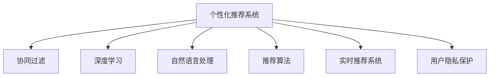

                 

# AI在旅游业中的应用：个性化推荐

> 关键词：个性化推荐, 旅游业, 深度学习, 机器学习, 自然语言处理, 推荐算法, 用户体验

## 1. 背景介绍

### 1.1 问题由来
随着信息技术的飞速发展，旅游业正经历一场深刻的数字化转型。越来越多的旅游企业开始依托数据和算法驱动业务，提升运营效率和服务质量。其中，个性化推荐系统（Personalized Recommendation System, PRS）作为提升用户体验的重要手段，在机票预订、酒店预定、景区门票购买等多个场景中得到了广泛应用。

个性化推荐系统的目标是基于用户的兴趣和行为，为其推荐最合适的旅游产品和服务，从而提高用户满意度和转化率。通过数据分析和算法优化，系统能够不断学习用户偏好，实现精准推荐，帮助用户快速找到满意选择，同时也能为商家提供精准的营销信息。

### 1.2 问题核心关键点
本文聚焦于如何构建适用于旅游业的个性化推荐系统，重点讨论以下几个关键点：

- 个性化推荐的核心原理和算法架构
- 深度学习在个性化推荐中的应用
- 自然语言处理在旅游推荐中的角色
- 实时推荐系统的实现技术
- 用户隐私保护与数据安全

通过本文的系统梳理，将帮助旅游企业和开发者深入理解个性化推荐系统的工作机制和实践细节，掌握构建高效、可扩展的推荐系统的关键技术。

## 2. 核心概念与联系

### 2.1 核心概念概述

为更好地理解本文所介绍的个性化推荐系统，本节将介绍几个密切相关的核心概念：

- 个性化推荐系统（Personalized Recommendation System, PRS）：通过分析用户行为数据，预测用户可能感兴趣的产品或服务，并提供个性化推荐，以提升用户体验的系统。
- 协同过滤（Collaborative Filtering, CF）：基于用户-物品交互矩阵，通过寻找与目标用户相似用户的行为来推荐物品，常用的方法包括基于用户的CF和基于物品的CF。
- 深度学习（Deep Learning, DL）：一类基于神经网络的机器学习方法，通过多层非线性变换提取数据特征，适用于复杂模式识别和预测任务。
- 自然语言处理（Natural Language Processing, NLP）：研究计算机如何理解和生成自然语言的技术，在文本数据分析和处理中具有重要作用。
- 推荐算法（Recommendation Algorithm）：用于个性化推荐系统的算法，包括基于内容、协同过滤、矩阵分解等。
- 实时推荐系统（Real-time Recommendation System）：能够快速响应用户请求，实时更新推荐结果的系统，适用于动态变化的场景，如在线电商、社交网络等。

这些核心概念之间的逻辑关系可以通过以下Mermaid流程图来展示：



这个流程图展示了个性化推荐系统的核心概念及其之间的关系：

1. 个性化推荐系统通过协同过滤、深度学习、自然语言处理等技术，构建推荐算法，实现个性化推荐。
2. 实时推荐系统为个性化推荐提供快速响应机制，适用于动态变化的用户需求。
3. 用户隐私保护是个性化推荐系统的重要组成部分，确保用户数据的安全和隐私。

## 3. 核心算法原理 & 具体操作步骤
### 3.1 算法原理概述

基于深度学习的个性化推荐系统，本质上是一种数据驱动的决策支持系统。其核心思想是：通过学习用户的历史行为数据和物品属性信息，预测用户对每个物品的评分，然后根据评分排序，选取前N个物品作为推荐结果。

具体来说，假设用户集合为$U=\{u_1, u_2, ..., u_M\}$，物品集合为$I=\{i_1, i_2, ..., i_N\}$，用户$u_m$对物品$i_n$的评分记为$x_{mn}$。深度学习模型$M$通过学习这些评分数据，构建一个映射函数$f$，将用户和物品映射到向量空间$\mathbb{R}^D$，使得向量之间的距离可以衡量用户对物品的兴趣程度。推荐算法的基本流程如下：

1. 将用户和物品表示为向量。
2. 计算用户和物品之间的距离。
3. 排序推荐物品，选取前N个作为推荐结果。

### 3.2 算法步骤详解

基于深度学习的个性化推荐系统一般包括以下几个关键步骤：

**Step 1: 数据准备**
- 收集用户行为数据，包括用户的浏览、点击、购买等行为记录。
- 收集物品属性数据，如物品的类别、价格、评分等。
- 将用户-物品评分矩阵$X$转化为Tensor形式，准备输入深度学习模型。

**Step 2: 构建深度学习模型**
- 选择合适的深度学习模型架构，如基于神经网络的推荐系统、注意力机制的模型等。
- 对模型进行训练，最小化预测评分与实际评分之间的差距。
- 保存训练好的模型参数，用于后续的推荐计算。

**Step 3: 构建推荐引擎**
- 将用户和物品输入深度学习模型，得到评分预测。
- 对预测评分进行排序，选取前N个物品作为推荐结果。
- 对推荐结果进行归一化处理，确保推荐结果的一致性和可解释性。

**Step 4: 实时推荐**
- 通过WebSockets、消息队列等方式，实现与用户端的数据实时通信。
- 根据用户的实时行为和偏好，动态更新推荐结果。
- 及时将推荐结果反馈给用户，提升用户体验。

### 3.3 算法优缺点

基于深度学习的个性化推荐系统具有以下优点：

1. 自动化程度高。无需人工干预，系统能自动分析用户行为数据，发现用户偏好。
2. 准确率高。深度学习模型通过大量数据训练，具备强大的数据拟合能力，能提供高质量的推荐结果。
3. 可扩展性好。深度学习模型具有良好的泛化能力，可轻松扩展到不同类型和规模的推荐任务。
4. 用户体验好。实时推荐能迅速响应用户需求，提供个性化的推荐服务，提升用户满意度。

同时，该方法也存在一定的局限性：

1. 数据需求高。深度学习模型需要大量标注数据进行训练，数据获取和标注成本较高。
2. 计算复杂。深度学习模型的训练和推理过程需要大量计算资源，硬件成本较高。
3. 解释性不足。深度学习模型通常是"黑盒"模型，难以解释推荐结果背后的原因。
4. 用户隐私风险。用户行为数据涉及敏感信息，需要妥善保护，避免数据泄露和滥用。

尽管存在这些局限性，但就目前而言，基于深度学习的个性化推荐系统仍然是推荐系统的主流范式。未来相关研究的重点在于如何进一步降低推荐系统的数据需求，提高计算效率，增强模型的可解释性和用户隐私保护。

### 3.4 算法应用领域

基于深度学习的个性化推荐系统在多个领域得到了广泛应用，包括但不限于：

- 电子商务：推荐商品、优惠信息等，提升用户购买率和满意度。
- 视频流媒体：推荐电影、电视剧等，提升用户观看体验。
- 在线教育：推荐课程、教材等，提升学习效果。
- 旅游业：推荐景点、酒店等，提升用户旅行体验。
- 社交网络：推荐好友、内容等，增强用户互动和粘性。

在旅游业中，个性化推荐系统可以应用于以下场景：

- 机票预订：推荐用户可能感兴趣的航班、日期、价格等，提升预订率。
- 酒店预定：推荐用户可能喜欢的酒店、房型、位置等，提升预定率。
- 景区门票购买：推荐用户可能感兴趣的景点、季节、行程等，提升购买率。
- 旅游套餐推荐：推荐组合式的旅游产品，提升用户满意度和粘性。

## 4. 数学模型和公式 & 详细讲解 & 举例说明

### 4.1 数学模型构建

本节将使用数学语言对深度学习在个性化推荐系统中的应用进行更加严格的刻画。

记用户集合为$U=\{u_1, u_2, ..., u_M\}$，物品集合为$I=\{i_1, i_2, ..., i_N\}$，用户$u_m$对物品$i_n$的评分记为$x_{mn}$。定义用户和物品的向量表示为$\mathbf{u}_m \in \mathbb{R}^D$和$\mathbf{i}_n \in \mathbb{R}^D$，其中$D$为向量维度。假设深度学习模型$M$的参数为$\theta$，则模型的评分预测函数为$f_{\theta}(\mathbf{u}_m, \mathbf{i}_n)$。推荐算法的目标是最小化预测评分与实际评分之间的差距，即：

$$
\min_{\theta} \frac{1}{2N}\sum_{m=1}^M\sum_{n=1}^N (f_{\theta}(\mathbf{u}_m, \mathbf{i}_n) - x_{mn})^2
$$

其中$\frac{1}{2N}$为归一化系数，$x_{mn}$为实际评分，$f_{\theta}(\mathbf{u}_m, \mathbf{i}_n)$为预测评分。

### 4.2 公式推导过程

以下是基于深度学习模型的评分预测函数$f_{\theta}(\mathbf{u}_m, \mathbf{i}_n)$的推导过程。

假设用户和物品的向量表示分别为$\mathbf{u}_m = \begin{bmatrix} u_{m1} \\ u_{m2} \\ ... \\ u_{mD} \end{bmatrix}$和$\mathbf{i}_n = \begin{bmatrix} i_{n1} \\ i_{n2} \\ ... \\ i_{nD} \end{bmatrix}$。模型的评分预测函数$f_{\theta}(\mathbf{u}_m, \mathbf{i}_n)$可以表示为：

$$
f_{\theta}(\mathbf{u}_m, \mathbf{i}_n) = \mathbf{u}_m^T \theta \tanh(\mathbf{i}_n^T \theta)
$$

其中$\tanh$为双曲正切激活函数，$\theta$为模型参数。模型的评分预测函数可以理解为用户向量和物品向量的点积，经过激活函数处理后的结果。

在训练过程中，模型的目标是最小化预测评分与实际评分之间的平方误差，即：

$$
L(\theta) = \frac{1}{2N}\sum_{m=1}^M\sum_{n=1}^N (f_{\theta}(\mathbf{u}_m, \mathbf{i}_n) - x_{mn})^2
$$

通过反向传播算法，计算损失函数$L(\theta)$对模型参数$\theta$的梯度，更新参数以最小化损失函数。最终得到的模型参数$\theta$即为训练好的推荐模型。

### 4.3 案例分析与讲解

假设某旅游平台收集了用户的历史浏览记录和评分数据，以及旅游产品的基本信息。用户$u_m$对物品$i_n$的评分记为$x_{mn}$，平台希望构建一个基于深度学习的个性化推荐系统，为用户提供个性化的旅行建议。

**Step 1: 数据准备**
- 收集用户的浏览记录和评分数据，将用户-物品评分矩阵$X$转化为Tensor形式。
- 收集旅游产品的基本信息，将物品信息表示为向量$\mathbf{i}_n$。

**Step 2: 构建深度学习模型**
- 选择适当的深度学习模型架构，如基于神经网络的推荐系统。
- 使用TensorFlow或PyTorch等深度学习框架，对模型进行训练，最小化预测评分与实际评分之间的差距。
- 保存训练好的模型参数$\theta$，用于后续的推荐计算。

**Step 3: 构建推荐引擎**
- 将用户向量$\mathbf{u}_m$和物品向量$\mathbf{i}_n$输入深度学习模型，得到预测评分$f_{\theta}(\mathbf{u}_m, \mathbf{i}_n)$。
- 对预测评分进行排序，选取前N个物品作为推荐结果。
- 对推荐结果进行归一化处理，确保推荐结果的一致性和可解释性。

**Step 4: 实时推荐**
- 通过WebSockets、消息队列等方式，实现与用户端的数据实时通信。
- 根据用户的实时行为和偏好，动态更新推荐结果。
- 及时将推荐结果反馈给用户，提升用户体验。

## 5. 项目实践：代码实例和详细解释说明
### 5.1 开发环境搭建

在进行项目实践前，我们需要准备好开发环境。以下是使用Python进行TensorFlow开发的环境配置流程：

1. 安装Anaconda：从官网下载并安装Anaconda，用于创建独立的Python环境。

2. 创建并激活虚拟环境：
```bash
conda create -n tf-env python=3.8 
conda activate tf-env
```

3. 安装TensorFlow：根据CUDA版本，从官网获取对应的安装命令。例如：
```bash
conda install tensorflow -c conda-forge
```

4. 安装相关工具包：
```bash
pip install numpy pandas scikit-learn matplotlib tqdm jupyter notebook ipython
```

完成上述步骤后，即可在`tf-env`环境中开始项目实践。

### 5.2 源代码详细实现

下面我们以旅游推荐系统为例，给出使用TensorFlow构建深度学习模型的PyTorch代码实现。

首先，定义推荐系统的训练数据集：

```python
import tensorflow as tf
import numpy as np

# 定义训练数据
train_data = tf.data.Dataset.from_tensor_slices(
    (x_train, y_train),
    output_shapes=(None, None)
)

# 定义模型输入输出
train_dataset = train_data.batch(batch_size)
```

然后，定义深度学习模型：

```python
from tensorflow.keras import layers

# 定义深度学习模型
model = tf.keras.Sequential([
    layers.Dense(64, activation='relu', input_shape=(D,)),
    layers.Dense(64, activation='relu'),
    layers.Dense(1, activation='sigmoid')
])
```

接着，定义训练函数：

```python
# 定义训练函数
def train_step(model, data):
    with tf.GradientTape() as tape:
        logits = model(data['inputs'])
        loss = tf.losses.mean_squared_error(data['targets'], logits)
    grads = tape.gradient(loss, model.trainable_variables)
    optimizer.apply_gradients(zip(grads, model.trainable_variables))
```

最后，启动训练流程并在测试集上评估：

```python
# 定义优化器
optimizer = tf.keras.optimizers.Adam(learning_rate=0.001)

# 定义训练循环
for epoch in range(num_epochs):
    for data in train_dataset:
        train_step(model, data)
        
    # 在测试集上评估模型性能
    test_data = ...
    test_dataset = ...
    test_loss = tf.reduce_mean(tf.square(model(test_data['inputs']) - test_data['targets']))
    print(f'Epoch {epoch+1}, test loss: {test_loss.numpy():.4f}')
```

以上就是使用TensorFlow对旅游推荐系统进行深度学习模型微调的完整代码实现。可以看到，TensorFlow提供了灵活的构建和训练工具，使深度学习模型的构建和训练变得相对简单。

### 5.3 代码解读与分析

让我们再详细解读一下关键代码的实现细节：

**推荐系统数据集**：
- `train_data`：使用`from_tensor_slices`方法将训练数据转换为`Dataset`对象。
- `train_dataset`：对数据集进行批量处理，以便于模型的训练。

**深度学习模型**：
- `Sequential`：使用`Sequential`模型，按顺序定义网络结构。
- `Dense`：定义全连接层，使用`relu`激活函数进行非线性变换。
- `input_shape`：指定输入数据的维度，即向量表示的维度`D`。
- `Dense(1, activation='sigmoid')`：定义输出层，使用`sigmoid`激活函数将输出映射到0-1之间，表示评分预测。

**训练函数**：
- `GradientTape`：使用`GradientTape`记录梯度信息。
- `tf.losses.mean_squared_error`：计算预测评分与实际评分之间的均方误差损失。
- `optimizer.apply_gradients`：使用优化器`Adam`更新模型参数。

**训练流程**：
- `for`循环：对每个epoch进行训练。
- `for`循环：对每个批次数据进行训练。
- `train_step`函数：定义一个训练步骤，将模型输入和目标输出传递给模型进行前向传播，计算损失，反向传播梯度并更新模型参数。
- `test_loss`：计算模型在测试集上的损失，评估模型性能。

可以看到，TensorFlow提供了丰富的工具和API，使得深度学习模型的构建和训练变得非常便捷。通过合理使用这些工具，可以大大提升开发效率，缩短项目开发周期。

## 6. 实际应用场景

### 6.1 智能客服系统

基于深度学习的个性化推荐系统，可以应用于智能客服系统的构建。传统客服往往需要配备大量人力，高峰期响应缓慢，且一致性和专业性难以保证。而使用基于深度学习的个性化推荐系统，可以7x24小时不间断服务，快速响应客户咨询，用自然流畅的语言解答各类常见问题。

在技术实现上，可以收集企业内部的历史客服对话记录，将问题和最佳答复构建成监督数据，在此基础上对深度学习模型进行微调。微调后的模型能够自动理解用户意图，匹配最合适的答案模板进行回复。对于客户提出的新问题，还可以接入检索系统实时搜索相关内容，动态组织生成回答。如此构建的智能客服系统，能大幅提升客户咨询体验和问题解决效率。

### 6.2 金融舆情监测

金融机构需要实时监测市场舆论动向，以便及时应对负面信息传播，规避金融风险。传统的人工监测方式成本高、效率低，难以应对网络时代海量信息爆发的挑战。基于深度学习的个性化推荐系统，可以应用于金融舆情监测。

具体而言，可以收集金融领域相关的新闻、报道、评论等文本数据，并对其进行主题标注和情感标注。在此基础上对深度学习模型进行微调，使其能够自动判断文本属于何种主题，情感倾向是正面、中性还是负面。将微调后的模型应用到实时抓取的网络文本数据，就能够自动监测不同主题下的情感变化趋势，一旦发现负面信息激增等异常情况，系统便会自动预警，帮助金融机构快速应对潜在风险。

### 6.3 个性化推荐系统

深度学习在个性化推荐系统中的应用非常广泛。基于深度学习的推荐系统可以广泛应用于电子商务、视频流媒体、在线教育等多个领域，提升用户体验和转化率。

在旅游业中，深度学习推荐系统可以应用于以下场景：

- 机票预订：推荐用户可能感兴趣的航班、日期、价格等，提升预订率。
- 酒店预定：推荐用户可能喜欢的酒店、房型、位置等，提升预定率。
- 景区门票购买：推荐用户可能感兴趣的景点、季节、行程等，提升购买率。
- 旅游套餐推荐：推荐组合式的旅游产品，提升用户满意度和粘性。

## 7. 工具和资源推荐
### 7.1 学习资源推荐

为了帮助开发者系统掌握深度学习在个性化推荐系统中的应用，这里推荐一些优质的学习资源：

1. 《深度学习》系列书籍：由多位深度学习领域的大咖合著，详细介绍了深度学习的基本概念和前沿技术，是深度学习入门的经典之作。
2. 《自然语言处理综述》：由斯坦福大学教授合著，全面介绍了自然语言处理的基本框架和经典算法，是NLP领域的权威教材。
3. TensorFlow官方文档：详细介绍了TensorFlow的API和最佳实践，是使用TensorFlow进行深度学习开发的重要参考资料。
4. Kaggle竞赛：参与Kaggle竞赛可以锻炼数据分析和模型调参的能力，同时也可以了解最新的数据科学和机器学习技术。
5. GitHub上的开源项目：GitHub上有许多优秀的深度学习项目和代码示例，可以参考学习。

通过对这些资源的学习实践，相信你一定能够快速掌握深度学习在个性化推荐系统中的应用，并用于解决实际的NLP问题。
### 7.2 开发工具推荐

高效的开发离不开优秀的工具支持。以下是几款用于深度学习推荐系统开发的常用工具：

1. TensorFlow：由Google主导开发的开源深度学习框架，生产部署方便，适合大规模工程应用。

2. PyTorch：基于Python的开源深度学习框架，灵活动态的计算图，适合快速迭代研究。

3. Keras：基于TensorFlow和Theano的高层API，使用方便，适合初学者。

4. Weights & Biases：模型训练的实验跟踪工具，可以记录和可视化模型训练过程中的各项指标，方便对比和调优。

5. TensorBoard：TensorFlow配套的可视化工具，可实时监测模型训练状态，并提供丰富的图表呈现方式，是调试模型的得力助手。

6. Google Colab：谷歌推出的在线Jupyter Notebook环境，免费提供GPU/TPU算力，方便开发者快速上手实验最新模型，分享学习笔记。

合理利用这些工具，可以显著提升深度学习推荐系统的开发效率，加快创新迭代的步伐。

### 7.3 相关论文推荐

深度学习在个性化推荐系统中的应用研究是近年来NLP领域的活跃方向。以下是几篇奠基性的相关论文，推荐阅读：

1. Recommendation Systems with Deep Transfer Component Analysis：使用深度学习进行推荐系统，通过转移组件分析技术提高推荐效果。

2. Factorization Machines with Deep Feature Interaction Networks：提出深度特征交互网络，提升推荐系统的精度和可解释性。

3. Neural Collaborative Filtering：使用神经网络构建协同过滤推荐模型，提高推荐系统的泛化能力和效果。

4. Attention Is All You Need：提出自注意力机制，提升推荐系统的效果和速度。

5. Deep Interest Network：提出深度兴趣网络，用于预测用户对物品的评分和兴趣。

这些论文代表了大规模深度学习在推荐系统中的应用发展脉络。通过学习这些前沿成果，可以帮助研究者把握学科前进方向，激发更多的创新灵感。

## 8. 总结：未来发展趋势与挑战

### 8.1 总结

本文对基于深度学习的个性化推荐系统进行了全面系统的介绍。首先阐述了个性化推荐系统的工作机制和核心原理，明确了深度学习在推荐系统中的重要地位。其次，从原理到实践，详细讲解了深度学习在推荐系统中的应用，给出了推荐系统开发的完整代码实例。同时，本文还广泛探讨了深度学习推荐系统在旅游业、金融、电商等多个领域的应用前景，展示了深度学习推荐系统的广泛适用性。

通过本文的系统梳理，可以看到，深度学习推荐系统正逐渐成为推荐系统的重要范式，显著提升了推荐系统的准确性和用户体验。未来，随着深度学习模型的不断发展，推荐系统将具备更加强大的数据处理能力和泛化能力，为用户的个性化需求提供更加精准的服务。

### 8.2 未来发展趋势

展望未来，深度学习推荐系统将呈现以下几个发展趋势：

1. 模型复杂度提升。随着深度学习技术的不断进步，推荐系统的模型结构将更加复杂，能够处理更加丰富和多样的用户行为数据和物品属性信息。
2. 算法多样化。未来将涌现更多深度学习推荐算法，如基于注意力机制、协同过滤、图神经网络的模型，提高推荐系统的准确性和多样性。
3. 实时性增强。实时推荐系统将能够更快地响应用户需求，实现动态更新的个性化推荐。
4. 数据融合。推荐系统将更好地与外部数据源（如知识图谱、社交网络等）结合，增强推荐结果的全面性和多样性。
5. 隐私保护。推荐系统将更加注重用户隐私保护，通过差分隐私等技术，确保用户数据的安全。
6. 跨领域应用。推荐系统将逐步应用于更多领域，如医疗、教育、金融等，解决各领域的个性化需求。

以上趋势凸显了深度学习推荐系统的发展潜力和应用前景，为推荐系统的不断优化和创新提供了方向。

### 8.3 面临的挑战

尽管深度学习推荐系统已经取得了瞩目成就，但在迈向更加智能化、普适化应用的过程中，它仍面临着诸多挑战：

1. 数据需求高。推荐系统需要大量标注数据进行训练，数据获取和标注成本较高。
2. 计算复杂度高。深度学习模型的训练和推理过程需要大量计算资源，硬件成本较高。
3. 可解释性不足。深度学习模型通常是"黑盒"模型，难以解释推荐结果背后的原因。
4. 用户隐私风险。用户行为数据涉及敏感信息，需要妥善保护，避免数据泄露和滥用。
5. 算法效率问题。推荐系统需要实时响应用户请求，对计算效率和模型优化提出了更高的要求。

尽管存在这些挑战，但随着深度学习技术的不断进步和优化，推荐系统将不断突破现有技术瓶颈，迈向更加智能化、普适化的应用。

### 8.4 研究展望

面对深度学习推荐系统所面临的种种挑战，未来的研究需要在以下几个方面寻求新的突破：

1. 探索无监督和半监督推荐方法。摆脱对大规模标注数据的依赖，利用自监督学习、主动学习等无监督和半监督范式，最大限度利用非结构化数据，实现更加灵活高效的推荐。
2. 研究参数高效和计算高效的推荐范式。开发更加参数高效的推荐方法，在固定大部分模型参数的同时，只更新极少量的任务相关参数。同时优化推荐模型的计算图，减少前向传播和反向传播的资源消耗，实现更加轻量级、实时性的部署。
3. 融合因果和对比学习范式。通过引入因果推断和对比学习思想，增强推荐系统建立稳定因果关系的能力，学习更加普适、鲁棒的用户行为模型。
4. 结合自然语言处理技术。将自然语言处理技术与推荐系统结合，提升推荐系统的自然语言理解能力和可解释性。
5. 纳入伦理道德约束。在推荐系统设计中引入伦理导向的评估指标，过滤和惩罚有偏见、有害的推荐结果，确保系统的公平性和安全性。

这些研究方向的探索，必将引领深度学习推荐系统技术迈向更高的台阶，为构建更加智能化、普适化的推荐系统铺平道路。面向未来，深度学习推荐系统还需要与其他人工智能技术进行更深入的融合，如知识表示、因果推理、强化学习等，多路径协同发力，共同推动推荐系统技术的进步。只有勇于创新、敢于突破，才能不断拓展推荐系统的边界，让智能技术更好地服务用户。

## 9. 附录：常见问题与解答

**Q1：深度学习推荐系统是否适用于所有推荐场景？**

A: 深度学习推荐系统在大多数推荐场景中都能取得不错的效果，特别是对于数据量较大的任务。但对于一些特定领域的任务，如医疗、法律等，仅仅依靠通用语料训练的模型可能难以很好地适应。此时需要在特定领域语料上进一步预训练，再进行微调，才能获得理想效果。

**Q2：深度学习推荐系统如何优化计算效率？**

A: 深度学习推荐系统通常计算复杂度高，硬件成本较高。为了优化计算效率，可以采用以下策略：

1. 模型压缩：通过剪枝、量化等技术，减少模型的参数量和计算复杂度。
2. 分布式训练：将模型训练任务分布到多台机器上进行并行计算，提高训练速度。
3. 硬件优化：使用GPU/TPU等高性能设备，优化模型的计算图和数据流，提升计算效率。
4. 动态更新：根据用户行为数据实时更新模型参数，减少训练开销。

**Q3：如何缓解深度学习推荐系统中的冷启动问题？**

A: 冷启动问题是指新用户或新物品在推荐系统中缺乏历史行为数据，导致推荐效果不佳。缓解冷启动问题的方法包括：

1. 利用相似物品或用户进行推荐：根据用户历史行为，找到与新物品或新用户相似的物品或用户，利用其历史行为数据进行推荐。
2. 使用深度学习模型进行冷启动预测：在用户或物品缺少历史数据时，使用深度学习模型预测其可能的兴趣或行为，进行推荐。
3. 引入先验知识：结合知识图谱、社交网络等先验知识，提高推荐系统的泛化能力和效果。

**Q4：如何确保深度学习推荐系统的公平性和安全性？**

A: 推荐系统设计中需要考虑公平性和安全性问题，具体方法包括：

1. 引入公平性评估指标：在推荐系统中引入公平性评估指标，如多样性、覆盖率等，确保推荐结果的公平性。
2. 过滤有害推荐：在推荐系统中引入有害推荐过滤机制，过滤掉有害或有害信息。
3. 采用隐私保护技术：在推荐系统中采用差分隐私、联邦学习等技术，保护用户隐私，避免数据泄露和滥用。
4. 引入伦理道德约束：在推荐系统设计中引入伦理导向的评估指标，确保推荐结果符合道德和伦理标准。

通过这些方法，可以确保深度学习推荐系统的公平性和安全性，提升用户满意度和社会效益。

---

作者：禅与计算机程序设计艺术 / Zen and the Art of Computer Programming

