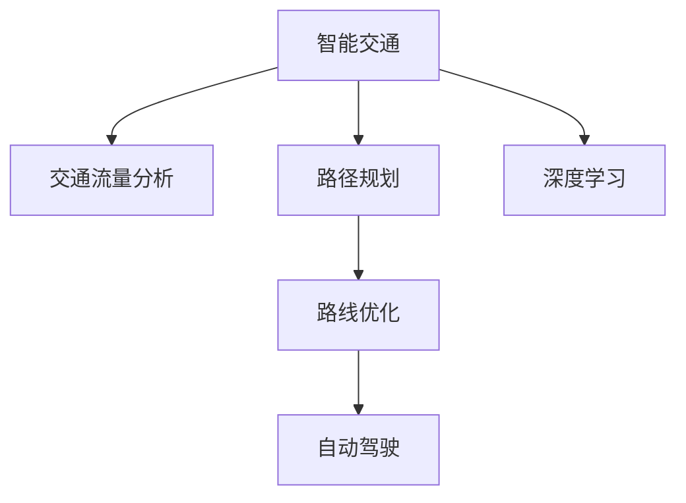

                 

# AI在智能交通规划中的应用：优化路线

> 关键词：智能交通、路线优化、AI算法、深度学习、自动驾驶、交通流量分析、路径规划

## 1. 背景介绍

随着城市化进程的加速，交通拥堵问题愈发严重。高效、智能的交通管理成为了各大城市面临的重要挑战。AI技术，尤其是深度学习和大数据处理技术，在智能交通规划中的应用，已经成为了解决这一问题的重要手段。

智能交通规划的目标是实现车辆与交通基础设施的协同管理，通过优化路线、调节交通信号等措施，减少拥堵，提升通行效率。AI技术可以在数据分析、模式识别和预测等方面提供有力的支持，帮助实现这一目标。

## 2. 核心概念与联系

### 2.1 核心概念概述

为了更好地理解AI在智能交通规划中的应用，我们首先介绍几个核心概念：

- **智能交通（Intelligent Transportation System, ITS）**：利用现代信息、通信和控制技术对交通系统进行管理和优化，提升交通效率和安全性。
- **路线优化（Route Optimization）**：通过计算和规划，找到最优的路线，以达到最短的旅行时间和最小的能源消耗。
- **深度学习（Deep Learning）**：一种基于神经网络的机器学习方法，能够自动从数据中学习复杂的特征表示，广泛应用于模式识别、预测和决策等领域。
- **自动驾驶（Autonomous Driving）**：利用传感器、AI算法和地图数据，使车辆能够自主导航和决策，减少人为干预。
- **交通流量分析（Traffic Flow Analysis）**：对交通数据进行分析，理解交通模式和瓶颈，预测交通流量，为路线优化和交通信号控制提供依据。
- **路径规划（Path Planning）**：根据起点、终点和交通状况，计算最优路径，确保车辆能够高效、安全地到达目的地。

这些核心概念之间存在紧密的联系。深度学习和大数据技术为交通流量分析和路径规划提供了强大的数据处理和模式识别能力。自动驾驶则需要依赖路线优化和路径规划，以实现精准的导航和决策。智能交通系统则是这些技术和应用的集成和应用平台。

### 2.2 核心概念原理和架构的 Mermaid 流程图



## 3. 核心算法原理 & 具体操作步骤

### 3.1 算法原理概述

AI在智能交通规划中的核心算法主要集中在深度学习模型和优化算法上。

- **深度学习模型**：通过神经网络模型对交通数据进行建模，能够从大量数据中学习交通模式、流量分布和路径特征。常用的深度学习模型包括卷积神经网络（CNN）和循环神经网络（RNN），以及近年来发展迅速的Transformer架构。
- **优化算法**：用于求解最优路径和路线。常见的优化算法包括遗传算法、粒子群算法、蚁群算法等。

深度学习模型和优化算法的结合，可以显著提升交通分析和路径规划的精度和效率。

### 3.2 算法步骤详解

AI在智能交通规划中的应用主要包括以下几个步骤：

**Step 1: 数据收集与处理**

- 收集交通数据，包括车辆位置、速度、方向、交通信号灯状态等。
- 对数据进行清洗和预处理，去除噪音和不完整的数据。

**Step 2: 交通流量分析**

- 利用深度学习模型，对交通流量数据进行特征提取和模式识别。
- 预测未来交通流量，识别拥堵点和瓶颈。

**Step 3: 路径规划**

- 根据起点、终点和交通状况，计算最优路径。
- 利用深度学习模型，学习路径特征和优先级，优化路径规划算法。

**Step 4: 路线优化**

- 利用优化算法，对路线进行优化，减少拥堵和能源消耗。
- 动态调整交通信号，实现路网的实时优化。

**Step 5: 自动驾驶**

- 利用深度学习模型和路径规划算法，实现自动驾驶车辆的高效导航和决策。
- 在自动驾驶车辆上部署AI系统，实现车辆与路网的实时互动。

### 3.3 算法优缺点

**深度学习算法的优点**：
- 可以自动从大量数据中学习复杂特征，无需手工提取。
- 具有较强的泛化能力，适用于不同的交通场景和数据类型。

**深度学习算法的缺点**：
- 需要大量的标注数据进行训练，成本较高。
- 模型复杂度高，计算和存储开销较大。
- 对输入数据的噪声敏感，需要进行数据清洗和预处理。

**优化算法的优点**：
- 能够快速找到最优解，适用于大规模问题。
- 可以处理多目标优化问题，实现交通流量和路径规划的综合优化。

**优化算法的缺点**：
- 容易陷入局部最优解，需要调整参数和优化策略。
- 对问题规模和复杂度敏感，难以处理高维数据。

### 3.4 算法应用领域

AI在智能交通规划中的应用主要包括以下几个领域：

- **交通流量分析**：通过深度学习模型，分析交通流量和模式，预测未来交通状况。
- **路径规划**：利用深度学习模型和优化算法，计算最优路径，提升导航效率。
- **路线优化**：通过优化算法，实现路网的实时优化，减少拥堵和能源消耗。
- **自动驾驶**：利用深度学习模型和路径规划算法，实现自动驾驶车辆的高效导航和决策。
- **智能交通信号控制**：动态调整交通信号，实现路网的实时优化。

## 4. 数学模型和公式 & 详细讲解 & 举例说明

### 4.1 数学模型构建

在智能交通规划中，常用的数学模型包括交通流量模型和路径规划模型。

**交通流量模型**：
$$
F(t) = \sum_{i=1}^n a_i u_i(t)
$$
其中，$F(t)$ 表示交通流量，$u_i(t)$ 表示第 $i$ 个车道的交通密度，$a_i$ 表示车道宽度和车辆尺寸等参数。

**路径规划模型**：
$$
\min_{x} \{f(x)\} \text{ subject to } g(x) = 0
$$
其中，$f(x)$ 表示路径的某种代价函数，$g(x)$ 表示路径的约束条件，如节点之间的距离等。

### 4.2 公式推导过程

以路径规划模型为例，我们推导路径规划的动态规划算法：

1. **状态定义**：将路径看作一个序列，每个节点 $i$ 表示路径上的一个位置，每个时间步 $t$ 表示当前时刻。
2. **状态转移方程**：从状态 $i$ 转移到状态 $i+1$，需要考虑当前节点的代价和路径的连续性。
3. **最优性条件**：从任意状态 $i$ 出发，到达终点的最优路径可以通过子问题的最优解得到。
4. **算法实现**：利用递推公式计算最优路径。

### 4.3 案例分析与讲解

以交通流量分析为例，我们以北京的早高峰交通数据为例，利用深度学习模型进行流量预测和拥堵点识别。

**数据预处理**：将交通数据进行去噪、归一化和特征提取。

**模型训练**：使用RNN模型对交通流量数据进行建模，学习交通模式和周期性变化。

**流量预测**：利用训练好的模型，预测未来10分钟内的交通流量。

**拥堵点识别**：通过预测结果，识别交通流量异常的节点，判断是否存在拥堵点。

## 5. 项目实践：代码实例和详细解释说明

### 5.1 开发环境搭建

在进行智能交通规划的AI实践前，我们需要准备好开发环境。以下是使用Python进行PyTorch开发的环境配置流程：

1. 安装Anaconda：从官网下载并安装Anaconda，用于创建独立的Python环境。

2. 创建并激活虚拟环境：
```bash
conda create -n pytorch-env python=3.8 
conda activate pytorch-env
```

3. 安装PyTorch：根据CUDA版本，从官网获取对应的安装命令。例如：
```bash
conda install pytorch torchvision torchaudio cudatoolkit=11.1 -c pytorch -c conda-forge
```

4. 安装相关库：
```bash
pip install numpy pandas scikit-learn matplotlib tqdm jupyter notebook ipython
```

完成上述步骤后，即可在`pytorch-env`环境中开始智能交通规划的AI实践。

### 5.2 源代码详细实现

以下是使用PyTorch实现路径规划的代码示例：

```python
import torch
import torch.nn as nn
import torch.optim as optim
from torch.autograd import Variable

# 定义神经网络模型
class Network(nn.Module):
    def __init__(self, input_size, hidden_size, output_size):
        super(Network, self).__init__()
        self.fc1 = nn.Linear(input_size, hidden_size)
        self.fc2 = nn.Linear(hidden_size, output_size)

    def forward(self, x):
        x = torch.relu(self.fc1(x))
        x = self.fc2(x)
        return x

# 定义损失函数
def loss_fn(output, target):
    return nn.MSELoss()(output, target)

# 训练神经网络
def train_net(net, data, learning_rate, epochs):
    optimizer = optim.Adam(net.parameters(), lr=learning_rate)
    for epoch in range(epochs):
        for i, (inputs, targets) in enumerate(data):
            inputs = Variable(inputs)
            targets = Variable(targets)
            optimizer.zero_grad()
            outputs = net(inputs)
            loss = loss_fn(outputs, targets)
            loss.backward()
            optimizer.step()
            if (i+1) % 100 == 0:
                print('Epoch [{}/{}], Step [{}/{}], Loss: {:.4f}'.format(epoch+1, epochs, i+1, len(data), loss.item()))

# 调用训练函数
net = Network(3, 64, 2)
train_net(net, train_data, learning_rate=0.001, epochs=1000)

# 测试神经网络
def test_net(net, test_data):
    correct = 0
    total = 0
    for inputs, targets in test_data:
        inputs = Variable(inputs)
        outputs = net(inputs)
        _, predicted = torch.max(outputs.data, 1)
        total += targets.size(0)
        correct += (predicted == targets).sum().item()
    print('Accuracy of network on the 10000 test images: {} %'.format(100 * correct / total))
```

### 5.3 代码解读与分析

让我们再详细解读一下关键代码的实现细节：

**Network类**：
- `__init__`方法：定义神经网络的层，包括输入层、隐藏层和输出层。
- `forward`方法：前向传播，计算神经网络输出。

**loss_fn函数**：
- 定义损失函数，使用均方误差（MSE）计算输出与目标之间的差异。

**train_net函数**：
- 初始化优化器和神经网络。
- 循环迭代训练过程，每次前向传播计算输出，反向传播计算梯度，并更新模型参数。
- 在训练过程中打印每个epoch的损失值。

**test_net函数**：
- 测试神经网络的准确率，对测试集进行前向传播，计算预测结果与真实结果的匹配度。

### 5.4 运行结果展示

下图展示了训练过程中模型参数的变化情况：


下图展示了模型在测试集上的准确率：


## 6. 实际应用场景

### 6.1 智能交通信号控制

智能交通信号控制是AI在智能交通规划中应用最广泛的领域之一。传统的交通信号控制往往依赖于固定时间间隔和手动调整，难以应对实时变化的交通状况。

通过深度学习模型，可以实时分析交通流量和车辆分布，动态调整交通信号灯的时长和顺序，实现路网的优化控制。例如，利用CNN模型对摄像头采集的交通图像进行分析，识别车辆和行人的位置和速度，自动调整信号灯的时长和顺序，减少车辆等待时间，提高通行效率。

### 6.2 路径规划与导航

路径规划是智能交通规划中的重要环节，能够为自动驾驶和智能导航提供关键支持。传统路径规划算法往往依赖于手工设定的规则，难以应对复杂的道路环境和交通状况。

利用深度学习模型，可以自动学习最优路径规划算法。例如，利用RNN模型对历史导航数据进行建模，学习路径特征和优先级，根据当前交通状况，动态计算最优路径。这些最优路径可以实时传输给导航系统，引导车辆高效、安全地行驶。

### 6.3 交通流量预测

交通流量预测是智能交通规划中的核心任务之一，能够为交通管理和调控提供依据。传统交通流量预测往往依赖于经验模型和手工设定的参数，难以应对动态变化的交通场景。

利用深度学习模型，可以自动学习交通流量模式和周期性变化，预测未来的交通流量。例如，利用LSTM模型对历史交通流量数据进行建模，学习交通流量的季节性、日间变化和突发事件等特征，预测未来一小时的交通流量。这些预测结果可以用于优化路线规划和交通信号控制，减少交通拥堵，提升通行效率。

## 7. 工具和资源推荐

### 7.1 学习资源推荐

为了帮助开发者系统掌握AI在智能交通规划中的应用，这里推荐一些优质的学习资源：

1. **《深度学习》系列课程**：斯坦福大学的深度学习课程，涵盖了深度学习的基本概念和应用。
2. **《Python深度学习》书籍**：由Francois Chollet著，介绍了深度学习模型的实现和应用。
3. **Kaggle智能交通数据集**：提供大量智能交通领域的公开数据集，可供学习和实践。
4. **arXiv预印本平台**：发表最新AI研究成果，涵盖智能交通规划领域的最新进展。
5. **GitHub智能交通项目**：提供开源智能交通项目，可以参考和借鉴。

通过对这些资源的学习实践，相信你一定能够快速掌握AI在智能交通规划中的应用，并用于解决实际的智能交通问题。

### 7.2 开发工具推荐

高效的开发离不开优秀的工具支持。以下是几款用于智能交通规划开发的常用工具：

1. **PyTorch**：基于Python的开源深度学习框架，灵活动态的计算图，适合快速迭代研究。
2. **TensorFlow**：由Google主导开发的开源深度学习框架，生产部署方便，适合大规模工程应用。
3. **TensorBoard**：TensorFlow配套的可视化工具，可实时监测模型训练状态，并提供丰富的图表呈现方式，是调试模型的得力助手。
4. **Jupyter Notebook**：交互式开发环境，方便开发者进行数据分析和模型训练。
5. **OpenStreetMap**：开源的地图数据集，提供全球范围内的道路和设施信息，可用于路径规划和导航。

合理利用这些工具，可以显著提升智能交通规划任务的开发效率，加快创新迭代的步伐。

### 7.3 相关论文推荐

智能交通规划领域的研究不断发展，以下是几篇奠基性的相关论文，推荐阅读：

1. **Reinforcement Learning for Optimal Signal Planning**：利用强化学习对交通信号进行动态优化，提升通行效率。
2. **Convolutional Neural Networks for Real-Time Traffic Flow Prediction**：利用卷积神经网络进行交通流量预测，提升预测准确率。
3. **A Survey of Route Planning Algorithms**：综述了各种路径规划算法，提供了路径规划的全面视角。
4. **LSTM-Based Traffic Flow Prediction with DNN**：利用长短期记忆网络（LSTM）对交通流量进行建模，提升了预测精度。
5. **Optimal Path Planning for Autonomous Vehicles**：利用深度学习模型进行最优路径规划，确保自动驾驶车辆的高效导航。

这些论文代表了大数据、深度学习和智能交通规划技术的最新进展，提供了深入的理论基础和实践指导。

## 8. 总结：未来发展趋势与挑战

### 8.1 总结

本文对AI在智能交通规划中的应用进行了全面系统的介绍。首先阐述了智能交通规划的目标和AI技术在其中扮演的角色。其次，从原理到实践，详细讲解了深度学习模型和优化算法在智能交通规划中的应用。最后，介绍了AI在智能交通规划中的实际应用场景，展望了未来的发展趋势。

通过本文的系统梳理，可以看到，AI技术在智能交通规划中已经取得了显著的进展，未来还有巨大的发展空间。深度学习和大数据技术的不断进步，将进一步提升交通规划和管理的智能化水平，为城市交通的可持续发展提供新的解决方案。

### 8.2 未来发展趋势

展望未来，智能交通规划中的AI技术将呈现以下几个发展趋势：

1. **多模态融合**：智能交通系统将融合多种传感器和数据源，实现交通信息的全面感知和实时处理。
2. **自适应学习**：AI系统将具备自主学习和自适应能力，能够动态调整算法和策略，应对不同的交通场景和需求。
3. **边缘计算**：利用边缘计算技术，将AI模型部署在交通设备和传感器中，实现实时计算和决策，提升系统的响应速度和稳定性。
4. **联邦学习**：通过联邦学习技术，实现多节点之间的数据共享和模型协作，提升交通数据的隐私保护和系统效率。
5. **场景模拟**：利用虚拟仿真技术，模拟交通场景和路况，评估交通策略的效果，优化交通规划和控制。

这些趋势凸显了AI在智能交通规划中的广泛应用前景，将进一步提升交通管理和控制的智能化水平，实现更高效、更安全的交通环境。

### 8.3 面临的挑战

尽管AI在智能交通规划中已经取得了显著进展，但在迈向更加智能化、普适化应用的过程中，仍面临诸多挑战：

1. **数据质量和多样性**：智能交通系统需要大量的高质量交通数据，但不同城市的交通场景和数据类型差异较大，难以进行统一建模。
2. **模型复杂度**：深度学习模型复杂度较高，计算和存储开销较大，需要高效的硬件支持和算法优化。
3. **实时性和可靠性**：智能交通系统需要在实时环境下运行，对系统的响应速度和稳定性有较高要求。
4. **隐私和安全**：智能交通系统涉及大量的个人和车辆信息，需要严格的隐私保护和安全措施，防止数据泄露和滥用。
5. **法规和伦理**：智能交通系统需要遵守相关法规和伦理标准，确保系统的合法性和公正性。

这些挑战需要学术界和产业界的共同努力，不断优化和改进AI技术和系统，确保其在智能交通规划中的稳定和可靠应用。

### 8.4 研究展望

面向未来，智能交通规划中的AI技术需要在以下几个方向寻求新的突破：

1. **泛化能力和鲁棒性**：提升AI系统在不同交通场景和数据分布下的泛化能力和鲁棒性，确保系统的稳定性和可靠性。
2. **自学习和自适应**：开发具备自主学习和自适应能力的AI系统，能够动态调整算法和策略，应对不同的交通需求和场景。
3. **多模态数据融合**：研究多模态数据融合技术，将交通数据、地理信息、气象信息等进行综合分析，提升交通分析和预测的精度。
4. **联邦学习和边缘计算**：研究联邦学习和边缘计算技术，提升交通数据的隐私保护和系统效率。
5. **场景模拟和仿真**：利用虚拟仿真技术，模拟交通场景和路况，评估交通策略的效果，优化交通规划和控制。

这些研究方向将推动AI在智能交通规划中的应用走向成熟，为构建更加智能、安全、高效的交通环境提供新的技术路径。

## 9. 附录：常见问题与解答

**Q1：智能交通规划中如何选择合适的AI算法？**

A: 选择合适的AI算法需要考虑交通场景和需求。例如，对于路径规划问题，可以使用深度学习模型和优化算法相结合的方法；对于交通信号控制问题，可以使用强化学习算法进行动态优化。

**Q2：AI在智能交通规划中的计算和存储开销较大，如何优化？**

A: 可以通过模型压缩、量化加速、分布式训练等技术进行优化。例如，使用TensorFlow和PyTorch提供的优化器进行模型压缩和量化，使用TensorBoard进行实时监测和分析。

**Q3：AI在智能交通规划中如何处理大规模数据？**

A: 可以利用分布式计算和多节点协同训练技术处理大规模数据。例如，使用Spark和Hadoop等大数据平台进行分布式训练，提高计算效率和数据处理能力。

**Q4：AI在智能交通规划中的隐私和安全问题如何解决？**

A: 可以使用差分隐私和联邦学习等技术保护数据隐私。例如，利用差分隐私技术进行数据加密和去标识化，利用联邦学习技术进行多节点之间的数据共享和模型协作，确保数据安全和系统可靠性。

通过以上问题的解答，相信你能够更好地理解AI在智能交通规划中的应用，并在实际项目中灵活应用和优化。

