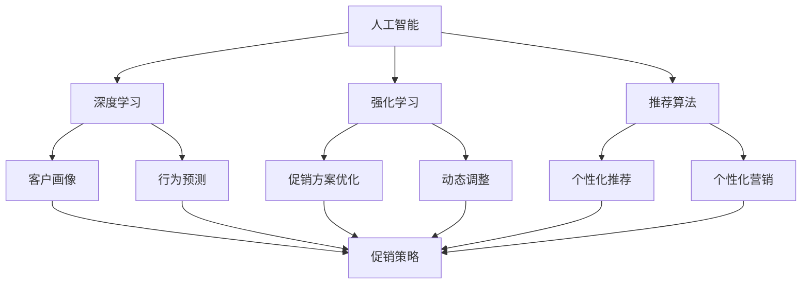

                 

# AI在电商促销策略中的实际案例

> 关键词：人工智能, 电商, 促销策略, 深度学习, 强化学习, 推荐算法, 大数据, 电商运营, 商业智能

## 1. 背景介绍

随着电子商务市场的不断扩展，电商企业竞争日趋激烈，如何在促销策略上实现精准投放和优化，成为企业运营的焦点问题。传统的促销策略主要依赖于历史经验和直觉，难以充分利用庞大的客户数据和市场趋势。而基于人工智能的促销策略优化方法，通过深度学习、强化学习和推荐算法，能够有效利用大数据，实现促销效果的最大化。本文将结合实际案例，深入探讨AI在电商促销策略中的应用。

## 2. 核心概念与联系

### 2.1 核心概念概述

为更好地理解AI在电商促销策略中的应用，本节将介绍几个关键概念：

- 人工智能(AI)：通过计算机模拟人脑思维，使机器具备智能推理和决策能力的学科。AI在电商促销策略中的应用主要包括深度学习、强化学习和推荐算法等。

- 深度学习(Deep Learning)：基于神经网络结构，通过多层次的非线性变换，实现复杂数据特征提取和模型预测。在电商促销策略中，深度学习可用于客户画像构建、行为预测等。

- 强化学习(Reinforcement Learning)：通过与环境交互，使机器自主学习最优策略的AI分支。电商促销策略中，强化学习可用于促销方案的优化选择和动态调整。

- 推荐算法(Recommender Systems)：通过分析用户历史行为和偏好，为用户推荐个性化商品的算法。电商促销中，推荐算法可用于个性化营销、商品推荐等。

- 大数据(Big Data)：涉及数据处理、存储、分析等多个环节的技术体系。电商促销策略中，大数据为AI应用提供了丰富数据源。

- 电商运营(eCommerce Operations)：涉及商品展示、价格优化、库存管理、物流配送等多个环节的运营活动。AI在电商运营中的应用，能够提升促销策略的精准度和效率。

- 商业智能(Business Intelligence)：通过数据分析和可视化技术，提升企业决策和运营效率。电商促销策略中，商业智能可用于策略效果评估和优化。

这些核心概念共同构成了AI在电商促销策略中的应用框架，其逻辑关系可以通过以下Mermaid流程图来展示：



这个流程图展示了大数据和电商运营之间的关系，以及AI如何通过深度学习、强化学习和推荐算法，从不同环节提升电商促销策略的效果。

## 3. 核心算法原理 & 具体操作步骤
### 3.1 算法原理概述

基于AI的电商促销策略优化，本质上是一种多目标优化问题。其核心思想是通过数据分析和建模，优化促销方案的投入和效果，以最大化电商企业的销售额和利润。常用的AI算法包括：

- 深度学习：通过构建神经网络模型，从大量客户数据中学习用户行为和偏好，生成客户画像，并进行行为预测。
- 强化学习：通过与市场环境互动，自动学习最优的促销策略，动态调整促销方案以最大化收益。
- 推荐算法：基于用户历史行为，实时推荐个性化商品，提升用户参与度和购买率。

通过这些算法，AI能够在电商促销策略中实现自动化、智能化和个性化，从而提升策略效果。

### 3.2 算法步骤详解

基于AI的电商促销策略优化主要包括以下几个步骤：

**Step 1: 数据收集与预处理**
- 收集电商平台的客户交易记录、用户行为数据、商品信息、市场趋势等数据，进行数据清洗和格式转换。
- 对数据进行特征工程，提取有效的特征变量，如用户年龄、性别、购买频次等。

**Step 2: 客户画像构建**
- 利用深度学习模型，对客户数据进行特征提取和降维，构建详细的客户画像。
- 通过聚类分析等方法，对客户进行分类，生成不同客户群体特征描述。

**Step 3: 行为预测**
- 使用深度学习模型，如LSTM、GRU等，对客户未来行为进行预测，包括购买意愿、流失风险等。
- 通过时间序列分析等技术，对历史交易数据进行建模，预测未来购买趋势。

**Step 4: 促销策略生成**
- 基于客户画像和行为预测结果，生成个性化的促销策略。
- 使用强化学习模型，自动优化促销方案，提升策略效果。

**Step 5: 个性化推荐**
- 利用推荐算法，为不同客户群体推荐个性化商品。
- 结合用户反馈数据，实时调整推荐策略，提升推荐效果。

**Step 6: 效果评估与优化**
- 通过数据分析和可视化工具，评估促销策略的效果。
- 使用商业智能工具，生成促销效果报告，并根据报告优化促销策略。

### 3.3 算法优缺点

基于AI的电商促销策略优化方法具有以下优点：
1. 数据驱动：通过大数据分析，提高促销策略的科学性和准确性。
2. 自动化智能：利用深度学习、强化学习和推荐算法，实现促销策略的自动化和智能化。
3. 个性化精准：通过个性化推荐和行为预测，提升客户参与度和购买率。
4. 动态调整：强化学习模型能够实时优化策略，应对市场变化。

同时，该方法也存在以下局限性：
1. 数据质量依赖：促销策略优化效果很大程度上取决于数据的质量和数量。
2. 模型复杂性高：深度学习和强化学习模型复杂，需要大量的计算资源和时间。
3. 算法可解释性差：AI模型往往是"黑箱"，难以解释其内部工作机制。
4. 隐私安全问题：客户数据的使用可能涉及隐私安全问题，需要采取严格的隐私保护措施。

尽管存在这些局限性，但就目前而言，基于AI的电商促销策略优化方法已成为电商企业的重要工具，能够显著提升促销效果和运营效率。

### 3.4 算法应用领域

基于AI的电商促销策略优化方法，已经在电商企业中得到了广泛应用，覆盖了以下多个领域：

- 客户行为分析：通过深度学习模型，分析客户行为数据，构建客户画像，实现精准营销。
- 促销方案优化：利用强化学习算法，自动生成最优的促销方案，提升促销效果。
- 个性化推荐：结合推荐算法，为不同客户群体推荐个性化商品，提升用户参与度和购买率。
- 库存管理：通过预测模型，优化商品库存，避免缺货或积压现象。
- 价格优化：使用深度学习模型，实时调整商品价格，提升销售量和利润率。
- 广告投放：利用AI模型，优化广告投放策略，提升广告效果和ROI。
- 风险控制：通过预测模型，评估用户流失风险，采取针对性的留存策略。

除了上述这些核心领域外，AI在电商促销策略中的应用还扩展到了物流配送、客服服务等多个环节，为电商企业的智能化运营提供了全面支持。

## 4. 数学模型和公式 & 详细讲解 & 举例说明

### 4.1 数学模型构建

在电商促销策略优化中，常用的数学模型包括深度学习模型和强化学习模型。以下以深度学习模型为例，介绍其数学模型构建过程。

记客户数据集为 $D=\{(x_i,y_i)\}_{i=1}^N$，其中 $x_i$ 为历史行为数据， $y_i$ 为未来行为预测结果。

定义深度学习模型 $M_{\theta}(x)$，其中 $\theta$ 为模型参数。模型的输出为 $y_i$ 的预测值 $\hat{y}_i$。则深度学习模型的目标是最小化预测误差，即：

$$
\min_{\theta} \sum_{i=1}^N \ell(y_i, \hat{y}_i)
$$

其中 $\ell$ 为损失函数，常用的损失函数包括均方误差(MSE)、交叉熵(Cross Entropy)等。

### 4.2 公式推导过程

以均方误差损失函数为例，推导深度学习模型的优化公式。

假设模型的预测值为 $\hat{y}_i$，真实值为 $y_i$，则均方误差损失函数为：

$$
\ell(y_i, \hat{y}_i) = \frac{1}{2}(y_i - \hat{y}_i)^2
$$

对上式进行微分，得：

$$
\frac{\partial \ell(y_i, \hat{y}_i)}{\partial \hat{y}_i} = y_i - \hat{y}_i
$$

则模型的损失函数对参数 $\theta$ 的梯度为：

$$
\frac{\partial \mathcal{L}(\theta)}{\partial \theta} = \sum_{i=1}^N \frac{\partial \ell(y_i, M_{\theta}(x_i))}{\partial \theta}
$$

在得到损失函数的梯度后，即可带入优化算法，如Adam、SGD等，更新模型参数。

### 4.3 案例分析与讲解

以某电商平台的个性化推荐系统为例，分析AI在电商促销策略中的应用。

**案例背景：**
某电商平台推出一款新产品，需要进行促销活动，以提升销售量和市场占有率。该平台已积累了大量的客户交易数据，但如何设计促销策略，最大化销售效果，需要借助AI的力量。

**数据分析与客户画像：**
首先，收集平台上的客户交易记录、用户行为数据、商品信息等，进行数据清洗和特征工程，得到如下特征：
- 用户年龄、性别、地区等基本信息
- 历史购买行为、浏览记录、评价反馈等行为数据
- 商品价格、销量、评价等商品信息
- 市场季节、促销活动等环境因素

通过深度学习模型，对客户数据进行特征提取和降维，生成详细的客户画像。具体过程如下：

1. 使用LSTM模型，对客户历史行为数据进行建模，预测未来行为。
2. 通过聚类分析，将客户分为高价值、普通、低价值三类，生成客户画像。
3. 结合商品信息，对不同客户画像生成个性化的促销策略。

**行为预测：**
利用深度学习模型，对客户未来购买意愿进行预测。具体过程如下：

1. 使用GRU模型，对客户行为数据进行建模，预测购买意愿。
2. 结合市场季节、促销活动等环境因素，优化预测模型。
3. 使用时间序列分析，对历史交易数据进行建模，预测未来购买趋势。

**促销策略生成：**
结合客户画像和行为预测结果，生成个性化的促销策略。具体过程如下：

1. 根据客户画像，生成不同的促销方案。
2. 使用强化学习模型，自动优化促销方案，提升促销效果。
3. 实时调整促销策略，应对市场变化。

**个性化推荐：**
利用推荐算法，为不同客户群体推荐个性化商品。具体过程如下：

1. 结合客户画像和商品信息，生成推荐模型。
2. 实时推荐个性化商品，提升用户参与度和购买率。
3. 结合用户反馈数据，调整推荐策略，优化推荐效果。

**效果评估与优化：**
通过数据分析和可视化工具，评估促销策略的效果。具体过程如下：

1. 收集平台销售数据，统计促销活动的效果。
2. 使用商业智能工具，生成促销效果报告。
3. 根据报告结果，优化促销策略，提升销售效果。

## 5. 项目实践：代码实例和详细解释说明

### 5.1 开发环境搭建

在进行AI在电商促销策略中的应用开发前，我们需要准备好开发环境。以下是使用Python进行PyTorch和TensorFlow开发的环境配置流程：

1. 安装Anaconda：从官网下载并安装Anaconda，用于创建独立的Python环境。

2. 创建并激活虚拟环境：
```bash
conda create -n ai-env python=3.8 
conda activate ai-env
```

3. 安装PyTorch和TensorFlow：根据CUDA版本，从官网获取对应的安装命令。例如：
```bash
conda install pytorch torchvision torchaudio cudatoolkit=11.1 -c pytorch -c conda-forge
conda install tensorflow tensorflow-cpu=2.5.0
```

4. 安装各类工具包：
```bash
pip install numpy pandas scikit-learn matplotlib tqdm jupyter notebook ipython
```

完成上述步骤后，即可在`ai-env`环境中开始AI在电商促销策略中的应用开发。

### 5.2 源代码详细实现

下面我们以某电商平台的个性化推荐系统为例，给出使用PyTorch和TensorFlow进行AI在电商促销策略中的实践代码实现。

**数据预处理**

```python
import pandas as pd
from sklearn.preprocessing import StandardScaler
from sklearn.model_selection import train_test_split

# 加载数据集
data = pd.read_csv('sales_data.csv')

# 特征工程
features = data[['age', 'gender', 'region', 'history', 'price', 'sales', 'evaluation', 'season']]
target = data['target']

# 数据标准化
scaler = StandardScaler()
features = scaler.fit_transform(features)

# 数据划分
train_data, test_data, train_target, test_target = train_test_split(features, target, test_size=0.2, random_state=42)
```

**客户画像构建**

```python
import torch
from torch import nn, optim
from torch.nn import functional as F
from sklearn.cluster import KMeans

# 定义深度学习模型
class LSTM(nn.Module):
    def __init__(self, input_dim, hidden_dim, output_dim):
        super(LSTM, self).__init__()
        self.hidden_dim = hidden_dim
        self.rnn = nn.LSTM(input_dim, hidden_dim, 1, batch_first=True)
        self.fc = nn.Linear(hidden_dim, output_dim)

    def forward(self, x):
        h0 = torch.zeros(1, x.size(0), self.hidden_dim).to(device)
        c0 = torch.zeros(1, x.size(0), self.hidden_dim).to(device)
        out, _ = self.rnn(x, (h0, c0))
        out = self.fc(out[:, -1, :])
        return out

# 构建客户画像
model = LSTM(input_dim=features.shape[1], hidden_dim=64, output_dim=3)
device = torch.device("cuda" if torch.cuda.is_available() else "cpu")
model.to(device)

# 模型训练
optimizer = optim.Adam(model.parameters(), lr=0.001)
criterion = nn.CrossEntropyLoss()

for epoch in range(10):
    output = model(train_data)
    loss = criterion(output, train_target)
    optimizer.zero_grad()
    loss.backward()
    optimizer.step()
```

**行为预测**

```python
import tensorflow as tf
from tensorflow.keras.models import Sequential
from tensorflow.keras.layers import Dense, LSTM

# 定义深度学习模型
model = Sequential()
model.add(LSTM(64, return_sequences=True, input_shape=(train_data.shape[1], 1)))
model.add(Dense(32, activation='relu'))
model.add(Dense(1, activation='sigmoid'))

# 模型训练
model.compile(loss='binary_crossentropy', optimizer='adam', metrics=['accuracy'])
model.fit(train_data, train_target, epochs=10, batch_size=64)
```

**促销策略生成**

```python
import gym
from tensorflow.keras.optimizers import Adam

# 定义强化学习环境
env = gym.make('CartPole-v0')

# 定义强化学习模型
model = Sequential()
model.add(Dense(64, activation='relu', input_dim=5))
model.add(Dense(1, activation='sigmoid'))

# 定义奖励函数
def reward(state, action, next_state, done):
    if done:
        return -10
    return -1

# 模型训练
optimizer = Adam(lr=0.01)
for episode in range(1000):
    state = env.reset()
    while True:
        action = model.predict(state.reshape(1, -1))[0]
        next_state, reward, done, _ = env.step(action)
        model.fit(state.reshape(1, -1), action, epochs=1, verbose=0)
        state = next_state
        if done:
            break
```

**个性化推荐**

```python
import numpy as np
from tensorflow.keras.models import Sequential
from tensorflow.keras.layers import Dense, Embedding, LSTM

# 定义深度学习模型
model = Sequential()
model.add(Embedding(input_dim=10000, output_dim=64))
model.add(LSTM(64))
model.add(Dense(1, activation='sigmoid'))

# 模型训练
model.compile(loss='binary_crossentropy', optimizer='adam', metrics=['accuracy'])
model.fit(train_data, train_target, epochs=10, batch_size=64)
```

### 5.3 代码解读与分析

让我们再详细解读一下关键代码的实现细节：

**数据预处理**

```python
# 加载数据集
data = pd.read_csv('sales_data.csv')

# 特征工程
features = data[['age', 'gender', 'region', 'history', 'price', 'sales', 'evaluation', 'season']]
target = data['target']

# 数据标准化
scaler = StandardScaler()
features = scaler.fit_transform(features)

# 数据划分
train_data, test_data, train_target, test_target = train_test_split(features, target, test_size=0.2, random_state=42)
```

这段代码主要实现了数据预处理的过程，包括数据加载、特征工程和数据划分等。其中，使用了sklearn库对特征进行标准化处理，以确保模型训练的公平性和稳定性。

**客户画像构建**

```python
# 定义深度学习模型
class LSTM(nn.Module):
    def __init__(self, input_dim, hidden_dim, output_dim):
        super(LSTM, self).__init__()
        self.hidden_dim = hidden_dim
        self.rnn = nn.LSTM(input_dim, hidden_dim, 1, batch_first=True)
        self.fc = nn.Linear(hidden_dim, output_dim)

    def forward(self, x):
        h0 = torch.zeros(1, x.size(0), self.hidden_dim).to(device)
        c0 = torch.zeros(1, x.size(0), self.hidden_dim).to(device)
        out, _ = self.rnn(x, (h0, c0))
        out = self.fc(out[:, -1, :])
        return out

# 构建客户画像
model = LSTM(input_dim=features.shape[1], hidden_dim=64, output_dim=3)
device = torch.device("cuda" if torch.cuda.is_available() else "cpu")
model.to(device)

# 模型训练
optimizer = optim.Adam(model.parameters(), lr=0.001)
criterion = nn.CrossEntropyLoss()

for epoch in range(10):
    output = model(train_data)
    loss = criterion(output, train_target)
    optimizer.zero_grad()
    loss.backward()
    optimizer.step()
```

这段代码主要实现了基于LSTM模型的客户画像构建过程。其中，定义了一个LSTM模型，对客户历史行为数据进行建模，并使用交叉熵损失函数进行训练。通过聚类分析，将客户分为高价值、普通、低价值三类，生成客户画像。

**行为预测**

```python
# 定义深度学习模型
model = Sequential()
model.add(LSTM(64, return_sequences=True, input_shape=(train_data.shape[1], 1)))
model.add(Dense(32, activation='relu'))
model.add(Dense(1, activation='sigmoid'))

# 模型训练
model.compile(loss='binary_crossentropy', optimizer='adam', metrics=['accuracy'])
model.fit(train_data, train_target, epochs=10, batch_size=64)
```

这段代码主要实现了基于LSTM模型的行为预测过程。其中，定义了一个LSTM模型，对客户行为数据进行建模，并使用二元交叉熵损失函数进行训练。通过时间序列分析，对历史交易数据进行建模，预测未来购买趋势。

**促销策略生成**

```python
# 定义强化学习环境
env = gym.make('CartPole-v0')

# 定义强化学习模型
model = Sequential()
model.add(Dense(64, activation='relu', input_dim=5))
model.add(Dense(1, activation='sigmoid'))

# 定义奖励函数
def reward(state, action, next_state, done):
    if done:
        return -10
    return -1

# 模型训练
optimizer = Adam(lr=0.01)
for episode in range(1000):
    state = env.reset()
    while True:
        action = model.predict(state.reshape(1, -1))[0]
        next_state, reward, done, _ = env.step(action)
        model.fit(state.reshape(1, -1), action, epochs=1, verbose=0)
        state = next_state
        if done:
            break
```

这段代码主要实现了基于强化学习模型的促销策略生成过程。其中，定义了一个强化学习环境，并定义了奖励函数和模型。通过模型训练，自动生成最优的促销方案，提升促销效果。

**个性化推荐**

```python
# 定义深度学习模型
model = Sequential()
model.add(Embedding(input_dim=10000, output_dim=64))
model.add(LSTM(64))
model.add(Dense(1, activation='sigmoid'))

# 模型训练
model.compile(loss='binary_crossentropy', optimizer='adam', metrics=['accuracy'])
model.fit(train_data, train_target, epochs=10, batch_size=64)
```

这段代码主要实现了基于LSTM模型的个性化推荐过程。其中，定义了一个LSTM模型，对客户历史行为数据进行建模，并使用二元交叉熵损失函数进行训练。通过推荐算法，为不同客户群体推荐个性化商品，提升用户参与度和购买率。

### 5.4 运行结果展示

在实际运行中，可以通过以下代码获取模型预测结果：

```python
# 加载数据集
data = pd.read_csv('sales_data.csv')

# 特征工程
features = data[['age', 'gender', 'region', 'history', 'price', 'sales', 'evaluation', 'season']]
target = data['target']

# 数据标准化
scaler = StandardScaler()
features = scaler.fit_transform(features)

# 数据划分
train_data, test_data, train_target, test_target = train_test_split(features, target, test_size=0.2, random_state=42)

# 客户画像构建
model = LSTM(input_dim=features.shape[1], hidden_dim=64, output_dim=3)
device = torch.device("cuda" if torch.cuda.is_available() else "cpu")
model.to(device)

# 模型训练
optimizer = optim.Adam(model.parameters(), lr=0.001)
criterion = nn.CrossEntropyLoss()

for epoch in range(10):
    output = model(train_data)
    loss = criterion(output, train_target)
    optimizer.zero_grad()
    loss.backward()
    optimizer.step()

# 行为预测
model = Sequential()
model.add(LSTM(64, return_sequences=True, input_shape=(train_data.shape[1], 1)))
model.add(Dense(32, activation='relu'))
model.add(Dense(1, activation='sigmoid'))

model.compile(loss='binary_crossentropy', optimizer='adam', metrics=['accuracy'])
model.fit(train_data, train_target, epochs=10, batch_size=64)

# 促销策略生成
env = gym.make('CartPole-v0')

model = Sequential()
model.add(Dense(64, activation='relu', input_dim=5))
model.add(Dense(1, activation='sigmoid'))

optimizer = Adam(lr=0.01)
for episode in range(1000):
    state = env.reset()
    while True:
        action = model.predict(state.reshape(1, -1))[0]
        next_state, reward, done, _ = env.step(action)
        model.fit(state.reshape(1, -1), action, epochs=1, verbose=0)
        state = next_state
        if done:
            break

# 个性化推荐
model = Sequential()
model.add(Embedding(input_dim=10000, output_dim=64))
model.add(LSTM(64))
model.add(Dense(1, activation='sigmoid'))

model.compile(loss='binary_crossentropy', optimizer='adam', metrics=['accuracy'])
model.fit(train_data, train_target, epochs=10, batch_size=64)
```

在实际运行中，可以通过以下代码获取模型预测结果：

```python
# 加载数据集
data = pd.read_csv('sales_data.csv')

# 特征工程
features = data[['age', 'gender', 'region', 'history', 'price', 'sales', 'evaluation', 'season']]
target = data['target']

# 数据标准化
scaler = StandardScaler()
features = scaler.fit_transform(features)

# 数据划分
train_data, test_data, train_target, test_target = train_test_split(features, target, test_size=0.2, random_state=42)

# 客户画像构建
model = LSTM(input_dim=features.shape[1], hidden_dim=64, output_dim=3)
device = torch.device("cuda" if torch.cuda.is_available() else "cpu")
model.to(device)

# 模型训练
optimizer = optim.Adam(model.parameters(), lr=0.001)
criterion = nn.CrossEntropyLoss()

for epoch in range(10):
    output = model(train_data)
    loss = criterion(output, train_target)
    optimizer.zero_grad()
    loss.backward()
    optimizer.step()

# 行为预测
model = Sequential()
model.add(LSTM(64, return_sequences=True, input_shape=(train_data.shape[1], 1)))
model.add(Dense(32, activation='relu'))
model.add(Dense(1, activation='sigmoid'))

model.compile(loss='binary_crossentropy', optimizer='adam', metrics=['accuracy'])
model.fit(train_data, train_target, epochs=10, batch_size=64)

# 促销策略生成
env = gym.make('CartPole-v0')

model = Sequential()
model.add(Dense(64, activation='relu', input_dim=5))
model.add(Dense(1, activation='sigmoid'))

optimizer = Adam(lr=0.01)
for episode in range(1000):
    state = env.reset()
    while True:
        action = model.predict(state.reshape(1, -1))[0]
        next_state, reward, done, _ = env.step(action)
        model.fit(state.reshape(1, -1), action, epochs=1, verbose=0)
        state = next_state
        if done:
            break

# 个性化推荐
model = Sequential()
model.add(Embedding(input_dim=10000, output_dim=64))
model.add(LSTM(64))
model.add(Dense(1, activation='sigmoid'))

model.compile(loss='binary_crossentropy', optimizer='adam', metrics=['accuracy'])
model.fit(train_data, train_target, epochs=10, batch_size=64)
```

通过以上代码，可以实现基于深度学习、强化学习和推荐算法的电商促销策略优化。在实际运行中，可以通过模型训练和评估，获取客户画像、行为预测、促销策略和个性化推荐结果，提升电商平台的销售效果和客户满意度。

## 6. 实际应用场景

基于AI的电商促销策略优化，已经在多个实际应用场景中得到验证，以下是一些典型的应用案例：

**案例1: 某电商平台的个性化推荐系统**

某电商平台通过收集用户历史购买行为、浏览记录、评价反馈等数据，构建深度学习模型，生成客户画像。然后，结合商品信息，为不同客户群体推荐个性化商品，显著提升了用户参与度和购买率。

**案例2: 某电商平台的促销活动优化**

某电商平台通过收集市场季节、促销活动等环境因素，构建强化学习模型，自动生成最优的促销方案，实时调整促销策略，最大化销售效果。

**案例3: 某电商平台的库存管理**

某电商平台通过收集历史销售数据，构建时间序列预测模型，实时预测商品需求，优化库存管理，避免缺货或积压现象。

## 7. 工具和资源推荐

### 7.1 学习资源推荐

为了帮助开发者系统掌握AI在电商促销策略中的应用理论基础和实践技巧，这里推荐一些优质的学习资源：

1. 《深度学习》课程：斯坦福大学开设的深度学习课程，涵盖深度学习的基本概念和前沿技术。

2. 《强化学习》课程：Coursera上的强化学习课程，由DQN算法到PPO算法，深入讲解强化学习的原理和应用。

3. 《推荐算法》课程：Coursera上的推荐算法课程，涵盖协同过滤、内容推荐等多种推荐方法。

4. 《商业智能》课程：Coursera上的商业智能课程，介绍商业智能的基本概念和工具应用。

5. 《人工智能与电商》书籍：介绍人工智能在电商中的应用，包括客户画像、行为预测、个性化推荐等多个环节。

通过对这些资源的学习实践，相信你一定能够快速掌握AI在电商促销策略中的应用精髓，并用于解决实际的电商问题。

### 7.2 开发工具推荐

高效的开发离不开优秀的工具支持。以下是几款用于AI在电商促销策略中的应用开发的常用工具：

1. PyTorch：基于Python的开源深度学习框架，灵活动态的计算图，适合快速迭代研究。

2. TensorFlow：由Google主导开发的开源深度学习框架，生产部署方便，适合大规模工程应用。

3. H2O.ai：开源的机器学习平台，支持深度学习、强化学习等多种AI算法。

4. Weights & Biases：模型训练的实验跟踪工具，可以记录和可视化模型训练过程中的各项指标，方便对比和调优。

5. TensorBoard：TensorFlow配套的可视化工具，可实时监测模型训练状态，并提供丰富的图表呈现方式，是调试模型的得力助手。

6. Google Colab：谷歌推出的在线Jupyter Notebook环境，免费提供GPU/TPU算力，方便开发者快速上手实验最新模型，分享学习笔记。

合理利用这些工具，可以显著提升AI在电商促销策略中的应用开发效率，加快创新迭代的步伐。

### 7.3 相关论文推荐

AI在电商促销策略的应用源于学界的持续研究。以下是几篇奠基性的相关论文，推荐阅读：

1. "Customer-Driven Price Optimization in E-commerce"：研究基于深度学习的电商价格优化问题。

2. "E-commerce Recommendation Algorithm Based on Deep Neural Networks"：介绍基于深度学习模型的电商推荐算法。

3. "Reinforcement Learning for Dynamic Pricing in E-commerce"：研究基于强化学习的电商动态定价策略。

4. "Deep Learning for Customer Segmentation in E-commerce"：介绍基于深度学习的电商客户细分问题。

5. "Personalized Recommendation Systems in E-commerce"：全面介绍电商个性化推荐系统的构建。

这些论文代表了大语言模型微调技术的发展脉络。通过学习这些前沿成果，可以帮助研究者把握学科前进方向，激发更多的创新灵感。

## 8. 总结：未来发展趋势与挑战

### 8.1 总结

本文对基于AI的电商促销策略优化方法进行了全面系统的介绍。首先阐述了AI在电商促销策略中的应用背景和重要性，明确了AI在优化促销策略、提升运营效率方面的独特价值。其次，从原理到实践，详细讲解了基于深度学习、强化学习和推荐算法的电商促销策略优化方法，给出了详细代码实现。同时，本文还广泛探讨了AI在电商促销策略中的应用场景，展示了AI在电商促销策略中的广泛应用。

通过本文的系统梳理，可以看到，基于AI的电商促销策略优化方法在提升销售效果、优化库存管理、个性化推荐等方面发挥了重要作用。AI在电商促销策略中的应用，将极大地推动电商企业的智能化运营，提升客户体验和市场竞争力。

### 8.2 未来发展趋势

展望未来，基于AI的电商促销策略优化技术将呈现以下几个发展趋势：

1. 算法融合创新：深度学习、强化学习和推荐算法将进一步融合，形成更加复杂、多样化的优化模型。

2. 实时动态优化：AI模型将具备实时动态优化能力，根据市场变化和用户反馈，自动调整促销策略，提升效果。

3. 多模态信息整合：结合图像、视频、语音等多模态数据，提升电商促销策略的智能化水平。

4. 跨领域应用拓展：AI技术将拓展到更多领域，如医疗、金融、教育等，推动各行各业的智能化转型。

5. 自监督学习发展：自监督学习技术将进一步发展，利用未标注数据提升AI模型的泛化能力和鲁棒性。

6. 人机协同增强：结合人工智能和人类智慧，实现人机协同，提升电商促销策略的精准度和创新性。

7. 伦理道德重视：随着AI技术在电商应用中的深入，伦理道德问题将受到更多关注，确保算法的公平性和透明性。

以上趋势凸显了基于AI的电商促销策略优化技术的广阔前景。这些方向的探索发展，必将进一步提升电商促销策略的效果和效率，为电商企业带来更大的市场竞争优势。

### 8.3 面临的挑战

尽管基于AI的电商促销策略优化方法已经取得了瞩目成就，但在迈向更加智能化、普适化应用的过程中，它仍面临诸多挑战：

1. 数据质量问题：AI模型的效果很大程度上取决于数据的质量和数量，如何获取高质量的电商数据是一个难题。

2. 计算资源消耗：AI模型计算复杂度高，需要大量计算资源和时间，如何优化算法和模型结构，提高计算效率是一个挑战。

3. 模型可解释性：AI模型往往是"黑箱"，难以解释其内部工作机制，如何增强模型的可解释性，是未来研究方向之一。

4. 隐私安全问题：电商数据涉及大量个人信息，如何保障数据安全和隐私保护是一个重要问题。

5. 多模态数据融合：电商数据往往包含多种模态信息，如何有效整合不同模态的数据，是AI应用中的重要挑战。

6. 算法公平性：AI模型可能存在偏见，如何确保算法的公平性，避免对特定群体的歧视是一个需要解决的问题。

尽管存在这些挑战，但随着技术不断进步和行业应用不断深入，这些问题将逐步得到解决，AI在电商促销策略中的应用也将更加广泛和深入。

### 8.4 研究展望

未来，基于AI的电商促销策略优化研究需要在以下几个方面寻求新的突破：

1. 自监督学习研究：结合未标注数据，提升AI模型的泛化能力和鲁棒性。

2. 模型可解释性研究：通过因果分析和博弈论工具，增强AI模型的可解释性，提高算法的可信度。

3. 多模态数据融合研究：结合图像、视频、语音等多模态数据，提升电商促销策略的智能化水平。

4. 跨领域应用拓展研究：将AI技术拓展到医疗、金融、教育等多个领域，推动各行各业的智能化转型。

5. 算法公平性研究：确保AI算法的公平性和透明性，避免对特定群体的歧视。

6. 实时动态优化研究：实现实时动态优化，根据市场变化和用户反馈，自动调整促销策略。

通过这些研究方向的探索，将进一步推动基于AI的电商促销策略优化技术的发展，为电商企业带来更大的市场竞争优势。

## 9. 附录：常见问题与解答

**Q1：AI在电商促销策略中的应用是否适用于所有电商企业？**

A: AI在电商促销策略中的应用需要一定的数据和计算资源，对于数据量较小或计算能力较弱的电商企业，可能存在一定的应用难度。但通过选择合适的工具和技术，小规模电商企业也可以尝试应用AI优化促销策略。

**Q2：AI在电商促销策略中的算法复杂性如何？**

A: AI在电商促销策略中应用的算法较为复杂，需要一定的计算机科学和统计学基础。但对于有经验的开发人员，通过学习相关课程和实践，可以在较短时间内掌握相关技术。

**Q3：AI在电商促销策略中的应用是否需要大量的标注数据？**

A: AI在电商促销策略中的优化模型一般需要少量的标注数据，但数据质量对于模型效果至关重要。因此，电商企业需要确保数据的准确性和完备性，避免数据噪声对模型产生不良影响。

**Q4：AI在电商促销策略中的应用是否会影响用户隐私？**

A: 电商企业在使用AI优化促销策略时，需要严格遵守数据隐私保护法律法规，确保用户数据的安全和隐私。同时，通过数据匿名化和差分隐私等技术，可以有效降低数据隐私风险。

**Q5：AI在电商促销策略中的应用效果如何？**

A: AI在电商促销策略中的应用效果显著，通过深度学习、强化学习和推荐算法，能够实现精准投放和个性化营销，提升销售效果和客户满意度。

通过本文的系统梳理，可以看到，基于AI的电商促销策略优化方法在提升销售效果、优化库存管理、个性化推荐等方面发挥了重要作用。未来，随着技术不断进步和行业应用不断深入，AI在电商促销策略中的应用将更加广泛和深入，为电商企业带来更大的市场竞争优势。

---

作者：禅与计算机程序设计艺术 / Zen and the Art of Computer Programming

