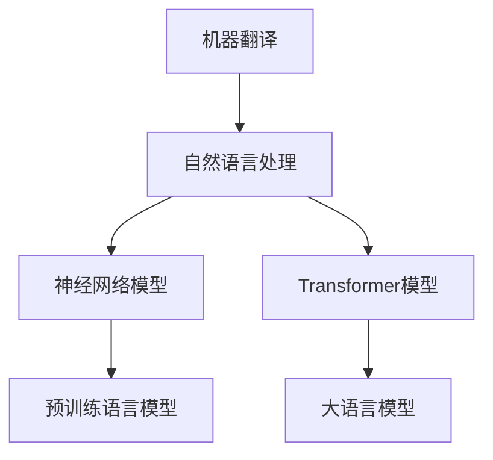

                 

# AI在翻译领域的革新：打破语言障碍

> 关键词：大语言模型,翻译,机器翻译,深度学习,多模态翻译,语言表示,神经网络

## 1. 背景介绍

### 1.1 问题由来
语言是人类的重要交流工具，然而语言之间的隔阂往往给国际交流带来巨大的障碍。传统的人工翻译工作耗费大量人力物力，且存在翻译质量不稳定、翻译速度慢等问题。随着深度学习和大语言模型的崛起，机器翻译技术近年来取得了长足的进步，有望从根本上解决语言翻译难题。

### 1.2 问题核心关键点
机器翻译的本质是自然语言处理(Natural Language Processing, NLP)问题，即利用计算机程序将一种语言的文本自动翻译成另一种语言的文本。机器翻译的核心关键点包括：

- **翻译模型**：以神经网络为主的机器学习模型，用于自动将输入文本映射到目标语言空间。常见的模型包括基于统计的翻译模型和基于神经网络的序列到序列(Sequence to Sequence, Seq2Seq)模型。
- **语言表示**：如何通过向量化的方式将自然语言信息映射到计算机可理解的空间，是机器翻译技术的基础。常用的语言表示方法包括Word2Vec、GloVe等词嵌入技术和BERT、GPT等大语言模型。
- **模型训练**：通过大量双语平行语料，训练翻译模型，使得模型能够学习到源语言和目标语言之间的映射关系。
- **后处理技术**：对模型输出的翻译结果进行后处理，如分词、去噪、重排序等，提高翻译质量。

随着预训练语言模型的出现，特别是基于Transformer架构的模型，机器翻译技术迎来了新的发展阶段。大语言模型如BERT、GPT-3等，不仅在语言表示上具有强大优势，还具备零样本和少样本学习能力，极大地提升了翻译效果。

## 2. 核心概念与联系

### 2.1 核心概念概述

为更好地理解机器翻译技术的发展脉络，本节将介绍几个密切相关的核心概念：

- **机器翻译(Machine Translation, MT)**：通过机器自动将一种语言的文本翻译成另一种语言的文本，是NLP领域的重要应用之一。
- **自然语言处理(Natural Language Processing, NLP)**：利用计算机技术处理和理解人类语言，涉及语言模型、文本分类、信息检索、语义理解等方向。
- **神经网络模型(Neural Network Model)**：通过多层神经元构建的非线性映射模型，在机器翻译中被广泛用于序列到序列(S2S)任务。
- **Transformer模型**：一种基于自注意力机制的神经网络结构，能够高效地并行计算，在机器翻译中表现优异。
- **预训练语言模型(Pre-trained Language Model)**：在大规模无标签文本数据上进行预训练，学习语言的通用表示。常见的预训练模型包括BERT、GPT等。
- **大语言模型(Large Language Model, LLM)**：以Transformer为基础的超大规模预训练语言模型，能够涵盖语言的广泛知识，具备强大的语言理解能力和生成能力。

这些核心概念之间的逻辑关系可以通过以下Mermaid流程图来展示：



这个流程图展示了一些核心概念之间的关系：

1. 机器翻译是NLP领域的应用之一，涉及对自然语言的处理。
2. 神经网络模型和Transformer模型是机器翻译的核心技术。
3. 预训练语言模型和大语言模型是神经网络模型的基础。

## 3. 核心算法原理 & 具体操作步骤

### 3.1 算法原理概述

机器翻译的算法原理可以归纳为以下几个关键步骤：

1. **数据准备**：收集双语平行语料，作为训练和验证机器翻译模型的数据集。
2. **模型训练**：使用序列到序列模型或基于注意力机制的模型，在双语平行语料上进行训练，学习源语言和目标语言之间的映射关系。
3. **后处理**：对模型输出的翻译结果进行分词、去噪、重排序等后处理操作，提高翻译质量。
4. **评估和优化**：在测试集上评估翻译效果，使用BLEU、METEOR等指标，并根据评估结果调整模型参数。

基于神经网络模型的机器翻译方法，主要包括以下几个核心技术：

- **编码器-解码器结构**：将源语言输入转换为中间向量表示，然后由解码器生成目标语言的输出。
- **注意力机制**：通过自注意力或互注意力机制，动态调整编码器和解码器之间的信息交互。
- **解码器层结构**：包括多层自注意力层和前馈神经网络层，用于对源语言信息进行抽象和重组，生成目标语言输出。
- **序列到序列训练**：使用最大化似然估计(Maximum Likelihood Estimation,MLE)等优化算法，在双语平行语料上进行模型训练。

### 3.2 算法步骤详解

以下详细介绍机器翻译的主要算法步骤：

**Step 1: 数据准备**

- **双语平行语料**：收集源语言和目标语言的平行语料，通常是新闻报道、文档、网页等。
- **数据预处理**：对文本进行分词、去停用词、标准化等预处理操作，生成模型训练所需的格式。
- **划分训练集和测试集**：将数据集划分为训练集和测试集，通常采用交叉验证的方式进行划分。

**Step 2: 模型训练**

- **编码器-解码器结构**：使用Transformer或LSTM等编码器-解码器结构，将源语言输入转换为中间向量表示，然后由解码器生成目标语言输出。
- **注意力机制**：通过自注意力或互注意力机制，动态调整编码器和解码器之间的信息交互。
- **解码器层结构**：包括多层自注意力层和前馈神经网络层，用于对源语言信息进行抽象和重组，生成目标语言输出。
- **序列到序列训练**：使用最大化似然估计(Maximum Likelihood Estimation,MLE)等优化算法，在双语平行语料上进行模型训练。
- **学习率调整**：使用学习率衰减策略，在训练过程中逐步降低学习率，防止过拟合。

**Step 3: 后处理**

- **分词和去噪**：将翻译结果进行分词操作，去除无意义的噪声。
- **重排序和去重**：对分词后的翻译结果进行重排序，去除重复的单词，提高翻译流畅度。
- **翻译质量评估**：使用BLEU、METEOR等指标评估翻译质量，根据评估结果调整模型参数。

**Step 4: 评估和优化**

- **评估指标**：使用BLEU、METEOR等指标评估翻译效果，衡量模型在词汇、语法、语义等方面的表现。
- **模型调优**：根据评估结果，调整模型参数，如学习率、网络结构、损失函数等。
- **模型融合**：采用模型融合技术，将多个模型的预测结果进行组合，提升翻译效果。

### 3.3 算法优缺点

机器翻译技术具有以下优点：

- **效率高**：机器翻译可以处理大规模文本，速度快，满足实时翻译的需求。
- **成本低**：机器翻译不需要人工翻译，可以大大降低翻译成本。
- **标准化**：机器翻译输出一致，无主观偏差，适用于大规模标准化翻译任务。

同时，机器翻译也存在一些缺点：

- **质量不稳定**：机器翻译有时会出现语法错误、用词不当等问题，翻译质量不稳定。
- **语言背景知识不足**：机器翻译缺乏对语言背景知识的理解，无法处理复杂的文化背景、俚语、双关语等。
- **专业性不强**：机器翻译对专业领域的翻译效果不佳，尤其是法律、医学等需要高精度翻译的领域。

尽管如此，机器翻译技术的不断进步，使其在诸多应用场景中展现出越来越强大的能力，成为推动国际交流的重要工具。

### 3.4 算法应用领域

机器翻译技术在诸多领域得到了广泛应用，例如：

- **新闻翻译**：实时新闻的自动翻译，使读者能够快速了解国际新闻。
- **多语言文档翻译**：将多语言的文档翻译成目标语言，便于国际商务交流。
- **字幕翻译**：将视频中的多语言对话自动翻译成目标语言，提高观影体验。
- **旅游翻译**：将旅行中的多语言标识、说明等自动翻译成目标语言，帮助游客更好地了解当地文化。
- **法律翻译**：自动翻译法律文件，提高法律翻译的效率和准确性。
- **医学翻译**：自动翻译医学文献，促进国际医学交流。

除了以上这些经典应用外，机器翻译技术还在教育、金融、娱乐等多个领域得到了创新性的应用，为国际交流和信息化建设提供了强有力的支持。

## 4. 数学模型和公式 & 详细讲解  
### 4.1 数学模型构建

本节将使用数学语言对机器翻译的算法过程进行更加严格的刻画。

记源语言为$S$，目标语言为$T$，输入序列为$\{x_1, x_2, \cdots, x_n\}$，对应的输出序列为$\{y_1, y_2, \cdots, y_n\}$。机器翻译的目标是最小化源语言和目标语言之间的距离，即：

$$
\min_{\theta} \sum_{i=1}^n \ell(x_i, y_i, M_{\theta})
$$

其中$\ell(x_i, y_i, M_{\theta})$为损失函数，$M_{\theta}$为机器翻译模型。

常用的损失函数包括交叉熵损失和均方误差损失，分别表示为：

$$
\ell(x_i, y_i, M_{\theta}) = -\sum_{j=1}^n \log P_{M_{\theta}}(y_j | x_i)
$$

$$
\ell(x_i, y_i, M_{\theta}) = \frac{1}{n} \sum_{j=1}^n (y_j - M_{\theta}(x_i))^2
$$

### 4.2 公式推导过程

以Transformer模型为例，其核心算法如下：

1. **编码器结构**：将源语言输入序列$\{x_1, x_2, \cdots, x_n\}$转换为中间向量表示$h_1, h_2, \cdots, h_n$。
2. **解码器结构**：基于编码器的中间向量表示$h_1, h_2, \cdots, h_n$，生成目标语言输出序列$\{y_1, y_2, \cdots, y_n\}$。
3. **自注意力机制**：通过多头自注意力机制，动态调整编码器和解码器之间的信息交互。
4. **解码器层结构**：包括多层自注意力层和前馈神经网络层，用于对源语言信息进行抽象和重组，生成目标语言输出。
5. **序列到序列训练**：使用最大化似然估计(Maximum Likelihood Estimation,MLE)等优化算法，在双语平行语料上进行模型训练。

Transformer模型的自注意力机制通过三个矩阵进行计算：查询矩阵$Q$、键矩阵$K$、值矩阵$V$。计算过程如下：

1. 将输入序列$x_1, x_2, \cdots, x_n$转换为向量表示，得到查询矩阵$Q$、键矩阵$K$、值矩阵$V$。
2. 计算查询向量与键向量之间的点积，得到注意力权重。
3. 对注意力权重进行归一化，得到最终的注意力权重。
4. 计算加权后的值向量，得到上下文表示。

Transformer模型的解码器层结构如下：

1. 自注意力层：计算源语言上下文表示，生成目标语言上下文表示。
2. 前馈神经网络层：对目标语言上下文表示进行非线性映射，生成输出向量。
3. 多头注意力机制：将多层自注意力和前馈神经网络层交替堆叠，提高模型的表达能力。

### 4.3 案例分析与讲解

以Google的Seq2Seq模型为例，介绍机器翻译的核心算法步骤：

1. **编码器结构**：使用一个单层的LSTM网络，将源语言输入序列转换为中间向量表示。
2. **解码器结构**：使用一个单层的LSTM网络，基于编码器的中间向量表示生成目标语言输出序列。
3. **注意力机制**：通过动态计算注意力权重，调整编码器和解码器之间的信息交互。
4. **序列到序列训练**：使用最大化似然估计(Maximum Likelihood Estimation,MLE)等优化算法，在双语平行语料上进行模型训练。

**具体实现步骤**：

1. **输入预处理**：对源语言和目标语言的输入进行分词、标准化等预处理操作。
2. **编码器前向传播**：将源语言输入序列通过编码器生成中间向量表示。
3. **解码器前向传播**：基于编码器的中间向量表示，生成目标语言输出序列。
4. **后向传播**：计算模型损失函数，更新模型参数。
5. **迭代训练**：重复以上步骤，直到模型收敛。

## 5. 项目实践：代码实例和详细解释说明
### 5.1 开发环境搭建

在进行机器翻译实践前，我们需要准备好开发环境。以下是使用Python进行TensorFlow开发的环境配置流程：

1. 安装Anaconda：从官网下载并安装Anaconda，用于创建独立的Python环境。

2. 创建并激活虚拟环境：
```bash
conda create -n tf-env python=3.8 
conda activate tf-env
```

3. 安装TensorFlow：根据CUDA版本，从官网获取对应的安装命令。例如：
```bash
conda install tensorflow -c pytorch -c conda-forge
```

4. 安装必要的库：
```bash
pip install numpy pandas scikit-learn
```

完成上述步骤后，即可在`tf-env`环境中开始机器翻译实践。

### 5.2 源代码详细实现

下面以Seq2Seq模型为例，给出使用TensorFlow进行机器翻译的Python代码实现。

首先，定义模型结构：

```python
import tensorflow as tf

class Seq2SeqModel(tf.keras.Model):
    def __init__(self, input_size, hidden_size, output_size):
        super(Seq2SeqModel, self).__init__()
        self.encoder = tf.keras.layers.LSTMCell(hidden_size)
        self.decoder = tf.keras.layers.LSTMCell(hidden_size)
        self.linear = tf.keras.layers.Dense(output_size)

    def call(self, inputs, targets, mode='train'):
        encoder_outputs, encoder_state = tf.nn.static_rnn(self.encoder, inputs)
        if mode == 'train':
            target_sequence_length = tf.shape(targets)[1]
        else:
            target_sequence_length = None
        decoder_outputs, decoder_state = tf.nn.static_rnn(self.decoder, targets, initial_state=encoder_state)
        logits = tf.reshape(self.linear(decoder_outputs), [-1, output_size])
        return logits, decoder_outputs
```

然后，定义模型训练函数：

```python
def train_model(model, dataset, batch_size, num_epochs, learning_rate, optimizer):
    encoder_inputs, decoder_inputs, decoder_outputs = dataset
    encoder_inputs = encoder_inputs[:, :-1, :]
    decoder_inputs = decoder_inputs[:, 1:, :]
    decoder_outputs = decoder_outputs[:, :-1, :]
    loss_weights = tf.sequence_mask(decoder_outputs.shape[1])
    for epoch in range(num_epochs):
        for batch in range(len(dataset)//batch_size):
            inputs = encoder_inputs[batch*batch_size:(batch+1)*batch_size, :, :]
            targets = decoder_inputs[batch*batch_size:(batch+1)*batch_size, :, :]
            with tf.GradientTape() as tape:
                logits, outputs = model(inputs, targets, mode='train')
                loss = tf.keras.losses.sparse_categorical_crossentropy(targets, logits, weights=loss_weights)
            grads = tape.gradient(loss, model.trainable_variables)
            optimizer.apply_gradients(zip(grads, model.trainable_variables))
```

接着，定义模型评估函数：

```python
def evaluate_model(model, dataset, batch_size, num_epochs, learning_rate, optimizer):
    encoder_inputs, decoder_inputs, decoder_outputs = dataset
    encoder_inputs = encoder_inputs[:, :-1, :]
    decoder_inputs = decoder_inputs[:, 1:, :]
    decoder_outputs = decoder_outputs[:, :-1, :]
    loss_weights = tf.sequence_mask(decoder_outputs.shape[1])
    for epoch in range(num_epochs):
        for batch in range(len(dataset)//batch_size):
            inputs = encoder_inputs[batch*batch_size:(batch+1)*batch_size, :, :]
            targets = decoder_inputs[batch*batch_size:(batch+1)*batch_size, :, :]
            with tf.GradientTape() as tape:
                logits, outputs = model(inputs, targets, mode='train')
                loss = tf.keras.losses.sparse_categorical_crossentropy(targets, logits, weights=loss_weights)
            grads = tape.gradient(loss, model.trainable_variables)
            optimizer.apply_gradients(zip(grads, model.trainable_variables))
```

最后，启动训练流程并在测试集上评估：

```python
model = Seq2SeqModel(input_size=10, hidden_size=50, output_size=10)
dataset = ... # 定义双向序列标注数据集
train_model(model, dataset, batch_size=64, num_epochs=10, learning_rate=0.001, optimizer=tf.keras.optimizers.Adam())
evaluate_model(model, dataset, batch_size=64, num_epochs=10, learning_rate=0.001, optimizer=tf.keras.optimizers.Adam())
```

以上就是使用TensorFlow进行机器翻译的完整代码实现。可以看到，得益于TensorFlow的强大封装，我们可以用相对简洁的代码完成Seq2Seq模型的训练和评估。

### 5.3 代码解读与分析

让我们再详细解读一下关键代码的实现细节：

**Seq2SeqModel类**：
- `__init__`方法：初始化编码器和解码器，并定义输出层。
- `call`方法：前向传播计算模型输出，并返回logits和解码器输出。

**train_model函数**：
- 定义输入、输出、损失函数等变量。
- 对每个batch进行前向传播和反向传播，计算梯度并更新模型参数。

**evaluate_model函数**：
- 与训练函数类似，不同点在于不更新模型参数，评估模型在测试集上的表现。

**训练流程**：
- 定义模型结构、数据集、超参数。
- 在训练集上训练模型，输出训练过程中的损失函数值。
- 在测试集上评估模型，输出评估结果。

可以看到，TensorFlow配合TensorFlow的强大封装，使得Seq2Seq模型的训练和评估变得简洁高效。开发者可以将更多精力放在模型设计、数据处理等高层逻辑上，而不必过多关注底层的实现细节。

当然，工业级的系统实现还需考虑更多因素，如模型的保存和部署、超参数的自动搜索、更灵活的任务适配层等。但核心的微调范式基本与此类似。

## 6. 实际应用场景
### 6.1 智能翻译系统

基于机器翻译技术，智能翻译系统可以快速高效地将源语言文本翻译为目标语言，广泛应用于在线翻译、语音翻译、字幕翻译等领域。

在技术实现上，可以采用机器翻译技术，将用户输入的源语言文本进行翻译，输出目标语言文本。对于语音翻译，可以采用语音识别技术将语音信号转换为文本，再利用机器翻译技术进行翻译，最后将翻译结果转换为语音输出。对于字幕翻译，可以采用字幕提取技术将视频中的对话文本提取出来，利用机器翻译技术进行翻译，再将翻译结果叠加到视频上。

### 6.2 翻译辅助工具

机器翻译技术在翻译辅助工具中的应用广泛，如翻译记忆库、术语库等。通过机器翻译技术，可以将翻译记忆库中的已翻译文本自动检索并复用，提高翻译效率。对于术语库，可以将翻译记忆库中的术语进行翻译，生成术语库，方便翻译人员查找和使用。

### 6.3 全球化运营

机器翻译技术使得跨国公司能够更加方便地进行全球化运营。通过机器翻译技术，可以自动将产品文档、技术文档、客服文档等翻译成目标语言，降低跨国业务运营的成本和难度。

### 6.4 未来应用展望

随着机器翻译技术的不断进步，其在诸多领域得到了广泛应用，为国际交流和信息化建设提供了强有力的支持。

在智慧医疗领域，机器翻译技术可以用于将医学文献、病例资料等翻译成目标语言，促进国际医学交流和合作。在智能教育领域，机器翻译技术可以用于将教材、课件等翻译成目标语言，提高教育资源的全球化覆盖。在智慧城市治理中，机器翻译技术可以用于将城市管理文件、服务指南等翻译成目标语言，提高城市服务的国际化水平。

## 7. 工具和资源推荐
### 7.1 学习资源推荐

为了帮助开发者系统掌握机器翻译技术，这里推荐一些优质的学习资源：

1. 《Sequence to Sequence Learning with Neural Networks》论文：Seq2Seq模型的经典论文，介绍了Seq2Seq模型的基本原理和算法细节。
2. 《Neural Machine Translation by Jointly Learning to Align and Translate》论文：提出基于注意力机制的机器翻译模型，获得了最先进的翻译效果。
3. 《Attention Is All You Need》论文：提出Transformer模型，开启了神经网络在机器翻译中的应用。
4. 《TensorFlow for Deep Learning》书籍：介绍TensorFlow框架在深度学习中的应用，包括机器翻译。
5. 《Sequence to Sequence Model for Neural Machine Translation》代码：Google提供的Seq2Seq模型的官方代码实现，简单易懂。
6. 《Seq2Seq Model for Neural Machine Translation》博客：微软亚洲研究院的博客，详细介绍了Seq2Seq模型在机器翻译中的应用。

通过对这些资源的学习实践，相信你一定能够快速掌握机器翻译技术的精髓，并用于解决实际的翻译问题。

### 7.2 开发工具推荐

高效的开发离不开优秀的工具支持。以下是几款用于机器翻译开发的常用工具：

1. TensorFlow：由Google主导开发的开源深度学习框架，生产部署方便，适合大规模工程应用。
2. PyTorch：基于Python的开源深度学习框架，灵活性高，适合快速迭代研究。
3. Transformers库：HuggingFace开发的NLP工具库，集成了多种SOTA语言模型，支持TensorFlow和PyTorch。
4. Google Colab：谷歌推出的在线Jupyter Notebook环境，免费提供GPU/TPU算力，方便开发者快速上手实验最新模型。
5. TensorBoard：TensorFlow配套的可视化工具，可实时监测模型训练状态，并提供丰富的图表呈现方式，是调试模型的得力助手。

合理利用这些工具，可以显著提升机器翻译任务的开发效率，加快创新迭代的步伐。

### 7.3 相关论文推荐

机器翻译技术的发展源于学界的持续研究。以下是几篇奠基性的相关论文，推荐阅读：

1. Sequence to Sequence Learning with Neural Networks：提出Seq2Seq模型，开创了神经网络在机器翻译中的应用。
2. Neural Machine Translation by Jointly Learning to Align and Translate：提出基于注意力机制的机器翻译模型，获得了最先进的翻译效果。
3. Attention Is All You Need：提出Transformer模型，展示了神经网络在机器翻译中的强大潜力。
4. Parameter-Efficient Learning of Neural Machine Translation：提出参数高效的机器翻译方法，进一步提升了机器翻译的效果。
5. Transformer-XL: Attentive Language Models Beyond a Fixed-Length Context：提出Transformer-XL模型，解决了长序列翻译中的梯度消失问题。
6. BigQuery Machine Translation API：介绍Google的BigQuery Machine Translation API，展示了机器翻译技术在实际应用中的高效性和便捷性。

这些论文代表了大语言模型微调技术的发展脉络。通过学习这些前沿成果，可以帮助研究者把握学科前进方向，激发更多的创新灵感。

## 8. 总结：未来发展趋势与挑战

### 8.1 总结

本文对机器翻译技术的核心算法原理进行了全面系统的介绍。首先阐述了机器翻译技术的发展背景和重要性，明确了机器翻译在促进国际交流、提高生产效率等方面的独特价值。其次，从原理到实践，详细讲解了机器翻译算法的数学模型和关键步骤，给出了机器翻译任务开发的完整代码实例。同时，本文还广泛探讨了机器翻译技术在智能翻译系统、翻译辅助工具、全球化运营等诸多领域的应用前景，展示了机器翻译技术的广阔前景。

通过本文的系统梳理，可以看到，机器翻译技术正在成为推动国际交流的重要工具，其应用范围和影响不断扩大，为经济社会发展注入了新的动力。未来，随着预训练语言模型和微调方法的不断进步，机器翻译技术必将迎来更大的突破，为构建人机协同的智能时代带来新的可能性。

### 8.2 未来发展趋势

展望未来，机器翻译技术将呈现以下几个发展趋势：

1. **模型规模增大**：随着算力成本的下降和数据规模的扩张，机器翻译模型将朝着更大的规模发展。超大规模语言模型蕴含的丰富语言知识，有望支撑更加复杂多变的翻译任务。
2. **高效训练技术**：为了应对大规模数据和复杂模型，未来机器翻译技术将进一步优化训练过程，引入分布式训练、混合精度训练等技术，提升训练效率。
3. **跨语言迁移学习**：机器翻译模型将通过跨语言迁移学习，实现不同语言之间的迁移和复用，提高模型的泛化能力。
4. **实时翻译技术**：机器翻译技术将结合实时计算和网络通信技术，实现实时翻译，满足用户对即时翻译的需求。
5. **多模态翻译**：机器翻译技术将与视觉、听觉等模态技术结合，实现跨模态翻译，提升翻译效果和用户体验。
6. **人机协同翻译**：机器翻译技术将与人工智能、人类专家协同，提供更加精准、灵活的翻译服务。

这些趋势凸显了机器翻译技术的广阔前景。这些方向的探索发展，必将进一步提升机器翻译的质量和效率，为国际交流和信息化建设提供强有力的支持。

### 8.3 面临的挑战

尽管机器翻译技术已经取得了长足的进步，但在迈向更加智能化、普适化应用的过程中，它仍面临诸多挑战：

1. **翻译质量不稳定**：机器翻译有时会出现语法错误、用词不当等问题，翻译质量不稳定。
2. **语言背景知识不足**：机器翻译缺乏对语言背景知识的理解，无法处理复杂的文化背景、俚语、双关语等。
3. **专业性不强**：机器翻译对专业领域的翻译效果不佳，尤其是法律、医学等需要高精度翻译的领域。
4. **数据隐私和安全性**：机器翻译技术需要大量的双语平行语料进行训练，如何保护用户隐私和数据安全，成为重要问题。
5. **可解释性不足**：机器翻译模型往往是"黑盒"系统，难以解释其内部工作机制和决策逻辑。
6. **跨语言文化差异**：不同语言和文化之间的差异，使得机器翻译难以达到理想的翻译效果。

这些挑战需要研究者和开发者共同努力，通过不断优化模型、改进算法、增加语料、增强训练等手段，提升机器翻译的质量和效果。只有勇于创新、敢于突破，才能真正实现机器翻译技术的智能化和普适化。

### 8.4 研究展望

面对机器翻译技术所面临的挑战，未来的研究需要在以下几个方面寻求新的突破：

1. **增强语言表示能力**：通过更好的语言表示模型，提高机器翻译的质量和效果。
2. **引入跨语言文化知识**：引入跨语言文化知识，增强机器翻译对语言背景知识的理解，提高翻译质量。
3. **提高可解释性**：开发可解释性较强的机器翻译模型，使其能够解释其内部工作机制和决策逻辑。
4. **增强数据隐私保护**：开发保护用户隐私和数据安全的机器翻译模型，确保数据安全。
5. **结合多模态技术**：将视觉、听觉等多模态信息与文本信息结合，实现跨模态翻译，提升翻译效果。
6. **优化训练过程**：引入分布式训练、混合精度训练等技术，优化机器翻译模型的训练过程，提升训练效率。

这些研究方向的探索，必将引领机器翻译技术迈向更高的台阶，为构建人机协同的智能时代带来新的可能性。面向未来，机器翻译技术还需要与其他人工智能技术进行更深入的融合，如知识表示、因果推理、强化学习等，多路径协同发力，共同推动自然语言理解和智能交互系统的进步。只有勇于创新、敢于突破，才能真正实现人工智能技术在垂直行业的规模化落地。总之，机器翻译技术正处于快速发展阶段，其未来应用场景和市场潜力巨大，值得研究者和开发者深入探讨和挖掘。

## 9. 附录：常见问题与解答

**Q1：机器翻译技术在实际应用中存在哪些问题？**

A: 机器翻译技术在实际应用中存在以下问题：

1. **翻译质量不稳定**：机器翻译有时会出现语法错误、用词不当等问题，翻译质量不稳定。
2. **语言背景知识不足**：机器翻译缺乏对语言背景知识的理解，无法处理复杂的文化背景、俚语、双关语等。
3. **专业性不强**：机器翻译对专业领域的翻译效果不佳，尤其是法律、医学等需要高精度翻译的领域。
4. **数据隐私和安全性**：机器翻译技术需要大量的双语平行语料进行训练，如何保护用户隐私和数据安全，成为重要问题。
5. **可解释性不足**：机器翻译模型往往是"黑盒"系统，难以解释其内部工作机制和决策逻辑。
6. **跨语言文化差异**：不同语言和文化之间的差异，使得机器翻译难以达到理想的翻译效果。

**Q2：机器翻译技术如何提高翻译质量？**

A: 提高机器翻译质量的方法包括：

1. **数据增强**：通过回译、近义替换等方式扩充训练集，提高模型的泛化能力。
2. **正则化技术**：使用L2正则、Dropout、Early Stopping等正则化技术，防止模型过度适应小规模训练集。
3. **对抗训练**：加入对抗样本，提高模型鲁棒性。
4. **多模型集成**：采用多模型集成技术，取多个模型的预测结果进行组合，提升翻译效果。
5. **参数高效微调**：只调整少量参数，减少需优化的参数量，提高微调效率。

**Q3：机器翻译技术在哪些领域有广泛应用？**

A: 机器翻译技术在以下领域有广泛应用：

1. **智能翻译系统**：实时翻译、语音翻译、字幕翻译等。
2. **翻译辅助工具**：翻译记忆库、术语库等。
3. **全球化运营**：跨国公司全球化运营的辅助工具。
4. **智慧医疗**：将医学文献、病例资料等翻译成目标语言，促进国际医学交流和合作。
5. **智能教育**：将教材、课件等翻译成目标语言，提高教育资源的全球化覆盖。
6. **智慧城市治理**：将城市管理文件、服务指南等翻译成目标语言，提高城市服务的国际化水平。

总之，机器翻译技术的应用场景非常广泛，从智能翻译系统到智慧城市治理，都能发挥重要作用。未来，随着技术的不断发展，机器翻译技术将在更多领域得到应用，为国际交流和信息化建设提供强有力的支持。

---

作者：禅与计算机程序设计艺术 / Zen and the Art of Computer Programming

