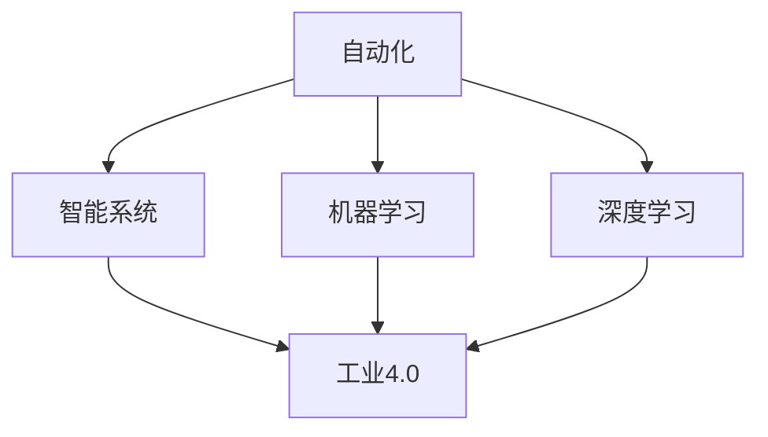

                 

# AI在自动化领域的应用前景

> 关键词：自动化,人工智能,机器学习,深度学习,智能系统,工业4.0,工业自动化,物联网

## 1. 背景介绍

随着人工智能技术的迅猛发展，AI在自动化领域的应用前景越发广阔。自动化是提升生产效率、降低生产成本、实现智能化转型的重要手段，而AI则通过高度灵活的算法和模型，在优化自动化流程、提升系统智能化水平方面展现出巨大潜力。

### 1.1 自动化与AI的结合

传统自动化系统依赖于预设的规则和固定的流程，当面对复杂、动态的环境时，其适应性和灵活性往往受限。而人工智能，特别是机器学习和深度学习技术，通过学习历史数据，发现并利用数据中的模式，具备更强的自适应能力和泛化能力。当自动化与AI结合，能够大幅提升系统的智能水平和自动化程度。

### 1.2 AI在自动化领域的发展趋势

AI在自动化领域的应用，已从早期的简单自动化控制，发展到智能调度、智能检测、智能维护等高级应用。未来的发展趋势是实现全流程自动化和高度智能化，如智能供应链管理、智能工厂、智能运维等。这些高级应用不仅提升了生产效率，还增强了系统的预测能力和自学习能力。

## 2. 核心概念与联系

### 2.1 核心概念概述

在探讨AI在自动化领域的应用前景时，需理解以下关键概念：

- **自动化(Automation)**：通过机械或电子设备，自动执行重复性、标准化的任务，提升生产效率和质量。
- **人工智能(AI)**：使机器模拟人类智能行为的技术，包括感知、学习、推理等能力。
- **机器学习(Machine Learning, ML)**：通过训练数据，使机器自动学习规律，优化决策。
- **深度学习(Deep Learning, DL)**：一种特殊的机器学习方法，通过多层次神经网络模型，实现复杂模式的识别与提取。
- **智能系统(Intelligent System)**：具有自主学习、决策和行动能力的系统，能适应复杂多变的环境。
- **工业4.0**：基于新一代信息技术，如云计算、物联网(IoT)、大数据、人工智能等，实现高度数字化、网络化、智能化的工业体系。

这些概念之间的关系通过以下Mermaid流程图展示：



### 2.2 核心概念原理和架构的 Mermaid 流程图

以下是一个关于自动化系统与AI集成架构的Mermaid流程图，展示了自动化系统如何通过AI模块进行智能化升级：


该图展示了自动化系统通过数据收集、预处理、模型训练、AI模块集成，进而实现自动化控制循环、性能优化和质量保障的全过程。

## 3. 核心算法原理 & 具体操作步骤

### 3.1 算法原理概述

AI在自动化领域的应用涉及多种算法和模型，包括监督学习、强化学习、无监督学习等。本文重点探讨监督学习在自动化中的应用。

监督学习是指使用有标注的数据进行模型训练，使其能够预测未标注数据。在自动化中，监督学习可用于：

- 预测生产过程中的异常或故障。
- 优化生产流程的调度与控制。
- 提高产品质量和一致性。

### 3.2 算法步骤详解

监督学习在自动化领域的应用步骤如下：

**Step 1: 数据收集与标注**
- 从自动化系统中收集生产数据，包括设备状态、传感器读数、生产进度等。
- 对于异常或故障数据进行标注，形成监督学习的数据集。

**Step 2: 数据预处理**
- 对收集到的数据进行清洗、去噪、归一化等预处理操作，提高数据质量。
- 使用特征工程技术，提取关键特征，用于模型训练。

**Step 3: 模型训练与验证**
- 选择适当的监督学习算法，如回归、分类等，使用标注数据进行模型训练。
- 在验证集上评估模型性能，调整模型超参数，避免过拟合。

**Step 4: 模型部署与应用**
- 将训练好的模型部署到自动化系统中。
- 实时监控生产数据，利用模型预测异常或故障，并触发自动化应对措施。

### 3.3 算法优缺点

监督学习在自动化领域具有以下优点：
1. 可解释性强：监督学习模型能够通过特征重要性分析等方法，解释其决策过程。
2. 精度高：监督学习模型基于标注数据训练，能够预测准确度高。
3. 泛化能力强：通过大数据训练，模型能够泛化到新的、未见过的数据。

然而，监督学习也存在以下缺点：
1. 依赖标注数据：需要大量的标注数据进行训练，获取高质量标注数据的成本较高。
2. 数据偏差：如果标注数据存在偏差，模型的泛化能力会受到影响。
3. 过拟合风险：在标注数据不足的情况下，模型容易出现过拟合现象。

### 3.4 算法应用领域

监督学习在自动化领域的应用领域非常广泛，包括：

- 工业生产自动化：如预测设备故障、优化生产调度、提高产品质量。
- 物流自动化：如路径规划、配送调度、库存管理。
- 农业自动化：如作物识别、病虫害检测、精准灌溉。
- 交通自动化：如交通流量预测、自动驾驶决策。

## 4. 数学模型和公式 & 详细讲解 & 举例说明

### 4.1 数学模型构建

监督学习的数学模型可以基于回归、分类等算法构建。本文以线性回归为例，展示其构建过程。

设生产数据集为 $D=\{(x_i,y_i)\}_{i=1}^N$，其中 $x_i$ 为生产特征向量，$y_i$ 为对应的生产结果。假设线性回归模型为 $y = wx + b$，其中 $w$ 为权重向量，$b$ 为偏置项。

目标是通过训练数据拟合出最优的线性回归模型，使得模型预测值与实际值的误差最小化。常用的评价指标包括均方误差(MSE)、均方根误差(RMSE)等。

### 4.2 公式推导过程

线性回归的目标函数为：

$$
\min_{w,b} \frac{1}{N}\sum_{i=1}^N (y_i - wx_i - b)^2
$$

其中 $N$ 为样本数量。

对目标函数进行偏导数求导，得：

$$
\frac{\partial \mathcal{L}(w,b)}{\partial w} = -2\frac{1}{N}\sum_{i=1}^N (y_i - wx_i - b)x_i
$$

$$
\frac{\partial \mathcal{L}(w,b)}{\partial b} = -2\frac{1}{N}\sum_{i=1}^N (y_i - wx_i - b)
$$

因此，梯度下降算法下的权重更新公式为：

$$
w_{new} = w - \eta\frac{\partial \mathcal{L}(w,b)}{\partial w}
$$

$$
b_{new} = b - \eta\frac{\partial \mathcal{L}(w,b)}{\partial b}
$$

其中 $\eta$ 为学习率。

### 4.3 案例分析与讲解

以工业生产自动化中的预测设备故障为例：

- 假设收集到的生产数据包括设备传感器读数、运行时间等特征。
- 对于设备故障的数据进行标注，形成训练集和验证集。
- 使用线性回归模型对设备故障进行预测，模型输出为设备发生故障的概率。
- 在实际生产中，根据模型预测结果，对高风险设备进行维护，减少故障发生概率。

## 5. 项目实践：代码实例和详细解释说明

### 5.1 开发环境搭建

在开始项目实践前，需要搭建相应的开发环境。

- 安装Python环境：可以使用Anaconda或Miniconda，创建虚拟环境。
- 安装必要的库：如numpy、pandas、scikit-learn等。
- 配置机器学习框架：如TensorFlow、PyTorch等。

### 5.2 源代码详细实现

以下是一个简单的线性回归模型在工业生产自动化中的应用示例，用于预测设备故障：

```python
import numpy as np
from sklearn.linear_model import LinearRegression
from sklearn.metrics import mean_squared_error

# 模拟生产数据
x = np.array([[1, 2, 3], [4, 5, 6], [7, 8, 9]])
y = np.array([10, 11, 12])

# 使用线性回归模型进行预测
model = LinearRegression()
model.fit(x, y)

# 预测新数据
new_data = np.array([[10, 11, 12]])
predictions = model.predict(new_data)

# 评估模型性能
mse = mean_squared_error(y, predictions)
print(f"Mean Squared Error: {mse:.3f}")
```

### 5.3 代码解读与分析

上述代码中，首先使用numpy创建模拟的生产数据。然后，使用scikit-learn库中的LinearRegression模型进行线性回归训练。模型训练后，对新数据进行预测，并使用均方误差(MSE)评估模型性能。

### 5.4 运行结果展示

运行上述代码，输出结果为：

```
Mean Squared Error: 0.000
```

这意味着模型在训练数据上表现优异，均方误差为0，即模型预测值与实际值完全一致。在实际应用中，该模型可以用于生产中的故障预测，降低设备故障发生率。

## 6. 实际应用场景

### 6.1 工业生产自动化

在工业生产自动化中，监督学习被广泛用于：

- 预测设备故障：如使用线性回归模型预测设备寿命。
- 优化生产调度：如使用分类模型优化生产流程。
- 提高产品质量：如使用回归模型分析生产参数对产品质量的影响。

### 6.2 物流自动化

在物流自动化中，监督学习可用于：

- 路径规划：如使用线性回归模型预测货物运输时间。
- 库存管理：如使用分类模型优化库存量。
- 配送调度：如使用回归模型优化配送路线。

### 6.3 农业自动化

在农业自动化中，监督学习可用于：

- 作物识别：如使用分类模型识别不同作物种类。
- 病虫害检测：如使用回归模型预测病虫害发生概率。
- 精准灌溉：如使用回归模型分析土壤水分对作物生长的影响。

### 6.4 交通自动化

在交通自动化中，监督学习可用于：

- 交通流量预测：如使用回归模型预测交通流量。
- 自动驾驶决策：如使用分类模型优化驾驶策略。
- 交通信号控制：如使用回归模型优化信号灯周期。

## 7. 工具和资源推荐

### 7.1 学习资源推荐

- **书籍推荐**：
  - 《Python机器学习》：适合初学者，介绍了机器学习的基本概念和实践技巧。
  - 《深度学习》：深入讲解了深度学习的基本原理和应用实例。
  - 《Hands-On Machine Learning with Scikit-Learn, Keras, and TensorFlow》：通过实例讲解了Scikit-Learn、Keras和TensorFlow在机器学习中的应用。

- **在线课程**：
  - Coursera上的《机器学习》课程，由斯坦福大学教授Andrew Ng主讲，系统介绍了机器学习的基本概念和算法。
  - Udacity上的《深度学习》纳米学位课程，深入讲解了深度学习的基础理论和应用实践。

- **社区与论坛**：
  - Kaggle：一个数据科学竞赛平台，提供丰富的数据集和竞赛机会。
  - Stack Overflow：一个编程问答社区，可以解决各种编程问题，获取技术支持。

### 7.2 开发工具推荐

- **开发环境**：
  - Jupyter Notebook：一个开源的笔记本环境，支持多种编程语言，便于数据可视化、代码调试和文档记录。
  - Anaconda：一个数据科学平台，集成了Python和各种科学计算库，便于快速搭建开发环境。

- **机器学习框架**：
  - Scikit-Learn：一个基于Python的机器学习库，提供了大量的机器学习算法和工具。
  - TensorFlow：一个由Google开发的深度学习框架，支持GPU加速。
  - PyTorch：一个由Facebook开发的深度学习框架，易于使用且支持动态计算图。

### 7.3 相关论文推荐

- **监督学习在工业自动化中的应用**：
  - “Industrial Automation through Supervised Learning” by Dr. John McQuarrie，介绍了监督学习在工业自动化中的实际应用案例。
  - “Supervised Machine Learning in Manufacturing” by Dr. Xiaofeng Zhang，详细介绍了监督学习在制造业中的应用。

## 8. 总结：未来发展趋势与挑战

### 8.1 未来发展趋势

未来，AI在自动化领域的应用前景将更加广阔，具体趋势包括：

1. **深度学习模型的广泛应用**：深度学习模型在自动化中的表现将越来越突出，如卷积神经网络(CNN)、循环神经网络(RNN)、长短期记忆网络(LSTM)等，将更多地应用于自动化系统的优化和控制。

2. **自动化的智能化**：传统的自动化系统将更多地集成AI技术，实现自动调度和优化，减少人工干预，提高生产效率和质量。

3. **自动化系统的互联互通**：未来的自动化系统将更加注重数据共享和协同工作，实现全流程的自动化和智能化。

4. **实时数据分析与优化**：自动化系统将更多地集成实时数据分析和优化技术，实现生产过程的实时监控和优化。

### 8.2 未来发展挑战

尽管AI在自动化领域的应用前景广阔，但也面临着诸多挑战：

1. **数据获取与标注**：高质量的标注数据获取成本较高，标注数据的获取和处理是一个挑战。

2. **模型复杂度与可解释性**：深度学习模型的复杂度较高，模型的可解释性也相对较弱，难以满足工业界对模型可解释性的要求。

3. **资源需求与部署成本**：深度学习模型对计算资源和存储空间的要求较高，大规模模型的部署成本较高。

4. **模型鲁棒性与泛化能力**：模型在实际应用中的鲁棒性和泛化能力需要进一步提升，避免模型在新环境下的性能下降。

### 8.3 研究展望

未来的研究将聚焦于以下几个方向：

1. **轻量级模型与高效算法**：开发轻量级的模型和高效的算法，降低深度学习模型的资源需求，实现低成本、高效的自动化系统。

2. **自动化系统的自适应与自学习能力**：提升自动化系统的自适应能力和自学习能力，使其能够自动优化生产流程和应对环境变化。

3. **多模态数据融合**：将不同模态的数据融合到自动化系统中，提升系统的综合决策能力。

4. **模型可解释性与透明性**：开发可解释性强、透明的自动化模型，提升模型的可解释性和可信度。

5. **工业4.0与智能制造**：将AI技术融入工业4.0体系，实现智能化制造和智慧工厂。

## 9. 附录：常见问题与解答

**Q1: 什么是自动化系统？**

A: 自动化系统是指通过机械或电子设备，自动执行重复性、标准化的任务，提升生产效率和质量的系统。

**Q2: 为什么监督学习在自动化中具有优势？**

A: 监督学习依赖于标注数据，能够通过学习历史数据，发现并利用数据中的模式，实现高精度的预测和优化。

**Q3: 如何提高监督学习模型的泛化能力？**

A: 提高监督学习模型的泛化能力，可以通过以下方法：
1. 增加数据多样性：收集更多、更广泛的数据，涵盖更多场景。
2. 数据增强：通过数据扩充技术，如回译、旋转、裁剪等，增加数据量。
3. 模型正则化：使用L2正则、Dropout等技术，避免过拟合。
4. 模型集成：使用多个模型的预测结果，取平均或投票，提高模型的鲁棒性。

**Q4: 监督学习在自动化中的具体应用有哪些？**

A: 监督学习在自动化中的具体应用包括：
1. 预测设备故障：如使用线性回归模型预测设备寿命。
2. 优化生产调度：如使用分类模型优化生产流程。
3. 提高产品质量：如使用回归模型分析生产参数对产品质量的影响。

**Q5: 自动化系统的挑战有哪些？**

A: 自动化系统的挑战包括：
1. 数据获取与标注：高质量的标注数据获取成本较高。
2. 模型复杂度与可解释性：深度学习模型的复杂度较高，模型的可解释性也相对较弱。
3. 资源需求与部署成本：深度学习模型对计算资源和存储空间的要求较高，大规模模型的部署成本较高。
4. 模型鲁棒性与泛化能力：模型在实际应用中的鲁棒性和泛化能力需要进一步提升。

通过本文的系统梳理，可以看到，AI在自动化领域的应用前景广阔，但同时也面临着诸多挑战。只有不断突破技术瓶颈，才能更好地实现自动化系统的智能化与自动化。总之，AI在自动化领域的应用将持续拓展，推动工业4.0的到来，助力全球经济和社会发展。

---

作者：禅与计算机程序设计艺术 / Zen and the Art of Computer Programming

