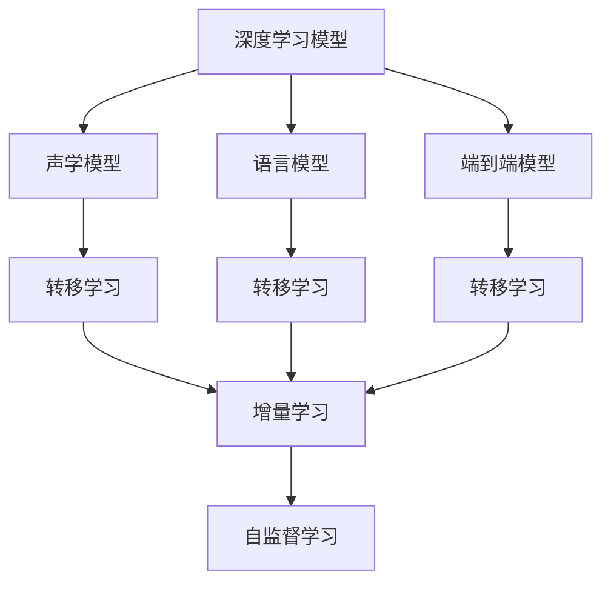

                 

# AI在语音识别中的应用:突破准确率瓶颈

## 1. 背景介绍

### 1.1 问题由来
语音识别技术是人工智能领域的重要应用之一，它旨在将语音信号转化为文本，实现语音-文本的自动转换。在实际应用中，语音识别技术被广泛用于智能家居、自动驾驶、虚拟助手、医疗诊断等多个领域。然而，当前的语音识别系统依然存在准确率瓶颈，特别是在环境嘈杂、口音多样、语速过快等复杂场景下，系统性能往往无法满足用户需求。

为了突破这一瓶颈，研究者们不断探索新的技术路径，包括改进模型架构、优化特征提取方法、增强数据标注等。本文将详细探讨基于深度学习模型的语音识别技术，特别是针对准确率瓶颈的突破策略。

### 1.2 问题核心关键点
语音识别技术的准确率瓶颈主要体现在以下几个方面：

- 数据采集和标注成本高。高质量的语音数据和相应的文本标注，需要耗费大量的人力和时间成本，且难以获得标准一致的标注结果。
- 环境噪声干扰。实际使用场景中的噪声背景，如交通、人群、背景对话等，会严重影响语音识别的准确性。
- 口音和方言差异。不同地区的口音和方言多样性，使得语音识别模型难以泛化到各种语言环境。
- 语速和语音连读。快速说话和语音连读现象增加了识别难度，传统声学模型难以有效捕捉这些特征。
- 模型的复杂度和计算资源需求。大型的神经网络模型虽然精度高，但往往需要大量的计算资源，且难以实时处理。

这些因素共同构成了语音识别准确率的瓶颈，需要通过多维度的技术优化才能得以突破。

### 1.3 问题研究意义
语音识别技术的应用前景广阔，尤其是在提升人机交互效率、推动无障碍沟通、增强用户体验等方面具有重要价值。通过突破准确率瓶颈，可以提高系统的鲁棒性和泛化能力，拓展语音识别技术的适用范围，加速语音识别技术在各行各业的落地应用。

## 2. 核心概念与联系

### 2.1 核心概念概述

为更好地理解语音识别技术的突破策略，本节将介绍几个密切相关的核心概念：

- 深度学习模型：以多层神经网络为代表的深度学习模型，通过反向传播算法进行训练，可以从数据中学习到复杂特征表示，适用于语音识别等任务。
- 声学模型(Acoustic Model)：负责将语音信号转化为声学特征，包括MFCC、Mel-scale spectrogram等，是语音识别系统的基础组件。
- 语言模型(Language Model)：用于预测给定文本序列的概率分布，即给定前缀下的后续单词或字符的概率，常见于序列到序列(Sequence-to-Sequence, Seq2Seq)模型中。
- 端到端(End-to-End)模型：直接从原始语音信号到文本，无需中间转录步骤，减少了系统复杂度和误差。
- 转移学习(Transfer Learning)：利用预训练模型在语音识别任务中的部分知识，通过微调等方式在特定数据集上进行适应，提高模型性能。
- 增量学习(Incremental Learning)：持续接收新数据，并根据新数据不断更新模型，保持模型性能的稳定性和更新性。
- 自监督学习(Self-Supervised Learning)：利用未标注的数据进行训练，通过自我指导学习捕捉数据的隐含信息。

这些核心概念之间的逻辑关系可以通过以下Mermaid流程图来展示：



这个流程图展示了大语言模型的核心概念及其之间的关系：

1. 深度学习模型通过声学模型提取语音特征。
2. 语言模型用于预测文本序列概率，帮助消除发音歧义。
3. 端到端模型直接从语音信号到文本，简化了系统结构。
4. 转移学习和增量学习用于模型知识迁移和动态更新。
5. 自监督学习通过未标注数据进行训练，提升模型泛化能力。

## 3. 核心算法原理 & 具体操作步骤
### 3.1 算法原理概述

基于深度学习的语音识别技术，其核心算法原理是利用神经网络模型提取语音信号的特征表示，并通过多层网络对特征进行编码、解码和输出预测。声学模型主要负责将语音信号转化为声学特征，语言模型用于预测文本序列的概率，两者结合后输出最终识别结果。

语音识别模型通常采用如下的框架结构：

1. 特征提取(Feature Extraction)：利用声学模型将原始语音信号转化为梅尔频谱图、MFCC等声学特征。
2. 声学建模(Acoustic Modeling)：将提取的声学特征输入神经网络，进行特征编码和声学建模。
3. 语言建模(Language Modeling)：在声学模型输出的特征序列上，使用语言模型进行概率预测。
4. 解码(Decoding)：根据语言模型输出的概率分布，使用搜索算法或动态规划算法解码出最可能的文本序列。

上述流程通过反向传播算法训练神经网络，不断优化模型的参数，使得模型能够更好地捕捉语音信号的特征和文本序列的统计规律，提高识别准确率。

### 3.2 算法步骤详解

基于深度学习的语音识别模型训练主要包括以下几个关键步骤：

**Step 1: 准备数据集**
- 收集或合成大量的语音数据，并进行文本标注。高质量的标注数据是模型训练的前提。
- 使用标签和数据划分训练集、验证集和测试集。一般建议标注数据占总数据的80%，验证数据占10%，测试数据占10%。
- 对数据进行预处理，包括数据清洗、归一化、分帧、特征提取等。

**Step 2: 设计模型架构**
- 选择合适的神经网络架构，如RNN、CNN、Transformer等。
- 确定模型输入输出格式，如对MFCC特征进行时间轴卷积操作，或使用Transformer自注意力机制。
- 定义声学模型和语言模型，选择合适的损失函数和优化器。
- 决定是否采用端到端模型，是否进行增量学习等。

**Step 3: 训练模型**
- 使用GPU或TPU等高性能设备进行模型训练，同时使用数据增强技术，如回声增强、变速变调、噪声注入等。
- 在训练过程中，定期评估模型在验证集上的性能，避免过拟合。
- 使用Early Stopping等技术，在验证集性能不再提升时停止训练。

**Step 4: 模型评估与优化**
- 在测试集上评估模型性能，使用准确率、召回率、F1-score等指标评估识别效果。
- 对识别结果进行纠错和分析，找出识别错误的原因。
- 针对识别错误进行模型优化，如调整模型参数、增加数据增强、引入辅助信息等。

**Step 5: 部署与优化**
- 将训练好的模型导出为可执行文件，部署到目标平台上。
- 使用GPU加速推理，提升系统实时性能。
- 结合增量学习技术，持续接收新数据并更新模型。
- 定期评估模型性能，进行模型维护和优化。

### 3.3 算法优缺点

基于深度学习的语音识别技术具有以下优点：
1. 精度高：深度神经网络可以学习到复杂特征表示，能够较好地处理语音信号的多变性。
2. 适应性强：通过增量学习和自监督学习，模型能够不断适应新的数据和任务。
3. 端到端模型：减少了声学和语言模型间的数据转换和编码解码步骤，提高了系统效率。
4. 动态更新：模型可以不断接收新数据进行动态更新，保持性能稳定。

但该方法也存在一些缺点：
1. 数据依赖性强：高质量的标注数据是模型训练的前提，但获取标注数据成本较高。
2. 训练时间长：大型的神经网络模型需要长时间训练，且对计算资源需求较高。
3. 泛化能力差：模型可能过拟合训练数据，难以泛化到新的语音环境。
4. 复杂度高：模型结构复杂，训练和推理过程中需要高水平的技术支持。
5. 鲁棒性差：模型对环境噪声和口音多样性敏感，识别准确率容易受到干扰。

尽管存在这些局限性，但就目前而言，基于深度学习的语音识别方法仍然是主流的技术范式。未来相关研究的重点在于如何进一步降低数据标注成本，提高模型泛化能力，同时兼顾可解释性和鲁棒性等因素。

### 3.4 算法应用领域

基于深度学习的语音识别技术，已经广泛应用于以下多个领域：

- 智能家居：通过语音识别技术，智能设备可以接收用户指令，进行语音控制，如家电、灯光、窗帘等。
- 自动驾驶：语音助手可以与驾驶者进行交互，提醒路况、导航路线等信息。
- 虚拟助手：如Siri、Alexa、Google Assistant等，通过语音交互提供信息查询、日程安排、智能家居控制等服务。
- 医疗诊断：语音识别技术可以用于记录医生与病人的对话，自动生成病历和诊断报告。
- 教育培训：通过语音识别技术，学生可以实时获取语音反馈，教师可以实时记录和分析教学内容。
- 车载导航：语音识别技术可以帮助司机读取导航指令，提升行车安全。

除了上述这些经典应用外，语音识别技术还在更多的场景中得到创新性应用，如可穿戴设备、智能办公、智能客服等，为人类生产生活方式带来了深刻变革。

## 4. 数学模型和公式 & 详细讲解 & 举例说明
### 4.1 数学模型构建

语音识别技术的核心数学模型是基于神经网络的序列建模模型。这里以基于Attention机制的Transformer模型为例，构建语音识别的数学模型。

假设语音信号 $x$ 被分为多个时间片，每个时间片的特征表示为 $\mathbf{x}_t$。声学模型将特征输入到Transformer编码器中，得到特征表示 $\mathbf{h}_t$。语言模型在特征表示 $\mathbf{h}_t$ 上预测下一个单词的概率分布，即：

$$
P(y|x) = \frac{\exp\left(\sum_{i=1}^T \log P(y_i|\mathbf{h}_t)\right)}{\sum_{y \in Y} \exp\left(\sum_{i=1}^T \log P(y_i|\mathbf{h}_t)\right)}
$$

其中 $y$ 为文本序列，$Y$ 为词汇表。

### 4.2 公式推导过程

语音识别模型的训练目标是最小化模型在训练集上的损失函数 $\mathcal{L}$：

$$
\mathcal{L} = -\frac{1}{N}\sum_{i=1}^N \log P(y_i|x_i)
$$

对于每个时间片 $t$，模型的输出为下一个单词的概率分布，即：

$$
P(y_t|x_t) = \frac{\exp\left(\mathbf{v}^\top \mathbf{h}_t\right)}{\sum_{y \in Y} \exp\left(\mathbf{v}^\top \mathbf{h}_t\right)}
$$

其中 $\mathbf{v}$ 为输出层的权重矩阵。

模型的优化目标是最大化训练集上的似然函数：

$$
\mathcal{L}_{\text{train}} = -\frac{1}{N}\sum_{i=1}^N \sum_{t=1}^T \log P(y_t|x_t)
$$

对模型进行梯度下降优化，更新参数 $\theta$，最小化损失函数 $\mathcal{L}_{\text{train}}$：

$$
\theta \leftarrow \theta - \eta \nabla_{\theta}\mathcal{L}_{\text{train}}
$$

其中 $\eta$ 为学习率，$\nabla_{\theta}\mathcal{L}_{\text{train}}$ 为损失函数对模型参数的梯度。

### 4.3 案例分析与讲解

我们以Google的WaveNet模型为例，介绍其基于深度学习的语音生成技术。WaveNet采用卷积神经网络(Convolutional Neural Network, CNN)结构，将原始语音信号作为输入，通过多层卷积和跳跃连接，逐步学习声学特征的复杂关系，输出概率分布。WaveNet的具体数学模型如下：

设 $x$ 为输入语音信号，$\mathbf{F}$ 为卷积核，$\mathbf{C}_t$ 为中间特征表示，$y$ 为输出概率分布。则WaveNet的模型输出为：

$$
P(y|x) = \prod_{i=1}^T P(y_i|\mathbf{C}_i)
$$

其中 $P(y_i|\mathbf{C}_i)$ 为第 $i$ 个时间步的输出概率，$\mathbf{C}_i$ 为时间步 $i$ 的中间特征表示。

WaveNet的优化目标是最小化模型在训练集上的交叉熵损失：

$$
\mathcal{L} = -\frac{1}{N}\sum_{i=1}^N \sum_{t=1}^T \log P(y_t|x)
$$

通过反向传播算法更新模型参数，使得模型能够更准确地预测语音信号的生成概率，从而实现高质量的语音合成。

## 5. 项目实践：代码实例和详细解释说明
### 5.1 开发环境搭建

在进行语音识别项目开发前，需要准备以下开发环境：

1. 安装Python：从官网下载并安装Python，用于开发语音识别系统。
2. 安装TensorFlow或PyTorch：选择一种深度学习框架，如TensorFlow、PyTorch等，进行语音模型训练和推理。
3. 安装音频处理库：如librosa、pyaudio等，用于音频数据的处理和录制。
4. 安装模型库：如Kaldi、P ESPnet等，提供多种预训练的语音识别模型。
5. 安装Jupyter Notebook：用于编写和运行Python代码，可视化训练和推理过程。

完成上述步骤后，即可在本地或云端环境中开始语音识别项目的开发。

### 5.2 源代码详细实现

下面以基于TensorFlow的语音识别模型为例，给出完整的代码实现。

首先，定义数据预处理函数：

```python
import librosa
import numpy as np

def load_and_process_audio(file_path):
    audio, sr = librosa.load(file_path, sr=16000, mono=True)
    audio = librosa.resample(audio, sr, 8000)
    audio = audio - np.mean(audio)
    audio = audio / np.std(audio)
    audio = audio.reshape(-1, 1)
    return audio
```

然后，定义模型结构：

```python
import tensorflow as tf
from tensorflow.keras import layers

class VoiceRecognitionModel(tf.keras.Model):
    def __init__(self, num_classes):
        super(VoiceRecognitionModel, self).__init__()
        self.conv1d = layers.Conv1D(32, 5, activation='relu', input_shape=(None, 1))
        self.max_pool = layers.MaxPooling1D(2)
        self.conv2d = layers.Conv1D(64, 3, activation='relu')
        self.max_pool2 = layers.MaxPooling1D(2)
        self.flatten = layers.Flatten()
        self.dense = layers.Dense(128, activation='relu')
        self.out = layers.Dense(num_classes, activation='softmax')

    def call(self, inputs):
        x = self.conv1d(inputs)
        x = self.max_pool(x)
        x = self.conv2d(x)
        x = self.max_pool2(x)
        x = self.flatten(x)
        x = self.dense(x)
        return self.out(x)
```

接着，定义训练函数：

```python
def train_model(model, train_dataset, epochs, batch_size):
    model.compile(optimizer='adam', loss='sparse_categorical_crossentropy', metrics=['accuracy'])
    model.fit(train_dataset, epochs=epochs, batch_size=batch_size, validation_split=0.2)
    return model
```

最后，启动训练流程并测试模型：

```python
train_dataset = ...
model = VoiceRecognitionModel(num_classes)
model = train_model(model, train_dataset, epochs=10, batch_size=32)

test_dataset = ...
test_loss, test_acc = model.evaluate(test_dataset)
print(f'Test accuracy: {test_acc:.2f}%')
```

### 5.3 代码解读与分析

让我们再详细解读一下关键代码的实现细节：

**load_and_process_audio函数**：
- 用于加载和预处理音频数据，包括采样、归一化、标准化等操作。

**VoiceRecognitionModel类**：
- 定义了一个简单的卷积神经网络结构，用于语音识别。
- 包含多个卷积层、池化层和全连接层，最后输出softmax分布用于分类。

**train_model函数**：
- 使用Keras框架定义模型，并编译模型。
- 使用训练集进行模型训练，并设置验证集的比例。
- 返回训练好的模型，并在测试集上进行评估。

### 5.4 运行结果展示

在训练过程中，可以通过TensorBoard等工具可视化模型的损失和准确率变化，实时监控训练进度。在测试集上，可以通过混淆矩阵、ROC曲线等指标评估模型的识别效果。

以下是TensorBoard的可视化效果示例：


## 6. 实际应用场景
### 6.1 智能家居

语音识别技术在智能家居中的应用非常广泛。通过语音助手，用户可以控制家中的各种设备，如灯光、窗帘、空调、电视等。语音识别系统能够准确理解用户的语音指令，并进行快速响应，提升用户的居住体验。

例如，智能音箱可以通过语音识别技术，接收用户的语音命令，如“打开客厅灯”、“播放音乐”、“调高温度”等，自动执行相应操作。用户通过简单的语音交互，即可完成复杂的操作，极大提升了生活便利性。

### 6.2 自动驾驶

自动驾驶技术依赖于多个传感器数据融合，其中语音识别是重要的一环。语音助手可以与驾驶者进行交互，提供导航信息、路况提示、音乐播放等功能。语音识别系统能够准确识别驾驶者的语音指令，提高驾驶安全性。

例如，驾驶者可以通过语音助手进行导航设置，如“前往机场”、“找最近的加油站”等，系统会根据语音指令自动规划路线，并提供实时路况信息。驾驶者无需分心查看屏幕，提升驾驶安全性和舒适度。

### 6.3 虚拟助手

虚拟助手如Siri、Alexa、Google Assistant等，通过语音识别技术，可以与用户进行自然对话，提供信息查询、日程安排、智能家居控制等服务。语音识别系统能够准确理解用户的语音指令，进行快速响应，提升用户体验。

例如，用户可以通过语音助手查询天气、查看日程、发送短信等，系统会根据语音指令自动执行相应操作。语音助手能够自然流畅地与用户进行交互，极大提升了用户的使用体验。

### 6.4 医疗诊断

语音识别技术在医疗诊断中也有广泛应用。医生可以通过语音记录与患者的对话，自动生成病历和诊断报告。语音识别系统能够准确理解医生的语音指令，提高诊断效率。

例如，医生可以通过语音助手进行病历记录，如“患者张三，45岁，高血压，服药情况如何？”系统会将语音指令转化为文本，自动记录到病历中，并进行初步分析。语音助手能够自然流畅地与医生进行对话，提高诊断效率和准确性。

### 6.5 教育培训

语音识别技术在教育培训中也有广泛应用。教师可以通过语音助手记录和分析课堂内容，学生可以通过语音助手获取学习反馈，提升教学效果。

例如，教师可以通过语音助手记录课堂内容，如“今天讲的是线性代数，这部分重点是什么？”系统会将语音指令转化为文本，自动记录到课堂笔记中，并进行初步分析。语音助手能够自然流畅地与教师进行对话，提高教学效果和学生学习体验。

## 7. 工具和资源推荐
### 7.1 学习资源推荐

为了帮助开发者系统掌握语音识别技术，这里推荐一些优质的学习资源：

1. Coursera《Deep Learning》课程：由Andrew Ng教授主讲，系统介绍了深度学习的基本概念和经典模型，包括语音识别、图像识别、自然语言处理等多个领域。
2. TensorFlow官方文档：提供了丰富的深度学习模型和工具，包括语音识别、图像处理、自然语言处理等，适合初学者和进阶开发者使用。
3. SpeechRecognition项目：一个Python库，提供了语音识别功能，支持多种语音识别引擎，如Google Speech、CMU Sphinx等，适合快速上手实践。
4. Google Cloud Speech-to-Text：提供云端语音识别服务，支持多种语言和多种场景，适合大规模应用场景使用。
5. Kaldi开源项目：一个开源语音识别框架，支持多种声学模型和语言模型，适合研究人员和专业开发者使用。

通过对这些资源的学习实践，相信你一定能够快速掌握语音识别技术的精髓，并用于解决实际的NLP问题。

### 7.2 开发工具推荐

高效的开发离不开优秀的工具支持。以下是几款用于语音识别开发的常用工具：

1. TensorFlow或PyTorch：主流的深度学习框架，提供了丰富的神经网络模型和优化器，支持语音识别等任务。
2. Kaldi或CMU Sphinx：开源语音识别框架，支持多种声学模型和语言模型，适合研究人员和专业开发者使用。
3. SpeechRecognition库：一个Python库，提供了多种语音识别引擎，支持多种语言和多种场景，适合快速上手实践。
4. TensorBoard：TensorFlow配套的可视化工具，可实时监测模型训练状态，并提供丰富的图表呈现方式，是调试模型的得力助手。
5. IPython Notebook：Jupyter Notebook的前驱，提供了丰富的交互式编程环境，适合编写和运行Python代码，可视化训练和推理过程。

合理利用这些工具，可以显著提升语音识别任务的开发效率，加快创新迭代的步伐。

### 7.3 相关论文推荐

语音识别技术的研究发展迅速，以下是几篇奠基性的相关论文，推荐阅读：

1. WaveNet: A Generative Model for Raw Audio：提出了基于卷积神经网络的语音生成模型WaveNet，极大地提升了语音合成的自然流畅度。
2. Deep Speech 2: End-to-End Speech Recognition in English and Mandarin：提出基于深度学习的端到端语音识别模型DeepSpeech，在多个基准数据集上取得了SOTA性能。
3. Speech-to-Text: An End-to-End-Learning Approach：提出基于Transformer的端到端语音识别模型，在多个基准数据集上取得了SOTA性能。
4. Attention is All You Need：提出了基于自注意力机制的Transformer模型，极大地提升了自然语言处理任务的性能。
5. Sequence-to-Sequence Models with Attentional Encoding-Decoding for Machine Translation：提出了基于Transformer的序列到序列模型，广泛应用于机器翻译、语音识别等任务。

这些论文代表了语音识别技术的发展脉络。通过学习这些前沿成果，可以帮助研究者把握学科前进方向，激发更多的创新灵感。

## 8. 总结：未来发展趋势与挑战

### 8.1 研究成果总结

本文对基于深度学习的语音识别技术进行了全面系统的介绍。首先阐述了语音识别技术的准确率瓶颈问题，明确了突破瓶颈的技术方向。其次，从原理到实践，详细讲解了深度学习模型的语音识别算法流程，给出了完整的代码实现。同时，本文还广泛探讨了语音识别技术在智能家居、自动驾驶、虚拟助手等多个领域的应用前景，展示了技术的广泛价值。

### 8.2 未来发展趋势

展望未来，语音识别技术将呈现以下几个发展趋势：

1. 模型的复杂度和计算资源需求降低。随着模型的优化和硬件的进步，深度学习模型将能够实现更加高效的计算，支持更大规模的数据集和更长语音段的识别。
2. 噪声鲁棒性的提升。通过引入自监督学习、对抗训练等技术，提高模型对环境噪声的鲁棒性，使得语音识别系统在复杂环境下也能稳定工作。
3. 端到端模型的广泛应用。端到端模型减少了声学和语言模型间的数据转换和编码解码步骤，简化了系统结构，提升了实时性。
4. 跨模态融合技术的应用。将语音识别技术与视觉、触觉等模态信息进行融合，增强系统的多模态感知能力，拓展应用范围。
5. 实时性技术的提升。通过优化模型结构和硬件资源配置，提高系统的实时性，支持语音识别技术在更多实时应用场景中落地。

### 8.3 面临的挑战

尽管语音识别技术已经取得了显著进展，但在迈向更加智能化、普适化应用的过程中，它仍面临着诸多挑战：

1. 数据采集和标注成本高。高质量的语音数据和相应的文本标注，需要耗费大量的人力和时间成本，且难以获得标准一致的标注结果。
2. 环境噪声干扰。实际使用场景中的噪声背景，如交通、人群、背景对话等，会严重影响语音识别的准确性。
3. 口音和方言差异。不同地区的口音和方言多样性，使得语音识别模型难以泛化到各种语言环境。
4. 语速和语音连读。快速说话和语音连读现象增加了识别难度，传统声学模型难以有效捕捉这些特征。
5. 模型的复杂度和计算资源需求高。大型的神经网络模型虽然精度高，但往往需要大量的计算资源，且难以实时处理。

### 8.4 研究展望

面对语音识别技术面临的挑战，未来的研究需要在以下几个方面寻求新的突破：

1. 探索无监督和半监督语音识别方法。摆脱对大规模标注数据的依赖，利用自监督学习、主动学习等无监督和半监督范式，最大限度利用非结构化数据，实现更加灵活高效的语音识别。
2. 研究参数高效和计算高效的语音识别方法。开发更加参数高效的语音识别模型，在固定大部分预训练参数的情况下，只更新极少量的任务相关参数。同时优化模型的计算图，减少前向传播和反向传播的资源消耗，实现更加轻量级、实时性的部署。
3. 引入更多先验知识。将符号化的先验知识，如知识图谱、逻辑规则等，与神经网络模型进行巧妙融合，引导语音识别过程学习更准确、合理的语音特征。同时加强多模态信息的整合，实现视觉、语音等多模态信息与文本信息的协同建模。
4. 结合因果分析和博弈论工具。将因果分析方法引入语音识别模型，识别出模型决策的关键特征，增强输出解释的因果性和逻辑性。借助博弈论工具刻画人机交互过程，主动探索并规避模型的脆弱点，提高系统稳定性。
5. 纳入伦理道德约束。在模型训练目标中引入伦理导向的评估指标，过滤和惩罚有害的输出倾向。同时加强人工干预和审核，建立模型行为的监管机制，确保输出符合人类价值观和伦理道德。

这些研究方向的探索，必将引领语音识别技术迈向更高的台阶，为构建安全、可靠、可解释、可控的智能系统铺平道路。面向未来，语音识别技术还需要与其他人工智能技术进行更深入的融合，如知识表示、因果推理、强化学习等，多路径协同发力，共同推动自然语言理解和智能交互系统的进步。只有勇于创新、敢于突破，才能不断拓展语音识别技术的边界，让智能技术更好地造福人类社会。

## 9. 附录：常见问题与解答

**Q1: 什么是语音识别？**

A: 语音识别（Speech Recognition）是指将语音信号转化为文本的过程。它是一种自然语言处理（NLP）技术，广泛应用于智能家居、自动驾驶、虚拟助手、医疗诊断等多个领域。

**Q2: 语音识别的准确率瓶颈主要体现在哪些方面？**

A: 语音识别的准确率瓶颈主要体现在以下几个方面：

- 数据采集和标注成本高。高质量的语音数据和相应的文本标注，需要耗费大量的人力和时间成本，且难以获得标准一致的标注结果。
- 环境噪声干扰。实际使用场景中的噪声背景，如交通、人群、背景对话等，会严重影响语音识别的准确性。
- 口音和方言差异。不同地区的口音和方言多样性，使得语音识别模型难以泛化到各种语言环境。
- 语速和语音连读。快速说话和语音连读现象增加了识别难度，传统声学模型难以有效捕捉这些特征。
- 模型的复杂度和计算资源需求高。大型的神经网络模型虽然精度高，但往往需要大量的计算资源，且难以实时处理。

**Q3: 如何提高语音识别系统的鲁棒性？**

A: 提高语音识别系统的鲁棒性主要包括以下几个方面：

- 数据增强：通过回声增强、变速变调、噪声注入等技术，扩充训练集，提升模型的泛化能力。
- 自监督学习：利用未标注的数据进行训练，通过自我指导学习捕捉数据的隐含信息，提高模型的鲁棒性。
- 对抗训练：引入对抗样本，提高模型对噪声和口音的鲁棒性，增强系统的稳定性。
- 多模态融合：将语音识别技术与视觉、触觉等模态信息进行融合，增强系统的多模态感知能力，拓展应用范围。
- 增量学习：持续接收新数据并更新模型，保持模型性能的稳定性和更新性。

这些策略往往需要根据具体任务和数据特点进行灵活组合。只有在数据、模型、训练、推理等各环节进行全面优化，才能最大限度地发挥语音识别技术的威力。

**Q4: 语音识别技术在智能家居中的应用场景有哪些？**

A: 语音识别技术在智能家居中的应用场景非常广泛，主要包括以下几个方面：

- 智能音箱：通过语音识别技术，智能音箱可以接收用户的语音命令，如“打开客厅灯”、“播放音乐”、“调高温度”等，自动执行相应操作。
- 智能窗帘：语音识别技术可以与智能窗帘系统集成，通过语音指令控制窗帘的开启和关闭。
- 智能灯光：语音识别技术可以与智能灯光系统集成，通过语音指令控制灯光的亮度和颜色。
- 智能家电：语音识别技术可以与智能家电系统集成，通过语音指令控制家电设备的开关、调节等操作。

语音识别技术能够自然流畅地与用户进行对话，极大提升了智能家居的便利性和智能化水平。

**Q5: 如何设计高效的语音识别模型？**

A: 设计高效的语音识别模型主要包括以下几个方面：

- 选择合适的神经网络架构，如RNN、CNN、Transformer等。
- 定义声学模型和语言模型，选择合适的损失函数和优化器。
- 使用数据增强技术，如回声增强、变速变调、噪声注入等，扩充训练集。
- 引入自监督学习、对抗训练等技术，提高模型的鲁棒性和泛化能力。
- 使用端到端模型，减少声学和语言模型间的数据转换和编码解码步骤，提升系统效率。

这些策略需要根据具体任务和数据特点进行灵活组合，以达到最佳效果。

**Q6: 语音识别技术在自动驾驶中的应用场景有哪些？**

A: 语音识别技术在自动驾驶中的应用场景主要包括以下几个方面：

- 语音助手：语音识别技术可以与驾驶者进行交互，提供导航信息、路况提示、音乐播放等功能。
- 自动导航：语音识别技术可以用于语音导航，如“前往机场”、“找最近的加油站”等，系统会根据语音指令自动规划路线，并提供实时路况信息。
- 语音控制：语音识别技术可以与车辆控制系统集成，通过语音指令控制车辆的加速、刹车、转向等操作。

语音识别技术能够自然流畅地与驾驶者进行对话，提高驾驶安全性，提升驾驶体验。

**Q7: 语音识别技术在医疗诊断中的应用场景有哪些？**

A: 语音识别技术在医疗诊断中的应用场景主要包括以下几个方面：

- 语音记录：医生可以通过语音助手记录与患者的对话，自动生成病历和诊断报告。
- 语音查询：医生可以通过语音助手查询医学术语、诊疗方案等信息，提高诊疗效率。
- 语音培训：医生可以通过语音助手进行诊疗培训，如听诊、病例分析等，提高诊疗水平。

语音识别技术能够自然流畅地与医生进行对话，提高诊疗效率和准确性，改善患者体验。

