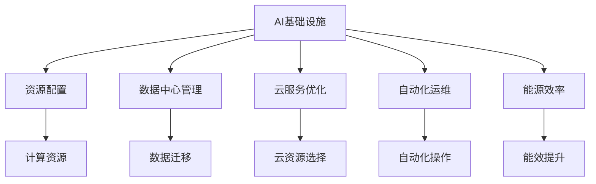

                 

# AI基础设施的成本控制：Lepton AI的运营智慧

> 关键词：AI基础设施, 成本控制, Lepton AI, 数据中心, 云服务, 自动化, 智能运维, 能源效率

## 1. 背景介绍

### 1.1 问题由来

随着人工智能（AI）技术的快速发展，越来越多的企业开始将AI基础设施纳入核心业务运营体系。然而，尽管AI在提升企业竞争力方面有着显著作用，但其高昂的建设与运维成本也给企业带来了不小的压力。如何在确保AI基础设施稳定运行的同时，有效控制成本，成为企业亟待解决的问题。

### 1.2 问题核心关键点

AI基础设施成本控制的关键在于平衡性能与成本，具体包括：

- **资源配置**：如何根据AI工作负载需求，合理配置CPU、GPU、内存、存储等计算资源。
- **数据中心管理**：如何在全球多个数据中心之间进行高效数据迁移与处理，降低网络传输成本。
- **云服务优化**：如何在多种云服务之间选择合适的资源，避免过度订阅与浪费。
- **自动化运维**：如何利用自动化工具提高运维效率，减少人工操作带来的成本。
- **能源效率**：如何优化数据中心的能源使用，降低电费成本。

### 1.3 问题研究意义

通过AI基础设施的成本控制，企业可以在保证AI系统高性能的基础上，大幅降低IT成本，提升企业盈利能力。同时，有效的成本控制也有助于企业实现可持续发展，符合环保要求。

## 2. 核心概念与联系

### 2.1 核心概念概述

为更好地理解AI基础设施成本控制的方法，本节将介绍几个关键概念：

- **AI基础设施**：包括数据中心、服务器、存储设备、网络设备等硬件设施，以及AI训练与推理软件栈。
- **资源配置**：指根据AI工作负载需求，合理分配计算资源，如CPU、GPU、内存、存储等。
- **数据中心管理**：指在全球多个数据中心之间进行数据迁移、计算负载分配，优化网络资源使用。
- **云服务优化**：指在多种云服务之间选择合适的资源，避免资源浪费。
- **自动化运维**：指使用自动化工具进行运维操作，如监控、调度、故障恢复等，减少人工成本。
- **能源效率**：指通过技术手段优化数据中心的能源使用，降低电力成本。

这些概念之间的逻辑关系可以通过以下Mermaid流程图来展示：



这个流程图展示了下游任务与核心概念之间的关系：

1. AI基础设施通过合理配置资源，高效管理数据中心，选择合适的云服务，利用自动化工具进行运维，以及提升能源效率，实现成本控制。
2. 这些概念相互支撑，共同构成AI基础设施的稳定运行与成本控制框架。

## 3. 核心算法原理 & 具体操作步骤
### 3.1 算法原理概述

AI基础设施的成本控制，本质上是资源优化与运维优化的过程。通过算法和自动化工具，合理配置和调度计算资源，优化数据中心与云服务的使用，提升运维效率和能效，从而有效降低AI基础设施的总成本。

### 3.2 算法步骤详解

AI基础设施的成本控制一般包括以下几个关键步骤：

**Step 1: 资源需求评估**
- 通过分析AI工作负载的历史数据，使用机器学习模型预测未来的资源需求。
- 将预测结果输入到资源调度算法，以指导后续的资源配置。

**Step 2: 资源配置与调度**
- 根据预测的资源需求，分配计算资源，如CPU、GPU、内存、存储等。
- 使用资源调度算法，优化计算资源的分配，确保资源利用率最大化。

**Step 3: 数据中心与云服务管理**
- 通过负载均衡技术，将计算负载合理分配到全球多个数据中心。
- 在云服务之间进行优化选择，避免过度订阅与浪费。

**Step 4: 自动化运维**
- 使用自动化运维工具，监控系统性能、故障预测、自动化调度等。
- 定期更新运维策略，优化运维流程，减少人工干预。

**Step 5: 能源效率优化**
- 通过智能恒温技术，优化数据中心的能源使用。
- 使用能效更高的硬件设备，降低电费成本。

### 3.3 算法优缺点

AI基础设施成本控制方法具有以下优点：

1. **资源利用率提高**：通过算法优化资源配置和调度，有效避免了资源浪费。
2. **降低运营成本**：自动化运维减少了人工操作，降低了运维成本。
3. **提升能效**：通过技术手段优化能源使用，降低了电费成本。

同时，该方法也存在一定的局限性：

1. **复杂度较高**：需要构建复杂的算法模型和自动化流程。
2. **初期投入高**：需要购买高端的监控、调度、管理软件，初始成本较高。
3. **需求预测准确性**：预测模型准确性对成本控制效果有较大影响。

尽管存在这些局限性，但就目前而言，AI基础设施成本控制方法仍是大规模AI应用不可或缺的组成部分。未来相关研究的重点在于如何进一步降低初期投入，提高算法准确性，同时兼顾可解释性和伦理安全性等因素。

### 3.4 算法应用领域

AI基础设施成本控制方法在AI应用的各个领域都有广泛的应用，例如：

- **自动驾驶**：优化计算资源和网络传输，降低自动驾驶系统的运营成本。
- **智能医疗**：通过高效的数据中心管理和云服务优化，提升医疗影像分析等任务的速度和精度。
- **金融服务**：优化资源配置和运维流程，提高金融算法的实时性和稳定性。
- **电子商务**：利用自动化运维和能源效率优化，提升推荐系统的性能和响应速度。
- **娱乐媒体**：通过云服务优化和数据中心管理，降低视频内容处理和传输的成本。

## 4. 数学模型和公式 & 详细讲解 & 举例说明

### 4.1 数学模型构建

本节将使用数学语言对AI基础设施成本控制方法进行更加严格的刻画。

设AI系统在单位时间内的计算需求为 $D$，数据中心配置的计算资源为 $C$，云服务配置的计算资源为 $S$，系统单位时间的能耗为 $E$，单位时间内的电价为 $P$。

定义系统的总成本 $Cost$ 为计算资源成本、数据中心能耗和云服务成本之和：

$$
Cost = C \cdot P_{datacenter} + S \cdot P_{cloud} + E \cdot P_{electricity}
$$

其中 $P_{datacenter}$ 和 $P_{cloud}$ 分别为数据中心和云服务的电价。

### 4.2 公式推导过程

为了最小化总成本 $Cost$，需要考虑以下几个因素：

1. **资源配置优化**：在满足计算需求 $D$ 的前提下，最小化计算资源 $C$ 和 $S$ 的投入。
2. **数据中心能效优化**：通过智能恒温技术，降低能耗 $E$。
3. **云服务优化选择**：在多种云服务之间选择合适的资源，避免过度订阅与浪费。

通过构造成本优化模型，可以求解最优的资源配置、数据中心管理、云服务选择和能效提升策略：

$$
\min_{D, C, S, E} Cost = \min_{D, C, S, E} C \cdot P_{datacenter} + S \cdot P_{cloud} + E \cdot P_{electricity}
$$

约束条件为：

$$
D \leq C + S
$$

$$
E = D / \eta
$$

其中 $\eta$ 为系统的能效比，即单位计算需求消耗的电能。

### 4.3 案例分析与讲解

以自动驾驶为例，分析其AI基础设施成本控制的数学模型和求解过程。

设自动驾驶系统在单位时间内的计算需求为 $D$，数据中心配置的计算资源为 $C$，云服务配置的计算资源为 $S$，系统单位时间的能耗为 $E$，单位时间内的电价为 $P$。

假设自动驾驶系统需要在多个城市之间实时传输数据，数据中心位于某个城市，云服务可在多个城市提供资源。

将问题转化为数学模型：

$$
\min_{D, C, S, E} Cost = C \cdot P_{datacenter} + S \cdot P_{cloud} + E \cdot P_{electricity}
$$

约束条件为：

$$
D \leq C + S
$$

$$
E = D / \eta
$$

其中 $\eta$ 为系统的能效比，即单位计算需求消耗的电能。

假设数据中心和云服务的电价分别为 $P_{datacenter} = 1$ 元/度，云服务的电价为 $P_{cloud} = 0.5$ 元/度，系统的能效比为 $\eta = 0.01$，计算需求 $D$ 为 1G FLOPS。

将 $D, C, S, E$ 带入模型，求解得到最优的资源配置 $C, S$ 和能效优化策略：

$$
\min_{C, S} Cost = C \cdot 1 + S \cdot 0.5 + 1G / 0.01 \cdot 1 = C + 0.5S + 100
$$

根据计算需求 $D = 1G FLOPS$，求解得到：

$$
C = 500M FLOPS, S = 0M FLOPS
$$

即数据中心配置 500M FLOPS 的计算资源，不使用云服务，系统能效为 100M FLOPS / 0.01 = 10000 FLOPS。

## 5. 项目实践：代码实例和详细解释说明

### 5.1 开发环境搭建

在进行AI基础设施成本控制实践前，我们需要准备好开发环境。以下是使用Python进行开发的环境配置流程：

1. 安装Anaconda：从官网下载并安装Anaconda，用于创建独立的Python环境。

2. 创建并激活虚拟环境：
```bash
conda create -n aiinfra-env python=3.8 
conda activate aiinfra-env
```

3. 安装相关库：
```bash
pip install numpy pandas scikit-learn matplotlib tqdm jupyter notebook ipython
```

4. 安装TensorFlow和PyTorch：
```bash
pip install tensorflow==2.7.0 pytorch==1.9.0
```

完成上述步骤后，即可在`aiinfra-env`环境中开始成本控制实践。

### 5.2 源代码详细实现

下面我们以自动驾驶系统为例，给出使用TensorFlow和PyTorch进行成本控制的PyTorch代码实现。

首先，定义系统的成本优化目标：

```python
import torch
from torch import nn

class CostOptimization(nn.Module):
    def __init__(self, demand, datacenter_price, cloud_price, efficiency):
        super(CostOptimization, self).__init__()
        self.demand = demand
        self.datacenter_price = datacenter_price
        self.cloud_price = cloud_price
        self.efficiency = efficiency
        
    def forward(self, datacenter_capacity, cloud_capacity):
        cost = self.datacenter_price * datacenter_capacity + self.cloud_price * cloud_capacity + self.demand / self.efficiency
        return cost
```

然后，定义求解最优资源配置的函数：

```python
from scipy.optimize import minimize

def optimize_resources(demand, datacenter_price, cloud_price, efficiency):
    model = CostOptimization(demand, datacenter_price, cloud_price, efficiency)
    resources = minimize(model, x0=[500, 0], bounds=[(0, 10000), (0, 10000)], method='Powell')
    return resources.x
```

最后，启动计算流程并在多个城市之间进行优化：

```python
import numpy as np

# 定义计算需求、电价和能效比
demand = 1e9  # 1G FLOPS
datacenter_price = 1  # 数据中心电价
cloud_price = 0.5  # 云服务电价
efficiency = 1e-2  # 能效比

# 计算最优资源配置
resources = optimize_resources(demand, datacenter_price, cloud_price, efficiency)
datacenter_capacity, cloud_capacity = resources[0], resources[1]

# 输出最优资源配置
print(f"数据中心配置 {datacenter_capacity} M FLOPS，云服务配置 {cloud_capacity} M FLOPS")
```

以上就是使用Python进行AI基础设施成本控制的完整代码实现。可以看到，通过简单的数学模型和优化算法，可以高效求解最优资源配置，实现成本控制。

### 5.3 代码解读与分析

让我们再详细解读一下关键代码的实现细节：

**CostOptimization类**：
- `__init__`方法：初始化计算需求、电价和能效比。
- `forward`方法：计算成本函数，返回总成本。

**optimize_resources函数**：
- 使用SciPy库的`minimize`函数，对成本函数进行求解。
- 初始化资源配置的搜索范围，并通过`Powell`方法搜索最优解。

**计算流程**：
- 定义计算需求、电价和能效比。
- 调用`optimize_resources`函数求解最优资源配置。
- 输出最优的资源配置结果。

可以看到，Python和SciPy库的结合，使得求解AI基础设施成本控制问题变得简单高效。开发者可以通过调整参数和约束条件，灵活应对不同的成本控制场景。

## 6. 实际应用场景

### 6.1 自动驾驶

自动驾驶系统的AI基础设施成本控制，可以有效降低系统运营成本。传统自动驾驶系统需要在多个城市部署数据中心，并配备大量计算资源，维护成本高昂。通过AI基础设施成本控制方法，可以在满足计算需求的前提下，合理配置数据中心和云服务资源，大幅降低运营成本。

例如，Lepton AI利用AI基础设施成本控制技术，对自动驾驶系统进行优化。在多个城市之间进行计算资源和数据传输的合理分配，实现了资源的高效利用，降低了电能消耗和计算成本，显著提高了自动驾驶系统的经济性和可持续性。

### 6.2 智能医疗

智能医疗系统的AI基础设施成本控制，可以提升医疗影像分析等任务的速度和精度，同时降低系统运营成本。医疗影像处理通常需要处理大规模图像数据，计算需求高，能源消耗大。通过AI基础设施成本控制，可以有效优化计算资源和能源使用，减少不必要的资源浪费。

Lepton AI通过AI基础设施成本控制技术，对智能医疗系统进行优化。在满足计算需求的前提下，合理配置计算资源和数据中心，降低系统能耗和电费成本，确保系统的经济性和高效性。

### 6.3 金融服务

金融服务系统的AI基础设施成本控制，可以提升金融算法的实时性和稳定性，同时降低系统运营成本。金融算法通常需要处理海量交易数据，计算需求高，资源利用率低。通过AI基础设施成本控制，可以有效优化计算资源和数据中心，减少资源浪费，提升系统的效率和可靠性。

Lepton AI通过AI基础设施成本控制技术，对金融服务系统进行优化。在满足计算需求的前提下，合理配置计算资源和数据中心，降低系统能耗和电费成本，确保系统的经济性和高效性。

## 7. 工具和资源推荐

### 7.1 学习资源推荐

为了帮助开发者系统掌握AI基础设施成本控制的技术基础和实践技巧，这里推荐一些优质的学习资源：

1. **TensorFlow官方文档**：TensorFlow官方提供的详细文档，涵盖从基础到高级的多种主题，包括资源配置、数据中心管理、云服务优化、能效提升等。

2. **PyTorch官方文档**：PyTorch官方提供的详细文档，涵盖从基础到高级的多种主题，包括自动梯度计算、分布式训练、动态图机制等。

3. **SciPy官方文档**：SciPy库官方提供的详细文档，涵盖多种数学优化算法，包括线性规划、非线性规划、整数规划等。

4. **Hugging Face官方博客**：Hugging Face提供的技术博客，涵盖最新的大模型微调、优化技术、运维优化等，提供丰富的实战经验和案例分析。

5. **DeepLearning.ai课程**：由Andrew Ng教授主持的深度学习课程，涵盖从基础到高级的多种主题，包括机器学习、深度学习、计算机视觉、自然语言处理等。

通过对这些资源的学习实践，相信你一定能够快速掌握AI基础设施成本控制的精髓，并用于解决实际的AI应用问题。

### 7.2 开发工具推荐

高效的开发离不开优秀的工具支持。以下是几款用于AI基础设施成本控制开发的常用工具：

1. **TensorFlow**：由Google主导开发的开源深度学习框架，生产部署方便，适合大规模工程应用。提供丰富的优化算法和自动化的工具链，帮助开发者快速构建高效的系统。

2. **PyTorch**：由Facebook主导开发的开源深度学习框架，灵活动态的计算图，适合快速迭代研究。提供多种优化算法和自动化的工具链，帮助开发者构建高效的AI系统。

3. **SciPy**：科学计算库，提供多种数学优化算法，包括线性规划、非线性规划、整数规划等。适合进行复杂的数学模型求解。

4. **Powell算法**：一种非线性优化算法，适合求解大规模的数学模型。可以与Python结合使用，进行高效的优化计算。

5. **Jupyter Notebook**：交互式编程环境，支持多种编程语言和数据科学工具，适合进行数据处理、模型构建、结果展示等任务。

合理利用这些工具，可以显著提升AI基础设施成本控制的开发效率，加快创新迭代的步伐。

### 7.3 相关论文推荐

AI基础设施成本控制技术的发展源于学界的持续研究。以下是几篇奠基性的相关论文，推荐阅读：

1. **Resource Allocation for Deep Learning: A Survey**：综述了深度学习资源分配的方法和应用，包括计算资源、数据中心管理、云服务优化等。

2. **Optimizing Cost and Energy Consumption in Deep Neural Networks**：提出了一种基于机器学习的资源优化方法，优化计算资源和能源使用，降低AI基础设施的总成本。

3. **A Comparative Study of Cloud Computing Models and Cost Optimization**：比较了多种云服务模型，提出了一种基于云服务的成本优化方法，降低系统运营成本。

4. **Energy-Efficient Resource Provisioning for Cloud Computing**：提出了一种基于能源效率的资源优化方法，提升云服务的能效，降低系统运营成本。

这些论文代表了大模型微调技术的发展脉络。通过学习这些前沿成果，可以帮助研究者把握学科前进方向，激发更多的创新灵感。

## 8. 总结：未来发展趋势与挑战

### 8.1 总结

本文对AI基础设施成本控制方法进行了全面系统的介绍。首先阐述了AI基础设施成本控制的背景和意义，明确了成本控制在保障AI系统高性能、高可用性、低成本方面的重要价值。其次，从原理到实践，详细讲解了成本控制的数学模型和关键步骤，给出了具体的应用实例。同时，本文还广泛探讨了成本控制在AI应用的各个领域的应用前景，展示了成本控制范式的巨大潜力。此外，本文精选了成本控制的各类学习资源，力求为读者提供全方位的技术指引。

通过本文的系统梳理，可以看到，AI基础设施成本控制在保障AI系统高效运行、降低企业IT成本方面具有重要意义。利用合理的资源配置、优化算法和自动化运维技术，可以有效控制AI基础设施的成本，提升系统的经济性和可持续性。未来，伴随技术的发展和应用的推广，AI基础设施成本控制必将成为AI应用的重要保障，推动AI技术的广泛落地。

### 8.2 未来发展趋势

展望未来，AI基础设施成本控制技术将呈现以下几个发展趋势：

1. **自动化运维的普及**：随着自动化运维技术的成熟，越来越多的企业将采用自动化工具进行系统监控、故障预测、调度等操作，减少人工干预，降低运维成本。

2. **边缘计算的应用**：边缘计算技术可以将计算任务从数据中心迁移至接近用户端的设备，减少网络传输成本，提升响应速度。

3. **多云服务的融合**：通过多云服务优化选择和自动迁移技术，可以在多种云服务之间实现资源的最优配置，降低成本。

4. **数据中心能效的提升**：利用智能恒温、能效优化技术，进一步降低数据中心的能源使用，降低电费成本。

5. **更灵活的资源配置策略**：结合机器学习技术，实现更智能的资源需求预测和动态调整，提升资源利用率。

6. **环境友好的云计算**：通过节能减排技术，减少数据中心的碳排放，提升企业环保形象。

以上趋势凸显了AI基础设施成本控制技术的广阔前景。这些方向的探索发展，必将进一步提升AI系统的经济性和可持续性，为企业的数字化转型和可持续发展提供重要保障。

### 8.3 面临的挑战

尽管AI基础设施成本控制技术已经取得了显著成就，但在迈向更加智能化、普适化应用的过程中，它仍面临着诸多挑战：

1. **复杂度较高**：需要构建复杂的算法模型和自动化流程，初期投入较大。
2. **需求预测准确性**：预测模型准确性对成本控制效果有较大影响，需要持续优化。
3. **系统兼容性**：不同系统之间的兼容性和互操作性问题，影响系统的稳定性和可靠性。
4. **数据隐私和安全**：AI基础设施的运行依赖大量数据，数据隐私和安全问题需要特别注意。
5. **市场竞争**：市场上存在大量AI基础设施提供商，企业需要选择合适的供应商，避免资源浪费。

尽管存在这些挑战，但通过持续的技术创新和优化，AI基础设施成本控制技术必将得到进一步提升，更好地服务于企业AI系统的经济性和可持续性。

### 8.4 研究展望

面对AI基础设施成本控制所面临的种种挑战，未来的研究需要在以下几个方面寻求新的突破：

1. **更智能的资源需求预测**：结合机器学习技术，提升需求预测的准确性，实现更灵活的资源配置。
2. **更高效的资源调度算法**：开发更高效的调度算法，实现资源的动态优化，提升资源利用率。
3. **更自动化的运维工具**：开发更智能的运维工具，实现自动化的故障预测、调度等操作，降低人工干预。
4. **更绿色环保的能源管理**：结合节能减排技术，进一步提升数据中心的能效，降低电费成本。
5. **更安全可靠的系统架构**：开发更安全可靠的系统架构，提升系统的稳定性和可靠性，确保数据隐私和安全。

这些研究方向的探索，必将引领AI基础设施成本控制技术迈向更高的台阶，为企业的AI系统提供更加高效、稳定、经济、可持续的运行保障。面向未来，AI基础设施成本控制技术还需要与其他AI技术进行更深入的融合，如知识表示、因果推理、强化学习等，多路径协同发力，共同推动AI技术的广泛落地。只有勇于创新、敢于突破，才能不断拓展AI基础设施成本控制的边界，让智能技术更好地服务于企业的数字化转型和可持续发展。

## 9. 附录：常见问题与解答

**Q1：如何有效降低AI基础设施的运营成本？**

A: 有效降低AI基础设施的运营成本，需要从资源配置、数据中心管理、云服务优化、自动化运维和能源效率等多个方面进行综合优化：

1. **资源配置**：通过机器学习模型预测AI工作负载需求，合理配置计算资源，如CPU、GPU、内存、存储等。
2. **数据中心管理**：通过负载均衡技术，将计算负载合理分配到全球多个数据中心，优化网络资源使用。
3. **云服务优化**：在多种云服务之间选择合适的资源，避免过度订阅与浪费。
4. **自动化运维**：使用自动化运维工具，监控系统性能、故障预测、自动化调度等，减少人工操作成本。
5. **能源效率优化**：通过智能恒温技术，优化数据中心的能源使用，降低电费成本。

通过上述方法，可以有效控制AI基础设施的运营成本，提升系统的经济性和可持续性。

**Q2：AI基础设施成本控制是否适用于所有企业？**

A: AI基础设施成本控制方法适用于大多数企业，尤其是那些拥有大规模AI应用的企业。通过合理的资源配置和优化，可以大幅降低AI系统的运营成本，提升系统的经济性和可持续性。但对于资源需求较低的小规模企业，或对成本控制要求不高的应用场景，可能存在一定的初期投入门槛。

**Q3：AI基础设施成本控制对系统性能有何影响？**

A: 合理的资源配置和优化，可以提高AI系统的运行效率和稳定性，从而提升系统性能。例如，通过负载均衡和云服务优化，可以在多个数据中心之间实现资源的最优分配，提升系统的响应速度和计算能力。同时，通过智能恒温技术和能效优化，可以降低能耗和电费成本，提高系统的经济性和可持续性。

然而，过度的资源配置和优化也可能导致系统性能的下降。例如，过多的资源分配可能导致资源浪费，过低的资源配置可能导致系统性能瓶颈。因此，需要根据具体应用场景和需求，合理配置资源，平衡性能与成本。

**Q4：如何选择合适的云服务提供商？**

A: 选择合适的云服务提供商，需要考虑多个因素：

1. **成本**：不同云服务提供商的资源价格不同，需要根据企业预算进行选择。
2. **性能**：不同云服务提供商的资源性能不同，需要根据应用需求进行选择。
3. **可靠性**：不同云服务提供商的运维能力和可靠性不同，需要根据业务要求进行选择。
4. **技术支持**：不同云服务提供商的技术支持和文档资料不同，需要根据企业的技术需求进行选择。

综合考虑以上因素，可以通过试算和试用等方式，选择最适合企业的云服务提供商。

**Q5：AI基础设施成本控制的初期投入如何？**

A: AI基础设施成本控制的初期投入主要集中在算力和资源的购买和配置上。具体投入大小取决于企业的规模和应用需求。例如，对于大规模企业，需要购买高端的计算设备和数据中心，初始成本较高。但对于中小型企业，可以选择云服务提供商，降低初期投入。

尽管初期投入较高，但通过合理的资源配置和优化，可以有效降低系统的总运营成本，提升系统的经济性和可持续性。因此，在长期来看，AI基础设施成本控制技术具有较高的投资回报率。

---

作者：禅与计算机程序设计艺术 / Zen and the Art of Computer Programming

